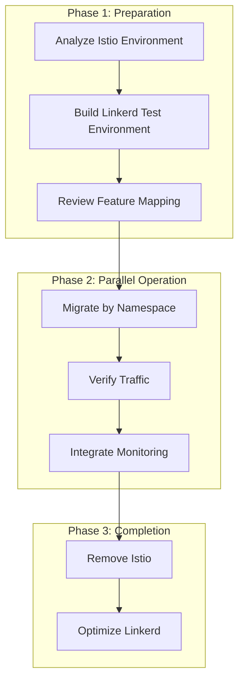

# Linkerd Best Practices

> **Supported Versions**: Linkerd 2.16+
> **Last Updated**: February 21, 2026

## Overview

This document covers best practices for operating Linkerd reliably in production environments. It includes production readiness checklists, resource allocation, high availability configuration, upgrade strategies, performance tuning, and troubleshooting guides.

## Production Readiness Checklist

### Required Items

```yaml
# Pre-deployment verification checklist
Checklist:
  Infrastructure:
    - [ ] HA configuration applied (3 control plane replicas)
    - [ ] PodDisruptionBudget configured
    - [ ] Node anti-affinity configured
    - [ ] Appropriate resource allocation

  Security:
    - [ ] Trust Anchor validity verified (minimum 1 year recommended)
    - [ ] Identity Issuer validity verified
    - [ ] Automatic certificate renewal configured
    - [ ] default-deny policy reviewed

  Observability:
    - [ ] Prometheus metrics collection configured
    - [ ] Grafana dashboards set up
    - [ ] Alert rules configured
    - [ ] Log collection configured

  Operations:
    - [ ] Backup and recovery procedures documented
    - [ ] Upgrade procedures documented
    - [ ] Rollback procedures tested
    - [ ] Team training completed
```

### Verification Commands

```bash
# Full status check
linkerd check

# Proxy status check
linkerd check --proxy

# Certificate expiration check
linkerd check --proxy 2>&1 | grep -A5 "certificate"

# Control plane status
kubectl get pods -n linkerd
```

## Resource Allocation Recommendations

### Control Plane

```yaml
# HA production configuration
# ha-values.yaml

# Destination Controller
destination:
  replicas: 3
  resources:
    cpu:
      request: 100m
      limit: 1000m
    memory:
      request: 50Mi
      limit: 250Mi

# Identity Controller
identity:
  replicas: 3
  resources:
    cpu:
      request: 100m
      limit: 1000m
    memory:
      request: 10Mi
      limit: 250Mi

# Proxy Injector
proxyInjector:
  replicas: 3
  resources:
    cpu:
      request: 100m
      limit: 1000m
    memory:
      request: 50Mi
      limit: 250Mi
```

### Data Plane (Proxy)

```yaml
# Proxy resource recommendations by workload type

# General workloads
proxy:
  resources:
    cpu:
      request: 100m
      limit: 1000m
    memory:
      request: 64Mi
      limit: 250Mi

# High-traffic workloads (1000+ RPS)
proxy:
  resources:
    cpu:
      request: 500m
      limit: 2000m
    memory:
      request: 128Mi
      limit: 500Mi

# Low-traffic workloads (batch jobs, etc.)
proxy:
  resources:
    cpu:
      request: 50m
      limit: 500m
    memory:
      request: 32Mi
      limit: 128Mi
```

### Per-Pod Resource Overrides

```yaml
apiVersion: apps/v1
kind: Deployment
metadata:
  name: high-traffic-service
spec:
  template:
    metadata:
      annotations:
        # CPU settings
        config.linkerd.io/proxy-cpu-request: "500m"
        config.linkerd.io/proxy-cpu-limit: "2000m"
        # Memory settings
        config.linkerd.io/proxy-memory-request: "128Mi"
        config.linkerd.io/proxy-memory-limit: "500Mi"
```

## High Availability (HA) Configuration

### Control Plane HA

```yaml
# ha-control-plane.yaml
enablePodAntiAffinity: true
controllerReplicas: 3

# Pod anti-affinity
podAntiAffinity:
  requiredDuringSchedulingIgnoredDuringExecution:
  - labelSelector:
      matchExpressions:
      - key: linkerd.io/control-plane-component
        operator: In
        values:
        - destination
        - identity
        - proxy-injector
    topologyKey: kubernetes.io/hostname

# Topology spread
topologySpreadConstraints:
  - maxSkew: 1
    topologyKey: topology.kubernetes.io/zone
    whenUnsatisfiable: DoNotSchedule
    labelSelector:
      matchLabels:
        linkerd.io/control-plane-ns: linkerd

# PDB
podDisruptionBudget:
  maxUnavailable: 1
```

### Viz Extension HA

```yaml
# viz-ha-values.yaml
prometheus:
  replicas: 2
  resources:
    cpu:
      request: 300m
      limit: 1000m
    memory:
      request: 300Mi
      limit: 1Gi
  persistence:
    enabled: true
    size: 50Gi

tap:
  replicas: 2
  resources:
    cpu:
      request: 100m
      limit: 500m
    memory:
      request: 50Mi
      limit: 250Mi

metricsAPI:
  replicas: 2
```

## Upgrade Strategy

### Stable Channel Upgrade

```bash
# 1. Preparation
# Check current version
linkerd version

# Check upgrade eligibility
linkerd check --pre

# 2. CLI upgrade
curl --proto '=https' --tlsv1.2 -sSfL https://run.linkerd.io/install | sh

# 3. CRD upgrade (do first)
linkerd upgrade --crds | kubectl apply -f -

# 4. Control plane upgrade
linkerd upgrade | kubectl apply -f -

# 5. Verify
linkerd check

# 6. Viz upgrade
linkerd viz upgrade | kubectl apply -f -
linkerd viz check

# 7. Data plane upgrade (rolling restart)
# Important: Don't restart all services at once
for ns in production staging; do
  for deploy in $(kubectl get deploy -n $ns -o name); do
    kubectl rollout restart $deploy -n $ns
    kubectl rollout status $deploy -n $ns
    sleep 30  # Wait for stabilization
  done
done
```

### Helm Upgrade

```bash
# 1. Update Helm repository
helm repo update

# 2. Backup current values
helm get values linkerd-control-plane -n linkerd > current-values.yaml

# 3. CRD upgrade
helm upgrade linkerd-crds linkerd/linkerd-crds -n linkerd --wait

# 4. Control plane upgrade
helm upgrade linkerd-control-plane linkerd/linkerd-control-plane \
  -n linkerd \
  -f current-values.yaml \
  --wait

# 5. Viz upgrade
helm upgrade linkerd-viz linkerd/linkerd-viz -n linkerd-viz --wait
```

### Blue-Green Upgrade (Advanced)

```bash
# Install to new control plane namespace
linkerd install --linkerd-namespace linkerd-new | kubectl apply -f -

# Verify new control plane
linkerd --linkerd-namespace linkerd-new check

# Progressively migrate workloads
kubectl annotate namespace my-app linkerd.io/inject=enabled \
  config.linkerd.io/proxy-version=stable-2.17.0

# Remove old control plane after full migration
linkerd --linkerd-namespace linkerd uninstall | kubectl delete -f -
```

### Rollback Procedure

```bash
# Rollback when issues occur

# 1. Install previous version CLI
curl --proto '=https' --tlsv1.2 -sSfL https://run.linkerd.io/install | \
  sh -s -- --version stable-2.15.0

# 2. Rollback control plane
linkerd upgrade | kubectl apply -f -

# 3. Rollback data plane (if needed)
kubectl rollout restart deploy -n my-app
```

## Namespace and Injection Strategy

### Namespace-Level Injection

```yaml
# Recommended: Manage injection at namespace level
apiVersion: v1
kind: Namespace
metadata:
  name: production
  annotations:
    linkerd.io/inject: enabled

---
# Exclude specific services
apiVersion: v1
kind: Namespace
metadata:
  name: legacy-services
  annotations:
    linkerd.io/inject: disabled
```

### Pod-Level Injection Control

```yaml
# Disable injection for specific Pod
apiVersion: apps/v1
kind: Deployment
metadata:
  name: legacy-app
spec:
  template:
    metadata:
      annotations:
        linkerd.io/inject: disabled

---
# Exclude specific ports
apiVersion: apps/v1
kind: Deployment
metadata:
  name: database
spec:
  template:
    metadata:
      annotations:
        # Database port bypasses proxy
        config.linkerd.io/skip-inbound-ports: "5432"
        config.linkerd.io/skip-outbound-ports: "5432"
```

### Opaque Port Configuration

```yaml
# Specify ports to bypass protocol detection
apiVersion: apps/v1
kind: Deployment
metadata:
  name: mysql
spec:
  template:
    metadata:
      annotations:
        # Treat MySQL as opaque
        config.linkerd.io/opaque-ports: "3306"
```

## Performance Tuning

### Proxy Concurrency Settings

```yaml
# Optimize proxy performance for high-traffic environments
apiVersion: apps/v1
kind: Deployment
metadata:
  name: high-concurrency-service
spec:
  template:
    metadata:
      annotations:
        # Proxy worker thread count (default: core count)
        config.linkerd.io/proxy-cpu-limit: "4"
```

### Connection Pooling

```yaml
# Connection management optimization
# Linkerd automatically uses HTTP/2 multiplexing
# No additional configuration needed in most cases

# For HTTP/1.1 services
apiVersion: linkerd.io/v1alpha2
kind: ServiceProfile
metadata:
  name: http1-service.my-app.svc.cluster.local
spec:
  routes:
  - name: all
    condition:
      pathRegex: /.*
    timeout: 30s
```

### Latency Optimization

```yaml
# Latency-sensitive services
apiVersion: apps/v1
kind: Deployment
metadata:
  name: latency-sensitive
spec:
  template:
    metadata:
      annotations:
        # Disable debug logging (performance improvement)
        config.linkerd.io/proxy-log-level: "warn"
        # Skip unnecessary ports
        config.linkerd.io/skip-outbound-ports: "6379,11211"
```

## Certificate Rotation Scheduling

### Automatic Monitoring Setup

```yaml
# CronJob for certificate expiration monitoring
apiVersion: batch/v1
kind: CronJob
metadata:
  name: linkerd-cert-check
  namespace: linkerd
spec:
  schedule: "0 9 * * *"  # Daily at 9 AM
  jobTemplate:
    spec:
      template:
        spec:
          containers:
          - name: cert-check
            image: buoyantio/linkerd-cli:stable-2.16.0
            command:
            - /bin/sh
            - -c
            - |
              linkerd check --proxy 2>&1 | grep -i "certificate\|valid"
              # Add notification logic here
          restartPolicy: OnFailure
```

### cert-manager Auto-Renewal

```yaml
# Auto-renewal configuration with cert-manager
apiVersion: cert-manager.io/v1
kind: Certificate
metadata:
  name: linkerd-identity-issuer
  namespace: linkerd
spec:
  secretName: linkerd-identity-issuer
  duration: 8760h      # 1 year
  renewBefore: 720h    # Renew 30 days before
  issuerRef:
    name: linkerd-trust-anchor
    kind: Issuer
  commonName: identity.linkerd.cluster.local
  isCA: true
  privateKey:
    algorithm: ECDSA
    size: 256
```

## Troubleshooting Guide

### Common Issues and Solutions

#### Proxy Injection Failure

```bash
# Symptom: Pod doesn't have linkerd-proxy container

# Diagnosis
kubectl get ns my-app -o yaml | grep linkerd
kubectl describe pod my-pod -n my-app | grep -A5 "Annotations"

# Solution
# 1. Check namespace annotation
kubectl annotate ns my-app linkerd.io/inject=enabled --overwrite

# 2. Check webhook status
kubectl get mutatingwebhookconfiguration linkerd-proxy-injector-webhook-config

# 3. Check Proxy Injector logs
kubectl logs -n linkerd deploy/linkerd-proxy-injector
```

#### High Latency

```bash
# Symptom: Increased latency when passing through mesh

# Diagnosis
linkerd viz stat deploy -n my-app
linkerd viz tap deploy/my-service -n my-app --max-rps 100

# Solution
# 1. Check proxy resources
kubectl top pods -n my-app -c linkerd-proxy

# 2. Increase resources
kubectl patch deploy my-service -n my-app -p '
{
  "spec": {
    "template": {
      "metadata": {
        "annotations": {
          "config.linkerd.io/proxy-cpu-request": "500m",
          "config.linkerd.io/proxy-memory-request": "128Mi"
        }
      }
    }
  }
}'

# 3. Adjust ServiceProfile timeouts
```

#### mTLS Connection Failure

```bash
# Symptom: Service-to-service communication errors

# Diagnosis
linkerd viz tap deploy/client -n my-app --to deploy/server
linkerd viz edges deploy -n my-app

# Solution
# 1. Check certificate status
linkerd check --proxy

# 2. Check Identity controller logs
kubectl logs -n linkerd deploy/linkerd-identity

# 3. Check proxy certificate
kubectl exec -n my-app deploy/my-service -c linkerd-proxy -- \
  cat /var/run/linkerd/identity/end-entity.crt | \
  openssl x509 -noout -dates
```

#### Unstable Control Plane

```bash
# Symptom: linkerd check failures

# Diagnosis
kubectl get pods -n linkerd
kubectl describe pods -n linkerd
kubectl get events -n linkerd --sort-by='.lastTimestamp'

# Solution
# 1. Check for resource shortage
kubectl top pods -n linkerd

# 2. Restart control plane
kubectl rollout restart deploy -n linkerd

# 3. Re-verify status
linkerd check
```

### Debugging Command Collection

```bash
# Full status check
linkerd check
linkerd check --proxy

# Metrics check
linkerd viz stat deploy -n my-app
linkerd viz routes deploy/my-service -n my-app

# Real-time traffic
linkerd viz tap deploy/my-service -n my-app
linkerd viz top deploy/my-service -n my-app

# Connection status
linkerd viz edges deploy -n my-app

# Proxy logs
kubectl logs deploy/my-service -n my-app -c linkerd-proxy

# Control plane logs
kubectl logs -n linkerd deploy/linkerd-destination
kubectl logs -n linkerd deploy/linkerd-identity
kubectl logs -n linkerd deploy/linkerd-proxy-injector

# Diagnostic metrics
linkerd diagnostics proxy-metrics deploy/my-service -n my-app
```

## Migration from Istio

### Migration Strategy



### Feature Mapping

| Istio | Linkerd |
|-------|---------|
| VirtualService | ServiceProfile, HTTPRoute |
| DestinationRule | ServiceProfile |
| PeerAuthentication | Automatic mTLS (default) |
| AuthorizationPolicy | ServerAuthorization |
| Sidecar | Annotation-based configuration |
| Gateway | Separate Ingress required |

### Migration Steps

```bash
# 1. Disable Istio in namespace
kubectl label namespace my-app istio-injection-

# 2. Enable Linkerd injection
kubectl annotate namespace my-app linkerd.io/inject=enabled

# 3. Restart workloads
kubectl rollout restart deploy -n my-app

# 4. Verify traffic
linkerd viz stat deploy -n my-app
linkerd viz tap deploy/my-service -n my-app
```

## Checklist Summary

```yaml
Production Deployment Final Checklist:

  Installation:
    - [ ] All clusters configured with same Trust Anchor
    - [ ] Control plane installed in HA mode
    - [ ] Viz extension installed and configured

  Security:
    - [ ] Certificate validity 60+ days
    - [ ] default-deny policy reviewed
    - [ ] ServerAuthorization rules defined

  Observability:
    - [ ] Prometheus scraping configured
    - [ ] Grafana dashboards set up
    - [ ] Alert rules enabled

  Operations:
    - [ ] ServiceProfiles defined (key services)
    - [ ] Proxy resources tuned
    - [ ] Upgrade procedures documented
    - [ ] Rollback procedures tested
```

## References

- [Linkerd Production Guide](https://linkerd.io/2/tasks/installing-multicluster/)
- [HA Configuration](https://linkerd.io/2/features/ha/)
- [Upgrading Linkerd](https://linkerd.io/2/tasks/upgrade/)
- [Troubleshooting](https://linkerd.io/2/tasks/troubleshooting/)
