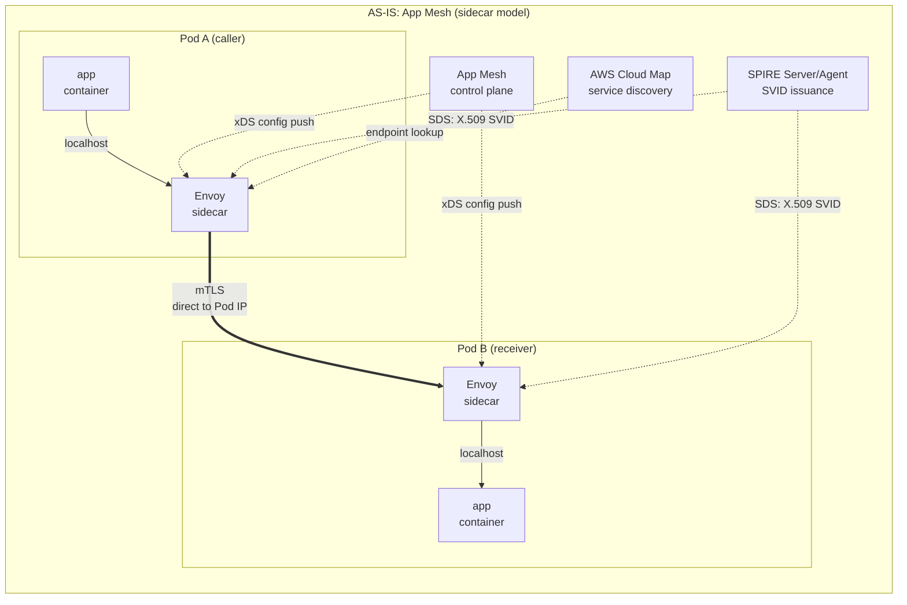
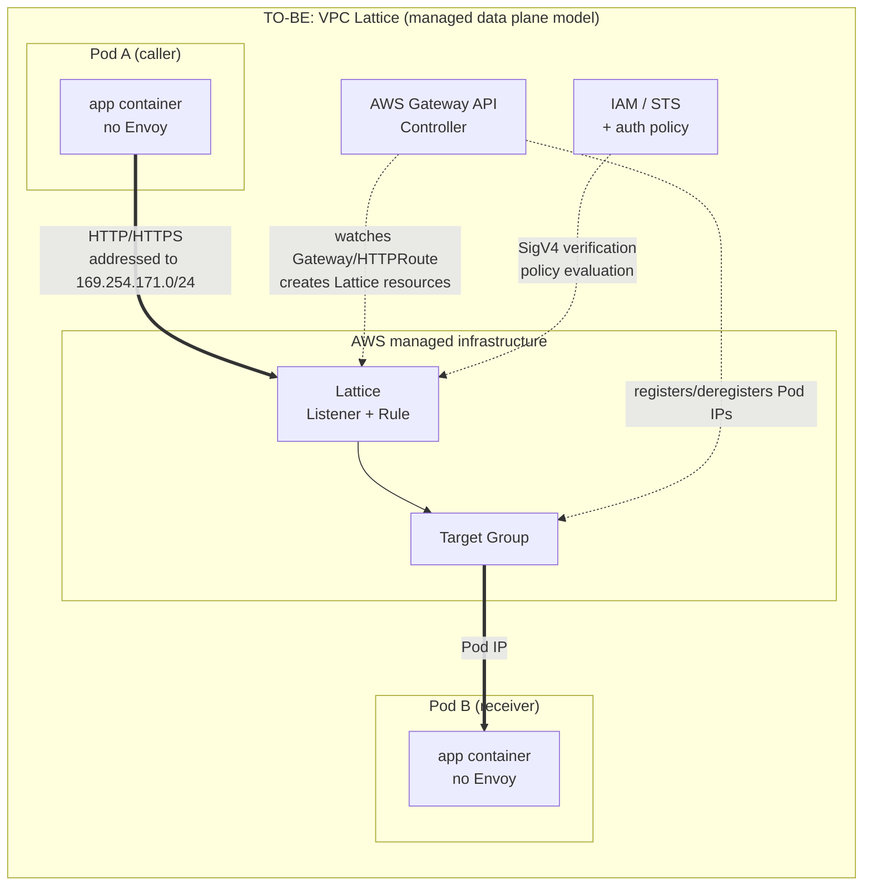

# App Mesh vs VPC Lattice Architecture

> **Supported Versions**: Amazon VPC Lattice (GA), AWS Gateway API Controller v1.1+, AWS App Mesh (end of support September 30, 2026)
> **Last Updated**: September 3, 2026

## What This Document Covers

- What problem each model — sidecar and managed data plane — was designed to solve
- How App Mesh resources map to Lattice resources, and why that mapping is not one-to-one
- The feature gaps that follow from the non-one-to-one parts, and what the AWS Gateway API Controller does in between

## Why the Two Models Were Designed Differently

### The sidecar model — put a proxy next to the application

App Mesh and Istio put an Envoy inside the Pod because **some decisions require the application's context.**

Remembering how many 5xx responses a given upstream instance recently returned so you can eject it from the pool (outlier detection), deciding whether to retry a request and whether to send the retry to a different instance (retry policy), failing fast once concurrent connections exceed a threshold (circuit breaker) — these decisions can only be made **on the caller side, holding caller-side state.** A proxy inside the calling Pod has that state naturally.

The cost is clear. Every Pod runs one more proxy process, that process consumes CPU and memory, every configuration change must be distributed to thousands of proxies, and an Envoy version upgrade triggers application restarts. **The customer operates both the control plane and the data plane.**

### The managed data plane model — push the proxy into the infrastructure

Lattice went the other direction. It pulls the proxy out of the Pod and places it in **infrastructure that AWS operates.** The client Pod sends an ordinary HTTP request knowing nothing, and when that request is addressed to a Lattice service, the infrastructure intercepts and handles it.

The problems this design solves are scale and heterogeneity. Because there is no sidecar, proxies do not multiply with Pod count, and EKS, ECS, EC2, and Lambda can all participate in the service network **the same way.** You cannot put an Envoy inside a Lambda function, but an infrastructure-layer proxy can serve Lambda too. VPC and account boundaries — even overlapping IP ranges — are absorbed by the infrastructure.

The cost is equally clear. **The party that held caller-side state is gone.** The infrastructure proxy sits in front of the service, so features that require remembering "what failures has this particular caller recently seen" and reacting per-caller are not provided. This is the root of every feature gap below.

## AS-IS / TO-BE Architecture

Three differences stand out.

1. **Number of proxy traversals**: AS-IS passes through **two** proxies — the caller's Envoy and the receiver's Envoy. TO-BE passes through Lattice **once.**
2. **Who owns the control plane**: In AS-IS, the App Mesh control plane pushes configuration to each Envoy via xDS and SPIRE issues certificates. In TO-BE these roles move into the AWS-managed domain, and all that remains in the customer cluster is a single Gateway API Controller Deployment.
3. **Where the connection terminates**: In AS-IS the caller's Envoy connects **directly to the receiver's Pod IP.** In TO-BE it connects to a Lattice address, and it is Lattice that knows the Pod IPs.

## Resource Mapping

| App Mesh | VPC Lattice | Relationship |
|---|---|---|
| **Mesh** | **Service Network** | Conceptually closest. But a Mesh is a Kubernetes-cluster-centric boundary while a Service Network is a boundary you **associate VPCs with** — the unit of participation differs |
| **VirtualService** | **Lattice Service** | Logical service name. A Lattice Service gets its own DNS name |
| **VirtualRouter** + **Route** | **Listener** + **Listener Rule** | VirtualRouter's per-protocol routing role is absorbed by Listener; Route's match/action by Listener Rule |
| **VirtualNode** | **Target Group** | VirtualNode packed "this workload's identity + backend config + listener config" into one resource; a Target Group expresses only the **set of backend targets** |
| **AWS Cloud Map** | **Not needed** | Lattice has service discovery built in. Cloud Map namespace/service management disappears |
| **Envoy sidecar** | **Removed** | Gone from the Pod. The data plane moves to AWS infrastructure |
| **VirtualGateway** | **Lattice Service + Listener** (or ALB/NLB) | North-South traffic is out of scope for the Gateway API Controller. That is AWS Load Balancer Controller territory |

### Why you must not read this as a one-to-one table

**The VirtualNode row is the problem.** An App Mesh VirtualNode expressed three things at once — who this workload is (identity, including backend TLS settings), where it goes (backends), and where it receives (listeners, health checks, connection pools, outlier detection). In Lattice those three scatter to different places.

- Only **part of "where it receives"** (the target set, health checks) becomes a Target Group
- **"Where it goes"** stops being a resource and becomes a matter of **auth policies and IAM permissions**
- **"Who it is"** becomes an **IAM Role**, not an SVID ([document 05](./05-spiffe-to-iam.md))
- **Connection pools and outlier detection** have **no corresponding resource at all**

In other words, even where the right-hand column is filled in, not every attribute the left-hand resource held moves across. **The table maps resource names, not capabilities.**

## Feature Gaps

The features that disappear are not accidental omissions — they are the **necessary consequence** of the design difference above. Lattice's proxy sits in front of the service (receiver side) and holds no per-caller state, so anything requiring a caller-side judgment structurally cannot be provided.

| Feature | App Mesh (Envoy) | VPC Lattice | Why it disappears | Alternative |
|---|---|---|---|---|
| **Circuit breaker** | ✅ connection pool thresholds | ❌ | Requires counting concurrent connections and pending requests on the caller side | Application libraries (Resilience4j, Polly, etc.) |
| **Outlier detection** | ✅ ejects instances after consecutive 5xx | ❌ | Requires per-caller upstream failure history | Target Group health checks (passive, periodic, not immediate) |
| **Fault injection** | ✅ inject delays and errors | ❌ | A chaos-testing feature, outside the scope of a managed data plane | Application layer, or a test-only proxy |
| **Traffic mirroring** | ✅ duplicate and forward traffic | ❌ | Request duplication amplifies proxy load, hard to offer on shared infrastructure | Dual calls from the application, or a separate mirroring layer |
| **Fine-grained retry policy** | ✅ conditions, counts, backoff, timeouts | ❌ | Retry is a caller-side decision | Application SDK retries (including AWS SDK default retries) |
| **Client mTLS** | ✅ mutual authentication | ❌ Lattice terminates server TLS but **does not request a client certificate** | The identity proof model itself changes to SigV4 request signing | IAM Auth (SigV4), or hand it to TLS Passthrough so endpoints do mTLS themselves |
| **Detailed Envoy metrics** | ✅ per-upstream histograms, retry counters, and many more | ⚠️ CloudWatch metrics + access logs | The producer of those metrics is gone | Ship Lattice access logs to CloudWatch/S3/Firehose |
| **Distributed trace spans** | ✅ Envoy creates and propagates spans | ❌ Lattice does not create X-Ray segments/spans and **does not inject trace IDs** | Same as above | Instrument the application (OpenTelemetry/ADOT). The Lattice hop is observable only through access logs |

### How to read these gaps in practice

The most consistently underestimated items in this table are the last two rows: **observability.**

Circuit breakers and retries have a clear alternative — "add a library to the application" — with a cost you can estimate. Observability looks like it has a clear alternative too, but it is a different kind of work. In AS-IS, the spans Envoy produced automatically came **without touching application code.** Getting the same level of tracing in TO-BE means adding OpenTelemetry instrumentation to every service, and that becomes a work item for application teams.

Also, **the Lattice hop itself has no span, so it remains a blank gap in the trace graph.** You end up inferring Lattice latency from the interval between where the caller's span ends and the receiver's span begins — and that interval mixes network latency with Lattice processing latency, with no way to separate them. Plan for the fact that during an incident, your only evidence for "is Lattice slow or is the network slow" will be access logs.

## The Role of the AWS Gateway API Controller

You can create Lattice resources directly with the CLI or console, but on EKS you normally use the **AWS Gateway API Controller.** It watches Kubernetes Gateway API resources inside the cluster and creates and deletes the corresponding Lattice resources.

| Kubernetes resource | Lattice resource created |
|---|---|
| `GatewayClass` (`amazon-vpc-lattice`) | — (declares Lattice as the data plane) |
| `Gateway` | Points to a **Service Network**. The Gateway name (without namespace) corresponds to the Service Network name; multiple Gateways sharing a name all point to the same Service Network |
| `HTTPRoute` / `GRPCRoute` | **Lattice Service** + **Listener Rule**. Each Route **gets its own domain name** |
| `TLSRoute` | A Lattice Service for TLS Passthrough (see [document 04](./04-networking-basics.md)) |
| The Service referenced by `backendRefs` | **Target Group** and the **Targets** in it |
| `TargetGroupPolicy` | Target Group protocol and health check settings |
| `IAMAuthPolicy` | Service network auth policy or service auth policy, depending on the attachment target ([document 03](./03-auth-flow.md)) |

### Why this controller is central to closing the gap

In App Mesh, Cloud Map and Envoy were what tracked Pod IPs. In Lattice, this controller plays that role.

The controller watches **endpoint changes** on the Kubernetes Services referenced by `backendRefs`. When a Deployment scales out and adds Pods, or a rolling update changes Pod IPs, the controller detects the change and **registers and deregisters** Targets in the Lattice Target Group. Keeping Kubernetes' declared state and Lattice's actual target list in sync is this controller's core job.

Two practical points follow.

**First, if the controller stops, the routing targets go stale.** Lattice keeps forwarding traffic, but newly started Pods are never registered as Targets and dead Pods are never deregistered. The availability and IAM permissions of the controller Deployment are directly tied to the reliability of the data path.

**Second, you can use Pod readiness gates.** You can make a Pod not be marked Ready until its Lattice Target Group health is `Healthy`, which makes a rolling update **not terminate old Pods until new Pods are healthy from Lattice's point of view.** This is an important mechanism for zero-downtime during migration.

### Scope limits of the controller

The Gateway API was designed to cover both North-South (Ingress) and East-West (Mesh) traffic, but **the AWS Gateway API Controller currently focuses only on East-West traffic through Lattice.** Do not expect ALB/NLB-style North-South features — those belong to the AWS Load Balancer Controller.

This matters especially in environments that also run ingress-nginx. The North-South traffic ingress-nginx handles is not in scope for this migration; only East-West traffic moves to Lattice. A configuration where both paths coexist is the normal outcome.

## Summary

- The sidecar model put the proxy in the Pod to enable **decisions that need caller-side state**; the managed data plane model pushed the proxy into infrastructure for **scale and platform heterogeneity**. The feature gaps are the consequence of that choice.
- The resource mapping table maps names. The attributes VirtualNode held either scatter across several places or vanish.
- The most underestimated gap is observability. Spans that Envoy gave you for free become an instrumentation project.
- The AWS Gateway API Controller is what reflects Kubernetes endpoint changes into Lattice Targets, and its availability is tied to data path reliability.

Next: [Latency Impact Analysis](./02-latency.md) examines how fewer proxy hops and an added VPC traversal work against each other.

## References

- [Migrating from AWS App Mesh to Amazon VPC Lattice (AWS Containers Blog)](https://aws.amazon.com/blogs/containers/migrating-from-aws-app-mesh-to-amazon-vpc-lattice/)
- [aws-samples/migrating-from-aws-app-mesh-to-amazon-vpc-lattice](https://github.com/aws-samples/migrating-from-aws-app-mesh-to-amazon-vpc-lattice)
- [AWS Gateway API Controller — Understanding the Gateway API Controller](https://www.gateway-api-controller.eks.aws.dev/latest/concepts/overview/)
- [AWS Gateway API Controller — Gateway API Reference](https://www.gateway-api-controller.eks.aws.dev/latest/api-types/gateway/)
- [Amazon VPC Lattice User Guide](https://docs.aws.amazon.com/vpc-lattice/latest/ug/what-is-vpc-lattice.html)
- [App Mesh Document history](https://docs.aws.amazon.com/app-mesh/latest/userguide/doc-history.html)
