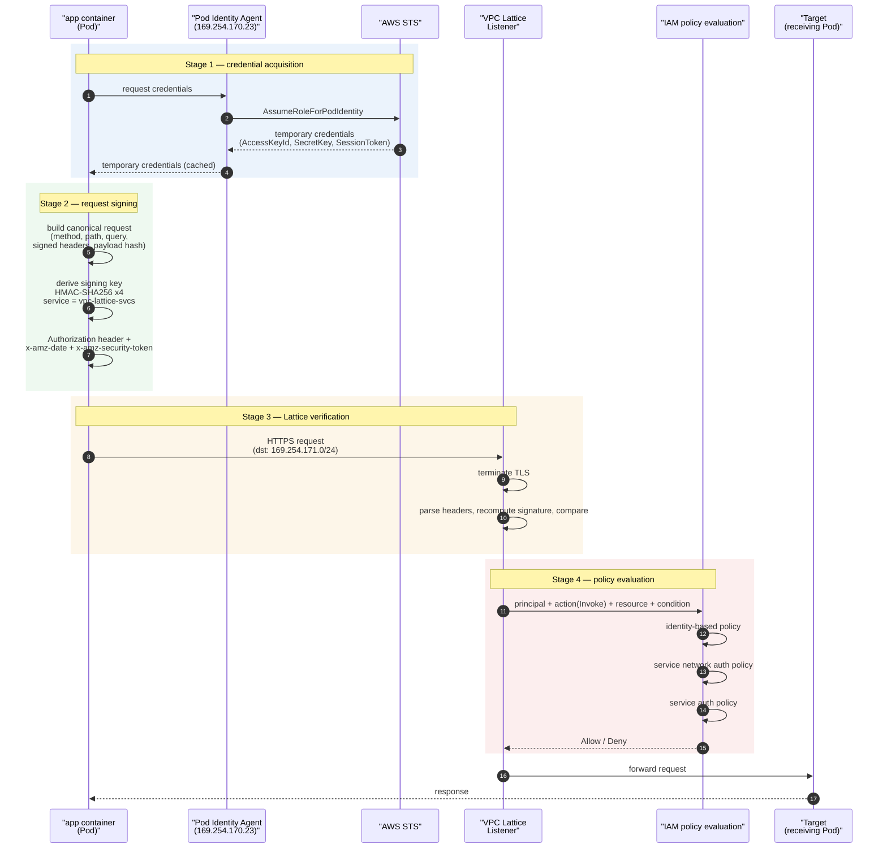
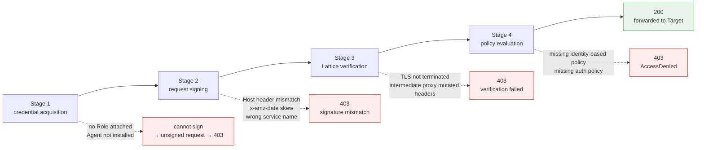

# IAM Authentication Flow in Detail

> **Supported Versions**: Amazon VPC Lattice (GA), EKS Pod Identity, AWS Gateway API Controller v1.1+
> **Last Updated**: September 3, 2026

## What This Document Covers

- The four stages a request passes through under Lattice IAM Auth — credential acquisition, request signing, Lattice verification, policy evaluation
- Where 403s originate at each stage, and which failure pattern dominates by a wide margin
- What it means to move from connection-scoped mutual authentication to **request-scoped signature verification**

## Why Request Signing?

App Mesh's mTLS checks each side's certificate **once, when the connection is established**, and trusts that connection from then on. Identity is bound to the connection.

Lattice made a different choice: **sign every request and verify every request.** Understanding why makes the later constraints follow naturally.

The reason is the range of things Lattice wants to connect. EKS Pods, ECS tasks, EC2 instances, and **Lambda functions** all join the same service network. Embedding a client certificate in a Lambda function and managing its rotation is not realistic. Meanwhile, every AWS compute platform already shares a common foundation: **IAM Roles and STS temporary credentials.** The standard way to prove identity on that foundation is SigV4 request signing.

So Lattice chose to reuse "the identity system every AWS compute platform already has," and that system operates per **API request**, not per connection. Everything else in this document follows from that choice.

## The Four-Stage Sequence



Mapping where a 403 can originate at each stage:



## Stage 1 — Credential Acquisition

SigV4 signing needs an access key, a secret key, and a session token. A Pod obtains these in one of two ways.

### EKS Pod Identity vs IRSA

| Item | EKS Pod Identity (recommended) | IRSA |
|---|---|---|
| **Trust relationship setup** | Mediated by the EKS Auth API. Role trust policy references the `pods.eks.amazonaws.com` service principal | Register a per-cluster OIDC provider in IAM and write OIDC conditions into the Role trust policy |
| **Work per additional cluster** | Roles can be reused | Register an OIDC provider and amend trust policies for every cluster |
| **Credential delivery path** | Pod Identity Agent (a node DaemonSet) serves them on a link-local address | Projected service account token → SDK calls `AssumeRoleWithWebIdentity` |
| **Binding mechanism** | `ServiceAccount` ↔ Role association managed via the EKS API | `ServiceAccount` annotation `eks.amazonaws.com/role-arn` |
| **Session tags** | Pod/cluster context can be passed as session tags → usable in conditional authorization | Limited |
| **Prerequisites** | Pod Identity Agent add-on installed + node Role has `AssumeRoleForPodIdentity` | OIDC provider association |

**The practical reason to prefer Pod Identity is multi-cluster.** One of the main motivations for adopting Lattice is cross-cluster communication, and IRSA requires registering an OIDC provider per cluster and managing Role trust policies for as many clusters as you have. Pod Identity does not carry that burden.

### The STS temporary credential dependency

Both approaches ultimately arrive at **temporary credentials issued by STS.** This is an important property of the architecture.

- Credentials **expire.** The SDK caches them and refreshes before expiry, but the refresh path must be alive.
- **If STS is unreachable, you cannot get new credentials.** Once the cache expires you cannot sign, and an unsigned request is a 403.
- In other words, **STS becomes a dependency of the East-West data path.** This mirrors where SPIRE Server sat in AS-IS, but the owner shifts from the customer to AWS (documents [05](./05-spiffe-to-iam.md) and [06](./06-constraints.md)).

The latency implication was covered in [document 02](./02-latency.md) — if refresh blocks the request path, it appears in the p99 tail.

## Stage 2 — Request Signing

### Canonical request → signing key → Authorization header

SigV4 signing proceeds in three steps.

**First, build the canonical request.** Concatenate, in a defined format, the HTTP method, the normalized path, the sorted query string, **the names and values of the headers being signed**, and a hash of the payload. The important part is that the signature is **bound to the content of the request.** Change any one thing included in the signature and the signature breaks.

**Second, derive the signing key.** Starting from the secret key, apply HMAC-SHA256 four times in sequence: date → region → **service name** → terminating string. The service name for Lattice is **`vpc-lattice-svcs`**.

Because this service name is an input to the signature itself, **getting it wrong means the signature will not verify.** It is easy to confuse with `vpc-lattice` (the service name for the Lattice control plane API), but data plane requests must be signed with `vpc-lattice-svcs`. This is consistent with the service DNS name itself, which takes the form `<service>-<id>.<hash>.vpc-lattice-svcs.<region>.on.aws`.

**Third, attach the headers.** The `Authorization` header carries the algorithm, credential scope, the list of signed headers (`SignedHeaders`), and the signature value; `x-amz-date` carries the request time; and when using temporary credentials, `x-amz-security-token` carries the session token.

### Three practical pitfalls

#### ① The Host header is signed — beware with custom domains

In SigV4, the `Host` header is **always included in the signature.** Which host the request is addressed to is bound into the signature.

This becomes a problem with **custom domains.** If you attach a customer domain (`api.internal.example.com`) to a Lattice service, the client sends requests to that domain and therefore signs with `Host: api.internal.example.com`. If the value the verifying side expects differs, the signature does not match. Conversely, if you signed with the Lattice-generated domain but the actual request's Host is the custom domain, it also does not match.

**The core rule: the Host value used when signing must match the actual request's Host header.** When introducing a custom domain, explicitly confirm which value your signing logic uses. This problem surfaces **at the moment you attach the custom domain**, not at the start of migration, which is why it is easy to miss.

#### ② x-amz-date clock skew

`x-amz-date` is signed, and the verifying side rejects requests whose timestamp differs too much from current time. The general SigV4 tolerance is about **5 minutes.** (This is standard SigV4 behavior, not a Lattice-specific value.)

That makes **node clock synchronization a precondition for authentication.** On EC2/EKS nodes using the Amazon Time Sync Service this is usually a non-issue, but it becomes a problem when:

- On-premises or hybrid nodes have NTP misconfigured
- A container image handles time on its own
- A node resumes after a long suspend

This failure is **intermittent and node-scoped**, making it awkward to diagnose. If "only Pods on one particular node get 403s," check clock synchronization first.

#### ③ Intermediate proxies mutating headers — sign at the last hop

Because the signature is bound to request content, **if anything modifies a signed element after signing, verification breaks.**

Things that actually cause this:

- Proxies that rewrite paths (`/v1/foo` → `/foo`)
- Proxies that change the `Host` header
- Proxies that add query parameters or reorder them
- Proxies that transform the payload (adding/removing compression — when the payload hash is signed)

**The rule: sign at the last hop before Lattice.** No layer that modifies the request may sit between signing and Lattice.

This matters especially **when signing via an egress proxy.** The aws-samples reference implementation demonstrates the pattern — a `sigv4proxy` sidecar listening on 8080, with an init container using iptables to redirect **only traffic destined for `169.254.171.0/24` (the Lattice range)** to local port 8080. The proxy signs and the request goes straight out to Lattice, so nothing sits in between to mutate it. Avoid configurations where a signed request is then handled by another proxy.

## Stage 3 — Lattice Verification

On an HTTPS listener, Lattice **terminates TLS, parses the headers**, recomputes the signature in the `Authorization` header, and compares.

The single most important constraint of this architecture hides here.

> **Signature verification requires reading headers, and reading headers requires terminating TLS.**

Obvious, but consequential. **TLS Passthrough does not terminate TLS, so Lattice cannot see the `Authorization` header** — meaning request-signature-based authentication cannot be applied. This is the principle behind the first constraint in [document 06](./06-constraints.md) ("TLS Passthrough and IAM Auth Policy cannot be used together").

There is structural evidence too. The AWS Gateway API Controller's `IAMAuthPolicy` can be attached **only to a Gateway, HTTPRoute, or GRPCRoute** — **`TLSRoute` is not an attachment target.** There is simply no mechanism to attach a policy to a TLS Passthrough path.

::: warning Needs verification
Whether attaching an auth policy to a TLS_PASSTHROUGH listener is **rejected by the API or accepted but never evaluated** could not be confirmed in official documentation. Some sources state that the action is `vpc-lattice-svcs:Invoke` for HTTP, HTTPS, and TLS_PASSTHROUGH alike.

**The principle is certain** — header-based signature verification is impossible without TLS termination, and the controller cannot attach a policy to a TLSRoute. Confirm the exact API-level behavior against the [VPC Lattice auth policies documentation](https://docs.aws.amazon.com/vpc-lattice/latest/ug/auth-policies.html) and reflect it in your design.
:::

One more pitfall: **auth policies are only active when authType is `AWS_IAM`.** With `NONE`, an attached policy is inert. This is the most common cause of "I attached a policy but anyone can still get through."

## Stage 4 — Policy Evaluation

A request that passes verification is evaluated against three policies. **All three must Allow for the request to pass.**

| Policy | Attached to | Question it answers | Owner | Gateway API resource |
|---|---|---|---|---|
| **identity-based policy** | The caller's IAM Role | "Does this Role have permission to perform `vpc-lattice-svcs:Invoke`?" | Application / platform team | — (directly in IAM) |
| **service network auth policy** | Service Network | "Is this principal allowed into this service network?" (coarse-grained) | Network / cloud administrator | `IAMAuthPolicy` → `Gateway` |
| **service auth policy** | Lattice Service | "Is this principal allowed to call this service?" (fine-grained) | Service-owning team | `IAMAuthPolicy` → `HTTPRoute`/`GRPCRoute` |

The action is **a single `vpc-lattice-svcs:Invoke`**, regardless of protocol.

### Available condition keys

These keys can be used as conditions in auth policies. Which keys are present at evaluation time depends on the protocol and on whether the request was SigV4-signed.

| Condition key | Filters by |
|---|---|
| `vpc-lattice-svcs:Port` | The service port the request was made to |
| `vpc-lattice-svcs:RequestMethod` | The request method |
| `vpc-lattice-svcs:RequestPath` | The path portion of the request URL |
| `vpc-lattice-svcs:RequestHeader/<header-name>` | A header name-value pair in the request |
| `vpc-lattice-svcs:RequestQueryString/<key-name>` | A query string key-value pair in the request URL |
| `vpc-lattice-svcs:ServiceArn` | The ARN of the target Lattice service |
| `vpc-lattice-svcs:ServiceNetworkArn` | The ARN of the service network |
| `vpc-lattice-svcs:SourceVpc` | The VPC the request originated from |
| `vpc-lattice-svcs:SourceVpcOwnerAccount` | The account owning the source VPC |

IAM global condition keys such as `aws:PrincipalOrgID` and `aws:PrincipalTag/<key>` can also be used alongside these.

::: warning Needs verification
The list above is compiled from the [service authorization reference](https://docs.aws.amazon.com/service-authorization/latest/reference/list_amazonvpclatticeservices.html) and policy examples in the Gateway API Controller documentation. Lattice gains features over time, so **confirm the current list in that reference before finalizing a design.**
:::

Having path, method, and header conditions is practically useful — you can enforce a rule like "only these Roles may call `POST /refund` on the payments service" outside application code. That said, **putting path-based authorization into auth policies means API changes trigger policy changes**, so decide deliberately which layer expresses authorization.

### The dominant 403 failure pattern

**By a wide margin, the most common cause is the identity-based policy lacking `vpc-lattice-svcs:Invoke`.**

It is common because it is counterintuitive. It is natural to think "the service's auth policy allows this Role, so we're done" — but **the calling Role itself also needs Invoke permission.** A resource policy alone does not get you through.

Here is the actual error message from the reference implementation:

```
AccessDeniedException: User: arn:aws:sts::111122223333:assumed-role/eksctl-...-Role1-yz1hNJittmXj/1726632845600682009
is not authorized to perform: vpc-lattice-svcs:Invoke
on resource: arn:aws:vpc-lattice:us-west-2:111122223333:service/svc-0b13d4b53748cbdc7/catalogdetail
because no identity-based policy allows the vpc-lattice-svcs:Invoke action
```

The last clause — **`because no identity-based policy allows...`** — is the key to diagnosis. The message tells you which policy is missing, so read it first when you hit a 403.

### 403 diagnosis order

| Order | What to check | How |
|---|---|---|
| 1 | The last clause of the error message | `no identity-based policy` → caller Role permissions; otherwise → auth policy |
| 2 | Lattice **access logs** | The only way to observe authorization failures. Enable them |
| 3 | Was the request actually signed? | An unsigned request and a failed signature are different problems. Check egress proxy logs |
| 4 | Is authType `AWS_IAM`? | With `NONE`, policies are inert |
| 5 | Node clock | If only one node fails, suspect `x-amz-date` skew |
| 6 | Host header | If you just introduced a custom domain, start here |

### An easily missed pitfall: calling the k8s Service DNS directly bypasses authorization

The AWS Gateway API Controller documentation states this explicitly:

> `IAMAuthPolicy` can only perform authorization for traffic that travels **through Gateways, HTTPRoutes, and GRPCRoutes.** The authorization will not take effect if the client sends traffic directly to the k8s service DNS.

So calling `http://proddetail.prodcatalog-ns.svc.cluster.local` from inside the cluster **bypasses Lattice, and the auth policy is never evaluated.** This is the second most common cause of "I set a policy, why isn't it blocking," and it is always raised in security reviews.

During the migration window, when the AS-IS path (direct in-cluster calls) and the TO-BE path (via Lattice) coexist, **there are simultaneously paths where authorization applies and paths where it does not.** You need compensating controls such as NetworkPolicy to block direct in-cluster calls, and that belongs in the migration plan.

## AS-IS Comparison

| Item | AS-IS: App Mesh + SPIRE mTLS | TO-BE: Lattice IAM Auth |
|---|---|---|
| **Authentication scope** | **Connection** — once at connection setup | **Request** — every request |
| **Directionality** | **Bidirectional mutual authentication** (both client and server prove identity) | **Unidirectional** — the client proves itself. The server proves only via its TLS server certificate |
| **Form of identity** | SPIFFE ID in an X.509 SVID (a URI) | IAM Role ARN / assumed-role session ARN |
| **Means of proof** | Short-lived X.509 certificate (proof of private key possession) | SigV4 signature (proof of secret key possession) |
| **Who verifies** | The peer workload's Envoy | Lattice (AWS-managed infrastructure) |
| **Root of trust** | A SPIRE Server CA operated by the customer | AWS IAM / STS |
| **Where authorization happens** | The receiving Envoy's authorization filter | Lattice's triple policy evaluation |
| **Where TLS terminates** | The receiving Pod's Envoy | Lattice (HTTPS listener) |
| **On credential expiry** | SVID auto-renewal (SPIRE Agent) | STS credential auto-refresh (SDK) |
| **Observability** | Envoy metrics + logs | Lattice access logs (no spans) |

### The two most important rows

**The "Directionality" row** is the crux of the review board issue. mTLS had the server prove its identity too. Under Lattice IAM Auth, server-side identity proof is at the level of a TLS server certificate, and there is no step that confirms "is this really the service that team operates" within a workload identity system. Details are in [document 05](./05-spiffe-to-iam.md).

**The "Where TLS terminates" row** is a data protection change. In AS-IS, traffic became plaintext inside the receiving Pod. In TO-BE it is **terminated once in AWS-managed infrastructure** and re-established to the target. If a regulation requires end-to-end encryption, this point is in scope — and the alternative is TLS Passthrough, which means you cannot use IAM Auth. That trade-off is [document 06](./06-constraints.md).

## Summary

- Lattice chose request signing to reuse the **IAM/STS foundation that EKS, ECS, EC2, and Lambda already share.** That system operates per request, not per connection.
- The signing service name is **`vpc-lattice-svcs`**, and since it is an input to the signature, getting it wrong means verification fails.
- Three practical pitfalls: **the Host header is signed** (beware with custom domains), **x-amz-date 5-minute skew** (node clock sync), and **sign at the last hop** (no mutating proxies in between).
- Signature verification presupposes TLS termination, so **you cannot use IAM Auth with TLS Passthrough.**
- The number one cause of 403s is **the caller Role's identity-based policy missing `Invoke`.** The last clause of the error message tells you.
- **Calling the k8s Service DNS directly bypasses auth policy evaluation.** Compensating controls are needed during migration.

Next: [Foundations — Link-Local and SNI](./04-networking-basics.md) goes one layer below "why you must terminate TLS to see headers."

## References

- [Control access to VPC Lattice services using auth policies](https://docs.aws.amazon.com/vpc-lattice/latest/ug/auth-policies.html)
- [Actions, resources, and condition keys for Amazon VPC Lattice Services](https://docs.aws.amazon.com/service-authorization/latest/reference/list_amazonvpclatticeservices.html)
- [AWS Gateway API Controller — IAMAuthPolicy API Reference](https://www.gateway-api-controller.eks.aws.dev/latest/api-types/iam-auth-policy/)
- [aws-samples — Securing the network and implementing AWS IAM authentication](https://github.com/aws-samples/migrating-from-aws-app-mesh-to-amazon-vpc-lattice/blob/main/vpc-lattice-config/IAMAUTH.md)
- [Implement AWS IAM authentication with Amazon VPC Lattice and Amazon EKS](https://aws.amazon.com/blogs/containers/implement-aws-iam-authentication-with-amazon-vpc-lattice-and-amazon-eks/)
- [EKS Pod Identity](https://docs.aws.amazon.com/eks/latest/userguide/pod-identities.html) / [IAM Roles for Service Accounts](https://docs.aws.amazon.com/eks/latest/userguide/iam-roles-for-service-accounts.html)
- [Signing AWS API requests (SigV4)](https://docs.aws.amazon.com/IAM/latest/UserGuide/reference_sigv.html)
