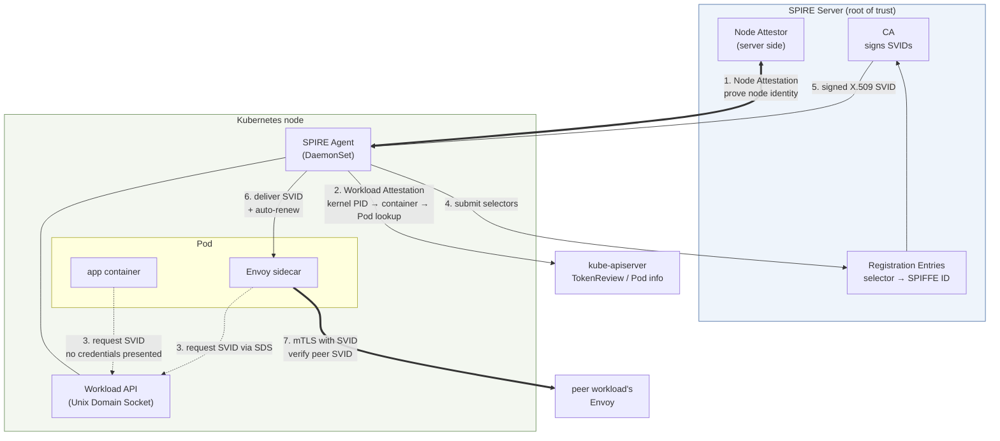

# Workload Identity Migration — SPIFFE to IAM

> **Supported Versions**: SPIRE 1.x, Amazon VPC Lattice (GA), EKS Pod Identity
> **Last Updated**: September 3, 2026

## What This Document Covers

- How SPIFFE/SPIRE solved the workload identity problem — in particular, how attestation resolves the bootstrapping problem
- The similarities between SPIFFE-based mTLS and Lattice IAM Auth (short-lived credentials plus platform attestation) and the **two decisive differences**
- Why those differences become the central issue in financial-sector security reviews

## The Starting Problem — How Does a Workload Prove Itself?

When service A calls service B, B needs to know "did this request really come from A?" The problem is hard because of **how you deliver the secret needed for the proof in the first place.**

To hand a secret (a certificate, an API key) to a workload, you must know that workload really is that workload — and to know that, you need a secret. This is the **bootstrapping problem**, and the traditional workarounds all just move the problem.

| Workaround | Where it moves the problem |
|---|---|
| Bake certificates into the image | Image leak = identity leak. Renewal requires a rebuild |
| Mount as a Secret | Everyone who can read the Secret can forge that identity |
| Inject at deploy time | The CI/CD system holds the master key for every identity |

SPIFFE/SPIRE and Lattice IAM Auth **both solve this by having the platform vouch for the workload.** That is why their structures are strikingly similar. And because they are similar, **exactly where they differ** becomes the focus of the review.

## The Three SPIFFE Elements

SPIFFE (Secure Production Identity Framework For Everyone) is a **standard** for workload identity — a specification, not an implementation.

### ① SPIFFE ID — the name of the identity

Identifies a workload as a URI.

```
spiffe://<trust-domain>/<workload-path>

e.g.: spiffe://finance.example.com/ns/prodcatalog/sa/prodcatalog-sa
```

The `trust-domain` is **the name of a trust boundary.** Workloads in the same trust domain share a common root of trust (the same CA). The path portion is freely designed by the organization; in Kubernetes environments it usually reflects namespace and ServiceAccount.

Notably, **there is no network information in the name** — no IP, no hostname, no port. This is deliberate: wherever a workload is scheduled and however its IP changes, the identity stays the same. The shift from "IP-based control to identity-based control" seen in [document 04](./04-networking-basics.md) begins here.

### ② SVID — the credential proving the identity

**SPIFFE Verifiable Identity Document.** It carries a SPIFFE ID in a verifiable document, in one of two forms.

| Form | Contents | Primary use |
|---|---|---|
| **X.509-SVID** | An X.509 certificate with the SPIFFE ID in a SAN URI, plus a private key | mTLS mutual authentication |
| **JWT-SVID** | A JWT with the SPIFFE ID in the `sub` claim | Passing identity in HTTP headers, L7 authorization |

**The key property is a short lifetime.** SVIDs are typically issued for tens of minutes to a few hours and renewed automatically. Short lifetimes matter because they **sidestep the revocation problem.** CRLs and OCSP are operationally awkward; if a credential expires soon anyway, the useful window of a compromise is bounded without any revocation mechanism.

### ③ Workload API — the delivery channel for the identity

The interface through which a workload obtains its SVID. Critically, **it is exposed over a Unix Domain Socket (UDS).**

Why UDS is the essence of this design: **the workload presents no credentials at all when it connects to the socket.** Instead the kernel reliably provides the peer process's information (PID, UID, GID), and the SPIRE Agent uses that to **investigate directly** who the peer is.

In other words, this is **not "present a secret to prove identity" but "the platform observes and adjudicates identity."** That is where the bootstrapping problem is solved.

## SPIRE Components

SPIRE is the reference implementation of SPIFFE.



| Component | Role |
|---|---|
| **SPIRE Server** | **The root of trust.** Holds the CA and signs/issues SVIDs. Manages Registration Entries (which selectors receive which SPIFFE ID) |
| **SPIRE Agent** (DaemonSet) | Runs on each node. Proves the node's own identity to the Server, then investigates that node's workloads and obtains, delivers, and renews SVIDs on their behalf |
| **Attestation** | The identity adjudication procedure. Two stages: Node Attestation and Workload Attestation |
| **Envoy SDS integration** | Envoy receives certificates from the Agent over the **Secret Discovery Service** protocol. Application code knows nothing about mTLS |

### How attestation resolves the bootstrapping problem

This is the core of SPIRE and the reference point when comparing with IAM.

**Node Attestation** — the Agent proves to the Server "I am this node." The evidence used is **not a pre-planted secret but a platform-issued attestation.** On AWS this is the EC2 instance's signed IMDS document or instance identity document. The Server can validate that evidence against AWS, so no pre-shared secret needs to be placed on the node.

**Workload Attestation** — the Agent investigates workloads on the node:

1. The workload connects to the UDS — **with no credentials**
2. The Agent obtains the peer process's PID from the kernel — **unforgeable.** It is a fact the kernel reports
3. From the PID it reads the cgroup to determine which container this is
4. It queries kubelet/kube-apiserver to confirm that container's Pod, namespace, ServiceAccount, and labels
5. It combines these attributes into **selectors** and submits them to the Server
6. The Server finds the matching SPIFFE ID in the Registration Entries and issues an SVID

**Step 2 is where the bootstrapping problem dissolves.** The workload does not claim who it is. It does not need to. The kernel reports a fact, and that fact is cross-checked against the platform's (Kubernetes') records. **To forge it you would have to compromise the kernel or the Kubernetes API server, and at that level of compromise everything else has already fallen.**

In one sentence: **identity is not presented — it is observed and adjudicated.**

## Comparison With IAM Auth

The Lattice IAM Auth procedure is in [document 03](./03-auth-flow.md). Item by item:

| Item | SPIFFE/SPIRE (AS-IS) | Lattice IAM Auth (TO-BE) |
|---|---|---|
| **Name of identity** | SPIFFE ID (`spiffe://<trust-domain>/ns/<ns>/sa/<sa>`) | IAM Role ARN / assumed-role session ARN |
| **Form of credential** | X.509-SVID or JWT-SVID | STS temporary credentials (access key + secret + session token) |
| **Means of proof** | Proof of certificate private key possession (TLS handshake) | SigV4 request signature (proof of secret key possession) |
| **Scope of proof** | **Connection** — once at setup | **Request** — every request |
| **Who attests** | SPIRE Agent (node) + SPIRE Server | EKS Pod Identity Agent + EKS Auth API |
| **Attestation evidence** | Kernel PID → cgroup → Pod/ServiceAccount lookup | `ServiceAccount` ↔ Role association (EKS Auth API) or OIDC token (IRSA) |
| **Verification method** | The peer's Envoy validates the SVID chain against the trust bundle | Lattice recomputes/compares the signature, then evaluates three policies |
| **Root of trust** | **A SPIRE Server CA operated by the customer** | **AWS IAM / STS** |
| **Credential lifetime** | Tens of minutes to hours, auto-renewed | STS temporary credentials, auto-refreshed |
| **How authorization is expressed** | Envoy authorization filters (SPIFFE ID based) | Three IAM policies (identity-based + service network + service) |
| **Observability** | Envoy metrics/logs (per SPIFFE ID) | Lattice access logs (per principal, no spans) |
| **Operational burden** | **High** — SPIRE Server HA, CA key management, CA rotation, Registration Entry management, Agent deployment/upgrades, trust bundle distribution | **Low** — Pod Identity Agent add-on plus ServiceAccount↔Role association. No CA or key management |
| **Multi-cluster** | Requires trust domain design and federation | Role reuse via Pod Identity, minimal per-cluster setup |
| **Workloads outside AWS** | ✅ Possible (on-premises, other clouds) | ❌ Requires reachability to IAM/STS |

## Similarities — Why This Migration Is Feasible

The comparison table makes them look like entirely different systems, but **structurally they are the same pattern.** That is what makes the migration coherent.

### ① Both use short-lived credentials

Both SVIDs and STS temporary credentials are short-lived and auto-renewed. Both were designed that way for the same reason — **to bound the useful window of a compromise without a revocation mechanism.**

The practical implication is significant. If you already passed a review on the principle of "we do not use long-lived secrets" in AS-IS, TO-BE satisfies the same principle. **That item is not up for re-litigation.**

### ② Both are based on platform attestation

The workload does not hold a secret in advance; the platform vouches for it.

| Stage | SPIRE | EKS Pod Identity |
|---|---|---|
| Node identity | Node Attestation (EC2 identity document, etc.) | The node Role's `AssumeRoleForPodIdentity` permission |
| Workload adjudication | Kernel PID → cgroup → Pod/SA | The Pod's ServiceAccount ↔ Role association |
| Credential delivery | Workload API (UDS) | Pod Identity Agent (link-local address) |
| Credential renewal | Agent renews the SVID | SDK refreshes credentials |

**The two columns correspond row for row.** They solve the bootstrapping problem the same way. The Pod Identity Agent serving credentials on a link-local address is the same idea as the SPIRE Agent serving SVIDs over UDS — a local infrastructure component adjudicates the workload and obtains credentials on its behalf.

Thanks to this similarity, **the review argument "workloads do not hold secrets" also carries over.**

## Two Decisive Differences

Since there are many similarities, what actually gets debated in a review is **where they differ.** These two are structural differences that operational convenience does not resolve.

### Difference (a) — Bidirectional mutual authentication vs unidirectional plus request authentication

**AS-IS is bidirectional.**

In an mTLS handshake, client and server verify **each other's** SVID. The client confirms "is the peer I connected to really the payments service" by SPIFFE ID, and the server confirms "is the peer connecting to me really the orders service." Both sides prove themselves within the workload identity system.

**TO-BE is asymmetric.**

| Direction | AS-IS | TO-BE |
|---|---|---|
| Client → server (client proves) | SVID mutual authentication | **SigV4 request signature** (per request, finer-grained) |
| Server → client (server proves) | SVID mutual authentication | **TLS server certificate** (ordinary TLS level) |

Client proof actually becomes **finer-grained.** Verification happens per request rather than once per connection, blocking the scenario where a hijacked connection is used to send arbitrary requests. Per-request authorization on path, method, and headers also becomes possible.

**The problem is server proof.** All the client can confirm is "this TLS certificate is valid and the domain matches." **There is no step that confirms "is this really the service that team operates" within a workload identity system.**

The question that actually comes up in a review is:

> If someone inside the service network creates a Lattice Service under our service's name and receives traffic there, can the client tell the difference?

The honest answer is **"not within the workload identity system — you must prevent it with IAM controls over the service network and Lattice resources."** In other words, **the line of defense moves from workload-to-workload mutual authentication to control over resource creation permissions.**

This is not a bad answer. Strictly limiting via IAM who can create Lattice Services, controlling service network associations, and monitoring resource creation with CloudTrail does manage the practical risk. But **if your review documentation said "mutual authentication," that item must be rewritten and the basis for control presented at a different layer.** Discovering this late in the migration causes major schedule slippage.

### Difference (b) — Ownership of the root of trust

**This is the heavier item in financial-sector reviews.**

| Item | AS-IS | TO-BE |
|---|---|---|
| **Root of trust** | A SPIRE Server CA operated by the customer | AWS IAM / STS |
| **CA private key ownership** | Customer | (N/A — not key-based) |
| **Who issues identity** | The customer's CA, per customer-defined Registration Entries | AWS STS |
| **Who decides issuance rules** | Fully controlled by the customer | Customer controls via IAM; AWS executes |
| **Audit trail** | SPIRE Server logs (customer-held) | CloudTrail (an AWS service) |
| **Who decides CA rotation** | Customer | (N/A) |
| **Works outside AWS** | ✅ | ❌ |
| **Operational burden** | Borne by the customer | Borne by AWS |

The trade-off is explicit: **you hand the operational burden to AWS in exchange for handing over ownership of the root of trust.**

This item is heavy in the financial sector because of regulation and review practice. Many organizations' security standards explicitly require **"the root of trust of an authentication system must be under our own control,"** or contain clauses read that way. Running your own CA was the most direct way to satisfy that requirement, and adopting SPIRE was likely the result of passing that very review.

Moving to Lattice IAM Auth means rebuilding that argument. Available grounds:

| Argument | Content |
|---|---|
| **Shared responsibility model** | IAM/STS are controls AWS already operates under multiple certified regulatory frameworks |
| **Policy authority retained** | Who may call what remains fully defined by the customer through IAM policies |
| **Audit trail secured** | CloudTrail provides credential issuance and API call history; Lattice access logs provide data path history |
| **Reduced key custody is itself a benefit** | The customer holds no CA private key, so key-leak risk is eliminated outright |
| **Lifetime and attestation preserved** | The two similarities above are still satisfied |

**But this is an argument that "control is exercised differently," not that "it is equivalent."** Whether a reviewer accepts the former depends on organizational standards, and it is not a problem technology can resolve.

### Position as a financial-sector review issue

Summarizing how the review issues line up:

| Item | Review status | Basis |
|---|---|---|
| No long-lived secrets | ✅ **No re-litigation needed** | Both use short-lived credentials with auto-renewal |
| Workloads hold no secrets | ✅ **No re-litigation needed** | Both are based on platform attestation |
| Per-request authorization granularity | ✅ **Improved** | Connection-scoped → request-scoped, with path/method/header conditions |
| Client identity proof | ✅ **Maintained or better** | SigV4 verified per request |
| **Server identity proof** | ⚠️ **Weakened — compensating control required** | From workload identity system down to TLS server certificate level. Defense moves to IAM control over resource creation |
| **Root of trust ownership** | ⚠️ **Transferred — argument must be rewritten** | Customer CA → AWS IAM/STS |
| End-to-end encryption | ⚠️ **Trade-off** | HTTPS listener terminates TLS once at Lattice. Preserving it requires TLS Passthrough, which forfeits IAM Auth (documents [04](./04-networking-basics.md), [06](./06-constraints.md)) |
| Observability (tracing) | ⚠️ **Weakened** | Envoy spans disappear. Application instrumentation required ([document 01](./01-appmesh-vs-lattice.md)) |
| Workloads outside AWS | ❌ **Scope reduced** | Requires IAM/STS reachability. On-premises and other-cloud workloads need a separate approach |

**Practical recommendation: review the ⚠️ and ❌ items above with your security reviewers before starting the migration.** Most of the technical implementation is predictable, but these items depend on organizational judgment and the answer changes the architecture (for example, if server identity proof is ruled mandatory, you must go to TLS Passthrough with endpoint mTLS — and then you cannot use IAM Auth, which changes the entire authorization design).

### The option of keeping SPIRE

Migration does not necessarily mean decommissioning SPIRE.

- **If you have workloads outside AWS**, SPIRE remains necessary there
- **If you choose the TLS Passthrough configuration**, endpoints must perform mTLS themselves, and SPIRE can keep supplying those certificates
- In that case you end up with a configuration where **App Mesh is gone but SPIRE remains** — responding to App Mesh end of support and keeping SPIRE are separate decisions

If eliminating SPIRE's operational burden was one of the goals of the migration, check first whether the above conditions conflict with that goal.

## Summary

- The three SPIFFE elements are **SPIFFE ID** (a URI-form name), **SVID** (short-lived X.509/JWT), and **Workload API** (over UDS).
- SPIRE's attestation resolves bootstrapping because **identity is not presented but observed and adjudicated.** The PID the kernel reports cannot be forged.
- IAM Auth follows the same pattern — **short-lived credentials plus platform attestation.** So much of the review does not need re-litigation.
- The decisive differences are two: **(a) bidirectional mutual authentication becomes unidirectional plus request authentication, weakening server identity proof**, and **(b) the root of trust transfers from a customer CA to AWS IAM/STS.**
- Neither is resolved by technology; both require organizational judgment. **Review them with security reviewers before starting, because the answer changes the architecture.**

Next: [Constraints and Decision Points](./06-constraints.md) collects the items you must settle before finalizing a design.

## References

- [SPIFFE documentation](https://spiffe.io/docs/latest/spiffe-about/overview/)
- [SPIFFE ID specification](https://github.com/spiffe/spiffe/blob/main/standards/SPIFFE-ID.md) / [X.509-SVID specification](https://github.com/spiffe/spiffe/blob/main/standards/X509-SVID.md)
- [SPIRE Concepts — Attestation](https://spiffe.io/docs/latest/spire-about/spire-concepts/)
- [EKS Pod Identity](https://docs.aws.amazon.com/eks/latest/userguide/pod-identities.html)
- [Secure Cross-Cluster Communication in EKS with VPC Lattice and Pod Identity IAM Session Tags](https://aws.amazon.com/blogs/containers/secure-cross-cluster-communication-in-eks-with-vpc-lattice-and-pod-identity-iam-session-tags/)
- [Istio Security — mTLS](../istio/security/01-mtls.md) — how sidecar-based mutual authentication works
