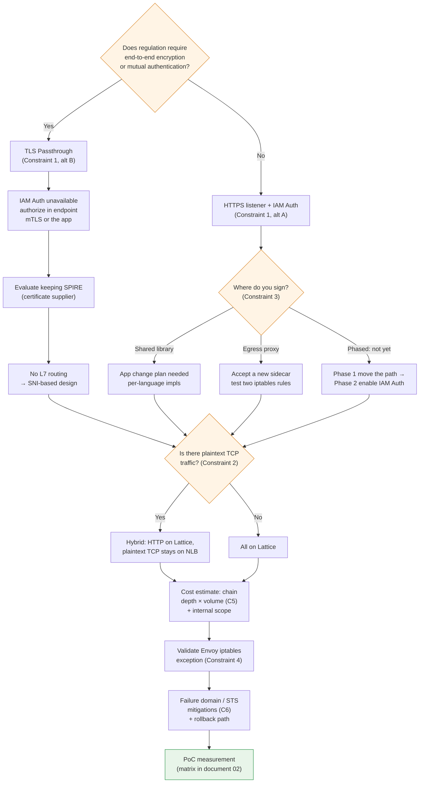

# Constraints and Decision Points

> **Supported Versions**: Amazon VPC Lattice (GA), AWS Gateway API Controller v1.1+, AWS App Mesh (end of support September 30, 2026)
> **Last Updated**: September 3, 2026

## What This Document Covers

- Six constraints you must answer before finalizing a design, and the alternatives for each
- The decision tree they form together — where one choice closes off another
- A pre-migration checklist

## Constraint Summary

| # | Constraint | Nature | Alternatives exist | When to decide |
|---|---|---|---|---|
| 1 | TLS Passthrough and IAM Auth Policy cannot be combined | **Of principle** — will not be resolved | 2 (pick one) | **First** |
| 2 | Raw TCP unsupported | **Of principle** — will not be resolved | Hybrid (with NLB) | Early |
| 3 | Application impact of SigV4 signing | Implementation choice | 3 | Early |
| 4 | Envoy iptables exception during coexistence | Configuration item | Mandatory setting | Before migration starts |
| 5 | Per-hop request and data charges | Structural | Architectural adjustment | During design |
| 6 | Failure domain concentration + STS dependency | Structural | Mitigation only | During design |

Constraints 1 and 2 are **constraints of principle that will not be resolved even if AWS adds features** (see [document 04](./04-networking-basics.md)). The rest can be managed through design and operations.

## Constraint 1 — TLS Passthrough and IAM Auth Policy Cannot Be Combined

### The principle

Two facts from documents [03](./03-auth-flow.md) and [04](./04-networking-basics.md) combine to produce this constraint.

1. SigV4 verification must read the `Authorization` header
2. Reading headers requires terminating TLS

TLS Passthrough by definition does not terminate TLS. Therefore **Lattice cannot see the signature header and cannot apply request-signature-based authentication.**

The structural evidence agrees. The AWS Gateway API Controller's `IAMAuthPolicy` can be attached **only to a Gateway, HTTPRoute, or GRPCRoute — `TLSRoute` is not an attachment target.** There is no mechanism to attach a policy to a TLS Passthrough path at all.

::: warning Needs verification
Whether the API **rejects** an auth policy on a TLS_PASSTHROUGH listener or **accepts but never evaluates** it could not be confirmed in official documentation. The principle (header verification requires TLS termination) and the controller's attachment restriction are certain, but confirm the API-level behavior against the [VPC Lattice auth policies documentation](https://docs.aws.amazon.com/vpc-lattice/latest/ug/auth-policies.html).
:::

### The two alternatives

| Alternative | Configuration | What you gain | What you lose |
|---|---|---|---|
| **A. HTTPS listener + IAM Auth** | Lattice terminates TLS, verifies SigV4, evaluates three policies | IAM-based authorization, path/method/header conditions, L7 routing, detailed access logs | End-to-end encryption (terminated once at Lattice), endpoint's own mTLS |
| **B. TLS Passthrough + endpoint mTLS** | Lattice routes on SNI only; endpoints perform TLS/mTLS themselves | End-to-end encryption, mutual authentication preserved, SPIRE certificates still usable | All of IAM Auth, L7 routing, path/header conditions, HTTP detail in logs |

### Which to choose

**This is the most important branch point in the migration.** Most other decisions depend on it.

The criterion is **whether regulation requires end-to-end encryption or workload-to-workload mutual authentication.**

- **If not, choose A.** IAM Auth's authorization granularity and observability benefits are substantial, and this is how Lattice is designed to be used.
- **If yes, choose B.** But choosing B means redesigning where authorization is expressed — Lattice only knows SNI, so authorization must happen in the application or in endpoint mTLS certificate validation. And as noted in [document 05](./05-spiffe-to-iam.md), **SPIRE may still be necessary.**

Mixing is possible. **You can split A and B per service** — B for services under regulation, A for the rest. The cost is operating two authorization models simultaneously.

## Constraint 2 — Raw TCP Unsupported

### The principle

As covered in [document 04](./04-networking-basics.md), plaintext TCP offers no basis for routing. No TLS means no `ClientHello`; no `ClientHello` means no SNI. The destination IP is link-local and identifies no service, leaving only the port.

**Because it is a constraint of principle, do not expect it to be resolved.**

### Identifying what is affected

Early in planning, **find every East-West communication that uses plaintext TCP.** Common ones:

- Plaintext Redis / Memcached
- DB connections without TLS (MySQL, PostgreSQL, etc.)
- Custom binary protocols
- Plaintext Kafka
- gRPC over plaintext (h2c)

### The alternative — a Hybrid configuration

| Traffic type | Path |
|---|---|
| HTTP / HTTPS / gRPC | **VPC Lattice** |
| TCP with TLS | Lattice **TLS Passthrough** (if SNI routing is viable) |
| Plaintext TCP | **NLB** (or keep the existing path) |

The reason to recommend this is simple: **trying to move everything to Lattice is the most common cause of migration delay.** If you pull "introduce TLS for plaintext TCP services" into migration scope, you need application changes and the schedule leaves your control.

Since App Mesh end of support imposes a deadline, it is practically important to **separate what must move by the deadline (HTTP traffic that depends on App Mesh) from what need not move at all (plaintext TCP that never used App Mesh).**

## Constraint 3 — Application Impact of SigV4 Signing

If you chose IAM Auth (Constraint 1, alternative A), **someone must attach signatures to requests.** Deciding who is the choice with the most direct impact on application teams.

| Approach | Implementation | Pros | Cons |
|---|---|---|---|
| **① Shared library** | Apply SigV4 signing in each service's HTTP client (AWS SDK signing or a per-language library) | No extra hop → minimal latency. Credential management delegated to the SDK | **Code changes in every service.** Per-language implementations. Version management of signing logic |
| **② Egress proxy sidecar** | A `sigv4proxy` sidecar plus iptables redirecting only the Lattice range | **No application code changes.** Language-agnostic. Reference implementation exists | A sidecar reappears (partly offsetting the benefit of removing Envoy). One extra hop. Sidecar operations/upgrades |
| **③ Do not use IAM Auth** | authType `NONE`; authorize at another layer | No application changes, no overhead | **No authorization at the Lattice level.** Anyone in the service network can call. Hard to pass review |

### Practical recommendation

**If you have multiple languages or limited application-team capacity, start with ②.** The aws-samples reference implementation provides validated manifests — a `sigv4proxy` sidecar on 8080 with an init container redirecting only traffic bound for `169.254.171.0/24` to the proxy.

The irony of ② is plain: **you migrated to remove the Envoy sidecar and gained a signing sidecar.** That said, `sigv4proxy` is far lighter than Envoy, has no xDS control plane, and has static configuration. If "eliminate sidecars" was the core goal, you need ① — and then you need an application change plan.

**③ is not recommended from a review standpoint.** However, as a phased strategy, **moving only the path in phase 1 with ③ and enabling IAM Auth in phase 2** is valid. It lets you validate the impact of the path change separately from the impact of introducing authentication, and it lines up with the measurement matrix in [document 02](./02-latency.md).

**Whichever approach you take, check the three pitfalls in [document 03](./03-auth-flow.md) (Host header, x-amz-date clock, sign at the last hop).**

## Constraint 4 — Envoy iptables Exception During Coexistence

**This is not a choice; it is a mandatory setting.**

While App Mesh and Lattice run side by side, the iptables rules installed by App Mesh's init container **intercept traffic bound for Lattice as well.** Envoy cannot find that destination in its configuration and the request fails.

| Item | Value |
|---|---|
| Range to exclude (IPv4) | `169.254.171.0/24` |
| Range to exclude (IPv6) | `fd00:ec2:80::/64` |
| App Mesh setting location | The init container's egress-ignore CIDR list |
| Istio setting location | The `traffic.sidecar.istio.io/excludeOutboundIPRanges` annotation |

### Easily missed points

- **If you use IPv6, you must exclude the IPv6 range too.** Excluding only IPv4 on a dual-stack cluster produces intermittent failures.
- **Pod-level annotations apply only to newly created Pods.** Existing Pods must be restarted.
- **When combined with approach ② of Constraint 3, you have two iptables rules.** You must exclude the Lattice range from App Mesh interception while simultaneously redirecting the Lattice range to the signing proxy. Always test the ordering and interaction of the two rules.

Validate this setting **before** starting the migration. It is the number one cause of a first Lattice call failing.

## Constraint 5 — Per-Hop Charges Are Dominated by Call Chain Depth

### The billing structure

VPC Lattice pricing has three axes.

| Axis | Nature |
|---|---|
| **Service provisioning** | Hourly, proportional to service count |
| **Data processing** | Per GB, **inter-AZ charges included here** (no separate cross-AZ charge) |
| **Requests / connections** | **Request count** for HTTP/HTTPS listeners; **TCP connection count** for TLS listeners |

::: warning Needs verification
Unit prices vary by region and over time, and there are free tiers. **Before finalizing a design, check current unit prices for your region directly on the [VPC Lattice pricing page](https://aws.amazon.com/vpc/lattice/pricing/).** This document does not state unit prices.
:::

### Why chain depth dominates cost

The key is that charges are **per hop.**

If you have a four-hop chain — frontend → orders → catalog → inventory → pricing — then a single user request produces **four Lattice requests.** Data processing charges accrue at each hop too. So **cost is proportional to user request count × chain depth.**

In AS-IS (App Mesh) the structure was different. App Mesh itself had no per-request charge; cost appeared as the compute resources Envoy consumed. **The shift of the cost model from "compute resources" to "request count"** is the financial character of this migration.

### Practical implications

| Implication | Response |
|---|---|
| **Chatty services get expensive** | Consolidate patterns that make many calls per request into batch/aggregate calls |
| **Deep chains get expensive** | Reducing chain depth improves both cost and latency ([document 02](./02-latency.md)) |
| **Moving all communication to Lattice can spike costs** | **Keeping intra-cluster communication off Lattice** may be the sensible choice |
| **Health checks and polling are billable** | Revisit high-frequency health check and polling intervals |

**The last two items matter most.** Lattice's strength is communication crossing cluster, VPC, and account boundaries; for traffic within the same cluster it offers little benefit while adding cost and latency. **Sending only boundary-crossing traffic through Lattice and leaving intra-cluster traffic on ClusterIP** is often the right answer for both cost and performance.

But here you meet the constraint from [document 03](./03-auth-flow.md) — **calling the k8s Service DNS directly inside the cluster bypasses auth policy evaluation.** So if you choose "internal traffic does not go through Lattice," you must **separately design authorization for internal traffic** via NetworkPolicy or the application layer. This is where cost optimization and authorization consistency conflict.

### Data needed for cost estimation

Collect these before migrating. Without them, cost estimation is impossible.

| Item | How to collect |
|---|---|
| Number of services moving to Lattice | From the migration scope definition |
| Per-service-pair request rate (RPS) | App Mesh Envoy metrics or application metrics |
| **Average call chain depth** | Your current distributed tracing data (**collect it now** — there will be no spans after migration) |
| Per-service-pair data transfer volume | Envoy metrics or flow logs |
| Health check / polling frequency | Each service's configuration |

**"Average call chain depth" must be collected now.** After migration, Lattice creates no spans, making this data hard to obtain ([document 01](./01-appmesh-vs-lattice.md)).

## Constraint 6 — Failure Domain Concentration and STS Dependency

### The failure domain concentrates

AS-IS and TO-BE have different failure characteristics.

| Aspect | AS-IS: App Mesh sidecar | TO-BE: VPC Lattice |
|---|---|---|
| **Data plane failure scope** | One Envoy = one Pod | A Lattice failure = **all East-West traffic** |
| **How failure propagates** | Gradual, localized | Broad, simultaneous |
| **Data plane during control plane failure** | Envoy keeps running on its last configuration (graceful degradation) | The data path itself is managed, so the character differs |
| **Customer's remediation options** | Restart Pods, roll back config, bypass the sidecar | Wait for AWS-side recovery |
| **Availability responsibility** | Customer (self-operated) | AWS (managed service) |

**The essence of the trade-off**: a managed service has a lower probability of individual failure, but when a failure occurs **its scope is broad and the customer's ability to intervene is limited.** The sidecar model may fail more often but failures are localized and the customer can act.

### The STS dependency

With IAM Auth, **STS becomes a dependency of the East-West data path** ([document 03](./03-auth-flow.md)).

- Credentials expire, and refreshing requires STS
- If STS is unreachable and the cache expires, **you cannot sign, and unsigned requests are 403s**
- In other words, **an authentication infrastructure failure translates directly into a service-to-service communication failure**

In AS-IS, SPIRE Server occupied this position. **The existence of the dependency is not new — the owner shifts from the customer to AWS** (the same structure as difference (b) in [document 05](./05-spiffe-to-iam.md)).

### Mitigations

This constraint cannot be removed, only mitigated.

| Mitigation | Content |
|---|---|
| **Confirm credential cache lifetime** | How long does the SDK cache credentials, and how does it behave on refresh failure? That value is your endurance window for a short STS outage |
| **Test refresh-failure behavior** | Artificially block STS access and observe how services fail. Do they silently 403, or retry? |
| **Redundancy for critical paths** | Consider keeping an alternative path (direct call, NLB) for the highest-criticality communication |
| **Phased migration** | Do not move everything at once; start with lower-criticality traffic. Keep a rollback path |
| **Recalculate RTO/RPO** | The failure characteristics changed, so revisit the basis for your existing targets |
| **Integrate AWS Health / status notifications** | Since you cannot remediate directly, early detection is the core of the response |

**"Redundancy for critical paths" and "phased migration" are the most effective in practice** — especially keeping a rollback path. App Mesh end of support means you must eventually remove it, but during the validation window you must be able to roll back.

## Unconfirmed Items

::: warning Needs verification
The following could not be confirmed against official documentation. Verify them directly if they affect your design.

**① Direct integration between API Gateway and Lattice** — **no evidence was found** that API Gateway natively supports a Lattice service network as a private integration target. The confirmed patterns are API Gateway → VPC Link → ALB/NLB → Lattice, or going through a proxy/federation layer. If your design connects North-South traffic to Lattice, validate this part first.

**② Exact Lattice quota values** — per an AWS networking blog, the default service throughput quota is described as **10 Gbps and 10,000 requests/second per service per Availability Zone.** Other reference values: 2,000 services/region, 50 service networks/region, 10 target groups per service, 2 listeners per service, 500 service associations per service network. **Most are adjustable, but confirm current per-region values in the Service Quotas console and [VPC Lattice endpoints and quotas](https://docs.aws.amazon.com/general/latest/gr/vpc-lattice-service.html).** No basis was found for a limit on concurrent connections as such.

**③ Whether Lattice's Target selection considers the caller's AZ** — AZ-aware routing behavior and user controllability could not be confirmed. If you relied on zone-aware routing in AS-IS, **verify by measurement in your PoC** (the matrix in [document 02](./02-latency.md)).

**④ API behavior when setting an auth policy on a TLS_PASSTHROUGH listener** — see Constraint 1.

**⑤ ECH (Encrypted Client Hello) support** — do not assume it is supported ([document 04](./04-networking-basics.md)).
:::

**By contrast, the following are confirmed**: the link-local ranges (`169.254.171.0/24`, `fd00:ec2:80::/64`), the SigV4 service name (`vpc-lattice-svcs`), the three listener protocols (HTTP/HTTPS/TLS_PASSTHROUGH), the condition key list, the App Mesh end-of-support date (September 30, 2026), that cross-AZ charges are included in data processing, and that trace spans are not supported.

## Decision Tree

Because the constraints interact, **the order of decisions matters.** An earlier decision closes off later options.

**The first branch (regulatory requirements) governs everything.** That decision rests on organizational review standards rather than technology, so **take the review-issue table from [document 05](./05-spiffe-to-iam.md) and agree with your security team first.** Confirming it later means unwinding every design decision made before it.

## Pre-Migration Checklist

| Category | Item |
|---|---|
| **Review** | Reviewed the ⚠️/❌ items from [document 05](./05-spiffe-to-iam.md)'s issue table with security reviewers |
| **Review** | Agreed compensating controls for weakened server identity proof (IAM control over resource creation, CloudTrail monitoring) |
| **Review** | Rewrote the argument for the root-of-trust transfer (customer CA → AWS IAM/STS) |
| **Design** | Decided Constraint 1's branch (HTTPS listener + IAM Auth / TLS Passthrough) |
| **Design** | Listed plaintext TCP traffic; fixed the Hybrid scope |
| **Design** | Decided the signing approach (library / egress proxy / phased) |
| **Design** | Decided Lattice scope (boundary-crossing only / including internal) and the authorization plan for internal traffic |
| **Data** | **Collected call chain depth from current distributed tracing** (impossible after migration) |
| **Data** | Collected per-service-pair RPS and data transfer volume |
| **Data** | Measured the AS-IS latency baseline (matrix in [document 02](./02-latency.md), including Envoy CPU usage) |
| **Config** | Validated Envoy iptables exception CIDRs (IPv4 + IPv6) |
| **Config** | Allowed inbound from the Lattice managed prefix list on node SGs |
| **Config** | Enabled Lattice **access logs** (the only way to diagnose authorization failures) |
| **Config** | Evaluated Pod readiness gates (zero-downtime rolling updates) |
| **Verify** | Confirmed unconfirmed items ①–⑤ against current official documentation |
| **Verify** | Confirmed current quota values and unit prices for your region |
| **Operations** | Observability plan — how to cope with the absent Lattice span (application OpenTelemetry instrumentation) |
| **Operations** | Secured a rollback path; defined the phased migration order |
| **Operations** | Tested behavior on STS refresh failure |
| **Operations** | Recalculated RTO/RPO |

## Summary

- **The two constraints of principle will not be resolved** — TLS Passthrough and IAM Auth are mutually exclusive, and raw TCP is unsupported. Both derive from one fact: you must terminate TLS to see headers, and without TLS there is no SNI.
- **The first decision governs everything.** Whether regulation requires end-to-end encryption or mutual authentication determines the rest of the design, so agree with security reviewers before technical work begins.
- **Do not try to move everything to Lattice.** A hybrid — plaintext TCP on NLB, intra-cluster traffic on ClusterIP — is often the right answer for cost, latency, and schedule. But you must separately design authorization for internal traffic.
- **The cost model shifts from compute resources to request count.** Cost is proportional to request count × chain depth, so chatty communication and deep chains get expensive.
- **Collect call chain depth data now.** After migration Lattice creates no spans, making it hard to obtain.
- Failure domain concentration and the STS dependency cannot be removed — **mitigate with phased migration and a secured rollback path.**

## References

- [Amazon VPC Lattice pricing](https://aws.amazon.com/vpc/lattice/pricing/)
- [Amazon VPC Lattice endpoints and quotas](https://docs.aws.amazon.com/general/latest/gr/vpc-lattice-service.html)
- [Control access to VPC Lattice services using auth policies](https://docs.aws.amazon.com/vpc-lattice/latest/ug/auth-policies.html)
- [AWS Gateway API Controller — IAMAuthPolicy](https://www.gateway-api-controller.eks.aws.dev/latest/api-types/iam-auth-policy/)
- [AWS Gateway API Controller — Pod Readiness Gates](https://www.gateway-api-controller.eks.aws.dev/latest/guides/pod-readiness-gates/)
- [aws-samples/migrating-from-aws-app-mesh-to-amazon-vpc-lattice](https://github.com/aws-samples/migrating-from-aws-app-mesh-to-amazon-vpc-lattice)
- [Comparing the Costs of Common Network Architecture Patterns with Amazon VPC Lattice](https://repost.aws/articles/AR9Tt9m6kKR6mF5Ohj5K-3Og/comparing-the-costs-of-common-network-architecture-patterns-with-amazon-vpc-lattice)
- [App Mesh Document history](https://docs.aws.amazon.com/app-mesh/latest/userguide/doc-history.html)
