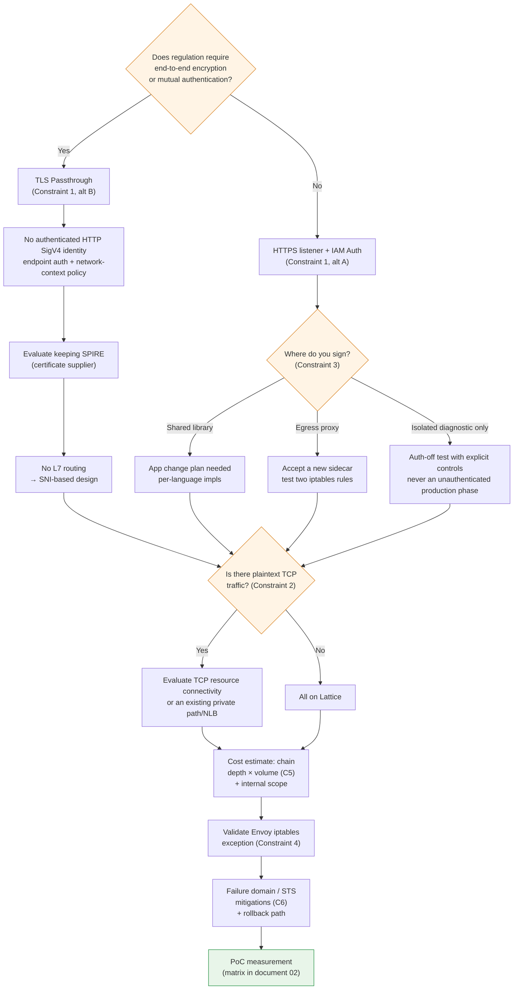

# Constraints and Decision Points

> **Scope**: VPC Lattice service/resource APIs and AWS Gateway API Controller; verify the selected release and installed CRDs.
> **Last Updated**: September 13, 2026

## What This Document Covers

- Six constraints you must answer before finalizing a design, and the alternatives for each
- The decision tree they form together — where one choice closes off another
- A pre-migration checklist

## Constraint Summary

| # | Constraint | Nature | Alternatives exist | When to decide |
|---|---|---|---|---|
| 1 | TLS passthrough cannot authenticate HTTP SigV4 identity | Current documented service behavior | Endpoint authentication; anonymous network-context policy | First |
| 2 | Raw TCP is not a service listener | Distinguish TCP resource connectivity | Resource gateway or existing private path/NLB | Early |
| 3 | Application impact of SigV4 signing | Implementation choice | 3 | Early |
| 4 | Mesh coexistence route/signing validation | Configuration-dependent | Explicit bypass or configured forwarding | Before migration |
| 5 | Per-hop request and data charges | Structural | Architectural adjustment | During design |
| 6 | Failure domain concentration + STS dependency | Structural | Mitigation only | During design |

Constraints 1 and 2 are **current capability and trust-boundary choices**, not predictions that AWS can never add features. Separate service listeners, resource connectivity and controller support.

## Constraint 1 — TLS Passthrough and Authenticated HTTP Identity

### The principle

Two facts from documents [03](./03-auth-flow.md) and [04](./04-networking-basics.md) combine to produce this constraint.

1. SigV4 verification must read the `Authorization` header
2. Reading headers requires terminating TLS

TLS Passthrough by definition does not terminate TLS. Therefore **Lattice cannot see the signature header and cannot apply request-signature-based authentication.**

Controller policy attachment support and AWS service capabilities are separate. TLSRoute is not among the documented IAMAuthPolicy attachment targets; nevertheless AWS TLS listeners support policies based on anonymous principals and network context.

::: note Confirmed limitation
TLS passthrough cannot evaluate encrypted HTTP SigV4 identity or HTTP path/header conditions. Anonymous-principal policies are supported; use the [TLS listener reference](https://docs.aws.amazon.com/vpc-lattice/latest/ug/tls-listeners.html), not speculation that every policy is rejected or ignored.
:::

### The two alternatives

| Alternative | Configuration | What you gain | What you lose |
|---|---|---|---|
| **A. HTTPS listener + IAM Auth** | Lattice terminates TLS, verifies SigV4, evaluates three policies | IAM-based authorization, path/method/header conditions, L7 routing, detailed access logs | End-to-end encryption (terminated once at Lattice), endpoint's own mTLS |
| **B. TLS Passthrough + endpoint mTLS** | Custom-domain SNI selects the service; endpoints authenticate TLS | Endpoint encryption and certificate identity | No authenticated HTTP SigV4 identity or HTTP L7 inspection; anonymous network-context policy is distinct |

### Which to choose

**This is the most important branch point in the migration.** Most other decisions depend on it.

The criterion is **whether regulation requires end-to-end encryption or workload-to-workload mutual authentication.**

- **If not, choose A.** IAM Auth's authorization granularity and observability benefits are substantial, and this is how Lattice is designed to be used.
- **If yes, choose B.** But choosing B means redesigning where authorization is expressed — Lattice only knows SNI, so authorization must happen in the application or in endpoint mTLS certificate validation. And as noted in [document 05](./05-spiffe-to-iam.md), **SPIRE may still be necessary.**

Mixing is possible. **You can split A and B per service** — B for services under regulation, A for the rest. The cost is operating two authorization models simultaneously.

## Constraint 2 — Choose Service or Resource Connectivity

### The principle

The absence of a raw-TCP service listener does not exclude TCP resources: Lattice resource configurations/resource gateways provide a separate access model. For service TLS passthrough, the client must start with TLS and send the configured custom-domain SNI.

Check protocol requirements and current controller support rather than treating this as a permanent limit of the whole product.

### Identifying what is affected

Early in planning, **find every East-West communication that uses plaintext TCP.** Common ones:

Inventory plaintext database/cache/custom TCP protocols. Do not put gRPC over HTTP/2 (h2c) in the same unsupported category; validate its exact HTTP listener/route/target configuration.

### The alternative — a Hybrid configuration

| Traffic type | Path |
|---|---|
| HTTP / HTTPS / gRPC | **VPC Lattice** |
| TCP with TLS | Lattice **TLS Passthrough** (if SNI routing is viable) |
| Plaintext TCP | Evaluate Lattice TCP resource connectivity, existing private connectivity, or an NLB; service L7 features do not transfer automatically |

The reason to recommend this is simple: **trying to move everything to Lattice is the most common cause of migration delay.** If you pull "introduce TLS for plaintext TCP services" into migration scope, you need application changes and the schedule leaves your control.

App Mesh also supported TCP routes. Inventory **all traffic that actually depends on App Mesh**, not just HTTP, and complete its replacement before the end-of-support deadline.

## Constraint 3 — Application Impact of SigV4 Signing

If you chose IAM Auth (Constraint 1, alternative A), **someone must attach signatures to requests.** Deciding who is the choice with the most direct impact on application teams.

| Approach | Implementation | Pros | Cons |
|---|---|---|---|
| **① Shared library** | Apply SigV4 signing in each service's HTTP client (AWS SDK signing or a per-language library) | No extra hop → minimal latency. Credential management delegated to the SDK | **Code changes in every service.** Per-language implementations. Version management of signing logic |
| **② Egress proxy sidecar** | A `sigv4proxy` sidecar plus iptables redirecting only the Lattice range | **No application code changes.** Language-agnostic. Reference implementation exists | A sidecar reappears (partly offsetting the benefit of removing Envoy). One extra hop. Sidecar operations/upgrades |
| **③ Do not use IAM Auth** | authType `NONE`; authorize at another layer | No application changes, no overhead | **No authorization at the Lattice level.** Anyone in the service network can call. Hard to pass review |

### Practical recommendation

**If you have multiple languages or limited application-team capacity, start with ②.** The aws-samples reference implementation provides validated manifests — a `sigv4proxy` sidecar on 8080 with an init container redirecting only traffic bound for `169.254.171.0/24` to the proxy.

The irony of ② is plain: **you migrated to remove the Envoy sidecar and gained a signing sidecar.** That said, `sigv4proxy` is far lighter than Envoy, has no xDS control plane, and has static configuration. If "eliminate sidecars" was the core goal, you need ① — and then you need an application change plan.

An auth-off comparison is only for an isolated, explicitly approved test path with no business traffic and compensating network/application controls. Do not disable production authorization merely to make migration or benchmarking easier.

**Whichever approach you take, check the three pitfalls in [document 03](./03-auth-flow.md) (Host header, x-amz-date clock, sign at the last hop).**

## Constraint 4 — Envoy iptables Exception During Coexistence

Verify the installed mesh policy and observed forwarding behavior before choosing an exclusion or an explicitly configured proxy path. Unknown destinations are not rejected by every Envoy configuration.

Mesh iptables rules may intercept Lattice-bound traffic. Whether it forwards, fails or alters signed fields depends on outbound policy and route configuration. Inspect actual rules and logs, then validate the chosen IPv4/IPv6 signing path.

| Item | Value |
|---|---|
| Range to exclude (IPv4) | `169.254.171.0/24` |
| Range to exclude (IPv6) | `fd00:ec2:80::/64` |
| App Mesh setting location | The init container's egress-ignore CIDR list |
| Istio setting location | The `traffic.sidecar.istio.io/excludeOutboundIPRanges` annotation |

### Easily missed points

- **If you use IPv6, you must exclude the IPv6 range too.** Excluding only IPv4 on a dual-stack cluster produces intermittent failures.
- **Pod-level annotations apply only to newly created Pods.** Existing Pods must be restarted.
- **When combined with approach ② of Constraint 3, you have two iptables rules.** You must exclude the Lattice range from App Mesh interception while simultaneously redirecting the Lattice range to the signing proxy. Always test the ordering and interaction of the two rules.

Validate this setting **before** starting the migration. It is the number one cause of a first Lattice call failing.

## Constraint 5 — Per-Hop Charges Are Dominated by Call Chain Depth

### The billing structure

VPC Lattice pricing has three axes.

| Axis | Nature |
|---|---|
| **Service provisioning** | Hourly, proportional to service count |
| **Data processing** | Per GB, **inter-AZ charges included here** (no separate cross-AZ charge) |
| **Requests / connections** | **Request count** for HTTP/HTTPS listeners; **TCP connection count** for TLS listeners |

::: warning Needs verification
Unit prices vary by region and over time, and there are free tiers. **Before finalizing a design, check current unit prices for your region directly on the [VPC Lattice pricing page](https://aws.amazon.com/vpc/lattice/pricing/).** This document does not state unit prices.
:::

### Why chain depth dominates cost

The key is that charges are **per hop.**

For a simple four-call chain with one Lattice request per edge, one user operation produces four service requests. Actual costs also include fan-out, retries, polling, payload volume and provisioned hours; chain depth alone is not a complete cost model.

In AS-IS (App Mesh) the structure was different. App Mesh itself had no per-request charge; cost appeared as the compute resources Envoy consumed. **The shift of the cost model from "compute resources" to "request count"** is the financial character of this migration.

### Practical implications

| Implication | Response |
|---|---|
| **Chatty services get expensive** | Consolidate patterns that make many calls per request into batch/aggregate calls |
| **Deep chains get expensive** | Reducing chain depth improves both cost and latency ([document 02](./02-latency.md)) |
| **Moving all communication to Lattice can spike costs** | **Keeping intra-cluster communication off Lattice** may be the sensible choice |
| **Client polling generates traffic** | Count calls that actually traverse billed listeners; do not conflate client probes with Lattice-managed target health checks without checking pricing |

**The last two items matter most.** Lattice's strength is communication crossing cluster, VPC, and account boundaries; for traffic within the same cluster it offers little benefit while adding cost and latency. **Sending only boundary-crossing traffic through Lattice and leaving intra-cluster traffic on ClusterIP** is often the right answer for both cost and performance.

But here you meet the constraint from [document 03](./03-auth-flow.md) — **calling the k8s Service DNS directly inside the cluster bypasses auth policy evaluation.** So if you choose "internal traffic does not go through Lattice," you must **separately design authorization for internal traffic** via NetworkPolicy or the application layer. This is where cost optimization and authorization consistency conflict.

### Data needed for cost estimation

Collect these before migrating. Without them, cost estimation is impossible.

| Item | How to collect |
|---|---|
| Number of services moving to Lattice | From the migration scope definition |
| Per-service-pair request rate (RPS) | App Mesh Envoy metrics or application metrics |
| **Average call chain depth** | Application tracing before and after migration; correlate with Lattice request IDs/logs |
| Per-service-pair data transfer volume | Envoy metrics or flow logs |
| Health check / polling frequency | Each service's configuration |

Preserve or add application tracing across the migration. Lattice does not create a native span, but this does not eliminate application traces or make call-chain analysis impossible.

## Constraint 6 — Failure Domain Concentration and STS Dependency

### The failure domain concentrates

AS-IS and TO-BE have different failure characteristics.

| Aspect | Sidecar path | Lattice path |
|---|---|---|
| Failure scope | A proxy can fail locally; shared configuration, identity and network dependencies can fail broadly | Depends on affected service, AZ, policy and underlying dependency; not necessarily all East-West traffic |
| Remediation | Workload/config rollback, capacity changes, approved alternate path | Customer policy/target/controller remediation plus AWS-side recovery where applicable |
| Responsibility | Customer workload and shared-infrastructure responsibilities | AWS-managed service plus customer IAM, target, controller and application responsibilities |

Neither model has a measured failure probability in this chapter. Build a dependency-specific fault model and test approved recovery paths; managed does not mean the customer has no remediation responsibilities.

### The STS dependency

With IAM Auth, **credential acquisition and refresh depend on the configured provider** ([document 03](./03-auth-flow.md)). IRSA uses STS; EKS Pod Identity uses the node agent and EKS Auth. Cached valid credentials avoid a remote credential request for every service call.

- Temporary credentials expire, and the provider must obtain replacements
- If refresh fails and no valid credentials remain, the client may fail before dispatch or send a request that Lattice rejects; distinguish these outcomes rather than assuming every failure is an HTTP 403
- An outage on the actual credential-delivery path can interrupt service calls after valid cached credentials are exhausted; do not fall back to unsigned requests

In AS-IS, SPIRE Server occupied this position. **The existence of the dependency is not new — the owner shifts from the customer to AWS** (the same structure as difference (b) in [document 05](./05-spiffe-to-iam.md)).

### Mitigations

This constraint cannot be removed, only mitigated.

| Mitigation | Content |
|---|---|
| **Confirm credential cache lifetime** | Record credential expiry, refresh timing, caching and failure behavior of the selected provider; remaining valid credentials bound how long it may tolerate a delivery-path outage |
| **Test refresh-failure behavior** | In an approved isolated test, interrupt the actual provider path: STS for IRSA, or the agent/EKS Auth path for Pod Identity. Observe through credential expiry, distinguish local acquisition failures from Lattice responses, record retry behavior, and restore the path. Blocking only a Pod's direct STS egress is not a universal test |
| **Redundancy for critical paths** | Consider keeping an alternative path (direct call, NLB) for the highest-criticality communication |
| **Phased migration** | Do not move everything at once; start with lower-criticality traffic. Keep a rollback path |
| **Recalculate RTO/RPO** | The failure characteristics changed, so revisit the basis for your existing targets |
| **Integrate AWS Health / status notifications** | Since you cannot remediate directly, early detection is the core of the response |

**"Redundancy for critical paths" and "phased migration" are the most effective in practice** — especially keeping a rollback path. App Mesh end of support means you must eventually remove it, but during the validation window you must be able to roll back.

## Unconfirmed Items

::: warning Needs verification
The following could not be confirmed against official documentation. Verify them directly if they affect your design.

**① API Gateway bridging** — confirm the exact REST/HTTP API integration type. Do not assume a Lattice service-network ARN is a VPC Link target or that an ALB/NLB can directly target a Lattice link-local address. A bridging design needs an explicitly implemented proxy/consumer and supported private connectivity, with its own auth and failure behavior.

**② Quotas** — verify the required resource count, target count, bandwidth, connection and request limits in the [current quota reference](https://docs.aws.amazon.com/general/latest/gr/vpc-lattice-service.html) and the account/Region. Do not treat old default numbers or adjustability as universal.

**③ AZ behavior** — AWS documents client-side DNS AZ affinity, but backend targets can span AZs. Do not infer same-AZ target selection from that DNS behavior; measure it for the chosen targets and client path.

**④ TLS policy behavior** — confirmed: anonymous-principal policies can apply; authenticated HTTP SigV4 identity cannot. See Constraint 1.

**⑤ ECH/ESNI** — AWS explicitly excludes these for TLS listeners; see [document 04](./04-networking-basics.md).
:::

**By contrast, the following are confirmed**: the link-local ranges (`169.254.171.0/24`, `fd00:ec2:80::/64`), the SigV4 service name (`vpc-lattice-svcs`), the three listener protocols (HTTP/HTTPS/TLS_PASSTHROUGH), the condition key list, the App Mesh end-of-support date (September 30, 2026), that cross-AZ charges are included in data processing, and that trace spans are not supported.

## Decision Tree

Because the constraints interact, **the order of decisions matters.** An earlier decision closes off later options.

**The first branch (regulatory requirements) governs everything.** That decision rests on organizational review standards rather than technology, so **take the review-issue table from [document 05](./05-spiffe-to-iam.md) and agree with your security team first.** Confirming it later means unwinding every design decision made before it.

## Pre-Migration Checklist

| Category | Item |
|---|---|
| **Review** | Reviewed the ⚠️/❌ items from [document 05](./05-spiffe-to-iam.md)'s issue table with security reviewers |
| **Review** | Agreed compensating controls for weakened server identity proof (IAM control over resource creation, CloudTrail monitoring) |
| **Review** | Rewrote the argument for the root-of-trust transfer (customer CA → AWS IAM/STS) |
| **Design** | Decided Constraint 1's branch (HTTPS listener + IAM Auth / TLS Passthrough) |
| **Design** | Listed plaintext TCP traffic; fixed the Hybrid scope |
| **Design** | Decided the signing approach (library / egress proxy / phased) |
| **Design** | Decided Lattice scope (boundary-crossing only / including internal) and the authorization plan for internal traffic |
| **Data** | Preserve application tracing and compare call-chain behavior before/after migration |
| **Data** | Collected per-service-pair RPS and data transfer volume |
| **Data** | Measured the AS-IS latency baseline (matrix in [document 02](./02-latency.md), including Envoy CPU usage) |
| **Config** | Validated Envoy iptables exception CIDRs (IPv4 + IPv6) |
| **Config** | Allowed inbound from the Lattice managed prefix list on node SGs |
| **Config** | Enable Lattice access logs and correlate request IDs with client/server logs |
| **Config** | Evaluated Pod readiness gates (zero-downtime rolling updates) |
| **Verify** | Confirmed unconfirmed items ①–⑤ against current official documentation |
| **Verify** | Confirmed current quota values and unit prices for your region |
| **Operations** | Observability plan — how to cope with the absent Lattice span (application OpenTelemetry instrumentation) |
| **Operations** | Secured a rollback path; defined the phased migration order |
| **Operations** | Tested behavior on STS refresh failure |
| **Operations** | Recalculated RTO/RPO |

## Summary

- Distinguish TLS authenticated identity from anonymous policy, and service listeners from TCP resource connectivity.
- **The first decision governs everything.** Whether regulation requires end-to-end encryption or mutual authentication determines the rest of the design, so agree with security reviewers before technical work begins.
- **Do not try to move everything to Lattice.** A hybrid — plaintext TCP on NLB, intra-cluster traffic on ClusterIP — is often the right answer for cost, latency, and schedule. But you must separately design authorization for internal traffic.
- **The cost model shifts from compute resources to request count.** Cost is proportional to request count × chain depth, so chatty communication and deep chains get expensive.
- Preserve application tracing; lack of a native Lattice span does not prevent call-chain measurement.
- Failure domain concentration and the STS dependency cannot be removed — **mitigate with phased migration and a secured rollback path.**

## References

- [Amazon VPC Lattice pricing](https://aws.amazon.com/vpc/lattice/pricing/)
- [Amazon VPC Lattice endpoints and quotas](https://docs.aws.amazon.com/general/latest/gr/vpc-lattice-service.html)
- [Control access to VPC Lattice services using auth policies](https://docs.aws.amazon.com/vpc-lattice/latest/ug/auth-policies.html)
- [AWS Gateway API Controller — IAMAuthPolicy](https://www.gateway-api-controller.eks.aws.dev/latest/api-types/iam-auth-policy/)
- [AWS Gateway API Controller — Pod Readiness Gates](https://www.gateway-api-controller.eks.aws.dev/latest/guides/pod-readiness-gates/)
- [aws-samples/migrating-from-aws-app-mesh-to-amazon-vpc-lattice](https://github.com/aws-samples/migrating-from-aws-app-mesh-to-amazon-vpc-lattice)
- [Comparing the Costs of Common Network Architecture Patterns with Amazon VPC Lattice](https://repost.aws/articles/AR9Tt9m6kKR6mF5Ohj5K-3Og/comparing-the-costs-of-common-network-architecture-patterns-with-amazon-vpc-lattice)
- [App Mesh Document history](https://docs.aws.amazon.com/app-mesh/latest/userguide/doc-history.html)
