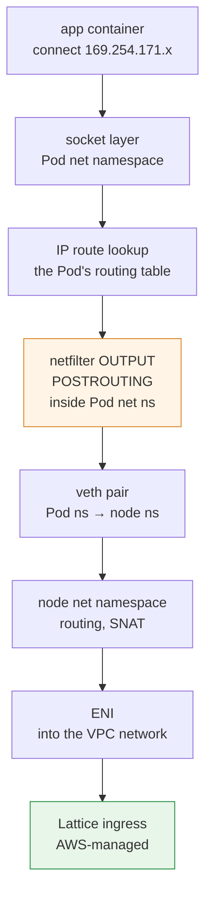
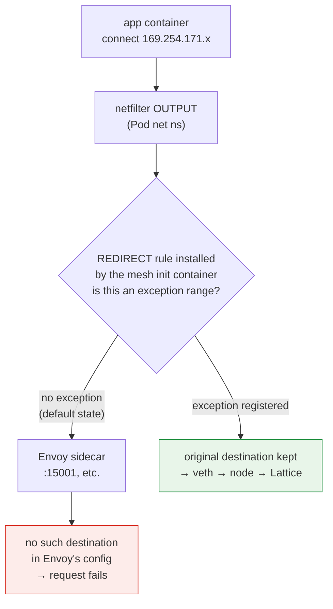
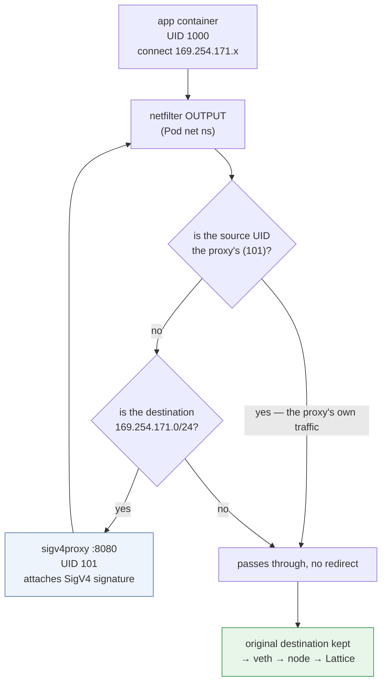

# Kernel Datapath — How Link-Local Interception Actually Works

> **Supported Versions**: Amazon VPC Lattice (GA), AWS Gateway API Controller v1.1+, Linux 6.1 / 6.12 / 6.18 (Amazon Linux 2023)
> **Last Updated**: September 12, 2026

## What This Document Covers

- The path a packet a Pod sends to a Lattice address actually travels inside the kernel
- Exactly where in the kernel a sidecar mesh's iptables interception collides with Lattice traffic
- How conntrack behaves in this configuration, and why the egress proxy approach is sensitive to rule ordering

## Why This Document Exists

[Document 04](./04-networking-basics.md) explained that a link-local address is a marker meaning "the infrastructure handles this packet." That is enough conceptually, but **the problems that actually break during migration live at the kernel layer.**

| Symptom in production | The reality at the kernel layer |
|---|---|
| "Every Lattice call fails" | Envoy's iptables REDIRECT is also intercepting the Lattice range |
| "I added the exception CIDR and it still fails" | Rule ordering, or a missing IPv6 range |
| "I added an egress proxy and now it loops" | The proxy's own traffic is being redirected again |
| "Connections drop intermittently" | conntrack exhaustion or timeouts |
| "It only fails on some nodes" | Per-node rule state divergence, or clock synchronization |

This document bridges [document 04](./04-networking-basics.md) and the [Linux Kernel section](../../kernel/README.md). General kernel concepts live in [Kernel Features Behind Containers](../../kernel/01-container-primitives.md) and [Kernel Networking Stack](../../kernel/02-network-stack.md); here we cover only **what is specific to a Lattice configuration**.

## A Packet's Journey — Without a Sidecar

First the clean TO-BE state: no Envoy, with the application signing directly.



Three things to note.

**① The application does nothing special.** `169.254.171.x` is an ordinary IPv4 address and `connect()` is an ordinary call. It does not know Lattice exists.

**② The route lookup happens in the Pod's routing table.** Since the net namespace is the Pod boundary ([Container Kernel Features](../../kernel/01-container-primitives.md)), `ip route` inside the Pod makes this decision. With VPC CNI, the Pod's default route goes through veth to the node, and the link-local range follows that default route.

> **This is the crux of the link-local convention.** `169.254.0.0/16` is nominally a "non-routable" range, yet Lattice has the infrastructure steer packets in that range **all the way to an ingress endpoint inside the VPC.** In other words it does not strictly follow link-local semantics — it **reuses the range as a signal meaning "the infrastructure intercepts this."** The same reasoning explains why IPv6 uses a ULA (`fd00:ec2:80::/64`) rather than link-local (`fe80::/10`) — the traffic genuinely has to be routed.

**③ netfilter hooks are evaluated inside the Pod net namespace.** That is what makes the collision in the next section possible.

## The Collision — Envoy iptables Interception

### What a sidecar mesh installs

App Mesh's and Istio's init containers install iptables rules inside the Pod's net namespace. The core structure is simple.

```
# Conceptual form (real rules are more complex)
OUTPUT  → jump to a custom chain
custom chain:
  - traffic from Envoy's own UID → RETURN (prevents an infinite loop)
  - exception ranges → RETURN
  - everything else → REDIRECT to Envoy's port
```

`REDIRECT` is a netfilter DNAT-family target that **rewrites the destination to a local port.** The application still believes it is sending to the original address while the packet goes to Envoy.

### Exactly where the collision occurs



So the collision happens at **the `OUTPUT` hook of the Pod's net namespace.** Lattice traffic is also "outbound from the Pod," so it matches the rule, and Envoy cannot find `169.254.171.x` in its cluster configuration and fails.

### Why this is a clear failure, not a silent one

This is actually fortunate. When Envoy does not know a destination it usually **returns an error immediately** (connection refused or 503), so unlike conntrack exhaustion the symptom is unambiguous. It appears in Envoy access logs as a request to an unknown cluster.

**Diagnosis path**: when Lattice calls fail, check the Envoy sidecar logs first. If requests bound for `169.254.171.x` appear there, interception is the cause.

### Registering the exception — what, and where

| Mesh | Setting |
|---|---|
| App Mesh | Add the Lattice range to the init container's egress-ignore CIDR list |
| Istio | The `traffic.sidecar.istio.io/excludeOutboundIPRanges` annotation |

Ranges to exclude:

| Range | Required? |
|---|---|
| `169.254.171.0/24` | **Required** |
| `fd00:ec2:80::/64` | **Required on dual-stack clusters** |

### Four practical pitfalls

**① Missing IPv6** — excluding only IPv4 leads to intermittent failures on dual-stack clusters. If a client receives an AAAA record and connects over IPv6, that path is still intercepted. **The symptom being "occasional failure" makes it hard to diagnose**, because it depends on DNS response ordering and the client's address selection.

**② Annotations apply only to new Pods** — a Pod-level annotation is read by the init container at Pod creation. Existing Pods must be restarted.

**③ Rule ordering** — netfilter evaluates a chain's rules **top to bottom** and acts on the first match. The exception `RETURN` rule must come **before** the `REDIRECT` rule. Standard mesh init containers get this order right, but if you add rules yourself you must verify it.

**④ Confusion with other link-local services** — Pod Identity Agent is `169.254.170.23` and IMDS is `169.254.169.254`. Lattice is `169.254.171.0/24`. **These are different ranges inside the same `169.254.0.0/16`**, so excluding the whole `169.254.0.0/16` also removes IMDS and Pod Identity traffic from mesh interception. That may be what you want (usually that traffic should not be intercepted), but **state the intent and decide deliberately.**

### Verification

```bash
# Inspect the actual rules in the Pod's net namespace
kubectl exec <pod> -c <sidecar-or-debug> -- iptables -t nat -L -n -v

# Check whether the path to the destination goes through Envoy
kubectl exec <pod> -c app -- curl -sv --max-time 5 \
  http://<lattice-dns>/health

# If the request shows up in Envoy's logs, it is being intercepted
kubectl logs <pod> -c envoy --tail=50
```

Do this verification **before** starting the migration. This is constraint 4 in [document 06](./06-constraints.md).

## The Kernel Layer of the Egress Proxy Approach

Signing approach ② (egress proxy) from [document 03](./03-auth-flow.md) uses **the same iptables mechanism for the opposite purpose.**



This is the structure of the aws-samples reference implementation — the init container uses iptables to redirect **only traffic bound for `169.254.171.0/24`** to local port 8080, and the proxy attaches the SigV4 signature on the way out.

### Why the UID-based exception is mandatory

The first branch in that diagram is **the mechanism preventing an infinite loop.**

The packet the proxy sends out, signed, is also destined for `169.254.171.x`. Without the UID exception it would match the rule again and be redirected to itself, looping.

So the proxy runs under **a dedicated UID** (101 in the reference implementation) and traffic from that UID is `RETURN`ed. netfilter's `owner` match (`-m owner --uid-owner`) makes this possible.

**Practical implication**: the proxy container's `runAsUser` and the UID in the iptables rule **must match.** Change one and you either loop or lose signing. This is the most fragile link when customizing the manifests.

### When two sets of iptables rules coexist

During migration a single Pod may carry both **the mesh interception exception and the signing proxy redirect.** This is what constraint 4 in [document 06](./06-constraints.md) means by "always test the ordering and interaction of the two rules."

The logically required order is:

| Order | Rule | Purpose |
|---|---|---|
| 1 | proxy UID → `RETURN` | Loop prevention (highest priority) |
| 2 | Lattice range → `REDIRECT` to the signing proxy | Attach the signature |
| 3 | mesh's other exception ranges → `RETURN` | Exclude from mesh interception |
| 4 | everything else → `REDIRECT` to Envoy | Mesh interception |

**Rule 2 must precede rule 4** for Lattice traffic to reach the signing proxy rather than Envoy. When two init containers each install rules, the order depends on execution order, so **dumping the actual rules is the only trustworthy verification.**

::: warning Needs verification
The ordering above is **derived logically** from netfilter's evaluation rules (sequential within a chain, acting on first match) and each rule's purpose. It has not been validated against the actual rule order a specific mesh version's init container installs.

Chain names and insertion points differ per mesh implementation, so **always dump the real rules with `iptables -t nat -L -n -v` in your target environment and verify the order.** The execution order of two init containers is determined by the order of the `initContainers` array in the Pod spec.
:::

## conntrack — Behavior in This Configuration

### What Lattice traffic leaves in conntrack

As seen in [Container Kernel Features](../../kernel/01-container-primitives.md), NAT creates conntrack entries. Where entries are created in this configuration:

| Configuration | Where conntrack entries appear |
|---|---|
| Application signs directly | Pod net ns (minimal without NAT), SNAT in the node ns |
| Egress proxy signing | **REDIRECT (DNAT) in the Pod net ns** + the proxy→Lattice connection + node ns SNAT |
| Mesh running alongside | All of the above plus entries on the mesh interception path |

So **the egress proxy approach creates more conntrack entries**, because REDIRECT is DNAT and the kernel must remember how to undo it.

What that means in high-connection environments: introducing a signing proxy **increases conntrack consumption**, so when choosing an approach in [document 03](./03-auth-flow.md) you should also weigh the node's conntrack headroom. The shared-library approach (①) does not carry this extra load.

### Diagnosis

conntrack exhaustion **silently drops connections**, as covered in the [kernel section](../../kernel/03-eks-node-tuning.md). In a Lattice configuration, "connections drop intermittently" makes this a candidate.

```bash
# Direct evidence of exhaustion
conntrack -S | grep -E "insert_failed|drop"

# Check entries toward the Lattice range
conntrack -L 2>/dev/null | grep 169.254.171 | head

# Utilization
echo "$(cat /proc/sys/net/netfilter/nf_conntrack_count) / $(cat /proc/sys/net/netfilter/nf_conntrack_max)"
```

**How to distinguish a Lattice failure from conntrack exhaustion**: exhaustion affects **all new connections**, not just Lattice. If only Lattice calls fail while other traffic is fine, it is interception or authentication, not conntrack. Conversely, if connectivity is broadly unstable, check conntrack first.

## Security Groups and the Kernel

[Document 04](./04-networking-basics.md) covered opening Security Groups with prefix lists. One thing to add from a kernel perspective.

**A Security Group is not the kernel's netfilter.** It is AWS's stateful firewall applied to the ENI at the VPC level, enforced outside the instance (hypervisor/network infrastructure).

What that means:

- **`iptables -L` on the node will not show SG rules.** The two layers are separate
- If an SG blocks traffic, the packet **never reaches the node kernel** → `tcpdump` will not see it either
- Therefore **"tcpdump shows nothing" is a signal for an SG or routing problem.** Something dropped after reaching the kernel leaves a counter

As a diagnosis order:

| Observation | Suspect |
|---|---|
| `tcpdump` shows no outbound packet | Inside the Pod — routing, interception, DNS |
| Outbound visible but no response | SG (check both directions), routing, the Lattice side |
| Response arrives but the application does not get it | Socket buffers, or a problem on the interception path |
| Drop counters rising | conntrack or qdisc ([Kernel Networking Stack](../../kernel/02-network-stack.md)) |

## Per-Node Divergence — "It Only Fails on Some Nodes"

This symptom narrows to a few causes.

| Cause | Check |
|---|---|
| **Node SGs differ** | Whether the prefix list inbound rule is applied per node group |
| **Kernel versions differ** | With `kernel-default` AMIs, 6.1 and 6.18 can coexist depending on replacement timing ([Kernel Tuning](../../kernel/03-eks-node-tuning.md)) |
| **conntrack settings differ** | Depending on ConfigMap state at bootstrap time |
| **Clock synchronization** | `x-amz-date` 5-minute skew — 403s on specific nodes only ([document 03](./03-auth-flow.md)) |
| **Whether Pods were restarted** | Annotation changes not applied to old Pods |

**The "some nodes" pattern is itself diagnostic information.** Total failure points to configuration or authentication; node-scoped failure points to node state divergence.

## Summary

- A packet bound for Lattice is **an ordinary IPv4/IPv6 connection.** The special handling is on the infrastructure side, not in the application.
- The link-local convention **does not strictly follow "non-routable range" semantics — it reuses the range as a signal meaning "the infrastructure intercepts."** That is why IPv6 uses a ULA.
- The mesh collision happens at **the `OUTPUT` hook of the Pod's net namespace.** Fortunately it is not a silent failure — evidence appears in Envoy's logs.
- Exception pitfalls: **missing IPv6** (presents as intermittent failure), annotations applying only to new Pods, **rule ordering**, and excluding all of `169.254.0.0/16` also covering IMDS and Pod Identity.
- The egress proxy approach requires **UID-based loop prevention**, and the proxy's `runAsUser` must match the iptables UID. It also **creates additional conntrack entries.**
- When two sets of iptables rules coexist, **dumping the actual rules is the only trustworthy verification.**
- **A Security Group is not kernel netfilter.** Traffic blocked by an SG does not appear in `tcpdump`, so "nothing is captured" becomes diagnostic information.

## References

- [Linux Kernel Overview](../../kernel/README.md) — general background for this document
- [Kernel Features Behind Containers](../../kernel/01-container-primitives.md) — namespaces, netfilter, conntrack
- [Kernel Networking Stack](../../kernel/02-network-stack.md) — packet path and observation points
- [EKS Node Kernel Tuning](../../kernel/03-eks-node-tuning.md) — conntrack configuration paths
- [aws-samples — IAM authentication with VPC Lattice and EKS](https://github.com/aws-samples/migrating-from-aws-app-mesh-to-amazon-vpc-lattice/blob/main/vpc-lattice-config/IAMAUTH.md)
- [AWS Gateway API Controller — Deploy the controller](https://www.gateway-api-controller.eks.aws.dev/latest/guides/deploy/)
- [iptables-extensions(8) — owner match](https://man7.org/linux/man-pages/man8/iptables-extensions.8.html)
