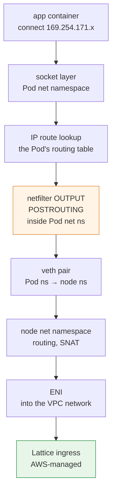
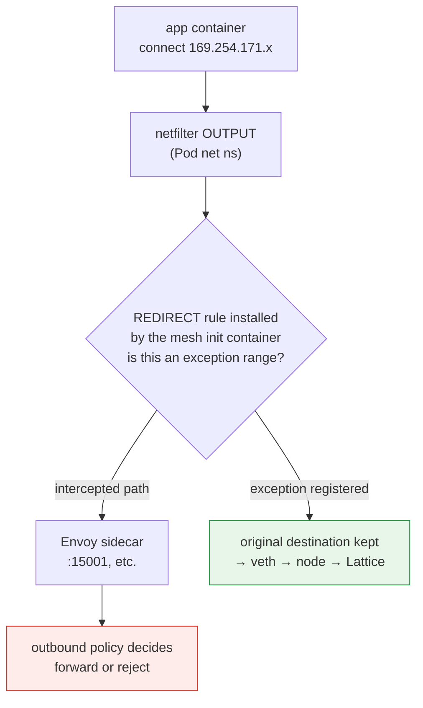
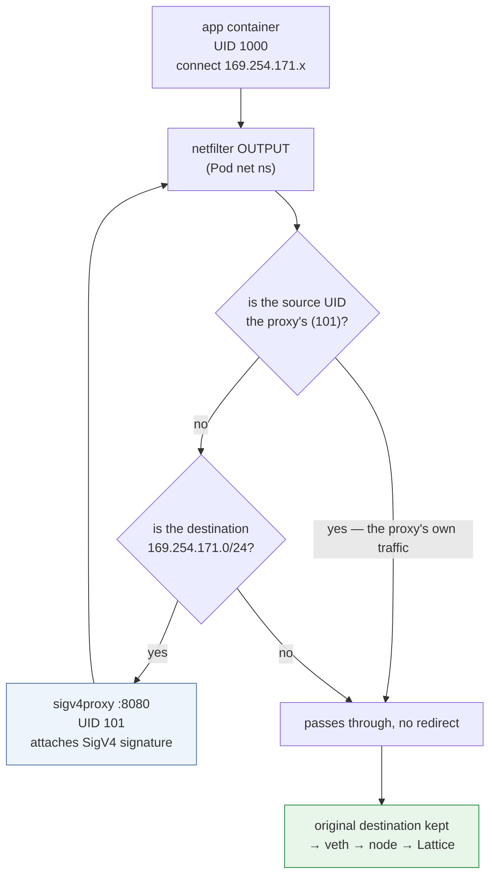

# Kernel Datapath — How Link-Local Interception Actually Works

> **Scope**: VPC Lattice service/resource APIs and AWS Gateway API Controller; verify the selected release and installed CRDs.
> **Last Updated**: September 13, 2026

## What This Document Covers

- The path a packet a Pod sends to a Lattice address actually travels inside the kernel
- Exactly where in the kernel a sidecar mesh's iptables interception collides with Lattice traffic
- How conntrack behaves in this configuration, and why the egress proxy approach is sensitive to rule ordering

## Why This Document Exists

[Document 04](./04-networking-basics.md) explained that a link-local address is a marker meaning "the infrastructure handles this packet." That is enough conceptually, but **the problems that actually break during migration live at the kernel layer.**

| Symptom in production | The reality at the kernel layer |
|---|---|
| "Every Lattice call fails" | Envoy's iptables REDIRECT is also intercepting the Lattice range |
| "I added the exception CIDR and it still fails" | Rule ordering, or a missing IPv6 range |
| "I added an egress proxy and now it loops" | The proxy's own traffic is being redirected again |
| "Connections drop intermittently" | conntrack exhaustion or timeouts |
| "It only fails on some nodes" | Per-node rule state divergence, or clock synchronization |

This document bridges [document 04](./04-networking-basics.md) and the [Linux Kernel section](../../kernel/README.md). General kernel concepts live in [Kernel Features Behind Containers](../../kernel/01-container-primitives.md) and [Kernel Networking Stack](../../kernel/02-network-stack.md); here we cover only **what is specific to a Lattice configuration**.

## A Packet's Journey — Without a Sidecar

First the clean TO-BE state: no Envoy, with the application signing directly.



Three things to note.

**① The IP stack uses an ordinary connection.** Authentication is separate: an application or signing proxy must still implement the selected Lattice request-authentication path.

**② The route lookup happens in the Pod's routing table.** Since the net namespace is the Pod boundary ([Container Kernel Features](../../kernel/01-container-primitives.md)), `ip route` inside the Pod makes this decision. With VPC CNI, the Pod's default route goes through veth to the node, and the link-local range follows that default route.

> The diagram is a conceptual VPC CNI route, not a claim about undocumented AWS internals. Ordinary link-local/ULA address scope and AWS’s service-specific routing behavior are separate. Inspect actual routes and supported connectivity in the target environment.

**③ netfilter hooks are evaluated inside the Pod net namespace.** That is what makes the collision in the next section possible.

## The Collision — Envoy iptables Interception

### What a sidecar mesh installs

App Mesh's and Istio's init containers install iptables rules inside the Pod's net namespace. The core structure is simple.

```text
# Conceptual form (real rules are more complex)
OUTPUT  → jump to a custom chain
custom chain:
  - traffic from Envoy's own UID → RETURN (prevents an infinite loop)
  - exception ranges → RETURN
  - everything else → REDIRECT to Envoy's port
```

`REDIRECT` is a netfilter DNAT-family target that **rewrites the destination to a local port.** The application still believes it is sending to the original address while the packet goes to Envoy.

### Exactly where the collision occurs



Mesh interception can occur at **Pod-netns OUTPUT**. Whether the intercepted request forwards, fails or has signed fields altered depends on Envoy outbound policy and configured destinations. Logging a request in Envoy proves traversal, not by itself the cause of failure.

### Interpret proxy evidence with its configuration

A restricted proxy can return an error for an unknown destination; an allow-any/passthrough policy can forward it. Validate both the route and the returned error instead of assuming every missing exception causes an immediate 503.

**Diagnosis path**: when Lattice calls fail, check whether the Envoy sidecar logs contain the affected requests to `169.254.171.x`. This establishes proxy traversal. Correlate the returned error, route/outbound policy and any changes to signed fields before attributing failure to interception; a configured proxy can also forward the request successfully.

### Registering the exception — what, and where

| Mesh | Setting |
|---|---|
| App Mesh | Add the Lattice range to the init container's egress-ignore CIDR list |
| Istio | The `traffic.sidecar.istio.io/excludeOutboundIPRanges` annotation |

Ranges to exclude:

| Range | Required? |
|---|---|
| `169.254.171.0/24` | **Required** |
| `fd00:ec2:80::/64` | **Required on dual-stack clusters** |

### Four practical pitfalls

**① Missing IPv6** — excluding only IPv4 leads to intermittent failures on dual-stack clusters. If a client receives an AAAA record and connects over IPv6, that path is still intercepted. **The symptom being "occasional failure" makes it hard to diagnose**, because it depends on DNS response ordering and the client's address selection.

**② Annotations apply only to new Pods** — a Pod-level annotation is read by the init container at Pod creation. Existing Pods must be restarted.

**③ Rule ordering** — netfilter evaluates a chain's rules **top to bottom** and acts on the first match. The exception `RETURN` rule must come **before** the `REDIRECT` rule. Standard mesh init containers get this order right, but if you add rules yourself you must verify it.

**④ Confusion with other link-local services** — Pod Identity Agent is `169.254.170.23` and IMDS is `169.254.169.254`. Lattice is `169.254.171.0/24`. **These are different ranges inside the same `169.254.0.0/16`**, so excluding the whole `169.254.0.0/16` also removes IMDS and Pod Identity traffic from mesh interception. That may be what you want (usually that traffic should not be intercepted), but **state the intent and decide deliberately.**

### Verification

```bash
# Required, explicit test target; these are diagnostic reads.
: "${LATTICE_CONTEXT:?}" "${LATTICE_NAMESPACE:?}" "${LATTICE_POD:?}"
: "${LATTICE_DIAG_CONTAINER:?}" "${LATTICE_APP_CONTAINER:?}" "${LATTICE_URL:?}"
kubectl --context "$LATTICE_CONTEXT" -n "$LATTICE_NAMESPACE" \
  exec "$LATTICE_POD" -c "$LATTICE_DIAG_CONTAINER" -- iptables -t nat -L -n -v

# Unsigned connectivity observation: AWS_IAM may reject it.
kubectl --context "$LATTICE_CONTEXT" -n "$LATTICE_NAMESPACE" \
  exec "$LATTICE_POD" -c "$LATTICE_APP_CONTAINER" -- \
  curl -sv --max-time 5 "$LATTICE_URL"

# Inspect the configured proxy container only when present.
kubectl --context "$LATTICE_CONTEXT" -n "$LATTICE_NAMESPACE" \
  logs "$LATTICE_POD" -c "$LATTICE_DIAG_CONTAINER" --tail=50
```

Do this verification **before** starting the migration. This is constraint 4 in [document 06](./06-constraints.md).

## The Kernel Layer of the Egress Proxy Approach

Signing approach ② (egress proxy) from [document 03](./03-auth-flow.md) uses **the same iptables mechanism for the opposite purpose.**

### Structure



This is the structure of the aws-samples reference implementation — the init container uses iptables to redirect **only traffic bound for `169.254.171.0/24`** to local port 8080, and the proxy attaches the SigV4 signature on the way out.

### Why the UID-based exception is mandatory

The first branch in that diagram is **the mechanism preventing an infinite loop.**

The packet the proxy sends out, signed, is also destined for `169.254.171.x`. Without the UID exception it would match the rule again and be redirected to itself, looping.

Use a **dedicated proxy UID** and a matching owner exception. UID 101 in the diagram is illustrative; verify the actual sample/installed manifest rather than assuming a fixed UID across releases. Keep its permissions separate from the application.

**Practical implication**: the proxy container's `runAsUser` and the UID in the iptables rule **must match.** Change one and you either loop or lose signing. This is the most fragile link when customizing the manifests.

### When two sets of iptables rules coexist

During migration a single Pod may carry both **the mesh interception exception and the signing proxy redirect.** This is what constraint 4 in [document 06](./06-constraints.md) means by "always test the ordering and interaction of the two rules."

The logically required order is:

| Order | Rule | Purpose |
|---|---|---|
| 1 | proxy UID → `RETURN` | Loop prevention (highest priority) |
| 2 | Lattice range → `REDIRECT` to the signing proxy | Attach the signature |
| 3 | mesh's other exception ranges → `RETURN` | Exclude from mesh interception |
| 4 | everything else → `REDIRECT` to Envoy | Mesh interception |

**Rule 2 must precede rule 4** for Lattice traffic to reach the signing proxy rather than Envoy. When two init containers each install rules, the order depends on execution order.

Fortunately the mesh side can be verified — for Istio it is confirmed from source below.

### Istio's actual rule order (confirmed from source)

The order in which Istio's `istio-iptables` (`tools/istio-iptables/pkg/capture/run.go`) **appends** rules to the `ISTIO_OUTPUT` chain:

| Order | Rule | Purpose |
|---|---|---|
| 1 | Port-based exclusions → `RETURN` | Source comment: "Must be applied before connections back to self are redirected" |
| 2 | loopback / self-call handling | Handles the `appN => Envoy => Envoy => appN` path |
| 3 | **`-m owner --uid-owner <proxy-uid>` → `RETURN`** | **Loop prevention.** Source comment: "Avoid infinite loops. Don't redirect Envoy traffic directly back to Envoy" |
| 4 | **Excluded CIDRs (`excludeOutboundIPRanges`) → `RETURN`** | Exclude from interception |
| 5 | Included ports handling | |
| 6 | **`-j ISTIO_REDIRECT` (wildcard catch-all)** | Everything else to Envoy |

**The key finding**: the excluded-CIDR `RETURN` (4) is placed **before** the catch-all `REDIRECT` (6). So putting the Lattice range in Istio's `traffic.sidecar.istio.io/excludeOutboundIPRanges` works correctly on its own, with no ordering adjustment needed.

And the **proxy UID `RETURN` (3) comes even before the excluded CIDRs** — meaning Istio itself uses the same UID-based loop prevention described in this document.

::: warning Needs verification
The order above was confirmed from **Istio's** source. **The actual rule order App Mesh's init container installs has not been validated** — it is a separate implementation, and App Mesh reaches end of support on September 30, 2026.

Also, a configuration that **adds a signing proxy init container** has two init containers each installing rules, so ordering depends on the `initContainers` array order. For that combination, **dump the real rules with `iptables -t nat -L -n -v` in your target environment** and verify.
:::

## conntrack — Behavior in This Configuration

### What Lattice traffic leaves in conntrack

As seen in [Container Kernel Features](../../kernel/01-container-primitives.md), NAT creates conntrack entries. Where entries are created in this configuration:

| Configuration | Tracking to inspect |
|---|---|
| Application signs directly | Pod/node tracking may exist without NAT; inspect the actual CNI path and any SNAT |
| Egress signing proxy | App-to-proxy and proxy-to-service connections plus NAT as configured; connection pooling changes the count |
| Mesh coexistence | Additional paths and namespaces; do not infer a fixed multiplier from proxy count alone |

An egress proxy introduces separate app-to-proxy and proxy-to-service connections. Their tracking cost depends on namespaces, connection reuse and NAT settings; do not infer a fixed increase in the node’s table from proxy count alone.

Measure Pod/node conntrack and any eBPF map occupancy during representative load. A proxy can pool upstream connections while adding a local connection segment, so assess the actual trade-off rather than assuming one universal multiplier.

### Diagnosis

conntrack exhaustion **silently drops connections**, as covered in the [kernel section](../../kernel/03-eks-node-tuning.md). In a Lattice configuration, "connections drop intermittently" makes this a candidate.

```bash
# Correlate insertion/drop signals with count/max and kernel logs.
conntrack -S | grep -E "insert_failed|drop"

# Check entries toward the Lattice range
conntrack -L | grep 169.254.171 | head

# Utilization
echo "$(cat /proc/sys/net/netfilter/nf_conntrack_count) / $(cat /proc/sys/net/netfilter/nf_conntrack_max)"
```

A partial failure does not exclude conntrack pressure: namespaces, zones, tables, connection reuse and packet timing can differ. Correlate count/max, drop/insert counters and logs on the affected path; do not diagnose solely from whether other destinations still work.

## Security Groups and the Kernel

[Document 04](./04-networking-basics.md) covered opening Security Groups with prefix lists. One thing to add from a kernel perspective.

**A Security Group is not the kernel's netfilter.** It is AWS's stateful firewall applied to the ENI at the VPC level, enforced outside the instance (hypervisor/network infrastructure).

What that means:

- Node iptables listings do not contain AWS SG rules.
- An inbound packet rejected before delivery will not appear at the receiving node capture point.
- An outbound packet can be captured inside the sender before an external SG drops it. Interpret `tcpdump` by interface, namespace and direction; absence of a response is not unique proof of an SG problem.

As a diagnosis order:

| Observation | Suspect |
|---|---|
| `tcpdump` shows no outbound packet | Inside the Pod — routing, interception, DNS |
| Outbound visible but no response | SG (check both directions), routing, the Lattice side |
| Response arrives but the application does not get it | Socket buffers, or a problem on the interception path |
| Drop counters rising | conntrack or qdisc ([Kernel Networking Stack](../../kernel/02-network-stack.md)) |

## Per-Node Divergence — "It Only Fails on Some Nodes"

This symptom narrows to a few causes.

| Cause | Check |
|---|---|
| **Node SGs differ** | Whether the prefix list inbound rule is applied per node group |
| **Kernel versions differ** | With `kernel-default` AMIs, 6.1 and 6.18 can coexist depending on replacement timing ([Kernel Tuning](../../kernel/03-eks-node-tuning.md)) |
| **conntrack settings differ** | Depending on ConfigMap state at bootstrap time |
| **Clock synchronization** | `x-amz-date` 5-minute skew — 403s on specific nodes only ([document 03](./03-auth-flow.md)) |
| **Whether Pods were restarted** | Annotation changes not applied to old Pods |

**The "some nodes" pattern is itself diagnostic information.** Total failure points to configuration or authentication; node-scoped failure points to node state divergence.

## Summary

- A packet bound for Lattice is **an ordinary IPv4/IPv6 connection.** The special handling is on the infrastructure side, not in the application.
- Distinguish IPv4 link-local, IPv6 ULA and the documented AWS service-specific path; do not infer internal routing from the prefix alone.
- Inspect Pod-netns OUTPUT, outbound policy and real proxy logs; interception does not inevitably mean failure.
- Exception pitfalls: **missing IPv6** (presents as intermittent failure), annotations applying only to new Pods, **rule ordering**, and excluding all of `169.254.0.0/16` also covering IMDS and Pod Identity.
- The egress proxy approach requires **UID-based loop prevention**, and the proxy's `runAsUser` must match the iptables UID. It also **creates additional conntrack entries.**
- When two sets of iptables rules coexist, **dumping the actual rules is the only trustworthy verification.**
- SGs and netfilter are different layers; packet-capture visibility depends on direction and capture point.

## References

- [Linux Kernel Overview](../../kernel/README.md) — general background for this document
- [Kernel Features Behind Containers](../../kernel/01-container-primitives.md) — namespaces, netfilter, conntrack
- [Kernel Networking Stack](../../kernel/02-network-stack.md) — packet path and observation points
- [EKS Node Kernel Tuning](../../kernel/03-eks-node-tuning.md) — conntrack configuration paths
- [aws-samples — IAM authentication with VPC Lattice and EKS](https://github.com/aws-samples/migrating-from-aws-app-mesh-to-amazon-vpc-lattice/blob/main/vpc-lattice-config/IAMAUTH.md)
- [AWS Gateway API Controller — Deploy the controller](https://www.gateway-api-controller.eks.aws.dev/latest/guides/deploy/)
- [iptables-extensions(8) — owner match](https://man7.org/linux/man-pages/man8/iptables-extensions.8.html)
- [istio/istio — tools/istio-iptables/pkg/capture/run.go](https://github.com/istio/istio/blob/master/tools/istio-iptables/pkg/capture/run.go) — primary source for the rule ordering


Diagnostic commands require the named utilities and permissions in the selected container/net namespace. An unsigned HTTP rejection is not proof of failed IAM configuration. Use the reviewed signing path for authorization tests, and redact credentials from verbose logs.
