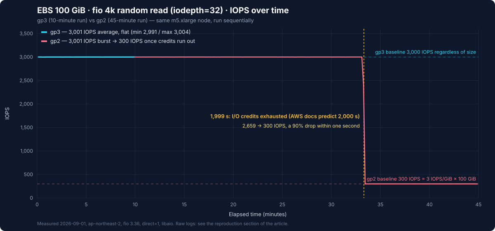

# EBS gp2 vs gp3 Measured Benchmark

> **Recorded Test Environment**: Kubernetes 1.36 (Amazon EKS), EBS CSI driver, fio 3.36
> **Last Updated**: September 11, 2026

The AWS one-liner — "move gp2 to gp3, save 20%, get equal or better performance" — is famous, but a graph showing **when and in what shape** that difference appears on a Kubernetes PVC is hard to find. This article attaches **one 100 GiB gp2 PVC and one 100 GiB gp3 PVC** to a single EKS node and hammers both with fio for 45 minutes. The point is not "gp2 is slow." It is this: **gp2 is indistinguishable from gp3 for 33 minutes, and then drops to one tenth within a single second.** These are reported results from the original run, not guaranteed outcomes of a repeat. Record initial credits, driver/image versions and node conditions when comparing runs.


[🔍 View interactive diagram](https://www.atomai.click/kubernetes-docs/archmaps/en-storage-01-ebs-gp2-gp3-benchmark-0.html)

## TL;DR — What We Measured

| Metric (100 GiB, m5.xlarge) | gp3 | gp2 |
|-----------------------------|-----|-----|
| 4k random read IOPS (qd32) | **3,001** average, flat for 600 s (min 2,991) | **3,001 → 300**, cliff at 1,999 s |
| 4k random read p99 latency (qd32) | 12.9 ms | 109.6 ms (dominated by the post-cliff period) |
| 4k random write IOPS (qd32, after credit depletion) | **3,025** | 601 (includes a partially refilled bucket) |
| 4k random read latency (qd1) | avg **0.56 ms** / p99 0.87 ms | avg 1.65 ms — bimodal: p50 0.60 / p95 3.39 ms |
| 1 MiB sequential read / write | 127 / 126 MiB/s (125 MiB/s baseline) | 130 / 129 MiB/s (128 MiB/s cap for ≤170 GiB) |
| Monthly cost (Seoul region, 100 GiB) | **$9.12** | $11.40 |

One sentence: **for the same capacity, gp2 sells you 33 minutes of 3,000 IOPS at a 25% higher price.**

## Test Environment

| Item | Value |
|------|-------|
| Cluster | Amazon EKS, Kubernetes 1.36, ap-northeast-2 |
| Node | **m5.xlarge** (4 vCPU, 16 GiB), provisioned by Karpenter — instance EBS limits: baseline 6,000 IOPS / 1,150 Mbps (143.75 MB/s ≈137 MiB/s), burst 18,750 IOPS / 4,750 Mbps |
| Volumes | one EBS **gp2 100 GiB** and one **gp3 100 GiB**, default settings (`StorageClass` `gp2` / `gp3`, EBS CSI driver) |
| Pod | `alpine:3.20` + `fio 3.36`, `direct=1` (bypasses the page cache), `libaio` engine, 8 GiB test file |
| Execution | **the two volumes were never measured concurrently** — multiple volumes share the instance's sustained/burst I/O budget, so concurrent tests would introduce interference |
| Pricing | gp2 $0.114/GB-month, gp3 $0.0912/GB-month + extra IOPS $0.0057/IOPS-month + extra throughput $0.0456/MiB/s-month (Seoul region, Pricing API, September 2026) |

The `nodeSelector` pins m5.xlarge for exactly one reason: its instance-level EBS limit (6,000 IOPS) is comfortably above the volume limit (3,000), to leave headroom for observing the volume. Confirm the bottleneck with total node I/O and instance/volume exceeded metrics as well. On a smaller instance (m5.large has a 3,600 IOPS baseline) the two limits blur together and the results become hard to interpret.

### Deployment Manifest

The recorded run used `alpine:3.20` / fio 3.36. Alpine 3.20 has left normal support, so the **rerun** example below uses 3.24.1. The package version can change: save the printed fio version and image digest, and keep new results separate from historical measurements. This is for regular EC2 nodes with `ebs.csi.aws.com` and its IAM permissions configured, not the EKS Auto Mode provisioner.

```yaml
apiVersion: v1
kind: Namespace
metadata:
  name: bench-storage
---
apiVersion: storage.k8s.io/v1
kind: StorageClass
metadata:
  name: bench-gp2
provisioner: ebs.csi.aws.com
parameters:
  type: gp2
  encrypted: "true"
volumeBindingMode: WaitForFirstConsumer
reclaimPolicy: Delete
---
apiVersion: storage.k8s.io/v1
kind: StorageClass
metadata:
  name: bench-gp3
provisioner: ebs.csi.aws.com
parameters:
  type: gp3
  encrypted: "true"
  iops: "3000"
  throughput: "125"
volumeBindingMode: WaitForFirstConsumer
reclaimPolicy: Delete
---
apiVersion: v1
kind: PersistentVolumeClaim
metadata:
  name: bench-gp2
  namespace: bench-storage
spec:
  accessModes: ["ReadWriteOnce"]
  storageClassName: bench-gp2
  resources:
    requests:
      storage: 100Gi
---
apiVersion: v1
kind: PersistentVolumeClaim
metadata:
  name: bench-gp3
  namespace: bench-storage
spec:
  accessModes: ["ReadWriteOnce"]
  storageClassName: bench-gp3
  resources:
    requests:
      storage: 100Gi
---
apiVersion: v1
kind: Pod
metadata:
  name: fio
  namespace: bench-storage
  annotations:
    karpenter.sh/do-not-disrupt: "true"   # keep consolidation from evicting a 45-minute measurement
spec:
  nodeSelector:
    node.kubernetes.io/instance-type: m5.xlarge
  containers:
    - name: fio
      image: alpine:3.24.1
      command: ["sh", "-c", "apk add --no-cache fio && fio --version && sleep infinity"]
      resources:
        requests: { cpu: "1", memory: 1Gi }
        limits: { cpu: "2", memory: 2Gi }
      volumeMounts:
        - { name: gp2, mountPath: /mnt/gp2 }
        - { name: gp3, mountPath: /mnt/gp3 }
  volumes:
    - name: gp2
      persistentVolumeClaim: { claimName: bench-gp2 }
    - name: gp3
      persistentVolumeClaim: { claimName: bench-gp3 }
  restartPolicy: Never
```

> The `karpenter.sh/do-not-disrupt` annotation exists because the first attempt at this benchmark actually failed without it. When the other workload on the node went away, Karpenter judged the node "Underutilized", started consolidation, and evicted the fio pod (exit 137) in the middle of its 45-minute run. The annotation blocks certain voluntary disruptions. It does not guarantee protection against node failure, Spot interruption, forced termination or an elapsed terminationGracePeriod; a PDB also cannot prevent involuntary failures. Persist results and make the run restartable.

### fio Commands

Every phase uses the common options below and was run one at a time, in this order.

```bash
COMMON="--ioengine=libaio --direct=1 --group_reporting --output-format=json"

# 0. lay out the test files (8 GiB, sequential write)
fio --name=layout --filename=/mnt/gp3/testfile --size=8G --rw=write --bs=1M $COMMON
fio --name=layout --filename=/mnt/gp2/testfile --size=8G --rw=write --bs=1M $COMMON

# 1. 4k random read, qd32 — gp3 for 600 s, gp2 for 2,700 s (45 minutes, to catch the credit cliff)
fio --name=gp3-randread --filename=/mnt/gp3/testfile --size=8G --rw=randread --bs=4k \
    --iodepth=32 --runtime=600  --time_based --write_iops_log=gp3_rr --log_avg_msec=1000 $COMMON
fio --name=gp2-randread --filename=/mnt/gp2/testfile --size=8G --rw=randread --bs=4k \
    --iodepth=32 --runtime=2700 --time_based --write_iops_log=gp2_rr --log_avg_msec=1000 $COMMON

# 2. 4k random write, qd32, 120 s (gp2 has exhausted its credits by now)
fio --name=gp3-randwrite --filename=/mnt/gp3/testfile --size=8G --rw=randwrite --bs=4k --iodepth=32 --runtime=120 --time_based $COMMON
fio --name=gp2-randwrite --filename=/mnt/gp2/testfile --size=8G --rw=randwrite --bs=4k --iodepth=32 --runtime=120 --time_based $COMMON

# 3. 4k random read, qd1, 60 s — end-to-end completion latency at low concurrency
fio --name=gp3-lat --filename=/mnt/gp3/testfile --size=8G --rw=randread --bs=4k --iodepth=1 --runtime=60 --time_based $COMMON
fio --name=gp2-lat --filename=/mnt/gp2/testfile --size=8G --rw=randread --bs=4k --iodepth=1 --runtime=60 --time_based $COMMON

# 4. 1 MiB sequential read/write, qd8, 60 s — throughput ceiling
fio --name=gp3-seqread  --filename=/mnt/gp3/testfile --size=8G --rw=read  --bs=1M --iodepth=8 --runtime=60 --time_based $COMMON
fio --name=gp3-seqwrite --filename=/mnt/gp3/testfile --size=8G --rw=write --bs=1M --iodepth=8 --runtime=60 --time_based $COMMON
fio --name=gp2-seqread  --filename=/mnt/gp2/testfile --size=8G --rw=read  --bs=1M --iodepth=8 --runtime=60 --time_based $COMMON
fio --name=gp2-seqwrite --filename=/mnt/gp2/testfile --size=8G --rw=write --bs=1M --iodepth=8 --runtime=60 --time_based $COMMON
```

## Measurement 1 — 45 Minutes of 4k Random Reads: The Credit Cliff



This is the per-second IOPS log fio recorded (2,699 samples for gp2, 600 for gp3), plotted as is. The table below excludes each log's first one-second sample (5,997 on both volumes — an initial transient whose cause needs separate tracing; including it can change the summary average).

| | gp3 (600 s) | gp2 before the cliff (0–1,999 s) | gp2 after the cliff (2,000–2,700 s) |
|---|---|---|---|
| Average IOPS | **3,001** | **3,001** | **300** |
| Min / max | 2,991 / 3,004 | 2,997 / 3,005 | 297 / 304 |
| Average latency (qd32) | 10.4 ms | ≈10.4 ms | ≈106 ms |

How to read it:

- **Before the cliff, gp2 is indistinguishable from gp3.** Both deliver 3,001 IOPS, both sit at a p50 of 10.0–10.2 ms. "gp2 is slow" is simply false here: a gp2 volume with credits is a 3,000 IOPS volume.
- **The cliff took one second.** 3,001 IOPS at 1,998 s, 2,659 at 1,999 s, 300 at 2,000 s. It does not degrade gradually; 90% of the capacity disappears as if a switch were flipped. From the application's point of view this is the incident pattern "database queries suddenly got 10x slower and nobody deployed anything."
- **The numbers line up with the AWS documentation to within a second.** A 100 GiB gp2 volume has a baseline of 3 IOPS/GiB × 100 = **300 IOPS**, a 5.4M-credit bucket, and a burst duration of `5,400,000 ÷ (3,000 − 300) = 2,000 s`. The AWS table lists "100 GiB → 2,000 seconds"; we measured 1,999.
- **The 106 ms latency is not the volume being slow.** Little's law (average latency = outstanding I/Os ÷ throughput) gives 32 ÷ 300 = 106.7 ms. We keep 32 I/Os in flight while only 300 per second complete, so the queue grows. The 10.4 ms at 3,000 IOPS is the same arithmetic (32 ÷ 3,000 = 10.7 ms). **This approximates total response time when average in-flight I/O is about 32; it does not separate queueing from service time.** Compare the same fio `slat`, `clat` or `lat` metric across runs.

> **Disclosure of test conditions**: about 13 minutes before the recorded run, the first attempt (cut short by the Karpenter eviction) had already loaded this same gp2 volume at 3,000 IOPS for roughly 8 minutes (14:55–15:03 UTC). A naive credit model says that pre-drain should have moved the cliff earlier than 2,000 s; we observed it at 2,000 s. We could not pin down the reason (the actual I/O duration before the eviction is uncertain). Treat **the shape of the cliff (a 90% drop within one second) and the floor (300 IOPS) as results reported for this run**, and **use the AWS formula (2,000 s) as the planning number for the exact duration**.

## Measurement 2 — Random Writes After Credit Depletion: 3,025 vs 601 IOPS

| 4k random write, qd32, 120 s | gp3 | gp2 (just after depletion) |
|---|---|---|
| IOPS | **3,025** | **601** |
| Average latency | 10.3 ms | 52.0 ms |
| p50 / p95 / p99 | 10.2 / 11.2 / 12.0 ms | 11.1 / 109.6 / 133.7 ms |

The real lesson here is why gp2 produced 601 IOPS rather than its 300 baseline. During the 120 seconds immediately before the gp2 write test (while the gp3 write test ran), gp2 was idle and accrued **300 credits/s × 120 s = 36,000 credits**. Spending those 36,000 over a 120-second test adds 300 IOPS on top of the 300 baseline — exactly **600 IOPS**. Measured: 601.

So the gp2 credit bucket is not "empty forever once drained"; it is **a bank account that slowly refills whenever the volume rests**. That is why gp2 under intermittent traffic is "sometimes fast, sometimes slow", a pattern that is painful to debug because it rarely reproduces on demand. The bimodal distribution — p50 at 11 ms, p95 at 110 ms — is the fingerprint: seconds with credits left are fast, seconds without them sit in the queue.

## Measurement 3 — qd1 Latency: Distribution at Low Concurrency

Queue depth 1 reduces application-generated concurrency. Kernel, virtualization, EBS service and throttling delays can still contribute; it is not a measurement of the physical SSD alone.

| 4k random read, qd1, 60 s | gp3 | gp2 (throttled) |
|---|---|---|
| Average latency | **0.564 ms** | 1.651 ms |
| p50 | 0.569 ms | **0.602 ms** |
| p95 | 0.627 ms | 3.391 ms |
| p99 | 0.872 ms | 3.555 ms |
| Achieved IOPS | 1,759 | 603 |

- **gp3's 0.56 ms (p99 0.87 ms) is the actual round-trip time of EBS general-purpose SSD in this environment.** At qd1, 1,759 IOPS stays below the 3,000 cap, so there was no throttling and latency alone determined throughput (1 ÷ 0.564 ms ≈ 1,773).
- **Look at gp2's p50: 0.602 ms.** Half of its I/Os are exactly as fast as gp3. Similar p50 values do not establish identical physical devices or service internals. The other half landed at 3.4–3.6 ms because I/Os beyond the per-second allowance (603 IOPS — same arithmetic as Measurement 2: 18,000 credits accrued during the 60-second rest plus the 300 baseline) were held in the throttle queue.
- Practical conclusion: **throttling shows up in the shape of the distribution, not in the average.** A dashboard showing only mean latency reads 1.6 ms — "a bit slower" — while p95 has jumped 6x. This is why storage dashboards need p50 next to p95/p99.

## Measurement 4 — Sequential 1 MiB: Both Cap at 125–128 MiB/s

| 1 MiB sequential, qd8, 60 s | gp3 read | gp3 write | gp2 read | gp2 write |
|---|---|---|---|---|
| Throughput | 127.3 MiB/s | 126.0 MiB/s | 130.3 MiB/s | 128.9 MiB/s |
| Average latency | 58.0 ms | 58.5 ms | 56.7 ms | 57.3 ms |

Here gp2 and gp3 are effectively identical. gp3 stops at its 125 MiB/s baseline; gp2 stops at 128 MiB/s, the cap for volumes of 170 GiB or less. The arithmetic also explains why the gp2 sequential test was not slowed by its empty credit bucket: EBS counts a 1 MiB I/O as four 256 KiB operations, so 130 MiB/s ≈ 520 IOPS, well within the 36,000 credits accrued during the preceding 120-second rest. The throughput ceiling engaged before the IOPS ceiling did.

One more thing: this node's (m5.xlarge) instance-level EBS bandwidth baseline is 1,150 Mbps ≈ **137 MiB/s**. A gp3 volume set to 250 MiB/s can exceed 137 MiB/s while instance burst capacity is available. **Plan long-term sustained demand against the approximately 137 MiB/s baseline.** AWS specifies maximum performance for 30 minutes at least once per 24 hours, not an invariant exactly-30-minute allowance. Check the EBS bandwidth column of the instance spec sheet before upgrading a volume. The full scan in the [ClickHouse benchmark](../database/01-clickhouse-on-eks.md) stalled in exactly this 125–137 MiB/s band for the same reason.

## In Dollars

Priced in the Seoul region (Pricing API, September 2026), "how do I get 3,000 IOPS" leaves no reason to stay on gp2.

| Configuration | Monthly cost | Sustainable IOPS | Throughput |
|---------------|--------------|------------------|------------|
| gp2 100 GiB | $11.40 | **300** (3,000 burst for at most 33 minutes) | 128 MiB/s |
| gp3 100 GiB (default) | **$9.12** | **3,000**, unlimited | 125 MiB/s |
| gp3 100 GiB + 6,000 IOPS | $26.22 ($9.12 + 3,000 × $0.0057) | 6,000 | 125 MiB/s |
| gp3 100 GiB + 250 MiB/s | $14.82 ($9.12 + 125 × $0.0456) | 3,000 | 250 MiB/s |
| gp2 1,000 GiB (a volume "sized for IOPS") | $114.00 | 3,000 | 250 MiB/s |

The last row is the most common waste in practice. In the gp2 era, the standard move for a 100 GiB dataset that needed IOPS was to allocate 1,000 GiB. gp3 100 GiB delivers the same 3,000 IOPS for **$9.12** — 12.5× cheaper ($114.00 ÷ $9.12). Decoupling IOPS from capacity is the essence of gp3, and this table is the consequence.

## Moving to gp3 on Kubernetes

### New volumes: make gp3 the default StorageClass

StorageClass defaults vary by cluster version and provisioning method. Inspect provisioner, type and default annotations with `kubectl get storageclass -o yaml`. The following is a regular EBS CSI example; adjust any existing default class explicitly.

```yaml
apiVersion: storage.k8s.io/v1
kind: StorageClass
metadata:
  name: gp3
  annotations:
    storageclass.kubernetes.io/is-default-class: "true"
provisioner: ebs.csi.aws.com
parameters:
  type: gp3
  encrypted: "true"
volumeBindingMode: WaitForFirstConsumer
allowVolumeExpansion: true
```

```bash
# Run only if gp2 actually exists and is the default.
kubectl annotate storageclass gp2 storageclass.kubernetes.io/is-default-class="false" --overwrite
kubectl apply -f gp3-storageclass.yaml
```

### Existing PVCs: change in place with VolumeAttributesClass

`VolumeAttributesClass` (`storage.k8s.io/v1`, GA since Kubernetes 1.34) changes a volume's type without deleting the PVC. The EBS CSI driver supports the `type`, `iops`, and `throughput` parameters and calls EBS Elastic Volumes (`ModifyVolume`) underneath, so the pod keeps running.

```yaml
apiVersion: storage.k8s.io/v1
kind: VolumeAttributesClass
metadata:
  name: gp3-baseline
driverName: ebs.csi.aws.com
parameters:
  type: gp3
```

Save the VAC above as `gp3-baseline-volumeattributesclass.yaml`. Check API discovery with `kubectl api-resources --api-group=storage.k8s.io` and install compatible EBS CSI/external-provisioner/resizer versions. Select the PVC's namespace. Specifying only type can retain higher throughput from gp2 rather than reducing to the gp3 baseline, with an additional charge.

```bash
kubectl apply -f gp3-baseline-volumeattributesclass.yaml
kubectl patch pvc data-postgres-0 --type=merge -p '{"spec":{"volumeAttributesClassName":"gp3-baseline"}}'
kubectl get pvc data-postgres-0 -o jsonpath='{.status.currentVolumeAttributesClassName}'
```

Two caveats: EBS requires each modification to reach the `completed` state before the next one on the same volume (a 1 TiB volume typically takes up to six hours, but completion is best-effort) and allows **at most four modifications per volume in a rolling 24-hour period**, so batch type, IOPS, and throughput changes into one request; and on Kubernetes 1.31–1.33, verify the distribution's `v1beta1` API and control-plane/sidecar feature-gate configuration. Neither direct ModifyVolume nor a VAC changes the existing `storageClassName` automatically. Manage the desired attributes through PVC/VAC and check both PVC modification status and the actual EBS type/IOPS/throughput.

### Alarm on whatever gp2 remains

Until the migration is done, alarm on the CloudWatch EBS metric **`BurstBalance`** (credits remaining, in percent). For the gp2 volume in this article, 15% corresponds to about five minutes at a constant 3,000 IOPS; allow for actual consumption, alarm evaluation periods and missing data. The cliff arrives without notice; the credit balance is the notice.

## How to Reproduce

1. Apply the manifest above: `kubectl apply -f bench-storage.yaml`, then `kubectl wait -n bench-storage pod/fio --for=condition=Ready --timeout=300s`.
2. Put the fio command block into a shell script inside the pod and **run it with `nohup`**, writing results onto a volume (`/mnt/gp3/results`). Do not assume `kubectl exec` survives 45 minutes, and the pod's `/tmp` disappears with the pod.
3. Plot the `--write_iops_log` output (`*_iops.1.log`, format `time_ms, iops, ...`) directly for the IOPS time series.
4. Export the raw JSON, IOPS logs, CloudWatch series and PVC/EBS settings outside the cluster before deleting the dedicated `bench-storage` namespace. This example uses Delete reclaimPolicy, so the data is deleted too. Delete the cluster-scoped `bench-gp2`/`bench-gp3` StorageClasses separately. Charges depend on actual node, volume, EKS control-plane and network usage, including time resources remain after the run.

## Caveats

- **Single volume, single run.** AWS designs both gp2 and gp3 to "deliver provisioned performance 99% of the time", so a different volume on a different day may deviate by a few percent in IOPS. The subject of this article is **the shape of the credit model**, not absolute values.
- See the disclosure in Measurement 1 regarding prior load on the gp2 volume before the cliff measurement.
- `direct=1` bypasses the page cache. A real database, thanks to its buffer pool and the OS cache, survives on far fewer IOPS, which is precisely why the gp2 cliff shows up "only sometimes" and takes so long to diagnose.
- gp2 volumes larger than 100 GiB have proportionally higher baselines (334 GiB → 1,002 IOPS), and at 1,000 GiB and above the baseline is at least 3,000 IOPS, so there is no cliff. The conclusions here apply to **gp2 volumes with a baseline below 3,000 IOPS**.

## Related Reading

- [Storage Overview](./README.md) — how to choose EKS storage and where this benchmark fits
- [EKS Storage Part 1](../eks/04-eks-storage-part1.md) — EBS CSI driver installation and StorageClass basics
- [ClickHouse on EKS Measured Benchmark](../database/01-clickhouse-on-eks.md) — how the 125 MiB/s throughput ceiling from this article shows up in a real database full scan

## Review Sources

- [EBS gp2/gp3 performance](https://docs.aws.amazon.com/ebs/latest/userguide/general-purpose.html)
- [EC2 EBS optimized bandwidth](https://docs.aws.amazon.com/AWSEC2/latest/UserGuide/ebs-optimized.html)
- [EBS modification considerations](https://docs.aws.amazon.com/ebs/latest/userguide/ebs-modify-volume.html)
- [VolumeAttributesClass](https://kubernetes.io/docs/concepts/storage/volume-attributes-classes/)
- [EBS CSI volume modification](https://github.com/kubernetes-sigs/aws-ebs-csi-driver/blob/master/docs/modify-volume.md)
- [Karpenter disruption](https://karpenter.sh/docs/concepts/disruption/)
- [fio latency definitions](https://github.com/axboe/fio/blob/master/HOWTO.rst)
- [Alpine release support](https://alpinelinux.org/releases/)
