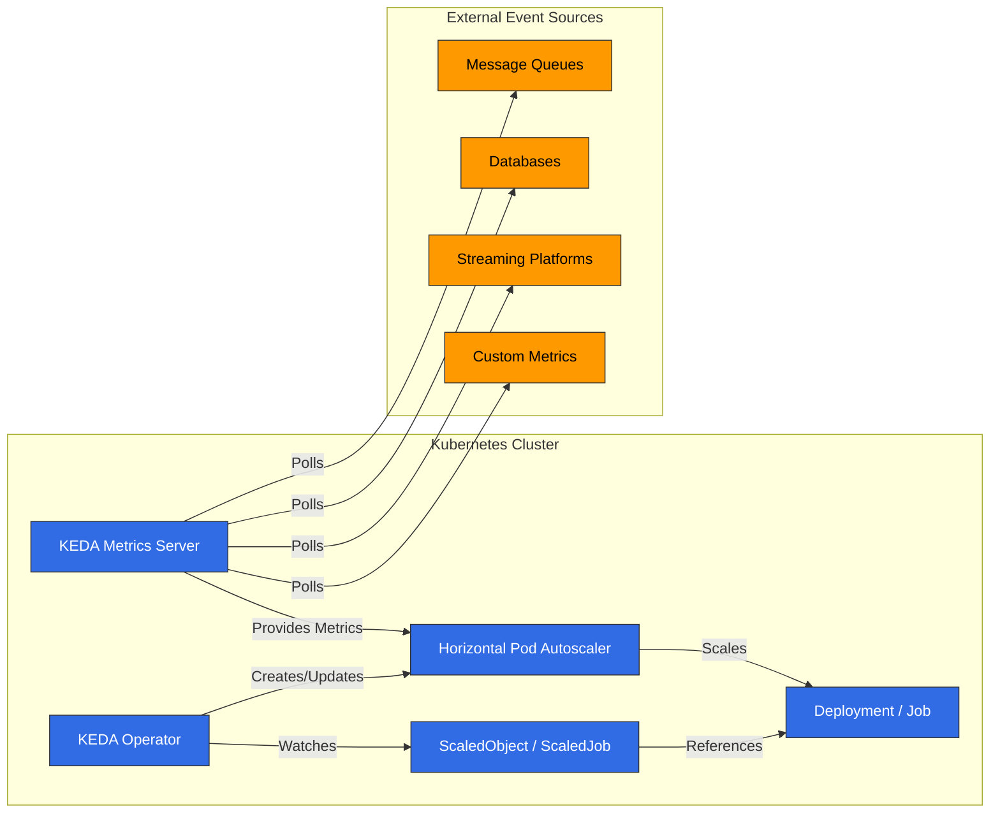

# KEDA (Kubernetes Event-driven Autoscaling)

## Table of Contents
- [Introduction](#introduction)
- [Architecture](#architecture)
- [Installation and Configuration](#installation-and-configuration)
- [Scalers](#scalers)
- [Custom Metric Scaling](#custom-metric-scaling)
- [Twitter Metric Scaling](#twitter-metric-scaling)
- [Google Calendar Scaling](#google-calendar-scaling)
- [Istio Metric Scaling](#istio-metric-scaling)
- [Cron-based Scaling](#cron-based-scaling)
- [Integration with Amazon EKS](#integration-with-amazon-eks)
- [Best Practices](#best-practices)
- [Troubleshooting](#troubleshooting)
- [Conclusion](#conclusion)

## Introduction

KEDA (Kubernetes Event-driven Autoscaling) is an open-source project that enables event-driven autoscaling for Kubernetes applications. KEDA extends Kubernetes' native Horizontal Pod Autoscaler (HPA) to allow workload scaling based on various event sources and metrics beyond CPU and memory usage.

### Key Benefits of KEDA

1. **Event-driven Scaling**: Scaling based on various event sources (message queues, databases, streams, etc.)
2. **Zero Scaling**: Scale down to 0 replicas when there's no activity to save costs
3. **Diverse Scaler Support**: Over 50 built-in scalers and custom scaler support
4. **Kubernetes Native**: Integration with existing Kubernetes HPA
5. **Cloud Neutral**: Works in any Kubernetes environment
6. **Simple Deployment Model**: Easy deployment with a single operator

### Comparison with Existing Scaling Methods

| Feature | KEDA | Kubernetes HPA | Cloud Provider Autoscaler |
|---------|------|----------------|---------------------------|
| Metric Sources | 50+ scalers | CPU, Memory, Custom metrics | Limited metrics |
| Zero Scaling | ✅ | ❌ | Partial support |
| Event-driven | ✅ | ❌ | Partial support |
| Cloud Neutral | ✅ | ✅ | ❌ |
| Deployment Complexity | Low | Very Low | Medium |
| Custom Metrics | Easy | Complex | Limited |

## Architecture

KEDA is based on the Kubernetes operator pattern, monitoring external metric sources and automatically managing Kubernetes HPA.




### Key Components

1. **KEDA Operator**: Watches ScaledObject and ScaledJob resources and manages HPA
2. **KEDA Metrics Server**: Collects metrics from external metric sources and exposes them to the Kubernetes API
3. **ScaledObject**: Defines scaling configuration for Deployments, StatefulSets, etc.
4. **ScaledJob**: Defines scaling configuration for Kubernetes Jobs
5. **Triggers/Scalers**: Implements scaling logic for various event sources

### How It Works

1. User creates a ScaledObject or ScaledJob to define scaling targets and triggers
2. KEDA Operator detects this and creates the corresponding HPA
3. KEDA Metrics Server polls external metric sources to collect metrics
4. HPA scales workloads based on metrics provided by the metrics server
5. When there's no activity, KEDA scales down to 0 replicas (which HPA cannot do)

## Installation and Configuration

### Prerequisites

- Kubernetes cluster (v1.16 or higher)
- kubectl configured
- Helm (optional)

### Installation Methods

#### 1. Installation Using Helm

```bash
# Add Helm repository
helm repo add kedacore https://kedacore.github.io/charts

# Update Helm repository
helm repo update

# Install KEDA
helm install keda kedacore/keda --namespace keda --create-namespace
```

#### 2. Installation Using YAML Manifests

```bash
# Download latest KEDA release
kubectl apply -f https://github.com/kedacore/keda/releases/download/v2.10.1/keda-2.10.1.yaml
```

#### 3. Verify Installation

```bash
kubectl get pods -n keda
```

Expected output:
```
NAME                                      READY   STATUS    RESTARTS   AGE
keda-operator-5c6d85d76c-vr4fj            1/1     Running   0          1m
keda-operator-metrics-apiserver-65f8f8d4d8-9mzrk   1/1     Running   0          1m
```

### Basic Configuration

KEDA works with minimal configuration by default, but you can adjust various settings as needed.

#### Custom Configuration Using Helm Values File

```yaml
# values.yaml
operator:
  replicaCount: 2
  resources:
    limits:
      cpu: 100m
      memory: 128Mi
    requests:
      cpu: 50m
      memory: 64Mi

metricsServer:
  replicaCount: 2
  resources:
    limits:
      cpu: 100m
      memory: 128Mi
    requests:
      cpu: 50m
      memory: 64Mi

logging:
  operator:
    level: info
  metricServer:
    level: info
```

```bash
helm install keda kedacore/keda --namespace keda --create-namespace -f values.yaml
```

## Scalers

KEDA provides scalers for various event sources. Each scaler collects metrics from a specific event source and scales workloads based on them.

### Major Scalers

KEDA supports over 50 scalers, with major ones including:

1. **Message Queues**:
   - Apache Kafka
   - RabbitMQ
   - AWS SQS
   - Azure Service Bus
   - Google Cloud Pub/Sub

2. **Databases**:
   - MySQL
   - PostgreSQL
   - MongoDB
   - Redis

3. **Streaming Platforms**:
   - Apache Kafka
   - AWS Kinesis
   - Azure Event Hubs

4. **Cloud Services**:
   - AWS CloudWatch
   - Azure Monitor
   - Google Cloud Monitoring

5. **Others**:
   - Prometheus
   - InfluxDB
   - Cron
   - CPU/Memory

### Basic ScaledObject Example

```yaml
apiVersion: keda.sh/v1alpha1
kind: ScaledObject
metadata:
  name: rabbitmq-scaledobject
  namespace: default
spec:
  scaleTargetRef:
    apiVersion: apps/v1
    kind: Deployment
    name: rabbitmq-consumer
  pollingInterval: 15
  cooldownPeriod: 30
  minReplicaCount: 0
  maxReplicaCount: 30
  triggers:
  - type: rabbitmq
    metadata:
      protocol: amqp
      queueName: hello
      host: rabbitmq
      queueLength: "5"
```

### Basic ScaledJob Example

```yaml
apiVersion: keda.sh/v1alpha1
kind: ScaledJob
metadata:
  name: rabbitmq-scaledjob
  namespace: default
spec:
  jobTargetRef:
    template:
      spec:
        containers:
        - name: rabbitmq-worker
          image: rabbitmq-worker:latest
          imagePullPolicy: Always
  pollingInterval: 15
  maxReplicaCount: 30
  successfulJobsHistoryLimit: 5
  failedJobsHistoryLimit: 5
  triggers:
  - type: rabbitmq
    metadata:
      protocol: amqp
      queueName: hello
      host: rabbitmq
      queueLength: "5"
```
## Custom Metric Scaling

KEDA provides flexibility to scale based on custom metrics in addition to various built-in scalers. This allows you to implement unique scaling logic tailored to your business requirements.

### Using External Metrics API

You can implement custom metric-based scaling using external metric sources like Prometheus:

```yaml
apiVersion: keda.sh/v1alpha1
kind: ScaledObject
metadata:
  name: custom-metrics-scaler
  namespace: default
spec:
  scaleTargetRef:
    apiVersion: apps/v1
    kind: Deployment
    name: my-app
  minReplicaCount: 1
  maxReplicaCount: 10
  triggers:
  - type: prometheus
    metadata:
      serverAddress: http://prometheus-server.monitoring.svc.cluster.local
      metricName: custom_metric_total
      threshold: "100"
      query: sum(custom_metric_total{namespace="default",pod=~"my-app-.*"})
```

### Using HTTP Scaler

You can fetch metrics from an HTTP endpoint for scaling:

```yaml
apiVersion: keda.sh/v1alpha1
kind: ScaledObject
metadata:
  name: http-scaler
  namespace: default
spec:
  scaleTargetRef:
    apiVersion: apps/v1
    kind: Deployment
    name: my-app
  minReplicaCount: 1
  maxReplicaCount: 10
  triggers:
  - type: metrics-api
    metadata:
      targetValue: "100"
      url: "http://api.example.com/metrics"
      valueLocation: "value"
      method: "GET"
```

### Developing Custom Scalers

You can develop your own scaler and integrate it with KEDA. This requires developing a service that implements the External Metrics API:

1. Metrics Server Implementation:

```go
package main

import (
    "net/http"
    "encoding/json"

    "k8s.io/apimachinery/pkg/api/resource"
    metav1 "k8s.io/apimachinery/pkg/apis/meta/v1"
    "k8s.io/metrics/pkg/apis/external_metrics"
)

func metricsHandler(w http.ResponseWriter, r *http.Request) {
    // Calculate metric value with custom logic
    metricValue := calculateMetricValue()

    metric := external_metrics.ExternalMetricValue{
        TypeMeta: metav1.TypeMeta{
            Kind:       "ExternalMetricValue",
            APIVersion: "external.metrics.k8s.io/v1beta1",
        },
        MetricName: "custom_metric",
        Value:      *resource.NewQuantity(metricValue, resource.DecimalSI),
        Timestamp:  metav1.Now(),
    }

    metricList := external_metrics.ExternalMetricValueList{
        Items: []external_metrics.ExternalMetricValue{metric},
    }

    json.NewEncoder(w).Encode(metricList)
}

func main() {
    http.HandleFunc("/metrics", metricsHandler)
    http.ListenAndServe(":8080", nil)
}
```

2. Integration with KEDA:

```yaml
apiVersion: keda.sh/v1alpha1
kind: ScaledObject
metadata:
  name: custom-scaler
  namespace: default
spec:
  scaleTargetRef:
    apiVersion: apps/v1
    kind: Deployment
    name: my-app
  minReplicaCount: 1
  maxReplicaCount: 10
  triggers:
  - type: metrics-api
    metadata:
      targetValue: "100"
      url: "http://custom-metrics-server:8080/metrics"
      valueLocation: "items.0.value"
```

## Twitter Metric Scaling

This example shows how to scale applications based on the frequency of mentions for specific hashtags or keywords using the Twitter API.

### Prerequisites

- Twitter API keys and access tokens
- A service to collect and expose metrics

### Implementation Steps

1. Implement Twitter Metrics Collector Service:

```python
import os
import time
import tweepy
from flask import Flask, jsonify

app = Flask(__name__)

# Twitter API credentials
consumer_key = os.environ.get("TWITTER_CONSUMER_KEY")
consumer_secret = os.environ.get("TWITTER_CONSUMER_SECRET")
access_token = os.environ.get("TWITTER_ACCESS_TOKEN")
access_token_secret = os.environ.get("TWITTER_ACCESS_TOKEN_SECRET")

# Tweepy authentication
auth = tweepy.OAuthHandler(consumer_key, consumer_secret)
auth.set_access_token(access_token, access_token_secret)
api = tweepy.API(auth)

# Metrics storage
metrics = {
    "tweet_count": 0,
    "last_updated": 0
}

# Background tweet collection
def collect_tweets():
    while True:
        try:
            # Search for specific hashtag
            tweets = api.search_tweets(q="#kubernetes", count=100)
            metrics["tweet_count"] = len(tweets)
            metrics["last_updated"] = time.time()
        except Exception as e:
            print(f"Error collecting tweets: {e}")

        # Update every 15 minutes (considering Twitter API limits)
        time.sleep(900)

# Metrics endpoint
@app.route("/metrics", methods=["GET"])
def get_metrics():
    return jsonify({
        "tweet_count": metrics["tweet_count"]
    })

if __name__ == "__main__":
    import threading
    # Start background tweet collection
    thread = threading.Thread(target=collect_tweets)
    thread.daemon = True
    thread.start()

    # Start API server
    app.run(host="0.0.0.0", port=8080)
```

2. Deploy Metrics Collector Service:

```yaml
apiVersion: apps/v1
kind: Deployment
metadata:
  name: twitter-metrics-collector
  namespace: default
spec:
  replicas: 1
  selector:
    matchLabels:
      app: twitter-metrics-collector
  template:
    metadata:
      labels:
        app: twitter-metrics-collector
    spec:
      containers:
      - name: collector
        image: twitter-metrics-collector:latest
        ports:
        - containerPort: 8080
        env:
        - name: TWITTER_CONSUMER_KEY
          valueFrom:
            secretKeyRef:
              name: twitter-api-secrets
              key: consumer-key
        - name: TWITTER_CONSUMER_SECRET
          valueFrom:
            secretKeyRef:
              name: twitter-api-secrets
              key: consumer-secret
        - name: TWITTER_ACCESS_TOKEN
          valueFrom:
            secretKeyRef:
              name: twitter-api-secrets
              key: access-token
        - name: TWITTER_ACCESS_TOKEN_SECRET
          valueFrom:
            secretKeyRef:
              name: twitter-api-secrets
              key: access-token-secret
---
apiVersion: v1
kind: Service
metadata:
  name: twitter-metrics-collector
  namespace: default
spec:
  selector:
    app: twitter-metrics-collector
  ports:
  - port: 80
    targetPort: 8080
```

3. Configure KEDA ScaledObject:

```yaml
apiVersion: keda.sh/v1alpha1
kind: ScaledObject
metadata:
  name: twitter-scaler
  namespace: default
spec:
  scaleTargetRef:
    apiVersion: apps/v1
    kind: Deployment
    name: twitter-processor
  minReplicaCount: 1
  maxReplicaCount: 20
  pollingInterval: 15
  cooldownPeriod: 30
  triggers:
  - type: metrics-api
    metadata:
      targetValue: "10"
      url: "http://twitter-metrics-collector/metrics"
      valueLocation: "tweet_count"
```

## Google Calendar Scaling

This example shows how to scale applications based on scheduled events using the Google Calendar API.

### Prerequisites

- Google Calendar API credentials
- A service to collect and expose metrics

### Implementation Steps

1. Implement Google Calendar Metrics Collector Service:

```python
import os
import time
import datetime
from flask import Flask, jsonify
from google.oauth2 import service_account
from googleapiclient.discovery import build

app = Flask(__name__)

# Google Calendar API credentials
SCOPES = ['https://www.googleapis.com/auth/calendar.readonly']
SERVICE_ACCOUNT_FILE = '/etc/secrets/service-account.json'
CALENDAR_ID = os.environ.get("CALENDAR_ID")

# Metrics storage
metrics = {
    "upcoming_events": 0,
    "last_updated": 0
}

# Create Google Calendar API client
def create_calendar_client():
    credentials = service_account.Credentials.from_service_account_file(
        SERVICE_ACCOUNT_FILE, scopes=SCOPES)
    return build('calendar', 'v3', credentials=credentials)

# Background event collection
def collect_events():
    while True:
        try:
            service = create_calendar_client()

            # Current time
            now = datetime.datetime.utcnow()
            # 1 hour later
            one_hour_later = now + datetime.timedelta(hours=1)

            # Query events within the next hour
            events_result = service.events().list(
                calendarId=CALENDAR_ID,
                timeMin=now.isoformat() + 'Z',
                timeMax=one_hour_later.isoformat() + 'Z',
                singleEvents=True,
                orderBy='startTime'
            ).execute()

            events = events_result.get('items', [])
            metrics["upcoming_events"] = len(events)
            metrics["last_updated"] = time.time()
        except Exception as e:
            print(f"Error collecting events: {e}")

        # Update every 5 minutes
        time.sleep(300)

# Metrics endpoint
@app.route("/metrics", methods=["GET"])
def get_metrics():
    return jsonify({
        "upcoming_events": metrics["upcoming_events"]
    })

if __name__ == "__main__":
    import threading
    # Start background event collection
    thread = threading.Thread(target=collect_events)
    thread.daemon = True
    thread.start()

    # Start API server
    app.run(host="0.0.0.0", port=8080)
```

2. Deploy Metrics Collector Service:

```yaml
apiVersion: v1
kind: Secret
metadata:
  name: google-calendar-secrets
  namespace: default
type: Opaque
data:
  service-account.json: <BASE64_ENCODED_SERVICE_ACCOUNT_JSON>
---
apiVersion: apps/v1
kind: Deployment
metadata:
  name: calendar-metrics-collector
  namespace: default
spec:
  replicas: 1
  selector:
    matchLabels:
      app: calendar-metrics-collector
  template:
    metadata:
      labels:
        app: calendar-metrics-collector
    spec:
      containers:
      - name: collector
        image: calendar-metrics-collector:latest
        ports:
        - containerPort: 8080
        env:
        - name: CALENDAR_ID
          value: "primary"
        volumeMounts:
        - name: google-calendar-credentials
          mountPath: "/etc/secrets"
          readOnly: true
      volumes:
      - name: google-calendar-credentials
        secret:
          secretName: google-calendar-secrets
---
apiVersion: v1
kind: Service
metadata:
  name: calendar-metrics-collector
  namespace: default
spec:
  selector:
    app: calendar-metrics-collector
  ports:
  - port: 80
    targetPort: 8080
```

3. Configure KEDA ScaledObject:

```yaml
apiVersion: keda.sh/v1alpha1
kind: ScaledObject
metadata:
  name: calendar-scaler
  namespace: default
spec:
  scaleTargetRef:
    apiVersion: apps/v1
    kind: Deployment
    name: calendar-processor
  minReplicaCount: 1
  maxReplicaCount: 10
  pollingInterval: 15
  cooldownPeriod: 30
  triggers:
  - type: metrics-api
    metadata:
      targetValue: "1"
      url: "http://calendar-metrics-collector/metrics"
      valueLocation: "upcoming_events"
```
## Istio Metric Scaling

This example shows how to scale applications based on metrics collected from the Istio service mesh. We'll look at how to scale based on requests per second (RPS).

### Prerequisites

- Istio service mesh installed
- Prometheus installed and integrated with Istio

### Implementation Steps

1. Set up Istio Service Mesh:

```bash
# Install Istio
istioctl install --set profile=default -y

# Enable Istio sidecar injection on namespace
kubectl label namespace default istio-injection=enabled
```

2. Deploy Sample Application:

```yaml
apiVersion: apps/v1
kind: Deployment
metadata:
  name: sample-app
  namespace: default
spec:
  replicas: 1
  selector:
    matchLabels:
      app: sample-app
  template:
    metadata:
      labels:
        app: sample-app
    spec:
      containers:
      - name: sample-app
        image: nginx:latest
        ports:
        - containerPort: 80
---
apiVersion: v1
kind: Service
metadata:
  name: sample-app
  namespace: default
spec:
  selector:
    app: sample-app
  ports:
  - port: 80
    targetPort: 80
---
apiVersion: networking.istio.io/v1alpha3
kind: VirtualService
metadata:
  name: sample-app
  namespace: default
spec:
  hosts:
  - "*"
  gateways:
  - istio-system/ingressgateway
  http:
  - route:
    - destination:
        host: sample-app
        port:
          number: 80
```

3. Configure KEDA ScaledObject:

```yaml
apiVersion: keda.sh/v1alpha1
kind: ScaledObject
metadata:
  name: istio-scaler
  namespace: default
spec:
  scaleTargetRef:
    apiVersion: apps/v1
    kind: Deployment
    name: sample-app
  minReplicaCount: 1
  maxReplicaCount: 10
  pollingInterval: 15
  cooldownPeriod: 30
  triggers:
  - type: prometheus
    metadata:
      serverAddress: http://prometheus.istio-system:9090
      metricName: istio_requests_per_second
      threshold: "10"
      query: sum(rate(istio_requests_total{destination_service="sample-app.default.svc.cluster.local"}[1m]))
```

This configuration scales the `sample-app` deployment based on requests per second collected from Istio. When requests per second exceed 10, KEDA adds replicas, and when the request count decreases, it reduces replicas.

### Advanced Configuration

In more complex scenarios, you can scale based on request counts for specific paths or HTTP methods:

```yaml
apiVersion: keda.sh/v1alpha1
kind: ScaledObject
metadata:
  name: istio-path-scaler
  namespace: default
spec:
  scaleTargetRef:
    apiVersion: apps/v1
    kind: Deployment
    name: sample-app
  minReplicaCount: 1
  maxReplicaCount: 10
  pollingInterval: 15
  cooldownPeriod: 30
  triggers:
  - type: prometheus
    metadata:
      serverAddress: http://prometheus.istio-system:9090
      metricName: istio_requests_per_second_path
      threshold: "5"
      query: sum(rate(istio_requests_total{destination_service="sample-app.default.svc.cluster.local",request_path="/api/v1/products"}[1m]))
```

You can also scale based on other Istio metrics like error rate or latency:

```yaml
# Error rate based scaling
apiVersion: keda.sh/v1alpha1
kind: ScaledObject
metadata:
  name: istio-error-scaler
  namespace: default
spec:
  scaleTargetRef:
    apiVersion: apps/v1
    kind: Deployment
    name: sample-app
  minReplicaCount: 1
  maxReplicaCount: 10
  pollingInterval: 15
  cooldownPeriod: 30
  triggers:
  - type: prometheus
    metadata:
      serverAddress: http://prometheus.istio-system:9090
      metricName: istio_error_rate
      threshold: "0.05"
      query: sum(rate(istio_requests_total{destination_service="sample-app.default.svc.cluster.local",response_code=~"5.*"}[1m])) / sum(rate(istio_requests_total{destination_service="sample-app.default.svc.cluster.local"}[1m]))
```

## Cron-based Scaling

KEDA supports time-based scaling using Cron expressions. This allows you to pre-scale applications according to predictable traffic patterns or schedules.

### Basic Cron Scaler

```yaml
apiVersion: keda.sh/v1alpha1
kind: ScaledObject
metadata:
  name: cron-scaler
  namespace: default
spec:
  scaleTargetRef:
    apiVersion: apps/v1
    kind: Deployment
    name: sample-app
  minReplicaCount: 0
  maxReplicaCount: 10
  pollingInterval: 15
  cooldownPeriod: 30
  triggers:
  - type: cron
    metadata:
      timezone: Asia/Seoul
      start: 30 * * * *
      end: 45 * * * *
      desiredReplicas: "5"
```

This configuration scales the `sample-app` deployment up to 5 replicas at 30 minutes past every hour and scales down at 45 minutes.

### Multi-timezone Scaling

You can configure different scaling behaviors at various times using multiple Cron triggers:

```yaml
apiVersion: keda.sh/v1alpha1
kind: ScaledObject
metadata:
  name: multi-cron-scaler
  namespace: default
spec:
  scaleTargetRef:
    apiVersion: apps/v1
    kind: Deployment
    name: sample-app
  minReplicaCount: 1
  maxReplicaCount: 10
  pollingInterval: 15
  cooldownPeriod: 30
  triggers:
  # High replica count during business hours
  - type: cron
    metadata:
      timezone: Asia/Seoul
      start: 0 9 * * 1-5
      end: 0 18 * * 1-5
      desiredReplicas: "5"
  # Low replica count during nights and weekends
  - type: cron
    metadata:
      timezone: Asia/Seoul
      start: 0 18 * * 1-5
      end: 0 9 * * 1-5
      desiredReplicas: "2"
  # Low replica count on weekends
  - type: cron
    metadata:
      timezone: Asia/Seoul
      start: 0 0 * * 0,6
      end: 0 0 * * 1
      desiredReplicas: "2"
```

### Combining Cron with Other Scalers

You can combine Cron scalers with other scalers to set baseline scaling behavior and additionally scale based on actual load:

```yaml
apiVersion: keda.sh/v1alpha1
kind: ScaledObject
metadata:
  name: combined-scaler
  namespace: default
spec:
  scaleTargetRef:
    apiVersion: apps/v1
    kind: Deployment
    name: sample-app
  minReplicaCount: 1
  maxReplicaCount: 20
  pollingInterval: 15
  cooldownPeriod: 30
  triggers:
  # Set baseline replica count during business hours
  - type: cron
    metadata:
      timezone: Asia/Seoul
      start: 0 9 * * 1-5
      end: 0 18 * * 1-5
      desiredReplicas: "5"
  # Additional scaling based on actual load
  - type: prometheus
    metadata:
      serverAddress: http://prometheus.monitoring.svc.cluster.local:9090
      metricName: http_requests_per_second
      threshold: "10"
      query: sum(rate(http_requests_total{app="sample-app"}[1m]))
```

## Integration with Amazon EKS

KEDA integrates seamlessly with Amazon EKS to provide AWS service-based scaling.

### Installing KEDA on EKS

```bash
# Installation using Helm
helm repo add kedacore https://kedacore.github.io/charts
helm repo update
helm install keda kedacore/keda --namespace keda --create-namespace
```

### AWS Service-based Scaling

#### SQS Queue-based Scaling

```yaml
apiVersion: keda.sh/v1alpha1
kind: TriggerAuthentication
metadata:
  name: aws-credentials
  namespace: default
spec:
  podIdentity:
    provider: aws-eks
---
apiVersion: keda.sh/v1alpha1
kind: ScaledObject
metadata:
  name: aws-sqs-scaler
  namespace: default
spec:
  scaleTargetRef:
    apiVersion: apps/v1
    kind: Deployment
    name: sqs-consumer
  minReplicaCount: 0
  maxReplicaCount: 10
  pollingInterval: 15
  cooldownPeriod: 30
  triggers:
  - type: aws-sqs-queue
    metadata:
      queueURL: https://sqs.us-west-2.amazonaws.com/123456789012/my-queue
      queueLength: "5"
      awsRegion: "us-west-2"
    authenticationRef:
      name: aws-credentials
```

#### CloudWatch Metric-based Scaling

```yaml
apiVersion: keda.sh/v1alpha1
kind: TriggerAuthentication
metadata:
  name: aws-credentials
  namespace: default
spec:
  podIdentity:
    provider: aws-eks
---
apiVersion: keda.sh/v1alpha1
kind: ScaledObject
metadata:
  name: aws-cloudwatch-scaler
  namespace: default
spec:
  scaleTargetRef:
    apiVersion: apps/v1
    kind: Deployment
    name: cloudwatch-app
  minReplicaCount: 1
  maxReplicaCount: 10
  pollingInterval: 15
  cooldownPeriod: 30
  triggers:
  - type: aws-cloudwatch
    metadata:
      namespace: "AWS/SQS"
      dimensionName: "QueueName"
      dimensionValue: "my-queue"
      metricName: "ApproximateNumberOfMessages"
      targetValue: "5"
      minMetricValue: "0"
      awsRegion: "us-west-2"
    authenticationRef:
      name: aws-credentials
```

### IRSA (IAM Roles for Service Accounts) Integration

You can leverage IRSA to manage permissions for AWS services when using KEDA on EKS:

```bash
# IRSA setup
eksctl create iamserviceaccount \
  --name keda-operator \
  --namespace keda \
  --cluster my-cluster \
  --attach-policy-arn arn:aws:iam::aws:policy/AmazonSQSReadOnlyAccess \
  --attach-policy-arn arn:aws:iam::aws:policy/CloudWatchReadOnlyAccess \
  --approve
```

```yaml
# Helm values file
serviceAccount:
  annotations:
    eks.amazonaws.com/role-arn: arn:aws:iam::123456789012:role/keda-operator-role
```

## Best Practices

### Performance Optimization

1. **Set Appropriate Polling Intervals**: Set polling intervals that match your workload characteristics
2. **Optimize Cooldown Periods**: Prevent unnecessary scaling oscillation
3. **Set Resource Requests and Limits**: Allocate appropriate resources to KEDA components
4. **Write Efficient Queries**: Optimize metric queries

```yaml
apiVersion: keda.sh/v1alpha1
kind: ScaledObject
metadata:
  name: optimized-scaler
spec:
  pollingInterval: 30  # Poll every 30 seconds (default: 30)
  cooldownPeriod: 300  # 5-minute cooldown period (default: 300)
  # Other configuration...
```

### Improving Reliability

1. **Use Multiple Triggers**: Scale based on multiple metric sources
2. **Set Appropriate Min and Max Replicas**: Set ranges that match workload requirements
3. **Failure Handling Strategy**: Prepare response plans for metric source failures
4. **Set Up Monitoring and Alerts**: Monitor KEDA operational status

```yaml
apiVersion: keda.sh/v1alpha1
kind: ScaledObject
metadata:
  name: reliable-scaler
spec:
  minReplicaCount: 2  # Maintain minimum 2 replicas
  maxReplicaCount: 20  # Limit to maximum 20 replicas
  fallback:
    failureThreshold: 3  # Apply fallback behavior after 3 failures
    replicas: 5  # Set to 5 replicas on metric source failure
  # Other configuration...
```

### Security Hardening

1. **Apply Least Privilege Principle**: Grant only necessary permissions
2. **Secret Management**: Securely manage sensitive information
3. **Apply Network Policies**: Restrict access to KEDA components
4. **Configure RBAC**: Set up appropriate role-based access control

```yaml
apiVersion: keda.sh/v1alpha1
kind: TriggerAuthentication
metadata:
  name: secure-auth
spec:
  secretTargetRef:
  - parameter: connectionString
    name: db-secret
    key: connection-string
---
apiVersion: networking.k8s.io/v1
kind: NetworkPolicy
metadata:
  name: keda-network-policy
  namespace: keda
spec:
  podSelector:
    matchLabels:
      app.kubernetes.io/name: keda-operator
  ingress:
  - from:
    - namespaceSelector:
        matchLabels:
          kubernetes.io/metadata.name: kube-system
  egress:
  - {}
```

## Troubleshooting

### Common Issues

#### 1. Scaling Not Working

**Symptom**: Pods don't scale even when metrics exceed threshold

**Solution**:
- Check KEDA logs
- Verify metric source connectivity
- Verify authentication configuration

```bash
# Check KEDA operator logs
kubectl logs -n keda -l app=keda-operator

# Check KEDA metrics server logs
kubectl logs -n keda -l app=keda-metrics-apiserver

# Check ScaledObject status
kubectl get scaledobject -n <namespace> <name> -o yaml
```

#### 2. Zero Scaling Issues

**Symptom**: Won't scale down to 0 when there's no activity

**Solution**:
- Check minReplicaCount setting
- Verify metric values
- Check HPA status

```bash
# Check HPA status
kubectl get hpa -n <namespace>

# Check metric values directly
kubectl get --raw "/apis/external.metrics.k8s.io/v1beta1/namespaces/<namespace>/<metric-name>" | jq
```

#### 3. Authentication Issues

**Symptom**: Cannot connect to metric source

**Solution**:
- Verify TriggerAuthentication configuration
- Check secrets or environment variables
- Verify permissions

```bash
# Check TriggerAuthentication
kubectl get triggerauthentication -n <namespace> <name> -o yaml

# Check secrets
kubectl get secret -n <namespace> <name> -o yaml
```

### Debugging Tools

```bash
# Check KEDA version
kubectl get deployment -n keda keda-operator -o jsonpath="{.spec.template.spec.containers[0].image}"

# Check ScaledObject status
kubectl describe scaledobject -n <namespace> <name>

# Check HPA status
kubectl describe hpa -n <namespace> <name>

# Check metric values
kubectl get --raw "/apis/external.metrics.k8s.io/v1beta1/namespaces/<namespace>/<metric-name>"

# Check KEDA logs
kubectl logs -n keda -l app=keda-operator --tail=100
```

## Conclusion

KEDA (Kubernetes Event-driven Autoscaling) is a powerful tool that provides event-driven autoscaling in Kubernetes environments. It extends the basic Kubernetes HPA to enable workload scaling based on various event sources and metrics.

This document covered KEDA's basic concepts, installation methods, various scaler usage, custom metric scaling, integration with external services like Twitter and Google Calendar, Istio metric-based scaling, Cron-based scaling, integration with Amazon EKS, best practices, and troubleshooting.

Using KEDA, you can scale applications more efficiently, optimize resource usage, and reduce costs. It's particularly useful for implementing event-driven architectures and serverless patterns.

### Next Steps

- Implement serverless architectures using KEDA
- Explore integration with various event sources
- Develop custom scalers
- Leverage KEDA in multi-cluster environments
- Integrate KEDA with other cloud-native tools

## References

- [KEDA Official Documentation](https://keda.sh/docs/)
- [KEDA GitHub Repository](https://github.com/kedacore/keda)
- [KEDA Scaler List](https://keda.sh/docs/latest/scalers/)
- [KEDA Operator Hub](https://operatorhub.io/operator/keda)
- [AWS EKS Workshop - KEDA](https://www.eksworkshop.com/advanced/autoscaling/keda/)

## Quiz

To test what you've learned in this chapter, try the [topic quiz](../quizzes/tools/05-keda-quiz.md).
