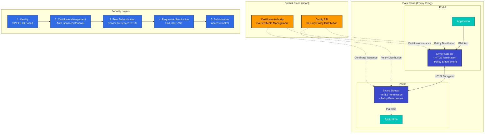

# Security

> **Supported Versions**: Istio 1.28
> **Last Updated**: November 27, 2025

Istio provides robust security features within the service mesh. Based on the Zero Trust security model, it automatically encrypts service-to-service communication and provides fine-grained access control.

## Table of Contents

1. [Security Architecture Overview](#security-architecture-overview)
2. [Core Security Features](#core-security-features)
3. [Security Components](#security-components)
4. [Detailed Documentation](#detailed-documentation)
5. [Security Best Practices](#security-best-practices)
6. [Security Monitoring](#security-monitoring)

## Security Architecture Overview

<p align="center">
  
</p>

Istio implements a **Zero Trust security model** to protect all communication within the service mesh. The security architecture consists of 4 core layers:

### Security Architecture Layers



**Core Architecture Components**:

1. **Control Plane (istiod)**
   - Certificate Authority (CA): X.509 certificate issuance and management
   - Configuration API: Security policy distribution and management
   - Service Discovery: Workload identity management

2. **Data Plane (Envoy Proxy)**
   - mTLS Termination Points: Encrypted communication between services
   - Policy Enforcement: Authentication/authorization policy application
   - Security Telemetry: Security metrics collection

3. **Identity Management**
   - Strong identity management based on SPIFFE standard
   - Integration with Kubernetes ServiceAccount
   - Automatic certificate renewal (default 24 hours)

4. **Policy Engine**
   - Declarative security policies (CRD-based)
   - Fine-grained access control (RBAC)
   - Audit logging support

## Core Security Features

Istio provides the following core security features:

### 1. Communication Security (mTLS)

<p align="center">
  
</p>

All service-to-service communication is automatically encrypted. Istio supports gradual migration through **PERMISSIVE** mode.

```yaml
apiVersion: security.istio.io/v1
kind: PeerAuthentication
metadata:
  name: default
  namespace: istio-system
spec:
  mtls:
    mode: STRICT  # Production: STRICT, Migration: PERMISSIVE
```

**Mode Descriptions**:
- **STRICT**: Only mTLS allowed (recommended for production)
- **PERMISSIVE**: Both mTLS and plaintext allowed (for migration)
- **DISABLE**: mTLS disabled

### 2. Authentication

<p align="center">
  
</p>

Istio provides two layers of authentication:

- **Peer Authentication**: Service-to-service authentication (mTLS + SPIFFE ID)
- **Request Authentication**: End-user authentication (JWT + OAuth/OIDC)

**Example**:
```yaml
# Request Authentication (JWT)
apiVersion: security.istio.io/v1
kind: RequestAuthentication
metadata:
  name: jwt-auth
spec:
  jwtRules:
  - issuer: "https://accounts.google.com"
    jwksUri: "https://www.googleapis.com/oauth2/v3/certs"
```

### 3. Authorization

<p align="center">
  
</p>

Fine-grained access control policies are applied. AuthorizationPolicy controls based on:
- Service Account / Namespace
- HTTP Method / Path
- IP Address
- JWT Claims

```yaml
apiVersion: security.istio.io/v1
kind: AuthorizationPolicy
metadata:
  name: allow-read
spec:
  action: ALLOW
  rules:
  - from:
    - source:
        principals: ["cluster.local/ns/default/sa/myapp"]
    to:
    - operation:
        methods: ["GET"]
        paths: ["/api/*"]
```

## Security Best Practices

### 1. Defense in Depth

<p align="center">
  
</p>

Implement defense in depth by applying security at multiple layers:

**Network Layer**:
```yaml
# 1. Enable mTLS STRICT mode
apiVersion: security.istio.io/v1
kind: PeerAuthentication
metadata:
  name: default
  namespace: istio-system
spec:
  mtls:
    mode: STRICT
```

**Application Layer**:
```yaml
# 2. Enable JWT authentication
apiVersion: security.istio.io/v1
kind: RequestAuthentication
metadata:
  name: require-jwt
spec:
  jwtRules:
  - issuer: "https://your-auth-provider.com"
    jwksUri: "https://your-auth-provider.com/.well-known/jwks.json"
```

**Access Control Layer**:
```yaml
# 3. Default deny policy
apiVersion: security.istio.io/v1
kind: AuthorizationPolicy
metadata:
  name: deny-all
spec:
  action: DENY
  rules:
  - {}
---
# 4. Allow only required access
apiVersion: security.istio.io/v1
kind: AuthorizationPolicy
metadata:
  name: allow-specific
spec:
  action: ALLOW
  rules:
  - from:
    - source:
        principals: ["cluster.local/ns/frontend/sa/webapp"]
    to:
    - operation:
        methods: ["GET", "POST"]
```

### 2. Principle of Least Privilege

- Grant only minimum required permissions to each service
- Separate ServiceAccounts granularly
- Utilize namespace isolation

### 3. Security Monitoring

- Enable Istio Access Logs
- Collect security metrics with Prometheus
- Monitor mTLS status with Kiali

## Next Steps

1. **[mTLS](01-mtls.md)**: Service-to-service encryption and identity management
2. **[Authentication](02-authentication.md)**: JWT and OAuth/OIDC integration
3. **[Authorization](03-authorization.md)**: Fine-grained access control policies

## References

### Official Documentation
- [Istio Security Concepts](https://istio.io/latest/docs/concepts/security/)
- [Security Best Practices](https://istio.io/latest/docs/ops/best-practices/security/)
- [Security Reference](https://istio.io/latest/docs/reference/config/security/)

### Related Standards
- [SPIFFE Specification](https://github.com/spiffe/spiffe)
- [OAuth 2.0 / OIDC](https://oauth.net/2/)
- [JWT (RFC 7519)](https://datatracker.ietf.org/doc/html/rfc7519)

## Quiz

To test your knowledge from this chapter, try the [Istio Security Quiz](../../../quizzes/tools/istio/security.md).
