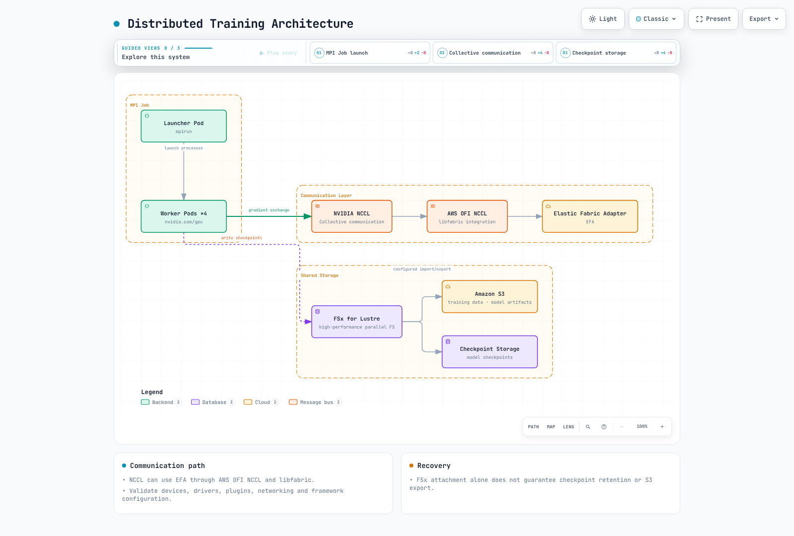
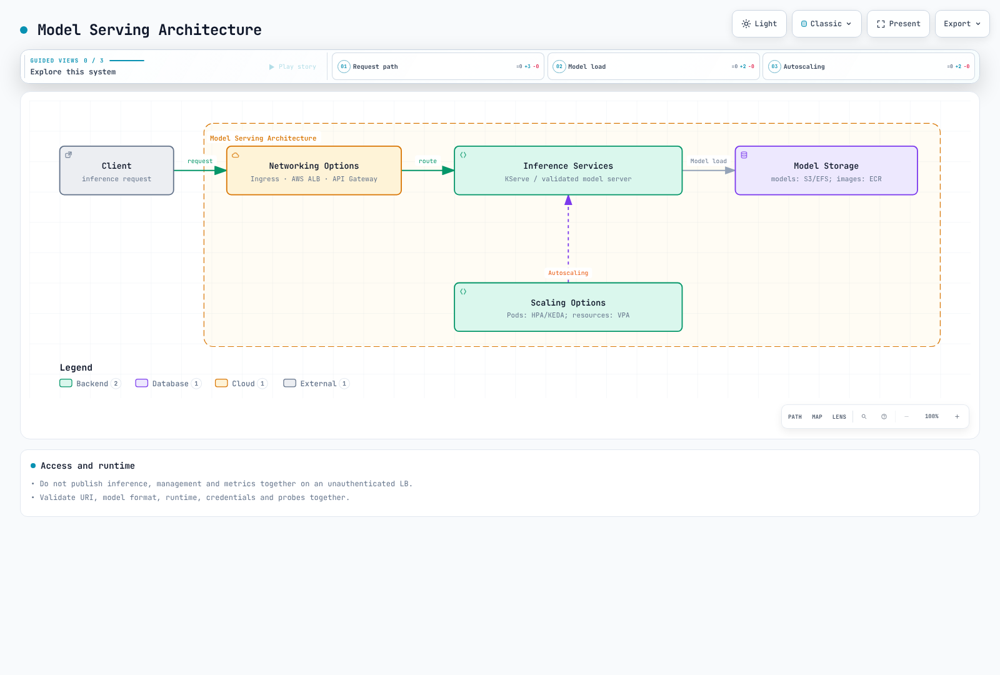

# Cargas de trabajo de AI/ML

> **Revisión de referencia**: GPU Operator 26.7.0 / NVIDIA device plugin 0.20.0 / FSx CSI 1.10.0
> **Última actualización**: September 12, 2026

Kubernetes es una plataforma potente para ejecutar cargas de trabajo de AI/ML. En este capítulo, aprenderemos a ejecutar cargas de trabajo de AI/ML en EKS y exploraremos las prácticas recomendadas.

## Características de las cargas de trabajo de AI/ML

Las cargas de trabajo de AI/ML tienen características diferentes en comparación con las cargas de trabajo de aplicaciones típicas:


[🔍 Ver diagrama interactivo](https://www.atomai.click/kubernetes-docs/archmaps/en-ai-ml-01-ai-ml-workloads-0.html)

1. **Uso intensivo de recursos**: Requieren recursos informáticos significativos, incluidas GPU, CPU de alto rendimiento y gran cantidad de memoria.
2. **Uso intensivo de datos**: Requieren acceso rápido a grandes conjuntos de datos.
3. **Procesamiento distribuido**: Requieren procesamiento distribuido entre varios nodos para el entrenamiento de modelos a gran escala.
4. **Diversidad de cargas de trabajo**: Incluyen diversos tipos de cargas de trabajo, como entrenamiento, inferencia y preprocesamiento de datos.

## Distinciones para el diseño de AI/ML

Verifique la compatibilidad con respecto al framework, la imagen, el dispositivo y la versión de Kubernetes seleccionados:

### 1. Despliegue de Large Language Model (LLM)

Los Large Language Models (LLM) son una de las tecnologías más destacadas de AI en los últimos tiempos. Consideraciones clave para desplegar LLM de forma eficiente en Kubernetes:

- **Fragmentación de modelos**: Distribuir modelos grandes entre varias GPU
- **Selección de precisión**: Distinguir el cálculo FP16/BF16 de la cuantización INT8/INT4 y validar la compatibilidad de precisión/dispositivo
- **Optimización de inferencia**: Mejorar el rendimiento de inferencia mediante vLLM, TensorRT, ONNX Runtime, etc.
- **Estrategia de escalado**: Aumentar el rendimiento mediante escalado horizontal

### 2. Frameworks de orquestación de AI

Frameworks de orquestación especializados para gestionar cargas de trabajo de AI/ML en Kubernetes:

- **Kubeflow**: Plataforma integral para flujos de trabajo de machine learning
- **Ray on Kubernetes**: Framework de computación distribuida
- **KServe**: Gestión de inferencia con Knative/Standard y otras rutas
- **Seldon Core**: Servicio y monitorización de modelos

### 3. Uso compartido y optimización de GPU

Tecnologías para utilizar eficientemente los recursos de GPU:

- **MIG (Multi-Instance GPU)**: Particionamiento de GPU NVIDIA A100/H100
- **Enfoques de uso compartido**: MPS y time-slicing difieren entre sí y de MIG en cuanto a aislamiento/compatibilidad
- **Asignación dinámica**: Asignación dinámica de recursos de GPU según sea necesario
- **GPU Operator**: Automatización de la gestión de GPU en Kubernetes

### 4. Integración de MLOps y GitOps

Aplicación de principios de DevOps para la gestión del ciclo de vida de AI/ML:

- **Control de versiones de modelos**: Versionado de modelos integrado con Git
- **Pipelines de CI/CD**: Automatización del entrenamiento y despliegue de modelos
- **Pruebas A/B y canaries**: La comparación experimental y el lanzamiento gradual tienen objetivos/métricas diferentes
- **Monitorización y bucles de retroalimentación**: Monitorización del rendimiento de modelos y reentrenamiento

### 5. Integración de bases de datos vectoriales

Integración de bases de datos vectoriales para embeddings y búsqueda semántica:

- **Pinecone**: Búsqueda vectorial gestionada
- **Milvus**: Base de datos vectorial de código abierto
- **Faiss**: Biblioteca de Facebook AI para búsquedas eficientes de similitud
- **OpenSearch**: Motor de búsqueda con capacidades de búsqueda vectorial

La inferencia por lotes y en línea tienen objetivos diferentes de latencia/rendimiento.

## Configuración de infraestructura de AI/ML en EKS


[🔍 Ver diagrama interactivo](https://www.atomai.click/kubernetes-docs/archmaps/en-ai-ml-01-ai-ml-workloads-1.html)

### Selección del tipo de nodo

Estos son ejemplos de capacidad, no un catálogo ni una clasificación actual exhaustivos. Compruebe la disponibilidad regional, las cuotas, la arquitectura de CPU, la memoria de GPU y la compatibilidad de software:

1. **Instancias de GPU**:
   - p4d.24xlarge: 8x GPU NVIDIA A100, 320GB de memoria de GPU
   - p3.16xlarge: 8x GPU NVIDIA V100, 128GB de memoria de GPU
   - g5.xlarge~g5.48xlarge: GPU NVIDIA A10G, hasta 8 GPU
   - g4dn.12xlarge: 4 GPU T4; g4dn.16xlarge: 1 GPU T4 — el tamaño y el número de GPU no aumentan de forma monotónica

2. **Instancias optimizadas para CPU**:
   - c6i.32xlarge: 128 vCPU, 256GB de memoria
   - c7g.16xlarge: 64 vCPU (AWS Graviton3), 128GB de memoria

3. **Instancias optimizadas para memoria**:
   - r6i.32xlarge: 128 vCPU, 1024GB de memoria
   - x2gd.16xlarge: 64 vCPU, 1024GB de memoria

4. **Instancias Inferentia**:
   - inf1.24xlarge: 16 chips AWS Inferentia, 96 vCPU, 192GB de memoria

5. **Instancias Trainium**:
   - trn1.32xlarge: 16 chips AWS Trainium, 128 vCPU, 512GB de memoria

### Configuración de almacenamiento

Las cargas de trabajo de AI/ML requieren almacenamiento de alto rendimiento:

1. **Amazon EBS**:
   - gp3: Almacenamiento SSD de uso general predeterminado
   - io2: Almacenamiento SSD de alto rendimiento
   - st1: Almacenamiento HDD optimizado para rendimiento

2. **Amazon EFS**:
   - Útil cuando varios nodos necesitan acceder a datos compartidos
   - Modo de rendimiento: se recomienda General Purpose; el Max I/O de generación anterior es incompatible con el rendimiento Elastic
   - Modos de rendimiento: Elastic, Provisioned y Bursting — compare las necesidades de la carga de trabajo, los precios y los límites

3. **Amazon FSx for Lustre**:
   - Sistema de archivos paralelo de alto rendimiento
   - Proporciona acceso rápido a grandes conjuntos de datos
   - Simplifica la importación y exportación de datos mediante la integración con S3

4. **Amazon S3**:
   - Almacena grandes conjuntos de datos
   - Almacena datos de entrenamiento y artefactos de modelos

### Configuración de red

Configuración de red para entrenamiento distribuido:

1. **Cluster Placement Groups**:
   - Minimiza la latencia entre nodos
   - Coloca nodos dentro de la misma zona de disponibilidad

2. **Enhanced Networking**:
   - Elastic Network Adapter (ENA)
   - ENA Express
   - Elastic Fabric Adapter (EFA)

3. **Configuración de VPC CNI**:
   - Gestión de direcciones IP para despliegues de Pod a gran escala
   - Configuración del rango de direcciones IP secundarias

## Despliegue de cargas de trabajo de AI/ML


[🔍 Ver diagrama interactivo](https://www.atomai.click/kubernetes-docs/archmaps/en-ai-ml-01-ai-ml-workloads-2.html)

### NVIDIA GPU Operator y asignación de dispositivos

Las AMI NVIDIA de EKS AL2023 ya contienen drivers y Container Toolkit, por lo que debe deshabilitar su instalación mediante GPU Operator. No contienen el device plugin/controlador DRA, que requiere configuración. Las AMI NVIDIA de Bottlerocket incluyen el device plugin. Evite instalar propietarios duplicados.

Este comando **genera localmente** el chart de Operator revisado. Inspeccione ClusterPolicy/RBAC y los requisitos reales de instalación antes del despliegue.

```bash
# AL2023 NVIDIA AMI profile: host driver/toolkit are already installed.
helm repo add nvidia https://helm.ngc.nvidia.com/nvidia
helm repo update nvidia
helm template gpu-operator nvidia/gpu-operator \
  --version v26.7.0 --namespace gpu-operator \
  --set driver.enabled=false --set toolkit.enabled=false \
  > gpu-operator.rendered.yaml
```

El recurso extendido de NVIDIA es `nvidia.com/gpu`. Los límites enteros implican una solicitud igual; si se especifican ambos, deben coincidir. `0.5` no es una asignación de GPU válida. Esta imagen de CUDA 12.8 es ilustrativa; verifique la compatibilidad del driver de host/arquitectura y fije el digest de la imagen antes del despliegue. No se realizó ninguna ejecución de GPU en esta revisión.

```yaml
apiVersion: v1
kind: Pod
metadata:
  name: gpu-allocation-check
spec:
  restartPolicy: Never
  containers:
    - name: check
      image: nvidia/cuda:12.8.1-base-ubuntu22.04
      command: ["nvidia-smi", "-L"]
      resources:
        requests:
          cpu: "100m"
          memory: 128Mi
        limits:
          memory: 256Mi
          nvidia.com/gpu: 1
```

### Kubeflow y entrenamiento distribuido

Utilice la [guía de instalación 26.03.1](kubeflow/01-architecture-installation.md) fijada para dependencias, identidad y almacenamiento en lugar de una instalación de una sola línea de la rama master. El proyecto de servicio es KServe; KFServing es su nombre histórico.

La ejecución distribuida puede utilizar [Trainer](kubeflow/05-training-operator.md), TFJob/PyTorchJob heredados o el MPI Operator independiente. Distinga la API de MPI Operator de la de Training Operator heredado según las CRD/versión instaladas. Los controladores de Job crean Pod; un lanzador MPI o torchrun inicia procesos.

Un único Pod no puede satisfacer torchrun --nnodes=2, y un nombre DNS de Pod inventado no proporciona rendezvous. Proporcione el código/la imagen de entrenamiento reales, el número de workers, Service/DNS, rangos/backend, fragmentación de datos y comportamiento de checkpoint/timeout/retry. La programación gang necesita compatibilidad de políticas/scheduler independientes.



[🔍 Diagrama interactivo](https://www.atomai.click/kubernetes-docs/archmaps/en-ai-ml-01-ai-ml-workloads-3.html)

Para NCCL sobre EFA, la ruta es el plugin AWS OFI NCCL → libfabric → EFA. MPI puede iniciar procesos sin ser la capa de transporte obligatoria de NCCL. Verifique ENA/EFA, GPUDirect, security groups, AMI y bibliotecas por separado. Los montajes de dispositivo Multus/SR-IOV o hostPath por sí solos no configuran EFA/GPUDirect en EKS.

### Servicio de modelos

Compruebe el modo Knative/Standard de [KServe](kubeflow/06-kserve.md), el runtime/formato de modelo, el acceso a URI, el protocolo y la configuración de dispositivos GPU. Una solicitud de GPU por sí sola no habilita la inferencia mediante GPU. Triton también necesita un repositorio de modelos, configuración de backend y validación de preparación.

TorchServe anuncia que no tiene mantenimiento activo ni correcciones de seguridad planificadas, por lo que no es una opción predeterminada mantenida para nuevos despliegues. No publique juntos los puertos de inferencia, gestión y métricas mediante un LoadBalancer sin autenticación. Configure ingress autenticado y un acceso interno de gestión adecuado.



[🔍 Diagrama interactivo](https://www.atomai.click/kubernetes-docs/archmaps/en-ai-ml-01-ai-ml-workloads-4.html)

## Optimización de cargas de trabajo de AI/ML


[🔍 Ver diagrama interactivo](https://www.atomai.click/kubernetes-docs/archmaps/en-ai-ml-01-ai-ml-workloads-5.html)

### Uso compartido de GPU y memoria

Time-slicing expone acceso compartido a GPU sin aislamiento de memoria/fallos ni garantías de rendimiento proporcional. MPS utiliza un daemon de control independiente; la documentación del plugin revisada etiqueta la compatibilidad como experimental y excluye dispositivos con MIG habilitado. Un RuntimeClass junto con un Pod MPS privilegiado no configura el uso compartido en todo el nodo.

Esta es una configuración independiente de device plugin. Si GPU Operator posee el plugin, use en su lugar la ruta de configuración de ese propietario.

```yaml
# device-plugin-sharing.yaml: NVIDIA device plugin configuration, not a Pod.
version: v1
sharing:
  timeSlicing:
    renameByDefault: true
    failRequestsGreaterThanOne: true
    resources:
      - name: nvidia.com/gpu
        replicas: 2
```

```bash
# Alternative to an operator-owned plugin; do not install a second owner.
helm repo add nvdp https://nvidia.github.io/k8s-device-plugin
helm repo update nvdp
helm template nvdp nvdp/nvidia-device-plugin \
  --version 0.20.0 --namespace nvidia-device-plugin \
  --set config.default=shared \
  --set-file config.map.shared=device-plugin-sharing.yaml \
  > device-plugin.rendered.yaml
```

Esto expone nvidia.com/gpu.shared; los Pod solicitan un entero de ese recurso. replicas=2 no garantiza la mitad de la memoria de GPU. Verifique los nodos seleccionados, la asignación y la contención en hardware de GPU real.

### Ubicación y topología

Las anotaciones de zona/región no controlan la ubicación de Pod. Use nodeSelector/affinity con las etiquetas reales de nodo; los selectores de anti-affinity/spread también deben coincidir con las etiquetas de Pod. Sustituya la AZ real a continuación. La ubicación en la misma AZ, la distribución entre nodos y la admisión gang son restricciones diferentes.

```yaml
apiVersion: v1
kind: Pod
metadata:
  name: placement-check
  labels:
    app: placement-check
spec:
  restartPolicy: Never
  nodeSelector:
    topology.kubernetes.io/zone: us-west-2a
  affinity:
    podAntiAffinity:
      preferredDuringSchedulingIgnoredDuringExecution:
        - weight: 100
          podAffinityTerm:
            labelSelector:
              matchLabels:
                app: placement-check
            topologyKey: kubernetes.io/hostname
  containers:
    - name: check
      image: python:3.12-slim
      command: ["python", "-c", "print('placement check')"]
      resources:
        requests:
          cpu: "100m"
          memory: 64Mi
        limits:
          cpu: "1"
          memory: 128Mi
```

### Almacenamiento y caché

El aprovisionamiento estático de FSx CSI conecta un **sistema de archivos existente** con PV/PVC. Sustituya el ID del sistema de archivos, DNS, nombre de montaje, capacidad y namespace por valores reales. Retain evita la eliminación automática del sistema de archivos; los cargos se mantienen hasta que se limpien por separado.

```yaml
apiVersion: v1
kind: PersistentVolume
metadata:
  name: ml-fsx-existing
spec:
  capacity:
    storage: 1200Gi
  volumeMode: Filesystem
  accessModes: [ReadWriteMany]
  storageClassName: ""
  persistentVolumeReclaimPolicy: Retain
  mountOptions: [flock]
  csi:
    driver: fsx.csi.aws.com
    volumeHandle: fs-0123456789abcdef0
    volumeAttributes:
      dnsname: fs-0123456789abcdef0.fsx.us-west-2.amazonaws.com
      mountname: replace-with-actual-mount-name
---
apiVersion: v1
kind: PersistentVolumeClaim
metadata:
  name: ml-dataset
  namespace: ml-workloads
spec:
  accessModes: [ReadWriteMany]
  storageClassName: ""
  volumeName: ml-fsx-existing
  resources:
    requests:
      storage: 1200Gi
```

El aprovisionamiento dinámico crea un sistema de archivos a partir de un StorageClass/PVC. No coloque ajustes estáticos de volumeHandle/DNS en StorageClass ni mezcle un recurso fsx.aws.k8s.io/Lustre sin definir. Use el [ejemplo dinámico del driver](https://github.com/kubernetes-sigs/aws-fsx-csi-driver/tree/v1.10.0/examples/kubernetes/dynamic_provisioning) y compruebe las reglas de rendimiento/backup específicas del tipo de despliegue; SCRATCH_2 no puede utilizar opciones exclusivas de sistemas persistentes.

Un DaemonSet worker de Alluxio por sí solo no es un despliegue de caché completo. Diseñe los roles de master/worker, las rutas, la memoria, la red, la consistencia y la retención. Realice benchmark de una ruta de prueba separada en el PVC montado real; FIO sobre un /data sin montar no mide el rendimiento de FSx.

## Monitorización y logging


[🔍 Ver diagrama interactivo](https://www.atomai.click/kubernetes-docs/archmaps/en-ai-ml-01-ai-ml-workloads-6.html)

### Prometheus y Grafana

DCGM Exporter proporciona métricas de GPU, distintas de la capacidad asignable de device-plugin. Evite duplicar un exporter propiedad de Operator con otro DaemonSet. No se requiere un montaje de socket Docker para una configuración de containerd.

ServiceMonitor selecciona **etiquetas de Service y puertos con nombre**, no las etiquetas de Pod directamente. Haga coincidir estos valores con el Service de exporter instalado y asegúrese de que Prometheus también seleccione el namespace/las etiquetas de ServiceMonitor.

```yaml
apiVersion: monitoring.coreos.com/v1
kind: ServiceMonitor
metadata:
  name: gpu-metrics
  namespace: monitoring
spec:
  namespaceSelector:
    matchNames: [gpu-operator]
  selector:
    matchLabels:
      app: nvidia-dcgm-exporter
  endpoints:
    - port: gpu-metrics
      interval: 15s
```

Observe la utilización/memoria/errores de GPU junto con las solicitudes, los errores y los histogramas de latencia de la aplicación. La precisión necesita una ruta de evaluación con datos de referencia; añadir réplicas no mejora la calidad del modelo. Sustituya los JSON antiguos de gráficos/flot de Grafana por los formatos actuales de series temporales/medidores y los UID de datasource reales; después, valide la importación.

### Recopilación de logs

El enmarcado de logs CRI de containerd y JSON de aplicación son capas diferentes. Configure el análisis CRI/multilínea de Fluent Bit, las rutas, la base de datos de posiciones/rotación y RBAC de metadatos de Kubernetes. No copie tipos de documento de Elasticsearch/OpenSearch eliminados ni nombres de parser sin definir. Las integraciones de CloudWatch/salida necesitan plugins de imagen, IAM de carga de trabajo y acceso de red. Gestione las cargas útiles confidenciales de modelos y el crecimiento del búfer de reintentos. Consulte la ruta de recopilación seleccionada en la [guía de observabilidad](../observability/README.md).

## Optimización de costes

### Spot y aprovisionamiento de nodos

Las interrupciones/escasez de capacidad de Spot requieren checkpoints externos, retry/idempotency y validación del tiempo de recuperación. Use la configuración actual de NodePool/EC2NodeClass de la [guía de Karpenter](../autoscaling/02-karpenter.md), incluida la revisión de imagen/AMI, taints/tolerations, límites y gestión de interrupciones. Mezclar grupos de nodos CPU/GPU es distinto del producto EKS Hybrid Nodes.

### HPA y métricas

Use métricas Resource de HPA para CPU/memoria proporcionadas por metrics-server. La asignación de nvidia.com/gpu no es una métrica Resource de utilización de GPU. Las señales de GPU/solicitud requieren exporters y un adaptador de métricas custom/external.

Este ejemplo utiliza RPS expuesto **por namespace/Pod** mediante un adaptador. El Deployment objetivo y el adaptador requieren instalaciones independientes; 100 RPS es un objetivo ilustrativo que debe calibrarse mediante medición. Asigne un propietario de escalado en lugar de que varios controladores HPA/KEDA controlen el mismo número de réplicas.

```yaml
apiVersion: autoscaling/v2
kind: HorizontalPodAutoscaler
metadata:
  name: inference-hpa
  namespace: ml-workloads
spec:
  scaleTargetRef:
    apiVersion: apps/v1
    kind: Deployment
    name: inference-service
  minReplicas: 1
  maxReplicas: 10
  metrics:
    - type: Pods
      pods:
        metric:
          name: inference_requests_per_second
        target:
          type: AverageValue
          averageValue: "100"
```

La agregación/agrupación de etiquetas incorrecta puede impedir que un adaptador devuelva valores por Pod. Los percentiles de histogramas o la precisión del modelo no son automáticamente señales proporcionales adecuadas para HPA. Mida conjuntamente la carga/cola/latencia/utilización y el rendimiento logrado. La reducción de Pod puede mantener los cargos de EC2 hasta la terminación del nodo; la hora del día por sí sola no reduce las tarifas On-Demand.

### Acceso a datos y modelos

Kubernetes RBAC gobierna el acceso a API; los permisos de S3/KMS usan IAM de carga de trabajo. Use almacenamiento de objetos, cifrado y credenciales basadas en archivos en lugar de Secrets de modelos grandes o claves de descifrado en variables de entorno. La codificación base64 de Secret no es cifrado. NetworkPolicy namespaceSelector y podSelector dentro de un peer son AND; las entradas separadas son OR. Permita también las direcciones reales de DNS/almacenamiento/métricas.

## Validación y referencias

Este capítulo se corrigió usando la generación con Helm y la revisión de manifiestos/configuración oficiales de GPU Operator/device-plugin. No se realizó ninguna ejecución real de GPU, creación/montaje de FSx, entrenamiento distribuido, servicio ni autoscaling. Valide las versiones de componentes y los requisitos de nodo en el entorno objetivo.

- [AMI aceleradas de EKS](https://docs.aws.amazon.com/eks/latest/userguide/ml-eks-optimized-ami.html)
- [Programación de GPU en Kubernetes](https://kubernetes.io/docs/tasks/manage-gpus/scheduling-gpus/)
- [NVIDIA device plugin 0.20.0](https://github.com/NVIDIA/k8s-device-plugin/tree/v0.20.0)
- [FSx CSI 1.10.0](https://github.com/kubernetes-sigs/aws-fsx-csi-driver/tree/v1.10.0)
- [Modos de rendimiento de EFS](https://docs.aws.amazon.com/efs/latest/ug/performance.html)
- [Kubernetes HPA](https://kubernetes.io/docs/tasks/run-application/horizontal-pod-autoscale/)

## Cuestionario

Para comprobar lo que ha aprendido en este capítulo, pruebe el [cuestionario del tema](../quizzes/ai-ml/03-ai-ml-workloads-quiz.md).
