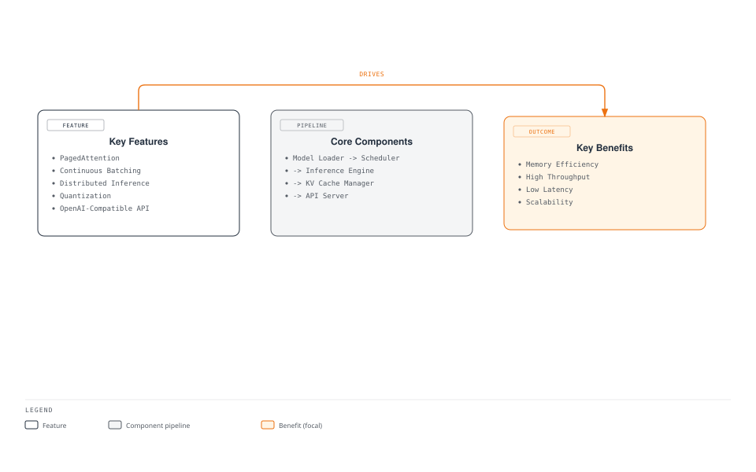
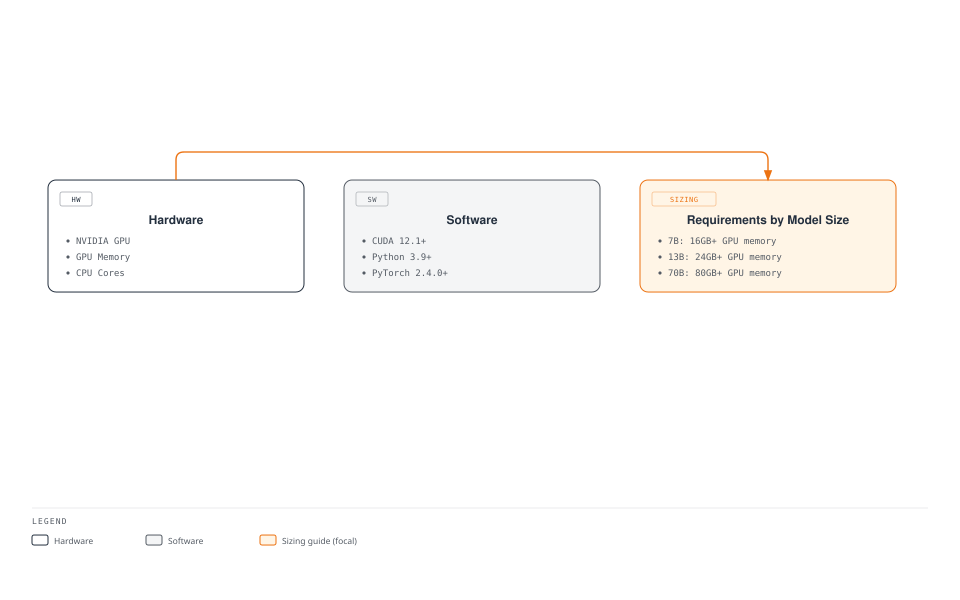
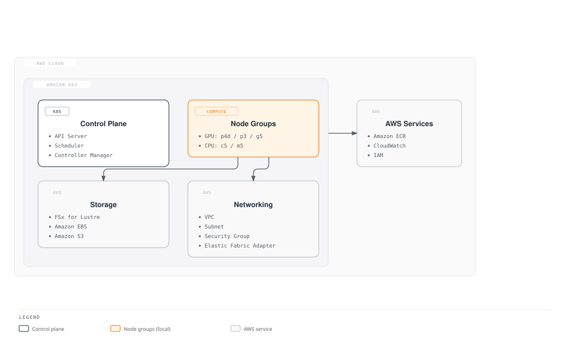
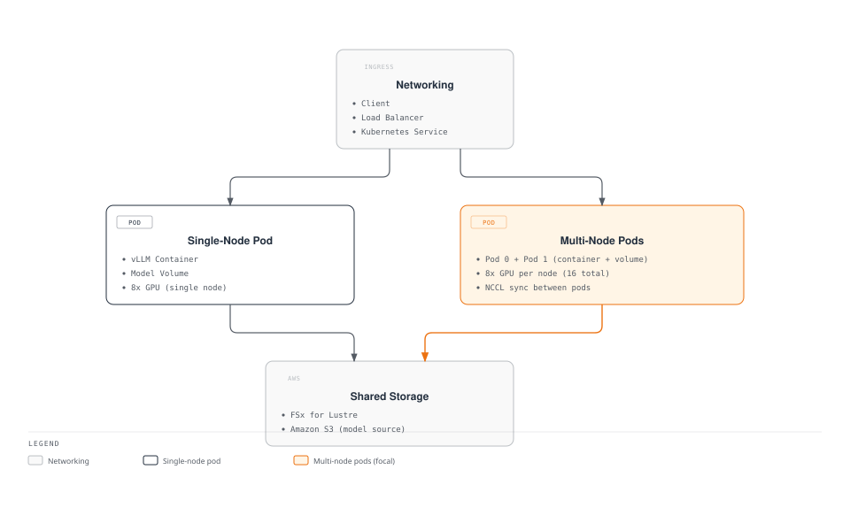
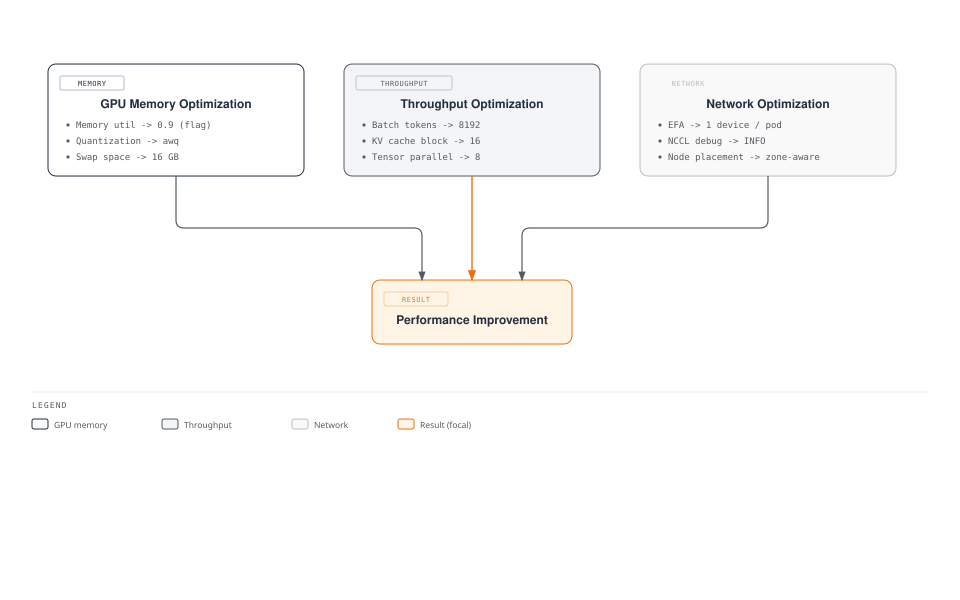
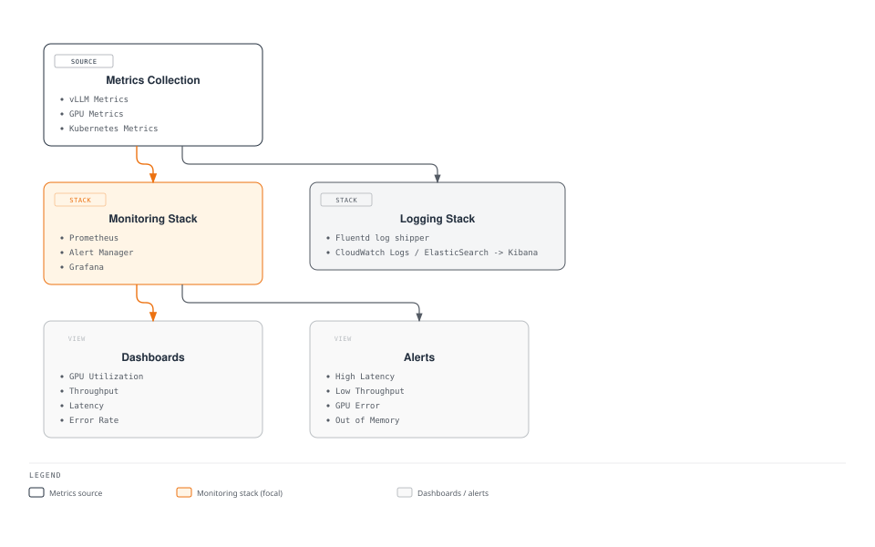
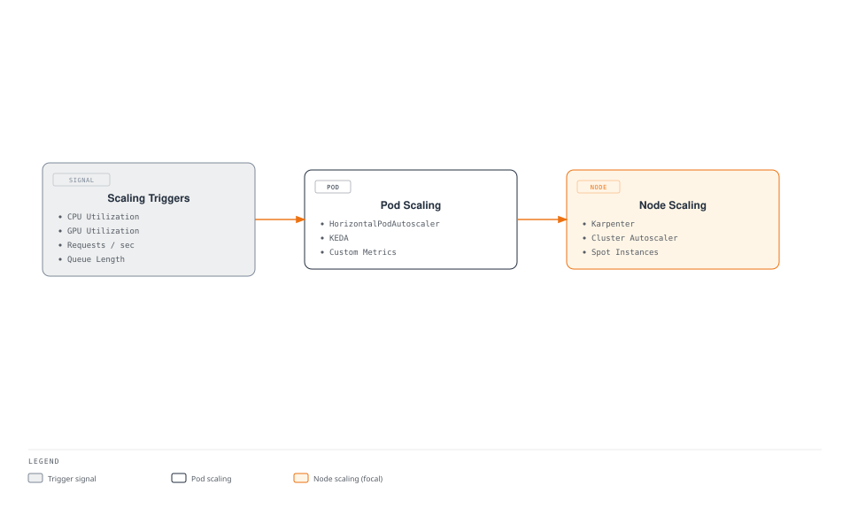
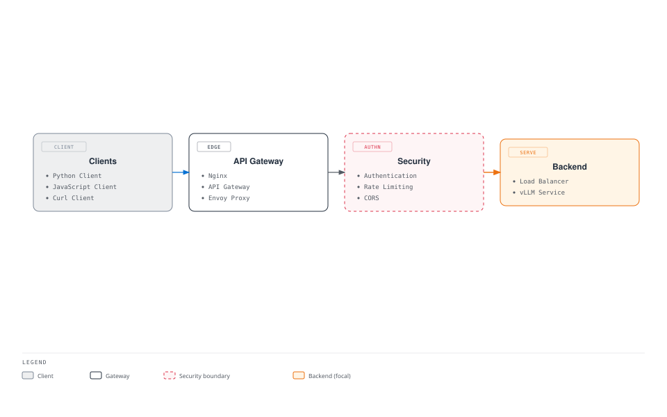

# Implementación y optimización de vLLM

> **Versiones compatibles**: Kubernetes 1.31, 1.32, 1.33  
> **Última actualización**: September 4, 2026

vLLM es el motor de inferencia de alto rendimiento de código abierto más ampliamente adoptado para Large Language Models (LLM). En este capítulo, exploraremos las funciones y la arquitectura más recientes de vLLM, y aprenderemos a implementarlo y optimizarlo a escala de producción en EKS.

## Configuración del entorno de laboratorio

Para seguir los ejemplos de este documento, necesitará las siguientes herramientas y entorno:

### Herramientas y recursos necesarios
- kubectl v1.31 o superior
- Helm v3.10 o superior
- Clúster de EKS con GPU NVIDIA (mínimo recomendado: instancia g5.2xlarge)
- Controladores NVIDIA y NVIDIA Device Plugin instalados
- Al menos 50GB de espacio en disco

### Configuración de nodos GPU

```bash
# Install NVIDIA Device Plugin
kubectl apply -f https://raw.githubusercontent.com/NVIDIA/k8s-device-plugin/v0.14.0/nvidia-device-plugin.yml

# Verify GPU nodes
kubectl get nodes "-o=custom-columns=NAME:.metadata.name,GPU:.status.allocatable.nvidia\.com/gpu"
```

## Introducción a vLLM

vLLM es un motor de inferencia de LLM con las siguientes características:



### Características principales de vLLM

1. **PagedAttention**:
   - Tecnología de gestión de memoria que administra eficazmente la caché KV
   - Inspirada en la gestión de memoria virtual de los sistemas operativos
   - Permite procesar hasta 10 veces más solicitudes simultáneas

2. **Continuous Batching**:
   - Agrupa dinámicamente las solicitudes para maximizar el uso de GPU
   - Comienza a procesar solicitudes nuevas inmediatamente cuando llegan
   - Mejora del rendimiento de hasta 2 veces

3. **Inferencia distribuida**:
   - Admite modelos a gran escala mediante paralelización de tensores
   - Fragmentación de modelos entre varias GPU
   - Admite modelos de más de 175B parámetros

4. **Cuantización**:
   - Admite varias precisiones, incluidas INT8 y FP16
   - Reduce el uso de memoria y mejora la velocidad de inferencia
   - Mejora de la eficiencia de memoria de hasta 2 veces con una pérdida mínima de precisión

## Modelos compatibles

vLLM admite los siguientes modelos:

| Familia de modelos | Modelos compatibles | Opciones de cuantización |
|-------------|-----------------|---------------------|
| **LLaMA 3 / 3.1 / 3.2 / 3.3** | 1B, 3B, 8B, 70B, 405B | FP16, BF16, FP8, INT8, INT4, AWQ, GPTQ |
| **DeepSeek V3 / R1** | 7B, 67B, 671B (MoE) | FP16, BF16, FP8, AWQ, GPTQ |
| **Qwen 2 / 2.5 / QwQ** | 0.5B ~ 72B | FP16, BF16, FP8, INT8, AWQ, GPTQ |
| **Mistral / Mixtral** | 7B, 8x7B, 8x22B, Large 2 | FP16, BF16, FP8, AWQ, GPTQ |
| **Gemma 2 / 3** | 2B, 9B, 27B | FP16, BF16, INT8 |
| **Phi-3 / Phi-4** | 3.8B, 7B, 14B | FP16, BF16, INT8, AWQ |
| **Command R / R+** | 35B, 104B | FP16, BF16 |
| **DBRX** | 132B (MoE) | FP16, BF16 |
| **StarCoder 2** | 3B, 7B, 15B | FP16, BF16 |
| **Modelos de visión (VLM)** | LLaVA, Pixtral, Qwen2-VL, InternVL | FP16, BF16 |

1. **PagedAttention**: Mecanismo de atención eficiente en memoria que optimiza el uso de memoria al procesar secuencias largas.
2. **Continuous Batching**: Agrupa dinámicamente solicitudes para mejorar el rendimiento.
3. **Inferencia distribuida**: Distribuye los modelos entre varias GPU y nodos para gestionar modelos a gran escala.
4. **Cuantización**: Admite cuantización INT8/INT4 para reducir el uso de memoria y mejorar el rendimiento.
5. **API compatible con OpenAI**: Proporciona una interfaz compatible con la API de OpenAI.

### Funciones de vLLM añadidas en la línea v0.6

vLLM evoluciona rápidamente con importantes capacidades nuevas en las versiones recientes:

#### Decodificación especulativa

Utiliza un modelo borrador más pequeño para generar varios tokens candidatos, que el modelo más grande verifica en una única pasada, lo que mejora la velocidad de inferencia entre 2 y 3 veces:

```bash
python -m vllm.entrypoints.openai.api_server \
  --model meta-llama/Llama-3.1-70B-Instruct \
  --speculative-model meta-llama/Llama-3.1-8B-Instruct \
  --num-speculative-tokens 5
```

#### Caché de prefijos

Reutiliza automáticamente la caché KV entre solicitudes que comparten el mismo prompt de sistema o contexto, reduciendo drásticamente TTFT (Time to First Token):

```bash
--enable-prefix-caching
```

#### Prefill por fragmentos

Divide el prefill de prompts largos en fragmentos más pequeños intercalados con pasos de decodificación, reduciendo el impacto de las solicitudes de contexto largo en la latencia de otras solicitudes:

```bash
--enable-chunked-prefill --max-num-batched-tokens 2048
```

#### Carga dinámica de adaptadores LoRA

Carga y descarga dinámicamente varios adaptadores LoRA en tiempo de ejecución, atendiendo muchos modelos personalizados desde un único modelo base:

```bash
--enable-lora --max-loras 4 --max-lora-rank 64
```

```python
# Specify LoRA model in API request
response = client.chat.completions.create(
    model="my-custom-lora-adapter",
    messages=[{"role": "user", "content": "Hello!"}]
)
```

#### Salida estructurada

Admite la generación de salidas restringidas mediante JSON Schema, patrones regex y CFG (Context-Free Grammar) para una generación de datos estructurados confiable:

```python
from openai import OpenAI
client = OpenAI(base_url="http://vllm-service:8000/v1")

response = client.chat.completions.create(
    model="meta-llama/Llama-3.1-8B-Instruct",
    messages=[{"role": "user", "content": "Return user information as JSON"}],
    response_format={
        "type": "json_schema",
        "json_schema": {
            "name": "user_info",
            "schema": {
                "type": "object",
                "properties": {
                    "name": {"type": "string"},
                    "age": {"type": "integer"},
                    "email": {"type": "string"}
                },
                "required": ["name", "age", "email"]
            }
        }
    }
)
```

#### Tool Calling

Admite Tool/Function Calling compatible con OpenAI para integrarse con flujos de trabajo de agentes:

```python
response = client.chat.completions.create(
    model="meta-llama/Llama-3.1-8B-Instruct",
    messages=[{"role": "user", "content": "What's the weather in Seoul?"}],
    tools=[{
        "type": "function",
        "function": {
            "name": "get_weather",
            "description": "Get the current weather for a specified location",
            "parameters": {
                "type": "object",
                "properties": {
                    "location": {"type": "string", "description": "City name"}
                },
                "required": ["location"]
            }
        }
    }]
)
```

#### Cuantización FP8

Admite cuantización FP8 en las GPU Hopper (H100) y Ada Lovelace (L4, L40S), reduciendo a la mitad el uso de memoria y manteniendo una precisión casi idéntica:

```bash
--quantization fp8 --kv-cache-dtype fp8
```

#### Serving de Vision-Language Model (VLM)

Admite modelos multimodales que procesan imágenes y texto simultáneamente:

```python
response = client.chat.completions.create(
    model="llava-hf/llava-v1.6-mistral-7b-hf",
    messages=[{
        "role": "user",
        "content": [
            {"type": "text", "text": "Describe this image"},
            {"type": "image_url", "image_url": {"url": "data:image/png;base64,..."}}
        ]
    }]
)
```

## Requisitos del sistema

Requisitos del sistema para implementar vLLM en EKS:



1. **Hardware**:
   - GPU NVIDIA (arquitectura Volta, Turing, Ampere, Hopper)
   - Memoria GPU mínima: varía según el tamaño del modelo
     - Modelo 7B: mínimo 16GB de memoria GPU
     - Modelo 13B: mínimo 24GB de memoria GPU
     - Modelo 70B: mínimo 80GB de memoria GPU (o distribuida entre varias GPU)

2. **Software**:
   - CUDA 12.1 o superior (se recomienda CUDA 12.4 para FP8)
   - Python 3.9 o superior
   - PyTorch 2.4.0 o superior

3. **Tipos de nodo de EKS**:
   - p5.48xlarge: 8x GPU NVIDIA H100, 80GB cada una (máximo rendimiento)
   - p4d.24xlarge: 8x GPU NVIDIA A100, 40GB u 80GB cada una
   - g6.12xlarge: 4x GPU NVIDIA L4, 24GB cada una (rentable)
   - g5.12xlarge: 4x GPU NVIDIA A10G, 24GB cada una
   - g6e.12xlarge: 4x GPU NVIDIA L40S, 48GB cada una
   - trn1.32xlarge: 16x AWS Trainium, 32GB cada una (silicio de AWS)

## Configuración de infraestructura de EKS



## Configuración de almacenamiento

vLLM requiere almacenamiento de alto rendimiento, ya que necesita cargar grandes pesos de modelos:

### Configuración de FSx for Lustre

FSx for Lustre es un sistema de archivos paralelo de alto rendimiento adecuado para cargar rápidamente grandes pesos de modelos:

```yaml
apiVersion: fsx.aws.k8s.io/v1beta1
kind: Lustre
metadata:
  name: vllm-models
spec:
  deploymentType: SCRATCH_2
  storageCapacity: 1200
  subnetIds:
    - subnet-0123456789abcdef0
  securityGroupIds:
    - sg-0123456789abcdef0
  perUnitStorageThroughput: 200
---
apiVersion: storage.k8s.io/v1
kind: StorageClass
metadata:
  name: fsx-lustre-sc
provisioner: fsx.csi.aws.com
parameters:
  fileSystemId: fs-0123456789abcdef0
  mountName: vllm-models
---
apiVersion: v1
kind: PersistentVolumeClaim
metadata:
  name: vllm-models-pvc
spec:
  accessModes:
    - ReadWriteMany
  storageClassName: fsx-lustre-sc
  resources:
    requests:
      storage: 1200Gi
```

### Descarga de modelos desde S3

Job para almacenar modelos de Hugging Face en S3 y descargarlos a FSx for Lustre:

```yaml
apiVersion: batch/v1
kind: Job
metadata:
  name: model-download
spec:
  template:
    spec:
      containers:
      - name: model-download
        image: huggingface/transformers:latest
        command:
        - python
        - -c
        - |
          from huggingface_hub import snapshot_download
          import os

          model_id = "meta-llama/Llama-3.1-70B-Instruct"
          dest_dir = "/models/llama-3.1-70b"

          os.makedirs(dest_dir, exist_ok=True)
          snapshot_download(repo_id=model_id, local_dir=dest_dir, token=os.environ["HF_TOKEN"])
        env:
        - name: HF_TOKEN
          valueFrom:
            secretKeyRef:
              name: huggingface-token
              key: token
        volumeMounts:
        - name: models-volume
          mountPath: /models
      restartPolicy: Never
      volumes:
      - name: models-volume
        persistentVolumeClaim:
          claimName: vllm-models-pvc
```

## Implementación de vLLM

### Arquitectura de implementación

El siguiente diagrama muestra dos arquitecturas principales para implementar vLLM en EKS:



### Implementación de un solo nodo

Implementación que ejecuta vLLM en una sola GPU o varias GPU en un único nodo:

```yaml
apiVersion: apps/v1
kind: Deployment
metadata:
  name: vllm-inference
spec:
  replicas: 1
  selector:
    matchLabels:
      app: vllm-inference
  template:
    metadata:
      labels:
        app: vllm-inference
    spec:
      containers:
      - name: vllm-server
        image: vllm/vllm-openai:latest
        command:
        - python
        - -m
        - vllm.entrypoints.openai.api_server
        - --model=/models/llama-3.1-70b
        - --tensor-parallel-size=8
        - --gpu-memory-utilization=0.95
        - --max-num-batched-tokens=16384
        - --enable-prefix-caching
        - --enable-chunked-prefill
        - --port=8000
        ports:
        - containerPort: 8000
        resources:
          limits:
            nvidia.com/gpu: 8
        volumeMounts:
        - name: models-volume
          mountPath: /models
        env:
        - name: CUDA_VISIBLE_DEVICES
          value: "0,1,2,3,4,5,6,7"
      volumes:
      - name: models-volume
        persistentVolumeClaim:
          claimName: vllm-models-pvc
---
apiVersion: v1
kind: Service
metadata:
  name: vllm-inference
spec:
  selector:
    app: vllm-inference
  ports:
  - port: 8000
    targetPort: 8000
  type: LoadBalancer
```

### Implementación distribuida multinodo

Método para distribuir modelos grandes entre varios nodos:

```yaml
apiVersion: v1
kind: ConfigMap
metadata:
  name: vllm-config
data:
  hostfile: |
    vllm-inference-0 slots=8
    vllm-inference-1 slots=8
  run_server.sh: |
    #!/bin/bash

    RANK=$HOSTNAME
    if [[ $HOSTNAME == "vllm-inference-0" ]]; then
      RANK=0
    elif [[ $HOSTNAME == "vllm-inference-1" ]]; then
      RANK=1
    fi

    python -m vllm.entrypoints.openai.api_server \
      --model=/models/llama-3.1-70b \
      --tensor-parallel-size=16 \
      --pipeline-parallel-size=1 \
      --max-num-batched-tokens=8192 \
      --port=8000 \
      --host=0.0.0.0 \
      --master-addr=vllm-inference-0 \
      --master-port=29500 \
      --rank=$RANK
---
apiVersion: apps/v1
kind: StatefulSet
metadata:
  name: vllm-inference
spec:
  serviceName: "vllm-inference"
  replicas: 2
  selector:
    matchLabels:
      app: vllm-inference
  template:
    metadata:
      labels:
        app: vllm-inference
    spec:
      affinity:
        podAntiAffinity:
          requiredDuringSchedulingIgnoredDuringExecution:
          - labelSelector:
              matchExpressions:
              - key: app
                operator: In
                values:
                - vllm-inference
            topologyKey: kubernetes.io/hostname
      containers:
      - name: vllm-server
        image: vllm/vllm-openai:latest
        command:
        - bash
        - /config/run_server.sh
        ports:
        - containerPort: 8000
        - containerPort: 29500
        resources:
          limits:
            nvidia.com/gpu: 8
        volumeMounts:
        - name: models-volume
          mountPath: /models
        - name: config-volume
          mountPath: /config
        env:
        - name: CUDA_VISIBLE_DEVICES
          value: "0,1,2,3,4,5,6,7"
        - name: NCCL_DEBUG
          value: "INFO"
        - name: NCCL_IB_DISABLE
          value: "0"
        - name: NCCL_IB_GID_INDEX
          value: "3"
        - name: NCCL_NET_GDR_LEVEL
          value: "5"
      volumes:
      - name: models-volume
        persistentVolumeClaim:
          claimName: vllm-models-pvc
      - name: config-volume
        configMap:
          name: vllm-config
          defaultMode: 0755
---
apiVersion: v1
kind: Service
metadata:
  name: vllm-inference
spec:
  selector:
    app: vllm-inference
  ports:
  - port: 8000
    targetPort: 8000
    name: api
  - port: 29500
    targetPort: 29500
    name: nccl
  clusterIP: None
---
apiVersion: v1
kind: Service
metadata:
  name: vllm-inference-lb
spec:
  selector:
    app: vllm-inference
    statefulset.kubernetes.io/pod-name: vllm-inference-0
  ports:
  - port: 8000
    targetPort: 8000
  type: LoadBalancer
```

## Optimización del rendimiento



### Optimización de memoria GPU

Métodos para optimizar el uso de memoria GPU de vLLM:

1. **Ajuste de utilización de memoria GPU**:

```bash
--gpu-memory-utilization=0.9
```

2. **Aplicación de cuantización**:

```bash
--quantization awq
```

3. **Uso de espacio de swap**:

```bash
--swap-space=16
```

### Optimización del rendimiento

Métodos para optimizar el rendimiento de vLLM:

1. **Ajuste del tamaño de batch**:

```bash
--max-num-batched-tokens=8192
```

2. **Optimización de caché KV**:

```bash
--block-size=16
```

3. **Ajuste del procesamiento paralelo de tensores**:

```bash
--tensor-parallel-size=8
```

### Optimización de red

Métodos para optimizar el rendimiento de red en implementaciones distribuidas:

1. **Uso de EFA (Elastic Fabric Adapter)**:

```yaml
resources:
  limits:
    nvidia.com/gpu: 8
    vpc.amazonaws.com/efa: 1
```

2. **Optimización de la configuración de NCCL**:

```yaml
env:
- name: NCCL_DEBUG
  value: "INFO"
- name: NCCL_MIN_NCHANNELS
  value: "4"
- name: NCCL_SOCKET_IFNAME
  value: "^lo,docker"
- name: NCCL_ASYNC_ERROR_HANDLING
  value: "1"
```

3. **Optimización de la ubicación de nodos**:

```yaml
affinity:
  nodeAffinity:
    requiredDuringSchedulingIgnoredDuringExecution:
      nodeSelectorTerms:
      - matchExpressions:
        - key: topology.kubernetes.io/zone
          operator: In
          values:
          - us-west-2a
```

## Benchmark medido: Qwen2.5-7B en una sola GPU L4

Todos los demás números de esta página hasta ahora son una afirmación general del proyecto vLLM o una descripción de flags de configuración. Esta sección es diferente: es una ejecución medida frente a un servidor vLLM real, para que pueda ver cómo es realmente «continuous batching improves throughput» en un modelo y una GPU concretos.


[🔍 Ver diagrama interactivo](https://www.atomai.click/kubernetes-docs/archmaps/en-ai-ml-02-vllm-deployment-6.html)

### Configuración

- **Clúster**: un NodePool de Karpenter dedicado (`bench-gpu`, bajo demanda `g6.2xlarge` — 1x NVIDIA L4, 24GB de memoria GPU, 8 vCPU, 32 GiB de RAM), con el taint `nvidia.com/gpu=true:NoSchedule` y etiquetado para unirse a los daemonsets existentes de `nvidia-device-plugin`, eliminado inmediatamente después de la ejecución.
- **Servidor**: `vllm/vllm-openai:v0.6.4.post1` (publicado el 2024-11-15 — desde entonces el proyecto vLLM ha lanzado su motor V1 con caché de prefijos activada de forma predeterminada, así que considere esto una instantánea de esa línea de versiones, no de vLLM actual), modelo `Qwen/Qwen2.5-7B-Instruct`, `--dtype bfloat16 --max-model-len 4096 --gpu-memory-utilization 0.90`. Una precisión (bf16, el dtype nativo del modelo) sin cuantización, decodificación especulativa ni caché de prefijos: los valores predeterminados simples que esta página describe en otras secciones.
- **Cliente**: un Python `ThreadPoolExecutor` ejecutado como Job **dentro del clúster** (un nodo separado sin GPU), que accede a `/v1/chat/completions` a través del Service ClusterIP `vllm-server`. Sin streaming, `temperature=0`, `max_tokens=128`, 8 prompts cortos rotativos (preguntas sobre conceptos de Kubernetes que solicitan respuestas de 1-2 frases). En la práctica, todas las respuestas se acercaron al límite de 128 tokens (una media constante de ~102 tokens en los tres batches simultáneos) en vez de detenerse en 1-2 frases; resulta útil para comparar el rendimiento en igualdad de condiciones entre niveles de simultaneidad, pero conviene saberlo antes de interpretar los números de latencia como «tiempo para responder una pregunta corta».
- **Inicio en frío**: desde el log de inicio del motor vLLM hasta que su endpoint `/health` devolvió `200`, alrededor de 4,5 minutos, dominados por la descarga de los ~15 GB de pesos de Qwen2.5-7B-Instruct de Hugging Face a la caché efímera del Pod. El tiempo de descarga de la imagen no está incluido; no se midió por separado.

### Reproducción

```yaml
# NodePool (Karpenter) - dedicated, deleted after the run — nodeClassRef points at the cluster's existing GPU EC2NodeClass (AMI/subnets/SG), not shown here
apiVersion: karpenter.sh/v1
kind: NodePool
metadata: { name: bench-gpu }
spec:
  limits: { cpu: "16", memory: 128Gi, nvidia.com/gpu: "1" }
  template:
    metadata:
      labels: { node-type: bench-gpu, nvidia.com/device-plugin.config: default }
    spec:
      expireAfter: 6h
      nodeClassRef: { group: karpenter.k8s.aws, kind: EC2NodeClass, name: gpu }
      requirements:
        - { key: node.kubernetes.io/instance-type, operator: In, values: [g6.2xlarge] }
      taints: [{ key: nvidia.com/gpu, value: "true", effect: NoSchedule }]
---
# vLLM server (namespace bench-gpu) + the ClusterIP Service the client calls
apiVersion: apps/v1
kind: Deployment
metadata: { name: vllm-server, namespace: bench-gpu }
spec:
  replicas: 1
  selector: { matchLabels: { app: vllm-server } }
  template:
    metadata: { labels: { app: vllm-server } }
    spec:
      nodeSelector: { node-type: bench-gpu }
      tolerations: [{ key: nvidia.com/gpu, value: "true", effect: NoSchedule }]
      containers:
        - name: vllm
          image: vllm/vllm-openai:v0.6.4.post1
          args: ["--model", "Qwen/Qwen2.5-7B-Instruct", "--max-model-len", "4096",
                 "--gpu-memory-utilization", "0.90", "--dtype", "bfloat16"]
          ports: [{ containerPort: 8000 }]
          resources:
            limits: { nvidia.com/gpu: "1" }
            requests: { nvidia.com/gpu: "1", cpu: "3", memory: 20Gi }
          readinessProbe: { httpGet: { path: /health, port: 8000 }, initialDelaySeconds: 30, periodSeconds: 10, failureThreshold: 60 }
---
apiVersion: v1
kind: Service
metadata: { name: vllm-server, namespace: bench-gpu }
spec:
  selector: { app: vllm-server }
  ports: [{ port: 8000, targetPort: 8000 }]
```

El cliente es un script de Python simple que usa `urllib` + `concurrent.futures.ThreadPoolExecutor` para lanzar N solicitudes a `http://vllm-server:8000/v1/chat/completions` y cronometrar cada una; ejecútelo como un Job `batch/v1` en el mismo namespace. Hay un detalle que vale la pena destacar: la etiqueta de nodo `nvidia.com/device-plugin.config: default` de arriba es obligatoria; sin ella, el DaemonSet compartido `nvidia-device-plugin` nunca se programa en el nodo nuevo y `nvidia.com/gpu` nunca se registra como recurso asignable aunque el taint y la toleration coincidan correctamente.

### Resultados

| Simultaneidad | Solicitudes | Tiempo de pared | Latencia p50 / p90 del cliente | Rendimiento agregado del cliente | Pico de rendimiento de generación informado por el servidor | Uso de caché KV de GPU |
|---|---|---|---|---|---|---|
| 1 (serie) | 10 | ~53.2 s (suma de las latencias de solicitud) | 5.65 s / 7.43 s | ~17-18 tokens/s por solicitud | ~17 tokens/s | 0.1-0.2% |
| 4 | 16 | 27.78 s | 6.99 s / 7.88 s | 58.67 tokens/s | 65-66 tokens/s | 0.4-0.7% |
| 8 | 32 | 30.02 s | 7.18 s / 8.15 s | 109.04 tokens/s | 123-129 tokens/s | 0.8-1.4% |
| 16 | 64 | 31.35 s | 7.52 s / 8.74 s | 208.08 tokens/s | hasta 243 tokens/s | 1.5-2.6% |

«Rendimiento agregado del cliente» son los tokens de completado totales de todas las solicitudes de ese batch divididos por el tiempo de pared, medido desde fuera del Pod. «Informado por el servidor» es la propia línea de log periódica `Avg generation throughput` de vLLM en `Running: <concurrency>`; se sitúa ligeramente por delante del número del cliente porque excluye la sobrecarga HTTP/JSON y captura el pico real entre intervalos de medición, no solo el promedio. Memoria GPU utilizada (medida con `nvidia-smi` después de la ejecución): 19.2 GiB de los 23.0 GiB que el controlador informa como total en esta instancia; `gpu-memory-utilization=0.90` indica a vLLM que preasigne la mayor parte de esa memoria para pesos más bloques de caché KV, por lo que los porcentajes de caché KV a continuación describen el uso de ese pool reservado, no VRAM libre literal.

### Análisis

- **La latencia por solicitud apenas cambia.** Pasar de 1 solicitud simultánea a 16 solo eleva la latencia p50 de 5.65 s a 7.52 s (+33%) para la misma respuesta de ~100-128 tokens: esto es Continuous Batching funcionando según lo previsto; las nuevas solicitudes se unen al batch en ejecución en lugar de esperar en cola detrás de él.
- **El rendimiento agregado escala casi linealmente.** 4 → 8 → 16 solicitudes simultáneas duplican aproximadamente el rendimiento agregado cada vez (58.67 → 109.04 → 208.08 tokens/s).
- **Esta es una decodificación limitada por ancho de banda, no por cómputo, y precisamente por eso el batching ayuda.** En el batch 1, se deben transmitir ~15.2 GB de pesos bf16 desde la memoria GDDR6 para cada token individual; con el ancho de banda de memoria de ~300 GB/s de esta L4, eso limita la decodificación de una sola solicitud a aproximadamente 20 tokens/s, en concordancia con los ~17-18 medidos. El cómputo cuenta una historia completamente diferente: incluso en el punto medido con mayor actividad (208 tokens/s agregados), la GPU realiza aproximadamente 3 TFLOP/s de trabajo frente a los ~121 TFLOPS de cómputo bf16 denso de una L4: unos pocos puntos porcentuales de su techo. La capacidad de la caché KV tampoco fue nunca el límite (se mantuvo por debajo del 3% durante toda la ejecución). Continuous Batching es la solución para exactamente este tipo de decodificación limitada por ancho de banda: una vez que los pesos ya se han leído de memoria para una solicitud, atender 16 solicitudes con la misma lectura de pesos es casi gratis, por eso el rendimiento escala casi linealmente mientras la latencia apenas aumenta.

### Advertencias

Esta es una única ejecución (n=1) en un modelo, una precisión (bf16), un tipo de GPU y una longitud de contexto: considérela un punto de datos calibrado, no una afirmación general sobre el rendimiento de vLLM/L4. El cliente se ejecutó dentro del clúster (un nodo separado sin GPU), por lo que la latencia de red refleja saltos dentro del clúster, no un llamador externo. La latencia aquí es el tiempo completo de respuesta HTTP de extremo a extremo, no el tiempo hasta el primer token (TTFT): no se probó streaming. No se evaluaron la caché de prefijos, la decodificación especulativa, FP8 ni el paralelismo de tensores multi-GPU (todos descritos anteriormente en esta página). Reproduzca con los manifiestos anteriores; no extrapole estos números a un tamaño de modelo, GPU o longitud de prompt diferentes.

## Monitoreo y logging



### Métricas de Prometheus

Método para recopilar métricas de Prometheus del servidor vLLM:

```yaml
apiVersion: v1
kind: Service
metadata:
  name: vllm-metrics
  labels:
    app: vllm-inference
spec:
  selector:
    app: vllm-inference
  ports:
  - port: 8001
    targetPort: 8001
    name: metrics
---
apiVersion: monitoring.coreos.com/v1
kind: ServiceMonitor
metadata:
  name: vllm-metrics
  namespace: monitoring
spec:
  selector:
    matchLabels:
      app: vllm-inference
  endpoints:
  - port: metrics
    interval: 15s
```

### Recopilación de logs

Método para recopilar logs del servidor vLLM en CloudWatch:

```yaml
apiVersion: v1
kind: ConfigMap
metadata:
  name: fluentd-config
  namespace: logging
data:
  fluent.conf: |
    <source>
      @type tail
      path /var/log/containers/vllm-*.log
      pos_file /var/log/fluentd-vllm.log.pos
      tag kubernetes.vllm.*
      read_from_head true
      <parse>
        @type json
        time_format %Y-%m-%dT%H:%M:%S.%NZ
      </parse>
    </source>

    <filter kubernetes.vllm.**>
      @type kubernetes_metadata
      @id filter_kube_metadata
    </filter>

    <match kubernetes.vllm.**>
      @type cloudwatch_logs
      log_group_name /eks/vllm/logs
      log_stream_name_key $.kubernetes.pod_name
      remove_log_stream_name_key true
      auto_create_stream true
      region us-west-2
    </match>
```

## Escalado automático



### HPA (Horizontal Pod Autoscaler)

Método para escalar automáticamente los servidores vLLM según el volumen de solicitudes:

```yaml
apiVersion: autoscaling/v2
kind: HorizontalPodAutoscaler
metadata:
  name: vllm-inference-hpa
spec:
  scaleTargetRef:
    apiVersion: apps/v1
    kind: Deployment
    name: vllm-inference
  minReplicas: 1
  maxReplicas: 5
  metrics:
  - type: Resource
    resource:
      name: cpu
      target:
        type: Utilization
        averageUtilization: 70
  - type: Pods
    pods:
      metric:
        name: requests_per_second
      target:
        type: AverageValue
        averageValue: 100
```

### Escalado automático de nodos con Karpenter

Método para aprovisionar automáticamente nodos GPU:

```yaml
apiVersion: karpenter.sh/v1
kind: NodePool
metadata:
  name: vllm-gpu
spec:
  template:
    spec:
      requirements:
      - key: node.kubernetes.io/instance-type
        operator: In
        values:
        - p3.16xlarge
        - g5.12xlarge
      - key: karpenter.sh/capacity-type
        operator: In
        values:
        - on-demand
      - key: kubernetes.io/arch
        operator: In
        values:
        - amd64
      - key: vpc.amazonaws.com/efa
        operator: In
        values:
        - "true"
      nodeClassRef:
        name: vllm-gpu-class
  limits:
    nvidia.com/gpu: 32
---
apiVersion: karpenter.k8s.aws/v1
kind: EC2NodeClass
metadata:
  name: vllm-gpu-class
spec:
  subnetSelector:
    karpenter.sh/discovery: vllm-cluster
  securityGroupSelector:
    karpenter.sh/discovery: vllm-cluster
  ttlSecondsAfterEmpty: 30
```

## Configuración de seguridad

### Network Policy

Método para restringir el acceso de red a los servidores vLLM:

```yaml
apiVersion: networking.k8s.io/v1
kind: NetworkPolicy
metadata:
  name: vllm-network-policy
spec:
  podSelector:
    matchLabels:
      app: vllm-inference
  policyTypes:
  - Ingress
  - Egress
  ingress:
  - from:
    - podSelector:
        matchLabels:
          app: api-gateway
    ports:
    - protocol: TCP
      port: 8000
  - from:
    - podSelector:
        matchLabels:
          app: vllm-inference
    ports:
    - protocol: TCP
      port: 29500
  egress:
  - to:
    - podSelector:
        matchLabels:
          app: vllm-inference
    ports:
    - protocol: TCP
      port: 29500
  - to:
    ports:
    - protocol: TCP
      port: 443
```

### Contexto de seguridad

Método para configurar el contexto de seguridad del contenedor:

```yaml
securityContext:
  runAsUser: 1000
  runAsGroup: 1000
  fsGroup: 1000
  allowPrivilegeEscalation: false
  capabilities:
    drop:
    - ALL
```

## Integración de clientes



### API Gateway

Método para implementar una API gateway delante de los servidores vLLM:

```yaml
apiVersion: apps/v1
kind: Deployment
metadata:
  name: api-gateway
spec:
  replicas: 3
  selector:
    matchLabels:
      app: api-gateway
  template:
    metadata:
      labels:
        app: api-gateway
    spec:
      containers:
      - name: api-gateway
        image: nginx:latest
        ports:
        - containerPort: 80
        volumeMounts:
        - name: nginx-config
          mountPath: /etc/nginx/conf.d
      volumes:
      - name: nginx-config
        configMap:
          name: nginx-config
---
apiVersion: v1
kind: ConfigMap
metadata:
  name: nginx-config
data:
  default.conf: |
    server {
      listen 80;

      location /v1/ {
        proxy_pass http://vllm-inference:8000;
        proxy_set_header Host $host;
        proxy_set_header X-Real-IP $remote_addr;
      }
    }
---
apiVersion: v1
kind: Service
metadata:
  name: api-gateway
spec:
  selector:
    app: api-gateway
  ports:
  - port: 80
    targetPort: 80
  type: LoadBalancer
```

### Ejemplo de cliente

Método para enviar solicitudes al servidor vLLM mediante el cliente Python:

```python
import requests
import json

url = "http://api-gateway/v1/completions"

payload = {
    "model": "llama-3.1-70b",
    "prompt": "Once upon a time",
    "max_tokens": 100,
    "temperature": 0.7
}

headers = {
    "Content-Type": "application/json"
}

response = requests.post(url, headers=headers, data=json.dumps(payload))

print(response.json())
```

## Prácticas recomendadas

### Gestión de recursos

1. **Considere la sobrecarga de memoria**:
   - Asigne suficiente memoria CPU además de la memoria GPU.
   - Se recomienda asignar en memoria CPU aproximadamente el doble del tamaño del modelo.

2. **Asignación de núcleos de CPU**:
   - Asigne al menos 4 núcleos de CPU por GPU.
   - Es posible que se necesiten más núcleos de CPU al utilizar paralelización de tensores.

3. **Selección de nodos**:
   - Seleccione tipos de nodo adecuados según el tamaño del modelo.
   - Elija nodos con gran ancho de banda de memoria.

### Alta disponibilidad

1. **Implementación en varias zonas de disponibilidad**:
   - Implemente servidores vLLM en varias zonas de disponibilidad.
   - Garantice capacidad suficiente en cada zona de disponibilidad.

2. **Balanceo de carga**:
   - Distribuya las solicitudes entre varias instancias de servidor vLLM.
   - Configure afinidad de sesión para que las solicitudes del mismo usuario se dirijan al mismo servidor.

3. **Recuperación ante fallos**:
   - Configure comprobaciones de estado para detectar servidores con errores.
   - Implemente mecanismos de recuperación automática.

### Optimización de costos

1. **Utilice instancias Spot**:
   - Use instancias Spot para reducir costos.
   - Adecuadas para cargas de trabajo tolerantes a interrupciones.

2. **Cuantización de modelos**:
   - Aplique cuantización INT8 o INT4 para reducir el uso de memoria.
   - Considere el equilibrio entre precisión y rendimiento.

3. **Escalado automático**:
   - Escale automáticamente los servidores según el volumen de solicitudes.
   - Reduzca costos disminuyendo la escala de los servidores durante periodos de inactividad.

## Conclusión

vLLM es el motor de inferencia LLM de código abierto desarrollado más activamente, y admite de forma integral funciones esenciales para producción, como Decodificación especulativa, Caché de prefijos, carga dinámica de LoRA, Salida estructurada y Tool Calling. Combinado con una selección adecuada de instancias GPU, almacenamiento de alto rendimiento, optimización de red y escalado automático en EKS, puede crear una plataforma de serving de LLM rentable y escalable. Para comparaciones con otros frameworks como SGLang y TGI, consulte el capítulo [Frameworks de inferencia](./04-inference-frameworks.md).

## Referencias

- [Documentación oficial de vLLM](https://docs.vllm.ai/) - Documentación oficial de vLLM y guías de las funciones más recientes
- [AI on EKS](https://awslabs.github.io/ai-on-eks/) - Guía y ejemplos de AWS para implementar cargas de trabajo de AI/ML en EKS

## Cuestionario

Para poner a prueba lo aprendido en este capítulo, pruebe el [Cuestionario del tema](../quizzes/ai-ml/04-vllm-deployment-quiz.md).
