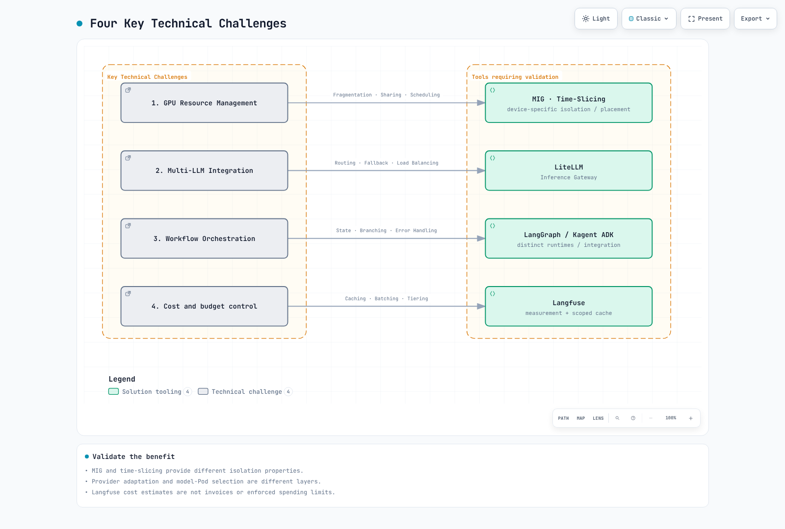
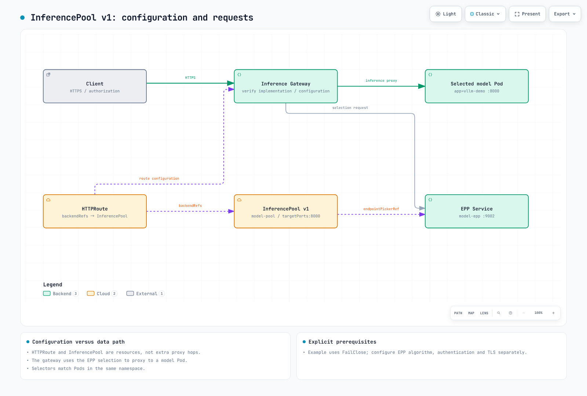
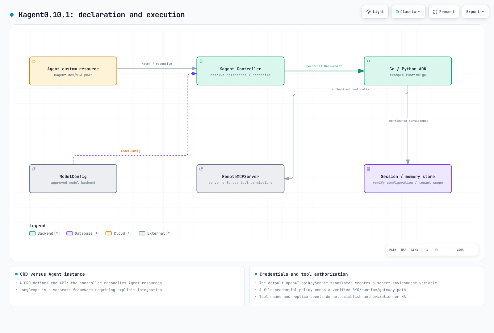

# Construcción de una plataforma de IA agéntica en EKS

> **Base de la revisión**: Kagent 0.10.1 / Gateway Inference Extension 1.6.1 / LangGraph 1.2.11 / Langfuse SDK 4.15.2
> **Última actualización**: September 12, 2026

La IA agéntica va más allá de la simple respuesta a preguntas: crea planes de forma autónoma, usa herramientas y alcanza objetivos de manera iterativa. Este capítulo cubre cómo diseñar una plataforma de IA agéntica y sus límites operativos en EKS.

## 1. Visión general de la plataforma de IA agéntica

### ¿Qué es la IA agéntica?

La IA agéntica es un sistema de IA autónomo con las siguientes características:


[🔍 Ver diagrama interactivo](https://www.atomai.click/kubernetes-docs/archmaps/en-ai-ml-03-agentic-ai-platform-0.html)

1. **Planificación autónoma**: descompone tareas complejas en subtareas y determina el orden de ejecución.
2. **Ejecución basada en herramientas**: utiliza diversas herramientas, incluidas APIs externas, bases de datos y ejecutores de código.
3. **Mejora iterativa**: evalúa los resultados de la ejecución y modifica los planes según sea necesario.
4. **Gestión de estado**: mantiene el estado y la memoria de tareas de larga duración.

### Cuándo elegir Kubernetes

Kubernetes ofrece las siguientes capacidades esenciales para plataformas de IA agéntica:

| Requisito | Solución de Kubernetes |
|-------------|---------------------|
| Orquestación de GPU | Device Plugin, GPU Operator, MIG |
| Escalado automático | HPA, VPA, Karpenter |
| Aislamiento multi-tenant | RBAC, Namespace, NetworkPolicy aplicada, identidad de carga de trabajo |
| Alta disponibilidad | replicas, probes, pruebas de ubicación y recuperación |
| Service Mesh | implementación de gateway/mesh configurada |
| Optimización de costes | Instancias Spot, consolidación de Nodes |

### Cuatro desafíos técnicos clave

Desafíos clave que resolver al construir una plataforma de IA agéntica:



[🔍 Ver diagrama interactivo](https://www.atomai.click/kubernetes-docs/archmaps/en-ai-ml-03-agentic-ai-platform-1.html)

---

## 2. Bases de referencia de GPU y coste

Los agentes que usan APIs de modelos externas no necesitan GPUs necesariamente. La inferencia autoalojada requiere seleccionar el dispositivo según los pesos/la precisión, la caché KV, la concurrencia, la arquitectura de CPU y la compatibilidad de drivers. Use la [guía de GPU revisada](01-ai-ml-workloads.md) y evite instalaciones duplicadas de driver/toolkit en las AMIs NVIDIA de AL2023.

MIG particiona las GPUs compatibles. El time-slicing dentro de una instancia MIG no añade aislamiento de memoria/fallos entre las cargas de trabajo que la comparten; no es un límite de seguridad de software. De igual modo, 80 GB no suelen bastar para pesos FP16 de 70B.

Los values de Helm de GPU Operator son distintos de los recursos ConfigMap/HelmRelease. Pasar un HelmRelease de Flux como helm --values no aplica los ajustes previstos. Las referencias al ConfigMap del MIG manager, las etiquetas de perfil de los nodos y la estrategia del plugin deben coincidir. Las etiquetas de device-plugin.config seleccionan una clave de configuración, no el nombre del ConfigMap. La reconfiguración de MIG puede interrumpir cargas de trabajo y no se ejecutó en esta auditoría.

Los precios requieren contexto de región/SO/modo de compra/fecha y cuotas. La tabla horaria previa sin fuentes y los porcentajes de ahorro fijos no son evidencia de precios actuales. Compare el tiempo total de inactividad de GPU autoalojada, el almacenamiento/la transferencia y el coste de operación y recuperación frente al rendimiento exitoso medido.

## 3. Servicio de modelos (vLLM)

### Arquitectura de vLLM

vLLM ofrece inferencia LLM de alto rendimiento mediante las siguientes tecnologías clave:


[🔍 Ver diagrama interactivo](https://www.atomai.click/kubernetes-docs/archmaps/en-ai-ml-03-agentic-ai-platform-2.html)

### Ruta de servicio revisada

Use la [guía actual de vLLM](02-vllm-deployment.md) para las revisiones de imagen/modelo 0.29.0, las startup probes, el Service privado y las opciones reales de la CLI. Un NodePool de una sola GPU no puede ubicar el antiguo Pod de cuatro GPUs/200Gi. Distinga los grupos TP/PP de las réplicas independientes y calcule las necesidades de memoria.

La caché de prefijos reutiliza prefijos KV compatibles, no respuestas completas. La utilización de memoria de GPU no es únicamente una fracción de la caché KV, y swap-space no está presente en la CLI actual. La desagregación de llm-d no consiste en dos imágenes inventadas de prefill/decode con argumentos de rol; valide el servidor de modelos, el conector KV, el scheduler, el gateway y la combinación de hardware/red de su release real.

## 4. Inference Gateway

### Enrutamiento de cargas de trabajo de IA basado en Gateway API

Extensión de la Gateway API de Kubernetes para enrutar de forma eficiente cargas de trabajo de inferencia de IA.

### Arquitectura Kgateway + InferencePool



[🔍 Ver diagrama interactivo](https://www.atomai.click/kubernetes-docs/archmaps/en-ai-ml-03-agentic-ai-platform-3.html)

#### InferencePool v1

Gateway API y Gateway API Inference Extension son APIs separadas. La extensión 1.6.1 usa inference.networking.k8s.io/v1 con targetPorts y endpointPickerRef. El antiguo CRD EndpointPicker/endpointPickerConfig inventado no corresponde a este esquema.

Este ejemplo verificado contra el esquema requiere el Service de EPP en 9002, Pods de modelo y un controlador de gateway compatible. InferencePool por sí solo no configura autenticación, límites de tasa ni un algoritmo de selección con conocimiento de prefijos.

```yaml
apiVersion: inference.networking.k8s.io/v1
kind: InferencePool
metadata:
  name: model-pool
  namespace: ai-inference
spec:
  selector:
    matchLabels:
      app: vllm-demo
  targetPorts:
    - number: 8000
  endpointPickerRef:
    name: model-epp
    kind: Service
    group: ""
    port:
      number: 9002
    failureMode: FailClose
```

El selector solo coincide con Pods del mismo namespace. EndpointPickerRef toma por defecto una referencia a Service y FailClose. Valide en conjunto el HTTPRoute, la configuración/el soporte de versión de EPP, TLS y el estado del gateway. Las definiciones de la API o la instalación de Kgateway no habilitan todas las capacidades de plugins.

### LiteLLM 1.100.1 como gateway de proveedores

La adaptación de proveedores de LiteLLM y la selección de endpoints de InferencePool son capas distintas. Las APIs de los proveedores difieren en rutas, autenticación, payloads, respuestas y streaming; reenviar JSON de OpenAI sin cambios a un endpoint de Anthropic no es un adaptador válido.

A continuación se muestra la forma actual de fallback del Router. Conecte el command/args del proxy al archivo de configuración real y proporcione por separado Redis/base de datos, credenciales y callbacks donde sea necesario.

```yaml
model_list:
  - model_name: local-primary
    litellm_params:
      model: openai/qwen3-demo
      api_base: http://vllm-demo.ml-inference:8000/v1
  - model_name: local-fallback
    litellm_params:
      model: openai/qwen3-demo
      api_base: http://vllm-secondary.ml-inference:8000/v1
router_settings:
  fallbacks:
    - local-primary: [local-fallback]
  num_retries: 0
```

Esto ilustra la configuración y requiere endpoints y autenticación preparados. Entregue a los clientes de aplicación credenciales con alcance limitado en lugar de la master key. El fallback externo es una ruta de salida de datos: aplique la política de proveedor/datos del tenant antes de enrutar. Un nombre de modelo seleccionado o una cabecera del cliente no deben eludirla.


## 5. Datos de RAG y límites de recuperación

La release de Milvus más reciente inspeccionada es la 3.0.1; el Operator 1.3.9 revisado por separado usa por defecto Milvus 2.6.11. No son una misma versión, y una tabla de compatibilidad amplia no prueba una actualización 3.x probada. El repositorio del operator es https://zilliztech.github.io/milvus-operator/, distinto del repositorio del chart ordinario de Milvus.

Las dimensiones de los vectores deben coincidir con la salida real del embedding. Registre la revisión, las opciones de dimensiones, el tokenizador, la normalización y la métrica de distancia tanto para la ingesta como para las consultas. Los parámetros de índice difieren; M/efConstruction de HNSW no pueden reutilizarse sin más para GPU_IVF_FLAT. La indexación por GPU necesita imágenes, versión, dispositivos y roles de componentes compatibles; solicitar una GPU en indexNode no supone aceleración automática.

Un campo tenant_id por sí solo no impone aislamiento. Derive el alcance de la identidad autenticada, aplique filtros de recuperación en el servidor y valide los documentos devueltos. Gestione también el borrado/cambio de documentos y el ciclo de vida de las versiones de embeddings.

### Chunking y búsqueda híbrida

Las importaciones actuales del splitter usan langchain_text_splitters. El chunk_size de RecursiveCharacterTextSplitter se expresa por defecto en caracteres, no en tokens. La división por tokens debe coincidir con el tokenizador del modelo de embedding y con su límite real de entrada. El chunking semántico añade llamadas/coste de embeddings y no garantiza mejor calidad.

La búsqueda híbrida requiere fusión, como RRF o puntuaciones calibradas, no simplemente dos búsquedas, con filtros de autorización idénticos. Evalúe recall, precisión y latencia. Acote los reintentos y abstenga la respuesta cuando falte evidencia, en lugar de generar siempre tras agotar los reintentos.


## 6. Despliegue de agentes de IA (Kagent)

### Visión general de Kagent

Kagent es una herramienta nativa de Kubernetes para la gestión del ciclo de vida de agentes de IA.



[🔍 Ver diagrama interactivo](https://www.atomai.click/kubernetes-docs/archmaps/en-ai-ml-03-agentic-ai-platform-4.html)

### API de Agent de Kagent 0.10.1

Kagent no se limita a la ejecución automática de kubectl. Los agentes declarativos usan runtimes ADK de Go/Python; BYO aloja un agente A2A proporcionado por el usuario. LangGraph es un framework de workflows integrado por separado, no el mismo runtime que Kagent.

Este Agent referencia recursos ModelConfig y RemoteMCPServer aprobados/configurados por separado en el mismo namespace. Proporcione el servicio MCP real, la herramienta search_documents, la autenticación, TLS y los permisos de datos. No crea la herramienta ni concede acceso de escritura a Kubernetes.

```yaml
apiVersion: kagent.dev/v1alpha2
kind: Agent
metadata:
  name: research-agent
  namespace: ai-agents
spec:
  type: Declarative
  description: Retrieves authorized documents and cites their sources
  declarative:
    runtime: go
    modelConfig: approved-internal-model
    systemMessage: 'Use approved document tools. Cite retrieved sources.

      If evidence is missing, say so. Do not execute arbitrary code.

      '
    tools:
    - type: McpServer
      mcpServer:
        apiGroup: kagent.dev
        kind: RemoteMCPServer
        name: document-tools
        toolNames:
        - search_documents
    deployment:
      replicas: 1
      resources:
        requests:
          cpu: 250m
          memory: 256Mi
        limits:
          cpu: '1'
          memory: 1Gi
```

ModelConfig.apiKeySecret no implica entrega por archivo. El traductor de OpenAI inspeccionado crea una variable de entorno SecretKeyRef OPENAI_API_KEY. Bajo una política de no usar secretos en el entorno, utilice en su lugar una ruta verificada de BYO/runtime con credenciales en archivo o un gateway de autenticación. Habilitar apiKeyPassthrough sin un diseño de delegación de tokens/audiencia no es un sustituto.

Una calculadora con eval() y campos de permisos inventados no son límites de seguridad. Implemente el mínimo privilegio, la validación de entradas, los límites de recursos, la aprobación y la idempotencia en el servidor de herramientas real. Las réplicas del agente no hacen automáticamente que los almacenes compartidos de memoria/sesión sean de alta disponibilidad.

### Flujo de control ejecutable de LangGraph

Este ejemplo local usa el SDK real con callbacks explícitos de retrieve/rewrite/generate. Su demo no llama a un LLM ni a una base de datos vectorial. Conserva la pregunta original, limita las reescrituras a dos y se abstiene si no hay documentos. El context manager de SQLite se usa correctamente y el estado persistido se comprobó tras reabrirlo.

```python
from typing import Callable, TypedDict
from langgraph.graph import StateGraph, START, END
from langgraph.checkpoint.sqlite import SqliteSaver


class QAState(TypedDict):
    question: str
    search_query: str
    documents: list[str]
    answer: str
    retries: int


def build_graph(retrieve: Callable[[str], list[str]],
                rewrite: Callable[[str], str],
                generate: Callable[[str, list[str]], str]):
    def search(state: QAState):
        return {"documents": retrieve(state["search_query"])}

    def route(state: QAState):
        if state["documents"]:
            return "answer"
        return "rewrite" if state["retries"] < 2 else "abstain"

    def rewrite_query(state: QAState):
        return {"search_query": rewrite(state["search_query"]),
                "retries": state["retries"] + 1}

    def answer(state: QAState):
        return {"answer": generate(state["question"], state["documents"])}

    def abstain(state: QAState):
        return {"answer": "No supporting documents were found."}

    graph = StateGraph(QAState)
    graph.add_node("retrieve", search)
    graph.add_node("rewrite", rewrite_query)
    graph.add_node("answer", answer)
    graph.add_node("abstain", abstain)
    graph.add_edge(START, "retrieve")
    graph.add_conditional_edges("retrieve", route,
                               {"answer": "answer", "rewrite": "rewrite", "abstain": "abstain"})
    graph.add_edge("rewrite", "retrieve")
    graph.add_edge("answer", END)
    graph.add_edge("abstain", END)
    return graph


if __name__ == "__main__":
    # Deterministic local fixtures, not a vector database or LLM quality test.
    graph = build_graph(
        retrieve=lambda query: ["A Pod groups containers."] if query == "pod" else [],
        rewrite=lambda query: "pod",
        generate=lambda question, documents: documents[0],
    )
    initial = {"question": "What is a Pod?", "search_query": "unknown",
               "documents": [], "answer": "", "retries": 0}
    # Server-derived authorized tenant/session identity is required in a real app.
    config = {"configurable": {"thread_id": "tenant-a/session-1"}, "recursion_limit": 12}
    with SqliteSaver.from_conn_string("agent-state.sqlite") as saver:
        app = graph.compile(checkpointer=saver)
        print(app.invoke(initial, config)["answer"])
        print(app.get_state(config).values["retries"])
```

En producción, thread_id debe estar vinculado a la identidad autenticada de tenant/sesión, con controles de autorización, cifrado, concurrencia y retención en la base de datos. :memory: no sobrevive a la salida del proceso. SqliteSaver no puede usar un DSN de PostgreSQL; use el saver de Postgres adecuado. Leer get_state_history() por sí solo no restaura la ejecución: use la configuración de checkpoints y la semántica real de reanudación/repetición.

Valide la salida del supervisor contra un enum permitido y gestione los valores desconocidos y el agotamiento del presupuesto. La subcadena COMPLETE no debe hacer que INCOMPLETE se trate como éxito. Pedir a un modelo que use una herramienta no ejecuta ni verifica por sí mismo esa herramienta.

## 7. Langfuse y observabilidad operativa

El SDK 4.15.2 de Langfuse sustituye las antiguas APIs trace()/generation() por start_as_current_observation(), create_score() y métodos relacionados. Esta auditoría verificó tres spans de recuperación/generación/padre en una misma traza usando un exportador en memoria, no la ingesta/el almacenamiento/la autenticación de un servidor real.

```python
from pathlib import Path
from langfuse import Langfuse

# Read existing Secret-volume files; do not put credentials in source.
client = Langfuse(
    public_key=Path("/run/secrets/langfuse/public-key").read_text().strip(),
    secret_key=Path("/run/secrets/langfuse/secret-key").read_text().strip(),
    base_url="https://langfuse.example.internal",
)
with client.start_as_current_observation(name="rag", as_type="span"):
    with client.start_as_current_observation(name="retrieve", as_type="span") as span:
        span.update(metadata={"document_count": 2})
    with client.start_as_current_observation(name="generate", as_type="generation",
                                           model="prepared-model-alias") as generation:
        # Supply actual provider usage; these values only illustrate the shape.
        generation.update(usage_details={"input": 10, "output": 5})
client.flush()
client.shutdown()
```

El chart 2.1.0 de Langfuse referencia la app 4.24.0, distinta del servidor 4.35.0 más reciente inspeccionado. Se requieren web/worker, PostgreSQL, Redis/Valkey, almacenamiento de objetos y ClickHouse. El chart comprueba los prerrequisitos de ClickHouse Operator/cert-manager. El renderizado offline aportó información simulada de capacidades de la API, no un operator desplegado. Los charts por defecto incluyen la entrega de secretos por entorno y no son despliegues aprobados con credenciales solo en archivo.

FB_USED de DCGM es una cantidad, no un porcentaje; verifique las unidades y la memoria total. Una utilización de GPU del 80% o una temperatura de 85C no son umbrales universales de salud. Observe en conjunto la latencia/las colas/los errores/el throttling y los límites reales del dispositivo.

### Cachés de respuestas y coste

Las claves de caché deben capturar el alcance de tenant/autorización, la revisión del modelo/prompt/datos recuperados, los ajustes de generación y el estado relevante de las herramientas. Claves compartidas de modelo+prompt pueden reutilizar el resultado de otro usuario. Deshabilite el caché o defina expiración/invalidación explícitas para estado externo privado o cambiante.

Las estimaciones de precio por token no son facturas. Incluya lecturas/escrituras de caché, lotes, reintentos, llamadas de enrutamiento y los costes fijos del autoalojamiento. Rechace un fallback al modelo más barato que viole el presupuesto, la calidad o la política del proveedor. Un trigger cron de KEDA no impone un límite nocturno inferior sobre otros triggers. Defina la zona horaria del CronJob, la concurrencia/el deadline/los reintentos y los resultados persistidos.


## 8. Evaluación y gestión de la calidad

Ragas 0.4.3 falló al importarse con langchain-community 0.4.2 resuelto, porque importa un módulo vertexai eliminado. En un entorno separado fijado a langchain 0.3.27, core 0.3.79, community 0.3.31 y la integración de openai 0.3.35, las importaciones y la construcción de SingleTurnSample/EvaluationDataset pasaron. No asuma que esto comparte una única pila de dependencias con el LangGraph actual.

Las APIs actuales de la colección, como Faithfulness/AnswerRelevancy, requieren adaptadores explícitos de LLM/embeddings; las antiguas importaciones singleton de ragas.metrics emiten avisos de obsolescencia. La evaluación necesita gestión de coste/fallos de las llamadas al modelo, revisiones de dataset/juez/prompt y tratamiento de valores ausentes/NaN. Aquí solo se probaron las importaciones/el esquema de métricas; no se midió ninguna puntuación de calidad como 0.92.

Un ConfigMap de A/B por sí solo no enruta tráfico. Implemente su consumidor/controlador real, una asignación estable, un contexto equivalente de autorización/datos, muestras suficientes y métricas de guardrail. Tablas arbitrarias de calidad/precios de modelos no acreditan ahorros del 30–50%.

La función compliance_check de un ejemplo financiero no certifica el cumplimiento normativo. Diseñe el alcance de cuentas autenticado, condiciones sensibles/de aprobación monótonas (no sobrescriba después true con false), idempotencia de efectos secundarios, auditoría y criterios de traspaso a una persona.


## 9. Bases de la revisión y alcance de la validación

| Componente | Base de referencia | Alcance verificado |
| --- | --- | --- |
| Kagent |0.10.1 / v1alpha2 | Helm/CRDs oficiales y esquemas de Agent/ModelConfig/RemoteMCPServer |
| Inference Extension |1.6.1 / v1 | Esquema de InferencePool; sin EPP/gateway en vivo |
| LiteLLM |1.100.1 | Configuración de fallback del Router; sin llamada a proveedor |
| Milvus | servidor/SDK3.0.1; Operator 1.3.9 | Helm del Operator/esquema vectorial sintético; sin base de datos |
| LangGraph |1.2.11 + sqlite saver 3.1.1 | Recuperación acotada, abstención y recuperación de estado |
| Langfuse | SDK 4.15.2 / chart 2.1.0 | Trazas/spans locales e inspección offline del chart |
| Ragas |0.4.3 | Importaciones/esquema aislados compatibles; sin llamadas al modelo evaluador |

Los esquemas, Helm y las comprobaciones locales del SDK no prueban el despliegue completo de la plataforma, la autenticación, la HA ni el rendimiento de GPU. No se usaron recursos en la nube ni llamadas de pago a modelos.

## 10. Próximos pasos

### Cuestionario de práctica

Para verificar su comprensión de la plataforma de IA agéntica, realice el siguiente cuestionario:
- [Cuestionario sobre la plataforma de IA agéntica](../quizzes/ai-ml/08-agentic-ai-platform-quiz.md)

### Documentos relacionados

- [Guía detallada de despliegue de vLLM](./02-vllm-deployment.md) - Instalación y optimización detalladas de vLLM
- [Cargas de trabajo AI/ML](./01-ai-ml-workloads.md) - Gestión de cargas de trabajo AI/ML en Kubernetes

### Referencias

- [Kagent 0.10.1](https://github.com/kagent-dev/kagent/tree/v0.10.1)
- [InferencePool v1 API](https://github.com/kubernetes-sigs/gateway-api-inference-extension/blob/v1.6.1/api/v1/inferencepool_types.go)
- [Milvus Operator 1.3.9](https://github.com/zilliztech/milvus-operator/tree/milvus-operator-1.3.9)
- [Langfuse SDK 4.15.2](https://github.com/langfuse/langfuse-python/tree/v4.15.2)
- [Langfuse Helm2.1.0](https://github.com/langfuse/langfuse-k8s/releases/tag/langfuse-2.1.0)
- [LangGraph persistence](https://docs.langchain.com/oss/python/langgraph/persistence)
- [LiteLLM Router](https://docs.litellm.ai/docs/routing)
- [Ragas 0.4.3](https://pypi.org/project/ragas/0.4.3/)
