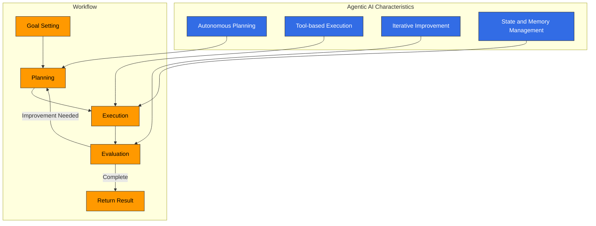
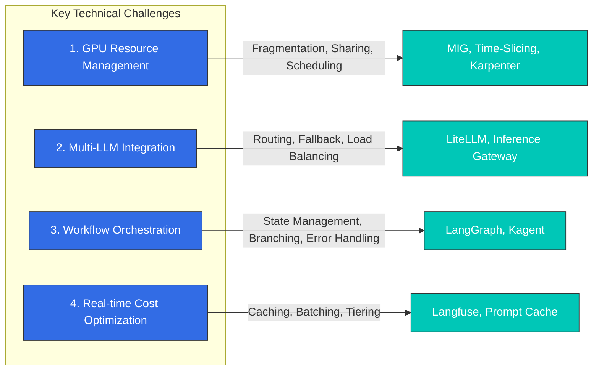
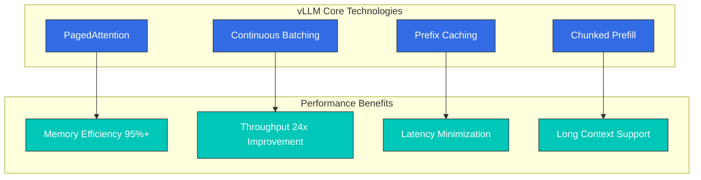
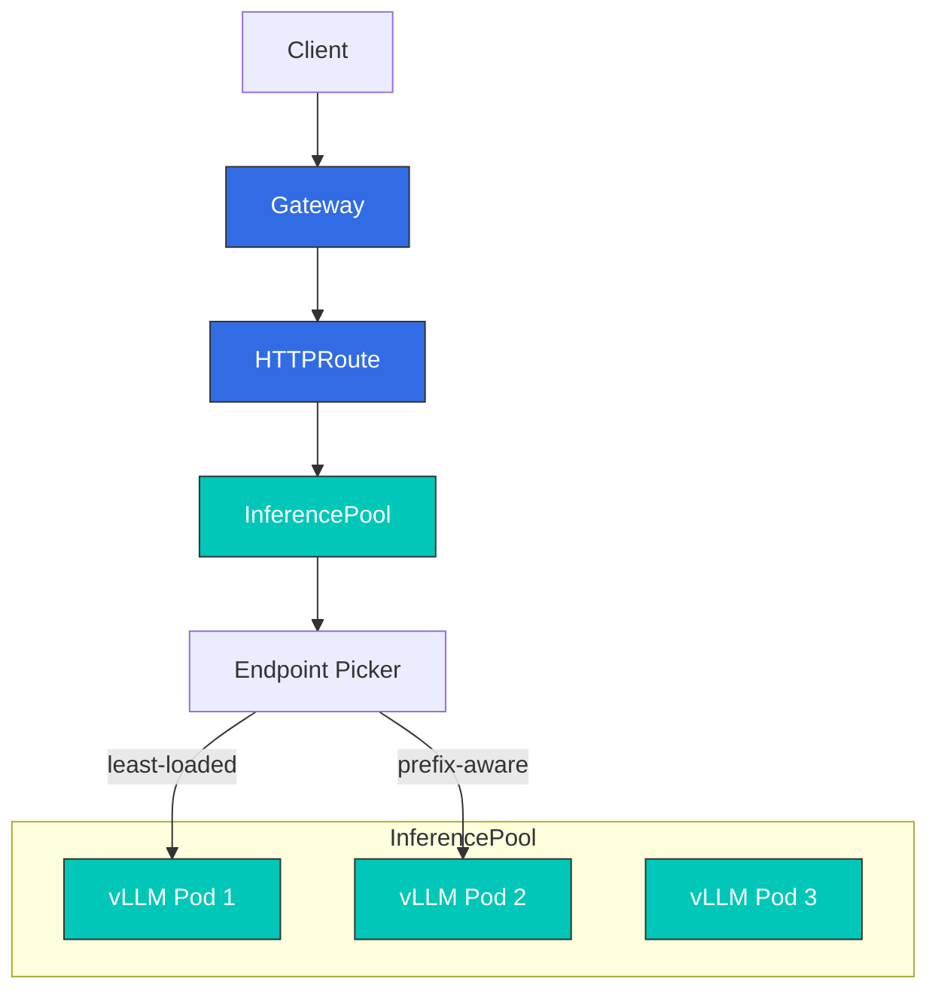
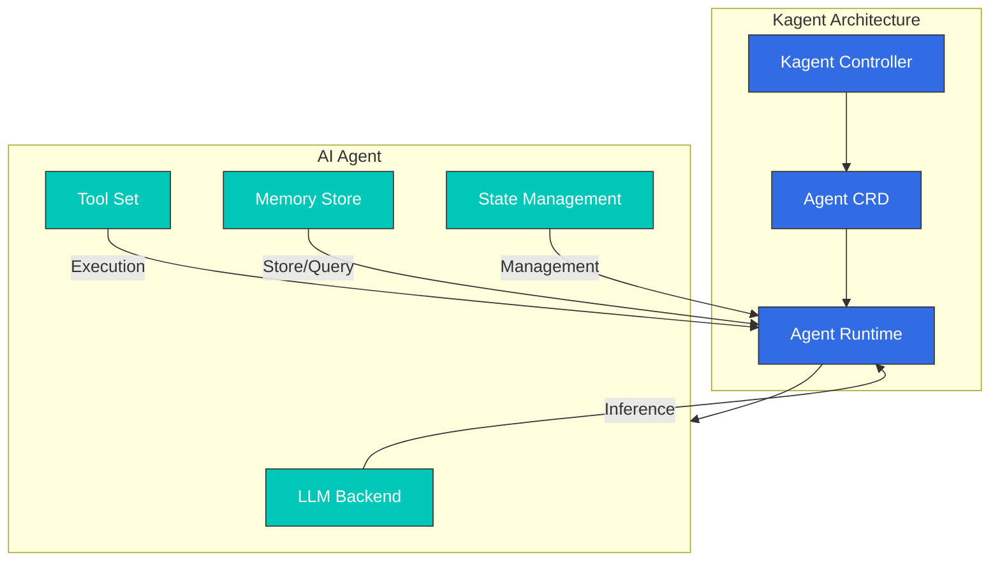

# Building an Agentic AI Platform on EKS

> **Versiones compatibles**: EKS 1.31+, vLLM 0.6+, Karpenter 1.0+
> **Última actualización**: February 23, 2026

La Agentic AI va más allá de las respuestas simples a preguntas: crea planes de forma autónoma, usa herramientas y alcanza objetivos de manera iterativa. Este capítulo cubre cómo construir una plataforma de Agentic AI de nivel de producción en EKS.

## 1. Agentic AI Platform Overview

### What is Agentic AI?

La Agentic AI es un sistema de IA autónomo con las siguientes características:



1. **Planificación autónoma**: Descompone tareas complejas en subtareas y determina el orden de ejecución.
2. **Ejecución basada en herramientas**: Utiliza varias herramientas, incluidas API externas, bases de datos y ejecutores de código.
3. **Mejora iterativa**: Evalúa los resultados de ejecución y modifica los planes según sea necesario.
4. **Gestión de estado**: Mantiene estado y memoria para tareas de larga duración.

### Why Kubernetes is Needed

Kubernetes proporciona las siguientes capacidades principales para plataformas de Agentic AI:

| Requirement | Kubernetes Solution |
|-------------|---------------------|
| GPU Orchestration | Device Plugin, GPU Operator, MIG |
| Auto Scaling | HPA, VPA, Karpenter |
| Multi-tenant Isolation | Namespace, NetworkPolicy, ResourceQuota |
| High Availability | ReplicaSet, PodDisruptionBudget |
| Service Mesh | Istio, Gateway API |
| Cost Optimization | Spot instances, Node consolidation |

### Four Key Technical Challenges

Desafíos clave que se deben resolver al construir una plataforma de Agentic AI:



---

## 2. GPU Infrastructure Configuration

### GPU Instance Type Comparison

Principales tipos de instancias GPU disponibles en AWS:

| Instance | GPU | GPU Memory | Use Case | Hourly Cost (On-Demand) |
|----------|-----|------------|----------|------------------------|
| **p5.48xlarge** | 8x H100 | 640GB | Large-scale training, very large model inference | ~$98.32 |
| **p4d.24xlarge** | 8x A100 | 320GB | Distributed training, 70B+ model inference | ~$32.77 |
| **g5.xlarge** | 1x A10G | 24GB | Small-medium model inference | ~$1.01 |
| **g5.48xlarge** | 8x A10G | 192GB | Multi-model serving | ~$16.29 |
| **g6.xlarge** | 1x L4 | 24GB | Cost-effective inference | ~$0.80 |
| **g6.48xlarge** | 8x L4 | 192GB | Large-scale inference cluster | ~$13.35 |
| **inf2.xlarge** | 1x Inferentia2 | 32GB | AWS-optimized inference | ~$0.76 |

### Multi-Instance GPU (MIG) Configuration

Las GPU NVIDIA A100/H100 se pueden particionar físicamente mediante MIG para aislar múltiples cargas de trabajo.

#### MIG Profiles (A100 80GB Reference)

| Profile | GPU Memory | SM Count | Use Case |
|---------|-----------|----------|----------|
| 1g.10gb | 10GB | 14 | Small model inference, development |
| 2g.20gb | 20GB | 28 | 7B model inference |
| 3g.40gb | 40GB | 42 | 13B model inference |
| 4g.40gb | 40GB | 56 | Large batch inference |
| 7g.80gb | 80GB | 98 | 70B model, training |

#### NVIDIA GPU Operator Deployment

```yaml
# gpu-operator-values.yaml
apiVersion: v1
kind: ConfigMap
metadata:
  name: gpu-operator-config
  namespace: gpu-operator
data:
  mig.strategy: "mixed"  # single or mixed
---
apiVersion: helm.toolkit.fluxcd.io/v2
kind: HelmRelease
metadata:
  name: gpu-operator
  namespace: gpu-operator
spec:
  interval: 10m
  chart:
    spec:
      chart: gpu-operator
      version: "v24.9.0"
      sourceRef:
        kind: HelmRepository
        name: nvidia
        namespace: flux-system
  values:
    operator:
      defaultRuntime: containerd
    mig:
      strategy: mixed
    devicePlugin:
      enabled: true
      config:
        name: time-slicing-config
        default: any
    gfd:
      enabled: true
    dcgmExporter:
      enabled: true
      serviceMonitor:
        enabled: true
```

```bash
# GPU Operator installation
helm repo add nvidia https://helm.ngc.nvidia.com/nvidia
helm repo update

helm install gpu-operator nvidia/gpu-operator \
  --namespace gpu-operator \
  --create-namespace \
  --values gpu-operator-values.yaml

# Check MIG configuration
kubectl get nodes -l nvidia.com/mig.capable=true \
  -o jsonpath='{range .items[*]}{.metadata.name}: {.status.allocatable}{"\n"}{end}'
```

#### MIG Partition Configuration

```yaml
# mig-config.yaml
apiVersion: v1
kind: ConfigMap
metadata:
  name: mig-parted-config
  namespace: gpu-operator
data:
  config.yaml: |
    version: v1
    mig-configs:
      # Development environment: Small partitions for many users
      development:
        - devices: [0]
          mig-enabled: true
          mig-devices:
            "1g.10gb": 7

      # Production: Medium-sized partitions
      production-inference:
        - devices: [0]
          mig-enabled: true
          mig-devices:
            "2g.20gb": 3
            "1g.10gb": 1

      # Large models: Full GPU usage
      large-model:
        - devices: [0]
          mig-enabled: true
          mig-devices:
            "7g.80gb": 1
```

### Time-Slicing Configuration

Para las GPU que no admiten MIG (A10G, L4, etc.), Time-Slicing permite compartir GPU.

```yaml
# time-slicing-config.yaml
apiVersion: v1
kind: ConfigMap
metadata:
  name: time-slicing-config
  namespace: gpu-operator
data:
  any: |
    version: v1
    flags:
      migStrategy: none
    sharing:
      timeSlicing:
        renameByDefault: false
        failRequestsGreaterThanOne: false
        resources:
          - name: nvidia.com/gpu
            replicas: 4  # Split one GPU into 4
---
# Apply Time-Slicing to node
apiVersion: v1
kind: Node
metadata:
  name: gpu-node-1
  labels:
    nvidia.com/device-plugin.config: time-slicing-config
```

#### MIG vs Time-Slicing Comparison

| Characteristic | MIG | Time-Slicing |
|----------------|-----|--------------|
| **Isolation Level** | Hardware isolation (memory, SM) | Software isolation (time division) |
| **Supported GPUs** | A100, H100 | All NVIDIA GPUs |
| **Memory Guarantee** | Guaranteed | Shared (contention possible) |
| **Overhead** | Low | Context switching overhead |
| **Flexibility** | Requires reconfiguration | Dynamically adjustable |
| **Use Cases** | Production, multi-tenant | Development, batch processing |

### Karpenter NodePool Configuration

```yaml
# gpu-nodepool.yaml
apiVersion: karpenter.sh/v1
kind: NodePool
metadata:
  name: gpu-inference
spec:
  template:
    metadata:
      labels:
        workload-type: inference
    spec:
      requirements:
        - key: kubernetes.io/arch
          operator: In
          values: ["amd64"]
        - key: karpenter.sh/capacity-type
          operator: In
          values: ["on-demand", "spot"]
        - key: node.kubernetes.io/instance-type
          operator: In
          values:
            - g5.xlarge
            - g5.2xlarge
            - g5.4xlarge
            - g6.xlarge
            - g6.2xlarge
        - key: "karpenter.k8s.aws/instance-gpu-count"
          operator: Gt
          values: ["0"]
      nodeClassRef:
        group: karpenter.k8s.aws
        kind: EC2NodeClass
        name: gpu-nodes
      taints:
        - key: nvidia.com/gpu
          value: "true"
          effect: NoSchedule
  limits:
    nvidia.com/gpu: 100
  disruption:
    consolidationPolicy: WhenEmptyOrUnderutilized
    consolidateAfter: 5m
    budgets:
      - nodes: "20%"
---
apiVersion: karpenter.k8s.aws/v1
kind: EC2NodeClass
metadata:
  name: gpu-nodes
spec:
  amiFamily: AL2023
  role: KarpenterNodeRole-${CLUSTER_NAME}
  subnetSelectorTerms:
    - tags:
        karpenter.sh/discovery: ${CLUSTER_NAME}
  securityGroupSelectorTerms:
    - tags:
        karpenter.sh/discovery: ${CLUSTER_NAME}
  blockDeviceMappings:
    - deviceName: /dev/xvda
      ebs:
        volumeSize: 200Gi
        volumeType: gp3
        iops: 10000
        throughput: 500
        deleteOnTermination: true
  tags:
    Environment: production
    Workload: ai-inference
```

---

## 3. Model Serving (vLLM)

### vLLM Architecture

vLLM proporciona inferencia LLM de alto rendimiento mediante las siguientes tecnologías principales:



### vLLM Deployment Configuration

```yaml
# vllm-deployment.yaml
apiVersion: apps/v1
kind: Deployment
metadata:
  name: vllm-llama3-70b
  namespace: ai-inference
  labels:
    app: vllm
    model: llama3-70b
spec:
  replicas: 2
  selector:
    matchLabels:
      app: vllm
      model: llama3-70b
  template:
    metadata:
      labels:
        app: vllm
        model: llama3-70b
    spec:
      nodeSelector:
        workload-type: inference
      tolerations:
        - key: nvidia.com/gpu
          operator: Equal
          value: "true"
          effect: NoSchedule
      containers:
        - name: vllm
          image: vllm/vllm-openai:v0.6.4
          ports:
            - containerPort: 8000
              name: http
          env:
            - name: HUGGING_FACE_HUB_TOKEN
              valueFrom:
                secretKeyRef:
                  name: huggingface-token
                  key: token
            - name: VLLM_ATTENTION_BACKEND
              value: "FLASH_ATTN"
          args:
            - "--model"
            - "meta-llama/Meta-Llama-3-70B-Instruct"
            - "--tensor-parallel-size"
            - "4"
            - "--gpu-memory-utilization"
            - "0.95"
            - "--max-model-len"
            - "8192"
            - "--enable-prefix-caching"
            - "--enable-chunked-prefill"
            - "--max-num-batched-tokens"
            - "32768"
            - "--trust-remote-code"
          resources:
            requests:
              nvidia.com/gpu: 4
              memory: "200Gi"
              cpu: "32"
            limits:
              nvidia.com/gpu: 4
              memory: "250Gi"
              cpu: "48"
          readinessProbe:
            httpGet:
              path: /health
              port: 8000
            initialDelaySeconds: 300
            periodSeconds: 10
            timeoutSeconds: 5
            failureThreshold: 3
          livenessProbe:
            httpGet:
              path: /health
              port: 8000
            initialDelaySeconds: 600
            periodSeconds: 30
            timeoutSeconds: 10
            failureThreshold: 3
          volumeMounts:
            - name: model-cache
              mountPath: /root/.cache/huggingface
            - name: shm
              mountPath: /dev/shm
      volumes:
        - name: model-cache
          persistentVolumeClaim:
            claimName: model-cache-pvc
        - name: shm
          emptyDir:
            medium: Memory
            sizeLimit: 64Gi
---
apiVersion: v1
kind: Service
metadata:
  name: vllm-llama3-70b
  namespace: ai-inference
spec:
  selector:
    app: vllm
    model: llama3-70b
  ports:
    - port: 8000
      targetPort: 8000
      name: http
  type: ClusterIP
```

### Performance Optimization Settings

#### Tensor Parallelism

Distribución de modelos grandes entre múltiples GPU:

```yaml
# Recommended settings by model size
# 7B model: 1 GPU
# 13B model: 1-2 GPU
# 70B model: 4 GPU (A100) or 8 GPU (A10G)
# 405B model: 8 GPU (H100)

args:
  - "--tensor-parallel-size"
  - "4"  # Adjust to match GPU count
```

#### KV Cache Management

```yaml
args:
  # Allocate 95% of GPU memory to KV cache
  - "--gpu-memory-utilization"
  - "0.95"

  # Block size setting (default: 16)
  - "--block-size"
  - "16"

  # Swap space setting (CPU memory)
  - "--swap-space"
  - "32"  # In GB
```

#### Prefix Caching

Cache para prompts de sistema repetidos:

```yaml
args:
  - "--enable-prefix-caching"

# Effect: Reduces Time To First Token (TTFT) by 50-80%
# for requests using identical system prompts
```

#### Chunked Prefill

Optimización del procesamiento de contextos largos:

```yaml
args:
  - "--enable-chunked-prefill"
  - "--max-num-batched-tokens"
  - "32768"

# Effect: Stabilizes response latency for workloads
# with mixed long and short prompts
```

### Model Serving Patterns

#### Single Model Pod

```yaml
# Simplest pattern: One Pod serving one model
spec:
  containers:
    - name: vllm
      args:
        - "--model"
        - "meta-llama/Meta-Llama-3-8B-Instruct"
```

#### Disaggregated Serving with llm-d

Separación de Prefill y Decode para optimización:

```yaml
# llm-d-prefill.yaml
apiVersion: apps/v1
kind: Deployment
metadata:
  name: llm-d-prefill
spec:
  replicas: 2
  template:
    spec:
      containers:
        - name: llm-d
          image: llm-d/prefill:latest
          args:
            - "--role"
            - "prefill"
            - "--model"
            - "meta-llama/Meta-Llama-3-70B-Instruct"
          resources:
            requests:
              nvidia.com/gpu: 4
---
# llm-d-decode.yaml
apiVersion: apps/v1
kind: Deployment
metadata:
  name: llm-d-decode
spec:
  replicas: 4
  template:
    spec:
      containers:
        - name: llm-d
          image: llm-d/decode:latest
          args:
            - "--role"
            - "decode"
            - "--prefill-endpoint"
            - "http://llm-d-prefill:8000"
          resources:
            requests:
              nvidia.com/gpu: 2
```

---

## 4. Inference Gateway

### Gateway API-based AI Workload Routing

Extensión de Kubernetes Gateway API para enrutar de forma eficiente cargas de trabajo de inferencia de IA.

### Kgateway + InferencePool Architecture



#### InferencePool CRD

```yaml
# inferencepool.yaml
apiVersion: inference.networking.x-k8s.io/v1alpha1
kind: InferencePool
metadata:
  name: llama3-pool
  namespace: ai-inference
spec:
  targetPortNumber: 8000
  selector:
    matchLabels:
      app: vllm
      model: llama3-70b
  endpointPickerConfig:
    # Load balancing strategy
    extensionRef:
      name: prefix-aware-picker
      group: inference.networking.x-k8s.io
      kind: EndpointPicker
---
apiVersion: inference.networking.x-k8s.io/v1alpha1
kind: EndpointPicker
metadata:
  name: prefix-aware-picker
  namespace: ai-inference
spec:
  type: PrefixAware
  config:
    # Prefix cache hit rate optimization
    prefixHashBuckets: 1024
    fallbackStrategy: LeastLoaded
    loadMetric: pending_requests
---
apiVersion: gateway.networking.k8s.io/v1
kind: HTTPRoute
metadata:
  name: llama3-route
  namespace: ai-inference
spec:
  parentRefs:
    - name: ai-gateway
      namespace: ai-inference
  rules:
    - matches:
        - path:
            type: PathPrefix
            value: /v1/chat/completions
          headers:
            - name: x-model
              value: llama3-70b
      backendRefs:
        - group: inference.networking.x-k8s.io
          kind: InferencePool
          name: llama3-pool
          port: 8000
```

### LiteLLM Integrated Gateway

LiteLLM unifica varios proveedores de LLM bajo una única API.

```yaml
# litellm-deployment.yaml
apiVersion: apps/v1
kind: Deployment
metadata:
  name: litellm-gateway
  namespace: ai-gateway
spec:
  replicas: 3
  selector:
    matchLabels:
      app: litellm
  template:
    metadata:
      labels:
        app: litellm
    spec:
      containers:
        - name: litellm
          image: ghcr.io/berriai/litellm:main-v1.55.0
          ports:
            - containerPort: 4000
          env:
            - name: LITELLM_MASTER_KEY
              valueFrom:
                secretKeyRef:
                  name: litellm-secrets
                  key: master-key
            - name: DATABASE_URL
              valueFrom:
                secretKeyRef:
                  name: litellm-secrets
                  key: database-url
          volumeMounts:
            - name: config
              mountPath: /app/config.yaml
              subPath: config.yaml
          resources:
            requests:
              cpu: "2"
              memory: "4Gi"
            limits:
              cpu: "4"
              memory: "8Gi"
      volumes:
        - name: config
          configMap:
            name: litellm-config
---
apiVersion: v1
kind: ConfigMap
metadata:
  name: litellm-config
  namespace: ai-gateway
data:
  config.yaml: |
    model_list:
      # Internal vLLM endpoints
      - model_name: llama3-70b
        litellm_params:
          model: openai/meta-llama/Meta-Llama-3-70B-Instruct
          api_base: http://vllm-llama3-70b.ai-inference:8000/v1
          api_key: dummy
        model_info:
          max_tokens: 8192
          input_cost_per_token: 0.0000001
          output_cost_per_token: 0.0000003

      - model_name: llama3-8b
        litellm_params:
          model: openai/meta-llama/Meta-Llama-3-8B-Instruct
          api_base: http://vllm-llama3-8b.ai-inference:8000/v1
          api_key: dummy
        model_info:
          max_tokens: 8192
          input_cost_per_token: 0.00000005
          output_cost_per_token: 0.00000015

      # External providers (for fallback)
      - model_name: gpt-4o
        litellm_params:
          model: gpt-4o
          api_key: os.environ/OPENAI_API_KEY
        model_info:
          max_tokens: 128000
          input_cost_per_token: 0.000005
          output_cost_per_token: 0.000015

      - model_name: claude-3-5-sonnet
        litellm_params:
          model: anthropic/claude-3-5-sonnet-20241022
          api_key: os.environ/ANTHROPIC_API_KEY
        model_info:
          max_tokens: 200000
          input_cost_per_token: 0.000003
          output_cost_per_token: 0.000015

    # Routing settings
    router_settings:
      routing_strategy: usage-based-routing-v2
      enable_pre_call_checks: true
      redis_host: redis.ai-gateway
      redis_port: 6379

    # Fallback settings
    litellm_settings:
      fallbacks:
        - model: llama3-70b
          fallback_models:
            - gpt-4o
            - claude-3-5-sonnet

      # Retry settings
      num_retries: 3
      request_timeout: 300

      # Cost tracking
      success_callback: ["langfuse"]
      failure_callback: ["langfuse"]
---
apiVersion: v1
kind: Service
metadata:
  name: litellm-gateway
  namespace: ai-gateway
spec:
  selector:
    app: litellm
  ports:
    - port: 4000
      targetPort: 4000
  type: ClusterIP
```

#### LiteLLM Usage Example

```python
# litellm_client.py
from openai import OpenAI

# Using LiteLLM gateway
client = OpenAI(
    api_key="sk-litellm-master-key",
    base_url="http://litellm-gateway.ai-gateway:4000/v1"
)

# Call internal model (automatic routing)
response = client.chat.completions.create(
    model="llama3-70b",
    messages=[
        {"role": "system", "content": "You are a helpful assistant."},
        {"role": "user", "content": "Explain Kubernetes in simple terms."}
    ],
    max_tokens=500
)

print(response.choices[0].message.content)

# Automatic fallback to external providers if needed
# (llama3-70b failure -> gpt-4o -> claude-3-5-sonnet in order)
```

---

## 5. RAG Data Layer

### Milvus Vector Database

Milvus es una base de datos open-source para búsquedas vectoriales a gran escala.

#### Milvus Operator Deployment

```bash
# Install Milvus Operator
helm repo add milvus https://zilliztech.github.io/milvus-helm
helm repo update

helm install milvus-operator milvus/milvus-operator \
  --namespace milvus-system \
  --create-namespace
```

```yaml
# milvus-cluster.yaml
apiVersion: milvus.io/v1beta1
kind: Milvus
metadata:
  name: milvus-cluster
  namespace: ai-data
spec:
  mode: cluster
  dependencies:
    etcd:
      inCluster:
        values:
          replicaCount: 3
          persistence:
            enabled: true
            size: 50Gi
    pulsar:
      inCluster:
        values:
          components:
            autorecovery: false
          proxy:
            replicaCount: 2
          broker:
            replicaCount: 2
    storage:
      inCluster:
        values:
          mode: distributed
          fullnameOverride: milvus-minio
          persistence:
            enabled: true
            size: 500Gi
  components:
    # Query Node - Vector search processing
    queryNode:
      replicas: 3
      resources:
        requests:
          cpu: "4"
          memory: "16Gi"
        limits:
          cpu: "8"
          memory: "32Gi"

    # Index Node - Index building (GPU accelerated)
    indexNode:
      replicas: 2
      resources:
        requests:
          cpu: "4"
          memory: "16Gi"
          nvidia.com/gpu: 1
        limits:
          cpu: "8"
          memory: "32Gi"
          nvidia.com/gpu: 1

    # Data Node - Data processing
    dataNode:
      replicas: 2
      resources:
        requests:
          cpu: "2"
          memory: "8Gi"
        limits:
          cpu: "4"
          memory: "16Gi"

    # Proxy - API gateway
    proxy:
      replicas: 2
      serviceType: ClusterIP
      resources:
        requests:
          cpu: "2"
          memory: "4Gi"
        limits:
          cpu: "4"
          memory: "8Gi"
  config:
    common:
      gracefulTime: 30000
    queryNode:
      gracefulTime: 30000
```

#### Collection Schema Design

```python
# milvus_schema.py
from pymilvus import (
    connections, Collection, FieldSchema,
    CollectionSchema, DataType, utility
)

# Connect to Milvus
connections.connect(
    alias="default",
    host="milvus-cluster-proxy.ai-data",
    port="19530"
)

# Document collection schema
fields = [
    FieldSchema(name="id", dtype=DataType.VARCHAR, max_length=64, is_primary=True),
    FieldSchema(name="content", dtype=DataType.VARCHAR, max_length=65535),
    FieldSchema(name="embedding", dtype=DataType.FLOAT_VECTOR, dim=1536),
    FieldSchema(name="metadata", dtype=DataType.JSON),
    FieldSchema(name="created_at", dtype=DataType.INT64),
]

schema = CollectionSchema(
    fields=fields,
    description="Document embeddings for RAG"
)

# Create collection
collection = Collection(
    name="documents",
    schema=schema,
    using="default"
)

# Create index
index_params = {
    "metric_type": "COSINE",
    "index_type": "HNSW",  # Or GPU_IVF_FLAT for GPU acceleration
    "params": {
        "M": 16,
        "efConstruction": 256
    }
}

collection.create_index(
    field_name="embedding",
    index_params=index_params
)

# Load collection
collection.load()
```

#### Index Type Comparison

| Index Type | Characteristics | Memory Usage | Search Speed | Use Case |
|-----------|----------------|--------------|--------------|----------|
| **FLAT** | Exact search | High | Slow | Small scale, accuracy priority |
| **IVF_FLAT** | Cluster-based | Medium | Fast | General use |
| **HNSW** | Graph-based | High | Very fast | Large scale, speed priority |
| **GPU_IVF_FLAT** | GPU accelerated | Medium | Very fast | Very large scale, GPU usage |
| **SCANN** | Quantization-based | Low | Fast | Memory-constrained environments |

### Document Ingestion Pipeline

```yaml
# document-ingestion-job.yaml
apiVersion: batch/v1
kind: Job
metadata:
  name: document-ingestion
  namespace: ai-data
spec:
  template:
    spec:
      containers:
        - name: ingestion
          image: ai-platform/document-ingestion:latest
          env:
            - name: S3_BUCKET
              value: "my-documents-bucket"
            - name: MILVUS_HOST
              value: "milvus-cluster-proxy.ai-data"
            - name: EMBEDDING_MODEL
              value: "text-embedding-3-large"
            - name: OPENAI_API_KEY
              valueFrom:
                secretKeyRef:
                  name: openai-credentials
                  key: api-key
          resources:
            requests:
              cpu: "4"
              memory: "16Gi"
            limits:
              cpu: "8"
              memory: "32Gi"
          volumeMounts:
            - name: temp-storage
              mountPath: /tmp/documents
      volumes:
        - name: temp-storage
          emptyDir:
            sizeLimit: 100Gi
      restartPolicy: OnFailure
```

#### Chunking Strategy Implementation

```python
# chunking_strategies.py
from langchain.text_splitter import (
    RecursiveCharacterTextSplitter,
    TokenTextSplitter
)
from langchain_experimental.text_splitter import SemanticChunker
from langchain_openai import OpenAIEmbeddings

# 1. Fixed-size chunking
def fixed_chunking(text: str, chunk_size: int = 1000, overlap: int = 200):
    splitter = RecursiveCharacterTextSplitter(
        chunk_size=chunk_size,
        chunk_overlap=overlap,
        separators=["\n\n", "\n", ".", "!", "?", ",", " ", ""]
    )
    return splitter.split_text(text)

# 2. Token-based chunking (LLM context window optimization)
def token_chunking(text: str, chunk_size: int = 512, overlap: int = 50):
    splitter = TokenTextSplitter(
        encoding_name="cl100k_base",  # GPT-4 tokenizer
        chunk_size=chunk_size,
        chunk_overlap=overlap
    )
    return splitter.split_text(text)

# 3. Semantic chunking (context preservation optimization)
def semantic_chunking(text: str):
    embeddings = OpenAIEmbeddings(model="text-embedding-3-small")
    splitter = SemanticChunker(
        embeddings=embeddings,
        breakpoint_threshold_type="percentile",
        breakpoint_threshold_amount=95
    )
    return splitter.split_text(text)

# Recommendation: Choose strategy by document type
CHUNKING_STRATEGIES = {
    "code": {"strategy": "fixed", "chunk_size": 2000, "overlap": 400},
    "documentation": {"strategy": "semantic"},
    "chat_logs": {"strategy": "fixed", "chunk_size": 500, "overlap": 100},
    "default": {"strategy": "token", "chunk_size": 512, "overlap": 50}
}
```

### RAG Workflow

```python
# rag_workflow.py
from langchain_openai import ChatOpenAI, OpenAIEmbeddings
from langchain_milvus import Milvus
from langchain.chains import RetrievalQA
from langchain.prompts import PromptTemplate

# Vector store connection
embeddings = OpenAIEmbeddings(model="text-embedding-3-large")
vectorstore = Milvus(
    embedding_function=embeddings,
    collection_name="documents",
    connection_args={
        "host": "milvus-cluster-proxy.ai-data",
        "port": "19530"
    }
)

# RAG prompt template
RAG_PROMPT = PromptTemplate(
    template="""Answer the question using the following context.
If you cannot find the answer in the context, say "No information available."

Context:
{context}

Question: {question}

Answer:""",
    input_variables=["context", "question"]
)

# LLM setup (using LiteLLM gateway)
llm = ChatOpenAI(
    model="llama3-70b",
    openai_api_base="http://litellm-gateway.ai-gateway:4000/v1",
    openai_api_key="sk-litellm-master-key",
    temperature=0.1
)

# RAG chain configuration
qa_chain = RetrievalQA.from_chain_type(
    llm=llm,
    chain_type="stuff",
    retriever=vectorstore.as_retriever(
        search_type="mmr",
        search_kwargs={"k": 5, "fetch_k": 20}
    ),
    chain_type_kwargs={"prompt": RAG_PROMPT},
    return_source_documents=True
)

# Execute query
result = qa_chain.invoke({"query": "How does Pod scheduling work in Kubernetes?"})
print(result["result"])
```

---

## 6. AI Agent Deployment (Kagent)

### Kagent Overview

Kagent es una herramienta nativa de Kubernetes para la gestión del ciclo de vida de agentes de IA.



### Agent CRD Definition

```yaml
# agent-crd.yaml
apiVersion: kagent.dev/v1alpha1
kind: Agent
metadata:
  name: research-agent
  namespace: ai-agents
spec:
  # LLM backend settings
  llm:
    provider: litellm
    model: llama3-70b
    endpoint: http://litellm-gateway.ai-gateway:4000/v1
    temperature: 0.7
    maxTokens: 4096

  # Agent system prompt
  systemPrompt: |
    You are a research assistant that helps users find and analyze information.
    You have access to the following tools:
    - web_search: Search the web for information
    - document_search: Search internal documents
    - calculator: Perform calculations

    Always cite your sources and provide accurate information.

  # Tool definitions
  tools:
    - name: web_search
      type: http
      spec:
        url: http://search-api.tools:8080/search
        method: POST
        headers:
          Content-Type: application/json

    - name: document_search
      type: milvus
      spec:
        host: milvus-cluster-proxy.ai-data
        port: 19530
        collection: documents
        topK: 5

    - name: calculator
      type: python
      spec:
        code: |
          def calculate(expression: str) -> str:
              return str(eval(expression))

  # Memory settings
  memory:
    type: redis
    config:
      host: redis.ai-agents
      port: 6379
      ttl: 3600

  # Resource limits
  resources:
    requests:
      cpu: "500m"
      memory: "512Mi"
    limits:
      cpu: "2"
      memory: "2Gi"

  # Scaling settings
  replicas: 2
  autoscaling:
    enabled: true
    minReplicas: 2
    maxReplicas: 10
    targetCPUUtilization: 70
```

### LangGraph Workflow Orchestration

Uso de LangGraph para implementar workflows de IA complejos.

```python
# langgraph_workflow.py
from typing import TypedDict, Annotated, Sequence
from langchain_core.messages import BaseMessage, HumanMessage, AIMessage
from langchain_openai import ChatOpenAI
from langgraph.graph import StateGraph, END
from langgraph.prebuilt import ToolExecutor
import operator

# State definition
class AgentState(TypedDict):
    messages: Annotated[Sequence[BaseMessage], operator.add]
    current_step: str
    iteration: int
    max_iterations: int
    tools_output: dict

# LLM setup
llm = ChatOpenAI(
    model="llama3-70b",
    openai_api_base="http://litellm-gateway.ai-gateway:4000/v1",
    openai_api_key="sk-litellm-master-key"
)

# Node functions
def planner(state: AgentState) -> AgentState:
    """Node that creates task plans"""
    messages = state["messages"]

    planning_prompt = """Based on the user's request, create a step-by-step plan.
    Format your response as a numbered list of steps."""

    response = llm.invoke(messages + [HumanMessage(content=planning_prompt)])

    return {
        "messages": [response],
        "current_step": "execute",
        "iteration": state["iteration"]
    }

def executor(state: AgentState) -> AgentState:
    """Node that executes plans"""
    messages = state["messages"]

    execution_prompt = """Execute the current step of the plan.
    If you need to use a tool, specify the tool and parameters."""

    response = llm.invoke(messages + [HumanMessage(content=execution_prompt)])

    return {
        "messages": [response],
        "current_step": "evaluate",
        "iteration": state["iteration"]
    }

def evaluator(state: AgentState) -> AgentState:
    """Node that evaluates results"""
    messages = state["messages"]

    evaluation_prompt = """Evaluate the execution result.
    Respond with either:
    - COMPLETE: if the task is fully done
    - CONTINUE: if more steps are needed
    - RETRY: if the current step needs to be retried"""

    response = llm.invoke(messages + [HumanMessage(content=evaluation_prompt)])

    return {
        "messages": [response],
        "current_step": "route",
        "iteration": state["iteration"] + 1
    }

def router(state: AgentState) -> str:
    """Router that determines next step"""
    last_message = state["messages"][-1].content.upper()

    if state["iteration"] >= state["max_iterations"]:
        return "end"

    if "COMPLETE" in last_message:
        return "end"
    elif "RETRY" in last_message:
        return "execute"
    else:
        return "plan"

# Graph construction
workflow = StateGraph(AgentState)

# Add nodes
workflow.add_node("plan", planner)
workflow.add_node("execute", executor)
workflow.add_node("evaluate", evaluator)

# Add edges
workflow.set_entry_point("plan")
workflow.add_edge("plan", "execute")
workflow.add_edge("execute", "evaluate")
workflow.add_conditional_edges(
    "evaluate",
    router,
    {
        "plan": "plan",
        "execute": "execute",
        "end": END
    }
)

# Compile graph
app = workflow.compile()

# Execute
initial_state = {
    "messages": [HumanMessage(content="Research the latest trends in Kubernetes security")],
    "current_step": "plan",
    "iteration": 0,
    "max_iterations": 5,
    "tools_output": {}
}

result = app.invoke(initial_state)
```

### Multi-Agent Collaboration Patterns

#### Supervisor Pattern

```python
# supervisor_pattern.py
from langgraph.graph import StateGraph, END
from typing import TypedDict, Literal

class SupervisorState(TypedDict):
    messages: list
    next_agent: str
    task_status: dict

def supervisor(state: SupervisorState) -> SupervisorState:
    """Supervisor that delegates tasks to appropriate agents"""

    supervisor_prompt = """You are a supervisor managing a team of agents:
    - researcher: Finds and analyzes information
    - coder: Writes and reviews code
    - writer: Creates documentation and reports

    Based on the current task, decide which agent should handle it next.
    Respond with the agent name or 'FINISH' if the task is complete."""

    response = llm.invoke(state["messages"] + [HumanMessage(content=supervisor_prompt)])
    next_agent = response.content.strip().lower()

    return {
        "messages": state["messages"] + [response],
        "next_agent": next_agent
    }

def researcher(state: SupervisorState) -> SupervisorState:
    """Information gathering agent"""
    research_response = llm.invoke(
        state["messages"] +
        [HumanMessage(content="Research the topic and provide findings.")]
    )
    return {"messages": state["messages"] + [research_response]}

def coder(state: SupervisorState) -> SupervisorState:
    """Coding agent"""
    code_response = llm.invoke(
        state["messages"] +
        [HumanMessage(content="Write or review code for the task.")]
    )
    return {"messages": state["messages"] + [code_response]}

def writer(state: SupervisorState) -> SupervisorState:
    """Documentation agent"""
    write_response = llm.invoke(
        state["messages"] +
        [HumanMessage(content="Create documentation or a report.")]
    )
    return {"messages": state["messages"] + [write_response]}

def route_to_agent(state: SupervisorState) -> Literal["researcher", "coder", "writer", "end"]:
    next_agent = state["next_agent"]
    if next_agent == "finish":
        return "end"
    return next_agent

# Graph construction
supervisor_graph = StateGraph(SupervisorState)

supervisor_graph.add_node("supervisor", supervisor)
supervisor_graph.add_node("researcher", researcher)
supervisor_graph.add_node("coder", coder)
supervisor_graph.add_node("writer", writer)

supervisor_graph.set_entry_point("supervisor")

supervisor_graph.add_conditional_edges(
    "supervisor",
    route_to_agent,
    {
        "researcher": "researcher",
        "coder": "coder",
        "writer": "writer",
        "end": END
    }
)

# Return to supervisor after each agent completes
for agent in ["researcher", "coder", "writer"]:
    supervisor_graph.add_edge(agent, "supervisor")

multi_agent_app = supervisor_graph.compile()
```

---

## 7. Monitoring and Operations

### Langfuse GenAI Observability

Langfuse es una plataforma de observabilidad para aplicaciones LLM.

```yaml
# langfuse-deployment.yaml
apiVersion: apps/v1
kind: Deployment
metadata:
  name: langfuse
  namespace: ai-monitoring
spec:
  replicas: 2
  selector:
    matchLabels:
      app: langfuse
  template:
    metadata:
      labels:
        app: langfuse
    spec:
      containers:
        - name: langfuse
          image: langfuse/langfuse:latest
          ports:
            - containerPort: 3000
          env:
            - name: DATABASE_URL
              valueFrom:
                secretKeyRef:
                  name: langfuse-secrets
                  key: database-url
            - name: NEXTAUTH_SECRET
              valueFrom:
                secretKeyRef:
                  name: langfuse-secrets
                  key: nextauth-secret
            - name: NEXTAUTH_URL
              value: "https://langfuse.example.com"
            - name: SALT
              valueFrom:
                secretKeyRef:
                  name: langfuse-secrets
                  key: salt
          resources:
            requests:
              cpu: "1"
              memory: "2Gi"
            limits:
              cpu: "2"
              memory: "4Gi"
---
apiVersion: v1
kind: Service
metadata:
  name: langfuse
  namespace: ai-monitoring
spec:
  selector:
    app: langfuse
  ports:
    - port: 3000
      targetPort: 3000
  type: ClusterIP
```

#### Langfuse Integration Code

```python
# langfuse_integration.py
from langfuse import Langfuse
from langfuse.decorators import observe, langfuse_context
from openai import OpenAI

# Initialize Langfuse client
langfuse = Langfuse(
    public_key="pk-lf-xxx",
    secret_key="sk-lf-xxx",
    host="http://langfuse.ai-monitoring:3000"
)

client = OpenAI(
    api_key="sk-litellm-master-key",
    base_url="http://litellm-gateway.ai-gateway:4000/v1"
)

@observe()
def rag_query(user_query: str, user_id: str = None) -> str:
    """Track RAG queries with Langfuse"""

    # Set user ID
    langfuse_context.update_current_trace(
        user_id=user_id,
        tags=["rag", "production"]
    )

    # Document retrieval (tracked as separate span)
    with langfuse_context.observe(name="document_retrieval") as span:
        documents = search_documents(user_query)
        span.update(
            input={"query": user_query},
            output={"doc_count": len(documents)},
            metadata={"retrieval_method": "mmr"}
        )

    # LLM call
    with langfuse_context.observe(name="llm_generation") as span:
        response = client.chat.completions.create(
            model="llama3-70b",
            messages=[
                {"role": "system", "content": "Answer based on the context."},
                {"role": "user", "content": f"Context: {documents}\n\nQuestion: {user_query}"}
            ],
            max_tokens=1000
        )

        answer = response.choices[0].message.content

        # Track token usage and cost
        span.update(
            input={"messages": messages},
            output={"response": answer},
            usage={
                "input": response.usage.prompt_tokens,
                "output": response.usage.completion_tokens,
                "total": response.usage.total_tokens
            },
            metadata={
                "model": "llama3-70b",
                "temperature": 0.7
            }
        )

    return answer

# Collect feedback
def collect_feedback(trace_id: str, score: float, comment: str = None):
    """Record user feedback to Langfuse"""
    langfuse.score(
        trace_id=trace_id,
        name="user_feedback",
        value=score,
        comment=comment
    )
```

### GPU Monitoring (DCGM)

```yaml
# dcgm-exporter.yaml
apiVersion: apps/v1
kind: DaemonSet
metadata:
  name: dcgm-exporter
  namespace: gpu-monitoring
spec:
  selector:
    matchLabels:
      app: dcgm-exporter
  template:
    metadata:
      labels:
        app: dcgm-exporter
    spec:
      nodeSelector:
        nvidia.com/gpu.present: "true"
      tolerations:
        - key: nvidia.com/gpu
          operator: Exists
          effect: NoSchedule
      containers:
        - name: dcgm-exporter
          image: nvcr.io/nvidia/k8s/dcgm-exporter:3.3.5-3.4.0-ubuntu22.04
          ports:
            - containerPort: 9400
              name: metrics
          env:
            - name: DCGM_EXPORTER_LISTEN
              value: ":9400"
            - name: DCGM_EXPORTER_KUBERNETES
              value: "true"
          securityContext:
            privileged: true
          volumeMounts:
            - name: pod-resources
              mountPath: /var/lib/kubelet/pod-resources
      volumes:
        - name: pod-resources
          hostPath:
            path: /var/lib/kubelet/pod-resources
---
apiVersion: v1
kind: Service
metadata:
  name: dcgm-exporter
  namespace: gpu-monitoring
  labels:
    app: dcgm-exporter
spec:
  selector:
    app: dcgm-exporter
  ports:
    - port: 9400
      targetPort: 9400
      name: metrics
  clusterIP: None
---
apiVersion: monitoring.coreos.com/v1
kind: ServiceMonitor
metadata:
  name: dcgm-exporter
  namespace: gpu-monitoring
spec:
  selector:
    matchLabels:
      app: dcgm-exporter
  endpoints:
    - port: metrics
      interval: 15s
```

#### Key GPU Metrics

| Metric | Description | Threshold |
|--------|-------------|-----------|
| `DCGM_FI_DEV_GPU_UTIL` | GPU utilization | > 80% normal |
| `DCGM_FI_DEV_MEM_COPY_UTIL` | Memory bandwidth utilization | > 70% caution |
| `DCGM_FI_DEV_FB_USED` | Frame buffer usage | < 95% recommended |
| `DCGM_FI_DEV_GPU_TEMP` | GPU temperature | < 85C recommended |
| `DCGM_FI_DEV_POWER_USAGE` | Power consumption | Below 90% of TDP |
| `DCGM_FI_DEV_SM_CLOCK` | SM clock speed | Maintain default |

### Cost Optimization Strategies

#### 1. Prompt Caching

```python
# prompt_caching.py
import hashlib
import redis

redis_client = redis.Redis(host="redis.ai-cache", port=6379)

def get_cached_response(prompt: str, model: str) -> str | None:
    """Retrieve cached response"""
    cache_key = hashlib.sha256(f"{model}:{prompt}".encode()).hexdigest()
    cached = redis_client.get(cache_key)
    return cached.decode() if cached else None

def cache_response(prompt: str, model: str, response: str, ttl: int = 3600):
    """Cache response"""
    cache_key = hashlib.sha256(f"{model}:{prompt}".encode()).hexdigest()
    redis_client.setex(cache_key, ttl, response)

def query_with_cache(prompt: str, model: str = "llama3-70b") -> str:
    """Query with caching"""
    # Check cache
    cached = get_cached_response(prompt, model)
    if cached:
        return cached

    # LLM call
    response = client.chat.completions.create(
        model=model,
        messages=[{"role": "user", "content": prompt}]
    )
    result = response.choices[0].message.content

    # Cache result
    cache_response(prompt, model, result)
    return result
```

#### 2. Tiered Model Selection

```python
# tiered_model_selection.py
from enum import Enum

class TaskComplexity(Enum):
    SIMPLE = "simple"      # Classification, extraction, simple QA
    MODERATE = "moderate"  # Summarization, translation, general conversation
    COMPLEX = "complex"    # Analysis, reasoning, code generation

MODEL_TIERS = {
    TaskComplexity.SIMPLE: {
        "model": "llama3-8b",
        "cost_per_1k_tokens": 0.0001
    },
    TaskComplexity.MODERATE: {
        "model": "llama3-70b",
        "cost_per_1k_tokens": 0.0005
    },
    TaskComplexity.COMPLEX: {
        "model": "gpt-4o",
        "cost_per_1k_tokens": 0.01
    }
}

def classify_task_complexity(task: str) -> TaskComplexity:
    """Classify task complexity (using lightweight model)"""
    classification_prompt = f"""Classify the complexity of this task as SIMPLE, MODERATE, or COMPLEX:
    Task: {task}

    SIMPLE: Classification, extraction, simple QA
    MODERATE: Summarization, translation, general conversation
    COMPLEX: Analysis, reasoning, code generation

    Respond with only the classification."""

    response = client.chat.completions.create(
        model="llama3-8b",  # Use small model for classification
        messages=[{"role": "user", "content": classification_prompt}],
        max_tokens=10
    )

    classification = response.choices[0].message.content.strip().upper()
    return TaskComplexity[classification]

def execute_with_optimal_model(task: str) -> str:
    """Execute task with optimal model"""
    complexity = classify_task_complexity(task)
    model_config = MODEL_TIERS[complexity]

    response = client.chat.completions.create(
        model=model_config["model"],
        messages=[{"role": "user", "content": task}]
    )

    return response.choices[0].message.content
```

#### 3. Batch Processing

```yaml
# batch-processing-job.yaml
apiVersion: batch/v1
kind: CronJob
metadata:
  name: batch-inference
  namespace: ai-batch
spec:
  schedule: "0 2 * * *"  # Daily at 2 AM
  jobTemplate:
    spec:
      template:
        spec:
          containers:
            - name: batch-processor
              image: ai-platform/batch-processor:latest
              env:
                - name: BATCH_SIZE
                  value: "100"
                - name: MODEL
                  value: "llama3-70b"
                - name: QUEUE_URL
                  value: "redis://redis.ai-batch:6379/0"
              resources:
                requests:
                  cpu: "4"
                  memory: "8Gi"
          restartPolicy: OnFailure
```

#### 4. Spot Instance Utilization

```yaml
# spot-nodepool.yaml
apiVersion: karpenter.sh/v1
kind: NodePool
metadata:
  name: gpu-spot
spec:
  template:
    spec:
      requirements:
        - key: karpenter.sh/capacity-type
          operator: In
          values: ["spot"]
        - key: node.kubernetes.io/instance-type
          operator: In
          values:
            - g5.xlarge
            - g5.2xlarge
            - g6.xlarge
      taints:
        - key: spot-instance
          value: "true"
          effect: NoSchedule
  limits:
    nvidia.com/gpu: 50
  disruption:
    consolidationPolicy: WhenEmpty
    consolidateAfter: 1m
```

---

## 8. Evaluation and Quality Management

### Ragas Framework

Ragas es un framework para evaluar la calidad de sistemas RAG.

```python
# ragas_evaluation.py
from ragas import evaluate
from ragas.metrics import (
    faithfulness,
    answer_relevancy,
    context_precision,
    context_recall,
    answer_correctness
)
from datasets import Dataset

# Construct evaluation dataset
eval_data = {
    "question": [
        "What is a Kubernetes Pod?",
        "How does HPA work?"
    ],
    "answer": [
        "A Pod is the smallest deployable computing unit in Kubernetes.",
        "HPA automatically adjusts the number of Pods based on CPU utilization."
    ],
    "contexts": [
        ["A Pod is a group of one or more containers.", "Pods have shared storage and network."],
        ["HPA monitors metrics.", "It scales based on configured thresholds."]
    ],
    "ground_truth": [
        "A Pod is the smallest deployable computing unit that can be created and managed in Kubernetes.",
        "HPA automatically adjusts the number of workload replicas based on observed metrics (CPU, memory, etc.)."
    ]
}

dataset = Dataset.from_dict(eval_data)

# Run evaluation
results = evaluate(
    dataset,
    metrics=[
        faithfulness,        # Is the answer faithful to context
        answer_relevancy,    # Is the answer relevant to question
        context_precision,   # Is retrieved context precise
        context_recall,      # Was all necessary context retrieved
        answer_correctness   # Does answer match ground truth
    ]
)

print(results)
# {'faithfulness': 0.92, 'answer_relevancy': 0.88, 'context_precision': 0.85, ...}
```

#### Automated Evaluation Pipeline

```yaml
# ragas-evaluation-cronjob.yaml
apiVersion: batch/v1
kind: CronJob
metadata:
  name: ragas-evaluation
  namespace: ai-qa
spec:
  schedule: "0 6 * * *"  # Daily at 6 AM
  jobTemplate:
    spec:
      template:
        spec:
          containers:
            - name: evaluator
              image: ai-platform/ragas-evaluator:latest
              env:
                - name: EVAL_DATASET_PATH
                  value: "s3://ai-datasets/eval/golden-set.json"
                - name: RAG_ENDPOINT
                  value: "http://rag-api.ai-inference:8000"
                - name: LANGFUSE_HOST
                  value: "http://langfuse.ai-monitoring:3000"
                - name: MIN_FAITHFULNESS
                  value: "0.85"
                - name: MIN_RELEVANCY
                  value: "0.80"
              resources:
                requests:
                  cpu: "2"
                  memory: "4Gi"
          restartPolicy: OnFailure
```

### A/B Testing

```yaml
# ab-testing-config.yaml
apiVersion: v1
kind: ConfigMap
metadata:
  name: ab-testing-config
  namespace: ai-inference
data:
  config.yaml: |
    experiments:
      - name: llama3-70b-vs-gpt4o
        traffic_split:
          variant_a:
            model: llama3-70b
            weight: 80
          variant_b:
            model: gpt-4o
            weight: 20
        metrics:
          - latency_p99
          - user_satisfaction
          - cost_per_query
        duration_days: 14

      - name: chunk-size-experiment
        traffic_split:
          variant_a:
            chunk_size: 512
            weight: 50
          variant_b:
            chunk_size: 1024
            weight: 50
        metrics:
          - context_precision
          - answer_relevancy
        duration_days: 7
```

---

## 9. Core Technology Stack Summary

| Technology | Purpose | Key Features |
|-----------|---------|--------------|
| **Kagent** | AI Agent Lifecycle | CRD-based agent management, auto-scaling |
| **Kgateway** | Inference Gateway | InferencePool, Prefix-aware routing |
| **Milvus** | Vector Database | Large-scale vector search, GPU-accelerated indexing |
| **Ragas** | RAG Evaluation | Faithfulness, relevancy, accuracy metrics |
| **LiteLLM** | LLM Integrated Gateway | Provider abstraction, fallback, cost tracking |
| **LangGraph** | Workflow Orchestration | State management, conditional branching, error handling |
| **Langfuse** | GenAI Observability | Request tracing, cost analysis, feedback collection |
| **vLLM** | High-Performance Inference | PagedAttention, continuous batching, prefix caching |
| **Karpenter** | Node Provisioning | GPU node auto-scaling, Spot management |
| **DCGM** | GPU Monitoring | Utilization, temperature, power metrics |

---

## 10. Next Steps

### Practice Quiz

Para verificar tu comprensión de la plataforma de Agentic AI, realiza el siguiente quiz:
- [Quiz de la plataforma de Agentic AI](../quizzes/ai-ml/08-agentic-ai-platform-quiz.md)

### Related Documents

- [Guía detallada de despliegue de vLLM](./02-vllm-deployment.md) - Instalación y optimización detalladas de vLLM
- [Cargas de trabajo AI/ML](./01-ai-ml-workloads.md) - Gestión de cargas de trabajo AI/ML en Kubernetes

### References

- [AI on EKS](https://awslabs.github.io/ai-on-eks/) - Guía y ejemplos de AWS para desplegar cargas de trabajo AI/ML en EKS
- [Documentación oficial de vLLM](https://docs.vllm.ai/)
- [Documentación de LangGraph](https://langchain-ai.github.io/langgraph/)
- [Documentación de Milvus](https://milvus.io/docs)
- [Documentación de Langfuse](https://langfuse.com/docs)
- [NVIDIA GPU Operator](https://docs.nvidia.com/datacenter/cloud-native/gpu-operator/)
- [Gateway API for AI](https://gateway-api.sigs.k8s.io/)
