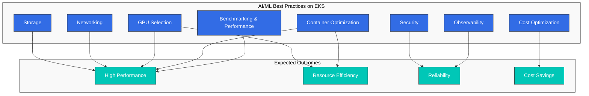
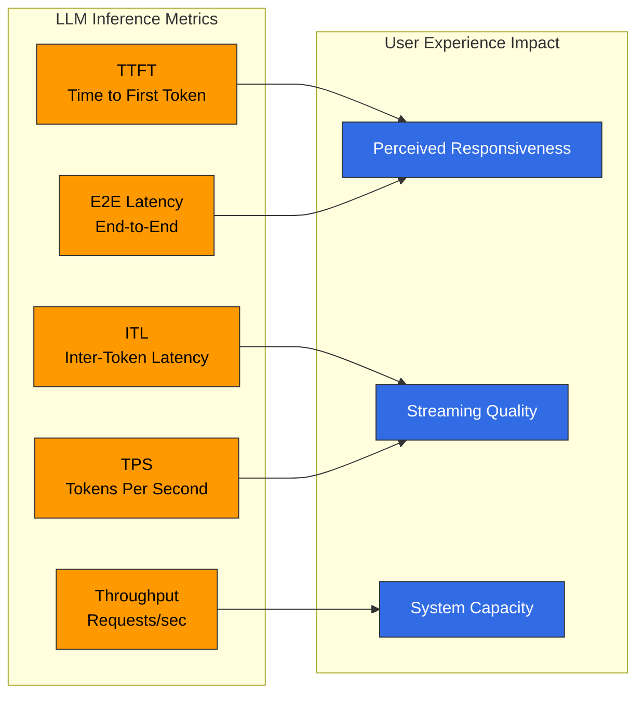
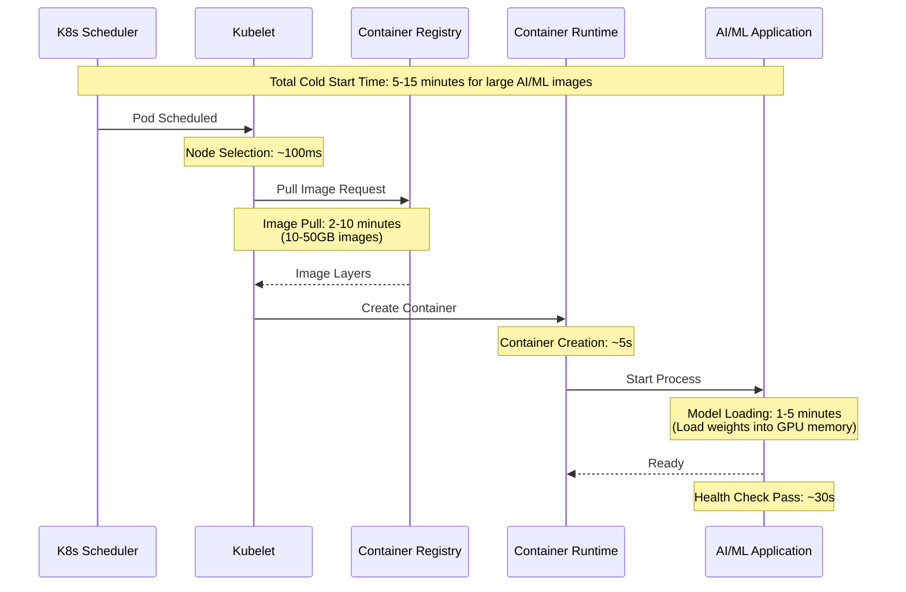

# Mejores prácticas de AI/ML en EKS

> **Versiones compatibles**: Kubernetes 1.31, 1.32, 1.33
> **Última actualización**: February 25, 2026

Esta guía cubre mejores prácticas completas para ejecutar workloads de AI/ML en Amazon EKS, incluyendo benchmarking (evaluación comparativa), optimización de contenedores, selección de GPU, redes, almacenamiento, observabilidad, optimización de costos y seguridad.

## Descripción general

Ejecutar workloads de AI/ML de forma eficiente en Kubernetes requiere una consideración cuidadosa en múltiples dimensiones:



## Benchmarking de inferencia LLM

El benchmarking es esencial para comprender las características de rendimiento de su servicio de inferencia LLM. Un benchmarking adecuado le ayuda a tomar decisiones informadas sobre escalado, asignación de recursos y optimización.

### Métricas clave de rendimiento

Comprender las métricas clave es fundamental para evaluar el rendimiento de la inferencia LLM:



| Métrica | Descripción | Fórmula | Rango objetivo |
|--------|-------------|---------|--------------|
| **TTFT** | Tiempo desde la solicitud hasta el primer token generado | `t_first_token - t_request` | < 500 ms para aplicaciones interactivas |
| **ITL** | Tiempo promedio entre tokens consecutivos | `(t_last_token - t_first_token) / (n_tokens - 1)` | < 50 ms para streaming fluido |
| **TPS** | Tokens generados por segundo por solicitud | `n_tokens / total_generation_time` | > 20 TPS para una buena UX |
| **E2E Latency** | Tiempo total desde la solicitud hasta la respuesta completa | `t_complete - t_request` | Depende de la longitud de salida |
| **Throughput** | Solicitudes procesadas por segundo | `total_requests / time_window` | Maximizar dentro de los SLO de latencia |

### Herramientas de benchmarking

#### Herramienta inference-perf

La herramienta `inference-perf` de AI on EKS proporciona capacidades completas de benchmarking:

```bash
# Install inference-perf
pip install inference-perf

# Basic benchmark against vLLM endpoint
inference-perf benchmark \
  --endpoint http://vllm-service:8000/v1/completions \
  --model meta-llama/Llama-3.1-8B-Instruct \
  --num-requests 1000 \
  --concurrency 10 \
  --prompt-length 128 \
  --max-tokens 256
```

Configuración para diferentes escenarios de prueba:

```yaml
# benchmark-config.yaml
apiVersion: v1
kind: ConfigMap
metadata:
  name: inference-perf-config
data:
  config.yaml: |
    endpoint:
      url: http://vllm-service:8000/v1/completions
      model: meta-llama/Llama-3.1-8B-Instruct

    scenarios:
      baseline:
        description: "Single request baseline"
        concurrency: 1
        num_requests: 100
        prompt_length: 128
        max_tokens: 256

      saturation:
        description: "Find maximum throughput"
        concurrency: [1, 5, 10, 20, 50, 100]
        num_requests: 500
        prompt_length: 256
        max_tokens: 512

      production:
        description: "Simulate production traffic"
        concurrency: 20
        num_requests: 10000
        prompt_distribution: "zipf"
        prompt_length_range: [64, 2048]
        max_tokens_range: [128, 1024]

      real_dataset:
        description: "Use real conversation data"
        dataset: "ShareGPT"
        num_requests: 5000
        concurrency: 15
```

#### Herramienta NVIDIA GenAI-Perf

Para métricas detalladas a nivel de GPU, use GenAI-Perf de NVIDIA:

```bash
# Install GenAI-Perf (part of Triton Inference Server)
pip install genai-perf

# Run benchmark with detailed GPU metrics
genai-perf profile \
  --model llama-3-8b \
  --backend vllm \
  --endpoint localhost:8000 \
  --concurrency 10 \
  --request-count 1000 \
  --streaming \
  --output-format json \
  --profile-export-file results.json
```

### Escenarios de prueba

| Escenario | Propósito | Configuración | Métricas clave a observar |
|----------|---------|---------------|----------------------|
| **Baseline** | Establecer el rendimiento de una sola solicitud | Concurrency=1, 100 solicitudes | TTFT, ITL, latencia E2E |
| **Saturation** | Encontrar límites de throughput | Concurrencia creciente hasta que la latencia se degrade | Curva de throughput vs. latencia |
| **Production Simulation** | Validar el rendimiento en condiciones reales | Prompts variables, concurrencia realista | Latencias P50/P95/P99 |
| **Real Dataset** | Probar con patrones de conversación reales | ShareGPT o datos específicos del dominio | Análisis de distribución de tokens |
| **Long Context** | Probar el manejo de la ventana de contexto | Prompts de 4K-128K tokens | Uso de memoria, escalado de TTFT |
| **Burst Traffic** | Probar la respuesta de autoscaling | Pico de 10 a 100 de concurrencia | Tiempo de scale-up, tasa de errores |

### Job de Kubernetes para benchmarking

```yaml
apiVersion: batch/v1
kind: Job
metadata:
  name: llm-benchmark
  namespace: ai-ml
spec:
  template:
    spec:
      containers:
      - name: benchmark
        image: public.ecr.aws/ai-on-eks/inference-perf:latest
        command:
        - inference-perf
        - benchmark
        - --config
        - /config/benchmark-config.yaml
        - --output
        - /results/benchmark-results.json
        volumeMounts:
        - name: config
          mountPath: /config
        - name: results
          mountPath: /results
        resources:
          requests:
            cpu: "2"
            memory: 4Gi
          limits:
            cpu: "4"
            memory: 8Gi
      volumes:
      - name: config
        configMap:
          name: inference-perf-config
      - name: results
        persistentVolumeClaim:
          claimName: benchmark-results-pvc
      restartPolicy: Never
  backoffLimit: 3
```

### Interpretación de resultados

```bash
# Sample benchmark output analysis
{
  "summary": {
    "total_requests": 1000,
    "successful_requests": 998,
    "failed_requests": 2,
    "total_duration_sec": 120.5,
    "requests_per_second": 8.3
  },
  "latency": {
    "ttft_ms": {
      "p50": 245,
      "p95": 512,
      "p99": 890,
      "mean": 298
    },
    "itl_ms": {
      "p50": 32,
      "p95": 48,
      "p99": 72,
      "mean": 35
    },
    "e2e_ms": {
      "p50": 2450,
      "p95": 4200,
      "p99": 6800,
      "mean": 2780
    }
  },
  "throughput": {
    "tokens_per_second": 1245,
    "tokens_per_request_mean": 150
  }
}
```

**Directrices de rendimiento**:
- TTFT P95 > 1s: Considere la optimización de prefill o el ajuste del tamaño de batch
- ITL P95 > 100ms: Compruebe la presión de memoria de GPU, considere tamaños de batch más pequeños
- Throughput que cae con mayor concurrencia: limitado por memoria de GPU o cómputo
- Alta variación en las latencias: compruebe si hay noisy neighbors o thermal throttling

## Optimización del inicio de contenedores

Los contenedores de AI/ML enfrentan desafíos únicos de cold start debido a tamaños de imagen grandes y requisitos de carga de modelos.

### Análisis de la línea de tiempo de cold start



### Desglose del tamaño de imagen

Composición típica de una imagen de contenedor de AI/ML:

| Componente | Rango de tamaño | Potencial de optimización |
|-----------|------------|------------------------|
| OS base (Ubuntu/Debian) | 100-500MB | Usar slim/distroless |
| CUDA Runtime | 2-4GB | Usar imágenes solo de runtime |
| Python + dependencias | 1-3GB | Builds multi-stage |
| ML Framework (PyTorch/TensorFlow) | 2-5GB | Usar builds optimizados |
| Pesos del modelo | 5-100GB+ | Desacoplar de la imagen |
| **Total** | **10-115GB** | **Objetivo: 5-10GB** |

### Estrategia 1: Desacoplar artefactos del modelo

Separe los pesos del modelo de la imagen del contenedor:

```yaml
# Pod with model loaded from S3 at startup
apiVersion: v1
kind: Pod
metadata:
  name: llm-inference
spec:
  initContainers:
  # Download model from S3 before main container starts
  - name: model-downloader
    image: amazon/aws-cli:latest
    command:
    - sh
    - -c
    - |
      aws s3 sync s3://models-bucket/llama-3-8b /models/llama-3-8b \
        --only-show-errors
      echo "Model download complete"
    volumeMounts:
    - name: model-storage
      mountPath: /models
    env:
    - name: AWS_REGION
      value: us-west-2
    resources:
      requests:
        cpu: "2"
        memory: 4Gi

  containers:
  - name: vllm
    image: vllm/vllm-openai:v0.6.0  # Slim image without models
    args:
    - --model
    - /models/llama-3-8b
    - --tensor-parallel-size
    - "1"
    volumeMounts:
    - name: model-storage
      mountPath: /models
    resources:
      limits:
        nvidia.com/gpu: 1

  volumes:
  - name: model-storage
    emptyDir:
      sizeLimit: 50Gi

  # Use EFS for shared model caching across nodes
  # - name: model-storage
  #   persistentVolumeClaim:
  #     claimName: models-efs-pvc
```

### Estrategia 2: Builds multi-stage

Optimice el Dockerfile para una imagen de runtime mínima:

```dockerfile
# Build stage - includes all build dependencies
FROM nvidia/cuda:12.4.0-devel-ubuntu22.04 AS builder

RUN apt-get update && apt-get install -y \
    python3.11 python3.11-dev python3-pip git \
    && rm -rf /var/lib/apt/lists/*

WORKDIR /build
COPY requirements.txt .
RUN pip3 install --no-cache-dir --target=/install \
    -r requirements.txt

# Runtime stage - minimal dependencies only
FROM nvidia/cuda:12.4.0-runtime-ubuntu22.04 AS runtime

# Install only runtime Python (no dev packages)
RUN apt-get update && apt-get install -y --no-install-recommends \
    python3.11 python3.11-distutils \
    && rm -rf /var/lib/apt/lists/* \
    && ln -s /usr/bin/python3.11 /usr/bin/python

# Copy installed packages from builder
COPY --from=builder /install /usr/local/lib/python3.11/dist-packages

# Copy application code only
COPY src/ /app/
WORKDIR /app

# Non-root user for security
RUN useradd -m -u 1000 appuser
USER appuser

ENTRYPOINT ["python", "serve.py"]
```

Comparación de tamaño de imagen:

| Enfoque | Tamaño de imagen | Tiempo de pull (1Gbps) |
|----------|------------|-------------------|
| Ingenuo (todo en una imagen) | 45GB | ~6 minutos |
| Build multi-stage | 12GB | ~1.5 minutos |
| Multi-stage + modelos externos | 5GB | ~40 segundos |

### Estrategia 3: Snapshotter de containerd

Use SOCI (Seekable OCI) snapshotter para lazy pulling:

```yaml
# Install SOCI snapshotter on EKS nodes
apiVersion: apps/v1
kind: DaemonSet
metadata:
  name: soci-snapshotter-installer
  namespace: kube-system
spec:
  selector:
    matchLabels:
      app: soci-snapshotter
  template:
    metadata:
      labels:
        app: soci-snapshotter
    spec:
      hostPID: true
      hostNetwork: true
      containers:
      - name: installer
        image: public.ecr.aws/soci-workshop/soci-snapshotter:latest
        securityContext:
          privileged: true
        volumeMounts:
        - name: containerd-config
          mountPath: /etc/containerd
        - name: containerd-socket
          mountPath: /run/containerd
      volumes:
      - name: containerd-config
        hostPath:
          path: /etc/containerd
      - name: containerd-socket
        hostPath:
          path: /run/containerd
```

Genere el índice SOCI para sus imágenes:

```bash
# Create SOCI index for faster lazy loading
soci create \
  --ref public.ecr.aws/myrepo/vllm:latest \
  --platform linux/amd64

# Push the index to ECR
soci push \
  --ref public.ecr.aws/myrepo/vllm:latest
```

### Estrategia 4: Image prefetching en Bottlerocket

Configure Bottlerocket para image prefetching:

```toml
# bottlerocket-settings.toml
[settings.container-registry]
# Pre-pull images on node startup
[settings.container-registry.credentials]
[settings.container-registry.credentials."public.ecr.aws"]

# Configure image pre-caching
[settings.kubernetes]
# Allow privileged containers for GPU workloads
allowed-unsafe-sysctls = ["net.core.*"]

[settings.bootstrap-containers.prefetch-images]
source = "public.ecr.aws/bottlerocket/bottlerocket-bootstrap-prefetch:latest"
mode = "once"
essential = false
user-data = """
#!/bin/bash
# Pre-fetch AI/ML images during node bootstrap
ctr images pull public.ecr.aws/myrepo/vllm:v0.6.0
ctr images pull public.ecr.aws/nvidia/cuda:12.4.0-runtime-ubuntu22.04
"""
```

NodePool de Karpenter con prefetching:

```yaml
apiVersion: karpenter.sh/v1
kind: NodePool
metadata:
  name: gpu-inference
spec:
  template:
    spec:
      nodeClassRef:
        group: karpenter.k8s.aws
        kind: EC2NodeClass
        name: gpu-bottlerocket
      requirements:
      - key: node.kubernetes.io/instance-type
        operator: In
        values: ["g5.xlarge", "g5.2xlarge", "g5.4xlarge"]
      - key: karpenter.sh/capacity-type
        operator: In
        values: ["on-demand", "spot"]
---
apiVersion: karpenter.k8s.aws/v1
kind: EC2NodeClass
metadata:
  name: gpu-bottlerocket
spec:
  amiSelectorTerms:
  - alias: bottlerocket@latest

  # Custom user data for image prefetching
  userData: |
    [settings.bootstrap-containers.prefetch]
    source = "public.ecr.aws/myrepo/image-prefetcher:latest"
    mode = "once"
    essential = false

    [settings.kubernetes.node-labels]
    "ai-ml/images-prefetched" = "true"
```

### Resumen de optimización de cold start

| Técnica | Reducción de inicio | Esfuerzo de implementación |
|-----------|-------------------|----------------------|
| Desacoplamiento de modelos | 50-70% | Medio |
| Builds multi-stage | 30-50% | Bajo |
| SOCI snapshotter | 60-80% | Medio |
| Image prefetching | 70-90% | Bajo |
| Enfoque combinado | 80-95% | Alto |

## Guía de selección de instancias GPU

Elegir el tipo de instancia GPU correcto es fundamental para workloads de AI/ML rentables.

### Comparación de instancias GPU

| Familia de instancia | Tipo de GPU | Memoria GPU | GPUs | vCPU | Memoria | Red | Casos de uso | Nivel de costo |
|-----------------|----------|------------|------|------|--------|---------|-----------|-----------|
| **G5** | NVIDIA A10G | 24GB | 1-8 | 4-192 | 16-768GB | Hasta 100 Gbps | Inferencia, fine-tuning | $$ |
| **G5g** | NVIDIA T4G | 16GB | 1-2 | 4-64 | 8-256GB | Hasta 25 Gbps | Inferencia rentable | $ |
| **G6** | NVIDIA L4 | 24GB | 1-8 | 4-192 | 16-768GB | Hasta 100 Gbps | Inferencia, video | $$ |
| **G6e** | NVIDIA L40S | 48GB | 1-8 | 8-384 | 32-1536GB | Hasta 100 Gbps | Inferencia de modelos grandes | $$$ |
| **P4d** | NVIDIA A100 | 40GB | 8 | 96 | 1152GB | 400 Gbps EFA | Entrenamiento a gran escala | $$$$ |
| **P4de** | NVIDIA A100 | 80GB | 8 | 96 | 1152GB | 400 Gbps EFA | Entrenamiento LLM | $$$$ |
| **P5** | NVIDIA H100 | 80GB | 8 | 192 | 2048GB | 3200 Gbps EFA | Entrenamiento de modelos frontier | $$$$$ |
| **P5e** | NVIDIA H200 | 141GB | 8 | 192 | 2048GB | 3200 Gbps EFA | Modelos más grandes | $$$$$ |
| **Trn1** | AWS Trainium | 32GB | 1-16 | 8-128 | 32-512GB | Hasta 800 Gbps | Entrenamiento (optimizado) | $$$ |
| **Inf2** | AWS Inferentia2 | 32GB | 1-12 | 4-96 | 16-384GB | Hasta 100 Gbps | Inferencia (optimizada) | $$ |

### Guía de selección basada en workload

```yaml
# Workload requirements to instance mapping
workload_selection:

  small_model_inference:  # Models < 7B parameters
    recommended:
      - g5.xlarge       # 1x A10G, cost-effective
      - g6.xlarge       # 1x L4, newer generation
      - inf2.xlarge     # 1x Inferentia2, best price/perf
    requirements:
      gpu_memory: "8-16GB"
      throughput: "10-50 req/s"
      latency: "< 500ms P95"

  medium_model_inference:  # Models 7B-30B parameters
    recommended:
      - g5.4xlarge      # 1x A10G 24GB
      - g6e.2xlarge     # 1x L40S 48GB
      - inf2.8xlarge    # 1x Inferentia2
    requirements:
      gpu_memory: "24-48GB"
      throughput: "5-20 req/s"
      latency: "< 1s P95"

  large_model_inference:  # Models 30B-70B parameters
    recommended:
      - g5.12xlarge     # 4x A10G (tensor parallel)
      - g6e.12xlarge    # 4x L40S
      - p4d.24xlarge    # 8x A100 (for 70B+)
    requirements:
      gpu_memory: "80-320GB"
      throughput: "1-10 req/s"
      latency: "< 3s P95"

  distributed_training:  # Multi-node training
    recommended:
      - p4d.24xlarge    # 8x A100, EFA
      - p5.48xlarge     # 8x H100, EFA
      - trn1.32xlarge   # 16x Trainium
    requirements:
      interconnect: "EFA required"
      gpu_memory: "320GB+ per node"
      scaling: "2-64+ nodes"

  fine_tuning:  # LoRA, QLoRA, full fine-tuning
    recommended:
      - g5.4xlarge      # Small models, LoRA
      - g5.12xlarge     # Medium models
      - p4d.24xlarge    # Large models, full fine-tune
    requirements:
      gpu_memory: "24-640GB"
      training_time: "hours to days"
```

### Árbol de decisión para selección de instancias

```python
def select_gpu_instance(model_size_b, workload_type, budget):
    """
    Select optimal GPU instance based on requirements.

    Args:
        model_size_b: Model size in billions of parameters
        workload_type: 'inference', 'training', 'fine_tuning'
        budget: 'low', 'medium', 'high'
    """

    # Memory estimation (rough): 2 bytes per param for FP16
    required_memory_gb = model_size_b * 2

    if workload_type == 'inference':
        if model_size_b <= 7:
            return 'g5.xlarge' if budget == 'low' else 'g6.xlarge'
        elif model_size_b <= 13:
            return 'g5.2xlarge' if budget == 'low' else 'g6e.2xlarge'
        elif model_size_b <= 30:
            return 'g5.4xlarge' if budget != 'high' else 'g6e.4xlarge'
        elif model_size_b <= 70:
            return 'g5.12xlarge'  # 4-way tensor parallel
        else:
            return 'p4d.24xlarge'  # 8-way tensor parallel

    elif workload_type == 'training':
        if model_size_b <= 7:
            return 'g5.12xlarge'
        elif model_size_b <= 30:
            return 'p4d.24xlarge'
        else:
            return 'p5.48xlarge'  # Multi-node required

    elif workload_type == 'fine_tuning':
        # LoRA reduces memory by ~10x
        if budget == 'low':
            return 'g5.xlarge'  # LoRA on most models
        else:
            return 'g5.4xlarge'  # Full fine-tune small models
```

## Mejores prácticas de redes

Las redes de alto rendimiento son fundamentales para workloads de AI/ML distribuidos.

### Configuración de EFA para entrenamiento distribuido

Elastic Fabric Adapter (EFA) proporciona redes de baja latencia y alto ancho de banda, esenciales para el entrenamiento multi-node:

```yaml
# EFA-enabled node configuration
apiVersion: karpenter.k8s.aws/v1
kind: EC2NodeClass
metadata:
  name: efa-training-nodes
spec:
  amiSelectorTerms:
  - alias: al2023@latest

  # EFA requires placement groups for optimal performance
  subnetSelectorTerms:
  - tags:
      karpenter.sh/discovery: my-cluster
      network/efa-enabled: "true"

  # Instance store for fast local scratch
  instanceStorePolicy: RAID0

  blockDeviceMappings:
  - deviceName: /dev/xvda
    ebs:
      volumeSize: 200Gi
      volumeType: gp3
      iops: 10000
      throughput: 500

  userData: |
    #!/bin/bash
    # Install EFA driver
    curl -O https://efa-installer.amazonaws.com/aws-efa-installer-latest.tar.gz
    tar -xf aws-efa-installer-latest.tar.gz
    cd aws-efa-installer && ./efa_installer.sh -y

    # Verify EFA installation
    fi_info -p efa
---
apiVersion: karpenter.sh/v1
kind: NodePool
metadata:
  name: efa-training
spec:
  template:
    spec:
      nodeClassRef:
        group: karpenter.k8s.aws
        kind: EC2NodeClass
        name: efa-training-nodes
      requirements:
      - key: node.kubernetes.io/instance-type
        operator: In
        values: ["p4d.24xlarge", "p5.48xlarge"]
      - key: karpenter.sh/capacity-type
        operator: In
        values: ["on-demand"]
      taints:
      - key: nvidia.com/gpu
        value: "true"
        effect: NoSchedule
```

### Configuración de NCCL

Optimización de NVIDIA Collective Communication Library (NCCL) para EFA:

```yaml
apiVersion: v1
kind: ConfigMap
metadata:
  name: nccl-config
  namespace: ai-ml
data:
  nccl-env.sh: |
    # EFA-optimized NCCL settings
    export NCCL_DEBUG=INFO
    export NCCL_DEBUG_SUBSYS=ALL

    # Use EFA for inter-node communication
    export FI_PROVIDER=efa
    export FI_EFA_USE_DEVICE_RDMA=1
    export FI_EFA_FORK_SAFE=1

    # Optimize for P4d/P5 instances
    export NCCL_ALGO=Ring,Tree
    export NCCL_PROTO=Simple

    # Network interface selection
    export NCCL_SOCKET_IFNAME=eth0
    export NCCL_IB_DISABLE=1

    # Buffer sizes for large models
    export NCCL_BUFFSIZE=8388608
    export NCCL_P2P_NET_CHUNKSIZE=524288

    # Timeout settings
    export NCCL_TIMEOUT=1800

    # AWS OFI NCCL plugin
    export LD_LIBRARY_PATH=/opt/amazon/efa/lib:$LD_LIBRARY_PATH
    export FI_EFA_ENABLE_SHM_TRANSFER=1
---
apiVersion: v1
kind: Pod
metadata:
  name: distributed-training
spec:
  containers:
  - name: trainer
    image: my-training-image:latest
    command: ["/bin/bash", "-c"]
    args:
    - |
      source /config/nccl-env.sh
      torchrun --nproc_per_node=8 \
               --nnodes=$WORLD_SIZE \
               --node_rank=$RANK \
               --master_addr=$MASTER_ADDR \
               --master_port=29500 \
               train.py
    volumeMounts:
    - name: nccl-config
      mountPath: /config
    - name: shm
      mountPath: /dev/shm
    resources:
      limits:
        nvidia.com/gpu: 8
        vpc.amazonaws.com/efa: 4  # Request EFA devices
  volumes:
  - name: nccl-config
    configMap:
      name: nccl-config
  - name: shm
    emptyDir:
      medium: Memory
      sizeLimit: 64Gi
```

### Placement Groups

Configure placement groups para obtener un rendimiento de red óptimo:

```yaml
# Cluster placement group for distributed training
apiVersion: karpenter.k8s.aws/v1
kind: EC2NodeClass
metadata:
  name: training-cluster-pg
spec:
  # ... other config ...

  # Use cluster placement group for lowest latency
  tags:
    aws:ec2:placement-group: training-cluster-pg
---
# Create placement group via AWS CLI
# aws ec2 create-placement-group \
#   --group-name training-cluster-pg \
#   --strategy cluster \
#   --tag-specifications 'ResourceType=placement-group,Tags=[{Key=Purpose,Value=ai-training}]'
```

### Reglas de Security Group para tráfico GPU

```yaml
# Security group configuration for distributed training
# Apply via Terraform or CloudFormation

security_group_rules:
  # Allow all traffic within placement group
  - type: ingress
    from_port: 0
    to_port: 65535
    protocol: tcp
    self: true
    description: "Intra-cluster communication"

  # NCCL communication ports
  - type: ingress
    from_port: 29500
    to_port: 29600
    protocol: tcp
    self: true
    description: "PyTorch distributed training"

  # EFA traffic (requires specific rules)
  - type: ingress
    from_port: 0
    to_port: 0
    protocol: "-1"  # All protocols
    self: true
    description: "EFA traffic"
```

### Network Policy para endpoints de inferencia

```yaml
apiVersion: networking.k8s.io/v1
kind: NetworkPolicy
metadata:
  name: llm-inference-policy
  namespace: ai-ml
spec:
  podSelector:
    matchLabels:
      app: llm-inference
  policyTypes:
  - Ingress
  - Egress

  ingress:
  # Allow traffic from API gateway
  - from:
    - namespaceSelector:
        matchLabels:
          name: api-gateway
    ports:
    - protocol: TCP
      port: 8000

  # Allow health checks from kubelet
  - from:
    - ipBlock:
        cidr: 10.0.0.0/8
    ports:
    - protocol: TCP
      port: 8000

  egress:
  # Allow DNS
  - to:
    - namespaceSelector: {}
    ports:
    - protocol: UDP
      port: 53

  # Allow S3 access for model downloads
  - to:
    - ipBlock:
        cidr: 0.0.0.0/0
    ports:
    - protocol: TCP
      port: 443
```

## Mejores prácticas de almacenamiento

Elegir la solución de almacenamiento adecuada impacta significativamente el rendimiento de los workloads de AI/ML.

### Guía de selección de almacenamiento

| Tipo de almacenamiento | Throughput | Latencia | Capacidad | Casos de uso | Costo |
|--------------|------------|---------|----------|-----------|------|
| **Instance Store** | Hasta 7.5 GB/s | < 1ms | Hasta 7.6TB | Espacio scratch, checkpoints | Incluido |
| **EBS gp3** | Hasta 1 GB/s | 1-2ms | Hasta 16TB | Boot, datasets pequeños | $ |
| **EBS io2** | Hasta 4 GB/s | < 1ms | Hasta 64TB | Requisitos de alto IOPS | $$$ |
| **EFS** | Bursting/Provisioned | 2-5ms | Ilimitada | Modelos compartidos, datasets | $$ |
| **FSx Lustre** | Hasta 1+ TB/s | < 1ms | Petabytes | Datasets grandes de entrenamiento | $$$ |
| **S3** | Prácticamente ilimitado | 50-100ms | Ilimitada | Artefactos de modelo, archivos | $ |

### Cuándo usar cada tipo de almacenamiento

```yaml
# Storage decision matrix
storage_recommendations:

  model_weights:
    primary: EFS  # Shared across pods
    alternative: S3 + init container download
    reasoning: |
      - Models need to be accessible from multiple pods
      - EFS provides shared access with caching
      - S3 is cheaper but requires download time

  training_datasets:
    small: EBS gp3  # < 500GB, single node
    medium: EFS  # 500GB-10TB, multi-node read
    large: FSx Lustre  # > 10TB, high throughput
    reasoning: |
      - FSx Lustre provides parallel filesystem
      - Can link directly to S3 for data loading

  checkpoints:
    training: Instance store  # Fast, temporary
    persistent: S3  # Long-term storage
    reasoning: |
      - Checkpoints are written frequently during training
      - Instance store provides lowest latency
      - Periodic sync to S3 for durability

  inference_cache:
    kv_cache: Instance store or tmpfs
    model_cache: EFS or local EBS
    reasoning: |
      - KV cache is ephemeral, needs lowest latency
      - Model cache benefits from persistence
```

### Estrategia de caché de modelos

```yaml
# PVC for shared model cache
apiVersion: v1
kind: PersistentVolumeClaim
metadata:
  name: model-cache-efs
  namespace: ai-ml
spec:
  accessModes:
  - ReadWriteMany  # Shared across all inference pods
  storageClassName: efs-sc
  resources:
    requests:
      storage: 500Gi
---
# Model cache sidecar
apiVersion: v1
kind: Pod
metadata:
  name: llm-inference
spec:
  initContainers:
  # Check cache, download if missing
  - name: model-cache-check
    image: amazon/aws-cli:latest
    command:
    - sh
    - -c
    - |
      MODEL_PATH="/models/llama-3-8b"
      if [ ! -f "$MODEL_PATH/config.json" ]; then
        echo "Model not in cache, downloading..."
        aws s3 sync s3://models/llama-3-8b $MODEL_PATH
      else
        echo "Model found in cache"
      fi
    volumeMounts:
    - name: model-cache
      mountPath: /models

  containers:
  - name: vllm
    image: vllm/vllm-openai:latest
    args:
    - --model
    - /models/llama-3-8b
    volumeMounts:
    - name: model-cache
      mountPath: /models
      readOnly: true  # Read-only for inference
    resources:
      limits:
        nvidia.com/gpu: 1

  volumes:
  - name: model-cache
    persistentVolumeClaim:
      claimName: model-cache-efs
```

### Gestión de checkpoints para entrenamiento

```yaml
apiVersion: v1
kind: ConfigMap
metadata:
  name: checkpoint-manager
data:
  checkpoint-sync.sh: |
    #!/bin/bash
    # Sync checkpoints to S3 periodically

    LOCAL_CKPT_DIR="/scratch/checkpoints"
    S3_CKPT_PATH="s3://training-checkpoints/${JOB_NAME}"
    SYNC_INTERVAL=1800  # 30 minutes

    while true; do
      sleep $SYNC_INTERVAL

      # Find newest checkpoint
      LATEST=$(ls -t $LOCAL_CKPT_DIR/checkpoint-* 2>/dev/null | head -1)

      if [ -n "$LATEST" ]; then
        echo "Syncing $LATEST to S3..."
        aws s3 cp --recursive $LATEST $S3_CKPT_PATH/$(basename $LATEST)

        # Keep only last 3 local checkpoints
        ls -t $LOCAL_CKPT_DIR/checkpoint-* | tail -n +4 | xargs rm -rf
      fi
    done
---
apiVersion: v1
kind: Pod
metadata:
  name: training-job
spec:
  containers:
  - name: trainer
    image: training-image:latest
    volumeMounts:
    - name: scratch
      mountPath: /scratch
    env:
    - name: CHECKPOINT_DIR
      value: /scratch/checkpoints

  - name: checkpoint-sync
    image: amazon/aws-cli:latest
    command: ["/scripts/checkpoint-sync.sh"]
    volumeMounts:
    - name: scratch
      mountPath: /scratch
      readOnly: true
    - name: scripts
      mountPath: /scripts
    env:
    - name: JOB_NAME
      valueFrom:
        fieldRef:
          fieldPath: metadata.name

  volumes:
  - name: scratch
    emptyDir:
      medium: Memory  # Or use instance store
      sizeLimit: 100Gi
  - name: scripts
    configMap:
      name: checkpoint-manager
      defaultMode: 0755
```

### Configuración de FSx for Lustre

```yaml
# StorageClass for FSx Lustre
apiVersion: storage.k8s.io/v1
kind: StorageClass
metadata:
  name: fsx-lustre-sc
provisioner: fsx.csi.aws.com
parameters:
  subnetId: subnet-0123456789abcdef0
  securityGroupIds: sg-0123456789abcdef0
  deploymentType: PERSISTENT_2
  perUnitStorageThroughput: "250"  # MB/s per TiB
  dataCompressionType: LZ4

  # Link to S3 for transparent data access
  s3ImportPath: s3://training-data
  s3ExportPath: s3://training-data
  autoImportPolicy: NEW_CHANGED_DELETED
---
apiVersion: v1
kind: PersistentVolumeClaim
metadata:
  name: training-data-fsx
spec:
  accessModes:
  - ReadWriteMany
  storageClassName: fsx-lustre-sc
  resources:
    requests:
      storage: 2400Gi  # Minimum 1.2TiB, increments of 2.4TiB
```

## Observabilidad para AI/ML

La observabilidad completa es esencial para operar workloads de AI/ML a escala.

### Configuración de NVIDIA DCGM Exporter

Despliegue DCGM exporter para métricas de GPU:

```yaml
apiVersion: apps/v1
kind: DaemonSet
metadata:
  name: dcgm-exporter
  namespace: monitoring
spec:
  selector:
    matchLabels:
      app: dcgm-exporter
  template:
    metadata:
      labels:
        app: dcgm-exporter
      annotations:
        prometheus.io/scrape: "true"
        prometheus.io/port: "9400"
    spec:
      nodeSelector:
        nvidia.com/gpu.present: "true"
      tolerations:
      - key: nvidia.com/gpu
        operator: Exists
        effect: NoSchedule

      containers:
      - name: dcgm-exporter
        image: nvcr.io/nvidia/k8s/dcgm-exporter:3.3.5-3.4.0-ubuntu22.04
        ports:
        - containerPort: 9400
          name: metrics
        env:
        - name: DCGM_EXPORTER_LISTEN
          value: ":9400"
        - name: DCGM_EXPORTER_KUBERNETES
          value: "true"
        - name: DCGM_EXPORTER_COLLECTORS
          value: "/etc/dcgm-exporter/dcp-metrics-included.csv"
        securityContext:
          runAsNonRoot: false
          runAsUser: 0
          capabilities:
            add: ["SYS_ADMIN"]
        volumeMounts:
        - name: pod-resources
          mountPath: /var/lib/kubelet/pod-resources
          readOnly: true
        resources:
          requests:
            cpu: 100m
            memory: 128Mi
          limits:
            cpu: 500m
            memory: 512Mi

      volumes:
      - name: pod-resources
        hostPath:
          path: /var/lib/kubelet/pod-resources
---
apiVersion: v1
kind: Service
metadata:
  name: dcgm-exporter
  namespace: monitoring
  labels:
    app: dcgm-exporter
spec:
  type: ClusterIP
  ports:
  - port: 9400
    targetPort: 9400
    name: metrics
  selector:
    app: dcgm-exporter
```

### Recolección de métricas GPU

Métricas GPU clave para monitorear:

```yaml
# ServiceMonitor for Prometheus Operator
apiVersion: monitoring.coreos.com/v1
kind: ServiceMonitor
metadata:
  name: dcgm-exporter
  namespace: monitoring
spec:
  selector:
    matchLabels:
      app: dcgm-exporter
  endpoints:
  - port: metrics
    interval: 15s
    path: /metrics
---
# PrometheusRule for GPU alerts
apiVersion: monitoring.coreos.com/v1
kind: PrometheusRule
metadata:
  name: gpu-alerts
  namespace: monitoring
spec:
  groups:
  - name: gpu.rules
    rules:
    # GPU utilization alerts
    - alert: GPUHighUtilization
      expr: DCGM_FI_DEV_GPU_UTIL > 95
      for: 10m
      labels:
        severity: warning
      annotations:
        summary: "GPU {{ $labels.gpu }} utilization above 95%"
        description: "GPU utilization has been above 95% for 10 minutes"

    # GPU memory alerts
    - alert: GPUMemoryAlmostFull
      expr: (DCGM_FI_DEV_FB_USED / DCGM_FI_DEV_FB_TOTAL) > 0.95
      for: 5m
      labels:
        severity: warning
      annotations:
        summary: "GPU {{ $labels.gpu }} memory usage above 95%"

    # GPU temperature alerts
    - alert: GPUHighTemperature
      expr: DCGM_FI_DEV_GPU_TEMP > 80
      for: 5m
      labels:
        severity: warning
      annotations:
        summary: "GPU {{ $labels.gpu }} temperature above 80C"

    - alert: GPUCriticalTemperature
      expr: DCGM_FI_DEV_GPU_TEMP > 90
      for: 1m
      labels:
        severity: critical
      annotations:
        summary: "GPU {{ $labels.gpu }} temperature critical (>90C)"

    # GPU errors
    - alert: GPUXidErrors
      expr: increase(DCGM_FI_DEV_XID_ERRORS[5m]) > 0
      labels:
        severity: critical
      annotations:
        summary: "GPU {{ $labels.gpu }} XID errors detected"
```

### Referencia de métricas GPU clave

| Métrica | Descripción | Umbral de alerta |
|--------|-------------|-----------------|
| `DCGM_FI_DEV_GPU_UTIL` | Porcentaje de utilización de cómputo de GPU | > 95% sostenido |
| `DCGM_FI_DEV_MEM_COPY_UTIL` | Porcentaje de utilización de copia de memoria | > 90% sostenido |
| `DCGM_FI_DEV_FB_USED` | Memoria de frame buffer usada (bytes) | > 95% del total |
| `DCGM_FI_DEV_GPU_TEMP` | Temperatura de GPU (Celsius) | > 80C advertencia, > 90C crítico |
| `DCGM_FI_DEV_POWER_USAGE` | Consumo de energía (Watts) | Cerca del límite TDP |
| `DCGM_FI_DEV_SM_CLOCK` | Frecuencia de reloj SM (MHz) | Detección de throttling |
| `DCGM_FI_DEV_XID_ERRORS` | Conteo de errores XID | Cualquier aumento |
| `DCGM_FI_DEV_NVLINK_BANDWIDTH_TOTAL` | Ancho de banda NVLink | Por debajo de lo esperado |

### Métricas de model serving

```yaml
# vLLM metrics configuration
apiVersion: v1
kind: ConfigMap
metadata:
  name: vllm-metrics-config
data:
  prometheus.yaml: |
    # vLLM exposes metrics at /metrics endpoint
    # Key metrics to monitor:

    # Request metrics
    # - vllm:num_requests_running - Current running requests
    # - vllm:num_requests_waiting - Queued requests
    # - vllm:request_success_total - Successful requests
    # - vllm:request_prompt_tokens_total - Input tokens processed
    # - vllm:request_generation_tokens_total - Output tokens generated

    # Latency metrics
    # - vllm:time_to_first_token_seconds - TTFT histogram
    # - vllm:time_per_output_token_seconds - ITL histogram
    # - vllm:e2e_request_latency_seconds - End-to-end latency

    # GPU metrics
    # - vllm:gpu_cache_usage_perc - KV cache utilization
    # - vllm:gpu_prefix_cache_hit_rate - Prefix caching efficiency

    # Batch metrics
    # - vllm:num_preemptions_total - Request preemptions
    # - vllm:iteration_tokens_total - Tokens per iteration
---
apiVersion: monitoring.coreos.com/v1
kind: PrometheusRule
metadata:
  name: vllm-alerts
  namespace: ai-ml
spec:
  groups:
  - name: vllm.rules
    rules:
    - alert: vLLMHighQueueDepth
      expr: vllm:num_requests_waiting > 50
      for: 5m
      labels:
        severity: warning
      annotations:
        summary: "vLLM request queue depth high"
        description: "More than 50 requests waiting for processing"

    - alert: vLLMHighTTFT
      expr: histogram_quantile(0.95, rate(vllm:time_to_first_token_seconds_bucket[5m])) > 2
      for: 10m
      labels:
        severity: warning
      annotations:
        summary: "vLLM TTFT P95 exceeds 2 seconds"

    - alert: vLLMKVCacheFull
      expr: vllm:gpu_cache_usage_perc > 0.95
      for: 5m
      labels:
        severity: critical
      annotations:
        summary: "vLLM KV cache nearly full"
        description: "KV cache usage above 95%, requests may be rejected"
```

### Configuración de dashboard de Grafana

```json
{
  "dashboard": {
    "title": "AI/ML Workloads Overview",
    "panels": [
      {
        "title": "GPU Utilization by Node",
        "type": "timeseries",
        "targets": [
          {
            "expr": "DCGM_FI_DEV_GPU_UTIL",
            "legendFormat": "{{node}}-GPU{{gpu}}"
          }
        ]
      },
      {
        "title": "GPU Memory Usage",
        "type": "gauge",
        "targets": [
          {
            "expr": "DCGM_FI_DEV_FB_USED / DCGM_FI_DEV_FB_TOTAL * 100",
            "legendFormat": "{{node}}-GPU{{gpu}}"
          }
        ],
        "fieldConfig": {
          "defaults": {
            "thresholds": {
              "steps": [
                {"color": "green", "value": 0},
                {"color": "yellow", "value": 70},
                {"color": "red", "value": 90}
              ]
            }
          }
        }
      },
      {
        "title": "Inference Latency (TTFT P95)",
        "type": "timeseries",
        "targets": [
          {
            "expr": "histogram_quantile(0.95, rate(vllm:time_to_first_token_seconds_bucket[5m]))",
            "legendFormat": "{{pod}}"
          }
        ]
      },
      {
        "title": "Requests Per Second",
        "type": "stat",
        "targets": [
          {
            "expr": "sum(rate(vllm:request_success_total[5m]))",
            "legendFormat": "Total RPS"
          }
        ]
      },
      {
        "title": "Tokens Per Second",
        "type": "timeseries",
        "targets": [
          {
            "expr": "sum(rate(vllm:request_generation_tokens_total[5m]))",
            "legendFormat": "Generation TPS"
          }
        ]
      },
      {
        "title": "GPU Temperature",
        "type": "timeseries",
        "targets": [
          {
            "expr": "DCGM_FI_DEV_GPU_TEMP",
            "legendFormat": "{{node}}-GPU{{gpu}}"
          }
        ],
        "fieldConfig": {
          "defaults": {
            "custom": {
              "thresholdsStyle": {
                "mode": "line"
              }
            },
            "thresholds": {
              "steps": [
                {"color": "green", "value": 0},
                {"color": "yellow", "value": 75},
                {"color": "red", "value": 85}
              ]
            }
          }
        }
      }
    ]
  }
}
```

## Optimización de costos

Implementar estrategias de optimización de costos puede reducir significativamente los costos de infraestructura de AI/ML.

### Spot Instances para inferencia

```yaml
# Karpenter NodePool with Spot for inference
apiVersion: karpenter.sh/v1
kind: NodePool
metadata:
  name: inference-spot
spec:
  template:
    spec:
      nodeClassRef:
        group: karpenter.k8s.aws
        kind: EC2NodeClass
        name: inference-ec2
      requirements:
      - key: node.kubernetes.io/instance-type
        operator: In
        values:
        - g5.xlarge
        - g5.2xlarge
        - g6.xlarge
        - g6.2xlarge
      - key: karpenter.sh/capacity-type
        operator: In
        values: ["spot"]  # Prefer Spot
      - key: kubernetes.io/arch
        operator: In
        values: ["amd64"]

      taints:
      - key: nvidia.com/gpu
        value: "true"
        effect: NoSchedule

  # Disruption settings for Spot
  disruption:
    consolidationPolicy: WhenEmptyOrUnderutilized
    consolidateAfter: 1m
    budgets:
    - nodes: "20%"  # Allow 20% of nodes to be disrupted

  limits:
    cpu: 1000
    memory: 4000Gi
    nvidia.com/gpu: 100
---
# Pod configuration for graceful Spot termination
apiVersion: v1
kind: Pod
metadata:
  name: inference-pod
spec:
  terminationGracePeriodSeconds: 120  # Handle Spot interruption
  containers:
  - name: inference
    image: vllm/vllm-openai:latest
    lifecycle:
      preStop:
        exec:
          command:
          - /bin/sh
          - -c
          - |
            # Drain requests gracefully
            curl -X POST localhost:8000/drain
            sleep 30
```

### Políticas de consolidación de Karpenter

```yaml
apiVersion: karpenter.sh/v1
kind: NodePool
metadata:
  name: gpu-workloads
spec:
  template:
    spec:
      nodeClassRef:
        group: karpenter.k8s.aws
        kind: EC2NodeClass
        name: gpu-nodes
      requirements:
      - key: node.kubernetes.io/instance-type
        operator: In
        values:
        - g5.xlarge
        - g5.2xlarge
        - g5.4xlarge
        - g5.8xlarge
        - g5.12xlarge
      - key: karpenter.sh/capacity-type
        operator: In
        values: ["spot", "on-demand"]

  disruption:
    # Consolidate underutilized nodes
    consolidationPolicy: WhenEmptyOrUnderutilized
    consolidateAfter: 5m

    # Budget to prevent disruption during peak hours
    budgets:
    - nodes: "0"
      schedule: "0 9-17 * * 1-5"  # No consolidation during business hours
      duration: 8h
    - nodes: "30%"  # Allow 30% during off-peak

  # Weight for cost optimization
  weight: 100  # Higher weight = preferred for scheduling
```

### Recomendaciones de right-sizing

```yaml
# VPA for inference workloads
apiVersion: autoscaling.k8s.io/v1
kind: VerticalPodAutoscaler
metadata:
  name: llm-inference-vpa
  namespace: ai-ml
spec:
  targetRef:
    apiVersion: apps/v1
    kind: Deployment
    name: llm-inference
  updatePolicy:
    updateMode: "Off"  # Recommendation only
  resourcePolicy:
    containerPolicies:
    - containerName: inference
      minAllowed:
        cpu: "2"
        memory: 8Gi
      maxAllowed:
        cpu: "16"
        memory: 64Gi
      controlledResources: ["cpu", "memory"]
      controlledValues: RequestsAndLimits
---
# Script to analyze GPU utilization and recommend right-sizing
apiVersion: v1
kind: ConfigMap
metadata:
  name: rightsizing-analysis
data:
  analyze.sh: |
    #!/bin/bash
    # Query Prometheus for GPU utilization

    echo "=== GPU Right-Sizing Analysis ==="

    # Average GPU utilization over last 7 days
    GPU_UTIL=$(curl -s "http://prometheus:9090/api/v1/query" \
      --data-urlencode 'query=avg_over_time(DCGM_FI_DEV_GPU_UTIL[7d])' \
      | jq -r '.data.result[0].value[1]')

    # Average GPU memory utilization
    GPU_MEM=$(curl -s "http://prometheus:9090/api/v1/query" \
      --data-urlencode 'query=avg_over_time((DCGM_FI_DEV_FB_USED/DCGM_FI_DEV_FB_TOTAL)[7d])' \
      | jq -r '.data.result[0].value[1]')

    echo "Average GPU Utilization: ${GPU_UTIL}%"
    echo "Average GPU Memory: ${GPU_MEM}%"

    # Recommendations
    if (( $(echo "$GPU_UTIL < 30" | bc -l) )); then
      echo "RECOMMENDATION: Consider smaller GPU instance or GPU sharing"
    elif (( $(echo "$GPU_UTIL > 90" | bc -l) )); then
      echo "RECOMMENDATION: Consider larger GPU instance or scale out"
    fi

    if (( $(echo "$GPU_MEM < 50" | bc -l) )); then
      echo "RECOMMENDATION: Consider instance with less GPU memory"
    elif (( $(echo "$GPU_MEM > 90" | bc -l) )); then
      echo "RECOMMENDATION: Consider instance with more GPU memory"
    fi
```

### Comparación de costos y Savings Plans

| Estrategia | Ahorros típicos | Complejidad de implementación | Mejor para |
|----------|-----------------|---------------------------|----------|
| Spot Instances | 60-90% | Media | Inferencia stateless |
| Savings Plans (1 año) | 30-40% | Baja | Capacidad base |
| Savings Plans (3 años) | 50-60% | Baja | Workloads estables |
| Reserved Instances | 40-70% | Media | Uso predecible |
| Consolidación de Karpenter | 20-40% | Baja | Workloads variables |
| GPU Sharing (MIG/MPS) | 30-50% | Alta | Modelos pequeños |
| Right-sizing | 20-50% | Media | Sobreaprovisionados |

```yaml
# Example cost optimization deployment strategy
apiVersion: apps/v1
kind: Deployment
metadata:
  name: llm-inference-cost-optimized
spec:
  replicas: 10
  strategy:
    type: RollingUpdate
    rollingUpdate:
      maxSurge: 2
      maxUnavailable: 1
  template:
    spec:
      # Topology spread for availability
      topologySpreadConstraints:
      - maxSkew: 2
        topologyKey: topology.kubernetes.io/zone
        whenUnsatisfiable: ScheduleAnyway
        labelSelector:
          matchLabels:
            app: llm-inference

      # Prefer Spot, fallback to On-Demand
      affinity:
        nodeAffinity:
          preferredDuringSchedulingIgnoredDuringExecution:
          - weight: 100
            preference:
              matchExpressions:
              - key: karpenter.sh/capacity-type
                operator: In
                values: ["spot"]
          - weight: 50
            preference:
              matchExpressions:
              - key: karpenter.sh/capacity-type
                operator: In
                values: ["on-demand"]

      containers:
      - name: inference
        resources:
          requests:
            nvidia.com/gpu: 1
            cpu: "4"
            memory: 16Gi
          limits:
            nvidia.com/gpu: 1
            cpu: "8"
            memory: 32Gi
```

## Consideraciones de seguridad

La seguridad es crítica al desplegar workloads de AI/ML, especialmente aquellos que manejan datos sensibles o modelos valiosos.

### Control de acceso a modelos

```yaml
# IRSA for S3 model access
apiVersion: v1
kind: ServiceAccount
metadata:
  name: model-loader
  namespace: ai-ml
  annotations:
    eks.amazonaws.com/role-arn: arn:aws:iam::123456789012:role/ModelLoaderRole
---
# IAM policy for model access (apply via Terraform)
# {
#   "Version": "2012-10-17",
#   "Statement": [
#     {
#       "Effect": "Allow",
#       "Action": [
#         "s3:GetObject",
#         "s3:ListBucket"
#       ],
#       "Resource": [
#         "arn:aws:s3:::models-bucket",
#         "arn:aws:s3:::models-bucket/*"
#       ],
#       "Condition": {
#         "StringEquals": {
#           "aws:ResourceTag/Environment": "production"
#         }
#       }
#     }
#   ]
# }
---
# Pod with IRSA
apiVersion: v1
kind: Pod
metadata:
  name: inference-pod
spec:
  serviceAccountName: model-loader
  containers:
  - name: inference
    image: vllm/vllm-openai:latest
    # AWS SDK will automatically use IRSA credentials
```

### Gestión de secretos para claves de API

```yaml
# External Secrets Operator for HuggingFace/NGC tokens
apiVersion: external-secrets.io/v1beta1
kind: ExternalSecret
metadata:
  name: model-registry-secrets
  namespace: ai-ml
spec:
  refreshInterval: 1h
  secretStoreRef:
    name: aws-secretsmanager
    kind: ClusterSecretStore
  target:
    name: model-registry-credentials
    creationPolicy: Owner
  data:
  - secretKey: HUGGING_FACE_HUB_TOKEN
    remoteRef:
      key: ai-ml/huggingface-token
      property: token
  - secretKey: NGC_API_KEY
    remoteRef:
      key: ai-ml/ngc-api-key
      property: key
---
# Pod using external secrets
apiVersion: v1
kind: Pod
metadata:
  name: model-downloader
spec:
  containers:
  - name: downloader
    image: python:3.11-slim
    command: ["python", "download_model.py"]
    env:
    - name: HUGGING_FACE_HUB_TOKEN
      valueFrom:
        secretKeyRef:
          name: model-registry-credentials
          key: HUGGING_FACE_HUB_TOKEN
    - name: NGC_API_KEY
      valueFrom:
        secretKeyRef:
          name: model-registry-credentials
          key: NGC_API_KEY
    securityContext:
      readOnlyRootFilesystem: true
      runAsNonRoot: true
      runAsUser: 1000
      allowPrivilegeEscalation: false
      capabilities:
        drop: ["ALL"]
```

### Network Policies para endpoints de inferencia

```yaml
# Strict network policy for LLM inference
apiVersion: networking.k8s.io/v1
kind: NetworkPolicy
metadata:
  name: llm-inference-strict
  namespace: ai-ml
spec:
  podSelector:
    matchLabels:
      app: llm-inference
  policyTypes:
  - Ingress
  - Egress

  ingress:
  # Only allow from API gateway namespace
  - from:
    - namespaceSelector:
        matchLabels:
          name: api-gateway
      podSelector:
        matchLabels:
          app: gateway
    ports:
    - protocol: TCP
      port: 8000

  # Allow Prometheus scraping
  - from:
    - namespaceSelector:
        matchLabels:
          name: monitoring
      podSelector:
        matchLabels:
          app: prometheus
    ports:
    - protocol: TCP
      port: 8000

  egress:
  # DNS resolution
  - to:
    - namespaceSelector: {}
      podSelector:
        matchLabels:
          k8s-app: kube-dns
    ports:
    - protocol: UDP
      port: 53

  # Block all other egress (models should be pre-loaded)
  # Add specific rules if external API calls are needed
---
# Pod Security Standards
apiVersion: v1
kind: Pod
metadata:
  name: secure-inference
spec:
  securityContext:
    runAsNonRoot: true
    runAsUser: 1000
    runAsGroup: 1000
    fsGroup: 1000
    seccompProfile:
      type: RuntimeDefault

  containers:
  - name: inference
    image: vllm/vllm-openai:latest
    securityContext:
      allowPrivilegeEscalation: false
      readOnlyRootFilesystem: false  # vLLM needs write access
      capabilities:
        drop: ["ALL"]

    volumeMounts:
    - name: model-cache
      mountPath: /models
      readOnly: true
    - name: tmp
      mountPath: /tmp
    - name: cache
      mountPath: /.cache

  volumes:
  - name: model-cache
    persistentVolumeClaim:
      claimName: models-pvc
      readOnly: true
  - name: tmp
    emptyDir:
      sizeLimit: 10Gi
  - name: cache
    emptyDir:
      sizeLimit: 5Gi
```

### Audit logging para acceso a modelos

```yaml
# CloudWatch logging for model access audit
apiVersion: v1
kind: ConfigMap
metadata:
  name: fluent-bit-config
  namespace: logging
data:
  fluent-bit.conf: |
    [SERVICE]
        Parsers_File parsers.conf

    [INPUT]
        Name              tail
        Tag               inference.access
        Path              /var/log/containers/llm-inference*.log
        Parser            docker
        Mem_Buf_Limit     50MB
        Skip_Long_Lines   On

    [FILTER]
        Name              grep
        Match             inference.access
        Regex             log .*"request".*

    [OUTPUT]
        Name              cloudwatch_logs
        Match             inference.access
        region            us-west-2
        log_group_name    /eks/ai-ml/inference-audit
        log_stream_prefix inference-
        auto_create_group true
```

## Referencias

- [AI on EKS - Best Practices and Blueprints](https://awslabs.github.io/ai-on-eks/)
- [NVIDIA GPU Operator Documentation](https://docs.nvidia.com/datacenter/cloud-native/gpu-operator/overview.html)
- [Amazon EKS Best Practices Guide - AI/ML](https://aws.github.io/aws-eks-best-practices/machine-learning/)
- [vLLM Documentation](https://docs.vllm.ai/)
- [NVIDIA DCGM Documentation](https://docs.nvidia.com/datacenter/dcgm/latest/)
- [Karpenter Documentation](https://karpenter.sh/)
- [EFA User Guide](https://docs.aws.amazon.com/AWSEC2/latest/UserGuide/efa.html)
- [FSx for Lustre User Guide](https://docs.aws.amazon.com/fsx/latest/LustreGuide/)

---

**Cuestionario**: Pon a prueba tu comprensión con el [cuestionario de mejores prácticas de AI/ML](../quizzes/ai-ml/07-ai-ml-best-practices-quiz.md)
