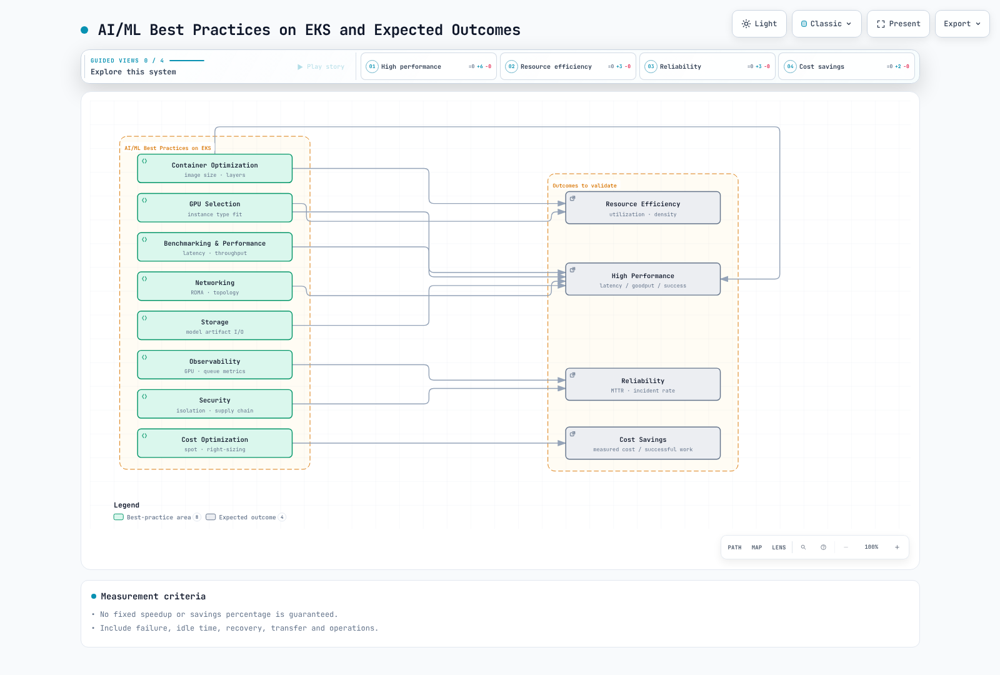
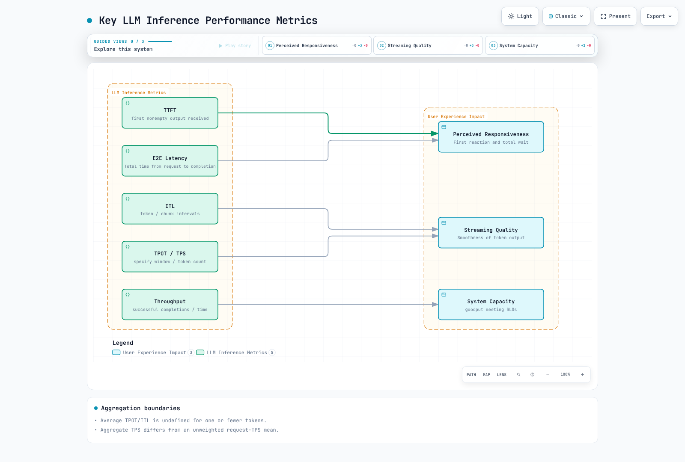

# Mejores prácticas de AI/ML en EKS

> **Última actualización**: September 12, 2026
> **Líneas base**: inference-perf0.6.1 / SOCI0.15.0 / Karpenter1.14.1 / External Secrets2.10.0

Evalúe las mejoras usando latencia, tasa de éxito, throughput, costo y recuperación para la misma carga de trabajo. Una GPU, snapshotter o función de compartición no garantiza una aceleración fija ni un porcentaje de ahorro.



[Ver diagrama interactivo](https://www.atomai.click/kubernetes-docs/archmaps/en-ai-ml-07-ai-ml-best-practices-0.html)

## Benchmarking de inferencia de LLM



[Ver diagrama interactivo](https://www.atomai.click/kubernetes-docs/archmaps/en-ai-ml-07-ai-ml-best-practices-1.html)

| Métrica | Definición y advertencias |
| --- | --- |
| TTFT | Salida **no vacía** recibida desde el envío hasta la primera; el primer frame HTTP/SSE no tiene por qué contener un token |
| ITL | Intervalos entre tokens/chunks; un chunk de red puede contener varios tokens |
| TPOT | Promedio definido por la herramienta después del primer token; no definido para uno o menos tokens de salida |
| E2E | Tiempo desde la solicitud hasta la finalización; registre los límites de cola, red y postprocesamiento |
| Throughput de solicitudes | Solicitudes completadas correctamente / ventana de medición especificada |
| Throughput de tokens | Suma de tokens de salida en la ventana / tiempo, no una media sin ponderar de TPS de solicitudes |
| Goodput | Tasa de solicitudes que cumplen los criterios de éxito y latencia del SLO |

Con marcas de tiempo reales de tokens, el ITL medio es (tiempo del último token - tiempo del primero)/(tokens-1). Las respuestas sin streaming no pueden medir el TTFT/ITL real. Especifique tokenizer, salida vacía/de un solo token, fallos y exclusiones de warmup. 500ms/50ms no son SLO universales.

### inference-perf y GenAI-Perf

inference-perf es una herramienta de benchmarking de Kubernetes SIGs/wg-serving. El paquete PyPI inspeccionado es0.6.1, mientras que el pyproject de su tag de Git todavía indica0.5.0; esta discrepancia de metadatos está registrada. El CLI real usa --config_file u opciones estructuradas como --server.type, no la antigua interfaz de benchmark --endpoint --prompt-length.

Esta configuración de **mock interno** no llama a un servidor de modelos. El CLI real0.6.1 completó tres solicitudes con un worker. Los conteos de tokens del mock son cero y TTFT/TPOT son null, por lo que no son resultados de rendimiento del modelo.

```yaml
api:
  type: chat
  streaming: false
data:
  type: mock
load:
  type: concurrent
  stages:
    - concurrency_level: 1
      num_requests: 3
  num_workers: 1
  worker_max_concurrency: 1
  base_seed: 17
server:
  type: mock
  base_url: http://127.0.0.1:8000
report:
  request_lifecycle:
    summary: true
    per_stage: true
    per_request: true
storage:
  local_storage:
    path: ./benchmark-fixture-results
```

```bash
inference-perf --config_file benchmark-fixture.yaml
```

Antes de cambiar a un endpoint real, verifique los tipos de servidor/API, alias de modelos, streaming, tokenizer y autenticación. La configuración puede contener headers secretos y se registra la configuración combinada, así que valide la entrega/enmascaramiento de credenciales. Conserve los archivos de salida, solicitudes/respuestas sin procesar y fallos, respetando la privacidad del dataset y los permisos de uso.

La tasa constante/Poisson mide llegadas por segundo; la carga concurrente controla la concurrencia. Configuraciones numéricas iguales no son equivalentes. Pruebe una línea base de una sola solicitud, rampas de carga acotadas, ráfagas y distribuciones realistas. Una curva de saturación por sí sola no demuestra un cuello de botella de CPU/GPU/memoria; inspeccione profiling, colas, redes y capacidad del cliente.

Use las [opciones auditadas de profile/endpoint/service/token](04-inference-frameworks.md) de GenAI-Perf0.0.16, no combinaciones inventadas de --backend vllm. Las métricas de GPU necesitan una recopilación independiente; compruebe los límites de CPU/red del generador de carga. Los Jobs de benchmark necesitan imágenes verificadas, claves de configuración, PVCs, deadlines y semántica de reintentos que tenga en cuenta la carga duplicada.

## Optimización del inicio de contenedores


[Ver diagrama interactivo](https://www.atomai.click/kubernetes-docs/archmaps/en-ai-ml-07-ai-ml-best-practices-2.html)

Mida por separado la transferencia de imágenes, el desempaquetado, la descarga/carga del modelo y la preparación. Se eliminaron las tablas sin fuentes de “always5–15minutes” y “80–95%savings”. 45GB/1Gbps≈360seconds es solo aritmética idealizada de transferencia, sin incluir tamaño comprimido, protocolo, disco ni sobrecarga de concurrencia; no es un tiempo de pull medido.

Los artefactos externos del modelo pueden reducir cambios/pulls de imagen, pero añaden costos de descarga y gestión de caché. Las imágenes preparadas pueden ser apropiadas en algunos entornos. La inicialización debe propagar fallos y verificar la revisión, checksums y finalización. Se eliminó el anterior sync de S3 seguido de un echo exitoso porque podía ocultar un fallo de descarga.

Los builds multietapa deben alinear el intérprete/ABI de Python y las bibliotecas CUDA/runtime, incluidos ejecutables/bibliotecas compartidas. No suponga que Ubuntu22.04 python3.11 y pip3 usan el mismo intérprete ni copie solo site-packages. Use paquetes/wheels de distribución compatibles y pruebe importaciones/entrypoints dentro de la imagen. Prefiera sistemas de archivos raíz de solo lectura con mounts explícitos y escribibles de caché/tmp/modelo.

### SOCI0.15

SOCI admite carga diferida de imágenes, pero los beneficios pueden reducirse cuando el inicio lee inmediatamente todos los pesos/bibliotecas. Tener un índice no configura CRI para usar el snapshotter SOCI. Verifique la integración de containerd/CRI, los digests de imagen/índice y la compatibilidad del registry. Se eliminó el DaemonSet privilegiado no verificado que exponía sockets de containerd del host.

La versión0.15 create/push acepta referencias de imagen posicionales, no --ref. La guía de inicio actual usa convert para crear imágenes habilitadas para SOCI. El modo independiente procesa layouts OCI locales sin containerd ni sudo.

```bash
soci convert --standalone --format oci-dir input-oci-layout output-soci-layout
```

Las entradas deben ser layouts OCI, no tarballs docker-save ordinarios. La conversión puede fallar si todas las capas son menores que min-layer-size. Esta auditoría convirtió una capa sintética con min-layer-size=0 explícito y verificó ocho digests de blobs. No se ejecutó ningún benchmark de inicio de contenedores. Conserve la imagen/índice convertido juntos al publicar.

### Bootstrap de Bottlerocket

En1.64, `bootstrap-containers.<name>.user-data` son datos **base64**, consumidos como archivo por el contenedor bootstrap. El texto de shell sin formato en settings no se ejecuta automáticamente. La imagen de origen debe ser real y usar correctamente los almacenes/namespaces de imágenes del host. Una etiqueta estática images-prefetched=true no es evidencia de éxito.

mode=once pasa a off después de ejecutarse. El fallo de essential=true detiene el arranque; false permite el fallo, por lo que debe alinear la configuración con las necesidades de preparación. allowed-unsafe-sysctls no es un interruptor para contenedor privilegiado. Incluya el efecto del prefetch en el tiempo de preparación del nodo en las mediciones.

## Selección de GPU, Neuron y almacenamiento

Parámetros×bytes es solo el límite inferior de los pesos. Incluya caché KV consciente de la arquitectura, activaciones, workspace, buffers de comunicación, fragmentación y restricciones de sharding. Los pesos de13B FP16≈26GB no caben en24GB;70B FP16≈140GB supera cuatro GPUs de24GB combinadas. Más CPUs host no amplían la VRAM de GPU sin cambios.

Distinga p4d.24xlarge8×40GB de los A100 p4de8×80GB. G5g usa Arm/T4G; verifique la arquitectura de imagen/kernel. Consulte la [tabla auditada de Inf2](04-inference-frameworks.md) para inf2.48xlarge192vCPUs/768GiB de RAM host,12chips/24NeuronCores/384GiB HBM. Un nombre de familia como P5 no fija los conteos de GPU en todos los tamaños. Vuelva a comprobar las generaciones, regiones, cuotas y precios disponibles al elegir.

LoRA reduce el estado entrenable del adaptador, pero conserva los pesos/activaciones base y difiere de QLoRA. No use una función que suponga que la mayoría de los modelos LoRA caben en24GB. Mida la memoria máxima, latencia, throughput y reinicios.

No seleccione almacenamiento únicamente por un corte de dataset de10TB. Compare patrones de acceso, concurrencia, metadatos, latencia, semántica, durabilidad y costo. La documentación general actual de gp3 enumera una línea base de3000IOPS/125MiB/s y un máximo de80000IOPS/2000MiB/s, sujetos a restricciones de tamaño/IOPS/instancia; Outposts es diferente. Los límites históricos de16000IOPS/1GB/s no son universalmente actuales.

Use la [guía de infraestructura](06-ai-infrastructure.md) para throughput Elastic de EFS, asociaciones FSx/CSI/S3 y límites POSIX de Mountpoint. S3 no tiene ni throughput infinito ni latencia fija; EFS no es universalmente más lento que FSx. Instance store/tmpfs son efímeros. La caché KV de GPU normalmente reside en la memoria de GPU, no automáticamente en SSD/tmpfs.

### Verificación de la caché del modelo

Un archivo config.json no demuestra que los pesos terminaron de descargarse. Verifique **todos los archivos** contra un manifiesto/revisión de lanzamiento confiable antes de exponer almacenamiento inmutable de solo lectura. Evite las carreras de descargadores concurrentes y los archivos escritos parcialmente.

Este validador local no realiza descargas/eliminaciones. Las pruebas cubren archivos completos, revisiones incorrectas, pesos parciales/faltantes, traversal y symlinks externos. La confianza en el manifiesto y la inmutabilidad posterior a la verificación siguen siendo requisitos independientes.

```python
from pathlib import Path
import hashlib
import re


def verify_model_cache(root, manifest, expected_revision):
    """Verify files against a separately trusted release manifest; no downloads/deletion."""
    root = Path(root).resolve(strict=True)
    if manifest.get("revision") != expected_revision:
        raise ValueError("Model revision mismatch")
    files = manifest.get("files")
    if not isinstance(files, dict) or not files:
        raise ValueError("Empty or invalid release manifest")
    for relative, expected_hash in files.items():
        name = Path(relative)
        if name.is_absolute() or ".." in name.parts or not name.parts:
            raise ValueError("Unsafe manifest path")
        if not isinstance(expected_hash, str) or not re.fullmatch(r"[0-9a-f]{64}", expected_hash):
            raise ValueError("Invalid SHA256")
        target = (root / name).resolve(strict=True)
        if not target.is_relative_to(root) or not target.is_file():
            raise ValueError("File escapes the cache or is not a regular file")
        digest = hashlib.sha256()
        with target.open("rb") as source:
            for chunk in iter(lambda: source.read(1024 * 1024), b""):
                digest.update(chunk)
        if digest.hexdigest() != expected_hash:
            raise ValueError("Incomplete or corrupt model file: " + relative)
    return root
```

Los checkpoints necesitan estado de optimizer/RNG/cursor de datos y shard como en el [ejemplo de entrenamiento/recuperación](05-model-training.md). No elimine copias válidas anteriores antes de que se completen la transferencia, checksums y los manifiestos de finalización. Se eliminó el antiguo bucle ls/xargs rm -rf porque confundía el contenido de directorios con rutas de checkpoints e intentaba eliminar mediante un mount de solo lectura. Retrasar el primer sync30minutes u omitir el flushing al terminar aumenta la exposición a pérdida de trabajo.

## Redes y scheduling

EFA mejora la comunicación para cargas de trabajo adecuadas; no es necesario para toda ejecución DDP. Verifique interfaces, ubicación en la misma AZ, driver/libfabric/aws-ofi-nccl, recursos de Pod, security groups y transporte real. Las etiquetas RAID0/subnet no lo habilitan. Evite NCCL_TIMEOUT no verificado y configuraciones Ring/Simple/IB_DISABLE copiadas a ciegas. torchrun --nnodes cuenta nodos, no el WORLD_SIZE total de procesos.

Use el placementGroupSelector real de Karpenter1.14.1. Una etiqueta aws:ec2:placement-group no es la API de placement, y aws: no es un namespace de etiquetas de usuario. Este **ejemplo de esquema** requiere identificadores aprobados de AMI/subnet/SG/rol y un placement group existente. El ejemplo especifica amiFamily AL2023, por lo que el reemplazo debe ser una AMI EKS AL2023 validada, no una AMI para otro OS. No completa la configuración de networkInterfaces de EFA.

```yaml
apiVersion: karpenter.k8s.aws/v1
kind: EC2NodeClass
metadata:
  name: prepared-gpu-class
spec:
  role: REPLACE_WITH_APPROVED_NODE_ROLE
  amiSelectorTerms:
  - id: ami-0123456789abcdef0
  subnetSelectorTerms:
  - id: subnet-0123456789abcdef0
  securityGroupSelectorTerms:
  - id: sg-0123456789abcdef0
  placementGroupSelector:
    name: prepared-training-placement-group
  amiFamily: AL2023
```

### Presupuestos de disrupción y Spot

Este presupuesto se aplica de lunes a viernes **09:00–17:00UTC**. El antiguo0 9-17 * * 1-5 iniciaba una ventana de ocho horas cada hora hasta las17:00, extendiendo la protección hasta las01:00 del día siguiente. Los presupuestos concurrentes usan la restricción más estricta y no siguen automáticamente las zonas horarias locales.

```yaml
apiVersion: karpenter.sh/v1
kind: NodePool
metadata:
  name: reviewed-gpu-pool
spec:
  template:
    spec:
      nodeClassRef:
        group: karpenter.k8s.aws
        kind: EC2NodeClass
        name: prepared-gpu-class
      requirements:
      - key: karpenter.sh/capacity-type
        operator: In
        values:
        - on-demand
        - spot
  disruption:
    consolidationPolicy: WhenEmptyOrUnderutilized
    consolidateAfter: 5m
    budgets:
    - nodes: '0'
      schedule: 0 9 * * 1-5
      duration: 8h
    - nodes: 30%
```

budgets.nodes=0 limita la disrupción voluntaria, no las interrupciones Spot, fallos de nodo ni expiración forzada. Los requisitos solo de Spot son obligatorios, no una preferencia con fallback on-demand. La distribución de topología ScheduleAnyway es flexible; verifique las réplicas reales, la capacidad y la distribución de AZ.

terminationGracePeriodSeconds=120 no garantiza que EC2 conceda120seconds. Pruebe la preparación/drenaje del gateway, propagación de endpoints, SIGTERM, streams activos, reintentos y duplicados mediante una terminación real. No invente una API /drain de vLLM. Las cachés de inferencia, sesiones y grupos TP conllevan costos de estado/reinicio.

## Observabilidad y costo

Use las [métricas actuales de vLLM](02-vllm-deployment.md) y las [reglas de DCGM](06-ai-infrastructure.md). La ocupación de KV es vllm:kv_cache_usage_perc, no la antigua gpu_cache_usage_perc. Observe colas/preemption y el comportamiento del backend en lugar de suponer que una caché llena rechaza solicitudes de inmediato. Derive ratios de aciertos de prefijo a partir de los contadores actuales de hit/query con manejo de denominador cero.

DCGM FB_USED/FREE son gauges MiB; XID_ERRORS es el último código. Evite FB_TOTAL inexistente o increase() en gauges. La temperatura por sí sola no demuestra thermal throttling; compare clocks, potencia, razones de throttle y carga de trabajo. Haga coincidir las etiquetas/agregación de histogramas de Prometheus y use sintaxis de subconsulta válida para avg_over_time sobre expresiones.

VPA Off proporciona recomendaciones de CPU/memoria, no selección automática de instancias GPU. Se eliminó el anterior script de rightsizing porque inspeccionaba solo la primera serie y comparaba ratios0–1 con50/90. Inspeccione picos, colas, SLOs y recuperación después de eliminar en todas las cargas de trabajo.

Registre los ahorros usando términos reales de región/OS/compra, utilización, tiempo inactivo/de fallo, almacenamiento, transferencia y operaciones. Spot/Savings Plans/RI difieren en descuentos y garantías de capacidad. Evite tablas fijas de60–90% o sumar porcentajes de ahorro de optimización. Tome las decisiones de compra de compromisos por separado usando líneas base y variabilidad medidas.

## Acceso a modelos y gestión de secretos

S3 ListBucket y GetObject usan ARN de bucket/objeto y claves de condición compatibles, respectivamente. Los buckets de propósito general pueden usar condiciones de etiqueta de bucket como aws:ResourceTag/Environment después de habilitar explícitamente ABAC. ABAC está deshabilitado por defecto: verifique el estado del bucket, permisos confiables de administración de etiquetas, políticas de identidad/bucket y el emparejamiento acción/recurso en lugar de copiar solo la condición de etiqueta. La habilitación no crea el Allow requerido ni anula otras políticas Deny. Verifique namespace/nombre de ServiceAccount confiable, cadenas de credenciales de SDK e identidad de solicitud real. vLLM no descarga automáticamente cada URI de modelo S3.

El CRD ESO2.10.0 inspeccionado **sirve v1**, con v1beta1 served=false. Este ejemplo hace referencia a un SecretStore del mismo namespace ya aprobado. Prepare por separado las claves remotas, permisos, rotación y ciclo de vida del destino.

```yaml
apiVersion: external-secrets.io/v1
kind: ExternalSecret
metadata:
  name: model-download-token
  namespace: ai-ml
spec:
  refreshPolicy: Periodic
  refreshInterval: 1h
  secretStoreRef:
    name: approved-secrets-manager
    kind: SecretStore
  target:
    name: model-download-credential
    creationPolicy: Owner
  data:
  - secretKey: token
    remoteRef:
      key: approved/model-download
      property: token
```

Monte los Secrets de Kubernetes como volúmenes y haga que las aplicaciones relean archivos cuando sea necesario. Los mounts subPath no reciben actualizaciones automáticas; las variables de entorno o los valores leídos solo al inicio no se recargan automáticamente. La actualización de ESO no es la emisión/rotación de credenciales upstream en sí misma. Verifique por separado la rotación del proveedor, el acceso a Secret y la recarga de la aplicación.

Los registros de API de CloudTrail Secrets Manager no capturan cada lectura de aplicación de un archivo Secret local. No afirme que kubectl describe imprime en general valores SecretKeyRef, pero la entrega mediante entorno sigue exponiendo superficies de proceso/debugging y difiere de una política de credenciales en archivo. Nunca imprima secretos reales en ejemplos/logs.

NetworkPolicy requiere aplicación por CNI. Verifique la semántica AND/OR del selector, las etiquetas de nombre de namespace predeterminadas y DNS tanto TCP como UDP. Se eliminaron la apertura de comprobación de estado10.0.0.0/8 y la regla “internet443means S3-only”. Con modelos preparados, restrinja el egress en runtime a las rutas necesarias y distinga las APIs de inferencia/gestión en el gateway.

Los registros de auditoría deben capturar identidad de usuario/carga de trabajo, revisión del modelo, acción, resultado e ID de solicitud, enmascarando u omitiendo los prompts y secretos según corresponda. Analizar los logs CRI de containerd como Docker o conservar solo líneas que contienen request puede perder eventos de auditoría. Verifique los collectors, parsers, IAM, buffers, retención y fallos de entrega reales, no solo un ConfigMap.

## Alcance de la verificación

Se revisaron toda la prosa original de la guía/quiz y87 bloques de código únicos. La validación incluye tres solicitudes mock nativas de inference-perf, conversión SOCI OCI local, seis casos de caché, tres esquemas Karpenter/ESO y aritmética cron. No se ejecutaron benchmarks de GPU/modelo real, mediciones de inicio de contenedor, instalación SOCI en host, recursos cloud ni proveedor de secretos.

## Referencias

- [inference-perf0.6.1](https://github.com/kubernetes-sigs/inference-perf/tree/v0.6.1)
- [CLI SOCI0.15](https://github.com/awslabs/soci-snapshotter/blob/v0.15.0/docs/cli-usage.md)
- [Configuración bootstrap de Bottlerocket1.64](https://bottlerocket.dev/en/os/1.64.x/api/settings/bootstrap-containers/)
- [CRDs de Karpenter1.14.1](https://github.com/aws/karpenter-provider-aws/tree/v1.14.1/pkg/apis/crds)
- [Disrupción de Karpenter](https://karpenter.sh/docs/concepts/disruption/)
- [CRD ExternalSecret de ESO2.10](https://github.com/external-secrets/external-secrets/blob/helm-chart-2.10.0/config/crds/bases/external-secrets.io_externalsecrets.yaml)
- [Actualizaciones de Secret de Kubernetes](https://kubernetes.io/docs/concepts/configuration/secret/)
- [Habilitación ABAC de bucket de propósito general de S3](https://docs.aws.amazon.com/AmazonS3/latest/userguide/buckets-tagging-enable-abac.html)
- [Rendimiento de EBS gp3](https://docs.aws.amazon.com/ebs/latest/userguide/general-purpose.html)

## Cuestionario

[Cuestionario de mejores prácticas de AI/ML](../quizzes/ai-ml/07-ai-ml-best-practices-quiz.md)
