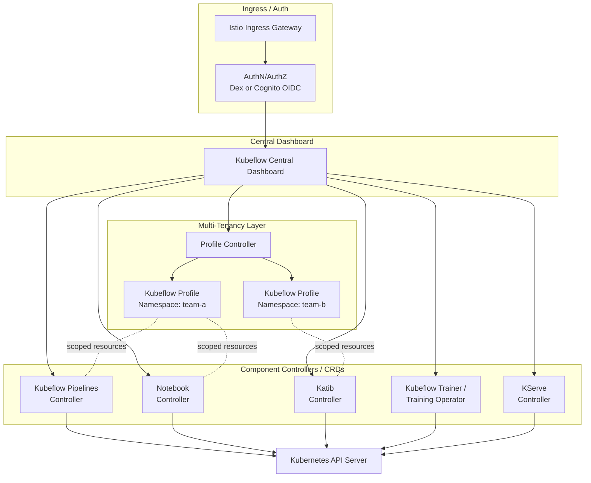

# Parte 1: Arquitectura e instalación de Kubeflow en EKS

> **Versiones compatibles**: Kubeflow Community Distribution 26.03 (Kubeflow Pipelines 2.16.0, Katib 0.19.0), Kubernetes 1.34+
> **Última actualización**: August 19, 2026

## Configuración del entorno de laboratorio

Para seguir los ejemplos de este documento, necesitarás las siguientes herramientas y entorno:

### Herramientas necesarias

* kubectl v1.34 o posterior
* Un clúster de Amazon EKS funcional
* kustomize (incluido con las versiones recientes de kubectl o instalado de forma independiente) para la implementación basada en manifests
* Terraform, si planeas usar en su lugar la ruta de implementación basada en Terraform
* Un rol de IAM asociado a una cuenta de servicio de Kubernetes (IRSA o EKS Pod Identity) para los Pods que necesiten acceder a S3 o RDS
* Un grupo de usuarios de Amazon Cognito, si planeas usar Cognito para la autenticación del clúster en lugar de Dex incluido

## ¿Qué es Kubeflow?

Kubeflow es una plataforma de machine learning de código abierto que se ejecuta de forma nativa en Kubernetes. En lugar de ser una sola herramienta, es una distribución que agrupa un conjunto de componentes desarrollados de forma independiente bajo una instalación y un Central Dashboard:

- **Kubeflow Pipelines** — orquesta flujos de trabajo de ML de varios pasos como grafos acíclicos dirigidos (DAGs) de pasos en contenedores.
- **Notebooks** — aprovisiona servidores de notebooks Jupyter (y otros) como Pods de Kubernetes, delimitados al namespace de un usuario.
- **Katib** — ejecuta ajuste de hiperparámetros y búsqueda de arquitectura neuronal como trabajos nativos de Kubernetes.
- **Kubeflow Trainer** — programa trabajos de entrenamiento distribuido (el Training Operator heredado y su sucesor v2, ambos cubiertos en esta serie).
- **KServe** — sirve modelos entrenados como endpoints de inferencia escalables, incluso mediante una aplicación web dedicada en el dashboard.

La propuesta de valor es que todos estos componentes se sitúan sobre la misma API de Kubernetes, el mismo modelo de RBAC y namespaces, y el mismo cómputo subyacente; por lo tanto, un equipo de plataforma que ya opera Kubernetes no necesita implementar una segunda pila para cargas de trabajo específicas de ML.

### Graduación de CNCF — 17 de agosto de 2026

El 17 de agosto de 2026, la [Cloud Native Computing Foundation anunció](https://www.cncf.io/announcements/2026/08/17/cncf-announces-kubeflows-graduation-solidifying-the-standard-for-cloud-native-ai-operations/) que **Kubeflow se ha graduado** — el nivel de madurez más alto de CNCF, reservado para proyectos que han demostrado una amplia adopción en producción, una base saludable de contribuidores de múltiples proveedores y una gobernanza sólida. Kubeflow ingresó a CNCF como un proyecto incubado en 2023 (se originó en Google en 2017), y alcanzar la graduación le exigió superar una auditoría de seguridad independiente realizada por terceros y establecer un comité directivo formal para la gobernanza del proyecto. Para los equipos de plataforma que evalúan Kubeflow, la graduación es una señal significativa: ya no se considera una apuesta en etapa temprana, sino un proyecto que CNCF considera suficientemente estable para cargas de trabajo de AI reguladas y de producción.

## Modelo de lanzamiento y versión actual

La **Kubeflow Community Distribution** — la distribución de referencia mantenida por el propio proyecto Kubeflow, distinta de las distribuciones de proveedores como la que AWS empaqueta mediante `kubeflow-manifests` — utiliza **versionado de calendario** (`YY.MM.patch`), con aproximadamente dos lanzamientos base por año. Al momento de escribir esto, el lanzamiento base es **26.03**, que incluye:

| Componente | Versión en 26.03 |
| --- | --- |
| Kubeflow Pipelines | 2.16.0 |
| Aplicación web de KServe | 0.16.1 |
| Training Operator (v1 heredado) | 1.9.2 |
| Kubeflow Trainer (v2) | v2.1.0 |
| Katib | 0.19.0 |
| Notebooks | acercándose a un lanzamiento v2 |

Un parche posterior, **26.03.1**, incrementó aún más varias de estas versiones (Kubeflow Pipelines 2.16.1, aplicación web de KServe v0.18.0, Kubeflow Trainer v2.2.0, `workspaces` v2 de Notebooks alcanzando beta); consulta siempre los [lanzamientos de Kubeflow Community Distribution](https://github.com/kubeflow/community-distribution/releases) para conocer el nivel de parche actual, en lugar de asumir que 26.03 sigue siendo el más reciente.

Un matiz que conviene señalar ahora: **Kubeflow Trainer v2** — construido alrededor de los nuevos recursos personalizados `TrainJob`, `ClusterTrainingRuntime` y `TrainingRuntime` — es el sucesor designado por el proyecto para el Training Operator heredado (v1) distribuido como 1.9.2 en 26.03. Ambos existen en paralelo durante este período de transición. La parte 5 de esta serie cubre en profundidad las API y la ruta de migración de Trainer v2; para esta parte enfocada en la instalación, basta con saber que el número de versión del Training Operator de una distribución no cuenta toda la historia sobre la API de entrenamiento contra la que realmente escribirás trabajos.

## Arquitectura de componentes

La arquitectura de Kubeflow se centra en un API server de Kubernetes compartido con el que todos los componentes se comunican como un conjunto de controllers y CRDs, con una capa de multi-tenancy basada en Istio que proporciona aislamiento de namespaces y un Central Dashboard que ofrece un único punto de entrada de UI.

Algunos puntos que vale la pena destacar:

- **Profiles como límite de tenancy.** Un "Kubeflow Profile" es un namespace de Kubernetes más un conjunto de enlaces RBAC, cuotas de recursos y objetos `AuthorizationPolicy` de Istio, todo reconciliado por el Profile Controller desde un único recurso personalizado `Profile`. Cada usuario o equipo normalmente obtiene un profile, y todos los demás componentes (Notebooks, ejecuciones de Pipelines, experimentos de Katib) crean sus recursos dentro del namespace de profile del usuario solicitante.
- **Istio como mecanismo de aislamiento.** Kubeflow se apoya en los proxies sidecar de Istio y los recursos `AuthorizationPolicy` para garantizar que una solicitud destinada al namespace de un profile no pueda ser atendida por cargas de trabajo de otro; esto es lo que hace posible la multi-tenancy sin que cada componente reinvente su propia lógica de autorización.
- **Componentes como controllers independientes.** Pipelines, Notebooks, Katib, Trainer y KServe son conjuntos separados de controllers y CRDs que se reconcilian contra el mismo API server de Kubernetes. Por eso los lanzamientos de Kubeflow se describen como una "distribución": el proyecto fija versiones compatibles de cada componente y las distribuye juntas, pero cada una tiene versiones independientes y, en principio, podría ejecutarse por sí sola.

## Enfoques de instalación en EKS

Los manifests upstream de Kubeflow asumen una implementación bastante autocontenida: Dex para autenticación, un StatefulSet de MySQL dentro del clúster para los metadatos de Pipelines/Katib y MinIO para el almacenamiento de artefactos de Pipelines. Ninguno de esos valores predeterminados es ideal para una implementación de EKS en producción, por lo que AWS mantiene **`awslabs/kubeflow-manifests`**, un overlay de distribución que sustituye las dependencias autohospedadas incluidas de Kubeflow por servicios gestionados de AWS:

| Valor predeterminado de Kubeflow | Reemplazo nativo de AWS |
| --- | --- |
| Dex (OIDC estático o respaldado por LDAP) | Grupo de usuarios de Amazon Cognito como proveedor de OIDC |
| MySQL dentro del clúster para metadatos de Pipelines/Katib | Amazon RDS (compatible con MySQL) |
| MinIO para almacenamiento de artefactos de Pipelines | Amazon S3 |

`awslabs/kubeflow-manifests` documenta dos rutas de implementación paralelas para conectar estas sustituciones:

1. **Basada en manifests (`kustomize`)** — un conjunto de overlays de kustomize superpuestos sobre los manifests upstream de Kubeflow, aplicados directamente con `kubectl apply -k` contra instancias de RDS, buckets de S3 y un grupo de usuarios de Cognito preexistentes (o creados recientemente).
2. **Basada en Terraform** — módulos de Terraform que aprovisionan la infraestructura de AWS de soporte (RDS, S3, Cognito, roles de IAM) y luego impulsan la instalación de manifests basada en kustomize como parte del mismo apply, de modo que el lado de AWS y el lado de Kubernetes se implementan juntos, en lugar de como dos pasos desconectados.

Cuál elegir es principalmente una cuestión de cómo ya está aprovisionado el resto de tu infraestructura: los equipos que gestionan add-ons de EKS y recursos de AWS de soporte con Terraform en otros lugares normalmente preferirán la ruta de Terraform por coherencia; los equipos que prefieren una instalación más manual e inspeccionable —o que ya tienen RDS/S3/Cognito aprovisionados mediante alguna otra herramienta de IaC— a menudo comienzan con la guía simple de kustomize.

## Patrón de acceso de IAM: IRSA, KFPv2 y la transición hacia Pod Identity

Conceder a los Pods de Kubeflow Pipelines acceso a su bucket de artefactos de S3 es la primera decisión de IAM que surge en cualquier instalación de EKS, y tiene una historia que vale la pena entender en lugar de pasar por alto:

- **IRSA ha sido el mecanismo estándar** para vincular un rol de IAM a una cuenta de servicio de Kubernetes, de modo que los Pods de Pipelines puedan leer y escribir en S3 sin credenciales estáticas de larga duración: el enfoque habitual de mínimo privilegio y delimitado por Pod que `kubeflow-manifests` documenta para la ruta de implementación de RDS/S3.
- **El soporte de IRSA específicamente para KFPv2 históricamente se ha retrasado.** Las guías anteriores de `kubeflow-manifests` indicaban que IRSA era compatible con pipelines de KFPv1, pero aún no con KFPv2, y recomendaban provisionalmente una solución alternativa que usaba un usuario de IAM dedicado con credenciales estáticas para implementaciones de KFPv2, mientras se esperaba el soporte de IRSA para KFPv2.
- **EKS Pod Identity es la dirección hacia la que avanzan los nuevos enlaces de IAM a Pods en EKS en general.** Es el mecanismo más nuevo y sencillo hacia el que AWS ha estado orientando a los clientes para conceder permisos de AWS a los Pods, y se aplica ampliamente en cargas de trabajo de EKS, no solo en Kubeflow. Conviene confirmar directamente en la documentación actual de `awslabs/kubeflow-manifests` si la guía de Pipelines ha incorporado completamente el soporte de Pod Identity para KFPv2 cuando leas esto, en lugar de construir una instalación basándote en una u otra suposición. Esta es un área que evoluciona rápidamente en la distribución de AWS, y es el tipo de detalle que es mejor verificar en tiempo real que asumir a partir de documentación anterior.

La conclusión práctica: no codifiques de forma rígida una suposición sobre qué mecanismo (IRSA, una solución alternativa con usuario de IAM o Pod Identity) se requiere actualmente para tu versión específica de Pipelines; consulta la guía actual del componente antes de aprovisionar recursos de IAM.

## Por qué ejecutar Kubeflow en EKS en lugar de una alternativa gestionada

Amazon SageMaker (y plataformas de ML totalmente gestionadas similares) elimina prácticamente toda la superficie operativa cubierta en este documento: no hay manifests que aplicar, controllers que actualizar ni mesh de Istio que analizar. Esa es una opción legítima y a menudo correcta, especialmente para equipos sin capacidad operativa existente en Kubernetes.

Kubeflow en EKS justifica su complejidad cuando algunas cosas ya son ciertas en tu entorno:

- **Ya ejecutas cargas de trabajo mixtas en EKS.** Si el procesamiento de datos, los servicios de aplicaciones y el entrenamiento de ML necesitan compartir los node pools de un clúster, el escalado automático de Karpenter y la pila de observabilidad, ejecutar la plataforma de ML como otro conjunto de controllers de Kubernetes evita mantener un segundo modelo operativo paralelo.
- **Necesitas portabilidad o quieres evitar el lock-in de plataforma.** Los pipelines, trabajos de entrenamiento y manifests de serving de Kubeflow son artefactos nativos de Kubernetes; el mismo YAML puede, con mayor o menor esfuerzo, ejecutarse en cualquier clúster de Kubernetes conforme, lo que importa para estrategias multi-cloud o de on-prem más cloud.
- **Quieres control detallado sobre la pila de entrenamiento/serving.** Los runtimes de entrenamiento personalizados, un comportamiento específico de programación de aceleradores o frameworks de serving no expuestos de la manera que necesitas mediante un servicio gestionado son más fáciles de adaptar cuando posees los controllers subyacentes.

La contrapartida es real: tu equipo asume la gestión de actualizaciones de manifests y CRDs, conocimientos operativos de Istio y la infraestructura de IAM/red descrita anteriormente. Como ocurre con las secciones "por qué ejecutar esto en EKS" de este sitio de documentación para otras herramientas de datos y ML, esto no es un argumento de que Kubeflow sea estrictamente mejor que SageMaker; es una descripción de las condiciones bajo las cuales vale la pena asumir el costo operativo adicional.

## Próximos pasos

La parte 2 de esta serie cubre Kubeflow Pipelines en profundidad: creación de pipelines, el SDK de KFP y patrones de almacenamiento de artefactos/metadatos en EKS.

[Volver a la página principal](./README.md)

## Cuestionario

Para comprobar lo que has aprendido en este capítulo, prueba el [Cuestionario del tema](../../quizzes/ai-ml/kubeflow/01-architecture-installation-quiz.md).
