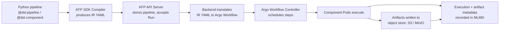

# Parte 2: Kubeflow Pipelines

> **Versiones compatibles**: Kubeflow Pipelines 2.16.0, Kubeflow Community Distribution 26.03
> **Última actualización**: August 19, 2026

## Configuración del entorno de laboratorio

Para seguir los ejemplos de este documento, necesitará las siguientes herramientas y entorno:

### Herramientas necesarias

* Python 3.10+ con el SDK `kfp` (`pip install kfp`) instalado localmente para compilar pipelines
* kubectl v1.34 o posterior, configurado para un clúster con Kubeflow Pipelines instalado (consulte la Parte 1)
* Un rol de IRSA o una asociación de EKS Pod Identity que conceda acceso a S3, si planea configurar el almacén de artifacts de KFP en S3 (consulte "Almacenamiento de artifacts específico de EKS" más abajo)

## Qué es Kubeflow Pipelines

Kubeflow Pipelines (KFP) es el motor de orquestación de workflows dentro de la plataforma Kubeflow para crear, ejecutar y rastrear pipelines de ML: DAG de pasos en contenedores, cada uno con entradas y salidas tipadas. Puede crear un pipeline en Python mediante el SDK de KFP, compilarlo y enviarlo al backend de KFP, que programa cada paso como un Pod y rastrea el estado y los artifacts de la ejecución.

Internamente, el backend de KFP se basa en [Argo Workflows](https://argoproj.github.io/workflows/): una vez que un pipeline compilado llega al servidor de API de KFP, se traduce a un recurso `Workflow` de Argo, y el controlador de Argo es quien realmente crea y secuencia los Pods. KFP añade las capas que Argo no proporciona por sí solo: un SDK de Python para la creación, una UI para explorar ejecuciones y artifacts, un modelo de seguimiento de Experiment/Run y el almacén de ML Metadata (MLMD) para el linaje.

## Arquitectura de KFP v2: YAML de IR en lugar de YAML de Argo directo

Kubeflow Pipelines 2.16.0 es la versión incluida en la versión 26.03 de Kubeflow Community Distribution. Se basa en el SDK y backend de KFP v2, que cambiaron la forma en que una definición de pipeline en Python se convierte en un workflow ejecutable en comparación con el SDK v1 heredado:

* **SDK v1**: `dsl-compile` compilaba una función de pipeline de Python directamente en un manifiesto YAML de `Workflow` de Argo. El artifact compilado era específico de Argo; si quería un backend diferente, necesitaría un compilador distinto.
* **SDK v2**: el pipeline se compila en un **YAML de representación intermedia (IR)**: un `PipelineSpec` independiente del backend que describe el DAG, los componentes, los artifacts tipados y los parámetros. Después, el backend de KFP traduce esa IR en un `Workflow` de Argo en el momento del envío.

El beneficio práctico es una especificación de pipeline estable y documentada que no está ligada al modelo de objetos de Argo. También significa que el artifact que obtiene de `kfp.compiler.Compiler().compile(...)` —el YAML de IR— es lo que entregaría a cualquier backend compatible con KFP, y lo que el servidor de API de KFP almacena y vuelve a enviar en cada ejecución de ese pipeline, en lugar de un manifiesto de Argo de un solo uso.

## Conceptos básicos

* **Pipeline** — un DAG de componentes, creado en Python con el decorador `@dsl.pipeline`, compilado a YAML de IR.
* **Component** — un único paso en contenedor con entradas y salidas tipadas. Creado con `@dsl.component`, un componente se compila en su propia especificación de contenedor; en tiempo de ejecución se convierte en un Pod (o en un paso dentro de un Pod, según la configuración del executor).
* **Run** — una ejecución de un pipeline (o de un único componente) con un conjunto específico de parámetros de entrada.
* **Experiment** — una agrupación con nombre de Runs relacionados, utilizada para organizar y comparar resultados (por ejemplo, diferentes ejecuciones de hiperparámetros del mismo pipeline).
* **Artifact** — una salida tipada que fluye entre componentes, respaldada por un archivo en un almacén de objetos. KFP v2 otorga a los artifacts tipos de primera clase: `Dataset`, `Model`, `Metrics`, `ClassificationMetrics`, `HTML`, `Markdown`; así, la firma de un componente documenta no solo que produce una salida, sino también de qué tipo es.
* **Almacén de ML Metadata (MLMD)** — el almacén subyacente (un servicio respaldado por MySQL en la mayoría de las instalaciones de KFP) que registra cada ejecución de componente, sus entradas/salidas y los artifacts que utilizó. Esto permite a la UI de KFP mostrar el linaje de artifacts: rastrear un modelo entrenado hacia atrás a través del conjunto de datos y el código exactos que lo produjeron, entre distintas ejecuciones.

## Cómo fluye una ejecución de pipeline por el sistema



El trabajo del SDK de KFP termina al producir el YAML de IR; todo lo que ocurre desde el servidor de API en adelante es responsabilidad del backend. Esta separación es exactamente lo que hace concreta la afirmación de una «especificación independiente del backend»: el SDK no sabe ni le importa que Argo Workflows realice la programación internamente.

## Almacenamiento de artifacts específico de EKS

KFP incluye una implementación de MinIO dentro del clúster como almacén de artifacts predeterminado: cada artifact que produce un componente (un `Dataset`, un `Model` entrenado, un archivo de métricas) se escribe en un bucket de MinIO en lugar de en un bucket real de S3, a menos que se reconfigure. Esto está bien para una demostración autocontenida, pero en EKS implica ejecutar y operar un servicio stateful adicional que duplica lo que S3 ya ofrece gratuitamente: durabilidad, acceso desde fuera del clúster y control de acceso basado en IAM.

El proyecto `awslabs/kubeflow-manifests` documenta patrones para configurar el almacén de artifacts de KFP en S3 en lugar de MinIO dentro del clúster: reconfigurar la raíz del pipeline y las credenciales del almacén de objetos para que los componentes lean y escriban directamente en un bucket de S3. Aquí también es donde el mecanismo de identidad descrito en la [Parte 1](./01-architecture-installation.md) se vuelve directamente relevante. Cualquier ServiceAccount bajo el que se ejecuten los Pods de pipeline de KFP (y específicamente el ServiceAccount `pipeline-runner`) necesita un rol de IRSA o una asociación de EKS Pod Identity con permisos sobre ese bucket de S3, ya que las llamadas al almacén de objetos realizadas al escribir o leer artifacts van directamente a AWS en lugar de al endpoint de MinIO dentro del clúster. La Parte 1 cubre en profundidad los mecanismos de configuración de IRSA/Pod Identity; esta sección solo indica en qué punto del ciclo de vida del pipeline se utiliza esa identidad.

## Un pipeline sencillo de dos pasos

Lo siguiente ilustra un pipeline mínimo `data-prep -> train` que utiliza los decoradores del SDK de KFP v2, con un artifact `Dataset` tipado que se pasa del primer componente al segundo:

```python
from kfp import dsl, compiler
from kfp.dsl import Dataset, Model, Output, Input

@dsl.component(base_image="python:3.11-slim")
def prepare_data(output_dataset: Output[Dataset]):
    import pandas as pd

    # In a real pipeline this would read from S3 or another source
    df = pd.DataFrame({"feature": [1, 2, 3, 4], "label": [0, 1, 0, 1]})
    df.to_csv(output_dataset.path, index=False)

@dsl.component(base_image="python:3.11-slim", packages_to_install=["scikit-learn", "pandas"])
def train_model(input_dataset: Input[Dataset], output_model: Output[Model]):
    import pandas as pd
    from sklearn.linear_model import LogisticRegression
    import pickle

    df = pd.read_csv(input_dataset.path)
    clf = LogisticRegression().fit(df[["feature"]], df["label"])
    with open(output_model.path, "wb") as f:
        pickle.dump(clf, f)

@dsl.pipeline(name="data-prep-train-pipeline")
def data_prep_train_pipeline():
    prep_task = prepare_data()
    train_task = train_model(input_dataset=prep_task.outputs["output_dataset"])

compiler.Compiler().compile(
    pipeline_func=data_prep_train_pipeline,
    package_path="data_prep_train_pipeline.yaml",
)
```

Algunos aspectos que conviene destacar de este ejemplo:

* `output_dataset: Output[Dataset]` e `input_dataset: Input[Dataset]` son la forma en que KFP v2 declara parámetros de artifact tipados: el SDK se encarga de conectar `prep_task.outputs["output_dataset"]` con la entrada de `train_model`, incluido el aprovisionamiento de la ruta de almacenamiento en la que cada componente escribe o desde la que lee.
* Cada `@dsl.component` se compila en su propio contexto de compilación de imagen de contenedor (o reutiliza una `base_image` con los paquetes de Python indicados instalados mediante `packages_to_install`), por lo que `prepare_data` y `train_model` se ejecutan como Pods independientes, conectados únicamente a través del artifact declarado.
* `compiler.Compiler().compile(...)` produce el YAML de IR descrito anteriormente: este es el archivo que se cargaría en la UI de KFP o se enviaría mediante el cliente de Python de KFP para crear un Run.

## Comportamiento de caché

KFP almacena en caché la ejecución de un componente calculando un hash de sus entradas (valores de parámetros, contenido de artifacts de entrada y la propia definición del componente). Si una ejecución posterior envía un componente con un hash de entrada que coincide con una ejecución exitosa anterior, KFP omite ejecutarlo de nuevo y reutiliza las salidas en caché; por tanto, volver a ejecutar un pipeline después de corregir solo el paso `train_model` no desperdiciará tiempo ejecutando de nuevo `prepare_data` si sus entradas y código no han cambiado.

Esto resulta conveniente para el desarrollo iterativo, pero puede ocultar silenciosamente una nueva ejecución que realmente deseaba (por ejemplo, un componente que depende de un estado externo que cambió, pero que no se refleja en sus entradas declaradas). La caché se puede deshabilitar:

* Por componente, estableciendo la llamada `set_caching_options(enable_caching=False)` en la tarea dentro de la función de pipeline, por ejemplo, `prep_task.set_caching_options(enable_caching=False)`.
* Por ejecución, deshabilitando la caché para todo el envío del pipeline en lugar de hacerlo componente por componente; el diálogo «Run» de la UI de KFP muestra un selector de caché al momento del envío para este fin.

## Próximos pasos

Con los pipelines creados, compilados y en ejecución, la siguiente pregunta suele ser dónde ocurre inicialmente el trabajo de desarrollo interactivo detrás de esos componentes de pipeline. La [Parte 3: Kubeflow Notebooks](./03-notebooks.md) cubre los entornos de notebook por usuario que los equipos utilizan para crear e iterar sobre el código que termina empaquetado en componentes de pipeline; y, más adelante en esta serie, la [Parte 6: KServe — Model Serving on Kubernetes](./06-kserve.md) cubre el servicio de los modelos que esos pipelines finalmente producen.

[Volver a la página principal](./README.md)

## Cuestionario

Para comprobar lo que ha aprendido en este capítulo, pruebe el [Cuestionario del tema](../../quizzes/ai-ml/kubeflow/02-pipelines-quiz.md).
