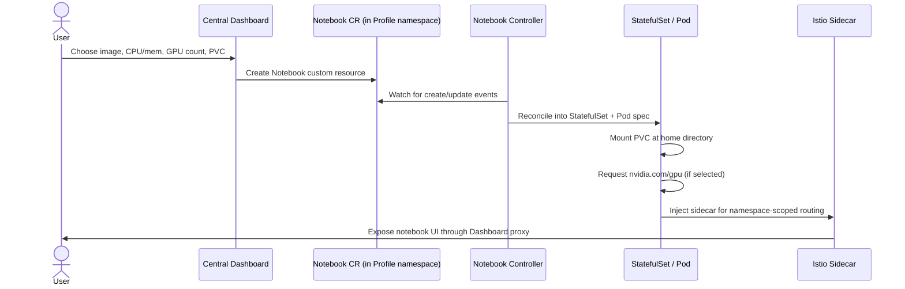

# Parte 3: Kubeflow Notebooks

> **Versiones compatibles**: Kubeflow Community Distribution 26.03, Kubernetes 1.34+
> **Última actualización**: August 19, 2026

## Configuración del entorno de laboratorio

Para seguir los ejemplos de este documento, necesitará las siguientes herramientas y entorno:

### Herramientas necesarias

* kubectl v1.34 o posterior, configurado para un clúster con Kubeflow instalado (consulte la Parte 1)
* Acceso a un Profile de usuario (namespace) en Kubeflow Central Dashboard, para iniciar servidores de notebooks
* Un par de `NodePool`/`EC2NodeClass` con GPU configurado mediante [Karpenter](../../autoscaling/02-karpenter.md), si planea iniciar notebooks respaldados por GPU
* Permiso de envío a un registro de contenedores (por ejemplo, Amazon ECR), si planea crear y referenciar una imagen de notebook personalizada

## ¿Qué es Kubeflow Notebooks?

Kubeflow Notebooks permite a un científico de datos iniciar un entorno de desarrollo interactivo completamente configurado — JupyterLab, RStudio o code-server (VS Code en el navegador) — como un pod que se ejecuta dentro del clúster, sin tener que escribir por sí mismo un manifiesto de Deployment ni un Dockerfile. Un controlador observa un recurso personalizado que describe el notebook deseado (imagen, solicitudes de CPU/memoria/GPU y almacenamiento), lo reconcilia en objetos de Kubernetes convencionales, y el enrutamiento por namespace de Istio expone el servidor resultante mediante el mismo Central Dashboard que utiliza el resto de Kubeflow.

El objetivo de ejecutar notebooks de esta forma, en lugar de como una implementación compartida de JupyterHub o un `kubectl run` puntual, es que el entorno de cada usuario participe plenamente en el modelo operativo normal del clúster. El mismo scheduler lo programa, por lo que compite por y se beneficia de los node pools de GPU como cualquier otra carga de trabajo. Está sujeto a las mismas RBAC y políticas de red con ámbito de namespace. Además, puede pausarse, redimensionarse o desmontarse con las mismas herramientas de `kubectl`/GitOps que un equipo de plataforma ya utiliza para todo lo demás.

## Contexto de versión: Notebooks v1 y la próxima v2

A partir de Kubeflow Community Distribution 26.03, Kubeflow Notebooks funciona con su diseño **v1** de larga data: un recurso personalizado `Notebook` que es un envoltorio relativamente ligero en torno a una especificación de `StatefulSet`/pod de Kubernetes, iniciado mediante la interfaz de notebooks de Central Dashboard. Esta es la arquitectura que el resto de este documento describe en detalle y la que encontrará al implementar 26.03 hoy.

El proyecto **está trabajando activamente hacia una versión v2** basada en dos nuevos recursos personalizados, `Workspace` y `WorkspaceKind`, que separan «cómo es un entorno de notebook» (una plantilla `WorkspaceKind` que un administrador define y versiona) de «cuál está ejecutando un usuario determinado» (un `Workspace` que hace referencia a un tipo). A partir de la distribución base 26.03, v2 (`Workspaces`) había incluido manifiestos alpha para pruebas; el parche 26.03.1 lo pasó a **beta**, aunque **todavía no ha alcanzado la disponibilidad general**. Se espera que el CRD `Notebook` de v1 pase a un estado de mantenimiento exclusivo una vez que v2 esté lista para uso en producción. Considere v2 como un contexto de futuro por el que vale la pena planificar: consulte la [documentación de Kubeflow Notebooks](https://www.kubeflow.org/docs/components/notebooks/) para conocer el estado actual de GA antes de comprometer el diseño de una plataforma de producción con cualquiera de las dos API.

## Modelo de multitenencia: Profiles como límite de notebooks

Cada usuario de Kubeflow Notebooks opera dentro de un **Profile**: la misma construcción de un namespace por usuario que se utiliza en el resto de Kubeflow (tratada en la Parte 1). Crear un Profile aprovisiona:

* Un namespace de Kubernetes dedicado para ese usuario (o equipo).
* Enlaces RBAC que delimitan los permisos del usuario a su propio namespace mediante Profile Controller.
* Una `AuthorizationPolicy` de Istio que restringe qué identidades pueden acceder a los servicios (incluidos los pods de notebooks) dentro de ese namespace, de modo que el notebook de un usuario no pueda ser accedido ni pueda acceder, de forma predeterminada, a las cargas de trabajo de otro usuario.

Un servidor de notebooks siempre se crea dentro de un namespace de Profile, nunca en un namespace compartido. Esto es lo que permite a un equipo de plataforma ofrecer la creación de notebooks de autoservicio sin que los pods de todos los usuarios puedan comunicarse mutuamente: el límite de aislamiento es el mismo que se usa para ejecuciones de pipelines, endpoints de KServe y cualquier otro recurso por usuario en el clúster.

### Almacenamiento persistente

El iniciador de Central Dashboard permite a un usuario adjuntar una o más PersistentVolumeClaims al pod de notebooks, normalmente montadas en el directorio de inicio del servidor de notebooks (por ejemplo, `/home/jovyan` para las imágenes basadas en Jupyter, siguiendo la convención ascendente de Jupyter Docker Stacks). Puesto que el claim — no el pod — es el objeto persistente, los archivos de un usuario, los paquetes instalados y la configuración de Jupyter sobreviven al reinicio de un pod, al reemplazo de un nodo o a un ciclo intencional de detención/inicio del propio notebook. En EKS, este PVC suele estar respaldado por el controlador Amazon EBS CSI para acceso ReadWriteOnce de un único pod, o por Amazon EFS mediante su controlador CSI cuando un equipo desea que el mismo directorio de trabajo se comparta con lectura y escritura entre varios pods de notebooks o pipelines.

### Terminación por inactividad

Dado que un pod de notebooks en ejecución mantiene su asignación solicitada de CPU, memoria y —lo más costoso— GPU durante todo el tiempo que existe, independientemente de si alguien lo utiliza activamente, Kubeflow Notebooks incluye un mecanismo de terminación que puede detener (no eliminar) notebooks que han permanecido inactivos durante un período configurado. La terminación libera la capacidad del nodo que retenía el notebook inactivo, lo que es especialmente importante para notebooks respaldados por GPU, donde un servidor inactivo puede ocupar una instancia GPU costosa durante horas después de que un usuario se haya alejado. El PVC subyacente no se modifica mediante la terminación, por lo que el entorno y los archivos de un notebook terminado quedan exactamente como los dejó el usuario la próxima vez que se inicie.

## Flujo de reconciliación de notebooks

El bucle de reconciliación del controlador sigue el mismo patrón que se usa en otras partes de Kubernetes: no crea el pod directamente en cada interacción con el dashboard; reconcilia continuamente el `StatefulSet` en ejecución con lo que el recurso personalizado `Notebook` declara actualmente. Por ejemplo, una detención iniciada desde el dashboard actualiza el estado deseado del recurso personalizado a cero réplicas en lugar de emitir una eliminación imperativa del pod, de modo que el controlador —no la interfaz de dashboard— es la única fuente de verdad sobre si un pod de notebooks debería estar ejecutándose.

## Programación de GPU para notebooks en EKS

Un pod de notebooks que necesita acceso a aceleradores lo solicita de la misma manera que cualquier otro pod del clúster: el campo GPU del iniciador en el recurso personalizado `Notebook` se traduce en una entrada `resources.limits."nvidia.com/gpu"` en la especificación del pod subyacente, y el plugin de dispositivos NVIDIA que se ejecuta en los nodos GPU anuncia `nvidia.com/gpu` como un recurso asignable para el scheduler.

Esto significa que la programación de GPU para notebooks no es un subsistema separado de la capacidad GPU del resto del clúster: compite por y es atendida por los mismos node pools con capacidad GPU que respaldan trabajos de entrenamiento, endpoints de KServe y cualquier otra carga de trabajo GPU. En EKS, esa capacidad suele aprovisionarse dinámicamente mediante Karpenter, que puede escalar un `NodePool` GPU cuando la solicitud `nvidia.com/gpu` de un pod de notebooks no puede satisfacerse con la capacidad existente, y reducirlo de nuevo una vez que el notebook se termina por inactividad o se detiene. Los mecanismos para configurar NodePools de Karpenter conscientes de GPU, la selección de tipos de instancia y los taints/tolerations para nodos aceleradores se tratan en profundidad en [Karpenter for Autoscaling](../../autoscaling/02-karpenter.md). El detalle específico de notebooks que conviene recordar aquí es simplemente que un notebook GPU inactivo es una de las causas más comunes de que un node pool GPU se niegue a escalar a cero, que es exactamente lo que busca evitar el comportamiento de terminación por inactividad descrito arriba.

## Imágenes de notebooks personalizadas

Las imágenes de notebooks estándar que incluye el iniciador de Kubeflow cubren una base general de JupyterLab/RStudio/code-server, pero la mayoría de los equipos que ejecutan notebooks en producción crean y referencian sus propias imágenes personalizadas para que cada científico de datos parta de un entorno idéntico y reproducible, en lugar de ejecutar `pip install` manualmente para instalar dependencias dentro de un contenedor en ejecución.

El patrón habitual es:

1. **Partir de una imagen base ascendente de Kubeflow (o Jupyter Docker Stacks)** que ya incluya el servidor de notebooks, las integraciones de Kubeflow SDK y las convenciones esperadas de UID/directorio de trabajo que el iniciador requiere.
2. **Incorporar las dependencias reales del equipo**: un conjunto fijo de paquetes de Python/R, bibliotecas internas, versiones de frameworks de GPU (que coincidan con el controlador CUDA en el node pool de destino) y cualquier herramienta sin credenciales que el equipo haya estandarizado.
3. **Crear y enviar la imagen a un registro desde el que el clúster pueda descargarla**: en EKS, normalmente Amazon ECR, con el escaneo de imágenes y las políticas de ciclo de vida aplicadas de la misma manera que a cualquier otra imagen de producción.
4. **Referenciar la imagen desde el iniciador.** La interfaz de iniciador de Central Dashboard acepta una referencia de imagen arbitraria en su campo de imagen (sujeta a la lista de permitidos que haya configurado un administrador), por lo que una imagen personalizada se comporta de forma idéntica a una estándar desde el punto de vista del usuario final: es simplemente otra opción para elegir.

Mantener estas imágenes versionadas y recompiladas mediante el mismo pipeline de CI que cualquier otra imagen de aplicación es lo que hace que los entornos de notebooks sean reproducibles en un equipo: dos científicos de datos que eligen la misma etiqueta de imagen obtienen conjuntos de paquetes idénticos byte a byte, en vez de que el kernel de cada usuario se desvíe con el tiempo debido a instalaciones manuales.

## Próximos pasos

Este documento trató qué hace Kubeflow Notebooks, el modelo de multitenencia basado en Profile que aísla el notebook de cada usuario, el almacenamiento persistente y la terminación por inactividad, el flujo de reconciliación del controlador de notebooks, la programación de GPU en EKS y la práctica de crear imágenes de notebooks personalizadas para entornos reproducibles. La Parte 4 continúa con Katib y el ajuste de hiperparámetros, basándose en los mismos patrones de Profile y recursos personalizados introducidos aquí.

[Volver a la página principal](./README.md)

## Cuestionario

Para poner a prueba lo que ha aprendido en este capítulo, pruebe el [cuestionario del tema](../../quizzes/ai-ml/kubeflow/03-notebooks-quiz.md).
