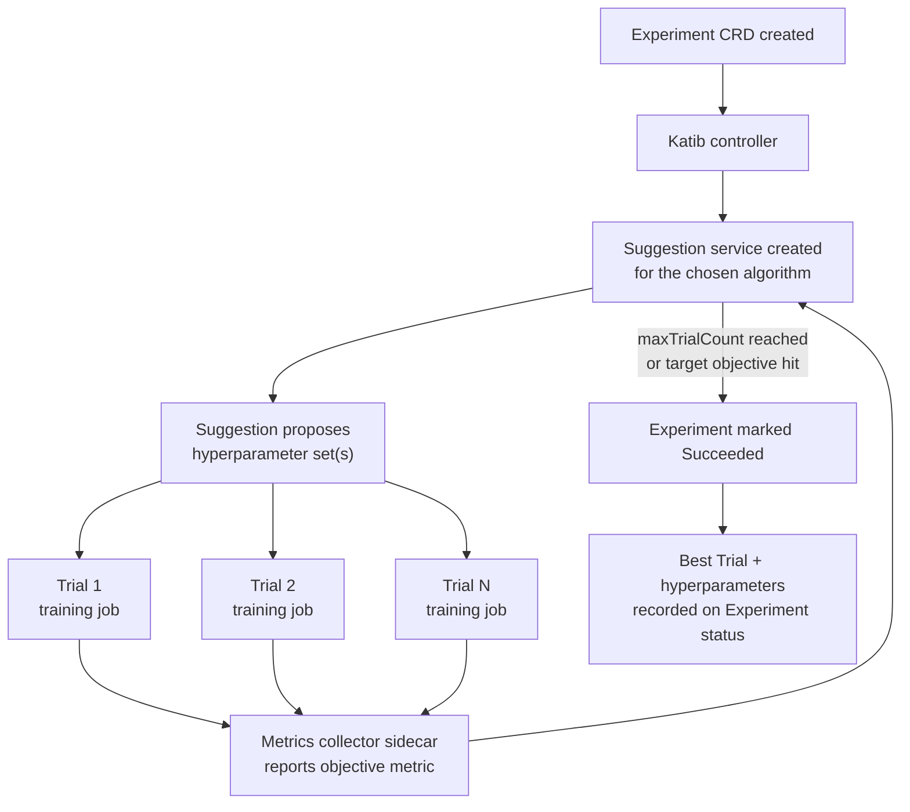

# Parte 4: Katib — Ajuste de hiperparámetros y AutoML

> **Versiones compatibles**: Katib 0.19.0, Kubeflow Community Distribution 26.03
> **Última actualización**: August 19, 2026

## Configuración del entorno de laboratorio

Para seguir los ejemplos de este documento, necesitará las siguientes herramientas y entorno:

### Herramientas requeridas

* kubectl v1.34 o posterior, configurado para un clúster con Kubeflow instalado (consulte la Parte 1)
* Acceso a un Profile (namespace) de usuario en Kubeflow Central Dashboard, para enviar Experiments
* Un par `NodePool`/`EC2NodeClass` con GPU habilitada configurado mediante [Karpenter](../../autoscaling/02-karpenter.md), si planea ejecutar Trials con GPU
* Una plantilla funcional de trabajo de entrenamiento para referenciar desde `trialTemplate` (por ejemplo, un par `TrainJob`/`ClusterTrainingRuntime` de la Parte 5, o un `Job` simple de Kubernetes)

## Qué es Katib

Las partes anteriores de esta serie cubrieron las capas de notebooks y pipelines de Kubeflow. Este documento aborda **Katib**, el componente nativo de Kubernetes de Kubeflow para el ajuste de hiperparámetros y AutoML. Katib convierte la pregunta «¿qué tasa de aprendizaje, tamaño de lote y profundidad de red debería usar?» en una búsqueda declarativa programada por el clúster, en lugar de un ciclo manual de editar-ejecutar-inspeccionar, y lo hace componiendo objetos ordinarios de Kubernetes — Custom Resources, pods y Services — en lugar de un programador a medida acoplado al clúster.

Katib automatiza la optimización de hiperparámetros (HPO) y la búsqueda de arquitectura neuronal ejecutando muchos trabajos de entrenamiento en paralelo, cada uno con una combinación diferente de hiperparámetros, y usando los resultados para decidir qué combinaciones probar después. Se basa en tres componentes que cooperan:

* **Experiment** — un CRD que describe una ejecución de ajuste: el objetivo que se debe optimizar, el espacio de búsqueda de hiperparámetros, el algoritmo de búsqueda que se debe usar y una plantilla que describe cómo ejecutar un trabajo de entrenamiento.
* **Trial** — un CRD creado por el controlador de Katib que representa una única ejecución de entrenamiento con una combinación específica de hiperparámetros. Un Experiment con `maxTrialCount: 50` generará, durante su ciclo de vida, hasta 50 Trials.
* **Suggestion** — un Service (también respaldado por un CRD) que implementa el algoritmo de búsqueda. Recibe resultados de Trials completados y en curso, y propone los siguientes conjuntos de hiperparámetros que se probarán.

La relación es jerárquica: un Experiment posee muchos Trials y cada Trial posee el trabajo de entrenamiento real (un `Job` de Kubernetes, o un recurso de trabajo de entrenamiento como un `TrainJob` cuando se integra con Kubeflow Trainer — consulte la Parte 5) que Kubernetes programa y ejecuta como cualquier otra carga de trabajo. Dado que todo es un CRD, `kubectl get experiments`, `kubectl get trials` y `kubectl describe` sobre cualquiera de ellos se comportan exactamente como lo harían para un Deployment o Job — no se requiere una CLI ni UI separada para inspeccionar el estado, aunque la UI de Katib (parte de Kubeflow Central Dashboard) ofrece una vista visual del progreso de los Trials y de las curvas de métricas.

## Algoritmos de búsqueda

Katib incluye un conjunto conectable de algoritmos de búsqueda, expuestos mediante el Service Suggestion. Cada algoritmo responde a la misma pregunta — «dados los resultados hasta ahora, ¿qué debería probar el siguiente Trial o los siguientes Trials?» — con una estrategia diferente y un equilibrio distinto entre el costo de exploración y la eficiencia de búsqueda.

| Algoritmo | Adecuado para | Comportamiento conceptual |
|---|---|---|
| **Búsqueda aleatoria** | Una línea base económica o un espacio de búsqueda muy grande/poco comprendido | Muestrea combinaciones de hiperparámetros de forma independiente y uniforme al azar desde el espacio definido. No conserva memoria de Trials anteriores. |
| **Búsqueda en cuadrícula** | Espacios de búsqueda pequeños y de baja dimensión, donde la cobertura exhaustiva es asequible | Enumera cada combinación de valores discretos proporcionados para cada hiperparámetro. Garantiza una cobertura completa, pero escala combinatoriamente con el número de parámetros. |
| **Optimización bayesiana** | Modelos costosos de entrenar, donde el costo de cada Trial importa y el muestreo informado compensa | Construye un modelo probabilístico de cómo los hiperparámetros se relacionan con la métrica objetivo y usa ese modelo para elegir los siguientes puntos con mayor probabilidad de mejorar el mejor resultado observado hasta el momento. Converge en menos Trials que la búsqueda aleatoria para muchas cargas de trabajo, a costa de cierta dependencia secuencial entre las sugerencias. |
| **Hyperband** | Cargas de trabajo en las que «¿esto parece prometedor desde el principio?» es una señal económica e informativa (por ejemplo, curvas de pérdida tras unas pocas épocas) | Ejecuta muchas configuraciones con un presupuesto de recursos pequeño, descarta agresivamente las de peor rendimiento y reasigna el presupuesto liberado a las supervivientes para ejecuciones más largas. Intercambia información exhaustiva por configuración por poda temprana. |
| **CMA-ES y otras estrategias avanzadas** | Espacios de búsqueda continuos y de mayor dimensión, o cargas de trabajo que se benefician de la búsqueda de estilo poblacional (por ejemplo, entrenamiento basado en población) | Evolucionan una población o distribución de configuraciones candidatas a lo largo de generaciones sucesivas, adaptando la distribución de muestreo según qué candidatas tuvieron un buen rendimiento. Conceptualmente están más cerca de los algoritmos evolutivos/de optimización que del muestreo simple. |

La elección del algoritmo depende de cuán costoso sea cada Trial y de cuánta estructura tenga el espacio de búsqueda. La búsqueda aleatoria es un valor predeterminado razonable para establecer una línea base; la optimización bayesiana y Hyperband son las opciones más comunes una vez que entrenar un único Trial es suficientemente costoso como para que reducir el número total de Trials tenga una importancia significativa.

## Anatomía de un Experiment

La especificación de un Experiment tiene tres partes que son las más importantes para entender cómo se comporta una ejecución de ajuste:

* **`objective`** — nombra la métrica que se debe optimizar (por ejemplo, `accuracy` o `loss`) y el objetivo (`maximize` o `minimize`), junto con un valor objetivo opcional que, si se alcanza, puede utilizarse para detener el Experiment anticipadamente por ser «suficientemente bueno».
* **`parameters`** — el espacio de búsqueda: una entrada por hiperparámetro, cada una con un nombre, un tipo y un rango continuo (mínimo/máximo, útil para algo como una tasa de aprendizaje) o una lista discreta de valores (útil para algo como la elección de un optimizador o un indicador de arquitectura categórico).
* **`trialTemplate`** — describe cómo se construye el trabajo de entrenamiento real de cada Trial: una plantilla para la especificación del trabajo subyacente, con marcadores de posición que se sustituyen por los valores específicos de hiperparámetros que el Service Suggestion propuso para ese Trial. En los despliegues actuales de Kubeflow, esta plantilla suele apuntar a un recurso de trabajo de entrenamiento administrado por **Kubeflow Trainer** (cubierto en profundidad en la Parte 5) — el trabajo de Katib aquí es decidir *qué valores* inyectar, no reimplementar cómo se ejecuta un trabajo de entrenamiento distribuido.

Dos campos adicionales a nivel de Experiment determinan cómo se ejecuta la búsqueda, en lugar de qué busca:

* **`parallelTrialCount`** — cuántos Trials pueden ejecutarse simultáneamente.
* **`maxTrialCount`** — el número total de Trials que el Experiment ejecutará durante su ciclo de vida antes de detenerse (independientemente de que se haya alcanzado un valor objetivo).

## Detención temprana

No todos los Trials necesitan ejecutarse hasta completarse para saber que no van a ganar. Katib admite la **detención temprana**, en la que un Trial que claramente tiene un rendimiento insuficiente durante una parte del entrenamiento se termina antes de consumir toda su asignación de recursos. Un enfoque utilizado habitualmente es la **regla de detención por mediana**: en un punto determinado del entrenamiento, el valor objetivo intermedio de un Trial se compara con la mediana de los valores intermedios de otros Trials en el mismo punto; si queda significativamente por debajo, el Trial se detiene en vez de permitir que se ejecute hasta completarse para obtener un resultado que ya es poco probable que sea competitivo.

La detención temprana y algoritmos como Hyperband resuelven un problema relacionado — no desperdiciar cómputo en entrenamientos que no van a ninguna parte — pero operan en niveles diferentes: Hyperband es una *estrategia de búsqueda* que decide por adelantado cuánto presupuesto asignar a cada configuración, mientras que la detención temprana es una *verificación en tiempo de ejecución* aplicada a un Trial que ya está en curso según cómo progresa en relación con sus pares.

## Cómo se ejecuta un Experiment, de principio a fin

El ciclo funciona así: el controlador de Katib reconcilia el Experiment e inicia un Service Suggestion para el algoritmo solicitado. El Service Suggestion propone una o más combinaciones de hiperparámetros, limitadas por `parallelTrialCount`. El controlador crea un CRD Trial y su trabajo de entrenamiento subyacente para cada propuesta. A medida que los Trials informan resultados, esos resultados se retroalimentan al Service Suggestion para orientar la siguiente ronda de propuestas. El ciclo continúa hasta que se alcanza `maxTrialCount` o se satisface el valor objetivo de `objective`. Durante todo el proceso, el estado del Experiment se actualiza continuamente con el Trial de mejor rendimiento observado hasta el momento. Una vez que se completa el Experiment, los hiperparámetros y el valor de métrica de ese mejor Trial son los que se registran como resultado final.

## Recopilación de métricas

Un trabajo de entrenamiento no sabe de forma nativa que forma parte de un Experiment de Katib, por lo que Katib necesita una forma de extraer la métrica objetivo de vuelta desde el pod de cada Trial. Esto se realiza mediante un **sidecar de recopilación de métricas** inyectado en el pod Trial junto al contenedor de entrenamiento. El trabajo del sidecar es observar la salida del contenedor de entrenamiento — normalmente siguiendo archivos stdout/log para detectar un patrón de métrica reconocible, o realizando scraping de un endpoint de métricas que expone el código de entrenamiento — e informar el valor de métrica objetivo analizado de vuelta al almacén de métricas de Katib.

Este patrón de sidecar es lo que mantiene el propio código de entrenamiento principalmente independiente de Katib: un script de entrenamiento que ya imprime su exactitud o pérdida por época en un formato analizable no necesita reescribirse para integrarse con Katib — el recopilador realiza la extracción. También significa que la elección de la estrategia de recopilación (análisis de logs frente a scraping de endpoints) importa para la fiabilidad y frecuencia con que Katib puede observar el progreso intermedio, lo que a su vez afecta a qué tan bien la detención temprana y los algoritmos de estilo Hyperband pueden actuar sobre ese progreso.

## Ejecución de Experiments de Katib en EKS: presión de recursos

Los controles de concurrencia de Katib interactúan directamente con la capacidad del clúster de maneras que importan más en EKS de lo que podrían hacerlo en un clúster local fijo y sobredimensionado:

* **`parallelTrialCount` multiplica la demanda de recursos.** Cada Trial simultáneo es un trabajo de entrenamiento completo — si los Trials individuales solicitan GPU, un `parallelTrialCount` de 8 significa 8 solicitudes de GPU simultáneas que llegan al clúster de una sola vez, no 8 solicitudes distribuidas a lo largo del tiempo. Un Experiment que parece modesto en papel (`maxTrialCount: 100`) todavía puede producir un pico de demanda pronunciado y de corta duración si `parallelTrialCount` se establece alto.
* **El autoescalado del clúster debe mantener el ritmo.** En EKS, esta presión normalmente se absorbe mediante [Karpenter](../../autoscaling/02-karpenter.md), que aprovisiona nuevos nodos con GPU en respuesta a la ráfaga de pods Trial pendientes. Dado que los tipos de instancia GPU suelen tener tiempos de aprovisionamiento más largos que las instancias de uso general, un `parallelTrialCount` alto puede hacer que los Trials iniciales esperen nodos en vez de entrenar realmente — conviene observarlo en los eventos de los pods Trial antes de asumir que el algoritmo Suggestion en sí es lento.
* **Ajuste `parallelTrialCount` y `maxTrialCount` juntos, no de forma independiente.** Un `parallelTrialCount` más bajo con un Experiment de mayor duración suele ser más cuidadoso con la capacidad compartida del clúster que un `parallelTrialCount` alto que termina el mismo total de Trials más rápido — el equilibrio adecuado depende de si el clúster está dedicado a la ejecución de ajuste o se comparte con otras cargas de trabajo.
* **La detención temprana reduce directamente el gasto desperdiciado.** Dado que cada Trial terminado anticipadamente libera antes su asignación de GPU, la regla de detención por mediana (consulte «Detención temprana» arriba) no es solo una optimización de eficiencia de búsqueda — en EKS también es una palanca directa sobre cuánto costo de horas de GPU acumula una ejecución de ajuste antes de converger en un buen conjunto de hiperparámetros.

## Próximos pasos

Katib convierte la búsqueda de hiperparámetros en un ciclo de control nativo de Kubernetes: un Experiment describe el objetivo y el espacio de búsqueda, un Service Suggestion propone combinaciones de hiperparámetros usando un algoritmo de búsqueda conectable, los Trials ejecutan esas combinaciones como trabajos de entrenamiento ordinarios y un sidecar de recopilación de métricas informa los resultados para que la búsqueda pueda converger en una configuración óptima. En EKS, el factor práctico es coordinar `parallelTrialCount`/`maxTrialCount` con la capacidad de autoescalado — particularmente para Trials con GPU — de modo que la concurrencia de una ejecución de ajuste no supere la velocidad con que el clúster puede aprovisionar nodos para ella.

La Parte 5 cubre **Kubeflow Trainer**, el componente al que normalmente delega `trialTemplate` de Katib para ejecutar realmente el trabajo de entrenamiento distribuido de cada Trial.

[Volver a la página principal](./README.md)

## Cuestionario

Para comprobar lo que ha aprendido en este capítulo, pruebe el [Cuestionario del tema](../../quizzes/ai-ml/kubeflow/04-katib-quiz.md).
