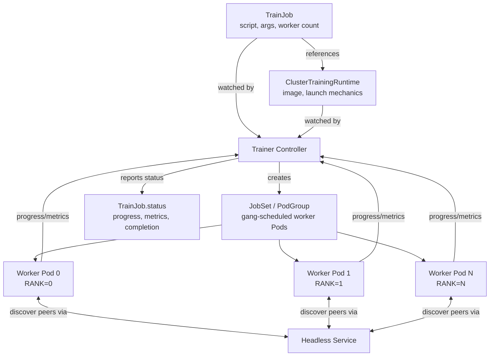

# Parte 5: Kubeflow Trainer y entrenamiento distribuido

> **Versiones compatibles**: Kubeflow Trainer v2.1 (incluido en 26.03) hasta v2.3, Training Operator heredado 1.9.2 (incluido en Kubeflow Community Distribution 26.03)
> **Última actualización**: August 19, 2026

## Configuración del entorno de laboratorio

Para seguir los ejemplos de este documento, necesitarás las siguientes herramientas y el siguiente entorno:

### Herramientas necesarias

* kubectl v1.34 o posterior
* Un clúster de Amazon EKS funcional con un grupo de nodos compatible con GPU (consulta el material de [Karpenter](../../autoscaling/02-karpenter.md) y de programación de nodos GPU al que se hace referencia más abajo; este documento no vuelve a derivar esa configuración)
* Kubeflow instalado mediante Community Distribution, o Kubeflow Trainer instalado de forma independiente

## De Operators específicos de cada framework a una API unificada

El entrenamiento distribuido en Kubernetes ha pasado por un cambio arquitectónico real dentro del proyecto Kubeflow, y esto es lo más importante que debes comprender antes de trabajar con cualquier YAML.

### El Training Operator original (v1)

El Training Operator que Kubeflow consolidó en 2021 adoptó un enfoque de **CRD específico de cada framework**. Cada framework de ML compatible obtenía su propia Custom Resource Definition, cada una con su propio controller que implementaba la semántica particular de entrenamiento distribuido de ese framework:

* **`PyTorchJob`** — el controller entendía las convenciones de lanzamiento distribuido de PyTorch e inyectaba variables de entorno como `MASTER_ADDR`, `RANK` y `WORLD_SIZE` en cada Pod de worker para que `torch.distributed` pudiera formar un grupo de procesos.
* **`TFJob`** — en su lugar, el controller construía una variable de entorno `TF_CONFIG` (un blob JSON que describe los roles de tareas del clúster — chief, worker, parameter server) que esperan las estrategias de distribución de TensorFlow.
* **`MPIJob`** — el controller se encargaba de lanzar un trabajo MPI entre Pods, coordinando un launcher de estilo `mpirun` con un conjunto de Pods de worker.

Además de estos tres, el Training Operator v1 también incluía CRD para algunos otros frameworks. Cada CRD codificaba directamente en un controller independiente la idea de un framework distinto sobre «cómo los workers se encuentran entre sí y acuerdan sus roles», de modo que añadir un framework nuevo significaba escribir un controller totalmente nuevo en lugar de reutilizar la infraestructura existente.

### El cambio a Kubeflow Trainer v2

Kubeflow Trainer v2 reemplaza esto por una API única y unificada construida en torno a dos conceptos, en lugar de un CRD por framework:

* **`TrainJob`** — describe *qué* ejecutar: el script/punto de entrada de entrenamiento, los argumentos, los recuentos de recursos (por ejemplo, el número de workers) y una referencia al runtime que debe ejecutarlo. Es el objeto que un profesional de ML crea para una ejecución de entrenamiento individual.
* **`TrainingRuntime` / `ClusterTrainingRuntime`** — describe *cómo* ejecutarlo: una plantilla de ejecución reutilizable y específica del framework que cubre la imagen del contenedor, los mecanismos de lanzamiento distribuido (cómo los workers se detectan entre sí, qué variables de entorno o proceso launcher se utiliza) y la forma de recursos predeterminada. Un equipo de plataforma define una pequeña colección de estos una sola vez —por ejemplo, un runtime de PyTorch DDP, un runtime de MPI— y muchos `TrainJob` diferentes hacen referencia al mismo runtime en numerosas ejecuciones de entrenamiento.

Esto refleja un patrón observado en otras partes de Kubernetes: separar un recurso de «plantilla» reutilizable de la «instancia» que lo consume, similar en espíritu a cómo una `StorageClass` es una plantilla reutilizable a la que hacen referencia muchos `PersistentVolumeClaim`. El beneficio práctico es que un equipo de plataforma puede ser responsable y versionar los complejos mecanismos de lanzamiento distribuido en un único lugar (el runtime), mientras que los profesionales de ML que envían trabajos solo necesitan proporcionar su script y solicitar un runtime por nombre; no necesitan saber ni preocuparse por cómo ocurren realmente bajo la superficie la asignación de rangos o la detección de direcciones.

Según sus [notas de la versión](https://github.com/kubeflow/trainer/releases), **Kubeflow Trainer v2.2** (lanzado aproximadamente en marzo de 2026, y la versión incluida a partir del parche 26.03.1 de Kubeflow Community Distribution —26.03 propiamente dicho incluye v2.1.0—) desarrolla esto con:

* Runtimes de entrenamiento de primera clase para **JAX** y **XGBoost**, junto con el soporte existente de PyTorch —por lo que el entrenamiento distribuido para estos frameworks ahora utiliza la misma división `TrainJob`/runtime en lugar de un CRD a medida.
* **Observabilidad** mejorada: el progreso y las métricas de entrenamiento pueden propagarse desde el propio script de entrenamiento hasta el estado de `TrainJob`, en lugar de requerir que un operador revise logs o un backend de métricas independiente para ver cómo progresa una ejecución.
* **Integración con Flux Framework**, que incorpora un launcher de trabajos de estilo HPC al ecosistema de Trainer para cargas de trabajo de estilo MPI —útil para trabajos distribuidos estrechamente acoplados y con carácter HPC que se benefician del modelo de programación y lanzamiento de procesos de Flux en lugar de un lanzamiento más sencillo de `mpirun`.

### La migración es real, pero no ha terminado

Es importante no exagerar dónde se encuentra realmente el ecosistema: **Kubeflow Community Distribution 26.03** todavía incluye el **Training Operator heredado 1.9.2** —el Operator v1 de CRD específicos de cada framework— a partir de esa versión. Kubeflow Trainer v2 y el Training Operator heredado coexisten actualmente en el ecosistema, y la migración de los trabajos de un equipo dado desde manifiestos `PyTorchJob`/`TFJob`/`MPIJob` a `TrainJob` + un runtime es una **transición activa y en curso** que muchos equipos solo han completado parcialmente; no es una transición finalizada que puedas asumir que ya se produjo en un clúster determinado.

Si estás planificando una migración real, no consideres este documento como la guía de migración: la referencia autorizada, campo por campo, es **"Migrating to Kubeflow Trainer v2"** en [kubeflow.org](https://www.kubeflow.org/docs/components/trainer/operator-guides/migration/). Esa guía cubre el mapeo concreto de los campos de cada CRD v1 a un `TrainJob` y a un runtime predeterminado, cuyo replanteamiento exhaustivo queda fuera del alcance de este documento.

Una nota aparte para quienes ya ejecutan Trainer v2: **Trainer v2.3.0** (lanzado en agosto de 2026) se publicó después de v2.2 con cambios incompatibles en los CRD de runtime que describe este documento —se eliminaron los Runtime Finalizers y los CRD se trasladaron al directorio de plantillas del chart de Helm—, y sus propias [notas de la versión](https://github.com/kubeflow/trainer/releases) indican que los clústeres con v2.0/v2.1/v2.2 deben actualizarse a v2.3 antes de seguir actualizándose. Consulta directamente esa guía antes de actualizar un clúster que ya ejecute Trainer v2.

## Forma conceptual de un TrainJob

A nivel conceptual (sin inventar nombres de campo exactos que este documento no haya verificado), un `TrainJob` para, por ejemplo, una ejecución de data-parallel distribuida (DDP) de PyTorch divide aproximadamente la responsabilidad así:

* Un **`ClusterTrainingRuntime`**, creado una vez por un equipo de plataforma, que incluye: la imagen del contenedor de entrenamiento (o una expectativa de imagen base), el número de réplicas de worker como valor predeterminado y los mecanismos de lanzamiento distribuido para PyTorch DDP (cómo los workers detectan la dirección de rendezvous y acuerdan el rango/tamaño del mundo).
* Un **`TrainJob`**, creado por cada ejecución de entrenamiento, que hace referencia a ese `ClusterTrainingRuntime` por nombre y proporciona los elementos específicos de la ejecución: el script o comando de entrenamiento real que se debe ejecutar, los argumentos del script (tasa de aprendizaje, ruta del conjunto de datos, épocas, etc.) y cuántos workers necesita esta ejecución en particular.

El `TrainJob` es intencionalmente el objeto «ligero»: la mayor parte de la complejidad sobre *cómo* ocurre la coordinación distribuida reside en el runtime, no en cada manifiesto de trabajo individual. Esto es lo que hace que los runtimes sean reutilizables en muchas ejecuciones de entrenamiento y explica por qué un equipo de plataforma, y no cada científico de datos individual, suele ser responsable de reforzar las definiciones de runtime.

## Mecánica del entrenamiento distribuido en Kubernetes

Independientemente del runtime de framework que esté en juego, el entrenamiento distribuido con múltiples workers en Kubernetes generalmente se coordina mediante el mismo pequeño conjunto de primitivas:

* **Un Service headless** delante de los Pods de worker, de modo que cada worker obtenga un nombre DNS estable y resoluble para los demás, en lugar de depender de IP de Pod que pueden cambiar al reprogramarse.
* **Variables de entorno inyectadas** (o un archivo de configuración/paso init equivalente) que indican a cada worker su rango, el número total de workers y la dirección del worker que actúa como rendezvous/coordinador; este es el mecanismo que `MASTER_ADDR`/`RANK`/`WORLD_SIZE` proporcionaban para PyTorch y que `TF_CONFIG` proporcionaba para TensorFlow, generalizado bajo la abstracción de runtime en Trainer v2.
* **Consideraciones de gang scheduling**: los trabajos de entrenamiento distribuido generalmente necesitan que *todos* sus workers estén programados y en ejecución antes de que pueda comenzar el entrenamiento; un trabajo que programa la mitad de sus workers y espera indefinidamente al resto desperdicia capacidad de GPU y puede quedar bloqueado. Por eso, los controllers de entrenamiento distribuido se apoyan comúnmente en primitivas de gang scheduling (o se integran con ellas): agrupan los Pods de un trabajo para que el scheduler los trate como una unidad de todo o nada, en lugar del comportamiento predeterminado de Kubernetes de programar cada Pod de forma independiente.

En EKS específicamente, esto interactúa directamente con la forma en que se aprovisionan y escalan tus grupos de nodos GPU. Un trabajo distribuido que necesita, por ejemplo, 8 workers GPU necesita 8 nodos (o slots) compatibles con GPU disponibles a la vez, no uno por uno a medida que llegan desde un autoscaler. La mecánica de dimensionar y escalar grupos de nodos GPU (Karpenter NodePools, selección de tipos de instancia, binpacking de GPU) se cubre en el material de este sitio sobre autoscaling y programación de GPU, en lugar de volver a derivarse aquí. La idea que debes llevarte a este documento es simplemente que los requisitos de gang scheduling y la elasticidad del grupo de nodos GPU deben diseñarse juntos, ya que un trabajo de entrenamiento que no puede programar todos sus workers a la vez se detendrá independientemente de lo correcta que sea su configuración de `TrainJob`/runtime.

## Referencia cruzada: Katib y TrainJob

La parte 4 de esta serie cubre Katib, el componente de ajuste de hiperparámetros de Kubeflow. Cada Trial de Katib en un experimento necesita un trabajo de entrenamiento subyacente para ejecutar realmente una combinación de hiperparámetros, y en una configuración basada en Trainer v2, ese trabajo subyacente suele ser un `TrainJob` creado a partir de una plantilla por Katib una vez por Trial, con los valores de hiperparámetros elegidos para cada Trial inyectados como argumentos del script. La división runtime/trabajo descrita anteriormente también se aplica aquí: Katib no necesita saber nada sobre los mecanismos de lanzamiento distribuido; simplemente crea un `TrainJob` por Trial para un runtime que el equipo de plataforma ya definió, y lee las métricas reportadas para decidir dónde buscar a continuación.

## Próximos pasos

Con el cambio de los CRD específicos de cada framework al modelo unificado `TrainJob`/runtime ya establecido, la [Parte 6: KServe — Model Serving en Kubernetes](./06-kserve.md) cubre qué sucede con un modelo una vez que finaliza el entrenamiento mediante un `TrainJob`: servirlo para inferencia.

[Volver a la página principal](./README.md)

## Cuestionario

Para comprobar lo que has aprendido en este capítulo, prueba el [cuestionario del tema](../../quizzes/ai-ml/kubeflow/05-training-operator-quiz.md).
