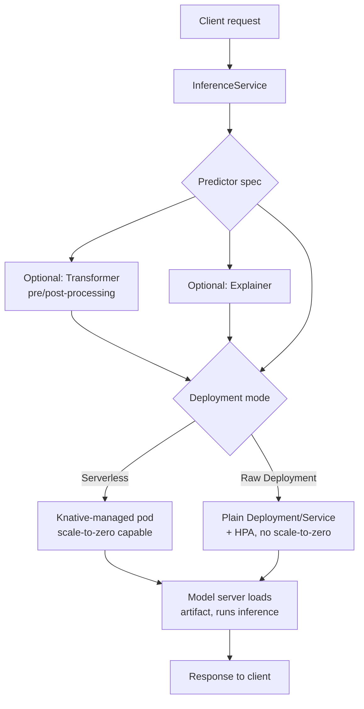

# Parte 6: KServe — Servicio de modelos en Kubernetes

> **Versiones compatibles**: KServe (aplicación web incluida v0.16.1 en Kubeflow Community Distribution 26.03)
> **Última actualización**: August 19, 2026

## Configuración del entorno de laboratorio

Para seguir los ejemplos de este documento, necesitarás las siguientes herramientas y entorno:

### Herramientas necesarias

* kubectl v1.34 o posterior, un clúster EKS funcional
* Kubeflow instalado (Parte 1), con la aplicación web de KServe visible en el Central Dashboard
* [Karpenter](../../autoscaling/02-karpenter.md) con un par `NodePool`/`EC2NodeClass` con capacidad GPU, si planeas servir modelos respaldados por GPU
* Knative Serving instalado en el clúster, si planeas utilizar el modo de despliegue Serverless de KServe

## ¿Qué es KServe y cómo se relaciona con Kubeflow?

Las Partes 1-5 cubrieron la arquitectura general de Kubeflow, Pipelines, Notebooks, Katib y Kubeflow Trainer: todo lo necesario para tener un modelo *entrenado* en EKS. Esta parte final cubre lo que sucede después del entrenamiento: servir ese modelo como un endpoint de inferencia escalable y de grado de producción con **KServe**.

KServe no comenzó como un proyecto independiente. Empezó dentro de Kubeflow como **KFServing**, el componente responsable de convertir un modelo entrenado en un endpoint de inferencia en ejecución. A medida que el proyecto maduró, se separó en su propio repositorio independiente de nivel superior y se renombró como **KServe**; ya no es un subcomponente exclusivo de Kubeflow, y puede instalarse y operarse en cualquier clúster de Kubernetes sin que Kubeflow esté presente.

Kubeflow, a su vez, sigue incluyendo KServe como su capa predeterminada de servicio de modelos: la aplicación web de servicio de modelos del Central Dashboard es una UI ligera sobre los CRD de KServe, y Kubeflow Community Distribution fija una versión específica de esa aplicación web junto con el resto de los componentes de la distribución.

Esta separación es importante por una razón práctica: **la versión del controller/CRD de KServe y la versión de la UI de la aplicación web de Kubeflow no son el mismo número, y no evolucionan sincronizadamente.** KServe tiene su propio ciclo de lanzamientos independiente, impulsado por sus propios mantenedores y su propia hoja de ruta, separado del ciclo de lanzamientos con versiones de calendario de Kubeflow Community Distribution (el `26.03` en la línea de versión de este documento se refiere a la distribución, no a KServe en sí). El lanzamiento 26.03 de Kubeflow Community Distribution incluye la aplicación web de KServe en la versión **v0.16.1**, pero ese número describe la integración con el dashboard, no necesariamente la versión del controller de KServe y los CRD subyacentes que ejecuta un clúster determinado. Un equipo de plataforma puede, y con frecuencia lo hace, actualizar el controller de KServe independientemente de la aplicación web de Kubeflow que se comunica con él. Al solucionar problemas de un `InferenceService`, comprueba directamente la versión del controller/CRD instalada en el clúster (por ejemplo, mediante el tag de imagen del KServe controller manager) en lugar de asumir que coincide con la versión mostrada en el dashboard de Kubeflow.

La abstracción central que expone KServe, independientemente de la versión instalada, es el recurso personalizado **`InferenceService`**: un único objeto de Kubernetes que describe un modelo, cómo servirlo y cómo debe escalar.

## Anatomía de InferenceService: Predictor, Transformer, Explainer

Un `InferenceService` se compone de hasta tres componentes lógicos, de los cuales solo uno es obligatorio:

* **Predictor** (obligatorio): el propio servidor de modelos. Este es el componente que realmente carga el artefacto del modelo y responde a las solicitudes de inferencia. KServe incluye soporte integrado de predictor para frameworks comunes — SKLearn, XGBoost, PyTorch (mediante TorchServe) y NVIDIA Triton Inference Server son ejemplos típicos —, por lo que una especificación de predictor para uno de estos frameworks puede apuntar a la ubicación de un artefacto de modelo y obtener un servidor funcional sin escribir código de servicio. Para cualquier caso fuera de esos servidores integrados, un predictor puede ejecutar en su lugar un **contenedor personalizado** que implemente el protocolo de inferencia de KServe por sí mismo.
* **Transformer** (opcional): un paso de pre/postprocesamiento que se sitúa delante del predictor. Un transformer suele gestionar la ingeniería de características de entrada antes de que una solicitud llegue al modelo y/o reformatea la salida sin procesar del modelo al formato que esperan los consumidores posteriores. Separarlo del predictor mantiene el servidor de modelos genérico y reutilizable para distintos contratos de cliente.
* **Explainer** (opcional): un componente que genera explicaciones del modelo (por ejemplo, explicaciones de importancia de características o contrafactuales) junto con una predicción simple o en lugar de ella; resulta útil cuando una aplicación consumidora necesita justificar la salida de un modelo en vez de simplemente recibirla.

Solo el predictor es obligatorio; muchos objetos `InferenceService` de producción constan únicamente de un predictor y añaden un transformer o explainer solo cuando el caso de uso requiere específicamente pre/postprocesamiento o explicabilidad.

## Modos de despliegue: Serverless frente a Raw Deployment

KServe admite dos modos de despliegue distintos para definir cómo se crean y gestionan realmente los Pods de un `InferenceService` en el clúster. Elegir entre ellos es una de las decisiones más importantes al ejecutar KServe en EKS.

### Modo Serverless (basado en Knative)

En el modo Serverless, KServe delega la gestión del ciclo de vida de los Pods en **Knative Serving**. Knative se sitúa entre el `InferenceService` y el Deployment subyacente, observa el tráfico de solicitudes y escala los Pods del predictor (y de cualquier transformer/explainer) hacia arriba y hacia abajo, incluso hasta llegar a **cero Pods** cuando no hay tráfico en absoluto. Esta es la característica principal del modo Serverless: un modelo que recibe solicitudes de forma intermitente no necesita mantener ningún Pod ni, por lo tanto, ninguna GPU en ejecución mientras está inactivo.

La contrapartida es la **latencia de arranque en frío**. Cuando llega una solicitud para un modelo que actualmente ha escalado a cero, Knative debe programar un nuevo Pod, esperar a que el contenedor se inicie y esperar a que el servidor de modelos cargue el artefacto del modelo en memoria antes de poder responder esa primera solicitud. Para modelos grandes en instancias respaldadas por GPU, este arranque en frío puede ser considerable: la descarga del artefacto del modelo y la inicialización del driver/runtime de GPU añaden tiempo real antes de que el Pod esté listo para servir.

### Modo Raw Deployment

En el modo Raw Deployment, KServe gestiona directamente un **Deployment**, **Service** y, opcionalmente, un **HorizontalPodAutoscaler** de Kubernetes estándar, sin ninguna dependencia de Knative. Este modo es más sencillo operativamente (un sistema menos que instalar, actualizar y comprender en el clúster) y evita por completo el comportamiento de arranque en frío de Knative, ya que nunca escala por debajo del número mínimo configurado de réplicas del Deployment. El coste es que el modo Raw Deployment **no tiene escalado a cero**: al menos el número mínimo de Pods de predictor (y sus GPU, si las hay) siempre están en ejecución, haya tráfico o no.

### Cómo elegir entre ellos

| Consideración | Serverless (Knative) | Raw Deployment |
| --- | --- | --- |
| Escalado a cero | Sí | No |
| Latencia de arranque en frío al escalar desde cero | Presente, puede ser significativa para modelos grandes/con GPU | No aplicable |
| Dependencia adicional del clúster | Requiere Knative Serving instalado | Ninguna |
| Mejor opción | Cargas de trabajo de inferencia con tráfico irregular, intermitente o bajo, donde importa el coste de una GPU inactiva | Cargas de trabajo sensibles a la latencia o con tráfico constante, donde un Pod activo debe estar siempre disponible |

La regla práctica: si el coste de GPU de un modelo inactivo entre solicitudes es una preocupación presupuestaria real y la carga de trabajo puede tolerar un retraso ocasional de arranque en frío, el escalado a cero del modo Serverless merece la dependencia adicional de Knative. Si la carga de trabajo necesita latencia baja constante en cada solicitud, o ya tiene tráfico suficientemente estable como para que los Pods rara vez estén inactivos, la simplicidad del modo Raw Deployment y la garantía de Pods activos suelen ser la mejor opción.

## Autoscaling: concurrencia/RPS de Knative frente a HPA

Los dos modos de despliegue no solo difieren en si pueden escalar a cero: utilizan mecanismos de autoscaling fundamentalmente diferentes mientras una carga de trabajo está en ejecución.

* El **modo Serverless** utiliza el **autoscaler propio de Knative**, que escala los Pods en función de señales a nivel de solicitud — normalmente la **concurrencia** (cuántas solicitudes gestiona un Pod a la vez) o las **solicitudes por segundo (RPS)** — en lugar de la utilización de recursos. Esto suele ajustarse mejor a las cargas de trabajo de inferencia, donde un modelo lento se satura con solicitudes concurrentes mucho antes de saturar la CPU, y escalar a partir de la señal a nivel de solicitud reacciona más rápido a un pico de tráfico que una señal basada en CPU.
* El **modo Raw Deployment** se basa en un **HorizontalPodAutoscaler** estándar de Kubernetes y escala según la utilización de CPU/memoria o métricas personalizadas (por ejemplo, una métrica de utilización de GPU expuesta mediante un adaptador de métricas), el mismo modelo de autoscaling que utiliza cualquier otro Deployment de Kubernetes en el clúster.

Ningún mecanismo es universalmente «mejor»: la elección correcta sigue la misma decisión de modo de despliegue de «Modos de despliegue: Serverless frente a Raw Deployment» anterior. El escalado basado en concurrencia/RPS se adapta al tráfico de inferencia irregular donde la contrapresión a nivel de solicitud es el verdadero cuello de botella; el escalado basado en HPA se adapta a cargas de trabajo donde la utilización de CPU/GPU ya es un indicador fiable de la carga y el equipo no quiere introducir Knative solo para obtener señales a nivel de solicitud.

## Despliegues canary para actualizaciones graduales de modelos

Desplegar de forma segura una nueva versión de un modelo — verificándola con una fracción del tráfico real antes de adoptarla por completo — es una preocupación central al servir modelos, y KServe tiene un mecanismo integrado para ello. Un `InferenceService` puede actualizarse para apuntar a una nueva revisión del modelo, y KServe divide el tráfico activo entre la revisión anterior (estable) y la nueva revisión (canary) según un porcentaje configurado. A partir de ahí, el tráfico puede desplazarse gradualmente en mayor medida hacia la nueva revisión a medida que aumenta la confianza, o revertirse a la revisión anterior simplemente restaurando la división de tráfico si la nueva se comporta incorrectamente.

Este es un mecanismo diferente de los patrones de división de tráfico basados en Istio y Argo Rollouts cubiertos en otras partes de este sitio de documentación (consulta el material sobre [gestión del tráfico de Istio](../../service-mesh/istio/traffic-management/04-traffic-splitting.md) y [Argo Rollouts](../../service-mesh/istio/advanced/08-argo-rollouts.md)): el despliegue canary de KServe opera específicamente al nivel de las revisiones de `InferenceService`, integrado en el propio plano de control de KServe, en lugar de hacerlo mediante las primitivas de división de tráfico de un service mesh o un controller de entrega progresiva de propósito general. Un equipo de plataforma que ya está estandarizado en Istio o Argo Rollouts para los lanzamientos canary de todas las demás cargas de trabajo debe saber que el mecanismo propio de KServe es una vía separada y específica de servicio de modelos; no es un requisito de reemplazo, sino una herramienta distinta que conviene conocer cuando la carga de trabajo en cuestión es específicamente un `InferenceService`.

## Inferencia con GPU en EKS

Servir un modelo en una GPU consiste en que la especificación del predictor solicite recursos GPU de la misma forma que lo haría cualquier Pod de Kubernetes: mediante las solicitudes/límites de recursos del contenedor frente al recurso anunciado por el plugin de dispositivo GPU (por ejemplo, un tipo de recurso NVIDIA GPU). Los servidores de predictor integrados de KServe para frameworks como PyTorch y Triton reconocen GPU de forma predeterminada, por lo que, una vez que una especificación de predictor solicita una GPU, el servidor de modelos subyacente la utiliza para inferencia sin configuración adicional específica de KServe.

El lado de aprovisionamiento de nodos de esa solicitud es donde los [node pools GPU de Karpenter](../../autoscaling/02-karpenter.md) pasan a ser directamente relevantes, como se cubre en el material de autoscaling de este sitio. Un Pod de predictor de `InferenceService` que solicita un recurso GPU que ningún nodo existente puede satisfacer activa a Karpenter para aprovisionar una instancia EC2 respaldada por GPU que coincida. El comportamiento de consolidación de Karpenter puede entonces ajustar el tamaño o recuperar esa capacidad una vez que el Pod ya no la necesita; esto es particularmente relevante en el modo Serverless, donde un predictor que escala a cero implica que el nodo GPU que lo respalda se convierte en candidato para consolidación en lugar de permanecer reservado indefinidamente. La interacción entre las propias decisiones de escalado de KServe (consulta «Autoscaling: concurrencia/RPS de Knative frente a HPA» anterior) y la respuesta de Karpenter a nivel de nodo sigue el mismo patrón general de autoscaling de dos niveles utilizado en otras partes de esta documentación para otras cargas de trabajo con autoscaling en EKS: un bucle de control decide cuántos Pods se necesitan y otro bucle de control independiente decide cuántos nodos se necesitan para ejecutarlos.

## Próximos pasos

KServe convierte un modelo entrenado en un endpoint de inferencia nativo de Kubernetes mediante un único recurso `InferenceService`, construido en torno a un predictor obligatorio y componentes transformer/explainer opcionales. La decisión operativa más importante es Serverless (respaldado por Knative, escalado a cero, autoscaling por concurrencia/RPS, riesgo de arranque en frío) frente a Raw Deployment (Deployment/HPA estándar, siempre activo, sin dependencia de Knative), una decisión que debe estar guiada por si el coste de GPU inactiva o una latencia baja constante importa más para el patrón de tráfico de un modelo determinado. Los despliegues canary integrados dan a KServe su propia vía de entrega progresiva específica para modelos, distinta de los mecanismos de Istio/Argo Rollouts utilizados en otras partes de la plataforma, y los predictores respaldados por GPU se integran directamente con los node pools GPU de Karpenter para una capacidad de inferencia de tamaño adecuado en EKS.

Con esto concluye la serie de seis partes de Kubeflow en EKS: arquitectura e instalación (Parte 1), Pipelines (Parte 2), Notebooks (Parte 3), Katib (Parte 4), Kubeflow Trainer (Parte 5) y la capa de servicio de modelos de esta parte con KServe.

---

[Volver a la página principal](./README.md)

## Cuestionario

Para poner a prueba lo que has aprendido en este capítulo, prueba el [cuestionario del tema](../../quizzes/ai-ml/kubeflow/06-kserve-quiz.md).
