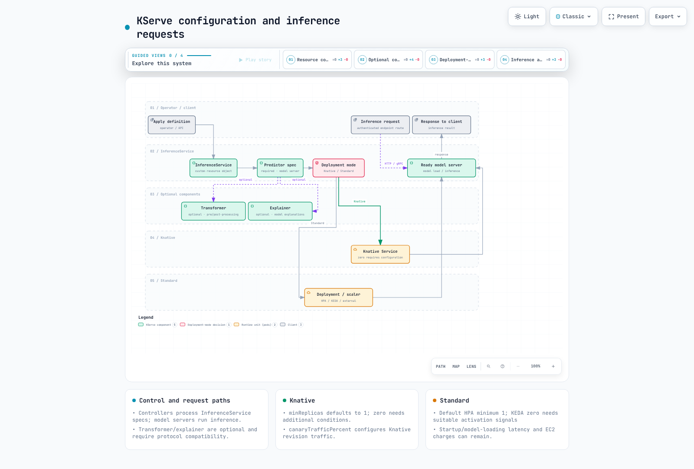

# Parte 6: KServe — Servicio de modelos en Kubernetes

> **Línea base revisada**: KServe 0.18.0 / Models Web Application 0.18.0 / Community Distribution 26.03.1
> **Última actualización**: September 12, 2026

## Configuración del entorno de laboratorio

Use Kubernetes compatible, el controller/los CRD de KServe, ServingRuntime, acceso al almacenamiento y una ruta de red autenticada. No se requiere Kubeflow completo; la aplicación web es opcional. El modo Knative necesita Knative Serving/networking; la ruta KEDA de Standard necesita KEDA y proveedores de métricas. Las GPU dependen de la carga de trabajo.

## KServe y Kubeflow

KServe evolucionó de KFServing a un proyecto de servicio independiente. Este capítulo revisa **KServe y Models Web Application 0.18.0** incluidos en Community Distribution 26.03.1. La última versión pública de KServe revisada fue la **0.20.0 (August 6, 2026)**; no es la misma que la línea base 0.18.0 de la distribución.

El controller, los CRD y la aplicación web son artefactos separados que requieren comprobaciones de compatibilidad. Sus números de versión no necesariamente deben coincidir ni ser siempre diferentes. Registre las imágenes reales, los esquemas de CRD y las revisiones de la aplicación web.

`InferenceService` es la API de servicio tratada aquí, no toda la arquitectura de KServe. ServingRuntime/ClusterServingRuntime, ModelMesh y la API independiente LLMInferenceService tienen dependencias y modelos operativos diferentes.

## InferenceService: Predictor, Transformer, Explainer

InferenceService tiene un predictor obligatorio y transformer/explainer opcionales. Predictor configura el servidor de modelos, transformer proporciona preprocesamiento/posprocesamiento y explainer gestiona las solicitudes de explicaciones. Las explicaciones no se adjuntan automáticamente a cada predicción; la compatibilidad del runtime/protocolo es importante.

Haga coincidir modelFormat, ServingRuntime, diseño de archivos/versión de biblioteca, URI/credenciales, puertos/probes y protocolo de solicitud. Una URI por sí sola no puede hacer que todos los modelos sean servibles. Los contenedores personalizados también deben cumplir el contrato del cliente y los requisitos de enrutamiento/verificación de estado de KServe.

El chart oficial de configuración de runtime no genera recursos de forma predeterminada. Renderizar con `kserve.servingruntime.enabled=true` produce 12 ClusterServingRuntimes. La presencia en el catálogo no establece la actualidad de la imagen, el soporte de seguridad ni la compatibilidad del modelo.

El [aviso del proyecto](https://github.com/pytorch/serve) de TorchServe indica que no se prevén nuevas funciones, correcciones de errores ni parches de seguridad. Su presencia en un catálogo de runtime antiguo no lo convierte en una opción predeterminada mantenida para uso nuevo en producción. Valide un runtime mantenido para el formato de modelo y los requisitos de GPU.

## Modos de Deployment: Knative y Standard

Los nombres de la versión 0.18.0 son **Knative** y **Standard**. Los valores de anotación Serverless y RawDeployment son alias obsoletos normalizados a esos nombres. Inspeccione serving.kserve.io/deploymentMode e inferenceservice-config instalado. El valor de reserva del código es Standard, mientras que el chart de recursos OCI descargado usa Knative de forma predeterminada. No infiera los valores predeterminados de la instalación solo a partir de la terminología.

| Elemento | Knative | Standard |
| --- | --- | --- |
| Recursos de carga de trabajo | Ruta de Knative Service/Revision | Deployment/Service y el autoscaler seleccionado |
| Reducción de escalado | Es posible llegar a cero con soporte de KPA/política y minReplicas=0 | La ruta HPA predeterminada mantiene al menos uno; KEDA puede admitir cero con señales de activación externa adecuadas |
| minReplicas predeterminado | KServe usa uno de forma predeterminada; elegir solo Knative no habilita cero | HPA limita un cero solicitado a por lo menos uno |
| Dependencias | Knative Serving/networking y el autoscaler seleccionado | Ingress/gateway elegido, métricas de HPA o KEDA, etc. |
| Latencia de inicio | Programación/carga de imagen/modelo al comenzar desde cero | Los reinicios, rollouts y el escalado horizontal aún generan latencia de inicio a pesar de las réplicas activas |

Ningún modo garantiza réplicas disponibles ni un SLA de latencia. Valide la carga del modelo, la preparación, la capacidad, los tiempos de espera y la recuperación. El escalado desde cero de KEDA requiere una señal observable sin ejecutar Pods y una ruta de reactivación; las métricas de CPU/memoria por sí solas no implican activación impulsada por solicitudes.

[🔍 Ver diagrama interactivo](https://www.atomai.click/kubernetes-docs/archmaps/en-ai-ml-kubeflow-06-kserve-0.html)

## Autoscaling y métricas

Knative KPA admite concurrencia/RPS, mientras que la clase HPA de Knative es otra ruta. Standard selecciona hpa, keda o external/none mediante serving.kserve.io/autoscalerClass. No todo Deployment Standard crea un HPA.

Las métricas de CPU, externas o de Pod compatibles necesitan las dependencias reales de metrics-server/adapter/provider. Las solicitudes de GPU no crean métricas de GPU automáticamente. La velocidad de respuesta depende de los intervalos de observación, la estabilización y el comportamiento del modelo; las métricas de concurrencia no son universalmente más rápidas.

## Actualizaciones graduales y tráfico canary

El canaryTrafficPercent de esta versión se verificó en la **ruta de división de tráfico de Knative Revision**. KServe establece la revisión desplegada anteriormente y la nueva revisión como destinos de tráfico de Knative Service; el networking de Knative distribuye las solicitudes. El controller de KServe no es el proxy para cada llamada de inferencia.

No equipare una actualización gradual de Deployment Standard con ese enrutamiento por porcentaje de revisión. El enrutamiento ponderado en Standard necesita servicios/gateway/mesh diseñados por separado o herramientas de rollout y una propiedad clara. Al usar [gestión de tráfico de Istio](../../service-mesh/istio/traffic-management/04-traffic-splitting.md) o [Argo Rollouts](../../service-mesh/istio/advanced/08-argo-rollouts.md), evite una propiedad conflictiva de los objetos gestionados por KServe.

Un porcentaje por sí solo no valida la calidad ni automatiza la promoción/reversión. Compruebe las métricas de comparación, los errores/latencia, las revisiones/artefactos de modelo conservados y la preparación de la ruta.

## Inferencia de GPU en EKS

La solicitud nvidia.com/gpu de un Pod habilita la programación/asignación de dispositivos. La inferencia real de GPU requiere CUDA/drivers compatibles, imagen de servidor, backend de modelo y configuración de dispositivo. Revise la configuración del modelo Triton o la selección de dispositivo del framework; una solicitud de GPU no mueve automáticamente un modelo de CPU a GPU.

Karpenter aprovisiona para Pods Pending elegibles, NodePools, cuotas y capacidad disponible. El escalado de Pods de KServe/Knative/HPA/KEDA y el aprovisionamiento/recuperación de EC2 son bucles separados. Incluso con cero Pods de modelo, otras cargas de trabajo o políticas de interrupción pueden mantener nodos y costos en ejecución.

## Validación y fuentes

Los charts oficiales OCI de CRD/recurso/configuración de runtime 0.18.0 se descargaron y renderizaron localmente para inspeccionar esquemas/configuración. Se revisaron los alias de modo, los mínimos de HPA, KEDA ScaledObject y el código de tráfico de Knative. No se ejecutó ninguna descarga/servicio de modelo, GPU, autoscaling de clúster ni solicitud canary en vivo.

- [Nombres y valores predeterminados del modo 0.18.0](https://github.com/kserve/kserve/blob/v0.18.0/pkg/constants/constants.go)
- [Manejo de réplicas mínimas de HPA](https://github.com/kserve/kserve/blob/v0.18.0/pkg/controller/v1beta1/inferenceservice/reconcilers/hpa/hpa_reconciler.go)
- [Manejo de KEDA ScaledObject](https://github.com/kserve/kserve/blob/v0.18.0/pkg/controller/v1beta1/inferenceservice/reconcilers/keda/keda_reconciler.go)
- [Manejo de tráfico de Knative](https://github.com/kserve/kserve/blob/v0.18.0/pkg/controller/v1beta1/inferenceservice/reconcilers/knative/ksvc_reconciler.go)
- [Versión 0.20.0](https://github.com/kserve/kserve/releases/tag/v0.20.0)

## Próximos pasos

Conecte esta ruta de servicio con los capítulos de arquitectura, Pipelines, Notebooks, Katib y Trainer de la [serie de Kubeflow](README.md), mientras trata el despliegue y la validación de artefactos de modelo como pasos separados.

---

[Volver a la página principal](./README.md)

## Cuestionario

Para comprobar lo que ha aprendido en este capítulo, pruebe el [cuestionario del tema](../../quizzes/ai-ml/kubeflow/06-kserve-quiz.md).
