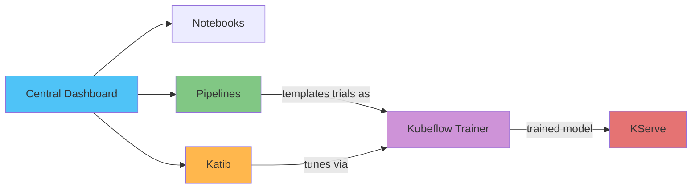

# Análisis profundo de Kubeflow en EKS

> **Versiones compatibles**: Kubeflow Community Distribution 26.03
> **Última actualización**: August 19, 2026

## Descripción general

Kubeflow es una plataforma de machine learning de código abierto para Kubernetes que reúne los componentes que un equipo necesita para ejecutar cargas de trabajo de ML de extremo a extremo — orquestación de pipelines, notebooks, ajuste de hiperparámetros, entrenamiento distribuido y servicio de modelos — como un conjunto de controllers y CRD nativos de Kubernetes, en lugar de una única aplicación monolítica. El 17 de agosto de 2026, la CNCF anunció la graduación de Kubeflow (que se unió como proyecto incubado en 2023), tras una auditoría de seguridad independiente y la formación de un comité directivo formal, una señal sólida de la madurez del proyecto para producción.

## Mapa de componentes

| Componente | Problema que resuelve | CRD / Concepto principal | Análisis profundo |
|-----------|--------------------|---------------------|-----------|
| **Central Dashboard & Profiles** | Acceso multiinquilino, aislamiento de namespace por usuario | Profile (namespace) | [Parte 1](01-architecture-installation.md) |
| **Kubeflow Pipelines** | Orquesta flujos de trabajo de ML de varios pasos como DAGs | `Pipeline`, `Run`, `Experiment` | [Parte 2](02-pipelines.md) |
| **Kubeflow Notebooks** | Entornos administrados de Jupyter/RStudio/VS Code por usuario | `Notebook` | [Parte 3](03-notebooks.md) |
| **Katib** | Ajuste de hiperparámetros y AutoML | `Experiment`, `Trial`, `Suggestion` | [Parte 4](04-katib.md) |
| **Kubeflow Trainer** | Entrenamiento distribuido de modelos entre frameworks | `TrainJob`, `ClusterTrainingRuntime` | [Parte 5](05-training-operator.md) |
| **KServe** | Servicio de modelos e inferencia | `InferenceService` | [Parte 6](06-kserve.md) |

## Por qué ejecutar esto en EKS

Los componentes de Kubeflow están diseñados para ejecutarse en cualquier clúster de Kubernetes conforme, lo que significa que las prácticas operativas que este sitio de documentación ya cubre para EKS — escalado automático impulsado por Karpenter (incluidos los node pools de GPU), IRSA/Pod Identity para el acceso a servicios de AWS, integración de almacenamiento EBS/S3 y observabilidad con Prometheus/Grafana — se aplican directamente a las cargas de trabajo de ML, en lugar de requerir una plataforma independiente específica de ML. La contrapartida frente a alternativas totalmente administradas (p. ej., Amazon SageMaker) es la misma que se aborda en [Datos en EKS](../../data-on-eks/README.md): mayor responsabilidad operativa (actualizaciones de Operator, configuración de almacenamiento/identidad) a cambio de un único modelo de deployment/observabilidad compartido por todas las cargas de trabajo del clúster, y la capacidad de ejecutar cualquiera de los componentes de Kubeflow de forma independiente en lugar de adoptar toda la plataforma de una vez.

## Contenido cubierto actualmente

1. [Parte 1: Arquitectura e instalación de Kubeflow en EKS](01-architecture-installation.md) — arquitectura de componentes, contexto de la graduación de la CNCF, instalación mediante `awslabs/kubeflow-manifests` en EKS
2. [Parte 2: Kubeflow Pipelines](02-pipelines.md) — KFP SDK v2, compilación de pipelines basada en IR, almacenamiento de artefactos respaldado por S3
3. [Parte 3: Kubeflow Notebooks](03-notebooks.md) — servidores de notebooks por usuario, multiinquilinato basado en Profile, programación de GPU
4. [Parte 4: Katib — Ajuste de hiperparámetros y AutoML](04-katib.md) — modelo Experiment/Trial/Suggestion, algoritmos de búsqueda, detención anticipada
5. [Parte 5: Kubeflow Trainer y entrenamiento distribuido](05-training-operator.md) — la transición de Training Operator v1 a Kubeflow Trainer v2, TrainJob/TrainingRuntime
6. [Parte 6: KServe — Servicio de modelos en Kubernetes](06-kserve.md) — InferenceService, modo Serverless frente a Raw Deployment, despliegues canary
