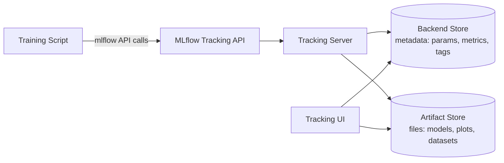

# Parte 1: Seguimiento de MLflow

> **Versiones compatibles**: MLflow 3.15.1
> **Última actualización**: August 19, 2026

## Configuración del entorno de laboratorio

Para seguir los ejemplos de este documento, necesitarás las siguientes herramientas y entorno:

### Herramientas necesarias

* Python 3.10 o posterior
* `pip install mlflow` (este documento asume MLflow 3.x; instala una versión específica fijada como `mlflow==3.15.1` si quieres reproducir exactamente los ejemplos)
* Acceso a un servidor de seguimiento de MLflow en ejecución, o ejecuta uno localmente para estos ejemplos con `mlflow server` — la [Parte 3: Despliegue en EKS](./03-eks-deployment.md) explica cómo configurar un servidor de seguimiento de producción en EKS
* Un script de entrenamiento o notebook al que puedas añadir unas líneas de código de registro (cualquier ejemplo de scikit-learn, PyTorch o similar funciona)

## ¿Qué es MLflow Tracking?

MLflow Tracking es la parte de MLflow que registra y consulta información sobre ejecuciones de entrenamiento de machine learning. Combina una API de Python (y REST) para registrar datos con una UI para explorarlos. Lo que se registra se divide en algunas categorías: parámetros (las entradas de una ejecución, como una tasa de aprendizaje o un tamaño de batch), métricas (las salidas medidas durante o después del entrenamiento, como la precisión o la pérdida), artefactos (archivos arbitrarios que produce una ejecución, como gráficos, conjuntos de datos o modelos serializados) y —desde MLflow 3— los propios modelos, registrados como entidades de primera clase en lugar de archivos simples.

Todo esto se registra mediante un **servidor de seguimiento**, que en realidad son dos almacenes que cooperan detrás de una API: un almacén de backend que contiene metadatos estructurados y un almacén de artefactos que contiene los archivos binarios grandes. El resto de este documento cubre los conceptos que necesitas para usar Tracking en el día a día; la separación entre el almacén de backend y el de artefactos cobra más importancia una vez que despliegas tu propio servidor de seguimiento, por lo que la Parte 3 la retoma con mayor profundidad.

## Conceptos fundamentales: Experimentos y ejecuciones

Un **Experimento** es una colección con nombre de ejecuciones (Runs), normalmente un experimento por proyecto o por modelo sobre el que estás iterando. Una **ejecución (Run)** es una única ejecución de tu código de entrenamiento: una llamada para entrenar un modelo, evaluarlo o producir de otro modo algo que valga la pena registrar. Cada ejecución captura sus propios parámetros, métricas, etiquetas y artefactos, para que puedas comparar las ejecuciones entre sí dentro del mismo experimento y ver qué configuración obtuvo el mejor resultado.

Una llamada mínima de seguimiento se ve así:

```python
import mlflow

with mlflow.start_run():
    mlflow.log_param("learning_rate", 0.01)
    mlflow.log_metric("accuracy", 0.92)
    mlflow.log_artifact("confusion_matrix.png")
```

El administrador de contexto `with mlflow.start_run()` abre una ejecución, asocia cada llamada de registro dentro del bloque con esa ejecución y la cierra automáticamente cuando se sale del bloque.

### Registro automático

Llamar manualmente a `log_param` y `log_metric` para cada valor que te interesa se vuelve tedioso rápidamente. La funcionalidad de **registro automático** de MLflow instrumenta bibliotecas comunes de ML para que los parámetros, las métricas y los artefactos se capturen automáticamente durante el entrenamiento, sin cambiar tu código de entrenamiento. Una única llamada lo habilita:

```python
mlflow.autolog()
```

Esto habilita el registro automático para el framework compatible que se esté usando en el proceso actual. MLflow también incluye funciones de registro automático específicas de cada framework —por ejemplo, una para scikit-learn y otra para PyTorch— para los casos en los que quieras habilitar el registro automático para una sola biblioteca en lugar de todo lo que MLflow pueda detectar. El registro automático es una buena opción predeterminada para las ejecuciones de entrenamiento rutinarias; el registro manual sigue siendo útil cuando necesitas capturar valores que el registro automático no conoce, como métricas de evaluación personalizadas o artefactos específicos del dominio.

## El cambio de MLflow 3: Modelos como entidades de primera clase

Si has usado MLflow 1.x o 2.x, el seguimiento de modelos funcionaba de forma diferente a como funciona ahora. En ese modelo anterior, centrado en las ejecuciones, un modelo registrado era simplemente otro **artefacto anidado bajo una ejecución (Run)**: llamabas a `mlflow.sklearn.log_model(...)` dentro de un bloque `mlflow.start_run()` activo, y los archivos del modelo terminaban en el directorio de artefactos de esa ejecución junto con tus gráficos y conjuntos de datos. Para encontrar un modelo, primero tenías que encontrar la ejecución que lo produjo.

MLflow 3 cambia esto al introducir **`LoggedModel`** como su propia entidad de primera clase, separada de la ejecución (Run) que lo produjo. De ello se derivan algunas consecuencias:

* Puedes llamar directamente a `mlflow.sklearn.log_model(...)`, sin un contexto `mlflow.start_run()` activo; el modelo no necesita estar anidado bajo una ejecución para ser registrado.
* La UI de seguimiento tiene una vista dedicada de **Modelos registrados**, distinta de la vista de Experimentos/Ejecuciones, donde puedes explorar y comparar modelos directamente en lugar de buscar entre ejecuciones para encontrar la que produjo un modelo que te interesa.
* Dado que un modelo ya no es solo un archivo bajo una ejecución, MLflow 3 puede seguir un linaje más rico entre este y las ejecuciones, trazas, prompts y métricas de evaluación asociadas a él: un modelo puede vincularse con la ejecución que lo entrenó, las ejecuciones que lo evaluaron y cualquier traza generada al servirlo, en lugar de estar permanentemente ligado a una única ejecución de entrenamiento.

Esto desacopla el versionado y la comparación de modelos de cualquier ejecución de entrenamiento individual, lo que resulta especialmente importante cuando iteras sobre el mismo modelo en muchas ejecuciones o generas modelos completamente fuera de un ciclo de entrenamiento tradicional (por ejemplo, al envolver un LLM existente con lógica personalizada).

## Observabilidad de GenAI y LLM: Trazado

El alcance original de MLflow era el seguimiento de experimentos de ML clásico: parámetros, métricas y artefactos para ejecuciones de entrenamiento. MLflow 3 extiende ese mismo sistema de seguimiento para cubrir la **observabilidad de GenAI y agentes** como una funcionalidad central, no como una herramienta independiente. El mecanismo para ello es el **trazado**.

El trazado captura los pasos internos de una llamada a un LLM o agente como un árbol de **spans** —cada span representa un paso, como una llamada de recuperación, una invocación de herramienta o una llamada al modelo subyacente— junto con el uso de tokens y el coste de cada paso. MLflow proporciona instrumentación automática para frameworks populares de LLM y agentes, incluido LangChain, e integraciones más recientes de trazado automático para frameworks como PydanticAI y smolagents, por lo que, en muchos casos, habilitar el trazado requiere pocos o ningún cambio en el código de tu aplicación. Las trazas se pueden ver en la misma UI de seguimiento que se usa para experimentos y ejecuciones y —como reflejo del linaje que sigue MLflow 3— se pueden vincular con el modelo, prompt o ejecución de evaluación que las produjo.

La implicación práctica es que un equipo que realiza tanto entrenamiento de ML clásico como desarrollo de LLM/agentes puede usar un único despliegue de MLflow Tracking para ambos, en lugar de configurar una herramienta de observabilidad independiente para la parte de GenAI.

## Almacén de backend frente a almacén de artefactos

El servidor de seguimiento divide lo que almacena en dos categorías, respaldadas por dos tipos diferentes de almacenamiento:

* **Almacén de backend**: metadatos estructurados —parámetros, métricas, etiquetas y los registros que describen experimentos, ejecuciones y (en MLflow 3) modelos registrados—. A cualquier escala de equipo superior a la experimentación local rápida, esto necesita una base de datos relacional real, como PostgreSQL o MySQL, en lugar del almacén local predeterminado basado en archivos.
* **Almacén de artefactos**: objetos binarios grandes —archivos de modelo, gráficos, conjuntos de datos y cualquier otro archivo que produzca una ejecución—. Normalmente se trata de almacenamiento de objetos, como un bucket compatible con S3, en lugar de una base de datos.

Esta separación importa porque los dos almacenes tienen requisitos diferentes de durabilidad, escalado y patrones de acceso: una base de datos es adecuada para muchas escrituras y consultas estructuradas pequeñas, mientras que el almacenamiento de objetos es adecuado para almacenar y recuperar archivos grandes. La [Parte 3: Despliegue en EKS](./03-eks-deployment.md) profundiza en las decisiones de infraestructura que esto implica cuando ejecutas tu propio servidor de seguimiento en EKS; por ahora, basta con saber que existen los dos almacenes y que cumplen propósitos diferentes.



El script de entrenamiento nunca se comunica directamente con ninguno de los dos almacenes; siempre pasa por la API de Tracking, que el servidor de seguimiento utiliza para dirigir las escrituras de metadatos al almacén de backend y las escrituras de archivos al almacén de artefactos. La UI lee de ambos almacenes para representar experimentos, ejecuciones, modelos registrados y trazas.

## Próximos pasos

Este documento cubrió lo que registra MLflow Tracking, cómo los Experimentos y las ejecuciones organizan esos datos, cómo la entidad `LoggedModel` de MLflow 3 cambia el seguimiento de modelos en comparación con los modelos anteriores anidados en ejecuciones y cómo el trazado extiende el mismo sistema a la observabilidad de GenAI y agentes. La [Parte 2: Registro de modelos](./02-model-registry.md) cubre lo que ocurre después de que una ejecución produce un modelo que merece conservarse: registrarlo, versionarlo y promoverlo hacia producción con alias como `champion`. La [Parte 3: Despliegue en EKS](./03-eks-deployment.md) cubre cómo ejecutar tu propio servidor de seguimiento en EKS, incluidas las opciones de almacén de backend y almacén de artefactos introducidas anteriormente.

[Volver a la página principal](./README.md)

## Cuestionario

Para comprobar lo que has aprendido en este capítulo, prueba el [Cuestionario del tema](../../quizzes/ai-ml/mlflow/01-tracking-quiz.md).
