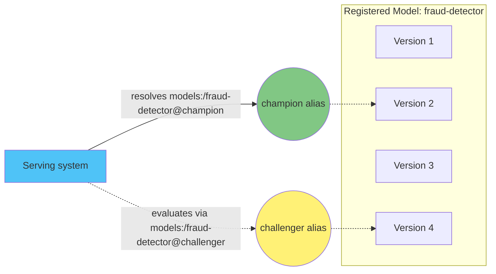

# Parte 2: MLflow Model Registry

> **Versiones compatibles**: MLflow 3.15.1
> **Última actualización**: August 19, 2026

## Configuración del entorno de laboratorio

Para seguir los ejemplos de este documento, necesitarás las siguientes herramientas y el siguiente entorno:

### Herramientas y recursos necesarios
- Python 3.10 o superior
- `pip install mlflow`
- Acceso a un servidor de tracking de MLflow en ejecución con acceso al registro (consulta [Part 1: MLflow Tracking](01-tracking.md) para saber cómo configurarlo, o [Part 3: Deploying MLflow on EKS](03-eks-deployment.md) para un servidor alojado en un clúster)

## Qué es el Model Registry

[Part 1](01-tracking.md) cubrió Tracking: el registro de parámetros, métricas, artefactos y entidades `LoggedModel` en Runs y Experiments. Un Run es el registro de un intento de entrenamiento. No es un buen identificador para «el modelo que desplegamos», porque la identidad de un Run está vinculada a cuándo y cómo ocurrió, no a lo que significa para el negocio.

El Model Registry resuelve esto al introducir los **Registered Models**: colecciones con nombre y versionadas de versiones de modelos que proporcionan a un modelo una identidad estable e independiente de cualquier entrenamiento o experimento individual. En vez de preguntar «qué Run produjo el modelo que está actualmente en producción», un equipo puede preguntar «qué es `fraud-detector` ahora mismo» y obtener una respuesta coherente sin importar cuántos experimentos se hayan ejecutado desde entonces.

El registro existe para gestionar el ciclo de vida de un modelo desde el desarrollo hasta la producción: registro, revisión, promoción y retirada final, todo ello asociado a un único nombre duradero.

## Conceptos principales

### Registered Model

Un Registered Model es un nombre; por ejemplo, `fraud-detector`. Es la entidad de nivel superior del registro. Todas las versiones, aliases, tags y descripciones asociados a un modelo se acumulan bajo este único nombre durante toda la vida del modelo.

### Model Version

Una Model Version es una versión inmutable y numerada registrada bajo el nombre de un Registered Model (la versión 1, versión 2, etc. de `fraud-detector`). Cada versión se crea una vez y nunca cambia después; un nuevo resultado de entrenamiento se convierte en una nueva versión, no en una edición de una anterior.

Cada Model Version apunta al `LoggedModel` subyacente (o al Run que lo produjo) del que procede. Esto es lo que conecta el registro con Tracking: la versión es un puntero a un punto específico del historial de un Run, no una copia que se ha alejado de su origen.

### Aliases

Un alias es un puntero mutable con nombre a una Model Version específica; por ejemplo, `champion` o `challenger`. A diferencia de un número de versión, un alias puede moverse: hoy `champion` puede apuntar a la versión 4 y, tras una evaluación satisfactoria, un equipo puede reasignarlo a la versión 7 sin modificar nada que consuma el alias.

Los aliases son el mecanismo principal y actual para representar el rol o la etapa del ciclo de vida de un modelo en el registro. Un sistema de serving o un trabajo posterior puede escribirse una vez para resolver `models:/fraud-detector@champion`, y siempre cargará la versión que actualmente tenga ese alias, sin que se requiera ningún cambio de código cuando cambie la versión subyacente.

### El modelo de etapas heredado (solo como referencia)

Las implementaciones antiguas de MLflow utilizaban un mecanismo diferente: cada Model Version tenía una **stage**, una de `Staging`, `Production` o `Archived`, y avanzar un modelo implicaba cambiar su etapa. Este modelo ha sido sustituido por aliases combinados con tags, que son más flexibles porque una sola versión puede tener varios aliases (o ninguno), y el nombre de un alias no está limitado a un conjunto fijo de etiquetas de ciclo de vida. El trabajo nuevo debe usar aliases y tags en lugar de stages. Los lectores que encuentren una implementación antigua de MLflow que use transiciones de etapas estarán viendo este enfoque heredado.

## Registro de un modelo

Una Model Version se crea de una de dos maneras, ambas basadas en lo que cubre la Parte 1.

**Registrar después del logging.** Después de que un entrenamiento registre un modelo como artefacto (o como un `LoggedModel`, según la Parte 1), puede registrarse por separado llamando a `mlflow.register_model(model_uri, name)`, donde `model_uri` apunta al modelo ya registrado y `name` es el Registered Model bajo el que se registrará. Es una buena opción cuando la decisión de registrar un modelo está separada del propio paso de entrenamiento; por ejemplo, un paso de revisión que solo registra modelos que cumplen un umbral de evaluación.

**Registrar en el momento del logging.** Como alternativa, el parámetro `registered_model_name` en una llamada a `log_model` específica de un flavor (por ejemplo, `mlflow.sklearn.log_model(..., registered_model_name="fraud-detector")`) registra el modelo como una nueva Model Version en la misma llamada que lo registra. Es una buena opción cuando cada ejecución de un script de entrenamiento determinado debe producir automáticamente una versión candidata.

Cualquiera de las dos vías crea una nueva Model Version inmutable bajo el Registered Model indicado. Ninguna de las dos vías mueve un alias; esa es una acción independiente y deliberada que se describe a continuación.

## Gobernanza y el flujo de trabajo de transferencia

El principal valor organizativo del registro es servir como punto de transferencia entre dos aspectos distintos: producir un modelo candidato y decidir qué candidato es lo suficientemente fiable como para ponerlo en serving.

Un flujo de trabajo típico es el siguiente:

1. Un equipo de ciencia de datos entrena modelos y registra cada resultado prometedor como una nueva Model Version bajo un nombre compartido de Registered Model, usando cualquiera de las vías de registro anteriores.
2. Un proceso de evaluación o aprobación —automatizado en CI/CD, manual o ambos— revisa una versión candidata comparándola con datos de prueba, comprobaciones de equidad o métricas de negocio.
3. Solo después de que una versión supere esos controles, algo mueve el alias `champion` para que apunte a ella, normalmente mediante la API de cliente (`set_registered_model_alias`) desde un pipeline automatizado en lugar de hacerlo manualmente.
4. La infraestructura de serving, que queda fuera del alcance de esta parte, se escribe una vez para resolver `models:/fraud-detector@champion` y nunca necesita codificar de forma fija un número de versión. Cuando `champion` se mueve, la siguiente resolución simplemente obtiene la nueva versión.

Esta separación significa que las personas o sistemas que producen modelos candidatos nunca necesitan control directo sobre lo que sirve en producción, y los sistemas que consumen un modelo nunca necesitan rastrear números de versión manualmente. Un alias `challenger` se usa habitualmente junto con `champion` para marcar una versión que está siendo evaluada para su promoción, sin alterar lo que está sirviendo actualmente.

## Linaje y reproducibilidad

Como cada Model Version conserva su vínculo con el Run (y, a través de él, con los parámetros, el código y las referencias de conjuntos de datos de la Parte 1) que la produjo, un equipo siempre puede responder una pregunta de auditoría como «qué código y datos exactos produjeron el modelo que actualmente sirve como `champion`». La cadena es: alias, Model Version, Run y los parámetros y artefactos registrados de ese Run.

Las Model Versions también admiten sus propios tags y descripciones, independientes de los tags del Run subyacente. Esto es útil para registrar contexto específico del registro; por ejemplo, quién aprobó una versión para su promoción o un enlace al informe de evaluación que justificó mover un alias, sin mezclar esa información con los metadatos propios del entrenamiento.

## Próximos pasos

La Parte 2 cubrió el propio registro: Registered Models, Model Versions, aliases como mecanismo actual del ciclo de vida y cómo el registro se conecta con [Part 1: MLflow Tracking](01-tracking.md). Cargar un modelo registrado en un endpoint de inferencia real es un aspecto independiente y queda fuera del alcance de esta serie; en cambio, [Part 3: Deploying MLflow on EKS](03-eks-deployment.md) cubre la configuración del servidor de tracking y los almacenes de respaldo de los que dependen tanto Tracking como el Model Registry.

[Volver a la página principal](./README.md)

## Cuestionario

Comprueba tus conocimientos con el [cuestionario de Model Registry](../../quizzes/ai-ml/mlflow/02-model-registry-quiz.md).
