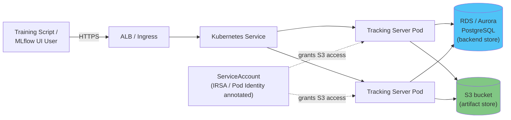

# Parte 3: Implementación de MLflow en EKS

> **Versiones compatibles**: MLflow 3.15.1, Kubernetes 1.34+
> **Última actualización**: August 19, 2026

## Configuración del entorno de laboratorio

Para seguir los ejemplos de este documento, necesitará las siguientes herramientas y entorno:

### Herramientas necesarias

* kubectl v1.34 o posterior, configurado para un clúster de Amazon EKS operativo
* Helm v3, si elige la ruta de instalación mediante el chart Helm de la comunidad
* Una instancia existente de Amazon RDS o Aurora PostgreSQL para el backend store (o la capacidad de aprovisionar una)
* Un bucket de S3 para el artifact store
* Un rol de IRSA o una asociación de EKS Pod Identity que conceda al tracking server acceso a ese bucket de S3

## Por qué ejecutar el Tracking Server de MLflow en EKS

La compensación aquí sigue el mismo patrón que otra infraestructura de ML autogestionada cubierta en este sitio de documentación. Un equipo que ya ejecuta EKS puede reutilizar los mismos manifiestos de implementación, la pila de observabilidad y los patrones de IAM (IRSA o Pod Identity) para MLflow que para todo lo demás en el clúster, en lugar de aprender un modelo operativo independiente. A cambio, ese equipo asume la operación del proceso del tracking server, junto con su backend store y artifact store, en vez de dirigir el código de entrenamiento a una alternativa administrada — MLflow administrado por Databricks o la capacidad de tracking compatible con MLflow de SageMaker, por ejemplo. Ninguna de las dos opciones es universalmente correcta; depende de si el equipo quiere un servicio más en su superficie operativa existente de Kubernetes, o un servicio menos que operar por completo.

## Arquitectura

Una implementación de MLflow en producción en EKS tiene tres componentes, y ninguno de ellos es opcional una vez que equipos reales comparten el tracking server.

**MLflow Tracking Server.** Es un contenedor que ejecuta `mlflow server` y expone tanto la API REST con la que se comunican los SDK de cliente (`mlflow.log_metric`, `mlflow.log_artifact`, etcétera) como la UI web donde las personas consultan experimentos y runs. No tiene estado por diseño — todo el estado persistente reside en el backend store y el artifact store — por lo que encaja naturalmente en un Kubernetes Deployment, situado detrás de un Service y un Ingress (normalmente respaldado por AWS Load Balancer Controller, que aprovisiona un ALB).

**Backend store.** El backend store predeterminado de MLflow es un archivo SQLite local, que funciona bien para una sola persona que experimenta en una laptop, pero deja de ser adecuado en cuanto más de un proceso necesita escribir de forma concurrente — SQLite simplemente no admite el nivel de acceso concurrente que requiere un tracking server compartido por un equipo. En AWS, el reemplazo estándar es una base de datos relacional real: Amazon RDS para PostgreSQL, o Aurora Serverless v2 si desea que la base de datos escale según la carga de tracking en lugar de dimensionarla por adelantado. El backend store contiene todos los metadatos estructurados de MLflow — experimentos, runs, parámetros, métricas, modelos registrados, versiones de modelos y alias (consulte la [Parte 2](02-model-registry.md)) — todo aquello que se beneficia de poder consultarse con SQL.

**Artifact store.** Las filas del backend store son pequeñas; las cosas que MLflow registra junto con ellas a menudo no lo son. Los modelos serializados, gráficos, datasets y otros objetos binarios grandes van a un artifact store independiente en lugar de a la base de datos. En AWS, es Amazon S3: el tracking server escribe y lee artifacts bajo un URI de S3 configurado como la raíz de artifacts predeterminada, y los clientes obtienen artifacts a través del proxy del tracking server o con acceso directo a S3, según cómo esté configurado el servidor.



## Enfoques de instalación

Hay dos rutas prácticas para poner en ejecución los componentes anteriores en un clúster.

**Escriba sus propios manifiestos.** Un Deployment para el contenedor de `mlflow server`, un Service delante de él y un Ingress (o un Service de tipo `LoadBalancer`) para exponerlo externamente, con la cadena de conexión del backend store y la raíz de artifacts de S3 proporcionadas como variables de entorno o indicadores de línea de comandos en el contenedor. Esto proporciona control total sobre cada detalle, a costa de mantener el YAML usted mismo.

**Use un chart Helm de la comunidad.** El proyecto `community-charts/helm-charts` mantiene un chart de MLflow precisamente para este caso de uso:

```bash
helm repo add community-charts https://community-charts.github.io/helm-charts
helm repo update
helm search repo community-charts/mlflow
```

El chart expone configuración para los componentes descritos anteriormente a nivel conceptual — dirigir el backend store a una conexión de base de datos externa en lugar de SQLite, dirigir el artifact store a un bucket de S3 y las consideraciones habituales de Kubernetes como el número de réplicas, las solicitudes de recursos y la configuración de Ingress. Consulte la documentación propia del chart para conocer las claves exactas de `values.yaml` y los valores predeterminados actuales antes de implementarlo, ya que pueden cambiar entre versiones del chart.

Cualquiera de las dos rutas llega a la misma arquitectura de tiempo de ejecución: uno o más Pods de tracking server sin estado, una base de datos a la que todos apuntan y un bucket de S3 al que todos apuntan.

## Acceso de IAM al Artifact Store

El Pod del tracking server necesita permisos de AWS para leer y escribir objetos en el bucket de artifacts de S3 — por ejemplo, `s3:PutObject` y `s3:GetObject` restringidos al prefijo de ese bucket. En EKS, el mecanismo establecido desde hace tiempo para vincular un rol de IAM a una Kubernetes ServiceAccount es IRSA (IAM Roles for Service Accounts), que anota la ServiceAccount con `eks.amazonaws.com/role-arn` para que los Pods que la usan reciban credenciales temporales para ese rol. EKS Pod Identity es el mecanismo más reciente para vincular roles de IAM a Pods y es cada vez más el valor predeterminado recomendado para nuevos vínculos de IAM a Pod en EKS en general, independientemente de la carga de trabajo. Ambos mecanismos mantienen las credenciales estáticas de AWS fuera del entorno y la configuración del tracking server: para una nueva implementación de MLflow, Pod Identity es el punto de partida más moderno, mientras que IRSA sigue siendo una opción válida en clústeres o equipos ya estandarizados en ella.

## Notas operativas

**Ejecute más de una réplica.** Como un tracking server respaldado por Postgres no tiene estado — todo el estado compartido reside en la base de datos y S3, no en el Pod — es seguro ejecutar varias réplicas detrás del Service y el Ingress para disponer de disponibilidad. Esta es una diferencia significativa respecto al valor predeterminado de un solo proceso respaldado por SQLite, que no se puede escalar horizontalmente de forma segura, ya que SQLite no tolera escritores concurrentes.

**Configure probes de estado.** Al igual que con cualquier servicio de Kubernetes de larga ejecución, configure probes de readiness y liveness para el endpoint de estado del tracking server, de modo que el Service solo enrute tráfico a Pods que realmente puedan atender solicitudes y que un Pod bloqueado se reinicie automáticamente. Confirme la ruta exacta de health check con la versión de MLflow que esté ejecutando en lugar de asumir una, ya que puede variar según la versión.

**Dimensione la base de datos según su patrón de escritura.** Cada parámetro, métrica y paso de métrica registrado supone una escritura en el backend store, por lo que los trabajos de entrenamiento que registran métricas a alta frecuencia (por paso en lugar de por época, por ejemplo) ejercen una carga real sobre la base de datos. Vale la pena considerar Aurora Serverless v2 específicamente porque puede absorber una carga de tracking irregular procedente de una ejecución de entrenamiento sin exigir que la base de datos se dimensione para la carga máxima durante todo el año.

## Próximos pasos

Este es el final de esta serie de tres partes sobre MLflow: la [Parte 1](01-tracking.md) cubrió el registro de experimentos y runs; la [Parte 2](02-model-registry.md) cubrió cómo dar a los modelos entrenados una identidad estable y versionada en el Model Registry; y esta parte cubrió la ejecución del tracking server, el backend store y el artifact store en EKS. Una vez que un modelo tiene una versión o alias registrado, el siguiente paso natural que dan muchos equipos es cargar esa versión específica en un sistema de serving — KServe, un wrapper personalizado de FastAPI o Flask, SageMaker u otra alternativa por completo. Esa capa de serving es por sí misma un tema amplio y queda fuera del alcance de esta serie.

[Volver a la página principal](./README.md)

## Cuestionario

Para comprobar lo que ha aprendido en este capítulo, pruebe el [Cuestionario del tema](../../quizzes/ai-ml/mlflow/03-eks-deployment-quiz.md).
