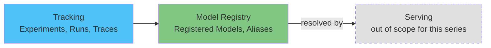

# Análisis detallado de MLflow en EKS

> **Versiones compatibles**: MLflow 3.15.1
> **Última actualización**: August 19, 2026

## Descripción general

MLflow es una plataforma de código abierto para gestionar el ciclo de vida del aprendizaje automático — seguimiento de experimentos, empaquetado y versionado de modelos y (desde MLflow 3) observabilidad de GenAI/LLM — mediante un servidor de seguimiento en el que cualquier script de entrenamiento o agente puede registrar datos a través de una API sencilla. A diferencia de Kubeflow, que agrupa una plataforma completa de controladores nativos de Kubernetes, MLflow es un único servicio (un servidor de seguimiento junto con sus almacenes de backend/artefactos) que los equipos suelen ejecutar junto con Kubeflow, una configuración de entrenamiento personalizada o nada más.

## Mapa de componentes

| Concepto | Problema que resuelve | Análisis detallado |
|---------|--------------------|-----------|
| **Tracking** | Registra y consulta parámetros de experimentos, métricas, artefactos, modelos y trazas de GenAI | [Part 1](01-tracking.md) |
| **Model Registry** | Otorga a un modelo una identidad estable y versionada, independiente de cualquier ejecución de entrenamiento | [Part 2](02-model-registry.md) |
| **EKS Deployment** | Ejecuta el servidor de seguimiento, el almacén de backend y el almacén de artefactos en EKS | [Part 3](03-eks-deployment.md) |

## Por qué ejecutar esto en EKS

La compensación es la misma que se trata en otras secciones de datos/ML de este sitio de documentación: un equipo que ya ejecuta EKS puede reutilizar los mismos patrones de implementación, IAM (IRSA/Pod Identity) y observabilidad para el servidor de seguimiento de MLflow que para todo lo demás en el clúster, a cambio de operar directamente el servidor de seguimiento, su base de datos de backend y su almacén de artefactos en lugar de usar una alternativa administrada.

## Contenido actual

1. [Parte 1: MLflow Tracking](01-tracking.md) — experimentos, ejecuciones, autologging, el cambio a `LoggedModel` de MLflow 3 y trazado de GenAI
2. [Parte 2: MLflow Model Registry](02-model-registry.md) — Registered Models, Model Versions, alias y linaje
3. [Parte 3: Implementación de MLflow en EKS](03-eks-deployment.md) — servidor de seguimiento, almacén de backend de PostgreSQL, almacén de artefactos de S3 y acceso de IAM
