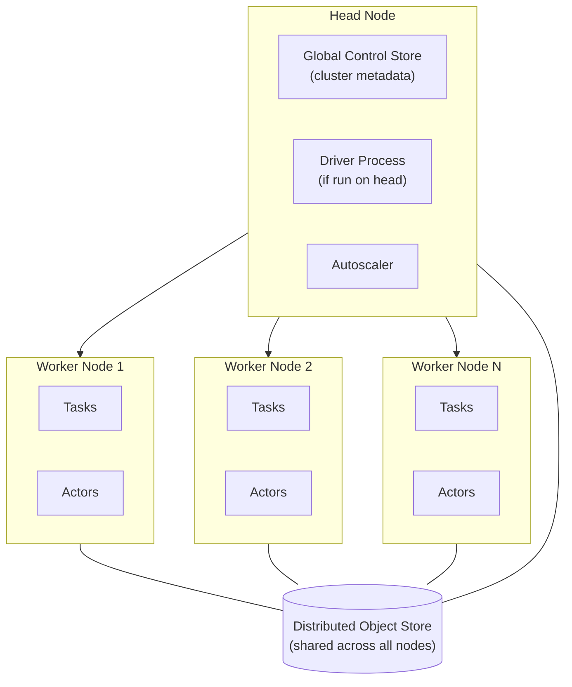

# Parte 1: Arquitectura de Ray

> **Versiones compatibles**: Ray 2.57.0
> **Última actualización**: August 20, 2026

## Configuración del entorno del laboratorio

Para seguir los ejemplos de este documento, necesitará las siguientes herramientas y entorno:

### Herramientas necesarias

* Python 3.10 o posterior
* `pip install ray[default]` (el extra `default` incluye las dependencias de dashboard y cluster-launcher utilizadas en ejemplos posteriores; un simple `pip install ray` proporciona únicamente las API centrales mostradas en este documento)
* Una máquina local o VM con algunos núcleos de CPU libres es suficiente para ejecutar los ejemplos siguientes; no se requiere ningún cluster para la Parte 1

## ¿Qué es Ray?

Ray es un framework de computación distribuida de código abierto para escalar cargas de trabajo de Python. No es un framework creado para una carga de trabajo específica, como podría ser una herramienta exclusiva para entrenamiento o serving. En su lugar, Ray proporciona un pequeño conjunto de primitivas de propósito general que permiten tomar código Python común y ejecutarlo en muchos núcleos de CPU o muchas máquinas, con relativamente pocos cambios.

Estas primitivas son lo bastante generales para abarcar una amplia gama de casos de uso: paralelizar un lote ad hoc de llamadas a funciones, ejecutar entrenamiento de modelos distribuido, realizar una búsqueda de hiperparámetros en muchos trials o servir un modelo detrás de un endpoint de inferencia escalable. Las bibliotecas de nivel superior de Ray — Ray Train, Ray Tune y Ray Serve, presentadas brevemente a continuación y cubiertas en profundidad en partes posteriores de esta serie — están todas construidas sobre las mismas primitivas subyacentes, en lugar de ser herramientas independientes y no relacionadas. Esta base compartida es la distinción arquitectónica clave de Ray frente a un ecosistema de herramientas especializadas, cada una con su propio modelo de ejecución, que simplemente se agrupan juntas.

## Primitivas principales

El modelo de programación de Ray se basa en tres primitivas: tasks, actors y el object store.

### Tasks

Una **task** es una función sin estado que Ray ejecuta de forma remota en lugar de hacerlo en el proceso que la llama. Se convierte una función común de Python en una task aplicándole el decorador `@ray.remote`. Llamar a la función decorada devuelve inmediatamente un future (un `ObjectRef`) en lugar de bloquearse hasta que la función termine; Ray programa la ejecución real en algún worker del pool de recursos del cluster. Como una task no conserva estado entre llamadas, Ray puede ejecutar cualquier llamada dada en el worker que tenga capacidad disponible, lo que facilita escalar las tasks horizontalmente.

Las tasks son adecuadas de forma natural para trabajo vergonzosamente paralelo: aplicar la misma función a muchas entradas independientes, ejecutar muchas simulaciones independientes o preprocesar muchos fragmentos de datos. Como cada llamada a una task es independiente y sin estado, Ray puede programar grandes cantidades de ellas en todo el cluster sin necesidad de rastrear ninguna relación entre una llamada y la siguiente.

### Actors

Un **actor** es la contraparte con estado de una task. Aplicar `@ray.remote` a una clase de Python la convierte en un actor: Ray instancia la clase en un worker y mantiene esa instancia activa como un proceso remoto de larga duración, en lugar de como una única llamada que devuelve un resultado y desaparece. Las llamadas a métodos en un handle de actor se enrutan entonces a esa misma instancia activa, por lo que el estado almacenado en la instancia — los weights de un modelo, un contador, una conexión abierta — persiste entre llamadas.

Los actors son la primitiva adecuada cuando se necesita mantener estado entre llamadas: un contador acumulativo, un modelo cargado que se mantiene residente en memoria en lugar de volver a cargarse para cada solicitud, o una simulación con estado que avanza llamada a llamada. Las tasks y los actors son opciones complementarias, no competidoras: una aplicación típica de Ray combina ambos, utilizando tasks para trabajo paralelo sin estado y actors donde sea necesario que el estado persista.

### El Object Store

El **object store** es un almacén distribuido de memoria compartida que contiene los objetos que las tasks y los actors se pasan entre sí — argumentos de funciones, valores de retorno y cualquier otra cosa colocada explícitamente en él. Cada nodo del cluster ejecuta su propio object store local, y Ray coordina el movimiento de datos entre ellos según sea necesario para que una task que se ejecuta en un worker pueda leer un objeto producido en otro.

El object store es más importante para objetos grandes: un array grande de NumPy, un fragmento de dataset o los weights de un modelo. En vez de serializar y copiar dicho objeto en cada proceso que lo necesita, Ray puede mantener una copia en memoria compartida en un nodo y permitir que varios procesos locales lo lean sin duplicarlo en la memoria propia de cada proceso. Esto permite a Ray mover datos grandes entre tasks y actors de forma eficiente, en lugar de pagar un coste de serialización y copia en cada llamada.

## Arquitectura del cluster: Head Node y Worker Nodes

Un cluster de Ray está formado por un **head node** y cualquier cantidad de **worker nodes**. Cada nodo — tanto head como worker — ejecuta procesos de Ray y aporta CPU, GPU y memoria al pool compartido de recursos del cluster.

El head node ejecuta algunas responsabilidades adicionales además de las que realiza un worker:

* **Global Control Store (GCS)**: el almacén de metadatos del cluster, que rastrea qué actors y objetos existen y dónde se encuentran, junto con otro estado del cluster del que dependen la programación y la recuperación ante fallos.
* **Proceso driver**: si ejecuta su script de Ray de nivel superior o sesión interactiva en el head node, el driver que ejecuta ese script reside allí y envía tasks y llamadas a actors al cluster.
* **Autoscaler**: el proceso que solicita worker nodes adicionales cuando la carga de trabajo pendiente del cluster requiere más recursos y elimina workers inactivos cuando ya no se necesitan.

Los worker nodes existen para ejecutar tasks y actors y para añadir su CPU, GPU y memoria al pool del que extrae recursos todo el cluster. De ello se deriva una propiedad clave del modelo de programación de Ray: Ray programa tasks y actors frente al pool de recursos combinado del cluster, no frente a los recursos de ningún nodo de forma aislada. Una task que solicita dos CPU puede ejecutarse en cualquier nodo del cluster que tenga dos CPU libres; el scheduler no elige un nodo de antemano como se haría al colocar manualmente trabajo en una máquina específica.

Cada nodo participa en el object store distribuido, por lo que un objeto producido por una task en un worker node puede ser leído por una task o actor que se ejecute en un worker node diferente, y Ray gestiona el movimiento de datos entre ellos.

## Bibliotecas de nivel superior construidas sobre la misma base

Ray incluye varias bibliotecas de nivel superior que abordan cargas de trabajo específicas de ML, y todas están construidas sobre las tasks, actors y object store descritos anteriormente, en lugar de introducir su propio modelo de ejecución independiente:

* **Ray Train** distribuye el entrenamiento de modelos entre muchos workers, cubierto en [Parte 3: Ray Train y Ray Tune](./03-ray-train-tune.md) de esta serie.
* **Ray Tune** ejecuta búsquedas de hiperparámetros en paralelo en muchos trials, también cubierto en la Parte 3.
* **Ray Serve** despliega modelos detrás de una capa de serving escalable, cubierto en [Parte 4: Ray Serve](./04-ray-serve.md) de esta serie.

Vale la pena destacar explícitamente esta base compartida: en lugar de agrupar herramientas independientes que cada una reimplementa la programación, la tolerancia a fallos y el movimiento de datos para un tipo de carga de trabajo, Ray implementa estas preocupaciones una vez en sus primitivas principales y permite que cada biblioteca de nivel superior las reutilice. El entrenamiento distribuido y el ajuste de hiperparámetros son ambos, en el fondo, workers que se ejecutan como actors o tasks de Ray e intercambian datos a través del mismo object store que utilizaría una función simple de `@ray.remote`.

Al momento de escribir esto, Ray 2.57.0 es la versión estable más reciente. Existe una línea de desarrollo de Ray 3.0 como contexto futuro que vale la pena conocer, pero aún no se ha publicado, por lo que este documento no depende de nada específico de ella.

## Por qué esto importa en Kubernetes

Ray tiene su propia noción de cluster — un head node, worker nodes y un autoscaler que amplía o reduce la flota de workers — y esa es una capa diferente de la programación y el autoscaling propios de Kubernetes. Ejecutar Ray en Kubernetes significa que algo debe traducir la forma de un cluster de Ray (un head, cierta cantidad de workers, cada uno con determinados requisitos de recursos) en objetos de Kubernetes como Pods y Deployments, que el scheduler de Kubernetes realmente entiende y puede colocar en nodos de EKS. Esa traducción es precisamente el problema que cubre a continuación [Parte 2: KubeRay Operator](./02-kuberay-operator.md) en esta serie.

## Próximos pasos

Este documento cubrió qué es Ray, sus tres primitivas principales (tasks, actors y el object store), y cómo el head node y los worker nodes de un cluster de Ray cooperan para programar trabajo en un pool de recursos compartido. [Parte 2: KubeRay Operator](./02-kuberay-operator.md) cubre cómo el operador KubeRay asigna este modelo de cluster de Ray a recursos nativos de Kubernetes en EKS. [Parte 3: Ray Train y Ray Tune](./03-ray-train-tune.md) y [Parte 4: Ray Serve](./04-ray-serve.md) se basan en las primitivas presentadas aquí para cargas de trabajo de entrenamiento y serving, respectivamente.

[Volver a la página principal](./README.md)

## Cuestionario

Para comprobar lo que ha aprendido en este capítulo, pruebe el [Cuestionario del tema](../../quizzes/ai-ml/ray/01-architecture-quiz.md).
