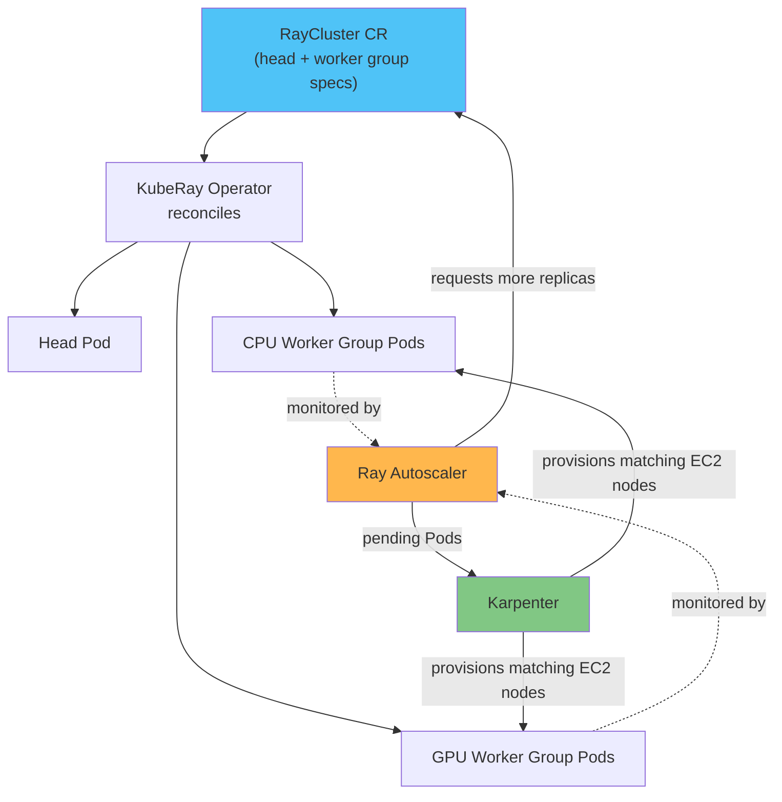

# Parte 2: El operador KubeRay

> **Versiones compatibles**: KubeRay v1.6.1, Ray 2.57.0
> **Última actualización**: August 20, 2026

## Configuración del entorno de laboratorio

Para seguir los ejemplos de este documento, necesitarás las siguientes herramientas y entorno:

### Herramientas necesarias

* kubectl v1.34 o posterior, configurado para un clúster de Amazon EKS funcional
* Helm v3
* Un par de `NodePool`/`EC2NodeClass` con capacidad de GPU aprovisionado mediante Karpenter, si planeas probar grupos de workers con GPU

## Qué hace KubeRay

[La parte 1](01-architecture.md) describió un clúster de Ray como un nodo head más uno o varios grupos de nodos worker. Esa estructura es un concepto nativo de Ray, no de Kubernetes, por lo que algo debe traducirla a Pods, Services y los demás objetos que Kubernetes comprende. Ese algo es KubeRay.

KubeRay es un operator de Kubernetes que administra clústeres de Ray como recursos personalizados nativos de Kubernetes. En lugar de escribir manualmente un Deployment, un StatefulSet y un Service para un nodo head y cada grupo de workers, un usuario del operator declara la estructura deseada del clúster de Ray en un manifiesto YAML, y el controller de KubeRay reconcilia continuamente el estado activo del clúster con esa especificación declarada. Esto es lo que hace declarativo a «Ray en Kubernetes»: el estado deseado reside en un recurso personalizado, y el operator realiza el trabajo de crear, actualizar y eliminar los Pods subyacentes para que coincidan con él.

Este documento está dirigido a **KubeRay v1.6.1**; consulta la [página de versiones de KubeRay](https://github.com/ray-project/kuberay/releases) para conocer la versión actual, ya que KubeRay tiene su propio ciclo de lanzamientos independiente de este documento. KubeRay v1.6 añadió compatibilidad completa con el modo de token de autenticación de Ray (que protege el acceso al dashboard y a los puertos de cliente de un clúster en ejecución) y cambió RayJob a una imagen de submitter predeterminada más ligera, mejorando el rendimiento de inicio de RayJob respecto al valor predeterminado anterior. Una versión anterior, v1.5, ya había añadido actualizaciones incrementales y continuas para RayService, orientadas a actualizaciones sin tiempo de inactividad con menos sobrecarga de recursos que un reemplazo blue-green completo de todo el clúster; sin embargo, consulta las notas de la versión actual antes de depender de ello, ya que una característica como esta puede pasar de un estado opcional y controlado por feature gates a estar habilitada de forma predeterminada a medida que el proyecto madura.

## Los CRD principales

KubeRay expone la mayor parte de su funcionalidad mediante tres Custom Resource Definitions, cada una orientada a una forma diferente de ejecutar Ray en Kubernetes (el chart de Helm de KubeRay también instala CRD para capacidades más nuevas que aún están evolucionando; consulta las notas de la versión actual para conocer el conjunto completo antes de asumir que estas tres son exhaustivas).

**RayCluster** es el recurso fundamental: un clúster de Ray sin procesar compuesto por un Pod head y uno o varios grupos de workers. Cada grupo de workers es un conjunto de Pods worker homogéneos; por ejemplo, un grupo de workers de CPU para tareas generales de Ray y un grupo de workers de GPU independiente para entrenamiento o inferencia de modelos. El operator de KubeRay reconcilia continuamente los Pods activos con la especificación de RayCluster, creando o eliminando Pods worker a medida que la especificación (o el autoscaler, descrito a continuación) cambia el número de réplicas deseado para un grupo.

**RayJob** envía un trabajo por lotes a un clúster de Ray y, opcionalmente, administra todo el ciclo de vida de ese clúster: crea el RayCluster, ejecuta el trabajo enviado en él y desmonta el clúster una vez que finaliza el trabajo. Esta es la opción natural para cargas de trabajo por lotes únicas o programadas, ya que evita pagar por un clúster que permanece inactivo entre ejecuciones.

**RayService** está orientado al servicio de modelos en producción. Administra un RayCluster junto con una aplicación Ray Serve desplegada sobre él y puede realizar actualizaciones continuas del clúster y la aplicación subyacentes orientadas a cero tiempo de inactividad; consulta las notas de la versión actual para conocer la madurez de esa ruta de actualización y los requisitos previos antes de depender de ella en producción.



## Autoscaling de dos niveles: Ray Autoscaler y Karpenter

Ejecutar Ray en EKS implica gestionar dos bucles de control de autoscaling independientes, un patrón que este sitio de documentación también aborda para otras cargas de trabajo con autoscaling, como Flink y Katib. Cada bucle responde a una pregunta diferente y ninguno puede responder la pregunta del otro.

**El autoscaler de Ray** se ejecuta como parte del propio clúster de Ray, coordinado mediante KubeRay. Observa el estado de programación de Ray —tareas y actores pendientes que no se pueden colocar en los workers actuales— y decide cuántos Pods worker de Ray se necesitan. Actúa sobre esa decisión ajustando el número de réplicas en el grupo de workers de RayCluster correspondiente, lo que a su vez indica al operator de KubeRay que cree (o elimine) Pods worker. El autoscaler también tiene una configuración `idleTimeoutSeconds`, de 60 segundos de forma predeterminada, que determina cuánto tiempo debe permanecer inactivo un Pod worker —sin tareas, actores ni objetos referenciados— antes de que el autoscaler reduzca su escala.

**Karpenter** (o, en clústeres que no usan Karpenter, el Kubernetes Cluster Autoscaler) opera un nivel por debajo, en el nivel de nodo de Kubernetes. No sabe nada sobre las tareas o actores de Ray; solo reacciona a Pods que están pendientes porque ningún nodo tiene espacio para ellos, y aprovisiona nuevos nodos EC2 dimensionados para coincidir con esos Pods pendientes.

En conjunto: el autoscaler de Ray decide *cuántos Pods worker de Ray* necesita el clúster, y Karpenter decide *cuántos nodos EC2* se necesitan para ejecutarlos realmente. Un bucle de control es propietario del número de Pods, otro independiente es propietario del número de nodos, y se comunican solo de forma indirecta, a través del estado de programación normal de Kubernetes de los Pods pendientes. Consulta la [documentación de Karpenter](../../autoscaling/02-karpenter.md) de este repositorio para profundizar en cómo funciona el lado de aprovisionamiento de nodos de ese bucle.

## Programación de GPU

La especificación de Pod de un grupo de workers con GPU es la única fuente de verdad sobre cuántas GPU pueden ver los workers de Ray de ese grupo. Cuando la especificación de contenedor de un grupo de workers establece un límite de recursos de GPU —por ejemplo, `nvidia.com/gpu: 1`—, KubeRay lee ese límite y lo anuncia tanto al scheduler de Ray como al autoscaler de Ray como capacidad de GPU en los Pods worker resultantes. KubeRay también configura automáticamente el flag `--num-gpus` del proceso de Ray en ese worker para que coincida con el límite de GPU de la especificación de Pod, por lo que no hay otro lugar donde mantener sincronizado manualmente el número de GPU.

Esto significa que tanto la programación consciente de GPU como el autoscaling consciente de GPU surgen de la misma declaración nativa de Kubernetes. El autoscaler de Ray solo solicitará más réplicas de workers con GPU cuando haya tareas vinculadas a GPU realmente pendientes, y Karpenter aprovisiona los nodos EC2 con GPU para satisfacer esos Pods mediante la configuración de node pool y node class descrita en [Karpenter](../../autoscaling/02-karpenter.md); este documento no vuelve a derivar ese mecanismo.

## Instalación del operator

La forma estándar de instalar KubeRay es el chart oficial de Helm, publicado desde el repositorio `ray-project/kuberay-helm`:

```bash
helm repo add kuberay https://ray-project.github.io/kuberay-helm/
helm repo update
helm install kuberay-operator kuberay/kuberay-operator --version 1.6.1
```

Esto instala el controller del operator y sus CRD, incluidos RayCluster, RayJob y RayService descritos anteriormente, en el clúster. Una vez que el Pod del operator está en ejecución, observa esos objetos en todo el clúster (o en un namespace, según los flags de instalación) y comienza a reconciliarlos.

## Próximos pasos

Esta parte cubrió qué es KubeRay, sus CRD principales y cómo su modelo de autoscaling de dos niveles divide el trabajo con Karpenter. La siguiente parte pasa de la mecánica del clúster a las bibliotecas de ML de Ray que se ejecutan sobre un clúster administrado por KubeRay: consulta [Parte 3: Ray Train y Ray Tune](03-ray-train-tune.md).

[Volver a la página principal](./README.md)

## Cuestionario

Para poner a prueba lo que has aprendido en este capítulo, prueba el [Cuestionario del tema](../../quizzes/ai-ml/ray/02-kuberay-operator-quiz.md).
