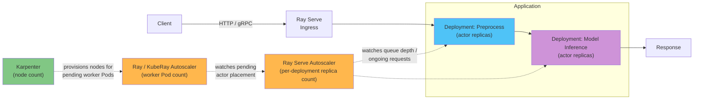

# Parte 4: Ray Serve

> **Versiones compatibles**: Ray 2.57.0
> **Última actualización**: August 20, 2026

## Configuración del entorno de laboratorio

Para seguir los ejemplos de este documento, necesitarás las siguientes herramientas y entorno:

### Herramientas necesarias

* Python 3.10+
* `pip install "ray[serve]"` para implementaciones generales de Ray Serve, o `pip install "ray[llm]"` si planeas seguir la sección de Ray Serve LLM a continuación; instala vLLM y dependencias relacionadas que `ray[serve]` no incluye
* kubectl v1.34 o posterior, dirigido a un clúster de Amazon EKS operativo, si planeas probar la ruta de RayService
* Un par `NodePool`/`EC2NodeClass` con capacidad de GPU aprovisionado mediante Karpenter, si planeas servir modelos respaldados por GPU

## Qué es Ray Serve

La [Parte 1](01-architecture.md) presentó el actor como la primitiva de Ray para objetos Python con estado y direccionables que mantienen el estado en memoria entre llamadas. Ray Serve es una biblioteca de servicio de modelos creada directamente sobre esa primitiva: una implementación de Serve se implementa como un actor de Ray, o un grupo de réplicas de actor, y Ray Serve enruta las solicitudes HTTP o gRPC entrantes a esas réplicas. Un modelo que se carga una vez en la memoria de una réplica puede entonces responder a muchas solicitudes sin volver a cargarlo, que es exactamente el patrón para el que se diseñaron los actores.

Una sola implementación escala horizontalmente simplemente añadiendo más réplicas de actor detrás del enrutador de solicitudes de Ray Serve, de la misma manera que escala en Ray cualquier servicio respaldado por actores. Más interesante aún, Ray Serve permite que varias implementaciones se compongan en una canalización de servicio, denominada aplicación. Un ejemplo común es una canalización de dos pasos: una implementación maneja el preprocesamiento (tokenización, redimensionamiento de imágenes, extracción de características) y entrega su salida a una segunda implementación que ejecuta la inferencia real del modelo. Cada implementación de esa canalización puede escalarse, versionarse y asignarse recursos de forma independiente, porque cada una sigue siendo, internamente, solo un grupo de réplicas de actor.

## Ray Serve LLM

El servicio de modelos de lenguaje grandes es un patrón lo suficientemente distinto — procesamiento por lotes continuo, transmisión de tokens y una estructura de solicitud compatible con OpenAI — como para que Ray proporcione un conjunto dedicado de bloques de construcción: el módulo `ray.serve.llm`. En lugar de ensamblar manualmente una implementación que gestione por sí misma una instancia del motor vLLM, `ray.serve.llm` proporciona construcciones de nivel superior diseñadas específicamente para el servicio de LLM, superpuestas sobre el modelo general de implementación de Ray Serve descrito anteriormente.

`ray.serve.llm` documenta vLLM como su motor de inferencia compatible, y su API compatible con OpenAI está diseñada para alinearse estrechamente con el propio servidor compatible con OpenAI de vLLM, por lo que la mayoría de los `engine_kwargs` que funcionan con una invocación simple de `vllm serve` se trasladan. En la práctica, eso significa que las mismas capacidades de producción de Ray Serve — escalado automático, servicio de múltiples modelos y la ubicación habitual de actores distribuidos de Ray — también se aplican al servicio de LLM, mientras que la infraestructura específica de LLM (cargar y configurar el motor vLLM, exponer un endpoint compatible con OpenAI) la maneja `ray.serve.llm` en vez de algo que construyas manualmente. Consulta la documentación actual de `docs.ray.io/en/latest/serve/llm/` para conocer la superficie de configuración exacta antes de depender de nombres de campos específicos, ya que esta es una de las áreas de Ray Serve que evoluciona más activamente.

## Escalado automático de una implementación de Serve

Las implementaciones de Ray Serve tienen su propia capa de escalado automático, separada del escalado automático a nivel de clúster cubierto en la [Parte 2](02-kuberay-operator.md). Mientras que el escalador automático de Ray/KubeRay decide cuántos Pod de worker necesita un RayCluster, el escalador automático de Ray Serve responde una pregunta más acotada un nivel por encima: ¿cuántas réplicas de actor necesita *esta implementación específica* ahora mismo, según la carga de solicitudes que está recibiendo? Ray Serve compara la cantidad de solicitudes en curso por réplica — en cola más en vuelo — con un valor objetivo, y escala las réplicas hacia arriba o hacia abajo para mantener la carga real cerca de ese objetivo, dentro de un recuento mínimo y máximo de réplicas configurado.

Esto proporciona el ya conocido esquema de escalado automático de tres niveles de este sitio de documentación para una aplicación de Serve que se ejecuta en EKS:

1. **El escalador automático de Ray Serve** decide cuántas réplicas de actor necesita una implementación, según la carga de solicitudes.
2. **El escalador automático de Ray/KubeRay** (cubierto en la [Parte 2](02-kuberay-operator.md)) decide cuántos Pod de worker de Ray necesita el RayCluster subyacente, según la ubicación de actores pendiente, incluidas las réplicas que acaba de solicitar el escalador automático de Ray Serve.
3. **Karpenter** decide cuántos nodos EC2 se necesitan para ejecutar realmente esos Pod de worker, el mismo mecanismo descrito en [Karpenter](../../autoscaling/02-karpenter.md).

Cada capa solo ve la capa inmediatamente inferior. El escalador automático de Ray Serve no tiene idea de si una nueva réplica se ubica en un nodo existente o activa uno nuevo; simplemente solicita más réplicas. Si esa solicitud se convierte en un nuevo nodo EC2 — y cuánto tarda — es responsabilidad de Karpenter, una capa más abajo.

## Inferencia de GPU

Una implementación de inferencia de modelos que necesita una GPU solicita una de la misma manera que cualquier otra carga de trabajo de Ray: mediante la solicitud normal de recursos por actor de Ray, el mismo mecanismo que cubre la [Parte 3](03-ray-train-tune.md) para los workers de Ray Train y Ray Tune. Ray Serve programa las réplicas de actor de esa implementación en workers que pueden satisfacer el recuento de GPU solicitado y — como se cubrió en la [Parte 2](02-kuberay-operator.md) — la especificación de Pod del grupo de workers es la que realmente anuncia la capacidad de GPU al programador de Ray en primer lugar.

Aquí también es donde el escalado automático de Ray Serve y el tiempo de aprovisionamiento de nodos de Karpenter interactúan exactamente como lo hacen para otras cargas de trabajo de GPU en este sitio: cuando el escalador automático de Ray Serve decide que una implementación de inferencia necesita otra réplica y ninguno de los Pod de worker de GPU existentes tiene espacio, esa solicitud de réplica se convierte en un Pod pendiente, y Karpenter debe aprovisionar un nuevo nodo EC2 respaldado por GPU antes de que la réplica pueda realmente comenzar a servir tráfico. Una aplicación de servicio que escale agresivamente su recuento de réplicas de GPU debe considerar ese tiempo de aprovisionamiento; consulta [Karpenter](../../autoscaling/02-karpenter.md) para entender con mayor profundidad cómo funciona la latencia de aprovisionamiento de nodos para los tipos de instancia de GPU.

## RayService en producción

Ejecutar una aplicación de Serve por sí sola, fuera de Kubernetes, está bien para el desarrollo local, pero las implementaciones de producción en EKS usan el CRD `RayService` presentado en la [Parte 2](02-kuberay-operator.md). RayService gestiona el RayCluster subyacente y la aplicación de Serve implementada sobre él como una unidad, y es específicamente el recurso que admite desplegar una nueva versión de aplicación, o una especificación de RayCluster modificada, con el objetivo de no descartar solicitudes en vuelo; consulta las notas de la versión actual de KubeRay para conocer la madurez y los requisitos previos de esta ruta de actualización. Este documento no vuelve a explicar la mecánica del CRD de RayService; consulta la Parte 2 para ello.

En la práctica, esto significa que la topología de implementación descrita anteriormente en este documento — una aplicación compuesta por una o más implementaciones, cada una escalando automáticamente su propio recuento de réplicas de actor — es de la que un objeto `RayService` gestiona el ciclo de vida en un clúster EKS real, mientras que los niveles de escalado automático de Ray/KubeRay y Karpenter siguen operando por debajo exactamente como lo hacen para cualquier otro RayCluster.

## Próximos pasos

Este es el final de esta serie de Ray de cuatro partes. La [Parte 1](01-architecture.md) cubrió las primitivas principales de Ray: tareas, actores y el almacén de objetos. La [Parte 2](02-kuberay-operator.md) cubrió la ejecución declarativa de clústeres de Ray en Kubernetes mediante los CRD `RayCluster`, `RayJob` y `RayService` de KubeRay, y la división del escalado automático entre Ray/KubeRay y Karpenter. La [Parte 3](03-ray-train-tune.md) cubrió el entrenamiento distribuido y el ajuste de hiperparámetros sobre ese clúster. Esta parte cerró el ciclo con Ray Serve: implementaciones creadas sobre la primitiva de actor de la Parte 1, compuestas en aplicaciones, escaladas automáticamente según su propia métrica de carga de solicitudes y — en producción — gestionadas de extremo a extremo mediante el CRD RayService de la Parte 2.

[Volver a la página principal](./README.md)

## Cuestionario

Para comprobar lo que has aprendido en este capítulo, prueba el [Cuestionario del tema](../../quizzes/ai-ml/ray/04-ray-serve-quiz.md).
