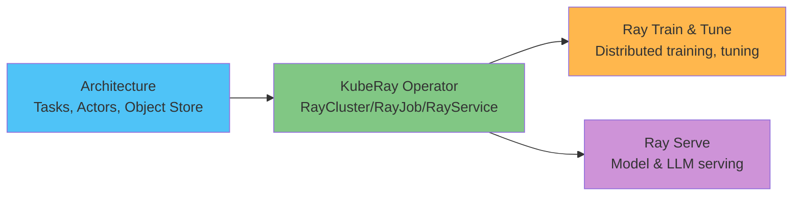

# Análisis profundo de Ray en EKS

> **Versiones compatibles**: Ray 2.57.0, KubeRay v1.6.1
> **Última actualización**: August 20, 2026

## Descripción general

Ray es un framework de computación distribuida de código abierto para escalar cargas de trabajo de Python, desde tareas paralelas ad hoc hasta entrenamiento distribuido, ajuste de hiperparámetros y servicio de modelos, construido en torno a un pequeño conjunto de primitivas básicas (tareas, actores y un almacén de objetos compartido) en lugar de una herramienta independiente para cada tipo de carga de trabajo. En Kubernetes, el operador KubeRay traduce la estructura de nodos head/worker de un clúster de Ray a recursos nativos de Kubernetes, lo que hace declarativos a los clústeres de Ray y proporciona a EKS las mismas capacidades de despliegue y autoescalado que ya utiliza para otras cargas de trabajo.

## Mapa de componentes

| Concepto | Problema que resuelve | Análisis profundo |
|---------|--------------------|-----------|
| **Arquitectura** | Las tareas, los actores y el almacén de objetos sobre los que se construye todo lo demás | [Parte 1](01-architecture.md) |
| **Operador KubeRay** | Ejecutar clústeres de Ray como recursos nativos de Kubernetes (`RayCluster`/`RayJob`/`RayService`) | [Parte 2](02-kuberay-operator.md) |
| **Ray Train y Tune** | Entrenamiento distribuido de modelos y búsqueda de hiperparámetros | [Parte 3](03-ray-train-tune.md) |
| **Ray Serve** | Servicio de modelos, incluidos componentes dedicados para el servicio de LLM | [Parte 4](04-ray-serve.md) |

## Por qué ejecutar esto en EKS

La contrapartida es la misma que se aborda en otras secciones de datos/ML de esta documentación: un equipo que ya ejecuta EKS puede reutilizar los mismos patrones de autoescalado de grupos de nodos (mediante Karpenter), IAM y observabilidad para las cargas de trabajo de Ray que para todo lo demás en el clúster, a cambio de operar directamente el operador KubeRay y sus recursos RayCluster/RayJob/RayService en lugar de utilizar una alternativa administrada.

## Contenido cubierto actualmente

1. [Parte 1: Arquitectura de Ray](01-architecture.md) — tareas, actores, el almacén de objetos y el modelo de clúster head/worker
2. [Parte 2: El operador KubeRay](02-kuberay-operator.md) — RayCluster, RayJob, RayService y el patrón de autoescalado de dos niveles con Karpenter
3. [Parte 3: Ray Train y Ray Tune](03-ray-train-tune.md) — entrenamiento distribuido y ajuste de hiperparámetros
4. [Parte 4: Ray Serve](04-ray-serve.md) — servicio de modelos, Ray Serve LLM y despliegue de producción basado en RayService
