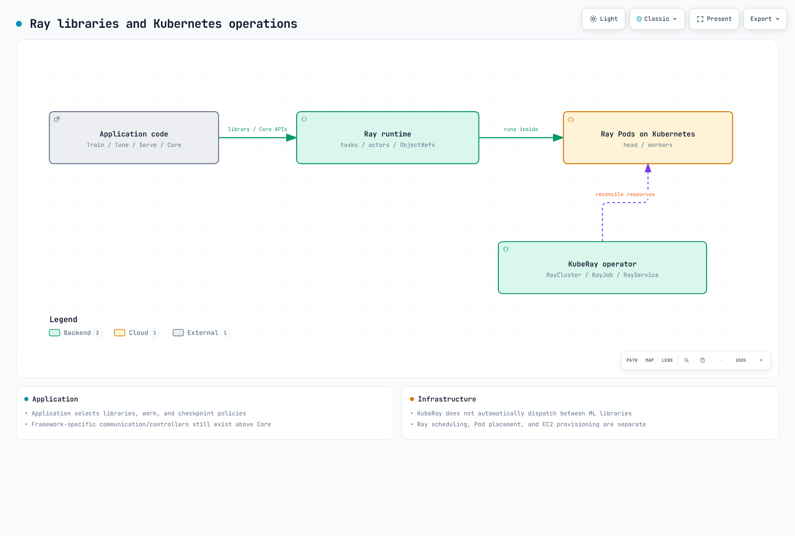

# Análisis en profundidad de Ray en EKS

> **Base de revisión**: Ray 2.58.0, KubeRay v1.7.0
> **Documentación revisada**: September 12, 2026

## Descripción general

Ray distribuye el trabajo de Python mediante tasks, actors, ObjectRefs y object stores por nodo. Train, Tune y Serve usan esa base mientras agregan políticas de entrenamiento, búsqueda y serving. Una ruta de object store no maneja automáticamente todas las necesidades de comunicación o recuperación.

KubeRay es el operator de Kubernetes que reconcilia RayCluster, RayJob y RayService. No selecciona la biblioteca de ML de la aplicación como dispatcher. La programación de trabajo de Ray, la ubicación de Pods de Kubernetes y el aprovisionamiento de nodos EC2 son capas independientes.

## Mapa de componentes

| Concepto | Problema que resuelve | Análisis en profundidad |
|---------|--------------------|-----------|
| **Arquitectura** | Tasks, actors y el object store sobre el que se construye todo lo demás | [Parte 1](01-architecture.md) |
| **KubeRay Operator** | Ejecutar clusters de Ray como recursos nativos de Kubernetes (`RayCluster`/`RayJob`/`RayService`) | [Parte 2](02-kuberay-operator.md) |
| **Ray Train & Tune** | Entrenamiento de modelos distribuido y búsqueda de hiperparámetros | [Parte 3](03-ray-train-tune.md) |
| **Ray Serve** | Serving de modelos, incluidos bloques de construcción dedicados para serving de LLM | [Parte 4](04-ray-serve.md) |

[🔍 Ver diagrama interactivo](https://www.atomai.click/kubernetes-docs/archmaps/en-ai-ml-ray-readme-0.html)

## Por qué ejecutar esto en EKS

La contrapartida es la misma que se aborda en otras secciones de datos/ML de este sitio de documentación: un equipo que ya ejecuta EKS puede reutilizar los mismos patrones de escalado automático de node pools (mediante Karpenter), IAM y observabilidad para las cargas de trabajo de Ray que para todo lo demás del cluster, a cambio de operar directamente el operator de KubeRay y sus recursos RayCluster/RayJob/RayService en lugar de usar una alternativa administrada.

La comprobación de base es una pequeña ejecución de Ray en un solo nodo. No demuestra entrenamiento con GPU, recuperación multinodo, una instalación de EKS en funcionamiento ni escalado automático.

## Contenido cubierto actualmente

1. [Parte 1: Arquitectura de Ray](01-architecture.md) — tasks, actors, el object store y el modelo de cluster de head/worker
2. [Parte 2: El KubeRay Operator](02-kuberay-operator.md) — RayCluster, RayJob, RayService y el patrón de escalado automático de dos niveles con Karpenter
3. [Parte 3: Ray Train y Ray Tune](03-ray-train-tune.md) — entrenamiento distribuido y ajuste de hiperparámetros
4. [Parte 4: Ray Serve](04-ray-serve.md) — serving de modelos, Ray Serve LLM y despliegue de producción basado en RayService

## Fuentes principales

- [Ray 2.58.0](https://github.com/ray-project/ray/releases/tag/ray-2.58.0)
- [KubeRay 1.7.0](https://github.com/ray-project/kuberay/releases/tag/v1.7.0)
