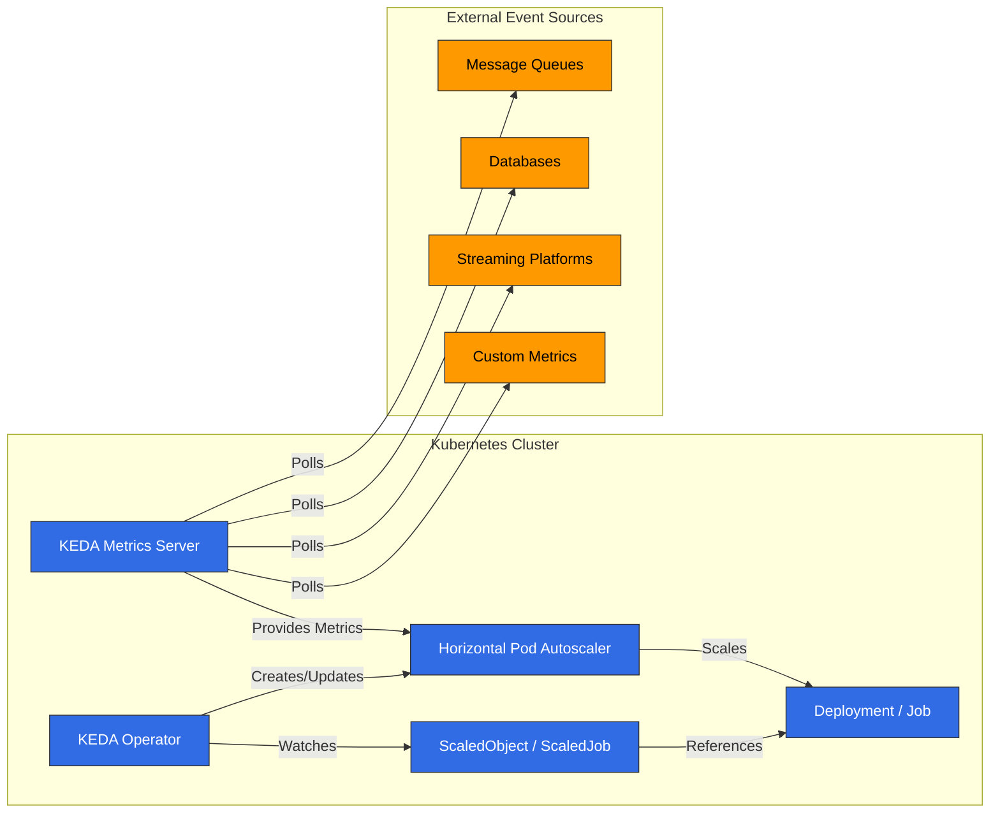

# KEDA (Kubernetes Event-driven Autoscaling)

## Table of Contents
- [Introduction](#introduction)
- [Architecture](#architecture)
- [Installation and Configuration](#installation-and-configuration)
- [Scalers](#scalers)
- [Custom Metric Scaling](#custom-metric-scaling)
- [Twitter Metric Scaling](#twitter-metric-scaling)
- [Google Calendar Scaling](#google-calendar-scaling)
- [Istio Metric Scaling](#istio-metric-scaling)
- [Cron-based Scaling](#cron-based-scaling)
- [Integration with Amazon EKS](#integration-with-amazon-eks)
- [Best Practices](#best-practices)
- [Troubleshooting](#troubleshooting)
- [Conclusion](#conclusion)

## Introduction

KEDA (Kubernetes Event-driven Autoscaling) es un proyecto open-source que permite el autoscaling basado en eventos para aplicaciones de Kubernetes. KEDA extiende el Horizontal Pod Autoscaler (HPA) nativo de Kubernetes para permitir el escalado de workloads según diversas fuentes de eventos y métricas más allá del uso de CPU y memoria.

### Key Benefits of KEDA

1. **Escalado basado en eventos**: Escalado basado en diversas fuentes de eventos (colas de mensajes, bases de datos, streams, etc.)
2. **Escalado a cero**: Reduce la escala a 0 replicas cuando no hay actividad para ahorrar costos
3. **Soporte para diversos Scalers**: Más de 50 scalers integrados y soporte para scalers personalizados
4. **Nativo de Kubernetes**: Integración con el HPA existente de Kubernetes
5. **Neutralidad de Cloud**: Funciona en cualquier entorno de Kubernetes
6. **Modelo de Deployment simple**: Deployment sencillo con un único operator

### Comparison with Existing Scaling Methods

| Feature | KEDA | Kubernetes HPA | Cloud Provider Autoscaler |
|---------|------|----------------|---------------------------|
| Metric Sources | 50+ scalers | CPU, Memory, Custom metrics | Limited metrics |
| Zero Scaling | ✅ | ❌ | Partial support |
| Event-driven | ✅ | ❌ | Partial support |
| Cloud Neutral | ✅ | ✅ | ❌ |
| Deployment Complexity | Low | Very Low | Medium |
| Custom Metrics | Easy | Complex | Limited |

## Architecture

KEDA se basa en el patrón operator de Kubernetes, supervisa fuentes externas de métricas y administra automáticamente el HPA de Kubernetes.




### Key Components

1. **KEDA Operator**: Observa los recursos ScaledObject y ScaledJob y administra el HPA
2. **KEDA Metrics Server**: Recopila métricas desde fuentes externas de métricas y las expone a la Kubernetes API
3. **ScaledObject**: Define la configuración de escalado para Deployments, StatefulSets, etc.
4. **ScaledJob**: Define la configuración de escalado para Kubernetes Jobs
5. **Triggers/Scalers**: Implementa la lógica de escalado para diversas fuentes de eventos

### How It Works

1. El usuario crea un ScaledObject o ScaledJob para definir objetivos de escalado y triggers
2. KEDA Operator detecta esto y crea el HPA correspondiente
3. KEDA Metrics Server consulta fuentes externas de métricas para recopilar métricas
4. HPA escala workloads según las métricas proporcionadas por el metrics server
5. Cuando no hay actividad, KEDA reduce la escala a 0 replicas (algo que HPA no puede hacer)

## Installation and Configuration

### Prerequisites

- Kubernetes cluster (v1.16 o superior)
- kubectl configurado
- Helm (opcional)

### Installation Methods

#### 1. Installation Using Helm

```bash
# Add Helm repository
helm repo add kedacore https://kedacore.github.io/charts

# Update Helm repository
helm repo update

# Install KEDA
helm install keda kedacore/keda --namespace keda --create-namespace
```

#### 2. Installation Using YAML Manifests

```bash
# Download latest KEDA release
kubectl apply -f https://github.com/kedacore/keda/releases/download/v2.10.1/keda-2.10.1.yaml
```

#### 3. Verify Installation

```bash
kubectl get pods -n keda
```

Salida esperada:
```
NAME                                      READY   STATUS    RESTARTS   AGE
keda-operator-5c6d85d76c-vr4fj            1/1     Running   0          1m
keda-operator-metrics-apiserver-65f8f8d4d8-9mzrk   1/1     Running   0          1m
```

### Basic Configuration

KEDA funciona con una configuración mínima de forma predeterminada, pero puedes ajustar varias opciones según sea necesario.

#### Custom Configuration Using Helm Values File

```yaml
# values.yaml
operator:
  replicaCount: 2
  resources:
    limits:
      cpu: 100m
      memory: 128Mi
    requests:
      cpu: 50m
      memory: 64Mi

metricsServer:
  replicaCount: 2
  resources:
    limits:
      cpu: 100m
      memory: 128Mi
    requests:
      cpu: 50m
      memory: 64Mi

logging:
  operator:
    level: info
  metricServer:
    level: info
```

```bash
helm install keda kedacore/keda --namespace keda --create-namespace -f values.yaml
```

## Scalers

KEDA proporciona scalers para diversas fuentes de eventos. Cada scaler recopila métricas de una fuente de eventos específica y escala workloads en función de ellas.

### Major Scalers

KEDA admite más de 50 scalers, incluidos los principales:

1. **Colas de mensajes**:
   - Apache Kafka
   - RabbitMQ
   - AWS SQS
   - Azure Service Bus
   - Google Cloud Pub/Sub

2. **Bases de datos**:
   - MySQL
   - PostgreSQL
   - MongoDB
   - Redis

3. **Streaming Platforms**:
   - Apache Kafka
   - AWS Kinesis
   - Azure Event Hubs

4. **Cloud Services**:
   - AWS CloudWatch
   - Azure Monitor
   - Google Cloud Monitoring

5. **Otros**:
   - Prometheus
   - InfluxDB
   - Cron
   - CPU/Memory

### Basic ScaledObject Example

```yaml
apiVersion: keda.sh/v1alpha1
kind: ScaledObject
metadata:
  name: rabbitmq-scaledobject
  namespace: default
spec:
  scaleTargetRef:
    apiVersion: apps/v1
    kind: Deployment
    name: rabbitmq-consumer
  pollingInterval: 15
  cooldownPeriod: 30
  minReplicaCount: 0
  maxReplicaCount: 30
  triggers:
  - type: rabbitmq
    metadata:
      protocol: amqp
      queueName: hello
      host: rabbitmq
      queueLength: "5"
```

### Basic ScaledJob Example

```yaml
apiVersion: keda.sh/v1alpha1
kind: ScaledJob
metadata:
  name: rabbitmq-scaledjob
  namespace: default
spec:
  jobTargetRef:
    template:
      spec:
        containers:
        - name: rabbitmq-worker
          image: rabbitmq-worker:latest
          imagePullPolicy: Always
  pollingInterval: 15
  maxReplicaCount: 30
  successfulJobsHistoryLimit: 5
  failedJobsHistoryLimit: 5
  triggers:
  - type: rabbitmq
    metadata:
      protocol: amqp
      queueName: hello
      host: rabbitmq
      queueLength: "5"
```
## Custom Metric Scaling

KEDA proporciona flexibilidad para escalar según métricas personalizadas además de varios scalers integrados. Esto te permite implementar lógica de escalado única adaptada a los requisitos de tu negocio.

### Using External Metrics API

Puedes implementar escalado basado en métricas personalizadas utilizando fuentes externas de métricas como Prometheus:

```yaml
apiVersion: keda.sh/v1alpha1
kind: ScaledObject
metadata:
  name: custom-metrics-scaler
  namespace: default
spec:
  scaleTargetRef:
    apiVersion: apps/v1
    kind: Deployment
    name: my-app
  minReplicaCount: 1
  maxReplicaCount: 10
  triggers:
  - type: prometheus
    metadata:
      serverAddress: http://prometheus-server.monitoring.svc.cluster.local
      metricName: custom_metric_total
      threshold: "100"
      query: sum(custom_metric_total{namespace="default",pod=~"my-app-.*"})
```

### Using HTTP Scaler

Puedes obtener métricas desde un endpoint HTTP para el escalado:

```yaml
apiVersion: keda.sh/v1alpha1
kind: ScaledObject
metadata:
  name: http-scaler
  namespace: default
spec:
  scaleTargetRef:
    apiVersion: apps/v1
    kind: Deployment
    name: my-app
  minReplicaCount: 1
  maxReplicaCount: 10
  triggers:
  - type: metrics-api
    metadata:
      targetValue: "100"
      url: "http://api.example.com/metrics"
      valueLocation: "value"
      method: "GET"
```

### Developing Custom Scalers

Puedes desarrollar tu propio scaler e integrarlo con KEDA. Esto requiere desarrollar un service que implemente la External Metrics API:

1. Implementación de Metrics Server:

```go
package main

import (
    "net/http"
    "encoding/json"

    "k8s.io/apimachinery/pkg/api/resource"
    metav1 "k8s.io/apimachinery/pkg/apis/meta/v1"
    "k8s.io/metrics/pkg/apis/external_metrics"
)

func metricsHandler(w http.ResponseWriter, r *http.Request) {
    // Calculate metric value with custom logic
    metricValue := calculateMetricValue()

    metric := external_metrics.ExternalMetricValue{
        TypeMeta: metav1.TypeMeta{
            Kind:       "ExternalMetricValue",
            APIVersion: "external.metrics.k8s.io/v1beta1",
        },
        MetricName: "custom_metric",
        Value:      *resource.NewQuantity(metricValue, resource.DecimalSI),
        Timestamp:  metav1.Now(),
    }

    metricList := external_metrics.ExternalMetricValueList{
        Items: []external_metrics.ExternalMetricValue{metric},
    }

    json.NewEncoder(w).Encode(metricList)
}

func main() {
    http.HandleFunc("/metrics", metricsHandler)
    http.ListenAndServe(":8080", nil)
}
```

2. Integración con KEDA:

```yaml
apiVersion: keda.sh/v1alpha1
kind: ScaledObject
metadata:
  name: custom-scaler
  namespace: default
spec:
  scaleTargetRef:
    apiVersion: apps/v1
    kind: Deployment
    name: my-app
  minReplicaCount: 1
  maxReplicaCount: 10
  triggers:
  - type: metrics-api
    metadata:
      targetValue: "100"
      url: "http://custom-metrics-server:8080/metrics"
      valueLocation: "items.0.value"
```

## Twitter Metric Scaling

Este ejemplo muestra cómo escalar aplicaciones según la frecuencia de menciones de hashtags o palabras clave específicos usando la Twitter API.

### Prerequisites

- Twitter API keys y access tokens
- Un service para recopilar y exponer métricas

### Implementation Steps

1. Implementa el servicio Twitter Metrics Collector:

```python
import os
import time
import tweepy
from flask import Flask, jsonify

app = Flask(__name__)

# Twitter API credentials
consumer_key = os.environ.get("TWITTER_CONSUMER_KEY")
consumer_secret = os.environ.get("TWITTER_CONSUMER_SECRET")
access_token = os.environ.get("TWITTER_ACCESS_TOKEN")
access_token_secret = os.environ.get("TWITTER_ACCESS_TOKEN_SECRET")

# Tweepy authentication
auth = tweepy.OAuthHandler(consumer_key, consumer_secret)
auth.set_access_token(access_token, access_token_secret)
api = tweepy.API(auth)

# Metrics storage
metrics = {
    "tweet_count": 0,
    "last_updated": 0
}

# Background tweet collection
def collect_tweets():
    while True:
        try:
            # Search for specific hashtag
            tweets = api.search_tweets(q="#kubernetes", count=100)
            metrics["tweet_count"] = len(tweets)
            metrics["last_updated"] = time.time()
        except Exception as e:
            print(f"Error collecting tweets: {e}")

        # Update every 15 minutes (considering Twitter API limits)
        time.sleep(900)

# Metrics endpoint
@app.route("/metrics", methods=["GET"])
def get_metrics():
    return jsonify({
        "tweet_count": metrics["tweet_count"]
    })

if __name__ == "__main__":
    import threading
    # Start background tweet collection
    thread = threading.Thread(target=collect_tweets)
    thread.daemon = True
    thread.start()

    # Start API server
    app.run(host="0.0.0.0", port=8080)
```

2. Despliega el servicio Metrics Collector:

```yaml
apiVersion: apps/v1
kind: Deployment
metadata:
  name: twitter-metrics-collector
  namespace: default
spec:
  replicas: 1
  selector:
    matchLabels:
      app: twitter-metrics-collector
  template:
    metadata:
      labels:
        app: twitter-metrics-collector
    spec:
      containers:
      - name: collector
        image: twitter-metrics-collector:latest
        ports:
        - containerPort: 8080
        env:
        - name: TWITTER_CONSUMER_KEY
          valueFrom:
            secretKeyRef:
              name: twitter-api-secrets
              key: consumer-key
        - name: TWITTER_CONSUMER_SECRET
          valueFrom:
            secretKeyRef:
              name: twitter-api-secrets
              key: consumer-secret
        - name: TWITTER_ACCESS_TOKEN
          valueFrom:
            secretKeyRef:
              name: twitter-api-secrets
              key: access-token
        - name: TWITTER_ACCESS_TOKEN_SECRET
          valueFrom:
            secretKeyRef:
              name: twitter-api-secrets
              key: access-token-secret
---
apiVersion: v1
kind: Service
metadata:
  name: twitter-metrics-collector
  namespace: default
spec:
  selector:
    app: twitter-metrics-collector
  ports:
  - port: 80
    targetPort: 8080
```

3. Configura KEDA ScaledObject:

```yaml
apiVersion: keda.sh/v1alpha1
kind: ScaledObject
metadata:
  name: twitter-scaler
  namespace: default
spec:
  scaleTargetRef:
    apiVersion: apps/v1
    kind: Deployment
    name: twitter-processor
  minReplicaCount: 1
  maxReplicaCount: 20
  pollingInterval: 15
  cooldownPeriod: 30
  triggers:
  - type: metrics-api
    metadata:
      targetValue: "10"
      url: "http://twitter-metrics-collector/metrics"
      valueLocation: "tweet_count"
```

## Google Calendar Scaling

Este ejemplo muestra cómo escalar aplicaciones según eventos programados usando la Google Calendar API.

### Prerequisites

- Credenciales de Google Calendar API
- Un service para recopilar y exponer métricas

### Implementation Steps

1. Implementa el servicio Google Calendar Metrics Collector:

```python
import os
import time
import datetime
from flask import Flask, jsonify
from google.oauth2 import service_account
from googleapiclient.discovery import build

app = Flask(__name__)

# Google Calendar API credentials
SCOPES = ['https://www.googleapis.com/auth/calendar.readonly']
SERVICE_ACCOUNT_FILE = '/etc/secrets/service-account.json'
CALENDAR_ID = os.environ.get("CALENDAR_ID")

# Metrics storage
metrics = {
    "upcoming_events": 0,
    "last_updated": 0
}

# Create Google Calendar API client
def create_calendar_client():
    credentials = service_account.Credentials.from_service_account_file(
        SERVICE_ACCOUNT_FILE, scopes=SCOPES)
    return build('calendar', 'v3', credentials=credentials)

# Background event collection
def collect_events():
    while True:
        try:
            service = create_calendar_client()

            # Current time
            now = datetime.datetime.utcnow()
            # 1 hour later
            one_hour_later = now + datetime.timedelta(hours=1)

            # Query events within the next hour
            events_result = service.events().list(
                calendarId=CALENDAR_ID,
                timeMin=now.isoformat() + 'Z',
                timeMax=one_hour_later.isoformat() + 'Z',
                singleEvents=True,
                orderBy='startTime'
            ).execute()

            events = events_result.get('items', [])
            metrics["upcoming_events"] = len(events)
            metrics["last_updated"] = time.time()
        except Exception as e:
            print(f"Error collecting events: {e}")

        # Update every 5 minutes
        time.sleep(300)

# Metrics endpoint
@app.route("/metrics", methods=["GET"])
def get_metrics():
    return jsonify({
        "upcoming_events": metrics["upcoming_events"]
    })

if __name__ == "__main__":
    import threading
    # Start background event collection
    thread = threading.Thread(target=collect_events)
    thread.daemon = True
    thread.start()

    # Start API server
    app.run(host="0.0.0.0", port=8080)
```

2. Despliega el servicio Metrics Collector:

```yaml
apiVersion: v1
kind: Secret
metadata:
  name: google-calendar-secrets
  namespace: default
type: Opaque
data:
  service-account.json: <BASE64_ENCODED_SERVICE_ACCOUNT_JSON>
---
apiVersion: apps/v1
kind: Deployment
metadata:
  name: calendar-metrics-collector
  namespace: default
spec:
  replicas: 1
  selector:
    matchLabels:
      app: calendar-metrics-collector
  template:
    metadata:
      labels:
        app: calendar-metrics-collector
    spec:
      containers:
      - name: collector
        image: calendar-metrics-collector:latest
        ports:
        - containerPort: 8080
        env:
        - name: CALENDAR_ID
          value: "primary"
        volumeMounts:
        - name: google-calendar-credentials
          mountPath: "/etc/secrets"
          readOnly: true
      volumes:
      - name: google-calendar-credentials
        secret:
          secretName: google-calendar-secrets
---
apiVersion: v1
kind: Service
metadata:
  name: calendar-metrics-collector
  namespace: default
spec:
  selector:
    app: calendar-metrics-collector
  ports:
  - port: 80
    targetPort: 8080
```

3. Configura KEDA ScaledObject:

```yaml
apiVersion: keda.sh/v1alpha1
kind: ScaledObject
metadata:
  name: calendar-scaler
  namespace: default
spec:
  scaleTargetRef:
    apiVersion: apps/v1
    kind: Deployment
    name: calendar-processor
  minReplicaCount: 1
  maxReplicaCount: 10
  pollingInterval: 15
  cooldownPeriod: 30
  triggers:
  - type: metrics-api
    metadata:
      targetValue: "1"
      url: "http://calendar-metrics-collector/metrics"
      valueLocation: "upcoming_events"
```
## Istio Metric Scaling

Este ejemplo muestra cómo escalar aplicaciones según métricas recopiladas desde el service mesh Istio. Veremos cómo escalar según requests per second (RPS).

### Prerequisites

- Istio service mesh instalado
- Prometheus instalado e integrado con Istio

### Implementation Steps

1. Configura Istio Service Mesh:

```bash
# Install Istio
istioctl install --set profile=default -y

# Enable Istio sidecar injection on namespace
kubectl label namespace default istio-injection=enabled
```

2. Despliega una aplicación de ejemplo:

```yaml
apiVersion: apps/v1
kind: Deployment
metadata:
  name: sample-app
  namespace: default
spec:
  replicas: 1
  selector:
    matchLabels:
      app: sample-app
  template:
    metadata:
      labels:
        app: sample-app
    spec:
      containers:
      - name: sample-app
        image: nginx:latest
        ports:
        - containerPort: 80
---
apiVersion: v1
kind: Service
metadata:
  name: sample-app
  namespace: default
spec:
  selector:
    app: sample-app
  ports:
  - port: 80
    targetPort: 80
---
apiVersion: networking.istio.io/v1alpha3
kind: VirtualService
metadata:
  name: sample-app
  namespace: default
spec:
  hosts:
  - "*"
  gateways:
  - istio-system/ingressgateway
  http:
  - route:
    - destination:
        host: sample-app
        port:
          number: 80
```

3. Configura KEDA ScaledObject:

```yaml
apiVersion: keda.sh/v1alpha1
kind: ScaledObject
metadata:
  name: istio-scaler
  namespace: default
spec:
  scaleTargetRef:
    apiVersion: apps/v1
    kind: Deployment
    name: sample-app
  minReplicaCount: 1
  maxReplicaCount: 10
  pollingInterval: 15
  cooldownPeriod: 30
  triggers:
  - type: prometheus
    metadata:
      serverAddress: http://prometheus.istio-system:9090
      metricName: istio_requests_per_second
      threshold: "10"
      query: sum(rate(istio_requests_total{destination_service="sample-app.default.svc.cluster.local"}[1m]))
```

Esta configuración escala el deployment `sample-app` según requests per second recopiladas desde Istio. Cuando las requests per second superan 10, KEDA agrega replicas, y cuando disminuye el número de requests, reduce las replicas.

### Advanced Configuration

En escenarios más complejos, puedes escalar según el número de requests para rutas o métodos HTTP específicos:

```yaml
apiVersion: keda.sh/v1alpha1
kind: ScaledObject
metadata:
  name: istio-path-scaler
  namespace: default
spec:
  scaleTargetRef:
    apiVersion: apps/v1
    kind: Deployment
    name: sample-app
  minReplicaCount: 1
  maxReplicaCount: 10
  pollingInterval: 15
  cooldownPeriod: 30
  triggers:
  - type: prometheus
    metadata:
      serverAddress: http://prometheus.istio-system:9090
      metricName: istio_requests_per_second_path
      threshold: "5"
      query: sum(rate(istio_requests_total{destination_service="sample-app.default.svc.cluster.local",request_path="/api/v1/products"}[1m]))
```

También puedes escalar según otras métricas de Istio, como tasa de errores o latencia:

```yaml
# Error rate based scaling
apiVersion: keda.sh/v1alpha1
kind: ScaledObject
metadata:
  name: istio-error-scaler
  namespace: default
spec:
  scaleTargetRef:
    apiVersion: apps/v1
    kind: Deployment
    name: sample-app
  minReplicaCount: 1
  maxReplicaCount: 10
  pollingInterval: 15
  cooldownPeriod: 30
  triggers:
  - type: prometheus
    metadata:
      serverAddress: http://prometheus.istio-system:9090
      metricName: istio_error_rate
      threshold: "0.05"
      query: sum(rate(istio_requests_total{destination_service="sample-app.default.svc.cluster.local",response_code=~"5.*"}[1m])) / sum(rate(istio_requests_total{destination_service="sample-app.default.svc.cluster.local"}[1m]))
```

## Cron-based Scaling

KEDA admite escalado basado en tiempo usando expresiones Cron. Esto te permite preescalar aplicaciones según patrones de tráfico o horarios predecibles.

### Basic Cron Scaler

```yaml
apiVersion: keda.sh/v1alpha1
kind: ScaledObject
metadata:
  name: cron-scaler
  namespace: default
spec:
  scaleTargetRef:
    apiVersion: apps/v1
    kind: Deployment
    name: sample-app
  minReplicaCount: 0
  maxReplicaCount: 10
  pollingInterval: 15
  cooldownPeriod: 30
  triggers:
  - type: cron
    metadata:
      timezone: Asia/Seoul
      start: 30 * * * *
      end: 45 * * * *
      desiredReplicas: "5"
```

Esta configuración escala el deployment `sample-app` hasta 5 replicas a los 30 minutos de cada hora y reduce la escala a los 45 minutos.

### Multi-timezone Scaling

Puedes configurar diferentes comportamientos de escalado en varios momentos usando múltiples triggers Cron:

```yaml
apiVersion: keda.sh/v1alpha1
kind: ScaledObject
metadata:
  name: multi-cron-scaler
  namespace: default
spec:
  scaleTargetRef:
    apiVersion: apps/v1
    kind: Deployment
    name: sample-app
  minReplicaCount: 1
  maxReplicaCount: 10
  pollingInterval: 15
  cooldownPeriod: 30
  triggers:
  # High replica count during business hours
  - type: cron
    metadata:
      timezone: Asia/Seoul
      start: 0 9 * * 1-5
      end: 0 18 * * 1-5
      desiredReplicas: "5"
  # Low replica count during nights and weekends
  - type: cron
    metadata:
      timezone: Asia/Seoul
      start: 0 18 * * 1-5
      end: 0 9 * * 1-5
      desiredReplicas: "2"
  # Low replica count on weekends
  - type: cron
    metadata:
      timezone: Asia/Seoul
      start: 0 0 * * 0,6
      end: 0 0 * * 1
      desiredReplicas: "2"
```

### Combining Cron with Other Scalers

Puedes combinar scalers Cron con otros scalers para establecer un comportamiento de escalado base y además escalar según la carga real:

```yaml
apiVersion: keda.sh/v1alpha1
kind: ScaledObject
metadata:
  name: combined-scaler
  namespace: default
spec:
  scaleTargetRef:
    apiVersion: apps/v1
    kind: Deployment
    name: sample-app
  minReplicaCount: 1
  maxReplicaCount: 20
  pollingInterval: 15
  cooldownPeriod: 30
  triggers:
  # Set baseline replica count during business hours
  - type: cron
    metadata:
      timezone: Asia/Seoul
      start: 0 9 * * 1-5
      end: 0 18 * * 1-5
      desiredReplicas: "5"
  # Additional scaling based on actual load
  - type: prometheus
    metadata:
      serverAddress: http://prometheus.monitoring.svc.cluster.local:9090
      metricName: http_requests_per_second
      threshold: "10"
      query: sum(rate(http_requests_total{app="sample-app"}[1m]))
```

## Integration with Amazon EKS

KEDA se integra sin problemas con Amazon EKS para proporcionar escalado basado en servicios de AWS.

### Installing KEDA on EKS

```bash
# Installation using Helm
helm repo add kedacore https://kedacore.github.io/charts
helm repo update
helm install keda kedacore/keda --namespace keda --create-namespace
```

### AWS Service-based Scaling

#### SQS Queue-based Scaling

```yaml
apiVersion: keda.sh/v1alpha1
kind: TriggerAuthentication
metadata:
  name: aws-credentials
  namespace: default
spec:
  podIdentity:
    provider: aws-eks
---
apiVersion: keda.sh/v1alpha1
kind: ScaledObject
metadata:
  name: aws-sqs-scaler
  namespace: default
spec:
  scaleTargetRef:
    apiVersion: apps/v1
    kind: Deployment
    name: sqs-consumer
  minReplicaCount: 0
  maxReplicaCount: 10
  pollingInterval: 15
  cooldownPeriod: 30
  triggers:
  - type: aws-sqs-queue
    metadata:
      queueURL: https://sqs.us-west-2.amazonaws.com/123456789012/my-queue
      queueLength: "5"
      awsRegion: "us-west-2"
    authenticationRef:
      name: aws-credentials
```

#### CloudWatch Metric-based Scaling

```yaml
apiVersion: keda.sh/v1alpha1
kind: TriggerAuthentication
metadata:
  name: aws-credentials
  namespace: default
spec:
  podIdentity:
    provider: aws-eks
---
apiVersion: keda.sh/v1alpha1
kind: ScaledObject
metadata:
  name: aws-cloudwatch-scaler
  namespace: default
spec:
  scaleTargetRef:
    apiVersion: apps/v1
    kind: Deployment
    name: cloudwatch-app
  minReplicaCount: 1
  maxReplicaCount: 10
  pollingInterval: 15
  cooldownPeriod: 30
  triggers:
  - type: aws-cloudwatch
    metadata:
      namespace: "AWS/SQS"
      dimensionName: "QueueName"
      dimensionValue: "my-queue"
      metricName: "ApproximateNumberOfMessages"
      targetValue: "5"
      minMetricValue: "0"
      awsRegion: "us-west-2"
    authenticationRef:
      name: aws-credentials
```

### IRSA (IAM Roles for Service Accounts) Integration

Puedes aprovechar IRSA para administrar permisos para servicios de AWS al usar KEDA en EKS:

```bash
# IRSA setup
eksctl create iamserviceaccount \
  --name keda-operator \
  --namespace keda \
  --cluster my-cluster \
  --attach-policy-arn arn:aws:iam::aws:policy/AmazonSQSReadOnlyAccess \
  --attach-policy-arn arn:aws:iam::aws:policy/CloudWatchReadOnlyAccess \
  --approve
```

```yaml
# Helm values file
serviceAccount:
  annotations:
    eks.amazonaws.com/role-arn: arn:aws:iam::123456789012:role/keda-operator-role
```

## Best Practices

### Performance Optimization

1. **Establece intervalos de polling adecuados**: Configura intervalos de polling que coincidan con las características de tu workload
2. **Optimiza los períodos de cooldown**: Evita oscilaciones de escalado innecesarias
3. **Configura Resource Requests y Limits**: Asigna recursos adecuados a los componentes de KEDA
4. **Escribe queries eficientes**: Optimiza las queries de métricas

```yaml
apiVersion: keda.sh/v1alpha1
kind: ScaledObject
metadata:
  name: optimized-scaler
spec:
  pollingInterval: 30  # Poll every 30 seconds (default: 30)
  cooldownPeriod: 300  # 5-minute cooldown period (default: 300)
  # Other configuration...
```

### Improving Reliability

1. **Usa múltiples Triggers**: Escala según múltiples fuentes de métricas
2. **Configura valores Min y Max de Replicas adecuados**: Define rangos que coincidan con los requisitos del workload
3. **Estrategia de manejo de fallos**: Prepara planes de respuesta para fallos en fuentes de métricas
4. **Configura monitoreo y alertas**: Supervisa el estado operativo de KEDA

```yaml
apiVersion: keda.sh/v1alpha1
kind: ScaledObject
metadata:
  name: reliable-scaler
spec:
  minReplicaCount: 2  # Maintain minimum 2 replicas
  maxReplicaCount: 20  # Limit to maximum 20 replicas
  fallback:
    failureThreshold: 3  # Apply fallback behavior after 3 failures
    replicas: 5  # Set to 5 replicas on metric source failure
  # Other configuration...
```

### Security Hardening

1. **Aplica el principio de privilegio mínimo**: Concede solo los permisos necesarios
2. **Gestión de Secrets**: Administra la información sensible de forma segura
3. **Aplica Network Policies**: Restringe el acceso a los componentes de KEDA
4. **Configura RBAC**: Configura un control de acceso basado en roles adecuado

```yaml
apiVersion: keda.sh/v1alpha1
kind: TriggerAuthentication
metadata:
  name: secure-auth
spec:
  secretTargetRef:
  - parameter: connectionString
    name: db-secret
    key: connection-string
---
apiVersion: networking.k8s.io/v1
kind: NetworkPolicy
metadata:
  name: keda-network-policy
  namespace: keda
spec:
  podSelector:
    matchLabels:
      app.kubernetes.io/name: keda-operator
  ingress:
  - from:
    - namespaceSelector:
        matchLabels:
          kubernetes.io/metadata.name: kube-system
  egress:
  - {}
```

## Troubleshooting

### Common Issues

#### 1. Scaling Not Working

**Síntoma**: Los Pods no escalan aunque las métricas superen el umbral

**Solución**:
- Revisa los logs de KEDA
- Verifica la conectividad con la fuente de métricas
- Verifica la configuración de autenticación

```bash
# Check KEDA operator logs
kubectl logs -n keda -l app=keda-operator

# Check KEDA metrics server logs
kubectl logs -n keda -l app=keda-metrics-apiserver

# Check ScaledObject status
kubectl get scaledobject -n <namespace> <name> -o yaml
```

#### 2. Zero Scaling Issues

**Síntoma**: No reduce la escala a 0 cuando no hay actividad

**Solución**:
- Revisa la configuración de minReplicaCount
- Verifica los valores de métricas
- Revisa el estado de HPA

```bash
# Check HPA status
kubectl get hpa -n <namespace>

# Check metric values directly
kubectl get --raw "/apis/external.metrics.k8s.io/v1beta1/namespaces/<namespace>/<metric-name>" | jq
```

#### 3. Authentication Issues

**Síntoma**: No se puede conectar a la fuente de métricas

**Solución**:
- Verifica la configuración de TriggerAuthentication
- Revisa los secrets o las variables de entorno
- Verifica los permisos

```bash
# Check TriggerAuthentication
kubectl get triggerauthentication -n <namespace> <name> -o yaml

# Check secrets
kubectl get secret -n <namespace> <name> -o yaml
```

### Debugging Tools

```bash
# Check KEDA version
kubectl get deployment -n keda keda-operator -o jsonpath="{.spec.template.spec.containers[0].image}"

# Check ScaledObject status
kubectl describe scaledobject -n <namespace> <name>

# Check HPA status
kubectl describe hpa -n <namespace> <name>

# Check metric values
kubectl get --raw "/apis/external.metrics.k8s.io/v1beta1/namespaces/<namespace>/<metric-name>"

# Check KEDA logs
kubectl logs -n keda -l app=keda-operator --tail=100
```

## Conclusion

KEDA (Kubernetes Event-driven Autoscaling) es una herramienta potente que proporciona autoscaling basado en eventos en entornos de Kubernetes. Extiende el HPA básico de Kubernetes para permitir el escalado de workloads según diversas fuentes de eventos y métricas.

Este documento cubrió los conceptos básicos de KEDA, métodos de instalación, uso de varios scalers, escalado con métricas personalizadas, integración con servicios externos como Twitter y Google Calendar, escalado basado en métricas de Istio, escalado basado en Cron, integración con Amazon EKS, mejores prácticas y troubleshooting.

Con KEDA, puedes escalar aplicaciones de forma más eficiente, optimizar el uso de recursos y reducir costos. Es especialmente útil para implementar arquitecturas basadas en eventos y patrones serverless.

### Next Steps

- Implementa arquitecturas serverless usando KEDA
- Explora la integración con diversas fuentes de eventos
- Desarrolla scalers personalizados
- Aprovecha KEDA en entornos multi-cluster
- Integra KEDA con otras herramientas cloud-native

## References

- [KEDA Official Documentation](https://keda.sh/docs/)
- [KEDA GitHub Repository](https://github.com/kedacore/keda)
- [KEDA Scaler List](https://keda.sh/docs/latest/scalers/)
- [KEDA Operator Hub](https://operatorhub.io/operator/keda)
- [AWS EKS Workshop - KEDA](https://www.eksworkshop.com/advanced/autoscaling/keda/)

## Quiz

Para poner a prueba lo que aprendiste en este capítulo, intenta el [topic quiz](../quizzes/autoscaling/05-keda-quiz.md).
