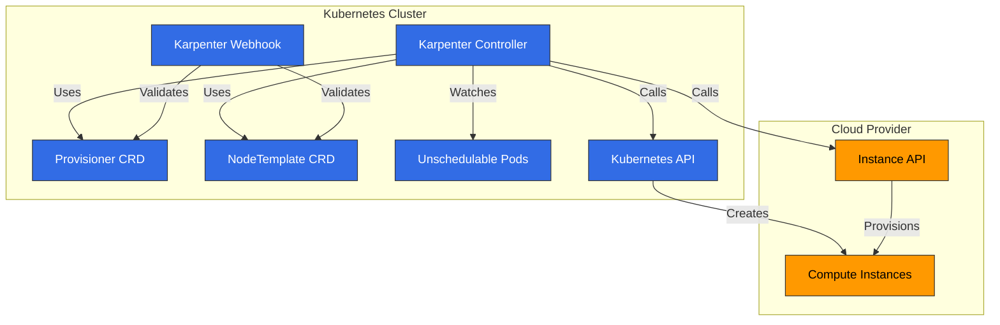
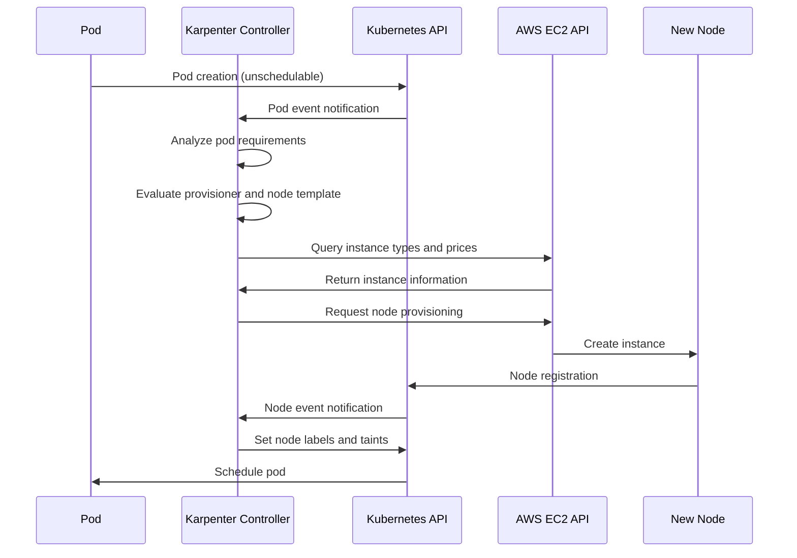
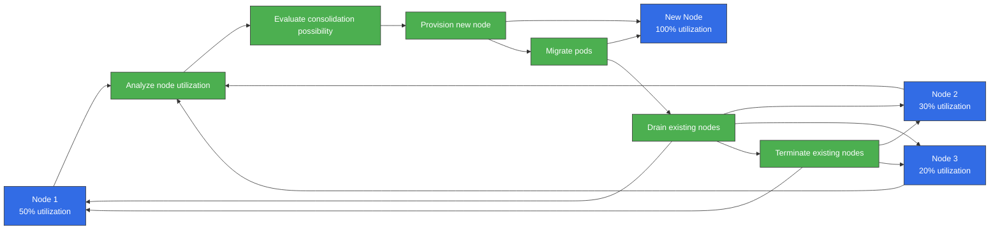
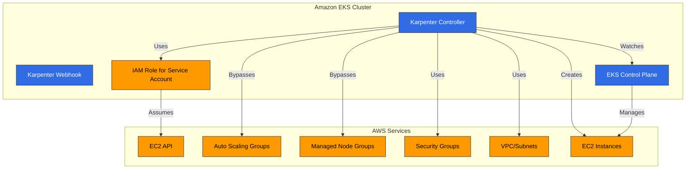

```mermaid
flowchart TD
    %% Key areas
    P[Performance Optimization]
    C[Cost Optimization]
    A[Availability Improvement]
    S[Security Hardening]

    %% Performance optimization strategies
    P1[Select appropriate instance types]
    P2[Allow diverse instance types]
    P3[Set appropriate TTL]
    P4[Enable node consolidation]

    %% Cost optimization strategies
    C1[Utilize Spot instances]
    C2[Select appropriate instance sizes]
    C3[Utilize zero scaling]
    C4[Set node expiration]

    %% Availability improvement strategies
    A1[Use multiple availability zones]
    A2[Mix on-demand/Spot instances]
    A3[Set appropriate PDBs]
    A4[Optimize interruption handling]

    %% Security hardening strategies
    S1[IAM role least privilege]
    S2[Security group restrictions]
    S3[Encrypted EBS volumes]
    S4[Require IMDSv2]

    %% Connection definitions
    P --> P1 & P2 & P3 & P4
    C --> C1 & C2 & C3 & C4
    A --> A1 & A2 & A3 & A4
    S --> S1 & S2 & S3 & S4

    %% Style definitions
    classDef k8sComponent fill:#326CE5,stroke:#333,stroke-width:1px,color:white;
    classDef awsService fill:#FF9900,stroke:#333,stroke-width:1px,color:black;
    classDef userApp fill:#00C7B7,stroke:#333,stroke-width:1px,color:white;
    classDef dataStore fill:#3B48CC,stroke:#333,stroke-width:1px,color:white;
    classDef prometheus fill:#E6522C,stroke:#333,stroke-width:1px,color:white;
    classDef victoriaMetrics fill:#4285F4,stroke:#333,stroke-width:1px,color:white;
    classDef grafana fill:#F8B52A,stroke:#333,stroke-width:1px,color:black;
    classDef alerting fill:#EB6E85,stroke:#333,stroke-width:1px,color:white;
    classDef category fill:#9C27B0,stroke:#333,stroke-width:1px,color:white;
    classDef performance fill:#4CAF50,stroke:#333,stroke-width:1px,color:white;
    classDef cost fill:#FF9800,stroke:#333,stroke-width:1px,color:white;
    classDef availability fill:#2196F3,stroke:#333,stroke-width:1px,color:white;
    classDef security fill:#F44336,stroke:#333,stroke-width:1px,color:white;
    classDef default fill:#f9f9f9,stroke:#333,stroke-width:1px,color:black;

    %% Class application
    class P,C,A,S category
    class P1,P2,P3,P4 performance
    class C1,C2,C3,C4 cost
    class A1,A2,A3,A4 availability
    class S1,S2,S3,S4 security
```

# Karpenter

> **Versiones compatibles**: Karpenter 1.6 - 1.14, Kubernetes 1.29+ (a partir de v1.14)
> **Última actualización**: August 24, 2026

## Tabla de contenido
- [Introducción](#introducción)
- [Arquitectura](#arquitectura)
- [Instalación y configuración](#instalación-y-configuración)
- [Provisioner](#provisioner)
- [Plantillas de nodos](#plantillas-de-nodos)
- [Manejo de interrupciones](#manejo-de-interrupciones)
- [Integración](#integración)
- [Integración con Amazon EKS](#integración-con-amazon-eks)
- [Mejores prácticas](#mejores-prácticas)
- [Solución de problemas](#solución-de-problemas)
- [Conclusión](#conclusión)

## Introducción

Karpenter es un autoscaler de clúster de código abierto que automatiza el aprovisionamiento de nodos para clústeres de Kubernetes. Karpenter aprovisiona dinámicamente recursos de cómputo adecuados según los requisitos de las cargas de trabajo para garantizar la disponibilidad de las aplicaciones y optimizar la eficiencia del clúster.

### Beneficios clave de Karpenter

1. **Escalado rápido**: Aprovisionamiento de nodos en segundos según los requisitos de las cargas de trabajo
2. **Optimización de costos**: Selección de los tipos de instancia más adecuados para las cargas de trabajo
3. **Configuración sencilla**: Configuración fácil mediante API declarativas
4. **Diseño centrado en la carga de trabajo**: Aprovisionamiento de nodos basado en los requisitos de los Pod
5. **Integración con la nube**: Aprovecha las capacidades del proveedor de nube
6. **Bin packing eficiente**: Optimiza la utilización de recursos
7. **Administración flexible de nodos**: Administración del ciclo de vida de los nodos y manejo integrado de interrupciones

### Comparación con autoscalers existentes

| Característica | Karpenter | Cluster Autoscaler | Grupos de nodos administrados por el proveedor de nube |
|---------|-----------|-------------------|---------------------------|
| Velocidad de escalado | Muy rápida (segundos) | Media (minutos) | Lenta (minutos) |
| Selección de tipo de instancia | Dinámica | Basada en grupos de nodos | Basada en grupos de nodos |
| Eficiencia de bin packing | Alta | Media | Baja |
| Complejidad de configuración | Baja | Media | Baja |
| Integración con la nube | Nativa | Limitada | Nativa |
| Administración de grupos de nodos | No requerida | Requerida | Requerida |
| Manejo de interrupciones | Integrado | Limitado | Limitado |

> **Nota**: Si utiliza los EKS Managed Node Groups y Cluster Autoscaler tradicionales en lugar de Karpenter, EC2 Auto Scaling Warm Pools (disponible desde abril de 2026) le permite mantener instancias preinicializadas en espera para un scale-out sin arranque en frío. Puede elegir un estado Stopped (menor costo) o Running (transición más rápida), y se integra automáticamente con Cluster Autoscaler; sin embargo, esta es una característica de Managed Node Group, no algo que use Karpenter.

## Arquitectura

Karpenter funciona como un controller de Kubernetes, detectando Pod no programables y aprovisionando nodos adecuados.



### Flujo de trabajo de Karpenter

El siguiente diagrama muestra cómo funciona Karpenter en un clúster de EKS:



### Componentes clave

1. **Karpenter Controller**: Detecta Pod no programables y administra el aprovisionamiento de nodos
2. **Karpenter Webhook**: Valida recursos de Karpenter
3. **Provisioner CRD**: Define políticas de aprovisionamiento de nodos
4. **NodeTemplate CRD**: Define la configuración de los nodos que se aprovisionarán
5. **Integración con el proveedor de nube**: Se integra con las API del proveedor de nube para administrar recursos de cómputo

### Cómo funciona

1. Karpenter Controller detecta Pod no programables
2. Analiza los requisitos de los Pod (recursos, selectores de nodos, tolerations, etc.)
3. Determina los tipos de nodo adecuados según la configuración de provisioner y plantilla de nodo
4. Llama a la API del proveedor de nube para aprovisionar nodos
5. Programa los Pod una vez que los nodos se unen al clúster
6. Elimina nodos mediante el manejo integrado de interrupciones cuando ya no se necesitan

## Instalación y configuración

### Requisitos previos

- Clúster de Kubernetes (v1.19 o superior)
- kubectl configurado
- Credenciales y permisos del proveedor de nube
- Helm (opcional)

### Instalación en AWS EKS

#### 1. Configuración de rol y política de IAM

```bash
# IRSA setup using eksctl
eksctl create iamserviceaccount \
  --cluster=my-cluster \
  --name=karpenter \
  --namespace=karpenter \
  --attach-policy-arn=arn:aws:iam::aws:policy/AmazonEKSClusterPolicy \
  --attach-policy-arn=arn:aws:iam::aws:policy/AmazonEC2ContainerRegistryReadOnly \
  --approve

# Create instance profile
aws iam create-instance-profile --instance-profile-name KarpenterNodeInstanceProfile

# Create node role
aws iam create-role --role-name KarpenterNodeRole --assume-role-policy-document file://node-trust-policy.json

# Attach policies to node role
aws iam attach-role-policy --role-name KarpenterNodeRole --policy-arn arn:aws:iam::aws:policy/AmazonEKSWorkerNodePolicy
aws iam attach-role-policy --role-name KarpenterNodeRole --policy-arn arn:aws:iam::aws:policy/AmazonEKS_CNI_Policy
aws iam attach-role-policy --role-name KarpenterNodeRole --policy-arn arn:aws:iam::aws:policy/AmazonEC2ContainerRegistryReadOnly
aws iam attach-role-policy --role-name KarpenterNodeRole --policy-arn arn:aws:iam::aws:policy/AmazonSSMManagedInstanceCore

# Add role to instance profile
aws iam add-role-to-instance-profile --instance-profile-name KarpenterNodeInstanceProfile --role-name KarpenterNodeRole
```

#### 2. Instalación mediante Helm

```bash
# Add Helm repository
helm repo add karpenter https://charts.karpenter.sh
helm repo update

# Install Karpenter
helm install karpenter karpenter/karpenter \
  --namespace karpenter \
  --create-namespace \
  --set serviceAccount.annotations."eks\.amazonaws\.com/role-arn"=arn:aws:iam::${ACCOUNT_ID}:role/KarpenterControllerRole \
  --set clusterName=${CLUSTER_NAME} \
  --set clusterEndpoint=${CLUSTER_ENDPOINT} \
  --set aws.defaultInstanceProfile=KarpenterNodeInstanceProfile
```

#### 3. Verificar la instalación

```bash
kubectl get pods -n karpenter
```

Salida esperada:
```
NAME                         READY   STATUS    RESTARTS   AGE
karpenter-6f4f46d855-5lqx7   1/1     Running   0          1m
```

### Configuración básica de Provisioner

```yaml
apiVersion: karpenter.sh/v1
kind: NodePool
metadata:
  name: default
spec:
  disruption:
    consolidationPolicy: WhenEmpty
    consolidateAfter: 30s
  limits:
    cpu: 1000
    memory: 1000Gi
  template:
    spec:
      requirements:
        - key: karpenter.sh/capacity-type
          operator: In
          values: ["on-demand"]
        - key: kubernetes.io/arch
          operator: In
          values: ["amd64"]
        - key: node.kubernetes.io/instance-type
          operator: In
          values: ["m5.large", "m5.xlarge", "m5.2xlarge"]
      nodeClassRef:
        group: karpenter.k8s.aws
        kind: EC2NodeClass
        name: default
---
apiVersion: karpenter.k8s.aws/v1
kind: EC2NodeClass
metadata:
  name: default
spec:
  subnetSelectorTerms:
    - tags:
        karpenter.sh/discovery: "true"
  securityGroupSelectorTerms:
    - tags:
        karpenter.sh/discovery: "true"
  tags:
    karpenter.sh/discovery: "true"
  blockDeviceMappings:
    - deviceName: /dev/xvda
      ebs:
        volumeSize: 100Gi
        volumeType: gp3
        deleteOnTermination: true
```

## NodePool

NodePool es un recurso personalizado de Kubernetes que define cómo Karpenter aprovisiona nodos. Reemplaza al Provisioner anterior.

### Configuración básica de NodePool

```yaml
apiVersion: karpenter.sh/v1
kind: NodePool
metadata:
  name: default
spec:
  # Node requirements
  template:
    spec:
      requirements:
        - key: karpenter.sh/capacity-type
          operator: In
          values: ["on-demand"]
        - key: kubernetes.io/arch
          operator: In
          values: ["amd64"]
        - key: node.kubernetes.io/instance-type
          operator: In
          values: ["m5.large", "m5.xlarge", "m5.2xlarge"]

  # Resource limits
  limits:
    cpu: 1000
    memory: 1000Gi

  # Node class reference
  template:
    spec:
      nodeClassRef:
        group: karpenter.k8s.aws
        kind: EC2NodeClass
        name: default

  # Node expiration settings
  disruption:
    consolidationPolicy: WhenEmpty
    consolidateAfter: 30s
    expireAfter: 720h  # 30 days

  # Taints and labels
  template:
    spec:
      taints:
        - key: example.com/special-taint
          value: "true"
          effect: NoSchedule
      labels:
        environment: production
        app: web

  # Startup template
  template:
    spec:
      startupTaints:
        - key: node.kubernetes.io/not-ready
          effect: NoSchedule
```

### Configuración de requisitos

Los requisitos definen las características de los nodos que Karpenter aprovisionará:

```yaml
template:
  spec:
    requirements:
      # Capacity type (on-demand or spot)
      - key: karpenter.sh/capacity-type
        operator: In
        values: ["on-demand", "spot"]

      # Architecture
      - key: kubernetes.io/arch
        operator: In
        values: ["amd64", "arm64"]

      # Instance types
      - key: node.kubernetes.io/instance-type
        operator: In
        values: ["m5.large", "m5.xlarge", "c5.large"]

      # Availability zones
      - key: topology.kubernetes.io/zone
        operator: In
        values: ["us-west-2a", "us-west-2b", "us-west-2c"]

      # Operating system
      - key: kubernetes.io/os
        operator: In
        values: ["linux"]
```

### Configuración de límites

Los límites definen la cantidad máxima de recursos que Karpenter puede aprovisionar:

```yaml
limits:
  cpu: 1000
  memory: 1000Gi
  nvidia.com/gpu: 10
```

### Compatibilidad con Dynamic Resource Allocation (DRA) (v1.13)

A partir de Karpenter v1.13 (lanzado en junio de 2026), Karpenter admite el seguimiento de asignación de dispositivos basado en Kubernetes Dynamic Resource Allocation (DRA). Karpenter ahora puede reconocer recursos basados en claims, como GPU y aceleradores especializados, e incorporarlos en las decisiones de aprovisionamiento, lo que permite un escalado preciso no solo para recursos extendidos como `nvidia.com/gpu`, sino también para cargas de trabajo de AI/HPC que usan objetos DRA `ResourceClaim`/`DeviceClass`. El seguimiento basado en DRA requiere Kubernetes 1.29 o posterior.

### Configuración de expiración de nodos

La configuración de expiración de nodos define cuándo Karpenter elimina nodos:

```yaml
disruption:
  # Consolidate (remove) when node is empty
  consolidationPolicy: WhenEmpty

  # Time until consolidation (removal) after node becomes empty
  consolidateAfter: 30s

  # Maximum time before removing node after creation
  expireAfter: 720h  # 30 days
```

### Ignorar automáticamente los taints de inicialización mediante NodeReadinessController (v1.13)

NodeReadinessController, agregado en Karpenter v1.13, ignora automáticamente los taints relacionados con la preparación (como los aplicados mientras se inicializa un nodo) para reducir bloqueos de programación innecesarios. Esto alivia el problema de retraso de inicialización que anteriormente requería manejo manual mediante `startupTaints`, mejorando la estabilidad de programación y la confiabilidad del aprovisionamiento mientras un nodo nuevo alcanza el estado Ready.

### Actualización de julio de 2026: lanzamiento de v1.14

Karpenter v1.14, lanzado el 11 de julio de 2026, incorpora:

- **Compatibilidad con la API CapacityBuffers**: reserva de capacidad adicional de forma declarativa para absorber picos repentinos de scale-out
- **Compatibilidad con tipos de instancia en vista previa**: ahora se pueden seleccionar para el aprovisionamiento tipos de instancia que aún no están disponibles de forma general
- **Compatibilidad con Nitro Enclaves**: se puede establecer `EnclaveOptions.Enabled` en la plantilla de lanzamiento, útil para cargas de trabajo de computación confidencial
- Correcciones de errores: contabilización de la IP primaria en ENI secundarios, garantía de que se complete la caché de Zonal Shift, conexión de un tiempo de espera del cliente de AWS SDK a la configuración del operador y más

Consulte las [notas de la versión v1.14.0](https://github.com/aws/karpenter-provider-aws/releases/tag/v1.14.0) para obtener más detalles.

Luego, el 17 de julio de 2026, se publicó un lote coordinado de versiones de parche (v1.3.8 a v1.11.3) en todas las líneas menores mantenidas, cada una actualizando la versión ascendente de `sigs.k8s.io/karpenter`. Si usa una línea anterior, se recomienda actualizar al último parche de esa línea ([lista de versiones](https://github.com/aws/karpenter-provider-aws/releases)).

El 22 de julio de 2026, AWS también anunció la configuración de dispositivos de red Elastic Fabric Adapter (EFA) y la compatibilidad con grupos de ubicación de EC2 para los node pools de Karpenter (y EKS Auto Mode). Las interfaces de red de las instancias compatibles con EFA se pueden establecer como solo EFA (lo que no consume direcciones IP de VPC) o ENI estándar, y las estrategias de ubicación cluster/spread/partition se pueden especificar directamente en la configuración del node pool, útil para cargas de trabajo de entrenamiento e inferencia distribuidos. Consulte el [anuncio](https://aws.amazon.com/about-aws/whats-new/2026/07/amazon-eks-efa-placement-groups/).

### Actualización de agosto de 2026: versión de parche v1.14.1

[v1.14.1](https://github.com/aws/karpenter-provider-aws/releases/tag/v1.14.1), el primer parche de la línea v1.14, se publicó el 21 de agosto de 2026. Es una versión de mantenimiento que actualiza la versión ascendente de `sigs.k8s.io/karpenter` e incorpora correcciones realizadas desde v1.14.0.

## Clases de nodos

Las clases de nodos definen la configuración de los nodos que Karpenter aprovisiona. En AWS, utiliza el CRD EC2NodeClass.

### Configuración de AWS EC2NodeClass

```yaml
apiVersion: karpenter.k8s.aws/v1
kind: EC2NodeClass
metadata:
  name: default
spec:
  # Subnet selection
  subnetSelectorTerms:
    - tags:
        karpenter.sh/discovery: "true"

  # Security group selection
  securityGroupSelectorTerms:
    - tags:
        karpenter.sh/discovery: "true"

  # Instance tags
  tags:
    karpenter.sh/discovery: "true"
    environment: production

  # Block device mappings
  blockDeviceMappings:
    - deviceName: /dev/xvda
      ebs:
        volumeSize: 100Gi
        volumeType: gp3
        deleteOnTermination: true
        encrypted: true

  # Detailed instance configuration
  role: KarpenterNodeRole
  amiFamily: AL2
  userData: |
    #!/bin/bash
    echo "Hello from Karpenter node!"

  # Metadata options
  metadataOptions:
    httpEndpoint: enabled
    httpProtocolIPv6: disabled
    httpPutResponseHopLimit: 2
    httpTokens: required
```

### Selección de subredes y grupos de seguridad

Las subredes y los grupos de seguridad se pueden seleccionar mediante selectores de etiquetas:

```yaml
# Subnet selection
subnetSelector:
  karpenter.sh/discovery: "true"
  Name: "private-*"

# Security group selection
securityGroupSelector:
  karpenter.sh/discovery: "true"
  aws:eks:cluster-name: "my-cluster"
```

### Configuración de AMI

Karpenter admite varias familias de AMI:

```yaml
# Amazon Linux 2
amiFamily: AL2

# Bottlerocket
amiFamily: Bottlerocket

# Ubuntu
amiFamily: Ubuntu

# Custom AMI
amiSelector:
  aws:ec2:image:id: "ami-0123456789abcdef0"
```

### Configuración de dispositivos de bloques

Puede definir la configuración de almacenamiento para los nodos:

```yaml
blockDeviceMappings:
  # Root volume
  - deviceName: /dev/xvda
    ebs:
      volumeSize: 100Gi
      volumeType: gp3
      iops: 3000
      throughput: 125
      deleteOnTermination: true
      encrypted: true
      kmsKeyID: "arn:aws:kms:us-west-2:111122223333:key/1234abcd-12ab-34cd-56ef-1234567890ab"

  # Additional volume
  - deviceName: /dev/xvdb
    ebs:
      volumeSize: 500Gi
      volumeType: gp3
      deleteOnTermination: true
```

### Configuración de datos de usuario

Puede definir scripts de datos de usuario para ejecutarse al iniciar el nodo:

```yaml
userData: |
  #!/bin/bash
  echo "Hello from Karpenter node!"

  # System configuration
  sysctl -w vm.max_map_count=262144

  # Package installation
  yum update -y
  yum install -y amazon-cloudwatch-agent

  # Start CloudWatch agent
  systemctl enable amazon-cloudwatch-agent
  systemctl start amazon-cloudwatch-agent
```

### Proceso de consolidación de nodos

El siguiente diagrama muestra el proceso de consolidación de nodos de Karpenter. Esta característica es importante para optimizar la eficiencia del clúster y reducir costos:



## Manejo de interrupciones

Karpenter maneja automáticamente las interrupciones de nodos para garantizar la disponibilidad de las cargas de trabajo.

### Manejo integrado de interrupciones

Karpenter maneja los siguientes eventos de interrupción:

1. **Interrupciones de instancias Spot**: Maneja las notificaciones de interrupción de instancias AWS Spot
2. **Expiración de nodos**: Reemplazo de nodos basado en TTL
3. **Scale Down**: Elimina nodos cuando ya no se necesitan
4. **Consolidación de nodos**: Consolida en configuraciones de nodos más eficientes

### Configuración del manejo de interrupciones

```yaml
apiVersion: karpenter.sh/v1
kind: NodePool
metadata:
  name: default
spec:
  # Other configuration...

  # Node expiration settings
  disruption:
    consolidationPolicy: WhenEmpty
    consolidateAfter: 30s
    expireAfter: 720h  # 30 days
```

### Configuración de drain

Karpenter realiza drain de los Pod de forma segura antes de eliminar nodos:

```yaml
apiVersion: v1
kind: ConfigMap
metadata:
  name: karpenter-global-settings
  namespace: karpenter
data:
  aws:
    enablePodENI: "true"
  batchMaxDuration: "10s"
  batchIdleDuration: "1s"
  featureGates:
    driftEnabled: "true"
  nodePool:
    disruptionBudget:
      maxUnavailablePercentage: "30"
    disruption:
      consolidationPolicy: WhenEmpty
      consolidateAfter: 30s
      expireAfter: 720h
```

### Integración con PDB (PodDisruptionBudget)

Karpenter respeta los PDB para garantizar la disponibilidad de las aplicaciones:

```yaml
apiVersion: policy/v1
kind: PodDisruptionBudget
metadata:
  name: app-pdb
spec:
  minAvailable: 2
  selector:
    matchLabels:
      app: my-app
```

## Integración

Karpenter se integra con diversos servicios de Kubernetes y de nube.

### Integración con Kubernetes

#### 1. Pod Topology Spread Constraints

Karpenter considera las Pod Topology Spread Constraints al aprovisionar nodos:

```yaml
apiVersion: apps/v1
kind: Deployment
metadata:
  name: web-server
spec:
  replicas: 10
  template:
    spec:
      topologySpreadConstraints:
        - maxSkew: 1
          topologyKey: topology.kubernetes.io/zone
          whenUnsatisfiable: DoNotSchedule
          labelSelector:
            matchLabels:
              app: web-server
```

#### 2. Pod Affinity/Anti-Affinity

Karpenter considera las reglas de Pod Affinity y Anti-Affinity:

```yaml
apiVersion: apps/v1
kind: Deployment
metadata:
  name: web-server
spec:
  replicas: 10
  template:
    spec:
      affinity:
        podAntiAffinity:
          requiredDuringSchedulingIgnoredDuringExecution:
            - labelSelector:
                matchExpressions:
                  - key: app
                    operator: In
                    values:
                      - web-server
              topologyKey: "kubernetes.io/hostname"
```

#### 3. Taints y tolerations

Karpenter considera los taints y las tolerations al aprovisionar nodos:

```yaml
apiVersion: karpenter.sh/v1alpha5
kind: Provisioner
metadata:
  name: gpu
spec:
  requirements:
    - key: node.kubernetes.io/instance-type
      operator: In
      values: ["g4dn.xlarge", "g4dn.2xlarge"]
  taints:
    - key: nvidia.com/gpu
      value: "true"
      effect: NoSchedule
---
apiVersion: apps/v1
kind: Deployment
metadata:
  name: gpu-app
spec:
  replicas: 3
  template:
    spec:
      tolerations:
        - key: nvidia.com/gpu
          operator: Exists
          effect: NoSchedule
      nodeSelector:
        karpenter.sh/provisioner-name: gpu
```

### Integración con AWS

#### 1. Instancias EC2 Spot

Karpenter admite instancias EC2 Spot para optimizar costos:

```yaml
apiVersion: karpenter.sh/v1alpha5
kind: Provisioner
metadata:
  name: spot
spec:
  requirements:
    - key: karpenter.sh/capacity-type
      operator: In
      values: ["spot"]
  providerRef:
    name: spot
---
apiVersion: karpenter.k8s.aws/v1alpha1
kind: AWSNodeTemplate
metadata:
  name: spot
spec:
  subnetSelector:
    karpenter.sh/discovery: "true"
  securityGroupSelector:
    karpenter.sh/discovery: "true"
```

#### 2. Perfiles de instancia EC2

Karpenter utiliza perfiles de instancia EC2 para otorgar permisos de IAM a los nodos:

```yaml
apiVersion: karpenter.k8s.aws/v1alpha1
kind: AWSNodeTemplate
metadata:
  name: default
spec:
  instanceProfile: KarpenterNodeInstanceProfile
```

#### 3. Plantillas de lanzamiento

Karpenter admite plantillas de lanzamiento de EC2:

```yaml
apiVersion: karpenter.k8s.aws/v1alpha1
kind: AWSNodeTemplate
metadata:
  name: custom-launch-template
spec:
  launchTemplate:
    name: my-launch-template
    version: "1"
```
## Integración con Amazon EKS

Karpenter se integra sin problemas con Amazon EKS para proporcionar autoscaling de clústeres.



### Preparación del clúster de EKS

#### 1. Configuración de etiquetas del clúster

Configure etiquetas para que Karpenter pueda identificar los recursos del clúster:

```bash
# Set cluster name
CLUSTER_NAME="my-cluster"

# VPC tag setup
aws ec2 create-tags \
  --resources $(aws eks describe-cluster \
    --name ${CLUSTER_NAME} \
    --query "cluster.resourcesVpcConfig.vpcId" \
    --output text) \
  --tags Key=karpenter.sh/discovery,Value=${CLUSTER_NAME}

# Subnet tag setup
for SUBNET in $(aws eks describe-cluster \
  --name ${CLUSTER_NAME} \
  --query "cluster.resourcesVpcConfig.subnetIds[]" \
  --output text); do
  aws ec2 create-tags \
    --resources ${SUBNET} \
    --tags Key=karpenter.sh/discovery,Value=${CLUSTER_NAME}
done

# Security group tag setup
aws ec2 create-tags \
  --resources $(aws eks describe-cluster \
    --name ${CLUSTER_NAME} \
    --query "cluster.resourcesVpcConfig.clusterSecurityGroupId" \
    --output text) \
  --tags Key=karpenter.sh/discovery,Value=${CLUSTER_NAME}
```

#### 2. Configuración de roles de IAM

Configure los roles de IAM requeridos para el controller y los nodos de Karpenter:

```bash
# Create controller role
cat <<EOF > controller-trust-policy.json
{
  "Version": "2012-10-17",
  "Statement": [
    {
      "Effect": "Allow",
      "Principal": {
        "Federated": "arn:aws:iam::${ACCOUNT_ID}:oidc-provider/${OIDC_PROVIDER}"
      },
      "Action": "sts:AssumeRoleWithWebIdentity",
      "Condition": {
        "StringEquals": {
          "${OIDC_PROVIDER}:sub": "system:serviceaccount:karpenter:karpenter",
          "${OIDC_PROVIDER}:aud": "sts.amazonaws.com"
        }
      }
    }
  ]
}
EOF

aws iam create-role \
  --role-name KarpenterControllerRole-${CLUSTER_NAME} \
  --assume-role-policy-document file://controller-trust-policy.json

# Create controller policy
cat <<EOF > controller-policy.json
{
  "Version": "2012-10-17",
  "Statement": [
    {
      "Effect": "Allow",
      "Action": [
        "ec2:CreateLaunchTemplate",
        "ec2:CreateFleet",
        "ec2:RunInstances",
        "ec2:CreateTags",
        "ec2:TerminateInstances",
        "ec2:DescribeLaunchTemplates",
        "ec2:DescribeInstances",
        "ec2:DescribeSecurityGroups",
        "ec2:DescribeSubnets",
        "ec2:DescribeInstanceTypes",
        "ec2:DescribeInstanceTypeOfferings",
        "ec2:DescribeAvailabilityZones",
        "ec2:DescribeSpotPriceHistory",
        "pricing:GetProducts",
        "ssm:GetParameter"
      ],
      "Resource": "*"
    },
    {
      "Effect": "Allow",
      "Action": "iam:PassRole",
      "Resources": "arn:aws:iam::${ACCOUNT_ID}:role/KarpenterNodeRole-${CLUSTER_NAME}",
      "Condition": {
        "StringEquals": {
          "iam:PassedToService": "ec2.amazonaws.com"
        }
      }
    }
  ]
}
EOF

aws iam put-role-policy \
  --role-name KarpenterControllerRole-${CLUSTER_NAME} \
  --policy-name KarpenterControllerPolicy-${CLUSTER_NAME} \
  --policy-document file://controller-policy.json
```

### Instalación de Karpenter en el clúster de EKS

```bash
# Installation using Helm
helm install karpenter karpenter/karpenter \
  --namespace karpenter \
  --create-namespace \
  --set serviceAccount.annotations."eks\.amazonaws\.com/role-arn"=arn:aws:iam::${ACCOUNT_ID}:role/KarpenterControllerRole-${CLUSTER_NAME} \
  --set clusterName=${CLUSTER_NAME} \
  --set clusterEndpoint=$(aws eks describe-cluster --name ${CLUSTER_NAME} --query "cluster.endpoint" --output text) \
  --set aws.defaultInstanceProfile=KarpenterNodeInstanceProfile-${CLUSTER_NAME}
```

### Uso con EKS Managed Node Groups

Karpenter se puede usar junto con EKS Managed Node Groups:

```yaml
# Provisioner for EKS Managed Node Groups
apiVersion: karpenter.sh/v1alpha5
kind: Provisioner
metadata:
  name: managed-ng
spec:
  requirements:
    - key: karpenter.sh/capacity-type
      operator: In
      values: ["on-demand"]
    - key: node.kubernetes.io/instance-type
      operator: In
      values: ["m5.large", "m5.xlarge"]
  labels:
    managed-by: karpenter
  taints:
    - key: managed-by
      value: karpenter
      effect: NoSchedule
  providerRef:
    name: managed-ng
  ttlSecondsAfterEmpty: 30
---
apiVersion: karpenter.k8s.aws/v1alpha1
kind: AWSNodeTemplate
metadata:
  name: managed-ng
spec:
  subnetSelector:
    karpenter.sh/discovery: "${CLUSTER_NAME}"
  securityGroupSelector:
    karpenter.sh/discovery: "${CLUSTER_NAME}"
  tags:
    karpenter.sh/discovery: "${CLUSTER_NAME}"
```

### Uso con EKS Fargate

Karpenter se puede usar con EKS Fargate para configurar clústeres híbridos:

```yaml
# Create Fargate profile
aws eks create-fargate-profile \
  --cluster-name ${CLUSTER_NAME} \
  --fargate-profile-name fp-default \
  --pod-execution-role-arn arn:aws:iam::${ACCOUNT_ID}:role/AmazonEKSFargatePodExecutionRole \
  --selectors namespace=default,namespace=kube-system

# Karpenter NodePool configuration
apiVersion: karpenter.sh/v1
kind: NodePool
metadata:
  name: ec2
spec:
  template:
    spec:
      requirements:
        - key: karpenter.sh/capacity-type
          operator: In
          values: ["on-demand"]
      nodeClassRef:
        group: karpenter.k8s.aws
        kind: EC2NodeClass
        name: ec2
  disruption:
    consolidationPolicy: WhenEmpty
    consolidateAfter: 30s
---
apiVersion: karpenter.k8s.aws/v1
kind: EC2NodeClass
metadata:
  name: ec2
spec:
  subnetSelectorTerms:
    - tags:
        karpenter.sh/discovery: "${CLUSTER_NAME}"
  securityGroupSelectorTerms:
    - tags:
        karpenter.sh/discovery: "${CLUSTER_NAME}"
```

### Respuesta ante fallas de AZ: integración de Amazon ARC Zonal Shift (mayo de 2026)

Karpenter admite Zonal Shift de Amazon ARC (Application Recovery Controller). Cuando falla una Availability Zone (AZ), Karpenter deja automáticamente de aprovisionar nodos nuevos en esa AZ y programa las cargas de trabajo hacia AZ en buen estado. También se admite Zonal Autoshift, donde AWS detecta automáticamente el estado de las AZ y maneja el desplazamiento de tráfico y la recuperación.

Cuando se detecta una falla, Karpenter también suspende automáticamente la interrupción voluntaria (consolidación, manejo de drift, etc.) para que el reemplazo innecesario de nodos no desestabilice aún más el clúster durante una interrupción. Esto usa directamente los recursos existentes de EKS ARC, no se requieren recursos personalizados, y se habilita con la opción `ENABLE_ZONAL_SHIFT`.

### Optimización de costos de EKS

Puede usar Karpenter para optimizar los costos de los clústeres de EKS:

```mermaid
flowchart TD
    %% Node definitions
    CA[Cluster Autoscaler]
    KA[Karpenter]

    %% Cost optimization strategies
    CA1[Node group-based scaling]
    CA2[Same instance types]
    CA3[Slow scaling speed]
    CA4[Limited bin packing]

    KA1[Workload-based scaling]
    KA2[Diverse instance types]
    KA3[Fast scaling speed]
    KA4[Efficient bin packing]
    KA5[Node consolidation]
    KA6[Spot instance utilization]

    %% Results
    CAR[Cost savings: Medium]
    KAR[Cost savings: High]

    %% Connection definitions
    CA --> CA1 & CA2 & CA3 & CA4
    CA1 & CA2 & CA3 & CA4 --> CAR

    KA --> KA1 & KA2 & KA3 & KA4 & KA5 & KA6
    KA1 & KA2 & KA3 & KA4 & KA5 & KA6 --> KAR

    %% Style definitions
    classDef k8sComponent fill:#326CE5,stroke:#333,stroke-width:1px,color:white;
    classDef awsService fill:#FF9900,stroke:#333,stroke-width:1px,color:black;
    classDef userApp fill:#00C7B7,stroke:#333,stroke-width:1px,color:white;
    classDef dataStore fill:#3B48CC,stroke:#333,stroke-width:1px,color:white;
    classDef prometheus fill:#E6522C,stroke:#333,stroke-width:1px,color:white;
    classDef victoriaMetrics fill:#4285F4,stroke:#333,stroke-width:1px,color:white;
    classDef grafana fill:#F8B52A,stroke:#333,stroke-width:1px,color:black;
    classDef alerting fill:#EB6E85,stroke:#333,stroke-width:1px,color:white;
    classDef strategy fill:#4CAF50,stroke:#333,stroke-width:1px,color:white;
    classDef result fill:#E91E63,stroke:#333,stroke-width:1px,color:white;
    classDef default fill:#f9f9f9,stroke:#333,stroke-width:1px,color:black;

    %% Class application
    class CA,KA k8sComponent
    class CA1,CA2,CA3,CA4,KA1,KA2,KA3,KA4,KA5,KA6 strategy
    class CAR,KAR result
```



#### 1. Uso de instancias Spot

```yaml
apiVersion: karpenter.sh/v1alpha5
kind: Provisioner
metadata:
  name: spot
spec:
  requirements:
    - key: karpenter.sh/capacity-type
      operator: In
      values: ["spot"]
    - key: kubernetes.io/arch
      operator: In
      values: ["amd64", "arm64"]
  providerRef:
    name: spot
  ttlSecondsAfterEmpty: 30
---
apiVersion: karpenter.k8s.aws/v1alpha1
kind: AWSNodeTemplate
metadata:
  name: spot
spec:
  subnetSelector:
    karpenter.sh/discovery: "${CLUSTER_NAME}"
  securityGroupSelector:
    karpenter.sh/discovery: "${CLUSTER_NAME}"
```

#### 2. Uso de diversos tipos de instancia

```yaml
apiVersion: karpenter.sh/v1alpha5
kind: Provisioner
metadata:
  name: flexible
spec:
  requirements:
    - key: karpenter.sh/capacity-type
      operator: In
      values: ["on-demand", "spot"]
    - key: kubernetes.io/arch
      operator: In
      values: ["amd64", "arm64"]
    - key: node.kubernetes.io/instance-type
      operator: In
      values: [
        "m5.large", "m5.xlarge", "m5.2xlarge",
        "m6g.large", "m6g.xlarge", "m6g.2xlarge",
        "c5.large", "c5.xlarge", "c5.2xlarge",
        "c6g.large", "c6g.xlarge", "c6g.2xlarge",
        "r5.large", "r5.xlarge", "r5.2xlarge",
        "r6g.large", "r6g.xlarge", "r6g.2xlarge"
      ]
  providerRef:
    name: flexible
  ttlSecondsAfterEmpty: 30
```

#### 3. Habilitar la consolidación de nodos

```yaml
apiVersion: karpenter.sh/v1alpha5
kind: Provisioner
metadata:
  name: default
spec:
  consolidation:
    enabled: true
  # Other configuration...
```

## Mejores prácticas



### Optimización del rendimiento

1. **Seleccionar tipos de instancia adecuados**: Elija tipos de instancia adecuados para sus cargas de trabajo
2. **Permitir diversos tipos de instancia**: Permita varios tipos de instancia para disponibilidad y optimización de costos
3. **Establecer TTL adecuado**: Establezca un TTL que coincida con los patrones de sus cargas de trabajo
4. **Habilitar la consolidación de nodos**: Habilite la consolidación de nodos para optimizar la utilización de recursos

```yaml
apiVersion: karpenter.sh/v1
kind: NodePool
metadata:
  name: optimized
spec:
  # Allow diverse instance types
  template:
    spec:
      requirements:
        - key: node.kubernetes.io/instance-type
          operator: In
          values: [
            "m5.large", "m5.xlarge", "m5.2xlarge",
            "c5.large", "c5.xlarge", "c5.2xlarge",
            "r5.large", "r5.xlarge", "r5.2xlarge"
          ]
      nodeClassRef:
        group: karpenter.k8s.aws
        kind: EC2NodeClass
        name: optimized

  # Set appropriate TTL
  disruption:
    consolidationPolicy: WhenEmpty
    consolidateAfter: 30s
    expireAfter: 720h  # 30 days
```

### Optimización de costos

1. **Utilizar instancias Spot**: Use instancias Spot para ahorrar costos
2. **Seleccionar tamaños de instancia adecuados**: Elija tamaños de instancia adecuados para sus cargas de trabajo
3. **Utilizar escalado a cero**: Reduzca el número de nodos a 0 cuando no haya actividad
4. **Establecer expiración de nodos**: Aproveche los tipos de instancia más recientes mediante el reemplazo regular de nodos

```yaml
apiVersion: karpenter.sh/v1
kind: NodePool
metadata:
  name: cost-optimized
spec:
  # Use Spot instances
  template:
    spec:
      requirements:
        - key: karpenter.sh/capacity-type
          operator: In
          values: ["spot"]
      nodeClassRef:
        group: karpenter.k8s.aws
        kind: EC2NodeClass
        name: cost-optimized

  # Zero scaling and node expiration settings
  disruption:
    consolidationPolicy: WhenEmpty
    consolidateAfter: 30s
    expireAfter: 168h  # 7 days
```

### Mejora de disponibilidad

1. **Usar varias Availability Zones**: Implemente nodos en varias Availability Zones
2. **Combinar instancias On-demand y Spot**: Equilibre la disponibilidad y el costo
3. **Establecer PDB adecuados**: Garantice la disponibilidad de las aplicaciones
4. **Optimizar el manejo de interrupciones**: Garantice la disponibilidad de las cargas de trabajo durante las interrupciones de nodos

```yaml
apiVersion: karpenter.sh/v1
kind: NodePool
metadata:
  name: high-availability
spec:
  # Use multiple availability zones
  template:
    spec:
      requirements:
        - key: topology.kubernetes.io/zone
          operator: In
          values: ["us-west-2a", "us-west-2b", "us-west-2c"]
        - key: karpenter.sh/capacity-type
          operator: In
          values: ["on-demand", "spot"]
      nodeClassRef:
        name: high-availability

  # Optimize interruption handling
  disruption:
    consolidationPolicy: WhenEmpty
    consolidateAfter: 60s
  ttlSecondsUntilExpired: 2592000  # 30 days

  # Node consolidation settings
  consolidation:
    enabled: true
```

## Solución de problemas

### Problemas comunes

#### 1. Error de aprovisionamiento de nodos

**Síntoma**: Los Pod permanecen en estado Pending y los nodos no se aprovisionan

**Solución**:
- Revise los logs de Karpenter
- Verifique los permisos de IAM
- Revise la configuración del provisioner

```bash
# Check Karpenter logs
kubectl logs -n karpenter -l app.kubernetes.io/name=karpenter -c controller

# Check provisioner status
kubectl describe provisioner <name>

# Check pod events
kubectl describe pod <name>
```

#### 2. Problemas de eliminación de nodos

**Síntoma**: Los nodos no se eliminan como se esperaba

**Solución**:
- Revise la configuración de TTL
- Verifique la configuración de consolidación de nodos
- Revise el estado de drain de los Pod

```bash
# Check node status
kubectl describe node <name>

# Check node labels
kubectl get node <name> --show-labels

# Check Karpenter logs
kubectl logs -n karpenter -l app.kubernetes.io/name=karpenter -c controller | grep "node termination"
```

#### 3. Problemas de selección de tipos de instancia

**Síntoma**: Se aprovisionan tipos de instancia inesperados

**Solución**:
- Revise los requisitos del provisioner
- Verifique las solicitudes de recursos de los Pod
- Revise las restricciones de Availability Zone

```bash
# Check provisioner requirements
kubectl get provisioner <name> -o yaml

# Check pod resource requests
kubectl describe pod <name>

# Check node information
kubectl describe node <name>
```

### Herramientas de depuración

```bash
# Check Karpenter version
kubectl get deployment -n karpenter karpenter -o jsonpath="{.spec.template.spec.containers[0].image}"

# Check Karpenter logs
kubectl logs -n karpenter -l app.kubernetes.io/name=karpenter -c controller

# Check provisioner list
kubectl get provisioners

# Check node template list
kubectl get awsnodetemplates

# Check events
kubectl get events --sort-by='.lastTimestamp'

# Enable debug logs
kubectl patch configmap -n karpenter karpenter-global-settings --type merge -p '{"data":{"logLevel":"debug"}}'
```

## Conclusión

Karpenter es un potente autoscaler que automatiza el aprovisionamiento de nodos para clústeres de Kubernetes. Aprovisiona dinámicamente recursos de cómputo adecuados según los requisitos de las cargas de trabajo para garantizar la disponibilidad de las aplicaciones y optimizar la eficiencia del clúster.

Este documento cubrió los conceptos básicos de Karpenter, métodos de instalación, configuración de provisioner y plantillas de nodos, manejo de interrupciones, diversas integraciones, integración con Amazon EKS, mejores prácticas y solución de problemas.

Con Karpenter, puede simplificar la administración de clústeres, optimizar la utilización de recursos y reducir costos. Especialmente en entornos de Kubernetes administrados en la nube como Amazon EKS, puede maximizar los beneficios de Karpenter.

### Próximos pasos

- Implemente estrategias de optimización de costos con Karpenter
- Configure provisioners para diversos tipos de cargas de trabajo
- Diseñe arquitecturas de clústeres híbridos
- Integre Karpenter con otras herramientas de Kubernetes
- Desarrolle estrategias avanzadas de administración del ciclo de vida de los nodos

## Referencias

- [Documentación oficial de Karpenter](https://karpenter.sh/)
- [Repositorio de GitHub de Karpenter](https://github.com/aws/karpenter)
- [Taller de Amazon EKS - Karpenter](https://www.eksworkshop.com/docs/autoscaling/compute/karpenter/)
- [Blog de AWS - Karpenter](https://aws.amazon.com/blogs/containers/introducing-karpenter-an-open-source-high-performance-kubernetes-cluster-autoscaler/)
- [Mejores prácticas de Karpenter](https://aws.github.io/aws-eks-best-practices/karpenter/)
- [Versiones de GitHub de Karpenter](https://github.com/aws/karpenter-provider-aws/releases)
- [Novedades de AWS - Compatibilidad con Karpenter ARC Zonal Shift](https://aws.amazon.com/about-aws/whats-new/2026/05/karpenter-arc-zonal-shift/)
- [Novedades de AWS - Compatibilidad de Warm Pool de Amazon EKS Managed Node Group](https://aws.amazon.com/about-aws/whats-new/2026/04/amazon-eks-managed-node-groups-ec2-warm-pools/)

## Cuestionario

Para probar lo que ha aprendido en este capítulo, pruebe el [cuestionario del tema](../quizzes/autoscaling/06-karpenter-quiz.md).
