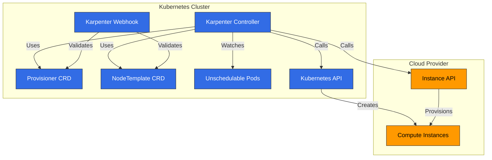
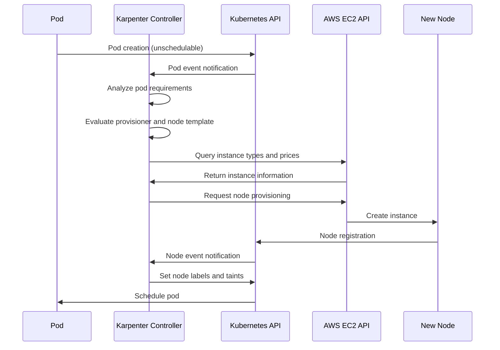
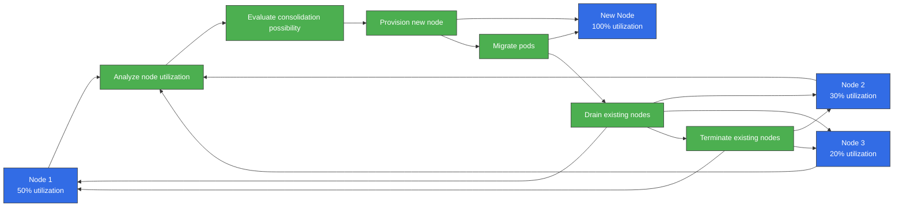
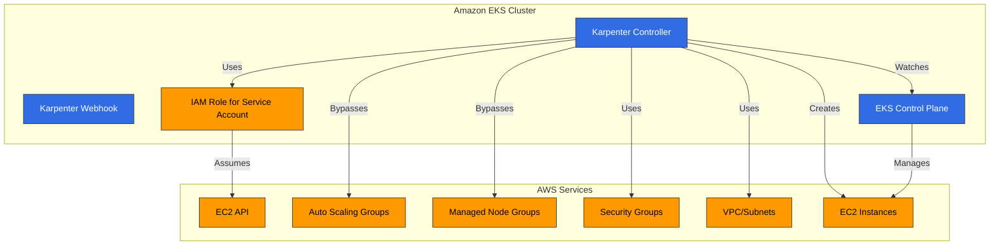

```mermaid
flowchart TD
    %% Node definitions
    CA[Cluster Autoscaler]
    KA[Karpenter]

    %% Cost optimization strategies
    CA1[Node group-based scaling]
    CA2[Same instance types]
    CA3[Slow scaling speed]
    CA4[Limited bin packing]

    KA1[Workload-based scaling]
    KA2[Diverse instance types]
    KA3[Fast scaling speed]
    KA4[Efficient bin packing]
    KA5[Node consolidation]
    KA6[Spot instance utilization]

    %% Results
    CAR[Cost savings: Medium]
    KAR[Cost savings: High]

    %% Connection definitions
    CA --> CA1 & CA2 & CA3 & CA4
    CA1 & CA2 & CA3 & CA4 --> CAR

    KA --> KA1 & KA2 & KA3 & KA4 & KA5 & KA6
    KA1 & KA2 & KA3 & KA4 & KA5 & KA6 --> KAR

    %% Style definitions
    classDef k8sComponent fill:#326CE5,stroke:#333,stroke-width:1px,color:white;
    classDef awsService fill:#FF9900,stroke:#333,stroke-width:1px,color:black;
    classDef userApp fill:#00C7B7,stroke:#333,stroke-width:1px,color:white;
    classDef dataStore fill:#3B48CC,stroke:#333,stroke-width:1px,color:white;
    classDef prometheus fill:#E6522C,stroke:#333,stroke-width:1px,color:white;
    classDef victoriaMetrics fill:#4285F4,stroke:#333,stroke-width:1px,color:white;
    classDef grafana fill:#F8B52A,stroke:#333,stroke-width:1px,color:black;
    classDef alerting fill:#EB6E85,stroke:#333,stroke-width:1px,color:white;
    classDef strategy fill:#4CAF50,stroke:#333,stroke-width:1px,color:white;
    classDef result fill:#E91E63,stroke:#333,stroke-width:1px,color:white;
    classDef default fill:#f9f9f9,stroke:#333,stroke-width:1px,color:black;

    %% Class application
    class CA,KA k8sComponent
    class CA1,CA2,CA3,CA4,KA1,KA2,KA3,KA4,KA5,KA6 strategy
    class CAR,KAR result
```

# Karpenter

> **Versiones compatibles**: Karpenter 1.6 - 1.14, Kubernetes 1.29+ (as of v1.14)
> **Última actualización**: July 11, 2026

## Table of Contents
- [Introduction](#introduction)
- [Architecture](#architecture)
- [Installation and Configuration](#installation-and-configuration)
- [Provisioner](#provisioner)
- [Node Templates](#node-templates)
- [Interruption Handling](#interruption-handling)
- [Integration](#integration)
- [Integration with Amazon EKS](#integration-with-amazon-eks)
- [Best Practices](#best-practices)
- [Troubleshooting](#troubleshooting)
- [Conclusion](#conclusion)

## Introduction

Karpenter es un autoscaler de cluster open-source que automatiza el aprovisionamiento de nodes para clusters de Kubernetes. Karpenter aprovisiona dinámicamente los recursos de cómputo adecuados según los requisitos de la carga de trabajo para garantizar la disponibilidad de la aplicación y optimizar la eficiencia del cluster.

### Key Benefits of Karpenter

1. **Escalado rápido**: Aprovisionamiento de nodes en segundos según los requisitos de la carga de trabajo
2. **Optimización de costos**: Selección de los instance types más adecuados para las cargas de trabajo
3. **Configuración simple**: Configuración sencilla mediante APIs declarativas
4. **Diseño centrado en la carga de trabajo**: Aprovisionamiento de nodes basado en los requisitos de los pods
5. **Integración con la nube**: Aprovecha las capacidades del cloud provider
6. **Bin Packing eficiente**: Optimiza la utilización de recursos
7. **Gestión flexible de nodes**: Gestión del ciclo de vida de nodes y manejo integrado de interrupciones

### Comparison with Existing Autoscalers

| Feature | Karpenter | Cluster Autoscaler | Cloud Provider Managed Node Groups |
|---------|-----------|-------------------|---------------------------|
| Scaling Speed | Very Fast (seconds) | Medium (minutes) | Slow (minutes) |
| Instance Type Selection | Dynamic | Node group-based | Node group-based |
| Bin Packing Efficiency | High | Medium | Low |
| Configuration Complexity | Low | Medium | Low |
| Cloud Integration | Native | Limited | Native |
| Node Group Management | Not Required | Required | Required |
| Interruption Handling | Integrated | Limited | Limited |

> **Nota**: Si sigues usando EKS Managed Node Groups tradicionales y Cluster Autoscaler en lugar de Karpenter, EC2 Auto Scaling Warm Pools (disponible desde abril de 2026) te permite mantener instancias preinicializadas en espera para un scale-out sin cold start. Puedes elegir un estado Stopped (menor costo) o Running (transición más rápida), y se integra automáticamente con Cluster Autoscaler, pero esta es una característica de Managed Node Group, no algo que use Karpenter.

## Architecture

Karpenter opera como un controller de Kubernetes, detectando pods que no pueden programarse y aprovisionando nodes adecuados.



### Karpenter Workflow

El siguiente diagrama muestra cómo funciona Karpenter en un cluster de EKS:



### Key Components

1. **Karpenter Controller**: Detecta pods que no pueden programarse y gestiona el aprovisionamiento de nodes
2. **Karpenter Webhook**: Valida los recursos de Karpenter
3. **Provisioner CRD**: Define políticas de aprovisionamiento de nodes
4. **NodeTemplate CRD**: Define la configuración de los nodes que se aprovisionarán
5. **Cloud Provider Integration**: Se integra con las APIs del cloud provider para gestionar recursos de cómputo

### How It Works

1. Karpenter Controller detecta pods que no pueden programarse
2. Analiza los requisitos del pod (recursos, node selectors, tolerations, etc.)
3. Determina los tipos de node adecuados según la configuración del provisioner y del node template
4. Llama a la API del cloud provider para aprovisionar nodes
5. Programa los pods una vez que los nodes se unen al cluster
6. Elimina nodes mediante el manejo integrado de interrupciones cuando ya no son necesarios

## Installation and Configuration

### Prerequisites

- Cluster de Kubernetes (v1.19 o superior)
- kubectl configurado
- Credenciales y permisos del cloud provider
- Helm (opcional)

### Installing on AWS EKS

#### 1. IAM Role and Policy Setup

```bash
# IRSA setup using eksctl
eksctl create iamserviceaccount \
  --cluster=my-cluster \
  --name=karpenter \
  --namespace=karpenter \
  --attach-policy-arn=arn:aws:iam::aws:policy/AmazonEKSClusterPolicy \
  --attach-policy-arn=arn:aws:iam::aws:policy/AmazonEC2ContainerRegistryReadOnly \
  --approve

# Create instance profile
aws iam create-instance-profile --instance-profile-name KarpenterNodeInstanceProfile

# Create node role
aws iam create-role --role-name KarpenterNodeRole --assume-role-policy-document file://node-trust-policy.json

# Attach policies to node role
aws iam attach-role-policy --role-name KarpenterNodeRole --policy-arn arn:aws:iam::aws:policy/AmazonEKSWorkerNodePolicy
aws iam attach-role-policy --role-name KarpenterNodeRole --policy-arn arn:aws:iam::aws:policy/AmazonEKS_CNI_Policy
aws iam attach-role-policy --role-name KarpenterNodeRole --policy-arn arn:aws:iam::aws:policy/AmazonEC2ContainerRegistryReadOnly
aws iam attach-role-policy --role-name KarpenterNodeRole --policy-arn arn:aws:iam::aws:policy/AmazonSSMManagedInstanceCore

# Add role to instance profile
aws iam add-role-to-instance-profile --instance-profile-name KarpenterNodeInstanceProfile --role-name KarpenterNodeRole
```

#### 2. Installation Using Helm

```bash
# Add Helm repository
helm repo add karpenter https://charts.karpenter.sh
helm repo update

# Install Karpenter
helm install karpenter karpenter/karpenter \
  --namespace karpenter \
  --create-namespace \
  --set serviceAccount.annotations."eks\.amazonaws\.com/role-arn"=arn:aws:iam::${ACCOUNT_ID}:role/KarpenterControllerRole \
  --set clusterName=${CLUSTER_NAME} \
  --set clusterEndpoint=${CLUSTER_ENDPOINT} \
  --set aws.defaultInstanceProfile=KarpenterNodeInstanceProfile
```

#### 3. Verify Installation

```bash
kubectl get pods -n karpenter
```

Salida esperada:
```
NAME                         READY   STATUS    RESTARTS   AGE
karpenter-6f4f46d855-5lqx7   1/1     Running   0          1m
```

### Basic Provisioner Configuration

```yaml
apiVersion: karpenter.sh/v1
kind: NodePool
metadata:
  name: default
spec:
  disruption:
    consolidationPolicy: WhenEmpty
    consolidateAfter: 30s
  limits:
    cpu: 1000
    memory: 1000Gi
  template:
    spec:
      requirements:
        - key: karpenter.sh/capacity-type
          operator: In
          values: ["on-demand"]
        - key: kubernetes.io/arch
          operator: In
          values: ["amd64"]
        - key: node.kubernetes.io/instance-type
          operator: In
          values: ["m5.large", "m5.xlarge", "m5.2xlarge"]
      nodeClassRef:
        group: karpenter.k8s.aws
        kind: EC2NodeClass
        name: default
---
apiVersion: karpenter.k8s.aws/v1
kind: EC2NodeClass
metadata:
  name: default
spec:
  subnetSelectorTerms:
    - tags:
        karpenter.sh/discovery: "true"
  securityGroupSelectorTerms:
    - tags:
        karpenter.sh/discovery: "true"
  tags:
    karpenter.sh/discovery: "true"
  blockDeviceMappings:
    - deviceName: /dev/xvda
      ebs:
        volumeSize: 100Gi
        volumeType: gp3
        deleteOnTermination: true
```

## NodePool

NodePool es un custom resource de Kubernetes que define cómo Karpenter aprovisiona nodes. Reemplaza al Provisioner anterior.

### Basic NodePool Configuration

```yaml
apiVersion: karpenter.sh/v1
kind: NodePool
metadata:
  name: default
spec:
  # Node requirements
  template:
    spec:
      requirements:
        - key: karpenter.sh/capacity-type
          operator: In
          values: ["on-demand"]
        - key: kubernetes.io/arch
          operator: In
          values: ["amd64"]
        - key: node.kubernetes.io/instance-type
          operator: In
          values: ["m5.large", "m5.xlarge", "m5.2xlarge"]

  # Resource limits
  limits:
    cpu: 1000
    memory: 1000Gi

  # Node class reference
  template:
    spec:
      nodeClassRef:
        group: karpenter.k8s.aws
        kind: EC2NodeClass
        name: default

  # Node expiration settings
  disruption:
    consolidationPolicy: WhenEmpty
    consolidateAfter: 30s
    expireAfter: 720h  # 30 days

  # Taints and labels
  template:
    spec:
      taints:
        - key: example.com/special-taint
          value: "true"
          effect: NoSchedule
      labels:
        environment: production
        app: web

  # Startup template
  template:
    spec:
      startupTaints:
        - key: node.kubernetes.io/not-ready
          effect: NoSchedule
```

### Requirements Configuration

Requirements define las características de los nodes que Karpenter aprovisionará:

```yaml
template:
  spec:
    requirements:
      # Capacity type (on-demand or spot)
      - key: karpenter.sh/capacity-type
        operator: In
        values: ["on-demand", "spot"]

      # Architecture
      - key: kubernetes.io/arch
        operator: In
        values: ["amd64", "arm64"]

      # Instance types
      - key: node.kubernetes.io/instance-type
        operator: In
        values: ["m5.large", "m5.xlarge", "c5.large"]

      # Availability zones
      - key: topology.kubernetes.io/zone
        operator: In
        values: ["us-west-2a", "us-west-2b", "us-west-2c"]

      # Operating system
      - key: kubernetes.io/os
        operator: In
        values: ["linux"]
```

### Limits Configuration

Limits define la cantidad máxima de recursos que Karpenter puede aprovisionar:

```yaml
limits:
  cpu: 1000
  memory: 1000Gi
  nvidia.com/gpu: 10
```

### Dynamic Resource Allocation (DRA) Support (v1.13)

A partir de Karpenter v1.13 (lanzado en junio de 2026), Karpenter admite el seguimiento de asignación de dispositivos basado en Kubernetes Dynamic Resource Allocation (DRA). Karpenter ahora puede reconocer recursos basados en claims, como GPUs y aceleradores especializados, e incorporarlos en las decisiones de aprovisionamiento, lo que permite un escalado preciso no solo para recursos extendidos como `nvidia.com/gpu`, sino también para cargas de trabajo de AI/HPC que usan objetos DRA `ResourceClaim`/`DeviceClass`. El seguimiento basado en DRA requiere Kubernetes 1.29 o posterior.

### Node Expiration Configuration

La configuración de expiración de nodes define cuándo Karpenter elimina nodes:

```yaml
disruption:
  # Consolidate (remove) when node is empty
  consolidationPolicy: WhenEmpty

  # Time until consolidation (removal) after node becomes empty
  consolidateAfter: 30s

  # Maximum time before removing node after creation
  expireAfter: 720h  # 30 days
```

### Automatic Ignoring of Initialization Taints via NodeReadinessController (v1.13)

NodeReadinessController, agregado en Karpenter v1.13, ignora automáticamente los taints relacionados con readiness (como los aplicados mientras un node se está inicializando) para reducir bloqueos de scheduling innecesarios. Esto alivia el problema de retrasos de inicialización que antes requería manejo manual mediante `startupTaints`, lo que mejora la estabilidad del scheduling y la fiabilidad del aprovisionamiento mientras un nuevo node pasa a Ready.

### July 2026 Update: v1.14 Released

Karpenter v1.14, lanzado el 11 de julio de 2026, incluye:

- **Soporte de la API CapacityBuffers**: reserva declarativamente capacidad adicional para absorber picos repentinos de scale-out
- **Soporte para preview instance types**: ahora se pueden seleccionar para aprovisionamiento instance types que aún no están generalmente disponibles
- **Soporte de Nitro Enclaves**: `EnclaveOptions.Enabled` puede configurarse en el launch template, útil para cargas de trabajo de confidential computing
- Correcciones de errores: contabilización de la IP primaria en ENIs secundarios, garantía de que la caché de Zonal Shift se hidrate, integración de un timeout del cliente AWS SDK en la configuración del operator, y más

Consulta las [notas de la versión v1.14.0](https://github.com/aws/karpenter-provider-aws/releases/tag/v1.14.0) para más detalles.

## Node Classes

Las node classes definen la configuración de los nodes que Karpenter aprovisiona. En AWS, usa el CRD EC2NodeClass.

### AWS EC2NodeClass Configuration

```yaml
apiVersion: karpenter.k8s.aws/v1
kind: EC2NodeClass
metadata:
  name: default
spec:
  # Subnet selection
  subnetSelectorTerms:
    - tags:
        karpenter.sh/discovery: "true"

  # Security group selection
  securityGroupSelectorTerms:
    - tags:
        karpenter.sh/discovery: "true"

  # Instance tags
  tags:
    karpenter.sh/discovery: "true"
    environment: production

  # Block device mappings
  blockDeviceMappings:
    - deviceName: /dev/xvda
      ebs:
        volumeSize: 100Gi
        volumeType: gp3
        deleteOnTermination: true
        encrypted: true

  # Detailed instance configuration
  role: KarpenterNodeRole
  amiFamily: AL2
  userData: |
    #!/bin/bash
    echo "Hello from Karpenter node!"

  # Metadata options
  metadataOptions:
    httpEndpoint: enabled
    httpProtocolIPv6: disabled
    httpPutResponseHopLimit: 2
    httpTokens: required
```

### Subnet and Security Group Selection

Subnets y security groups pueden seleccionarse usando label selectors:

```yaml
# Subnet selection
subnetSelector:
  karpenter.sh/discovery: "true"
  Name: "private-*"

# Security group selection
securityGroupSelector:
  karpenter.sh/discovery: "true"
  aws:eks:cluster-name: "my-cluster"
```

### AMI Configuration

Karpenter admite varias familias de AMI:

```yaml
# Amazon Linux 2
amiFamily: AL2

# Bottlerocket
amiFamily: Bottlerocket

# Ubuntu
amiFamily: Ubuntu

# Custom AMI
amiSelector:
  aws:ec2:image:id: "ami-0123456789abcdef0"
```

### Block Device Configuration

Puedes definir la configuración de almacenamiento para los nodes:

```yaml
blockDeviceMappings:
  # Root volume
  - deviceName: /dev/xvda
    ebs:
      volumeSize: 100Gi
      volumeType: gp3
      iops: 3000
      throughput: 125
      deleteOnTermination: true
      encrypted: true
      kmsKeyID: "arn:aws:kms:us-west-2:111122223333:key/1234abcd-12ab-34cd-56ef-1234567890ab"

  # Additional volume
  - deviceName: /dev/xvdb
    ebs:
      volumeSize: 500Gi
      volumeType: gp3
      deleteOnTermination: true
```

### User Data Configuration

Puedes definir scripts de user data para ejecutarlos al iniciar el node:

```yaml
userData: |
  #!/bin/bash
  echo "Hello from Karpenter node!"

  # System configuration
  sysctl -w vm.max_map_count=262144

  # Package installation
  yum update -y
  yum install -y amazon-cloudwatch-agent

  # Start CloudWatch agent
  systemctl enable amazon-cloudwatch-agent
  systemctl start amazon-cloudwatch-agent
```

### Node Consolidation Process

El siguiente diagrama muestra el proceso de consolidación de nodes de Karpenter. Esta característica es importante para optimizar la eficiencia del cluster y reducir costos:



## Interruption Handling

Karpenter maneja automáticamente las interrupciones de nodes para garantizar la disponibilidad de las cargas de trabajo.

### Integrated Interruption Handling

Karpenter maneja los siguientes eventos de interrupción:

1. **Interrupciones de Spot Instance**: Maneja las notificaciones de interrupción de AWS Spot instance
2. **Expiración de node**: Reemplazo de nodes basado en TTL
3. **Scale Down**: Elimina nodes cuando ya no son necesarios
4. **Consolidación de nodes**: Consolida hacia configuraciones de nodes más eficientes

### Interruption Handling Configuration

```yaml
apiVersion: karpenter.sh/v1
kind: NodePool
metadata:
  name: default
spec:
  # Other configuration...

  # Node expiration settings
  disruption:
    consolidationPolicy: WhenEmpty
    consolidateAfter: 30s
    expireAfter: 720h  # 30 days
```

### Draining Configuration

Karpenter drena pods de forma segura antes de eliminar nodes:

```yaml
apiVersion: v1
kind: ConfigMap
metadata:
  name: karpenter-global-settings
  namespace: karpenter
data:
  aws:
    enablePodENI: "true"
  batchMaxDuration: "10s"
  batchIdleDuration: "1s"
  featureGates:
    driftEnabled: "true"
  nodePool:
    disruptionBudget:
      maxUnavailablePercentage: "30"
    disruption:
      consolidationPolicy: WhenEmpty
      consolidateAfter: 30s
      expireAfter: 720h
```

### PDB (PodDisruptionBudget) Integration

Karpenter respeta los PDBs para garantizar la disponibilidad de la aplicación:

```yaml
apiVersion: policy/v1
kind: PodDisruptionBudget
metadata:
  name: app-pdb
spec:
  minAvailable: 2
  selector:
    matchLabels:
      app: my-app
```

## Integration

Karpenter se integra con varios servicios de Kubernetes y de la nube.

### Kubernetes Integration

#### 1. Pod Topology Spread Constraints

Karpenter considera Pod Topology Spread Constraints al aprovisionar nodes:

```yaml
apiVersion: apps/v1
kind: Deployment
metadata:
  name: web-server
spec:
  replicas: 10
  template:
    spec:
      topologySpreadConstraints:
        - maxSkew: 1
          topologyKey: topology.kubernetes.io/zone
          whenUnsatisfiable: DoNotSchedule
          labelSelector:
            matchLabels:
              app: web-server
```

#### 2. Pod Affinity/Anti-Affinity

Karpenter considera las reglas de Pod Affinity y Anti-Affinity:

```yaml
apiVersion: apps/v1
kind: Deployment
metadata:
  name: web-server
spec:
  replicas: 10
  template:
    spec:
      affinity:
        podAntiAffinity:
          requiredDuringSchedulingIgnoredDuringExecution:
            - labelSelector:
                matchExpressions:
                  - key: app
                    operator: In
                    values:
                      - web-server
              topologyKey: "kubernetes.io/hostname"
```

#### 3. Taints and Tolerations

Karpenter considera taints y tolerations al aprovisionar nodes:

```yaml
apiVersion: karpenter.sh/v1alpha5
kind: Provisioner
metadata:
  name: gpu
spec:
  requirements:
    - key: node.kubernetes.io/instance-type
      operator: In
      values: ["g4dn.xlarge", "g4dn.2xlarge"]
  taints:
    - key: nvidia.com/gpu
      value: "true"
      effect: NoSchedule
---
apiVersion: apps/v1
kind: Deployment
metadata:
  name: gpu-app
spec:
  replicas: 3
  template:
    spec:
      tolerations:
        - key: nvidia.com/gpu
          operator: Exists
          effect: NoSchedule
      nodeSelector:
        karpenter.sh/provisioner-name: gpu
```

### AWS Integration

#### 1. EC2 Spot Instances

Karpenter admite EC2 Spot instances para optimizar costos:

```yaml
apiVersion: karpenter.sh/v1alpha5
kind: Provisioner
metadata:
  name: spot
spec:
  requirements:
    - key: karpenter.sh/capacity-type
      operator: In
      values: ["spot"]
  providerRef:
    name: spot
---
apiVersion: karpenter.k8s.aws/v1alpha1
kind: AWSNodeTemplate
metadata:
  name: spot
spec:
  subnetSelector:
    karpenter.sh/discovery: "true"
  securityGroupSelector:
    karpenter.sh/discovery: "true"
```

#### 2. EC2 Instance Profiles

Karpenter usa EC2 instance profiles para conceder permisos de IAM a los nodes:

```yaml
apiVersion: karpenter.k8s.aws/v1alpha1
kind: AWSNodeTemplate
metadata:
  name: default
spec:
  instanceProfile: KarpenterNodeInstanceProfile
```

#### 3. Launch Templates

Karpenter admite EC2 launch templates:

```yaml
apiVersion: karpenter.k8s.aws/v1alpha1
kind: AWSNodeTemplate
metadata:
  name: custom-launch-template
spec:
  launchTemplate:
    name: my-launch-template
    version: "1"
```
## Integration with Amazon EKS

Karpenter se integra sin problemas con Amazon EKS para proporcionar autoscaling de cluster.



### EKS Cluster Preparation

#### 1. Cluster Tag Setup

Configura tags para que Karpenter pueda identificar los recursos del cluster:

```bash
# Set cluster name
CLUSTER_NAME="my-cluster"

# VPC tag setup
aws ec2 create-tags \
  --resources $(aws eks describe-cluster \
    --name ${CLUSTER_NAME} \
    --query "cluster.resourcesVpcConfig.vpcId" \
    --output text) \
  --tags Key=karpenter.sh/discovery,Value=${CLUSTER_NAME}

# Subnet tag setup
for SUBNET in $(aws eks describe-cluster \
  --name ${CLUSTER_NAME} \
  --query "cluster.resourcesVpcConfig.subnetIds[]" \
  --output text); do
  aws ec2 create-tags \
    --resources ${SUBNET} \
    --tags Key=karpenter.sh/discovery,Value=${CLUSTER_NAME}
done

# Security group tag setup
aws ec2 create-tags \
  --resources $(aws eks describe-cluster \
    --name ${CLUSTER_NAME} \
    --query "cluster.resourcesVpcConfig.clusterSecurityGroupId" \
    --output text) \
  --tags Key=karpenter.sh/discovery,Value=${CLUSTER_NAME}
```

#### 2. IAM Role Setup

Configura los IAM roles requeridos para el Karpenter controller y los nodes:

```bash
# Create controller role
cat <<EOF > controller-trust-policy.json
{
  "Version": "2012-10-17",
  "Statement": [
    {
      "Effect": "Allow",
      "Principal": {
        "Federated": "arn:aws:iam::${ACCOUNT_ID}:oidc-provider/${OIDC_PROVIDER}"
      },
      "Action": "sts:AssumeRoleWithWebIdentity",
      "Condition": {
        "StringEquals": {
          "${OIDC_PROVIDER}:sub": "system:serviceaccount:karpenter:karpenter",
          "${OIDC_PROVIDER}:aud": "sts.amazonaws.com"
        }
      }
    }
  ]
}
EOF

aws iam create-role \
  --role-name KarpenterControllerRole-${CLUSTER_NAME} \
  --assume-role-policy-document file://controller-trust-policy.json

# Create controller policy
cat <<EOF > controller-policy.json
{
  "Version": "2012-10-17",
  "Statement": [
    {
      "Effect": "Allow",
      "Action": [
        "ec2:CreateLaunchTemplate",
        "ec2:CreateFleet",
        "ec2:RunInstances",
        "ec2:CreateTags",
        "ec2:TerminateInstances",
        "ec2:DescribeLaunchTemplates",
        "ec2:DescribeInstances",
        "ec2:DescribeSecurityGroups",
        "ec2:DescribeSubnets",
        "ec2:DescribeInstanceTypes",
        "ec2:DescribeInstanceTypeOfferings",
        "ec2:DescribeAvailabilityZones",
        "ec2:DescribeSpotPriceHistory",
        "pricing:GetProducts",
        "ssm:GetParameter"
      ],
      "Resource": "*"
    },
    {
      "Effect": "Allow",
      "Action": "iam:PassRole",
      "Resources": "arn:aws:iam::${ACCOUNT_ID}:role/KarpenterNodeRole-${CLUSTER_NAME}",
      "Condition": {
        "StringEquals": {
          "iam:PassedToService": "ec2.amazonaws.com"
        }
      }
    }
  ]
}
EOF

aws iam put-role-policy \
  --role-name KarpenterControllerRole-${CLUSTER_NAME} \
  --policy-name KarpenterControllerPolicy-${CLUSTER_NAME} \
  --policy-document file://controller-policy.json
```

### Installing Karpenter on EKS Cluster

```bash
# Installation using Helm
helm install karpenter karpenter/karpenter \
  --namespace karpenter \
  --create-namespace \
  --set serviceAccount.annotations."eks\.amazonaws\.com/role-arn"=arn:aws:iam::${ACCOUNT_ID}:role/KarpenterControllerRole-${CLUSTER_NAME} \
  --set clusterName=${CLUSTER_NAME} \
  --set clusterEndpoint=$(aws eks describe-cluster --name ${CLUSTER_NAME} --query "cluster.endpoint" --output text) \
  --set aws.defaultInstanceProfile=KarpenterNodeInstanceProfile-${CLUSTER_NAME}
```

### Using with EKS Managed Node Groups

Karpenter puede usarse junto con EKS Managed Node Groups:

```yaml
# Provisioner for EKS Managed Node Groups
apiVersion: karpenter.sh/v1alpha5
kind: Provisioner
metadata:
  name: managed-ng
spec:
  requirements:
    - key: karpenter.sh/capacity-type
      operator: In
      values: ["on-demand"]
    - key: node.kubernetes.io/instance-type
      operator: In
      values: ["m5.large", "m5.xlarge"]
  labels:
    managed-by: karpenter
  taints:
    - key: managed-by
      value: karpenter
      effect: NoSchedule
  providerRef:
    name: managed-ng
  ttlSecondsAfterEmpty: 30
---
apiVersion: karpenter.k8s.aws/v1alpha1
kind: AWSNodeTemplate
metadata:
  name: managed-ng
spec:
  subnetSelector:
    karpenter.sh/discovery: "${CLUSTER_NAME}"
  securityGroupSelector:
    karpenter.sh/discovery: "${CLUSTER_NAME}"
  tags:
    karpenter.sh/discovery: "${CLUSTER_NAME}"
```

### Using with EKS Fargate

Karpenter puede usarse con EKS Fargate para configurar clusters híbridos:

```yaml
# Create Fargate profile
aws eks create-fargate-profile \
  --cluster-name ${CLUSTER_NAME} \
  --fargate-profile-name fp-default \
  --pod-execution-role-arn arn:aws:iam::${ACCOUNT_ID}:role/AmazonEKSFargatePodExecutionRole \
  --selectors namespace=default,namespace=kube-system

# Karpenter NodePool configuration
apiVersion: karpenter.sh/v1
kind: NodePool
metadata:
  name: ec2
spec:
  template:
    spec:
      requirements:
        - key: karpenter.sh/capacity-type
          operator: In
          values: ["on-demand"]
      nodeClassRef:
        group: karpenter.k8s.aws
        kind: EC2NodeClass
        name: ec2
  disruption:
    consolidationPolicy: WhenEmpty
    consolidateAfter: 30s
---
apiVersion: karpenter.k8s.aws/v1
kind: EC2NodeClass
metadata:
  name: ec2
spec:
  subnetSelectorTerms:
    - tags:
        karpenter.sh/discovery: "${CLUSTER_NAME}"
  securityGroupSelectorTerms:
    - tags:
        karpenter.sh/discovery: "${CLUSTER_NAME}"
```

### AZ Failure Response: Amazon ARC Zonal Shift Integration (May 2026)

Karpenter admite Zonal Shift de Amazon ARC (Application Recovery Controller). Cuando falla una Availability Zone (AZ), Karpenter deja automáticamente de aprovisionar nuevos nodes en esa AZ y en su lugar programa las cargas de trabajo hacia AZs saludables. Zonal Autoshift, donde AWS detecta automáticamente la salud de la AZ y gestiona el desplazamiento de tráfico y la recuperación, también es compatible.

Cuando se detecta una falla, Karpenter también suspende automáticamente la disruption voluntaria (consolidation, drift handling, etc.) para que el reemplazo innecesario de nodes no desestabilice aún más el cluster durante una interrupción. Esto usa directamente tus recursos existentes de EKS ARC — no se requieren custom resources — y se habilita con la opción `ENABLE_ZONAL_SHIFT`.

### EKS Cost Optimization

Puedes usar Karpenter para optimizar costos en clusters de EKS:



#### 1. Using Spot Instances

```yaml
apiVersion: karpenter.sh/v1alpha5
kind: Provisioner
metadata:
  name: spot
spec:
  requirements:
    - key: karpenter.sh/capacity-type
      operator: In
      values: ["spot"]
    - key: kubernetes.io/arch
      operator: In
      values: ["amd64", "arm64"]
  providerRef:
    name: spot
  ttlSecondsAfterEmpty: 30
---
apiVersion: karpenter.k8s.aws/v1alpha1
kind: AWSNodeTemplate
metadata:
  name: spot
spec:
  subnetSelector:
    karpenter.sh/discovery: "${CLUSTER_NAME}"
  securityGroupSelector:
    karpenter.sh/discovery: "${CLUSTER_NAME}"
```

#### 2. Using Diverse Instance Types

```yaml
apiVersion: karpenter.sh/v1alpha5
kind: Provisioner
metadata:
  name: flexible
spec:
  requirements:
    - key: karpenter.sh/capacity-type
      operator: In
      values: ["on-demand", "spot"]
    - key: kubernetes.io/arch
      operator: In
      values: ["amd64", "arm64"]
    - key: node.kubernetes.io/instance-type
      operator: In
      values: [
        "m5.large", "m5.xlarge", "m5.2xlarge",
        "m6g.large", "m6g.xlarge", "m6g.2xlarge",
        "c5.large", "c5.xlarge", "c5.2xlarge",
        "c6g.large", "c6g.xlarge", "c6g.2xlarge",
        "r5.large", "r5.xlarge", "r5.2xlarge",
        "r6g.large", "r6g.xlarge", "r6g.2xlarge"
      ]
  providerRef:
    name: flexible
  ttlSecondsAfterEmpty: 30
```

#### 3. Enabling Node Consolidation

```yaml
apiVersion: karpenter.sh/v1alpha5
kind: Provisioner
metadata:
  name: default
spec:
  consolidation:
    enabled: true
  # Other configuration...
```

## Best Practices

```mermaid
flowchart TD
    %% Key areas
    P[Performance Optimization]
    C[Cost Optimization]
    A[Availability Improvement]
    S[Security Hardening]

    %% Performance optimization strategies
    P1[Select appropriate instance types]
    P2[Allow diverse instance types]
    P3[Set appropriate TTL]
    P4[Enable node consolidation]

    %% Cost optimization strategies
    C1[Utilize Spot instances]
    C2[Select appropriate instance sizes]
    C3[Utilize zero scaling]
    C4[Set node expiration]

    %% Availability improvement strategies
    A1[Use multiple availability zones]
    A2[Mix on-demand/Spot instances]
    A3[Set appropriate PDBs]
    A4[Optimize interruption handling]

    %% Security hardening strategies
    S1[IAM role least privilege]
    S2[Security group restrictions]
    S3[Encrypted EBS volumes]
    S4[Require IMDSv2]

    %% Connection definitions
    P --> P1 & P2 & P3 & P4
    C --> C1 & C2 & C3 & C4
    A --> A1 & A2 & A3 & A4
    S --> S1 & S2 & S3 & S4

    %% Style definitions
    classDef k8sComponent fill:#326CE5,stroke:#333,stroke-width:1px,color:white;
    classDef awsService fill:#FF9900,stroke:#333,stroke-width:1px,color:black;
    classDef userApp fill:#00C7B7,stroke:#333,stroke-width:1px,color:white;
    classDef dataStore fill:#3B48CC,stroke:#333,stroke-width:1px,color:white;
    classDef prometheus fill:#E6522C,stroke:#333,stroke-width:1px,color:white;
    classDef victoriaMetrics fill:#4285F4,stroke:#333,stroke-width:1px,color:white;
    classDef grafana fill:#F8B52A,stroke:#333,stroke-width:1px,color:black;
    classDef alerting fill:#EB6E85,stroke:#333,stroke-width:1px,color:white;
    classDef category fill:#9C27B0,stroke:#333,stroke-width:1px,color:white;
    classDef performance fill:#4CAF50,stroke:#333,stroke-width:1px,color:white;
    classDef cost fill:#FF9800,stroke:#333,stroke-width:1px,color:white;
    classDef availability fill:#2196F3,stroke:#333,stroke-width:1px,color:white;
    classDef security fill:#F44336,stroke:#333,stroke-width:1px,color:white;
    classDef default fill:#f9f9f9,stroke:#333,stroke-width:1px,color:black;

    %% Class application
    class P,C,A,S category
    class P1,P2,P3,P4 performance
    class C1,C2,C3,C4 cost
    class A1,A2,A3,A4 availability
    class S1,S2,S3,S4 security
```



### Performance Optimization

1. **Seleccionar instance types adecuados**: Elige instance types adecuados para tus cargas de trabajo
2. **Permitir diversos instance types**: Permite varios instance types para mejorar la disponibilidad y optimizar costos
3. **Configurar un TTL adecuado**: Configura un TTL que coincida con los patrones de tus cargas de trabajo
4. **Habilitar la consolidación de nodes**: Habilita la consolidación de nodes para optimizar la utilización de recursos

```yaml
apiVersion: karpenter.sh/v1
kind: NodePool
metadata:
  name: optimized
spec:
  # Allow diverse instance types
  template:
    spec:
      requirements:
        - key: node.kubernetes.io/instance-type
          operator: In
          values: [
            "m5.large", "m5.xlarge", "m5.2xlarge",
            "c5.large", "c5.xlarge", "c5.2xlarge",
            "r5.large", "r5.xlarge", "r5.2xlarge"
          ]
      nodeClassRef:
        group: karpenter.k8s.aws
        kind: EC2NodeClass
        name: optimized

  # Set appropriate TTL
  disruption:
    consolidationPolicy: WhenEmpty
    consolidateAfter: 30s
    expireAfter: 720h  # 30 days
```

### Cost Optimization

1. **Utilizar Spot Instances**: Usa Spot instances para ahorrar costos
2. **Seleccionar tamaños de instancia adecuados**: Elige tamaños de instancia adecuados para tus cargas de trabajo
3. **Utilizar escalado a cero**: Reduce el número de nodes a 0 cuando no haya actividad
4. **Configurar expiración de nodes**: Aprovecha los instance types más recientes mediante el reemplazo regular de nodes

```yaml
apiVersion: karpenter.sh/v1
kind: NodePool
metadata:
  name: cost-optimized
spec:
  # Use Spot instances
  template:
    spec:
      requirements:
        - key: karpenter.sh/capacity-type
          operator: In
          values: ["spot"]
      nodeClassRef:
        group: karpenter.k8s.aws
        kind: EC2NodeClass
        name: cost-optimized

  # Zero scaling and node expiration settings
  disruption:
    consolidationPolicy: WhenEmpty
    consolidateAfter: 30s
    expireAfter: 168h  # 7 days
```

### Availability Improvement

1. **Usar múltiples Availability Zones**: Despliega nodes en varias availability zones
2. **Mezclar On-demand y Spot Instances**: Equilibra disponibilidad y costo
3. **Configurar PDBs adecuados**: Garantiza la disponibilidad de la aplicación
4. **Optimizar el manejo de interrupciones**: Garantiza la disponibilidad de las cargas de trabajo durante interrupciones de nodes

```yaml
apiVersion: karpenter.sh/v1
kind: NodePool
metadata:
  name: high-availability
spec:
  # Use multiple availability zones
  template:
    spec:
      requirements:
        - key: topology.kubernetes.io/zone
          operator: In
          values: ["us-west-2a", "us-west-2b", "us-west-2c"]
        - key: karpenter.sh/capacity-type
          operator: In
          values: ["on-demand", "spot"]
      nodeClassRef:
        name: high-availability

  # Optimize interruption handling
  disruption:
    consolidationPolicy: WhenEmpty
    consolidateAfter: 60s
  ttlSecondsUntilExpired: 2592000  # 30 days

  # Node consolidation settings
  consolidation:
    enabled: true
```

## Troubleshooting

### Common Issues

#### 1. Node Provisioning Failure

**Síntoma**: Los pods permanecen en estado Pending y no se aprovisionan nodes

**Solución**:
- Revisa los logs de Karpenter
- Verifica los permisos de IAM
- Revisa la configuración del provisioner

```bash
# Check Karpenter logs
kubectl logs -n karpenter -l app.kubernetes.io/name=karpenter -c controller

# Check provisioner status
kubectl describe provisioner <name>

# Check pod events
kubectl describe pod <name>
```

#### 2. Node Removal Issues

**Síntoma**: Los nodes no se eliminan como se esperaba

**Solución**:
- Revisa la configuración de TTL
- Verifica la configuración de consolidación de nodes
- Revisa el estado de draining de pods

```bash
# Check node status
kubectl describe node <name>

# Check node labels
kubectl get node <name> --show-labels

# Check Karpenter logs
kubectl logs -n karpenter -l app.kubernetes.io/name=karpenter -c controller | grep "node termination"
```

#### 3. Instance Type Selection Issues

**Síntoma**: Se aprovisionan instance types inesperados

**Solución**:
- Revisa los requirements del provisioner
- Verifica las resource requests del pod
- Revisa las constraints de availability zone

```bash
# Check provisioner requirements
kubectl get provisioner <name> -o yaml

# Check pod resource requests
kubectl describe pod <name>

# Check node information
kubectl describe node <name>
```

### Debugging Tools

```bash
# Check Karpenter version
kubectl get deployment -n karpenter karpenter -o jsonpath="{.spec.template.spec.containers[0].image}"

# Check Karpenter logs
kubectl logs -n karpenter -l app.kubernetes.io/name=karpenter -c controller

# Check provisioner list
kubectl get provisioners

# Check node template list
kubectl get awsnodetemplates

# Check events
kubectl get events --sort-by='.lastTimestamp'

# Enable debug logs
kubectl patch configmap -n karpenter karpenter-global-settings --type merge -p '{"data":{"logLevel":"debug"}}'
```

## Conclusion

Karpenter es un autoscaler potente que automatiza el aprovisionamiento de nodes para clusters de Kubernetes. Aprovisiona dinámicamente los recursos de cómputo adecuados según los requisitos de las cargas de trabajo para garantizar la disponibilidad de la aplicación y optimizar la eficiencia del cluster.

Este documento cubrió los conceptos básicos de Karpenter, métodos de instalación, configuración de provisioner y node template, manejo de interrupciones, varias integraciones, integración con Amazon EKS, mejores prácticas y resolución de problemas.

Con Karpenter, puedes simplificar la gestión del cluster, optimizar la utilización de recursos y reducir costos. Especialmente en entornos de Kubernetes administrados en la nube como Amazon EKS, puedes maximizar los beneficios de Karpenter.

### Next Steps

- Implementar estrategias de optimización de costos usando Karpenter
- Configurar provisioners para varios tipos de cargas de trabajo
- Diseñar arquitecturas de cluster híbridas
- Integrar Karpenter con otras herramientas de Kubernetes
- Desarrollar estrategias avanzadas de gestión del ciclo de vida de nodes

## References

- [Documentación oficial de Karpenter](https://karpenter.sh/)
- [Repositorio de GitHub de Karpenter](https://github.com/aws/karpenter)
- [Amazon EKS Workshop - Karpenter](https://www.eksworkshop.com/docs/autoscaling/compute/karpenter/)
- [Blog de AWS - Karpenter](https://aws.amazon.com/blogs/containers/introducing-karpenter-an-open-source-high-performance-kubernetes-cluster-autoscaler/)
- [Mejores prácticas de Karpenter](https://aws.github.io/aws-eks-best-practices/karpenter/)
- [Versiones de GitHub de Karpenter](https://github.com/aws/karpenter-provider-aws/releases)
- [AWS What's New - Soporte de ARC Zonal Shift en Karpenter](https://aws.amazon.com/about-aws/whats-new/2026/05/karpenter-arc-zonal-shift/)
- [AWS What's New - Soporte de Amazon EKS Managed Node Group Warm Pool](https://aws.amazon.com/about-aws/whats-new/2026/04/amazon-eks-managed-node-groups-ec2-warm-pools/)

## Quiz

Para poner a prueba lo que aprendiste en este capítulo, intenta el [quiz del tema](../quizzes/autoscaling/06-karpenter-quiz.md).
