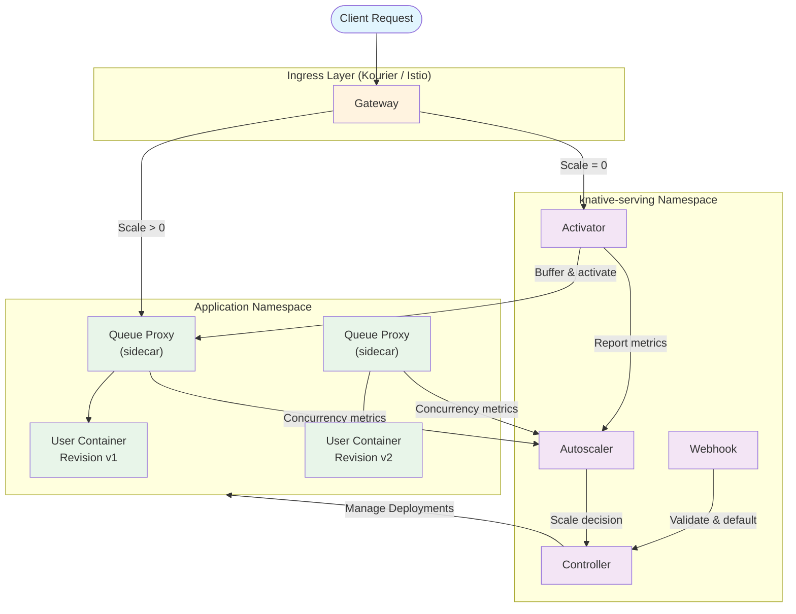
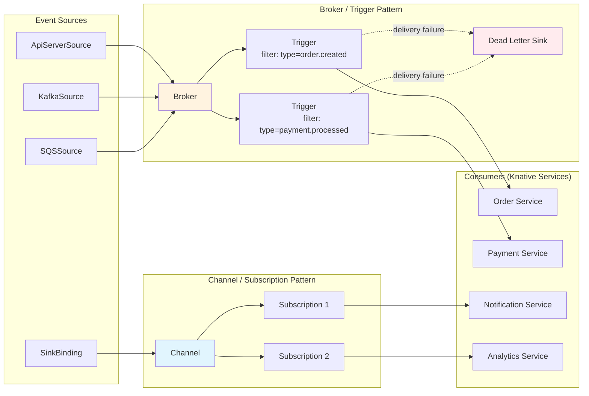
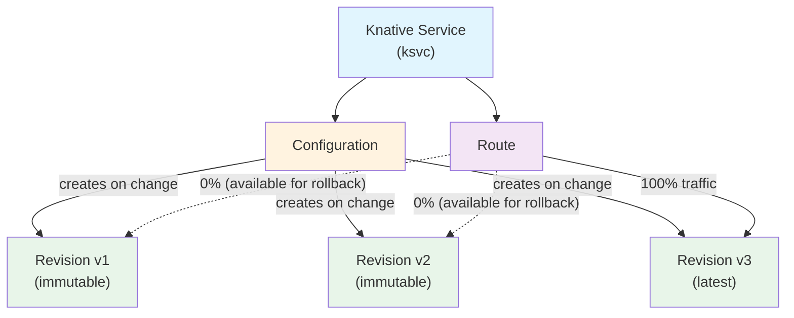
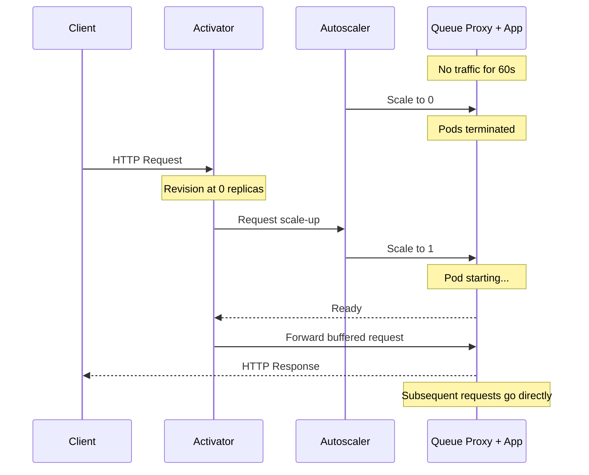
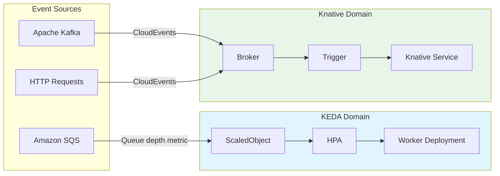

# Knative

> **Versiones compatibles**: Knative v1.16+, Kourier v1.16+
> **Última actualización**: June 2025

## Table of Contents

- [Overview and Learning Objectives](#overview-and-learning-objectives)
- [Knative Architecture](#knative-architecture)
- [EKS Installation and Configuration](#eks-installation-and-configuration)
- [Knative Serving Deep Dive](#knative-serving-deep-dive)
- [Knative Eventing Deep Dive](#knative-eventing-deep-dive)
- [KEDA vs Knative Comparison](#keda-vs-knative-comparison)
- [Production Operations](#production-operations)
- [Best Practices](#best-practices)
- [References](#references)

---

## Overview and Learning Objectives

### What Is Knative?

Knative es un proyecto **Graduado de CNCF** que extiende Kubernetes para proporcionar un conjunto de componentes de middleware para crear, desplegar y administrar workloads serverless modernos. En lugar de reemplazar las primitivas de Kubernetes, Knative se construye sobre ellas y ofrece abstracciones de mayor nivel que simplifican patrones comunes como el autoscaling impulsado por solicitudes, la entrega de eventos y la gestión de tráfico.

Knative consta de dos componentes que se pueden instalar de forma independiente:

- **Knative Serving** -- Administra el ciclo de vida de workloads serverless. Automatiza el deployment, el escalado (incluido scale-to-zero), el seguimiento de revisiones y el enrutamiento de tráfico.
- **Knative Eventing** -- Proporciona infraestructura para producir, enrutar y consumir eventos siguiendo la especificación CloudEvents. Desacopla los productores de eventos de los consumidores, lo que permite arquitecturas event-driven débilmente acopladas.

### Serverless on Kubernetes

Los Deployments tradicionales de Kubernetes requieren que los operadores configuren previamente los conteos de replicas, los umbrales de HPA y los presupuestos de recursos. Knative desplaza esta carga:

1. Los workloads escalan automáticamente de cero a muchas replicas según la concurrencia de solicitudes entrantes o RPS.
2. Las Revisions capturan snapshots inmutables de cada deployment, lo que permite rollbacks instantáneos y cambios graduales de tráfico.
3. Las fuentes de eventos y los triggers permiten arquitecturas reactivas sin polling ni código glue personalizado.

El resultado es una plataforma que conserva toda la potencia de Kubernetes (scheduling, RBAC, networking, storage) mientras proporciona una experiencia de desarrollo más cercana a la de una plataforma serverless completamente administrada.

### Knative Serving vs Eventing

| Aspecto | Knative Serving | Knative Eventing |
|--------|----------------|-----------------|
| Propósito principal | Ciclo de vida de workloads impulsado por solicitudes | Enrutamiento y entrega de eventos |
| Trigger de escalado | Concurrencia de solicitudes HTTP / RPS | Volumen de eventos (mediante Broker/Trigger) |
| Scale-to-zero | Sí (integrado) | Depende del consumidor (los consumidores respaldados por Serving pueden hacerlo) |
| Recursos principales | Service, Configuration, Revision, Route | Broker, Trigger, Channel, Subscription, Source |
| Caso de uso típico | APIs, aplicaciones web, microservices | Pipelines asíncronos, webhooks, streams CDC |

### Knative vs AWS Lambda and AWS Fargate

| Característica | Knative on EKS | AWS Lambda | AWS Fargate |
|---------|---------------|------------|-------------|
| Entorno de runtime | Cualquier contenedor OCI | Runtimes de Lambda o imágenes de contenedor | Cualquier contenedor OCI |
| Tiempo máximo de ejecución | Sin límite estricto | 15 minutos | Sin límite estricto |
| Scale-to-zero | Sí | Sí | No (tareas mínimas) |
| Control de cold start | Configurable (minScale, initialScale) | Limitado (SnapStart, provisioned concurrency) | N/A |
| Networking personalizado | Control completo de VPC / CNI | Requiere adjuntar VPC | Nativo de VPC |
| Soporte de GPU | Sí (mediante node selectors) | No | No |
| Fuentes de eventos | CloudEvents, Kafka, SQS, personalizadas | Fuentes de eventos nativas de AWS | N/A (basado en pull) |
| Vendor lock-in | Bajo (estándar CNCF, portable) | Alto (propietario de AWS) | Medio (API ECS/Fargate) |
| Nativo de Kubernetes | Sí | No | Parcialmente (EKS on Fargate) |
| Observability | Prometheus, OpenTelemetry, cualquier tooling de k8s | CloudWatch, X-Ray | CloudWatch, X-Ray |
| Modelo de costos | Recursos del cluster consumidos | Por invocación + duración | Por vCPU/memory-second |

### Learning Objectives

Al finalizar este documento, podrás:

1. Explicar la arquitectura de Knative y cómo Serving y Eventing se complementan.
2. Instalar y configurar Knative en Amazon EKS con Kourier, DNS y TLS.
3. Desplegar workloads serverless con autoscaling detallado basado en concurrencia.
4. Implementar estrategias de traffic splitting (canary, blue-green) usando Revisions y Routes.
5. Crear pipelines event-driven con Brokers, Triggers y CloudEvents.
6. Comparar KEDA y Knative y decidir cuándo usar cada uno (o ambos).
7. Operar Knative en producción con monitoreo, alta disponibilidad y políticas de garbage collection.

---

## Knative Architecture

### Serving Architecture

Knative Serving despliega cinco componentes clave dentro del namespace `knative-serving`. Juntos administran el ciclo de vida completo de un workload serverless, desde recibir una solicitud inicial hasta escalar la aplicación y enrutar el tráfico.



**Responsabilidades de los componentes:**

| Componente | Rol |
|-----------|------|
| **Activator** | Recibe solicitudes cuando una Revision está escalada a cero. Almacena solicitudes en buffer, activa el scale-up y luego proxya las solicitudes en buffer una vez que los pods están listos. También actúa como load balancer cuando el sistema está en modo "burst capacity". |
| **Autoscaler** | Recopila métricas de concurrencia y RPS desde los sidecars Queue Proxy. Calcula el número deseado de replicas usando el algoritmo Knative Pod Autoscaler (KPA) o delega en Kubernetes HPA. Comunica las decisiones de escalado al Controller. |
| **Queue Proxy** | Se inyecta como sidecar en cada pod de Knative. Aplica los límites de `containerConcurrency`, reporta concurrencia en tiempo real al Autoscaler, realiza health checks y gestiona el graceful shutdown durante el scale-down. |
| **Controller** | Reconcilia CRDs de Knative (Service, Configuration, Revision, Route) en recursos subyacentes de Kubernetes (Deployments, Services, objetos Ingress). Administra la creación de revisiones y el garbage collection. |
| **Webhook** | Valida y aplica valores predeterminados a las especificaciones de recursos de Knative durante la admisión. Garantiza que las configuraciones inválidas se rechacen antes de llegar al Controller. |

### Eventing Architecture

Knative Eventing proporciona una forma declarativa de vincular fuentes de eventos con consumidores. Soporta dos patrones de entrega: **Broker/Trigger** (enrutamiento basado en contenido) y **Channel/Subscription** (pub-sub directo).



**Conceptos principales de Eventing:**

| Concepto | Descripción |
|---------|-------------|
| **Event Source** | Un recurso que genera o importa eventos. Knative proporciona fuentes integradas (ApiServerSource, PingSource) y la comunidad mantiene fuentes para Kafka, AWS SQS, GitHub y más. |
| **Broker** | Una malla de eventos que recibe eventos y los distribuye a los Triggers coincidentes. Respaldado por un channel en memoria (predeterminado) o Kafka para durabilidad. |
| **Trigger** | Un filtro asociado a un Broker. Cada Trigger selecciona eventos por atributos de CloudEvent (type, source, extensions) y enruta coincidencias a un subscriber. |
| **Channel** | Un transporte de eventos duradero o en memoria. A diferencia de los Brokers, los Channels no filtran -- cada Subscription recibe cada evento. |
| **Subscription** | Conecta un Channel con un subscriber y, opcionalmente, un destino de respuesta. |
| **Dead Letter Sink** | Un destino de fallback para eventos que no se pueden entregar después de agotar las políticas de retry. |
| **CloudEvents** | El formato de envoltura estándar de CNCF (v1.0) usado por todos los componentes de Knative Eventing. Proporciona interoperabilidad entre fuentes y consumidores. |

---

## EKS Installation and Configuration

### Prerequisites

- Un cluster de EKS ejecutando Kubernetes 1.28 o posterior.
- `kubectl` configurado con acceso de administrador al cluster.
- (Opcional) `helm` v3.12+ para instalaciones basadas en Helm.

### Step 1: Install Knative Operator

El Knative Operator administra la instalación y el ciclo de vida de los componentes Knative Serving y Eventing. Usar el Operator simplifica las actualizaciones de versión y la gestión de configuración.

```bash
# Install the Knative Operator v1.16
kubectl apply -f https://github.com/knative/operator/releases/download/knative-v1.16.0/operator.yaml

# Verify the Operator is running
kubectl get deployment knative-operator -n default
```

### Step 2: Install Knative Serving via the Operator

Crea un recurso personalizado `KnativeServing` para desplegar los componentes de Serving:

```yaml
apiVersion: operator.knative.dev/v1beta1
kind: KnativeServing
metadata:
  name: knative-serving
  namespace: knative-serving
spec:
  version: "1.16.0"
  ingress:
    kourier:
      enabled: true
  config:
    network:
      ingress-class: kourier.ingress.networking.knative.dev
    autoscaler:
      # KPA is the default; set to "hpa" to use Kubernetes HPA
      class: kpa.autoscaling.knative.dev
      # Target 70% average concurrency per pod
      target-utilization-percentage: "70"
    defaults:
      # All new Revisions default to these values
      revision-timeout-seconds: "300"
      container-concurrency: "0"
    deployment:
      # Queue proxy resource requests
      queue-sidecar-cpu-request: "25m"
      queue-sidecar-memory-request: "50Mi"
```

```bash
# Create the namespace and apply
kubectl create namespace knative-serving
kubectl apply -f knative-serving.yaml

# Wait for all Serving pods to become ready
kubectl wait --for=condition=Ready pods --all -n knative-serving --timeout=300s
```

### Step 3: Install Kourier (Lightweight Ingress)

Kourier es el ingress ligero recomendado para Knative en EKS. Es más simple que Istio y tiene una huella de recursos menor.

Si instalaste Serving mediante el Operator con la sección `kourier` anterior, Kourier se instala automáticamente. Para instalación manual:

```bash
# Install Kourier
kubectl apply -f https://github.com/knative/net-kourier/releases/download/knative-v1.16.0/kourier.yaml

# Patch the config-network ConfigMap to use Kourier
kubectl patch configmap/config-network \
  --namespace knative-serving \
  --type merge \
  --patch '{"data":{"ingress-class":"kourier.ingress.networking.knative.dev"}}'

# Verify Kourier is running
kubectl get pods -n kourier-system
kubectl get svc kourier -n kourier-system
```

En EKS, el service de Kourier se expone como un `LoadBalancer`, lo que aprovisiona un AWS Network Load Balancer (NLB) de forma predeterminada. Para usar un Application Load Balancer (ALB) en su lugar, anota el service según corresponda:

```yaml
apiVersion: v1
kind: Service
metadata:
  name: kourier
  namespace: kourier-system
  annotations:
    service.beta.kubernetes.io/aws-load-balancer-type: "external"
    service.beta.kubernetes.io/aws-load-balancer-nlb-target-type: "ip"
    service.beta.kubernetes.io/aws-load-balancer-scheme: "internet-facing"
spec:
  type: LoadBalancer
```

### Step 4: DNS Configuration

Knative genera URLs para cada Service con el formato `<service>.<namespace>.<domain>`. Debes configurar DNS para que estas URLs resuelvan al Ingress gateway.

#### Option A: Magic DNS (sslip.io) -- Development Only

Magic DNS usa `sslip.io` para resolver automáticamente cualquier hostname a la dirección IP integrada. Esto es adecuado solo para desarrollo y pruebas.

```bash
# Configure Knative to use sslip.io
kubectl apply -f https://github.com/knative/serving/releases/download/knative-v1.16.0/serving-default-domain.yaml

# Verify: a service "my-app" in namespace "default" would get the URL:
# http://my-app.default.<EXTERNAL-IP>.sslip.io
```

#### Option B: Real DNS with Amazon Route 53 -- Production

Para producción, configura un dominio real con Route 53:

```bash
# 1. Get the Kourier external IP / hostname
KOURIER_LB=$(kubectl get svc kourier -n kourier-system \
  -o jsonpath='{.status.loadBalancer.ingress[0].hostname}')

# 2. Create a wildcard CNAME record in Route 53
#    *.knative.example.com -> $KOURIER_LB
aws route53 change-resource-record-sets \
  --hosted-zone-id Z0123456789ABCDEFGHIJ \
  --change-batch '{
    "Changes": [{
      "Action": "UPSERT",
      "ResourceRecordSet": {
        "Name": "*.knative.example.com",
        "Type": "CNAME",
        "TTL": 300,
        "ResourceRecords": [{"Value": "'$KOURIER_LB'"}]
      }
    }]
  }'

# 3. Configure Knative to use this domain
kubectl patch configmap/config-domain \
  --namespace knative-serving \
  --type merge \
  --patch '{"data":{"knative.example.com":""}}'
```

### Step 5: TLS with cert-manager

Integra cert-manager para aprovisionar y renovar automáticamente certificados TLS para Knative Services.

```bash
# Install the Knative cert-manager integration
kubectl apply -f https://github.com/knative/net-certmanager/releases/download/knative-v1.16.0/release.yaml
```

Configura Knative para solicitar certificados automáticamente:

```yaml
apiVersion: v1
kind: ConfigMap
metadata:
  name: config-network
  namespace: knative-serving
data:
  ingress-class: kourier.ingress.networking.knative.dev
  auto-tls: "Enabled"
  http-protocol: "Redirected"
---
apiVersion: v1
kind: ConfigMap
metadata:
  name: config-certmanager
  namespace: knative-serving
data:
  issuerRef: |
    kind: ClusterIssuer
    name: letsencrypt-prod
```

Crea el ClusterIssuer (asume que cert-manager ya está instalado):

```yaml
apiVersion: cert-manager.io/v1
kind: ClusterIssuer
metadata:
  name: letsencrypt-prod
spec:
  acme:
    server: https://acme-v02.api.letsencrypt.org/directory
    email: platform-team@example.com
    privateKeySecretRef:
      name: letsencrypt-prod-key
    solvers:
      - dns01:
          route53:
            region: us-west-2
            hostedZoneID: Z0123456789ABCDEFGHIJ
```

### Step 6: HPA vs KPA Autoscaler Selection

Knative soporta dos implementaciones de autoscaler. La elección afecta significativamente el comportamiento de escalado.

| Característica | KPA (Knative Pod Autoscaler) | HPA (Kubernetes HPA) |
|---------|------------------------------|----------------------|
| Scale-to-zero | Sí | No |
| Métricas | Concurrencia, RPS | CPU, Memory, Custom metrics |
| Velocidad de escalado | Rápida (ventanas panic/stable) | Intervalos HPA estándar |
| Configuración | Annotations de Knative | Spec HPA estándar |
| Ideal para | Workloads HTTP, sensibles a latencia | Workloads limitados por CPU/memory |

Configura la clase de autoscaler predeterminada en todo el cluster:

```yaml
# In config-autoscaler ConfigMap
apiVersion: v1
kind: ConfigMap
metadata:
  name: config-autoscaler
  namespace: knative-serving
data:
  # "kpa.autoscaling.knative.dev" or "hpa.autoscaling.knative.dev"
  class: "kpa.autoscaling.knative.dev"

  # KPA-specific settings
  stable-window: "60s"
  panic-window-percentage: "10"
  panic-threshold-percentage: "200"
  scale-to-zero-grace-period: "30s"
  scale-to-zero-pod-retention-period: "0s"

  # Target defaults
  target-burst-capacity: "200"
  requests-per-second-target-default: "200"
  container-concurrency-target-default: "100"
```

Sobrescribe por Revision usando annotations:

```yaml
metadata:
  annotations:
    autoscaling.knative.dev/class: "hpa.autoscaling.knative.dev"
    autoscaling.knative.dev/metric: "cpu"
    autoscaling.knative.dev/target: "70"
```

### Step 7: Install Knative Eventing

```yaml
apiVersion: operator.knative.dev/v1beta1
kind: KnativeEventing
metadata:
  name: knative-eventing
  namespace: knative-eventing
spec:
  version: "1.16.0"
  config:
    default-ch-webhook:
      default-ch-config: |
        clusterDefault:
          apiVersion: messaging.knative.dev/v1
          kind: InMemoryChannel
```

```bash
kubectl create namespace knative-eventing
kubectl apply -f knative-eventing.yaml
kubectl wait --for=condition=Ready pods --all -n knative-eventing --timeout=300s
```

---

## Knative Serving Deep Dive

### Resource Model

Knative Serving introduce cuatro recursos personalizados principales que trabajan juntos para administrar el ciclo de vida completo de un workload serverless.



| Recurso | Descripción |
|----------|-------------|
| **Service** (`ksvc`) | El recurso de nivel superior. Administra todo el ciclo de vida al poseer una Configuration y una Route. La mayoría de los usuarios interactúan solo con Services. |
| **Configuration** | Describe el estado deseado de un workload (imagen de contenedor, variables de entorno, límites de recursos). Cada actualización de una Configuration crea una nueva Revision. |
| **Revision** | Un snapshot inmutable y puntual de una Configuration. Las Revisions se nombran automáticamente (por ejemplo, `my-app-00001`). Las Revisions antiguas se retienen para traffic splitting y rollback. |
| **Route** | Asigna tráfico de red a una o más Revisions. Permite deployments canary, releases blue-green y traffic splitting basado en porcentajes. |

### Complete Knative Service YAML

El siguiente ejemplo despliega un Knative Service listo para producción con autoscaling explícito, límites de recursos, health checks y límites de escalado:

```yaml
apiVersion: serving.knative.dev/v1
kind: Service
metadata:
  name: order-api
  namespace: production
  labels:
    app.kubernetes.io/name: order-api
    app.kubernetes.io/part-of: ecommerce
    app.kubernetes.io/managed-by: knative
spec:
  template:
    metadata:
      annotations:
        # Autoscaling configuration
        autoscaling.knative.dev/class: "kpa.autoscaling.knative.dev"
        autoscaling.knative.dev/metric: "concurrency"
        autoscaling.knative.dev/target: "100"
        autoscaling.knative.dev/target-utilization-percentage: "70"
        autoscaling.knative.dev/min-scale: "2"
        autoscaling.knative.dev/max-scale: "50"
        autoscaling.knative.dev/initial-scale: "3"
        autoscaling.knative.dev/scale-down-delay: "15m"
        autoscaling.knative.dev/window: "60s"
    spec:
      containerConcurrency: 0
      timeoutSeconds: 300
      containers:
        - image: 123456789012.dkr.ecr.us-west-2.amazonaws.com/order-api:v1.2.3
          ports:
            - containerPort: 8080
              protocol: TCP
          env:
            - name: DB_HOST
              valueFrom:
                secretKeyRef:
                  name: db-credentials
                  key: host
            - name: LOG_LEVEL
              value: "info"
          resources:
            requests:
              cpu: "250m"
              memory: "512Mi"
            limits:
              cpu: "1000m"
              memory: "1Gi"
          readinessProbe:
            httpGet:
              path: /healthz
              port: 8080
            initialDelaySeconds: 5
            periodSeconds: 10
          livenessProbe:
            httpGet:
              path: /healthz
              port: 8080
            initialDelaySeconds: 15
            periodSeconds: 20
      serviceAccountName: order-api-sa
```

### Traffic Splitting: Canary Deployments

Traffic splitting te permite mover gradualmente tráfico entre Revisions. Esta es la base para estrategias de deployment canary y blue-green.

#### Canary Deployment

Enruta un pequeño porcentaje de tráfico a la nueva Revision y auméntalo con el tiempo:

```yaml
apiVersion: serving.knative.dev/v1
kind: Service
metadata:
  name: order-api
  namespace: production
spec:
  template:
    metadata:
      # The new Revision is created from this template
      annotations:
        autoscaling.knative.dev/min-scale: "2"
    spec:
      containers:
        - image: 123456789012.dkr.ecr.us-west-2.amazonaws.com/order-api:v1.3.0
          ports:
            - containerPort: 8080
  traffic:
    # 90% to the current stable Revision
    - revisionName: order-api-00005
      percent: 90
    # 10% canary to the latest Revision
    - latestRevision: true
      percent: 10
      tag: canary
```

Aumenta gradualmente el tráfico canary:

```bash
# Increase canary to 50%
kubectl patch ksvc order-api -n production --type merge --patch '
spec:
  traffic:
    - revisionName: order-api-00005
      percent: 50
    - latestRevision: true
      percent: 50
      tag: canary
'

# Promote canary to 100%
kubectl patch ksvc order-api -n production --type merge --patch '
spec:
  traffic:
    - latestRevision: true
      percent: 100
'
```

Cada objetivo de tráfico etiquetado obtiene su propia URL: `https://canary-order-api.production.knative.example.com`. Esto permite probar directamente la Revision canary.

#### Blue-Green Deployment

En una estrategia blue-green, ambas Revisions se ejecutan a plena capacidad y el tráfico se cambia de forma atómica:

```yaml
apiVersion: serving.knative.dev/v1
kind: Service
metadata:
  name: order-api
  namespace: production
spec:
  template:
    spec:
      containers:
        - image: 123456789012.dkr.ecr.us-west-2.amazonaws.com/order-api:v2.0.0
          ports:
            - containerPort: 8080
  traffic:
    # Blue (current) receives 100% of production traffic
    - revisionName: order-api-00005
      percent: 100
      tag: blue
    # Green (new) is deployed but receives 0% traffic; accessible via tag URL
    - latestRevision: true
      percent: 0
      tag: green
```

Después de validar el entorno green mediante `https://green-order-api.production.knative.example.com`, cambia el tráfico:

```bash
# Instant switch to green
kubectl patch ksvc order-api -n production --type merge --patch '
spec:
  traffic:
    - revisionName: order-api-00005
      percent: 0
      tag: blue
    - latestRevision: true
      percent: 100
      tag: green
'
```

### Scale-to-Zero Behavior

Scale-to-zero es una característica definitoria de Knative Serving. Cuando una Revision no recibe tráfico, sus pods se terminan después de un periodo de gracia configurable. Cuando llega una nueva solicitud, el Activator la almacena en buffer, activa un scale-up y proxya la solicitud una vez que un pod está listo.



Parámetros clave que controlan scale-to-zero:

| Annotation / Config | Predeterminado | Descripción |
|---------------------|---------|-------------|
| `scale-to-zero-grace-period` (global) | 30s | Tiempo que el sistema espera después de que el último pod de una Revision queda idle antes de eliminarlo. |
| `scale-to-zero-pod-retention-period` (global) | 0s | Tiempo mínimo que se mantiene un pod después de la última solicitud, incluso si ya está idle. |
| `autoscaling.knative.dev/scale-to-zero-pod-retention-period` (por Revision) | heredado | Sobrescritura por Revision del periodo de retención global. |
| `enable-scale-to-zero` (global) | true | Interruptor maestro. Establécelo en false para deshabilitar scale-to-zero en todo el cluster. |

### Concurrency-Based Scaling

El KPA de Knative escala según la concurrencia observada (solicitudes en curso) o solicitudes por segundo (RPS). El algoritmo mantiene dos ventanas:

- **Stable window** (predeterminado 60s): La concurrencia promedio durante este periodo impulsa la decisión de escalado en estado estable.
- **Panic window** (predeterminado 6s, es decir, 10% de stable): Si la concurrencia promedio en esta ventana supera el umbral de panic (predeterminado 200% del objetivo), el sistema escala hacia arriba agresivamente.

**Annotations clave:**

| Annotation | Ejemplo | Descripción |
|------------|---------|-------------|
| `autoscaling.knative.dev/metric` | `"concurrency"` o `"rps"` | Qué métrica usar para escalar. |
| `autoscaling.knative.dev/target` | `"100"` | Valor objetivo para la métrica (por ejemplo, 100 solicitudes concurrentes por pod). |
| `autoscaling.knative.dev/target-utilization-percentage` | `"70"` | El Autoscaler intenta mantener la utilización promedio en este porcentaje del objetivo. Objetivo efectivo = target * utilization / 100. |
| `spec.containerConcurrency` | `0` (ilimitado) | Límite estricto de solicitudes concurrentes por contenedor. El Queue Proxy lo aplica y encola las solicitudes excedentes. Establécelo en 0 para no tener límite. Un valor de 1 habilita procesamiento de un solo hilo. |

**Fórmula de escalado:**

```
desiredReplicas = ceil( observedConcurrency / (target * targetUtilization / 100) )
```

Por ejemplo, con `target=100`, `targetUtilization=70%` y 350 solicitudes concurrentes observadas:

```
desiredReplicas = ceil(350 / (100 * 0.70)) = ceil(350 / 70) = ceil(5.0) = 5
```

### Cold Start Optimization

Los cold starts -- la penalización de latencia al escalar desde cero -- son una preocupación común. Knative proporciona varios mecanismos para mitigarlos:

| Estrategia | Configuración | Compensación |
|----------|---------------|-----------|
| **minScale** | `autoscaling.knative.dev/min-scale: "2"` | Mantiene un número mínimo de pods en ejecución. Elimina los cold starts pero incurre en costo base. |
| **initialScale** | `autoscaling.knative.dev/initial-scale: "3"` | Número de pods creados cuando una nueva Revision se despliega por primera vez. No impide scale-to-zero después. |
| **scale-down-delay** | `autoscaling.knative.dev/scale-down-delay: "15m"` | Retrasa las decisiones de scale-down. Útil para workloads con ráfagas para evitar cold starts frecuentes. |
| **Container image caching** | Usa caching de imágenes a nivel de nodo de EKS o DaemonSets de pre-pull | Reduce el tiempo de pull del contenedor durante el cold start. |
| **Lightweight base images** | Usa imágenes basadas en distroless o Alpine | Reduce el tamaño de la imagen y el tiempo de pull. |
| **Application warmup** | Implementa readiness probes que esperen caches/conexiones | Garantiza que el pod reporte ready solo después de poder manejar tráfico a plena velocidad. |

```yaml
# Example: latency-sensitive service with cold start mitigation
apiVersion: serving.knative.dev/v1
kind: Service
metadata:
  name: latency-critical-api
  namespace: production
spec:
  template:
    metadata:
      annotations:
        autoscaling.knative.dev/min-scale: "3"
        autoscaling.knative.dev/initial-scale: "5"
        autoscaling.knative.dev/scale-down-delay: "10m"
        autoscaling.knative.dev/target: "50"
        autoscaling.knative.dev/window: "30s"
    spec:
      containerConcurrency: 100
      containers:
        - image: 123456789012.dkr.ecr.us-west-2.amazonaws.com/api:v1.0.0
          ports:
            - containerPort: 8080
          readinessProbe:
            httpGet:
              path: /ready
              port: 8080
            initialDelaySeconds: 3
            periodSeconds: 5
```

### Private and Public Services

De forma predeterminada, Knative Services se exponen externamente a través del ingress gateway. Puedes hacer que un Service sea solo interno del cluster:

```yaml
apiVersion: serving.knative.dev/v1
kind: Service
metadata:
  name: internal-processor
  namespace: production
  labels:
    networking.knative.dev/visibility: cluster-local
spec:
  template:
    spec:
      containers:
        - image: 123456789012.dkr.ecr.us-west-2.amazonaws.com/processor:v1.0.0
```

La label `cluster-local` hace que Knative genere una URL interna (por ejemplo, `http://internal-processor.production.svc.cluster.local`) en lugar de una públicamente enrutable. Esto es útil para microservices internos que no deben ser accesibles desde fuera del cluster.

También puedes establecer la visibilidad predeterminada en todo el cluster:

```yaml
# config-network ConfigMap
data:
  default-external-scheme: "https"
  visibility: "cluster-local"  # All services are private by default
```

---

## Knative Eventing Deep Dive

### Event Sources

Event Sources son recursos de Knative que conectan sistemas externos con la malla de eventing. Cada Source emite CloudEvents a un sink configurado (un Broker, Channel o directamente a un Knative Service).

#### ApiServerSource

Observa el Kubernetes API server en busca de eventos de recursos y los reenvía como CloudEvents:

```yaml
apiVersion: sources.knative.dev/v1
kind: ApiServerSource
metadata:
  name: pod-event-source
  namespace: production
spec:
  serviceAccountName: event-watcher-sa
  mode: Resource
  resources:
    - apiVersion: v1
      kind: Pod
    - apiVersion: apps/v1
      kind: Deployment
  sink:
    ref:
      apiVersion: eventing.knative.dev/v1
      kind: Broker
      name: default
```

#### SinkBinding

Inyecta variables de entorno (específicamente `K_SINK`) en cualquier workload de Kubernetes para que pueda enviar eventos a un sink sin codificar el destino en la aplicación:

```yaml
apiVersion: sources.knative.dev/v1
kind: SinkBinding
metadata:
  name: order-producer-binding
  namespace: production
spec:
  subject:
    apiVersion: apps/v1
    kind: Deployment
    name: order-producer
  sink:
    ref:
      apiVersion: eventing.knative.dev/v1
      kind: Broker
      name: default
  ceOverrides:
    extensions:
      source: order-system
```

Tu aplicación lee `K_SINK` y envía CloudEvents con POST a ese endpoint:

```python
import os, requests, json
from datetime import datetime

sink_url = os.environ["K_SINK"]

event = {
    "specversion": "1.0",
    "type": "com.example.order.created",
    "source": "/orders/api",
    "id": "order-12345",
    "time": datetime.utcnow().isoformat() + "Z",
    "datacontenttype": "application/json",
    "data": {"orderId": "12345", "amount": 99.99}
}

headers = {
    "Content-Type": "application/cloudevents+json",
    "ce-specversion": event["specversion"],
    "ce-type": event["type"],
    "ce-source": event["source"],
    "ce-id": event["id"],
}

requests.post(sink_url, json=event["data"], headers=headers)
```

#### KafkaSource

Consume mensajes de topics de Apache Kafka y los entrega como CloudEvents:

```yaml
apiVersion: sources.knative.dev/v1beta1
kind: KafkaSource
metadata:
  name: payment-events
  namespace: production
spec:
  consumerGroup: knative-payment-consumer
  bootstrapServers:
    - kafka-bootstrap.kafka.svc.cluster.local:9092
  topics:
    - payment-events
  sink:
    ref:
      apiVersion: eventing.knative.dev/v1
      kind: Broker
      name: default
  # Optional: configure SASL/TLS for MSK
  net:
    sasl:
      enable: true
      type:
        secretKeyRef:
          name: kafka-credentials
          key: sasl-type
      user:
        secretKeyRef:
          name: kafka-credentials
          key: username
      password:
        secretKeyRef:
          name: kafka-credentials
          key: password
    tls:
      enable: true
```

#### SQSSource (AWS)

Consume mensajes de colas de Amazon SQS. Esto requiere el controlador de fuentes de eventos de AWS:

```bash
# Install AWS event sources
kubectl apply -f https://github.com/triggermesh/aws-event-sources/releases/latest/download/aws-event-sources.yaml
```

```yaml
apiVersion: sources.triggermesh.io/v1alpha1
kind: AWSSQSSource
metadata:
  name: order-queue-source
  namespace: production
spec:
  arn: arn:aws:sqs:us-west-2:123456789012:order-events
  receiveOptions:
    visibilityTimeout: 60s
  auth:
    credentials:
      accessKeyID:
        valueFromSecret:
          name: aws-credentials
          key: access-key-id
      secretAccessKey:
        valueFromSecret:
          name: aws-credentials
          key: secret-access-key
  sink:
    ref:
      apiVersion: eventing.knative.dev/v1
      kind: Broker
      name: default
```

Para producción en EKS, prefiere IAM Roles for Service Accounts (IRSA) en lugar de credenciales estáticas.

### Broker/Trigger Pattern

El patrón Broker/Trigger proporciona enrutamiento de eventos basado en contenido. Un Broker actúa como event hub; los Triggers filtran eventos por atributos de CloudEvent y los enrutan a subscribers.

#### Complete Broker/Trigger Example

```yaml
# 1. Create the Broker
apiVersion: eventing.knative.dev/v1
kind: Broker
metadata:
  name: default
  namespace: production
  annotations:
    eventing.knative.dev/broker.class: MTChannelBasedBroker
spec:
  config:
    apiVersion: v1
    kind: ConfigMap
    name: config-br-default-channel
    namespace: knative-eventing
  delivery:
    retry: 5
    backoffPolicy: exponential
    backoffDelay: "PT2S"
    deadLetterSink:
      ref:
        apiVersion: serving.knative.dev/v1
        kind: Service
        name: dead-letter-handler
---
# 2. Trigger for order.created events -> Order Service
apiVersion: eventing.knative.dev/v1
kind: Trigger
metadata:
  name: order-created-trigger
  namespace: production
spec:
  broker: default
  filter:
    attributes:
      type: com.example.order.created
      source: /orders/api
  subscriber:
    ref:
      apiVersion: serving.knative.dev/v1
      kind: Service
      name: order-processor
---
# 3. Trigger for payment.processed events -> Payment Service
apiVersion: eventing.knative.dev/v1
kind: Trigger
metadata:
  name: payment-processed-trigger
  namespace: production
spec:
  broker: default
  filter:
    attributes:
      type: com.example.payment.processed
  subscriber:
    ref:
      apiVersion: serving.knative.dev/v1
      kind: Service
      name: payment-reconciler
  delivery:
    retry: 10
    backoffPolicy: exponential
    backoffDelay: "PT5S"
    deadLetterSink:
      ref:
        apiVersion: serving.knative.dev/v1
        kind: Service
        name: payment-dead-letter
---
# 4. Trigger for all events -> Analytics (no filter = catch-all)
apiVersion: eventing.knative.dev/v1
kind: Trigger
metadata:
  name: analytics-trigger
  namespace: production
spec:
  broker: default
  subscriber:
    ref:
      apiVersion: serving.knative.dev/v1
      kind: Service
      name: analytics-collector
```

### CloudEvents Standard

Todos los componentes de Knative Eventing se comunican usando la especificación [CloudEvents](https://cloudevents.io/) (v1.0). CloudEvents define una envoltura común con atributos requeridos y opcionales:

| Atributo | Requerido | Ejemplo | Descripción |
|-----------|----------|---------|-------------|
| `specversion` | Sí | `"1.0"` | Versión de la especificación CloudEvents. |
| `type` | Sí | `"com.example.order.created"` | Tipo de evento. Usado para enrutamiento por Triggers. |
| `source` | Sí | `"/orders/api"` | Origen del evento. Se combina con type para filtrado. |
| `id` | Sí | `"evt-abc123"` | Identificador único del evento para deduplicación. |
| `time` | No | `"2025-06-15T10:30:00Z"` | Timestamp de la ocurrencia del evento. |
| `datacontenttype` | No | `"application/json"` | Tipo de contenido del atributo `data`. |
| `subject` | No | `"order-12345"` | Sujeto del evento en el contexto de la fuente. |
| `data` | No | `{"orderId": "12345"}` | Payload del evento. |

### Channel/Subscription Pattern

El patrón Channel/Subscription proporciona pub-sub directo sin filtrado basado en contenido. Cada Subscription en un Channel recibe cada evento.

```yaml
# 1. Create a Channel backed by Kafka for durability
apiVersion: messaging.knative.dev/v1beta1
kind: KafkaChannel
metadata:
  name: audit-events
  namespace: production
spec:
  numPartitions: 6
  replicationFactor: 3
  retentionDuration: PT168H  # 7 days
---
# 2. Subscription: forward to audit logging service
apiVersion: messaging.knative.dev/v1
kind: Subscription
metadata:
  name: audit-log-subscription
  namespace: production
spec:
  channel:
    apiVersion: messaging.knative.dev/v1beta1
    kind: KafkaChannel
    name: audit-events
  subscriber:
    ref:
      apiVersion: serving.knative.dev/v1
      kind: Service
      name: audit-logger
  reply:
    ref:
      apiVersion: serving.knative.dev/v1
      kind: Service
      name: audit-response-handler
---
# 3. Subscription: forward to compliance service
apiVersion: messaging.knative.dev/v1
kind: Subscription
metadata:
  name: compliance-subscription
  namespace: production
spec:
  channel:
    apiVersion: messaging.knative.dev/v1beta1
    kind: KafkaChannel
    name: audit-events
  subscriber:
    ref:
      apiVersion: serving.knative.dev/v1
      kind: Service
      name: compliance-checker
  delivery:
    deadLetterSink:
      ref:
        apiVersion: serving.knative.dev/v1
        kind: Service
        name: dead-letter-handler
    retry: 3
    backoffPolicy: linear
    backoffDelay: "PT10S"
```

### Dead Letter Sink

Cuando la entrega de eventos falla después de agotar todos los retries, el evento se reenvía a un Dead Letter Sink (DLS). El DLS suele ser un Knative Service que persiste los eventos fallidos para análisis o replay posterior.

```yaml
apiVersion: serving.knative.dev/v1
kind: Service
metadata:
  name: dead-letter-handler
  namespace: production
spec:
  template:
    metadata:
      annotations:
        autoscaling.knative.dev/min-scale: "1"
    spec:
      containers:
        - image: 123456789012.dkr.ecr.us-west-2.amazonaws.com/dead-letter:v1.0.0
          env:
            - name: S3_BUCKET
              value: "failed-events-production"
            - name: AWS_REGION
              value: "us-west-2"
```

Configura DLS a nivel de Broker (se aplica a todos los Triggers) o a nivel individual de Trigger/Subscription para control detallado.

### Event Filtering

Los Triggers soportan filtrado por atributos y extensiones de CloudEvent.

#### Attribute Filtering

```yaml
spec:
  filter:
    attributes:
      type: com.example.order.created
      source: /orders/api
```

Este Trigger se activa solo cuando tanto `type` COMO `source` coinciden (AND lógico).

#### Extension Filtering

Puedes filtrar por extensiones personalizadas de CloudEvent establecidas por los productores:

```yaml
spec:
  filter:
    attributes:
      type: com.example.order.created
      myextension: priority-high
```

#### Multiple Triggers for OR Logic

Dado que el filtro de un solo Trigger es solo AND, usa múltiples Triggers en el mismo subscriber para lógica OR:

```yaml
# Trigger 1: react to order.created
apiVersion: eventing.knative.dev/v1
kind: Trigger
metadata:
  name: order-created
spec:
  broker: default
  filter:
    attributes:
      type: com.example.order.created
  subscriber:
    ref:
      apiVersion: serving.knative.dev/v1
      kind: Service
      name: notification-service
---
# Trigger 2: also react to order.cancelled
apiVersion: eventing.knative.dev/v1
kind: Trigger
metadata:
  name: order-cancelled
spec:
  broker: default
  filter:
    attributes:
      type: com.example.order.cancelled
  subscriber:
    ref:
      apiVersion: serving.knative.dev/v1
      kind: Service
      name: notification-service
```

---

## KEDA vs Knative Comparison

Tanto KEDA como Knative permiten escalado event-driven en Kubernetes, pero operan en distintos niveles de abstracción y cumplen roles complementarios.

### Scaling Model Differences

| Aspecto | KEDA | Knative |
|--------|------|---------|
| **Nivel de abstracción** | Extiende HPA con fuentes de métricas personalizadas | Plataforma serverless completa (deployment, routing, scaling) |
| **Mecanismo de escalado** | Crea/administra recursos HPA | Controller KPA personalizado o delegación a HPA |
| **Métrica principal** | Métricas externas (profundidad de cola, filas DB, personalizadas) | Concurrencia HTTP / RPS |
| **Tipo de workload** | Cualquier Deployment, StatefulSet, Job | Knative Service (administra su propio Deployment) |
| **CRDs** | ScaledObject, ScaledJob, TriggerAuthentication | Service, Configuration, Revision, Route |
| **Routing integrado** | No | Sí (traffic splitting, revisions, canary) |
| **Eventing integrado** | No (se centra solo en escalado) | Sí (Broker/Trigger, Channel/Subscription) |

### Scale-to-Zero Behavior Differences

| Comportamiento | KEDA | Knative (KPA) |
|----------|------|---------------|
| Trigger de scale-to-zero | El valor de la métrica cae a 0 o por debajo del umbral | Sin solicitudes HTTP durante un periodo de gracia configurable |
| Mecanismo de activación | KEDA Operator establece replicas de 0 a `minReplicaCount` cuando métrica > 0 | Activator almacena solicitudes HTTP en buffer y activa scale-up |
| Buffering de solicitudes | No (no es consciente de HTTP) | Sí (Activator almacena en buffer durante cold start) |
| Periodo de cool-down | `cooldownPeriod` en ScaledObject | `scale-to-zero-grace-period` + `stable-window` |
| Scale-to-zero para Jobs | Sí (ScaledJob) | No (Serving solo maneja procesos de larga duración) |

### Roles in Event-Driven Architecture



### When to Use KEDA vs Knative

| Caso de uso | Recomendado | Razón |
|----------|-------------|--------|
| Escalar workers según profundidad de cola SQS | **KEDA** | KEDA tiene un scaler SQS nativo; no se necesita routing HTTP. |
| Desplegar APIs HTTP con auto-scaling y traffic splitting | **Knative** | Serving proporciona gestión de revisiones, traffic splitting y autoscaling consciente de HTTP. |
| Escalar según métricas de Prometheus | **KEDA** | El scaler de Prometheus de KEDA es maduro y bien probado. |
| Microservices event-driven con CloudEvents | **Knative** | Eventing proporciona Broker/Trigger, gestión de dead letter y soporte de CloudEvents. |
| Escalar CronJobs o workloads batch | **KEDA** | ScaledJob está diseñado para esto. Knative Serving es para procesos de larga duración. |
| Escalar según CPU/memory con scale-to-zero | **KEDA** | El KPA de Knative se centra en concurrencia/RPS, no en CPU/memory. |
| Plataforma serverless para desarrolladores | **Knative** | Abstracción de mayor nivel; los desarrolladores despliegan con `kn service create`. |

### Using KEDA and Knative Together

KEDA y Knative no son mutuamente excluyentes. Una arquitectura común usa:

- **Knative Serving** para services orientados a HTTP (APIs, aplicaciones web) con autoscaling basado en concurrencia.
- **KEDA** para workers en segundo plano (consumidores de colas, procesadores batch) con autoscaling basado en métricas externas.
- **Knative Eventing** para enrutar eventos entre services, incluidos workers escalados por KEDA mediante SinkBinding.

```yaml
# Knative Service: receives HTTP events from Broker
apiVersion: serving.knative.dev/v1
kind: Service
metadata:
  name: event-enricher
spec:
  template:
    spec:
      containers:
        - image: event-enricher:v1
---
# KEDA ScaledObject: scales a Deployment based on SQS queue depth
apiVersion: keda.sh/v1alpha1
kind: ScaledObject
metadata:
  name: sqs-worker-scaler
spec:
  scaleTargetRef:
    name: sqs-worker
  minReplicaCount: 0
  maxReplicaCount: 100
  triggers:
    - type: aws-sqs-queue
      metadata:
        queueURL: https://sqs.us-west-2.amazonaws.com/123456789012/enriched-events
        queueLength: "5"
        awsRegion: us-west-2
      authenticationRef:
        name: keda-aws-credentials
```

---

## Production Operations

### Resource Limits and QoS

En producción, establece siempre resource requests y limits tanto para el contenedor de tu aplicación como para el sidecar Queue Proxy. Esto garantiza que los pods obtengan una clase QoS `Guaranteed` o `Burstable`, evitando OOM kills y problemas de noisy-neighbor.

```yaml
# Global Queue Proxy resources (config-deployment ConfigMap)
apiVersion: v1
kind: ConfigMap
metadata:
  name: config-deployment
  namespace: knative-serving
data:
  queue-sidecar-cpu-request: "50m"
  queue-sidecar-cpu-limit: "500m"
  queue-sidecar-memory-request: "100Mi"
  queue-sidecar-memory-limit: "256Mi"
  # Enforce resource limits on all revisions
  queue-sidecar-token-audiences: ""
```

### Revision Garbage Collection

Con el tiempo, se acumulan Revisions antiguas. Configura garbage collection para limitar el número de Revisions retenidas:

```yaml
# config-gc ConfigMap
apiVersion: v1
kind: ConfigMap
metadata:
  name: config-gc
  namespace: knative-serving
data:
  # Minimum number of non-active Revisions to retain
  min-non-active-revisions: "2"
  # Maximum number of non-active Revisions to retain
  max-non-active-revisions: "10"
  # Duration to retain non-active Revisions (Go duration format)
  retain-since-create-time: "48h"
  retain-since-last-active-time: "24h"
  # Minimum staleness before a Revision is eligible for GC
  min-stale-revision-create-delay: "24h"
```

### High Availability Configuration

Para workloads de producción, configura los componentes de Knative Serving para alta disponibilidad:

```yaml
apiVersion: operator.knative.dev/v1beta1
kind: KnativeServing
metadata:
  name: knative-serving
  namespace: knative-serving
spec:
  version: "1.16.0"
  high-availability:
    replicas: 3
  ingress:
    kourier:
      enabled: true
  workloads:
    - name: activator
      replicas: 3
      resources:
        requests:
          cpu: "300m"
          memory: "256Mi"
        limits:
          cpu: "1000m"
          memory: "512Mi"
    - name: controller
      replicas: 2
    - name: webhook
      replicas: 2
```

Además, configura Pod Disruption Budgets para los componentes del sistema Knative:

```yaml
apiVersion: policy/v1
kind: PodDisruptionBudget
metadata:
  name: activator-pdb
  namespace: knative-serving
spec:
  minAvailable: 2
  selector:
    matchLabels:
      app: activator
---
apiVersion: policy/v1
kind: PodDisruptionBudget
metadata:
  name: controller-pdb
  namespace: knative-serving
spec:
  minAvailable: 1
  selector:
    matchLabels:
      app: controller
```

Distribuye los pods del sistema entre Availability Zones usando topology constraints:

```yaml
apiVersion: apps/v1
kind: Deployment
metadata:
  name: activator
  namespace: knative-serving
spec:
  template:
    spec:
      topologySpreadConstraints:
        - maxSkew: 1
          topologyKey: topology.kubernetes.io/zone
          whenUnsatisfiable: DoNotSchedule
          labelSelector:
            matchLabels:
              app: activator
```

### Monitoring with Prometheus

Knative Serving y Eventing exponen métricas de Prometheus. Configura un ServiceMonitor (para Prometheus Operator) o una scrape config para recopilarlas.

```yaml
# ServiceMonitor for Knative Serving components
apiVersion: monitoring.coreos.com/v1
kind: ServiceMonitor
metadata:
  name: knative-serving
  namespace: monitoring
  labels:
    release: prometheus
spec:
  namespaceSelector:
    matchNames:
      - knative-serving
  selector:
    matchLabels:
      app.kubernetes.io/part-of: knative
  endpoints:
    - port: metrics
      interval: 15s
      path: /metrics
---
# ServiceMonitor for application-level metrics (Queue Proxy)
apiVersion: monitoring.coreos.com/v1
kind: ServiceMonitor
metadata:
  name: knative-revisions
  namespace: monitoring
  labels:
    release: prometheus
spec:
  namespaceSelector:
    any: true
  selector:
    matchLabels:
      serving.knative.dev/service: ""
  endpoints:
    - port: http-usermetric
      interval: 10s
      path: /metrics
    - port: http-queueadm
      interval: 10s
      path: /metrics
```

**Métricas clave para monitorear:**

| Métrica | Componente | Descripción |
|--------|-----------|-------------|
| `revision_app_request_count` | Queue Proxy | Conteo total de solicitudes por Revision. |
| `revision_app_request_latencies` | Queue Proxy | Histograma de latencia de solicitudes. |
| `revision_request_concurrency` | Queue Proxy | Conteo actual de solicitudes en curso por pod. |
| `activator_request_count` | Activator | Solicitudes gestionadas por el Activator (indica cold starts). |
| `autoscaler_desired_pods` | Autoscaler | Conteo deseado de replicas por Revision. |
| `autoscaler_actual_pods` | Autoscaler | Conteo actual real de replicas. |
| `autoscaler_panic_mode` | Autoscaler | Si el Autoscaler está en modo panic (1 = sí). |
| `controller_reconcile_count` | Controller | Conteo de reconciliación por tipo de recurso y resultado. |
| `broker_event_count` | Eventing | Eventos procesados por cada Broker. |
| `trigger_filter_event_count` | Eventing | Eventos que pasaron/fallaron el filtro del Trigger. |

### Grafana Dashboard

Importa o crea un dashboard de Grafana que visualice las métricas de Knative anteriores. A continuación se muestra un modelo JSON para un dashboard básico de resumen de Knative:

```json
{
  "dashboard": {
    "title": "Knative Overview",
    "panels": [
      {
        "title": "Request Rate by Revision",
        "type": "graph",
        "targets": [
          {
            "expr": "sum(rate(revision_app_request_count[5m])) by (revision_name)",
            "legendFormat": "{{revision_name}}"
          }
        ]
      },
      {
        "title": "Request Latency P99",
        "type": "graph",
        "targets": [
          {
            "expr": "histogram_quantile(0.99, sum(rate(revision_app_request_latencies_bucket[5m])) by (le, revision_name))",
            "legendFormat": "{{revision_name}}"
          }
        ]
      },
      {
        "title": "Concurrency per Pod",
        "type": "graph",
        "targets": [
          {
            "expr": "avg(revision_request_concurrency) by (revision_name)",
            "legendFormat": "{{revision_name}}"
          }
        ]
      },
      {
        "title": "Desired vs Actual Pods",
        "type": "graph",
        "targets": [
          {
            "expr": "autoscaler_desired_pods",
            "legendFormat": "desired - {{revision_name}}"
          },
          {
            "expr": "autoscaler_actual_pods",
            "legendFormat": "actual - {{revision_name}}"
          }
        ]
      },
      {
        "title": "Activator Requests (Cold Starts)",
        "type": "graph",
        "targets": [
          {
            "expr": "sum(rate(activator_request_count[5m])) by (revision_name)",
            "legendFormat": "{{revision_name}}"
          }
        ]
      },
      {
        "title": "Autoscaler Panic Mode",
        "type": "stat",
        "targets": [
          {
            "expr": "autoscaler_panic_mode",
            "legendFormat": "{{revision_name}}"
          }
        ]
      }
    ]
  }
}
```

### Troubleshooting

#### Cold Start Latency Is Too High

**Síntomas:** La primera solicitud después de un periodo idle tarda varios segundos.

**Diagnóstico:**

```bash
# Check if the Revision is scaled to zero
kubectl get ksvc order-api -n production -o jsonpath='{.status.conditions}' | jq .

# Check Activator logs for buffering duration
kubectl logs -l app=activator -n knative-serving --tail=50

# Check pod startup time
kubectl get pods -l serving.knative.dev/service=order-api -n production \
  -o jsonpath='{range .items[*]}{.metadata.name}{"\t"}{.status.conditions}{"\n"}{end}'
```

**Soluciones:**
1. Establece `autoscaling.knative.dev/min-scale: "1"` para mantener al menos un pod warm.
2. Reduce el tamaño de la imagen del contenedor.
3. Usa readiness probes con intervalos cortos.
4. Pre-pull de imágenes usando un DaemonSet.

#### Scaling Is Too Slow or Oscillating

**Síntomas:** El conteo de pods no sigue la carga, o escala hacia arriba y abajo repetidamente.

**Diagnóstico:**

```bash
# Check Autoscaler metrics
kubectl logs -l app=autoscaler -n knative-serving --tail=100

# View current scale decisions
kubectl get podautoscaler -n production
kubectl describe podautoscaler order-api-00001 -n production
```

**Soluciones:**
1. Reduce `stable-window` para reacciones más rápidas (por ejemplo, `30s`).
2. Aumenta `target-utilization-percentage` para permitir más headroom antes de escalar hacia arriba.
3. Ajusta `panic-window-percentage` y `panic-threshold-percentage` para manejar ráfagas.
4. Si usas la clase HPA, aumenta `--horizontal-pod-autoscaler-sync-period`.

#### Events Not Being Delivered

**Síntomas:** Se producen eventos, pero los Triggers no se activan.

**Diagnóstico:**

```bash
# Verify Broker is ready
kubectl get broker default -n production -o yaml

# Check Trigger status
kubectl get triggers -n production
kubectl describe trigger order-created-trigger -n production

# Inspect Eventing controller logs
kubectl logs -l app=eventing-controller -n knative-eventing --tail=100

# Check dead letter sink for failed events
kubectl logs -l serving.knative.dev/service=dead-letter-handler -n production --tail=50
```

**Soluciones:**
1. Verifica que los atributos del filtro del Trigger coincidan exactamente con los atributos de CloudEvent (sensible a mayúsculas/minúsculas).
2. Comprueba que el subscriber Service esté ready y sea alcanzable.
3. Asegúrate de que el backing channel del Broker esté saludable.
4. Confirma que RBAC permita al ServiceAccount de la fuente de eventos enviar eventos al Broker.

#### DNS Resolution Failures

**Síntomas:** Las URLs de Knative Service devuelven `NXDOMAIN` o tiempos de espera de conexión.

**Diagnóstico:**

```bash
# Verify Kourier service has an external address
kubectl get svc kourier -n kourier-system

# Check config-domain
kubectl get cm config-domain -n knative-serving -o yaml

# Test DNS resolution
nslookup order-api.production.knative.example.com

# Check the Knative Service URL
kubectl get ksvc order-api -n production -o jsonpath='{.status.url}'
```

**Soluciones:**
1. Para sslip.io: asegúrate de que la IP externa sea alcanzable y que el puerto 80/443 no esté bloqueado por security groups.
2. Para Route 53: verifica que el registro CNAME wildcard resuelva al load balancer de Kourier.
3. Comprueba que `config-domain` tenga la entrada de dominio correcta.

---

## Best Practices

### Service Design Patterns

1. **Un contenedor por Knative Service.** Knative Services están diseñados para un único contenedor de aplicación más el sidecar Queue Proxy. Evita pods multi-container salvo que sea absolutamente necesario (Knative sí los soporta, pero el modelo de escalado asume un único contenedor principal).

2. **Usa `containerConcurrency` deliberadamente.** Establécelo en `0` (ilimitado) para aplicaciones thread-safe que manejan muchas solicitudes concurrentes. Establécelo en `1` para procesadores single-threaded (por ejemplo, inferencia ML en una sola GPU) donde las solicitudes concurrentes degradarían el rendimiento.

3. **Separa rutas de lectura y escritura.** Despliega APIs con mucha lectura y procesadores con mucha escritura como Knative Services separados con perfiles de escalado diferentes. Los services de lectura pueden tener un `target` alto (100+ de concurrencia), mientras que los services de escritura pueden necesitar un `target` bajo (10-20) para evitar saturar la base de datos.

4. **Etiqueta Revisions para rollback.** Etiqueta siempre la última Revision conocida como buena para poder hacer rollback instantáneamente:

```bash
kn service update order-api --tag order-api-00005=stable --tag @latest=canary
```

5. **Usa services privados para comunicación interna.** Aplica `networking.knative.dev/visibility: cluster-local` a services que no deben exponerse a internet. Esto reduce la superficie de ataque y evita costos innecesarios de load balancer.

### Event-Driven Microservices Patterns

1. **Usa Brokers para enrutamiento multi-consumidor.** Cuando varios services necesitan reaccionar al mismo tipo de evento, usa un solo Broker con múltiples Triggers en lugar de duplicar la fuente de eventos.

2. **Configura siempre Dead Letter Sinks.** Los eventos no entregables nunca deben descartarse silenciosamente. Configura un DLS a nivel de Broker como red de seguridad y a niveles individuales de Trigger para rutas críticas.

3. **Adopta una convención de nombres de CloudEvents.** Usa notación reverse-DNS para tipos de eventos: `com.<company>.<domain>.<action>` (por ejemplo, `com.example.order.created`). Esto evita colisiones de nombres y hace claros los filtros de Trigger.

4. **Consumidores idempotentes.** Dado que los eventos pueden entregarse más de una vez (semántica at-least-once), diseña consumidores idempotentes. Usa el atributo `id` de CloudEvent para deduplicación.

5. **Usa Channels respaldados por Kafka para durabilidad.** El InMemoryChannel predeterminado pierde eventos al reiniciar el pod. Para producción, instala KafkaChannel y configúralo como predeterminado:

```yaml
# config-br-default-channel ConfigMap
data:
  channel-template-spec: |
    apiVersion: messaging.knative.dev/v1beta1
    kind: KafkaChannel
    spec:
      numPartitions: 6
      replicationFactor: 3
```

### Cost Optimization with Scale-to-Zero

1. **Habilita scale-to-zero para services no críticos.** Los services de desarrollo, staging y producción con bajo tráfico deberían escalar a cero cuando estén idle. Esto puede reducir costos de cómputo entre 60-80% para entornos con tráfico esporádico.

2. **Usa `scale-down-delay` para workloads con ráfagas.** Si el tráfico llega en ráfagas separadas por periodos idle cortos, establecer un retraso de scale-down (por ejemplo, 5-15 minutos) evita cold starts repetidos sin mantener pods ejecutándose indefinidamente.

3. **Combínalo con Karpenter para eficiencia a nivel de nodo.** Cuando Knative escala pods a cero, la capacidad liberada permite a Karpenter consolidar o terminar nodos subutilizados:

| Capa | Herramienta | Acción |
|-------|------|--------|
| Application (Pods) | Knative Serving | Escala pods a cero cuando están idle |
| Infrastructure (Nodes) | Karpenter | Consolida y termina nodos vacíos |
| Cost visibility | AWS Cost Explorer / Kubecost | Rastrea ahorros de scale-to-zero |

4. **Establece `minScale` solo donde sea necesario.** Reserva `minScale > 0` para rutas críticas en latencia. Para todo lo demás, deja que los pods escalen a cero.

### Knative with GPU Workloads

Knative puede servir workloads acelerados por GPU (por ejemplo, inferencia ML) programando pods en nodos GPU. Consideraciones clave:

```yaml
apiVersion: serving.knative.dev/v1
kind: Service
metadata:
  name: llm-inference
  namespace: ai
spec:
  template:
    metadata:
      annotations:
        autoscaling.knative.dev/class: "kpa.autoscaling.knative.dev"
        autoscaling.knative.dev/metric: "concurrency"
        autoscaling.knative.dev/target: "1"
        autoscaling.knative.dev/min-scale: "1"
        autoscaling.knative.dev/max-scale: "4"
    spec:
      # Single-request processing for GPU workloads
      containerConcurrency: 1
      timeoutSeconds: 600
      containers:
        - image: 123456789012.dkr.ecr.us-west-2.amazonaws.com/llm-server:v1
          ports:
            - containerPort: 8080
          resources:
            requests:
              cpu: "4"
              memory: "16Gi"
              nvidia.com/gpu: "1"
            limits:
              cpu: "8"
              memory: "32Gi"
              nvidia.com/gpu: "1"
      nodeSelector:
        node.kubernetes.io/instance-type: g5.xlarge
      tolerations:
        - key: nvidia.com/gpu
          operator: Exists
          effect: NoSchedule
```

**Consejos específicos para GPU:**
- Establece `containerConcurrency: 1` si el modelo no puede agrupar solicitudes concurrentes en batches. Auméntalo si el serving framework soporta batching dinámico (por ejemplo, vLLM, Triton Inference Server).
- Establece `min-scale: 1` o superior para evitar cold starts, ya que las imágenes de contenedor GPU son grandes y la carga del modelo es lenta.
- Usa Karpenter con GPU NodePools para aprovisionar dinámicamente nodos GPU a medida que Knative escala hacia arriba.
- Monitorea la utilización de GPU con DCGM Exporter y métricas de NVIDIA GPU Operator.

---

## References

### Official Documentation

- [Documentación oficial de Knative](https://knative.dev/docs/)
- [Organización GitHub de Knative](https://github.com/knative)
- [Referencia de API de Knative Serving](https://knative.dev/docs/reference/api/serving-api/)
- [Referencia de API de Knative Eventing](https://knative.dev/docs/reference/api/eventing-api/)
- [Repositorio GitHub de Kourier](https://github.com/knative-extensions/net-kourier)
- [Especificación CloudEvents](https://cloudevents.io/)
- [Página del proyecto Knative en CNCF](https://www.cncf.io/projects/knative/)

### AWS and EKS Resources

- [Blog de AWS: Serverless Containers with Knative and EKS](https://aws.amazon.com/blogs/containers/)
- [Guía de mejores prácticas de EKS](https://aws.github.io/aws-eks-best-practices/)
- [Guía para desarrolladores de Amazon Route 53](https://docs.aws.amazon.com/Route53/latest/DeveloperGuide/)
- [cert-manager en EKS](https://cert-manager.io/docs/installation/compatibility/)

### Related Internal Documentation

- [KEDA -- Kubernetes Event-driven Autoscaling](./01-keda.md)
- [Karpenter -- Cluster Autoscaler](./02-karpenter.md)
- [Optimización de costos de EKS](../eks/07-eks-cost-optimization.md)

---

**Anterior:** [Karpenter](./02-karpenter.md) | **Siguiente:** None
