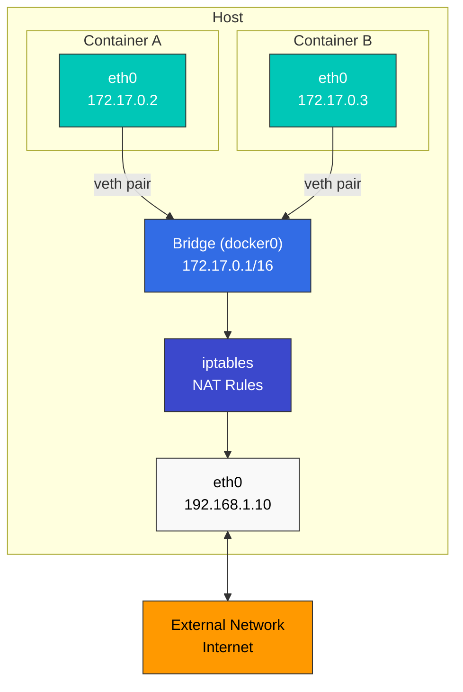

# Linux Basics

> **Versiones compatibles**: All major Linux distributions (Ubuntu 20.04+, CentOS/RHEL 8+, Debian 11+) **Última actualización**: February 11, 2026

Comprender los fundamentos de Linux es esencial para entender Kubernetes y la tecnología de container (contenedor). Este documento cubre los conceptos centrales de Linux que son especialmente importantes en entornos Kubernetes.

## Lab Environment Setup

Para seguir los ejemplos de este documento, necesitarás el siguiente entorno:

### Required Environment

* Sistema operativo Linux (se recomiendan Ubuntu 20.04+, CentOS/RHEL 8+, Debian 11+)
* Acceso a terminal
* Privilegios sudo

### Cloud Environment Setup (Optional)

Si usas una instancia AWS EC2:

```bash
# Start an Amazon Linux 2 instance
aws ec2 run-instances \
  --image-id ami-0c55b159cbfafe1f0 \
  --instance-type t3.micro \
  --key-name your-key-pair \
  --security-group-ids sg-12345678 \
  --subnet-id subnet-12345678

# SSH connection
ssh -i your-key.pem ec2-user@your-instance-public-ip
```

### Local Environment Setup (Optional)

Para practicar localmente, puedes usar una de las siguientes opciones:

* **VirtualBox + Vagrant**: Configura un entorno de máquina virtual
* **WSL2**: Usa un entorno Linux en Windows
* **Docker**: Practica en un entorno de container

## Table of Contents

* [Linux Kernel and User Space](01-linux-basics.md#linux-kernel-and-user-space)
* [Process Management](01-linux-basics.md#process-management)
* [Namespaces](01-linux-basics.md#namespaces)
* [cgroups (Control Groups)](01-linux-basics.md#cgroups-control-groups)
* [File System](01-linux-basics.md#file-system)
* [Networking Basics](01-linux-basics.md#networking-basics)
* [Security Context](01-linux-basics.md#security-context)
* [systemd and Service Management](01-linux-basics.md#systemd-and-service-management)
* [Kernel Parameters and Modules](01-linux-basics.md#kernel-parameters-and-modules)
* [System Resource Limits](01-linux-basics.md#system-resource-limits)
* [Log Management](01-linux-basics.md#log-management)
* [DNS and Network Configuration](01-linux-basics.md#dns-and-network-configuration)
* [Time Synchronization](01-linux-basics.md#time-synchronization)
* [Package Management](01-linux-basics.md#package-management)
* [Essential Linux Commands](01-linux-basics.md#essential-linux-commands)
* [Container-Related Linux Features](01-linux-basics.md#container-related-linux-features)

## Linux Kernel and User Space

### Role of the Kernel

> **Concepto clave**: El kernel de Linux es el núcleo del sistema operativo y actúa como intermediario entre el hardware y el software.

El kernel de Linux es el núcleo del sistema operativo y actúa como intermediario entre el hardware y el software. Sus funciones principales incluyen:

* **Gestión de procesos**: Creación, planificación y terminación de procesos
* **Gestión de memoria**: Asignación de memoria virtual y memoria física
* **Gestión de dispositivos**: Comunicación con dispositivos de hardware
* **Interfaz de llamadas al sistema**: Proporciona una forma para que los programas de user space accedan a los servicios del kernel

### User Space

User space es la región de memoria donde se ejecutan las aplicaciones normales. Los programas de user space acceden a los servicios del kernel mediante llamadas al sistema.

### System Call Examples

| System Call | Description           | Related Commands    |
| ----------- | --------------------- | ------------------- |
| `fork()`    | Create new process    | `ps`, `top`         |
| `exec()`    | Execute program       | `bash`, `sh`        |
| `open()`    | Open file             | `cat`, `less`       |
| `read()`    | Read data from file   | `cat`, `grep`       |
| `write()`   | Write data to file    | `echo`, `tee`       |
| `socket()`  | Create network socket | `netstat`, `ss`     |
| `clone()`   | Create namespace      | `unshare`, `docker` |

### Linux Kernel Architecture

## Process Management

### Processes and Threads

* **Proceso**: Una instancia de un programa en ejecución con su propio espacio de memoria independiente
* **Thread**: Una unidad de trabajo que se ejecuta dentro de un proceso; los threads del mismo proceso comparten el espacio de memoria

### Process States

* **Running**: Actualmente ejecutándose en la CPU
* **Waiting**: Esperando la finalización de E/S o la ocurrencia de un evento
* **Ready**: Listo para ejecutarse, pero esperando asignación de CPU
* **Zombie**: Terminado, pero el proceso padre aún no ha comprobado su estado
* **Stopped**: Estado suspendido

### Key Process Management Commands

```bash
# View process list
ps aux

# Real-time process monitoring
top

# Enhanced real-time process monitoring
htop

# Terminate process
kill <PID>
killall <process-name>

# Background execution
command &

# Job management
jobs
fg %<job-number>
bg %<job-number>
```

## Namespaces

Los namespaces son una característica del kernel de Linux que aísla grupos de procesos para que cada grupo pueda ver los recursos del sistema de forma independiente. Este es un elemento central de la tecnología de container.

### Main Namespace Types

* **PID Namespace**: Aislamiento de ID de proceso; permite que los containers tengan su propio PID 1 (init)
* **Network Namespace**: Aislamiento de la pila de red (interfaces, direcciones IP, tablas de enrutamiento, firewalls, etc.), base de la red de containers
* **Mount Namespace**: Aislamiento de puntos de montaje del file system; proporciona un file system independiente por container
* **UTS Namespace**: Aislamiento de hostname y nombre de dominio; da a cada container un identificador de host único
* **IPC Namespace**: Aislamiento de recursos de comunicación entre procesos (memoria compartida, semáforos, colas de mensajes, etc.), importante para el aislamiento de services en una arquitectura de microservices
* **User Namespace**: Aislamiento de ID de usuario y grupo; admite la ejecución rootless de containers para mayor seguridad
* **cgroup Namespace**: Aislamiento del directorio raíz de cgroup; proporciona visibilidad de límites de recursos dentro de containers
* **Time Namespace**: Aislamiento del reloj del sistema; permite configuraciones de tiempo independientes por container (Linux 5.6+)

### Namespace-Related Commands

```bash
# Check process namespaces
ls -la /proc/<PID>/ns/

# Execute command in new namespace
unshare --net --pid --fork --mount-proc bash

# Enter existing process's namespace
nsenter --target <PID> --net --pid bash

# Create and manage network namespaces
ip netns add <name>
ip netns exec <name> <command>

# Using user namespace for rootless container execution
unshare --user --map-root-user --mount --net bash

# Using time namespace (Linux 5.6+)
unshare --time bash
```

## cgroups (Control Groups)

cgroups es una característica del kernel de Linux que limita y aísla el uso de recursos de grupos de procesos. Se usa para implementar límites de recursos de containers. Es una tecnología central para la gestión de recursos en entornos cloud-native y Kubernetes.

### Main cgroups Features

* **CPU Time Limiting**: Limita el tiempo de CPU disponible para grupos de procesos y asigna núcleos de CPU
* **Memory Limiting**: Limita la memoria disponible para grupos de procesos y controla el comportamiento OOM (Out of Memory)
* **Block I/O Limiting**: Limitación del ancho de banda de E/S de disco y configuración de prioridades
* **Network Bandwidth Limiting**: Limitación del tráfico de red (combinada con tc)
* **Device Access Control**: Control de acceso y gestión de permisos para dispositivos específicos
* **PIDs Control**: Limita la cantidad de creación de procesos para prevenir fork bombs
* **Freezer**: Pausa y reanuda grupos de procesos (se usa para pausar containers)
* **cpuset**: Vincula procesos a núcleos de CPU y nodos NUMA específicos

### cgroups v1 and v2

* **cgroups v1**: Jerarquía separada para cada tipo de recurso; aún se usa en sistemas heredados
* **cgroups v2**: Jerarquía única unificada para una gestión más consistente; predeterminada en distribuciones modernas
* **Hybrid Mode**: Usa v1 y v2 juntos para mantener la compatibilidad mientras aprovecha nuevas funciones

### cgroups-Related Commands

```bash
# Check cgroups
ls -la /sys/fs/cgroup/                     # cgroups v2
ls -la /sys/fs/cgroup/cpu /sys/fs/cgroup/memory  # cgroups v1

# cgroups management through systemd (modern approach)
systemctl set-property <service-name> CPUQuota=20%
systemctl set-property <service-name> MemoryLimit=1G
systemctl set-property <service-name> IOWeight=500

# Check process cgroup
cat /proc/<PID>/cgroup

# Direct cgroups v2 manipulation (advanced)
echo $$ > /sys/fs/cgroup/user.slice/cgroup.procs
echo "max 100000" > /sys/fs/cgroup/user.slice/memory.max
echo "100000 500000" > /sys/fs/cgroup/user.slice/memory.high

# Container runtime and cgroups
podman stats  # Monitor container resource usage
docker run --cpus=0.5 --memory=512m nginx  # Set resource limits
```

## File System

### File System Hierarchy

Linux tiene una estructura jerárquica de file system que comienza desde un único directorio raíz (`/`).

Directorios clave:

* `/bin`: Comandos básicos
* `/sbin`: Comandos de administración del sistema
* `/etc`: Archivos de configuración del sistema
* `/home`: Directorios home de usuarios
* `/var`: Datos variables (logs, caché, etc.)
* `/tmp`: Archivos temporales
* `/usr`: Programas y datos de usuario
* `/proc`: Información de procesos y del kernel (file system virtual)
* `/sys`: Información del sistema y del hardware (file system virtual)

### File System Types

* **ext4**: File system predeterminado de Linux
* **XFS**: Adecuado para file systems grandes
* **Btrfs**: Proporciona funciones avanzadas como snapshots y compresión
* **OverlayFS**: Representa varios directorios como un único directorio (se usa comúnmente en containers)
* **tmpfs**: File system temporal basado en memoria

### Mount and Volumes

```bash
# Mount file system
mount -t <filesystem-type> <source> <mount-point>

# Check mounted file systems
mount
df -h

# Unmount file system
umount <mount-point>
```

## Networking Basics

### Network Interfaces

* **lo**: Interfaz loopback (127.0.0.1)
* **eth0, ens3, etc.**: Interfaces de red físicas
* **docker0, cni0, etc.**: Interfaces bridge virtuales (red de containers)

### Network Configuration Commands

```bash
# Check network interfaces
ip addr show
ifconfig

# Check routing table
ip route
route -n

# Check network connections
netstat -tuln
ss -tuln

# Network packet analysis
tcpdump -i <interface>
```

### Network Namespaces and Virtual Interfaces

```bash
# Create network namespace
ip netns add <namespace-name>

# Create virtual ethernet pair
ip link add <veth1> type veth peer name <veth2>

# Connect virtual interface to namespace
ip link set <veth2> netns <namespace-name>
```

## Security Context

### Users and Groups

* **UID (User ID)**: Identificador de usuario
* **GID (Group ID)**: Identificador de grupo
* **root (UID 0)**: Usuario especial con privilegios administrativos

### File Permissions

Los permisos de archivos de Linux consisten en permisos de lectura (r), escritura (w) y ejecución (x) para propietario, grupo y otros usuarios.

### Permission-Related Commands

```bash
# Change file permissions
chmod 755 <filename>  # rwxr-xr-x
chmod u+x <filename>  # Add execute permission for owner

# Change file owner
chown <user>:<group> <filename>

# Special permissions
chmod 4755 <filename>  # Set setuid
chmod 2755 <filename>  # Set setgid
chmod 1755 <filename>  # Set sticky bit
```

### SELinux and AppArmor

* **SELinux (Security-Enhanced Linux)**: Sistema de control de acceso obligatorio desarrollado por la NSA
* **AppArmor**: Sistema de control de acceso que usa perfiles de seguridad por programa

```bash
# Check SELinux status
getenforce

# Change SELinux mode
setenforce 0  # Permissive mode
setenforce 1  # Enforcing mode

# Check AppArmor status
aa-status

# AppArmor profile management
aa-enforce /etc/apparmor.d/<profile>
aa-complain /etc/apparmor.d/<profile>
```

## systemd and Service Management

systemd es el sistema init y gestor de services para sistemas Linux modernos. Se usa para gestionar services centrales como kubelet y containerd en nodos Kubernetes.

### Main systemd Features

* **Service Management**: Iniciar, detener, reiniciar y habilitar/deshabilitar services del sistema
* **Dependency Management**: Gestión automática de dependencias de services e inicio paralelo
* **Logging**: Gestión integrada de logs mediante journald
* **Timers**: Unidades de temporizador que pueden reemplazar a cron
* **Resource Management**: Límites de recursos por service mediante cgroups

### systemd Unit Types

* **service**: Services del sistema (por ejemplo, kubelet.service, containerd.service)
* **socket**: Activación basada en sockets
* **target**: Grupos de unidades (similar a runlevels)
* **timer**: Tareas programadas
* **mount**: Montajes de file system
* **device**: Unidades de dispositivo

### systemd Commands

```bash
# Check service status
systemctl status kubelet
systemctl status containerd

# Service control
systemctl start <service>
systemctl stop <service>
systemctl restart <service>
systemctl reload <service>  # Reload configuration

# Set auto-start at boot
systemctl enable <service>
systemctl disable <service>

# Check service logs
journalctl -u kubelet -f  # Real-time logs
journalctl -u kubelet --since "1 hour ago"
journalctl -u kubelet --no-pager

# List all services
systemctl list-units --type=service
systemctl list-unit-files --type=service

# Check failed services
systemctl --failed

# Reload systemd configuration
systemctl daemon-reload
```

### Writing systemd Unit Files

Ejemplo de archivo de unidad systemd para services relacionados con Kubernetes:

```ini
# /etc/systemd/system/kubelet.service
[Unit]
Description=kubelet: The Kubernetes Node Agent
Documentation=https://kubernetes.io/docs/
Wants=network-online.target
After=network-online.target

[Service]
ExecStart=/usr/bin/kubelet
Restart=always
StartLimitInterval=0
RestartSec=10

[Install]
WantedBy=multi-user.target
```

### systemd Resource Limits

```bash
# CPU limit (20%)
systemctl set-property kubelet CPUQuota=20%

# Memory limit (1GB)
systemctl set-property kubelet MemoryLimit=1G

# I/O weight setting (100-1000, default 100)
systemctl set-property kubelet IOWeight=500

# Check settings
systemctl show kubelet | grep -E 'CPUQuota|MemoryLimit|IOWeight'
```

## Kernel Parameters and Modules

### Kernel Parameter Settings via sysctl

sysctl es una herramienta para consultar y modificar parámetros del kernel en ejecución. Es esencial para ajustar parámetros de red y sistema al configurar clusters Kubernetes.

#### Key sysctl Settings Required for Kubernetes

```bash
# Enable IP forwarding (required for container networking)
sysctl -w net.ipv4.ip_forward=1
sysctl -w net.ipv6.conf.all.forwarding=1

# Enable bridge traffic to pass through iptables (required for CNI plugins)
sysctl -w net.bridge.bridge-nf-call-iptables=1
sysctl -w net.bridge.bridge-nf-call-ip6tables=1

# Increase maximum file descriptor count
sysctl -w fs.file-max=2097152

# Network performance tuning
sysctl -w net.core.somaxconn=32768
sysctl -w net.ipv4.tcp_max_syn_backlog=8192
sysctl -w net.core.netdev_max_backlog=16384

# ARP cache settings (for large clusters)
sysctl -w net.ipv4.neigh.default.gc_thresh1=80000
sysctl -w net.ipv4.neigh.default.gc_thresh2=90000
sysctl -w net.ipv4.neigh.default.gc_thresh3=100000

# Check current settings
sysctl net.ipv4.ip_forward
sysctl -a | grep bridge-nf-call

# Persistent settings (/etc/sysctl.conf or /etc/sysctl.d/*.conf)
cat <<EOF | sudo tee /etc/sysctl.d/99-kubernetes.conf
net.ipv4.ip_forward = 1
net.bridge.bridge-nf-call-iptables = 1
net.bridge.bridge-nf-call-ip6tables = 1
EOF

# Apply settings
sysctl --system
```

### Kernel Module Management

Muchos plugins CNI y storage drivers requieren módulos específicos del kernel.

```bash
# Load modules
modprobe overlay  # OverlayFS (container storage)
modprobe br_netfilter  # Bridge networking
modprobe ip_vs  # IPVS load balancing (kube-proxy IPVS mode)
modprobe ip_vs_rr  # Round Robin algorithm
modprobe ip_vs_wrr  # Weighted Round Robin
modprobe ip_vs_sh  # Source Hashing

# Check loaded modules
lsmod | grep overlay
lsmod | grep br_netfilter

# Check module information
modinfo overlay

# Set auto-load at boot
cat <<EOF | sudo tee /etc/modules-load.d/kubernetes.conf
overlay
br_netfilter
ip_vs
ip_vs_rr
ip_vs_wrr
ip_vs_sh
EOF

# Unload module
modprobe -r <module-name>
```

### Kernel Version and Feature Check

```bash
# Check kernel version
uname -r

# Check kernel compile options
cat /boot/config-$(uname -r) | grep OVERLAY
cat /boot/config-$(uname -r) | grep NETFILTER

# Check available kernel features
cat /proc/filesystems  # Supported file systems
cat /proc/sys/net/ipv4/ip_forward  # IP forwarding status
```

## System Resource Limits

### ulimit - Per-User Resource Limits

ulimit limita los recursos del sistema que los procesos pueden usar. Puede ser necesario ajustarlo en nodos Kubernetes para garantizar recursos suficientes.

```bash
# Check current limits
ulimit -a

# Key limit items
ulimit -n      # Number of open file descriptors
ulimit -u      # Maximum number of processes
ulimit -m      # Maximum memory size
ulimit -v      # Virtual memory size

# Change limits (current session)
ulimit -n 65536  # Increase file descriptors to 65536

# Persistent settings (/etc/security/limits.conf)
sudo tee -a /etc/security/limits.conf <<EOF
*               soft    nofile          65536
*               hard    nofile          65536
*               soft    nproc           32768
*               hard    nproc           32768
EOF

# Settings for specific users/groups
sudo tee -a /etc/security/limits.conf <<EOF
root            soft    nofile          65536
root            hard    nofile          65536
@docker         soft    nofile          65536
@docker         hard    nofile          65536
EOF
```

### PAM Limit Settings

```bash
# Check PAM settings
cat /etc/pam.d/common-session
cat /etc/pam.d/common-session-noninteractive

# Add to PAM settings to apply limits.conf
echo "session required pam_limits.so" | sudo tee -a /etc/pam.d/common-session
```

### Per-Process Resource Checking

```bash
# Check current resource limits for a process
cat /proc/<PID>/limits

# Check file descriptors for a specific process
ls -l /proc/<PID>/fd | wc -l
```

## Log Management

### journald - systemd Integrated Logging

journald es el sistema de logging de systemd que gestiona los logs de services del sistema en nodos Kubernetes.

```bash
# Full system logs
journalctl

# Specific service logs
journalctl -u kubelet
journalctl -u containerd
journalctl -u docker

# Real-time logs (similar to tail -f)
journalctl -u kubelet -f

# Time range specification
journalctl --since "2025-11-24 10:00:00"
journalctl --since "1 hour ago"
journalctl --since yesterday
journalctl --until "2025-11-24 12:00:00"

# Filter by priority
journalctl -p err        # Errors only
journalctl -p warning    # Warnings and above
journalctl -p debug      # All including debug

# Change output format
journalctl -u kubelet -o json        # JSON format
journalctl -u kubelet -o json-pretty # Pretty JSON
journalctl -u kubelet -o cat         # Messages only

# Boot logs
journalctl -b           # Current boot logs
journalctl -b -1        # Previous boot logs
journalctl --list-boots # Boot list

# Check disk usage
journalctl --disk-usage

# Clean logs
journalctl --vacuum-time=7d   # Delete logs older than 7 days
journalctl --vacuum-size=1G   # Delete logs over 1GB
```

### journald Configuration

```bash
# journald configuration file
sudo vi /etc/systemd/journald.conf

# Key configuration options
# Storage=persistent        # Persistent storage to disk
# SystemMaxUse=1G          # Maximum disk usage
# SystemKeepFree=500M      # Minimum free space
# MaxRetentionSec=1month   # Maximum retention period

# Apply configuration
sudo systemctl restart systemd-journald
```

### Traditional syslog

Algunos sistemas todavía usan syslog.

```bash
# syslog file locations
/var/log/syslog         # Debian/Ubuntu
/var/log/messages       # RHEL/CentOS

# Real-time log viewing
tail -f /var/log/syslog

# Log search
grep "kubelet" /var/log/syslog
grep -i "error" /var/log/syslog
```

### Log Rotation

Configura la rotación de logs para evitar que los archivos de log crezcan indefinidamente.

```bash
# logrotate configuration
sudo vi /etc/logrotate.d/kubernetes

# Example configuration
/var/log/kubernetes/*.log {
    daily
    rotate 7
    missingok
    notifempty
    compress
    delaycompress
    copytruncate
}

# Run rotation manually
sudo logrotate -f /etc/logrotate.d/kubernetes
```

## DNS and Network Configuration

### DNS Configuration

DNS es fundamental para el descubrimiento de services dentro de clusters Kubernetes.

```bash
# DNS configuration file
cat /etc/resolv.conf

# Example configuration
nameserver 8.8.8.8
nameserver 8.8.4.4
search cluster.local svc.cluster.local
options ndots:5

# DNS lookup test
nslookup kubernetes.default.svc.cluster.local
dig kubernetes.default.svc.cluster.local

# hosts file
cat /etc/hosts
```

### systemd-resolved

Las distribuciones Linux modernas usan systemd-resolved.

```bash
# Check systemd-resolved status
systemctl status systemd-resolved

# Check DNS servers
resolvectl status

# DNS cache statistics
resolvectl statistics

# Clear DNS cache
resolvectl flush-caches
```

### Network Configuration Files

```bash
# NetworkManager (RHEL/CentOS 8+, Ubuntu 18.04+)
nmcli connection show
nmcli device status

# netplan (Ubuntu 18.04+)
cat /etc/netplan/*.yaml

# Example netplan configuration
network:
  version: 2
  ethernets:
    eth0:
      dhcp4: true
      nameservers:
        addresses: [8.8.8.8, 8.8.4.4]

# Apply configuration
sudo netplan apply
```

## Time Synchronization

La sincronización de tiempo es muy importante en sistemas distribuidos. Todos los nodos de un cluster Kubernetes deben mantener una hora precisa.

### chronyd (Recommended)

chronyd es un cliente NTP moderno que sincroniza la hora más rápido que ntpd.

```bash
# Install chronyd (RHEL/CentOS)
sudo yum install chrony

# Install chronyd (Ubuntu/Debian)
sudo apt install chrony

# Check service status
systemctl status chronyd

# Check time synchronization status
chronyc tracking

# NTP server list
chronyc sources

# Detailed information
chronyc sourcestats

# Manual time synchronization
sudo chronyc makestep
```

### chronyd Configuration

```bash
# Configuration file
sudo vi /etc/chrony.conf

# Key settings
# NTP server configuration
server 0.pool.ntp.org iburst
server 1.pool.ntp.org iburst
server 2.pool.ntp.org iburst
server 3.pool.ntp.org iburst

# Fast synchronization
makestep 1.0 3

# Apply configuration
sudo systemctl restart chronyd
```

### timesyncd (Ubuntu Default)

Ubuntu usa systemd-timesyncd de forma predeterminada.

```bash
# Check status
timedatectl status

# NTP synchronization status
timedatectl show-timesync --all

# Configuration file
sudo vi /etc/systemd/timesyncd.conf

# Example configuration
[Time]
NTP=0.pool.ntp.org 1.pool.ntp.org
FallbackNTP=time.google.com

# Restart service
sudo systemctl restart systemd-timesyncd
```

### Timezone Settings

```bash
# Check current time and timezone
timedatectl

# List timezones
timedatectl list-timezones

# Change timezone
sudo timedatectl set-timezone Asia/Seoul

# Manually set time (when NTP is disabled)
sudo timedatectl set-time "2025-11-24 12:00:00"

# Enable/disable NTP
sudo timedatectl set-ntp true
```

## Package Management

Uso de gestores de paquetes para instalar y gestionar Kubernetes y herramientas relacionadas.

### apt (Debian/Ubuntu)

```bash
# Update package list
sudo apt update

# Upgrade packages
sudo apt upgrade

# Install package
sudo apt install <package-name>

# Remove package
sudo apt remove <package-name>
sudo apt purge <package-name>  # Remove configuration files as well

# Search packages
apt search <keyword>

# Package information
apt show <package-name>

# List installed packages
apt list --installed

# Add repository (Kubernetes example)
sudo apt install -y apt-transport-https ca-certificates curl
curl -fsSL https://pkgs.k8s.io/core:/stable:/v1.28/deb/Release.key | \
  sudo gpg --dearmor -o /etc/apt/keyrings/kubernetes-apt-keyring.gpg
echo 'deb [signed-by=/etc/apt/keyrings/kubernetes-apt-keyring.gpg] \
  https://pkgs.k8s.io/core:/stable:/v1.28/deb/ /' | \
  sudo tee /etc/apt/sources.list.d/kubernetes.list

# Clean unnecessary packages
sudo apt autoremove
sudo apt autoclean
```

### yum/dnf (RHEL/CentOS/Fedora)

```bash
# Install package
sudo yum install <package-name>
sudo dnf install <package-name>  # Fedora/RHEL 8+

# Update packages
sudo yum update
sudo dnf update

# Remove package
sudo yum remove <package-name>
sudo dnf remove <package-name>

# Search packages
yum search <keyword>
dnf search <keyword>

# Package information
yum info <package-name>
dnf info <package-name>

# List installed packages
yum list installed
dnf list installed

# Add repository (Kubernetes example)
cat <<EOF | sudo tee /etc/yum.repos.d/kubernetes.repo
[kubernetes]
name=Kubernetes
baseurl=https://pkgs.k8s.io/core:/stable:/v1.28/rpm/
enabled=1
gpgcheck=1
gpgkey=https://pkgs.k8s.io/core:/stable:/v1.28/rpm/repodata/repomd.xml.key
EOF

# Clean cache
sudo yum clean all
sudo dnf clean all
```

### Package Version Locking

Los componentes de Kubernetes tienen requisitos de compatibilidad de versiones, por lo que se deben evitar las actualizaciones automáticas.

```bash
# apt (Ubuntu/Debian)
sudo apt-mark hold kubelet kubeadm kubectl

# Remove apt hold
sudo apt-mark unhold kubelet kubeadm kubectl

# yum (RHEL/CentOS)
sudo yum install yum-plugin-versionlock
sudo yum versionlock add kubelet kubeadm kubectl

# Remove yum versionlock
sudo yum versionlock delete kubelet kubeadm kubectl
```

## Essential Linux Commands

### File and Directory Management

```bash
ls -la           # List files (including hidden)
cd <directory>   # Change directory
pwd              # Print current directory
mkdir -p <path>  # Create directory (create parent directories if needed)
rm -rf <path>    # Remove files/directories
cp -r <source> <destination> # Copy files/directories
mv <source> <destination>    # Move or rename files/directories
find <path> -name "<pattern>" # Search files
```

### Text Processing

```bash
cat <file>        # Output file contents
less <file>       # View file contents page by page
grep "<pattern>" <file> # Search pattern in file
sed 's/<pattern>/<replacement>/' <file> # Text substitution
awk '{print $1}' <file> # Text processing
```

### System Information

```bash
uname -a         # Kernel information
lsb_release -a   # Distribution information
free -h          # Memory usage
df -h            # Disk usage
du -sh <path>    # Directory size
```

### Process and Service Management

```bash
systemctl status <service> # Check service status
systemctl start/stop/restart <service> # Service control
journalctl -u <service> # View service logs
```

## Container-Related Linux Features

### OverlayFS

OverlayFS es un file system de montaje union que representa varios directorios como un único directorio. Lo usan container runtimes como Docker para implementar capas de imágenes.

### Network Bridge and NAT

La red de containers se implementa principalmente mediante interfaces bridge y NAT (Network Address Translation).



### System Call Filtering (seccomp)

seccomp (Secure Computing Mode) es una característica del kernel de Linux que restringe las llamadas al sistema disponibles para los procesos. Se usa para mejorar la seguridad de containers.

### Capabilities Restriction

Las capabilities de Linux dividen los privilegios tradicionales de root en unidades de permisos más pequeñas. Los containers reciben solo las capabilities necesarias para mejorar la seguridad.

Capabilities clave:

* `CAP_NET_ADMIN`: Cambios de configuración de red
* `CAP_SYS_ADMIN`: Tareas de administración del sistema
* `CAP_CHOWN`: Cambiar la propiedad de archivos
* `CAP_DAC_OVERRIDE`: Omitir permisos de archivos

## Conclusion

Los fundamentos y características de Linux son esenciales para entender Kubernetes y la tecnología de container. Aquí tienes un resumen de los temas clave tratados en este documento:

### Core Technologies

* **Namespaces and cgroups**: Base para el aislamiento de containers y la gestión de recursos
* **OverlayFS**: Núcleo de las capas de imágenes de containers
* **systemd**: Gestión de services de nodos Kubernetes

### Essential Operations Knowledge

* **Kernel Parameter Tuning**: Optimización de red y sistema mediante sysctl
* **Module Management**: Soporte de plugins CNI y storage drivers
* **Log Management**: Análisis de logs del sistema y de services mediante journald
* **Time Synchronization**: Mantenimiento de la consistencia en sistemas distribuidos

### Troubleshooting

* **Resource Limits**: Gestión de recursos mediante ulimit y cgroups
* **Networking**: Configuración de DNS, bridge e iptables
* **Package Management**: Gestión de versiones de componentes Kubernetes

Con esta base de Linux, puedes solucionar problemas de forma eficaz en entornos Kubernetes, optimizar clusters y operarlos de manera confiable.

## Quiz

Para comprobar lo que has aprendido en este capítulo, realiza el [Linux Basics Quiz](../quizzes/basics/01-linux-basics-quiz.md).

## References

* [The Linux Documentation Project](https://tldp.org/)
* [Linux Kernel Documentation](https://www.kernel.org/doc/)
* [Linux Namespaces](https://man7.org/linux/man-pages/man7/namespaces.7.html)
* [Control Groups v2](https://www.kernel.org/doc/html/latest/admin-guide/cgroup-v2.html)
