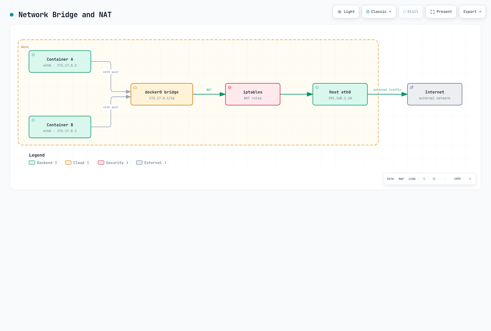

# Conceptos básicos de Linux

> **Versiones compatibles**: Ejemplos revisados: Ubuntu 24.04 LTS, Debian 13, Amazon Linux 2023; los nombres de paquetes/servicios varían según la distribución **Última actualización**: September 15, 2026

Comprender los fundamentos de Linux es esencial para entender Kubernetes y la tecnología de contenedores. Este documento cubre los conceptos principales de Linux que son especialmente importantes en entornos de Kubernetes.

Si el terminal y las redes son nuevos para ti, comienza en la lección 1 de [Linux Networking from the Beginning](../networking/beginner/README.md). Este documento también sirve posteriormente como referencia más profunda para los conceptos de contenedores y kernel.

## Configuración del entorno de laboratorio

Para seguir los ejemplos de este documento, necesitarás el siguiente entorno:

### Entorno necesario

* Sistema operativo Linux (se recomienda Ubuntu 24.04 LTS, Debian 13 o Amazon Linux 2023)
* Acceso a terminal
* Privilegios de sudo

### Configuración del entorno de nube (opcional)

Usa una VM de formación aislada. Para AWS, selecciona AL2023 con la arquitectura y Region correctas; la antigua AMI codificada de forma fija no es portable. AWS indica que el soporte estándar de AL2 finalizó el 30 de junio de 2026. Lo siguiente solo busca una AMI; organiza por separado la creación de la instancia y el acceso con alcance limitado, y después conéctate a la instancia existente.

```bash
# Read-only AMI discovery; select a kernel-specific parameter when reproducibility is required.
aws ssm get-parameter --region us-east-1 \
  --name /aws/service/ami-amazon-linux-latest/al2023-ami-kernel-default-x86_64 \
  --query Parameter.Value --output text

# SSH connection
ssh -i your-key.pem ec2-user@your-instance-public-ip
```

### Configuración del entorno local (opcional)

Para practicar localmente, puedes usar una de las siguientes opciones:

* **VirtualBox + Vagrant**: Configura un entorno de máquina virtual
* **WSL2**: Usa un entorno Linux en Windows
* **Docker**: Adecuado para ejercicios básicos de shell; los contenedores comunes no proporcionan un host systemd completo ni permiso para ejercicios de redes/kernel del host.

## Índice

* [Kernel de Linux y espacio de usuario](01-linux-basics.md#linux-kernel-and-user-space)
* [Gestión de procesos](01-linux-basics.md#process-management)
* [Namespaces](01-linux-basics.md#namespaces)
* [cgroups (Control Groups)](01-linux-basics.md#cgroups-control-groups)
* [Sistema de archivos](01-linux-basics.md#file-system)
* [Conceptos básicos de redes](01-linux-basics.md#networking-basics)
* [Contexto de seguridad](01-linux-basics.md#security-context)
* [systemd y gestión de servicios](01-linux-basics.md#systemd-and-service-management)
* [Parámetros y módulos del kernel](01-linux-basics.md#kernel-parameters-and-modules)
* [Límites de recursos del sistema](01-linux-basics.md#system-resource-limits)
* [Gestión de logs](01-linux-basics.md#log-management)
* [Configuración de DNS y red](01-linux-basics.md#dns-and-network-configuration)
* [Sincronización de hora](01-linux-basics.md#time-synchronization)
* [Gestión de paquetes](01-linux-basics.md#package-management)
* [Comandos esenciales de Linux](01-linux-basics.md#essential-linux-commands)
* [Características de Linux relacionadas con contenedores](01-linux-basics.md#container-related-linux-features)

## Kernel de Linux y espacio de usuario

### Rol del kernel

> **Concepto clave**: El kernel de Linux es el núcleo del sistema operativo y actúa como intermediario entre el hardware y el software.

El kernel de Linux es el núcleo del sistema operativo y actúa como intermediario entre el hardware y el software. Sus funciones principales incluyen:

* **Gestión de procesos**: Creación, planificación y terminación de procesos
* **Gestión de memoria**: Memoria virtual y asignación de memoria física
* **Gestión de dispositivos**: Comunicación con dispositivos de hardware
* **Interfaz de llamadas al sistema**: Proporciona una forma para que los programas del espacio de usuario accedan a los servicios del kernel

### Espacio de usuario

El espacio de usuario es la región de memoria donde se ejecutan las aplicaciones comunes. Los programas del espacio de usuario acceden a los servicios del kernel mediante llamadas al sistema.


[🔍 Ver diagrama interactivo](https://www.atomai.click/kubernetes-docs/archmaps/en-basics-01-linux-basics-0.html)

### Ejemplos de llamadas al sistema

| Llamada al sistema | Descripción                 | Comandos relacionados |
| ------------------ | --------------------------- | --------------------- |
| `fork()`           | Crear un proceso nuevo      | `ps`, `top`           |
| `exec()`           | Ejecutar un programa        | `bash`, `sh`          |
| `open()`           | Abrir un archivo            | `cat`, `less`         |
| `read()`           | Leer datos de un archivo    | `cat`, `grep`         |
| `write()`          | Escribir datos en un archivo | `echo`, `tee`       |
| `socket()`         | Crear un socket de red      | `netstat`, `ss`       |
| `clone()`          | Crear un namespace          | `unshare`, `docker`   |

### Arquitectura del kernel de Linux


[🔍 Ver diagrama interactivo](https://www.atomai.click/kubernetes-docs/archmaps/en-basics-01-linux-basics-1.html)

## Gestión de procesos

### Procesos e hilos

* **Proceso**: Una instancia de un programa en ejecución con su propio espacio de memoria independiente
* **Hilo**: Una unidad de trabajo que se ejecuta dentro de un proceso; los hilos del mismo proceso comparten espacio de memoria

### Estados de los procesos

* **En ejecución**: Se está ejecutando actualmente en la CPU
* **En espera**: Espera a la finalización de E/S o a que ocurra un evento
* **Listo**: Está listo para ejecutarse, pero espera la asignación de CPU
* **Zombi**: Ha terminado, pero el proceso padre no ha comprobado su estado
* **Detenido**: Estado suspendido

### Comandos principales de gestión de procesos

```bash
# View process list
ps aux

# Real-time process monitoring
top

# Enhanced real-time process monitoring
htop

# Terminate process
kill <PID>
killall <process-name>

# Background execution
command &

# Job management
jobs
fg %<job-number>
bg %<job-number>
```

## Namespaces

Los namespaces son una característica del kernel de Linux que aísla grupos de procesos para que cada grupo pueda ver los recursos del sistema de forma independiente. Son un elemento central de la tecnología de contenedores.

### Tipos principales de namespace

* **PID Namespace**: Aislamiento de ID de procesos; permite que los contenedores tengan su propio PID 1 (init)
* **Network Namespace**: Aislamiento de la pila de red (interfaces, direcciones IP, tablas de enrutamiento, firewalls, etc.); base de las redes de contenedores
* **Mount Namespace**: Aísla las tablas de montaje; el contenido del sistema de archivos y el aislamiento de la raíz del contenedor requieren configuraciones adecuadas de montajes/raíz
* **UTS Namespace**: Aislamiento del nombre de host y del nombre de dominio NIS (no de dominios DNS); proporciona a cada contenedor un identificador de host único
* **IPC Namespace**: Aislamiento de recursos de comunicación entre procesos (memoria compartida, semáforos, colas de mensajes, etc.); importante para el aislamiento de servicios en arquitectura de microservicios
* **User Namespace**: Aislamiento de ID de usuarios y grupos; admite la ejecución de contenedores rootless para mejorar la seguridad
* **cgroup Namespace**: Aislamiento del directorio raíz de cgroup; proporciona visibilidad de los límites de recursos dentro de los contenedores
* **Time Namespace**: Virtualiza los desplazamientos de CLOCK_MONOTONIC/CLOCK_BOOTTIME (Linux 5.6+), no el reloj de pared en tiempo real

### Comandos relacionados con namespaces

```bash
# Check process namespaces
ls -la /proc/<PID>/ns/

# Execute command in new namespace
sudo unshare --mount --net --pid --fork --mount-proc bash

# Enter existing process's namespace
sudo nsenter --target <PID> --net --pid bash

# Create and manage network namespaces
ip netns add <name>
ip netns exec <name> <command>

# Using user namespace for rootless container execution
unshare --user --map-root-user --mount --net bash

# Using time namespace (Linux 5.6+)
sudo unshare --time --fork bash
```

## cgroups (Control Groups)

cgroups es una característica del kernel de Linux que limita y aísla el uso de recursos de grupos de procesos. Se utiliza para implementar límites de recursos de los contenedores. Es una tecnología central para la gestión de recursos en entornos cloud-native y Kubernetes.

### Características principales de cgroups

* **Limitación de tiempo de CPU**: Limita el tiempo de CPU disponible para grupos de procesos y asigna núcleos de CPU
* **Limitación de memoria**: Limita la memoria disponible para grupos de procesos y controla el comportamiento de OOM (Out of Memory)
* **Limitación de E/S de bloques**: Limitación de ancho de banda de E/S de disco y configuración de prioridad
* **Control de tráfico de red**: Combina tc/eBPF con clasificación de cgroup; cgroup v2 no tiene un control independiente del ancho de banda de red
* **Control de acceso a dispositivos**: Control de acceso y gestión de permisos para dispositivos específicos
* **Control de PIDs**: Limita el número de creación de procesos para evitar fork bombs
* **Freezer**: Pausa y reanuda grupos de procesos (se utiliza para pausar contenedores)
* **cpuset**: Vincula procesos a núcleos de CPU y nodos NUMA específicos

### cgroups v1 y v2

* **cgroups v1**: Jerarquía independiente para cada tipo de recurso; aún se usa en sistemas heredados
* **cgroups v2**: Jerarquía única unificada para una gestión más coherente; predeterminada en distribuciones modernas
* **Modo híbrido**: Usa v1 y v2 juntos para mantener la compatibilidad mientras aprovecha nuevas características

### Comandos relacionados con cgroups

```bash
# Check cgroups
ls -la /sys/fs/cgroup/                     # cgroups v2
ls -la /sys/fs/cgroup/cpu /sys/fs/cgroup/memory  # cgroups v1

# cgroups management through systemd (modern approach)
sudo systemctl set-property --runtime <service-name> CPUQuota=20%
sudo systemctl set-property --runtime <service-name> MemoryMax=1G
sudo systemctl set-property --runtime <service-name> IOWeight=500

# Check process cgroup
cat /proc/<PID>/cgroup

# Run only the example command inside a transient cgroup managed by systemd.
sudo systemd-run --scope -p CPUQuota=20% -p MemoryHigh=768M -p MemoryMax=1G sleep 60
# memory.max/high take one byte count or "max"; cpu.max takes quota and period.
# Do not move your shell into systemd-owned user.slice or edit its control files.

# Container runtime and cgroups
podman stats  # Monitor container resource usage
docker run --cpus=0.5 --memory=512m nginx  # Set resource limits
```

## Sistema de archivos

### Jerarquía del sistema de archivos

Linux tiene una estructura jerárquica de sistema de archivos que comienza desde un único directorio raíz (`/`).

Directorios principales:

* `/bin`: Comandos básicos
* `/sbin`: Comandos de administración del sistema
* `/etc`: Archivos de configuración del sistema
* `/home`: Directorios personales de usuarios
* `/var`: Datos variables (logs, caché, etc.)
* `/tmp`: Archivos temporales
* `/usr`: Programas y datos de usuario
* `/proc`: Información de procesos y del kernel (sistema de archivos virtual)
* `/sys`: Información del sistema y hardware (sistema de archivos virtual)

### Tipos de sistemas de archivos

* **ext4**: Un sistema de archivos Linux común; los valores predeterminados varían según la distribución
* **XFS**: Adecuado para sistemas de archivos grandes
* **Btrfs**: Proporciona características avanzadas como snapshots y compresión
* **OverlayFS**: Representa varios directorios como un único directorio (se utiliza habitualmente en contenedores)
* **tmpfs**: Sistema de archivos temporal respaldado por memoria; las páginas pueden intercambiarse a swap salvo que se desactive para él

### Montajes y volúmenes

```bash
# Mount file system
mount -t <filesystem-type> <source> <mount-point>

# Check mounted file systems
mount
df -h

# Unmount file system
umount <mount-point>
```

## Conceptos básicos de redes

### Interfaces de red

* **lo**: Interfaz de loopback (127.0.0.1)
* **eth0, ens3, etc.**: Interfaces de red físicas
* **docker0, cni0, etc.**: Interfaces de bridge virtuales (redes de contenedores)

### Comandos de configuración de red

```bash
# Check network interfaces
ip addr show
ifconfig

# Check routing table
ip route
route -n

# Check network connections
netstat -tuln
ss -tuln

# Network packet analysis
tcpdump -i <interface>
```

### Namespaces de red e interfaces virtuales

```bash
# Create network namespace
ip netns add <namespace-name>

# Create virtual ethernet pair
ip link add <veth1> type veth peer name <veth2>

# Connect virtual interface to namespace
ip link set <veth2> netns <namespace-name>
```

## Contexto de seguridad

### Usuarios y grupos

* **UID (User ID)**: Identificador de usuario
* **GID (Group ID)**: Identificador de grupo
* **root (UID 0)**: Usuario especial con privilegios administrativos

### Permisos de archivos

Los permisos de archivos de Linux constan de permisos de lectura (r), escritura (w) y ejecución (x) para el propietario, el grupo y otros usuarios.


[🔍 Ver diagrama interactivo](https://www.atomai.click/kubernetes-docs/archmaps/en-basics-01-linux-basics-2.html)

### Comandos relacionados con permisos

```bash
# Change file permissions
chmod 755 <filename>  # rwxr-xr-x
chmod u+x <filename>  # Add execute permission for owner

# Change file owner
chown <user>:<group> <filename>

# Special permissions
chmod 4755 <filename>  # Set setuid
chmod 2755 <filename>  # Set setgid
chmod 1755 <filename>  # Set sticky bit
```

### SELinux y AppArmor

* **SELinux (Security-Enhanced Linux)**: Sistema de control de acceso obligatorio desarrollado por la NSA
* **AppArmor**: Sistema de control de acceso que utiliza perfiles de seguridad por programa

```bash
# Check SELinux status
getenforce

# Only in a reviewed isolated lab: permissive disables enforcement system-wide.
# sudo setenforce 0
# Restore the original mode after investigation; do not use permissive as a generic fix.

# Check AppArmor status
aa-status

# AppArmor profile management
aa-enforce /etc/apparmor.d/<profile>
aa-complain /etc/apparmor.d/<profile>
```

## systemd y gestión de servicios

systemd es el sistema init y gestor de servicios para sistemas Linux modernos. Se utiliza para gestionar servicios principales como kubelet y containerd en nodos de Kubernetes.

### Características principales de systemd

* **Gestión de servicios**: Iniciar, detener, reiniciar, habilitar/deshabilitar servicios del sistema
* **Gestión de dependencias**: Gestión automática de dependencias de servicios e inicio paralelo
* **Logging**: Gestión de logs integrada mediante journald
* **Timers**: Unidades de temporizador que pueden reemplazar cron
* **Gestión de recursos**: Límites de recursos por servicio mediante cgroups

### Tipos de unidades systemd

* **service**: Servicios del sistema (p. ej., kubelet.service, containerd.service)
* **socket**: Activación basada en socket
* **target**: Grupos de unidades (similares a runlevels)
* **timer**: Tareas programadas
* **mount**: Montajes de sistemas de archivos
* **device**: Unidades de dispositivos

### Comandos de systemd

```bash
# Check service status
systemctl status kubelet
systemctl status containerd

# Service control
systemctl start <service>
systemctl stop <service>
systemctl restart <service>
systemctl reload <service>  # Reload configuration

# Set auto-start at boot
systemctl enable <service>
systemctl disable <service>

# Check service logs
journalctl -u kubelet -f  # Real-time logs
journalctl -u kubelet --since "1 hour ago"
journalctl -u kubelet --no-pager

# List all services
systemctl list-units --type=service
systemctl list-unit-files --type=service

# Check failed services
systemctl --failed

# Reload systemd configuration
systemctl daemon-reload
```

### Escritura de archivos de unidad de systemd

Un pequeño servicio de formación ilustra la estructura de una unidad. Inspecciona kubelet con systemctl cat kubelet; conserva la unidad y los drop-ins administrados por la distribución/kubeadm en lugar de sustituirlos.

```ini
# /etc/systemd/system/linux-basics-demo.service
[Unit]
Description=Linux basics training service
Documentation=man:systemd.service(5)
Wants=network-online.target
After=network-online.target

[Service]
ExecStart=/usr/bin/sleep infinity
Restart=on-failure
RestartSec=10

[Install]
WantedBy=multi-user.target
```

### Límites de recursos de systemd

Los comandos siguientes suponen que la unidad de formación anterior se guardó y que daemon-reload se completó en la VM de laboratorio. No apliques estos límites didácticos a kubelet/containerd de producción.

```bash
# CPU limit (20%)
sudo systemctl set-property --runtime linux-basics-demo.service CPUQuota=20%

# Memory limit (1GB)
sudo systemctl set-property --runtime linux-basics-demo.service MemoryMax=1G

# I/O weight setting (1-10000, default 100)
sudo systemctl set-property --runtime linux-basics-demo.service IOWeight=500

# Check settings
systemctl show linux-basics-demo.service | grep -E 'CPUQuota|MemoryMax|IOWeight'
```

## Parámetros y módulos del kernel

### Configuración de parámetros del kernel mediante sysctl

sysctl es una herramienta para consultar y modificar parámetros del kernel en ejecución. Es esencial para el ajuste de parámetros de red y del sistema al configurar clusters de Kubernetes.

#### Configuración de sysctl específica de CNI y ejemplos de ajuste

No son valores predeterminados obligatorios para todos los nodos de Kubernetes. Comprueba la familia de IP elegida, los requisitos de CNI y del proxy de Service. La configuración de bridge-netfilter se aplica solo a configuraciones que usan br_netfilter. No apliques valores de rendimiento/ARP/conntrack a producción sin mediciones; registra los valores existentes y usa una VM de formación aislada.

```bash
# Enable IP forwarding (required for container networking)
sudo sysctl -w net.ipv4.ip_forward=1
sudo sysctl -w net.ipv6.conf.all.forwarding=1

# Enable bridge traffic to pass through iptables (only for CNI configurations requiring bridge netfilter)
sudo sysctl -w net.bridge.bridge-nf-call-iptables=1
sudo sysctl -w net.bridge.bridge-nf-call-ip6tables=1

# Increase maximum file descriptor count
sudo sysctl -w fs.file-max=2097152

# Network performance tuning
sudo sysctl -w net.core.somaxconn=32768
sudo sysctl -w net.ipv4.tcp_max_syn_backlog=8192
sudo sysctl -w net.core.netdev_max_backlog=16384

# ARP cache settings (for large clusters)
sudo sysctl -w net.ipv4.neigh.default.gc_thresh1=80000
sudo sysctl -w net.ipv4.neigh.default.gc_thresh2=90000
sudo sysctl -w net.ipv4.neigh.default.gc_thresh3=100000

# Check current settings
sysctl net.ipv4.ip_forward
sysctl -a | grep bridge-nf-call

# Persistent settings (/etc/sysctl.conf or /etc/sysctl.d/*.conf)
cat <<EOF | sudo tee /etc/sysctl.d/99-kubernetes.conf
net.ipv4.ip_forward = 1
net.bridge.bridge-nf-call-iptables = 1
net.bridge.bridge-nf-call-ip6tables = 1
EOF

# Apply settings
sudo sysctl --system
```

### Gestión de módulos del kernel

Los módulos dependen de la elección del runtime/CNI/almacenamiento. El modo IPVS está obsoleto desde Kubernetes 1.35; los comandos IPVS siguientes son solo para clusters IPVS existentes. No precargues todos los módulos enumerados en clusters nuevos.

```bash
# Load modules
sudo modprobe overlay  # OverlayFS (container storage)
sudo modprobe br_netfilter  # Bridge networking
sudo modprobe ip_vs  # IPVS load balancing (kube-proxy IPVS mode)
sudo modprobe ip_vs_rr  # Round Robin algorithm
sudo modprobe ip_vs_wrr  # Weighted Round Robin
sudo modprobe ip_vs_sh  # Source Hashing

# Check loaded modules
lsmod | grep overlay
lsmod | grep br_netfilter

# Check module information
modinfo overlay

# Set auto-load at boot
cat <<EOF | sudo tee /etc/modules-load.d/kubernetes.conf
overlay
# Add br_netfilter only if required by the chosen CNI.
EOF

# Unload module
sudo modprobe -r <module-name>
```

### Comprobación de versión y características del kernel

```bash
# Check kernel version
uname -r

# Check kernel compile options
cat /boot/config-$(uname -r) | grep OVERLAY
cat /boot/config-$(uname -r) | grep NETFILTER

# Check available kernel features
cat /proc/filesystems  # Supported file systems
cat /proc/sys/net/ipv4/ip_forward  # IP forwarding status
```

## Límites de recursos del sistema

### ulimit - Límites de recursos por usuario

ulimit limita los recursos del sistema que pueden usar los procesos. Pueden ser necesarios ajustes en los nodos de Kubernetes para garantizar recursos suficientes.

```bash
# Check current limits
ulimit -a

# Key limit items
ulimit -n      # Number of open file descriptors
ulimit -u      # Maximum number of processes
ulimit -m      # RSS limit; not enforced on modern Linux
ulimit -v      # Virtual memory size

# Change limits (current session)
ulimit -n 65536  # Increase file descriptors to 65536

# Persistent settings (/etc/security/limits.conf)
sudo tee -a /etc/security/limits.conf <<EOF
*               soft    nofile          65536
*               hard    nofile          65536
*               soft    nproc           32768
*               hard    nproc           32768
EOF

# Settings for specific users/groups
sudo tee -a /etc/security/limits.conf <<EOF
root            soft    nofile          65536
root            hard    nofile          65536
@docker         soft    nofile          65536
@docker         hard    nofile          65536
EOF
```

### Configuración de límites de PAM

limits.conf se aplica a las nuevas sesiones de inicio de sesión que usan pam_limits. Los servicios comunes del sistema systemd no lo heredan automáticamente; usa drop-ins de servicio como LimitNOFILE/TasksMax. Las sesiones/procesos existentes no cambian. Inspecciona la cadena PAM de la distribución en lugar de añadir a ciegas entradas common-session duplicadas.

```bash
# Inspect the active configuration; PAM file names differ by distribution.
grep -R pam_limits.so /etc/pam.d
systemctl show kubelet -p LimitNOFILE -p TasksMax
```

### Comprobación de recursos por proceso

```bash
# Check current resource limits for a process
cat /proc/<PID>/limits

# Check file descriptors for a specific process
find /proc/<PID>/fd -mindepth 1 -maxdepth 1 -printf '%f\n' | wc -l
```

## Gestión de logs

### journald - logging integrado de systemd

journald es el sistema de logging de systemd que gestiona los logs de servicios del sistema en nodos de Kubernetes.

```bash
# Full system logs
journalctl

# Specific service logs
journalctl -u kubelet
journalctl -u containerd
journalctl -u docker

# Real-time logs (similar to tail -f)
journalctl -u kubelet -f

# Time range specification
journalctl --since "2025-11-24 10:00:00"
journalctl --since "1 hour ago"
journalctl --since yesterday
journalctl --until "2025-11-24 12:00:00"

# Filter by priority
journalctl -p err        # Error and higher severity (0-3)
journalctl -p warning    # Warnings and above
journalctl -p debug      # All including debug

# Change output format
journalctl -u kubelet -o json        # JSON format
journalctl -u kubelet -o json-pretty # Pretty JSON
journalctl -u kubelet -o cat         # Messages only

# Boot logs
journalctl -b           # Current boot logs
journalctl -b -1        # Previous boot logs
journalctl --list-boots # Boot list

# Check disk usage
journalctl --disk-usage

# Clean logs
journalctl --vacuum-time=7d   # Remove archived journal files older than 7 days
journalctl --vacuum-size=1G   # Remove oldest archived journals toward 1GiB total
```

### Configuración de journald

```bash
# journald configuration file
sudo vi /etc/systemd/journald.conf

# Key configuration options
# Storage=persistent        # Persistent storage to disk
# SystemMaxUse=1G          # Maximum disk usage
# SystemKeepFree=500M      # Minimum free space
# MaxRetentionSec=1month   # Maximum retention period

# Apply configuration
sudo systemctl restart systemd-journald
```

### syslog tradicional

Algunos sistemas todavía usan syslog.

```bash
# syslog file locations
# /var/log/syslog         # Debian/Ubuntu
# /var/log/messages       # RHEL/CentOS

# Real-time log viewing
tail -f /var/log/syslog

# Log search
grep "kubelet" /var/log/syslog
grep -i "error" /var/log/syslog
```

### Rotación de logs

Usa logrotate para archivos de aplicaciones comunes. copytruncate tiene una condición de carrera de copia/truncado que puede perder registros; es preferible reabrir los logs cuando la aplicación lo admita. Kubelet gestiona por sí mismo la rotación de logs de contenedores CRI.

```bash
# logrotate configuration
sudo vi /etc/logrotate.d/linux-basics-demo

# File content (only application text logs not managed by kubelet):
```

```text
/var/log/linux-basics-demo/*.log {
    daily
    rotate 7
    missingok
    notifempty
    compress
    delaycompress
    copytruncate
}
```

```bash
# Run rotation manually
sudo logrotate -f /etc/logrotate.d/linux-basics-demo
```

## Configuración de DNS y red

### Configuración de DNS

NetworkManager/systemd-resolved puede controlar el resolv.conf del host, así que inspecciónalo primero. Los resolvers públicos como 8.8.8.8 no pueden resolver Services de cluster.local. Los Pods ClusterFirst usan el DNS del cluster configurado por kubelet; agregar sufijos de búsqueda del cluster a un resolver del host no proporciona conectividad DNS del cluster.

```bash
# On the Linux host
cat /etc/resolv.conf
cat /etc/hosts
# If a cluster is available, inspect its actual DNS Service address.
kubectl -n kube-system get service kube-dns
# Run inside an existing Pod with DNS utilities and ClusterFirst policy:
# nslookup kubernetes.default.svc.cluster.local
```

Lo siguiente ilustra un **formato de archivo resolver de Pod**. Sustituye la IP, el namespace y el dominio del cluster por valores reales; no lo copies en la configuración del host.

```text
nameserver <cluster-dns-service-ip>
search <namespace>.svc.cluster.local svc.cluster.local cluster.local
options ndots:5
```

### systemd-resolved

Las distribuciones Linux modernas usan systemd-resolved.

```bash
# Check systemd-resolved status
systemctl status systemd-resolved

# Check DNS servers
resolvectl status

# DNS cache statistics
resolvectl statistics

# Clear DNS cache
resolvectl flush-caches
```

### Archivos de configuración de red

Identifica si la distribución usa NetworkManager o netplan. El YAML de netplan es contenido de archivo bajo /etc/netplan, no comandos de shell. Prepara una ruta de recuperación antes de cambiar direccionamiento/enrutamiento remoto y valida con netplan try.

```bash
nmcli connection show
nmcli device status
# On a netplan-based installation:
ls /etc/netplan
```

```yaml
# Example netplan file: replace eth0 with the actual interface name.
network:
  version: 2
  ethernets:
    eth0:
      dhcp4: true
```

```bash
sudo netplan generate
sudo netplan try
```

## Sincronización de hora

La sincronización de hora es muy importante en sistemas distribuidos. Todos los nodos de un cluster de Kubernetes deben mantener una hora precisa.

### chronyd (recomendado)

chronyd es un cliente/servidor NTP adecuado para condiciones de red variables. El rendimiento de la sincronización depende del reloj, las fuentes y la configuración.

```bash
# Install chronyd (RHEL/CentOS)
sudo yum install chrony

# Install chronyd (Ubuntu/Debian)
sudo apt install chrony

# Check the installed unit: chronyd on RHEL/Amazon Linux, chrony on Debian/Ubuntu.
systemctl status chronyd

# Check time synchronization status
chronyc tracking

# NTP server list
chronyc sources

# Detailed information
chronyc sourcestats

# Manual time synchronization
# Only during a reviewed maintenance window; stepping can disrupt time-sensitive workloads.
# sudo chronyc makestep
```

### Configuración de chronyd

Los sistemas de la familia RHEL suelen usar /etc/chrony.conf; Debian/Ubuntu usan /etc/chrony/chrony.conf. Inspecciona la configuración de la distribución/proveedor (incluido Amazon Time Sync Service en EC2) antes de sustituirla por servidores públicos. Lo siguiente es contenido de archivo de configuración.

```text
# Choose an approved reachable time source.
server <approved-ntp-server> iburst
# Permit stepping only during the first three clock updates.
makestep 1.0 3
```

```bash
# Choose the unit actually installed on your distribution:
systemctl status chronyd.service  # RHEL/Amazon Linux
systemctl status chrony.service   # Debian/Ubuntu
chronyc tracking
chronyc sources
```

### timesyncd (opción específica de la distribución)

Ubuntu cambió su servicio de hora predeterminado a chrony en 25.10; las versiones/imágenes anteriores pueden usar systemd-timesyncd. Usa un servicio de hora activo. show-timesync es específico de timesyncd; inspecciona chrony con chronyc.

```bash
timedatectl status
# Only for installations using systemd-timesyncd:
timedatectl show-timesync --all
systemctl status systemd-timesyncd
```

```ini
# /etc/systemd/timesyncd.conf: use approved servers for this environment.
[Time]
NTP=<approved-ntp-server>
```

```bash
# After editing a timesyncd installation:
sudo systemctl restart systemd-timesyncd
```

### Configuración de zona horaria

```bash
# Check current time and timezone
timedatectl

# List timezones
timedatectl list-timezones

# Change timezone
sudo timedatectl set-timezone Asia/Seoul

# Manually set time (when NTP is disabled)
: "${LAB_TIME:?Set an intentional time for an isolated VM with NTP disabled}"
# sudo timedatectl set-time "$LAB_TIME"

# Enable/disable NTP
sudo timedatectl set-ntp true
```

## Gestión de paquetes

Uso del gestor de paquetes para instalar y gestionar Kubernetes y herramientas relacionadas.

### apt (Debian/Ubuntu)

```bash
# Update package list
sudo apt update

# Upgrade packages
sudo apt upgrade

# Install package
sudo apt install <package-name>

# Remove package
sudo apt remove <package-name>
sudo apt purge <package-name>  # Remove configuration files as well

# Search packages
apt search <keyword>

# Package information
apt show <package-name>

# List installed packages
apt list --installed

# Add repository (Kubernetes example)
set -o pipefail
: "${KUBERNETES_MINOR:?Choose a supported cluster-compatible minor, for example v1.37}"
sudo apt install -y ca-certificates curl gnupg
sudo mkdir -p -m 755 /etc/apt/keyrings
curl -fsSL "https://pkgs.k8s.io/core:/stable:/${KUBERNETES_MINOR}/deb/Release.key" | \
  sudo gpg --dearmor -o /etc/apt/keyrings/kubernetes-apt-keyring.gpg
echo "deb [signed-by=/etc/apt/keyrings/kubernetes-apt-keyring.gpg] https://pkgs.k8s.io/core:/stable:/${KUBERNETES_MINOR}/deb/ /" | \
  sudo tee /etc/apt/sources.list.d/kubernetes.list

# Clean unnecessary packages
sudo apt autoremove
sudo apt autoclean
```

### yum/dnf (RHEL/CentOS/Fedora)

```bash
# Install package
sudo yum install <package-name>
sudo dnf install <package-name>  # Fedora/RHEL 8+

# Update packages
sudo yum update
sudo dnf update

# Remove package
sudo yum remove <package-name>
sudo dnf remove <package-name>

# Search packages
yum search <keyword>
dnf search <keyword>

# Package information
yum info <package-name>
dnf info <package-name>

# List installed packages
yum list installed
dnf list installed

# Add repository (Kubernetes example)
: "${KUBERNETES_MINOR:?Choose a supported cluster-compatible minor, for example v1.37}"
cat <<EOF | sudo tee /etc/yum.repos.d/kubernetes.repo
[kubernetes]
name=Kubernetes
baseurl=https://pkgs.k8s.io/core:/stable:/${KUBERNETES_MINOR}/rpm/
enabled=1
gpgcheck=1
gpgkey=https://pkgs.k8s.io/core:/stable:/${KUBERNETES_MINOR}/rpm/repodata/repomd.xml.key
exclude=kubelet kubeadm kubectl cri-tools kubernetes-cni
EOF

# Clean cache
sudo yum clean all
sudo dnf clean all
```

### Bloqueo de versiones de paquetes

Los componentes de Kubernetes tienen requisitos de compatibilidad de versiones, por lo que deben evitarse las actualizaciones automáticas.

```bash
# apt (Ubuntu/Debian)
sudo apt-mark hold kubelet kubeadm kubectl

# Remove apt hold
sudo apt-mark unhold kubelet kubeadm kubectl

# DNF: install the distribution-supported versionlock plugin first.
# Alternatively, use the Kubernetes repository exclusions shown above.
sudo dnf versionlock add kubelet kubeadm kubectl

# Remove the versionlock entry
sudo dnf versionlock delete kubelet kubeadm kubectl
```

## Comandos esenciales de Linux

### Gestión de archivos y directorios

```bash
ls -la           # List files (including hidden)
cd <directory>   # Change directory
pwd              # Print current directory
mkdir -p <path>  # Create directory (create parent directories if needed)
rm -rf <path>    # Remove files/directories
cp -r <source> <destination> # Copy files/directories
mv <source> <destination>    # Move or rename files/directories
find <path> -name "<pattern>" # Search files
```

### Procesamiento de texto

```bash
cat <file>        # Output file contents
less <file>       # View file contents page by page
grep "<pattern>" <file> # Search pattern in file
sed 's/<pattern>/<replacement>/' <file> # Text substitution
awk '{print $1}' <file> # Text processing
```

### Información del sistema

```bash
uname -a         # Kernel information
lsb_release -a   # Distribution information
free -h          # Memory usage
df -h            # Disk usage
du -sh <path>    # Directory size
```

### Gestión de procesos y servicios

```bash
systemctl status <service> # Check service status
systemctl restart <service> # Or use start/stop as separate subcommands
journalctl -u <service> # View service logs
```

## Características de Linux relacionadas con contenedores

### OverlayFS

OverlayFS es un sistema de archivos de montaje union que representa varios directorios como un único directorio. Lo usan runtimes de contenedores como Docker para implementar capas de imágenes.

### Bridge de red y NAT

La red bridge predeterminada de Docker usa bridges y NAT para el tráfico externo. Las implementaciones de CNI de Kubernetes pueden usar enrutamiento, overlays o redes nativas de VPC; el tráfico de Pod a Pod no siempre usa NAT.



[🔍 Ver diagrama interactivo](https://www.atomai.click/kubernetes-docs/archmaps/en-basics-01-linux-basics-10.html)

### Filtrado de llamadas al sistema (seccomp)

seccomp (Secure Computing Mode) es una característica del kernel de Linux que restringe las llamadas al sistema disponibles para los procesos. Se usa para mejorar la seguridad de los contenedores.

### Restricción de capabilities

Las capabilities de Linux dividen los privilegios root tradicionales en unidades de permisos más pequeñas. Los contenedores reciben solo las capabilities necesarias para mejorar la seguridad.

Capabilities principales:

* `CAP_NET_ADMIN`: Cambios de configuración de red
* `CAP_SYS_ADMIN`: Tareas de administración del sistema
* `CAP_CHOWN`: Cambiar la propiedad de archivos
* `CAP_DAC_OVERRIDE`: Omitir permisos de archivos

## Conclusión

Los fundamentos y las características de Linux son esenciales para entender Kubernetes y la tecnología de contenedores. Esta es una síntesis de los temas principales tratados en este documento:

### Tecnologías principales

* **Namespaces y cgroups**: Base para el aislamiento de contenedores y la gestión de recursos
* **OverlayFS**: Núcleo de las capas de imágenes de contenedores
* **systemd**: Gestión de servicios de nodos de Kubernetes

### Conocimientos esenciales de operaciones

* **Ajuste de parámetros del kernel**: Optimización de red y sistema mediante sysctl
* **Gestión de módulos**: Soporte para plugins CNI y drivers de almacenamiento
* **Gestión de logs**: Análisis de logs de sistema y servicios mediante journald
* **Sincronización de hora**: Mantenimiento de la consistencia en sistemas distribuidos

### Solución de problemas

* **Límites de recursos**: Gestión de recursos mediante ulimit y cgroups
* **Redes**: Configuración de DNS, bridge e iptables
* **Gestión de paquetes**: Gestión de versiones de componentes de Kubernetes

Con esta base de Linux, puedes solucionar eficazmente problemas en entornos de Kubernetes, optimizar clusters y operarlos de forma confiable.

## Cuestionario

Para comprobar lo que has aprendido en este capítulo, realiza el [Cuestionario de conceptos básicos de Linux](../quizzes/basics/01-linux-basics-quiz.md).

## Referencias

* [The Linux Documentation Project](https://tldp.org/)
* [Documentación del kernel de Linux](https://www.kernel.org/doc/)
* [Namespaces de Linux](https://man7.org/linux/man-pages/man7/namespaces.7.html)
* [Control Groups v2](https://www.kernel.org/doc/html/latest/admin-guide/cgroup-v2.html)

## Referencias de verificación

- https://www.kernel.org/doc/html/latest/admin-guide/cgroup-v2.html
- https://kubernetes.io/docs/concepts/architecture/cgroups/
- https://man7.org/linux/man-pages/man7/time_namespaces.7.html
- https://man7.org/linux/man-pages/man2/getrlimit.2.html
- https://www.freedesktop.org/software/systemd/man/latest/systemd.resource-control.html
- https://www.freedesktop.org/software/systemd/man/latest/systemd.exec.html
- https://www.freedesktop.org/software/systemd/man/latest/systemd.unit.html
- https://www.freedesktop.org/software/systemd/man/latest/journalctl.html
- https://kubernetes.io/docs/concepts/cluster-administration/logging/
- https://kubernetes.io/docs/setup/production-environment/tools/kubeadm/install-kubeadm/
- https://ubuntu.com/about/release-cycle
- https://www.debian.org/releases/
- https://www.centos.org/centos-linux-eol/
- https://documentation.ubuntu.com/server/how-to/networking/timedatectl-and-timesyncd/
- https://aws.amazon.com/amazon-linux-2/faqs/
- https://docs.aws.amazon.com/linux/al2023/ug/ec2.html
- https://github.com/logrotate/logrotate/blob/main/logrotate.8.in
- https://github.com/linux-pam/linux-pam/blob/master/modules/pam_limits/limits.conf.5.xml
