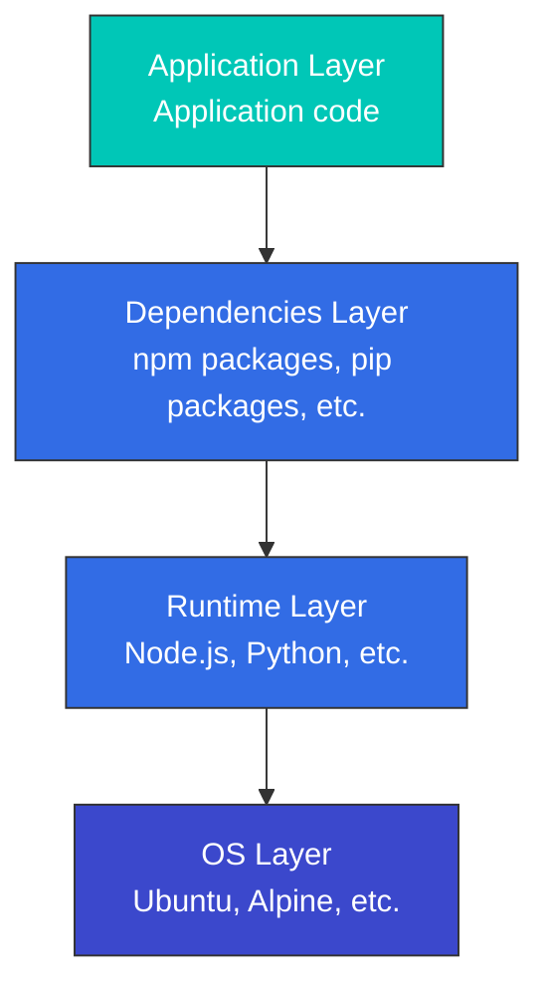

# Container Technology

> **Versiones compatibles**: Docker 20.10+, containerd 1.6+, CRI-O 1.24+ **Última actualización**: February 11, 2026

Los contenedores son una tecnología que empaqueta las aplicaciones junto con sus dependencias, lo que permite una ejecución consistente en diversos entornos. Este documento explica los conceptos fundamentales de los contenedores, cómo funcionan y su relación con Kubernetes.

## Table of Contents

* [What is a Container?](03-container-technology.md#what-is-a-container)
* [Container vs Virtual Machine](03-container-technology.md#container-vs-virtual-machine)
* [Technical Foundation of Containers](03-container-technology.md#technical-foundation-of-containers)
* [Container Runtime](03-container-technology.md#container-runtime)
* [Container Images](03-container-technology.md#container-images)
* [Dockerfile](03-container-technology.md#dockerfile)
* [Container Networking](03-container-technology.md#container-networking)
* [Container Storage](03-container-technology.md#container-storage)
* [Container Security](03-container-technology.md#container-security)
* [Container Lifecycle Management](03-container-technology.md#container-lifecycle-management)
* [Container Orchestration](03-container-technology.md#container-orchestration)
* [Containers on AWS](03-container-technology.md#containers-on-aws)

## What is a Container?

Un contenedor es una unidad estandarizada de software que incluye todo lo necesario para ejecutar una aplicación (código, runtime, herramientas del sistema, bibliotecas del sistema y configuración). Los contenedores se ejecutan en entornos aislados mientras comparten el kernel del sistema operativo del host.

### Key Characteristics of Containers

1. **Portabilidad**: Proporciona un entorno de ejecución consistente entre desarrollo, pruebas y producción
2. **Ligero**: Usa menos recursos que las máquinas virtuales
3. **Aislamiento**: Entorno de ejecución aislado de otros contenedores y del sistema host
4. **Inicio y detención rápidos**: Tiempo de arranque rápido en milisegundos
5. **Escalabilidad**: Fácil de replicar para escalado horizontal
6. **Control de versiones**: Gestión del ciclo de vida de la aplicación mediante versionado de imágenes

### History of Container Technology

* **Principios de la década de 2000**: Surgen tecnologías tempranas de contenedores como Linux VServer y OpenVZ
* **2007**: cgroups (Control Groups) se integra en el kernel de Linux
* **2008**: Comienza el proyecto LXC (Linux Containers)
* **2013**: El lanzamiento de Docker populariza la tecnología de contenedores
* **2015**: Se establece Open Container Initiative (OCI), estandarizando los contenedores
* **2017**: containerd se dona al proyecto CNCF

## Container vs Virtual Machine

### Virtual Machine Architecture vs Container Architecture

### Key Differences

| Characteristic      | Container                        | Virtual Machine                                           |
| ------------------- | -------------------------------- | --------------------------------------------------------- |
| Size                | Typically tens of MB             | Typically several GB                                      |
| Startup Time        | Seconds or less                  | Minutes                                                   |
| Isolation Level     | Process-level isolation          | Hardware-level isolation                                  |
| OS                  | Shares host OS kernel            | Each VM requires full OS                                  |
| Performance         | Nearly native                    | Some overhead                                             |
| Security            | Relatively lower (shared kernel) | Relatively higher (complete isolation)                    |
| Resource Efficiency | High                             | Medium                                                    |
| Use Cases           | Microservices, CI/CD, dev/test   | Legacy apps, diverse OS requirements, high security needs |

## Technical Foundation of Containers

Los contenedores se implementan usando varias características del kernel de Linux. Estas tecnologías se cubrieron en detalle en 01-linux-basics.md; aquí nos enfocamos en su relación con los contenedores.

### Isolation Through Namespaces

Los contenedores usan namespaces de Linux para aislar procesos. Cada contenedor tiene su propio conjunto de namespaces, lo que proporciona un entorno de ejecución independiente.

```bash
# Check container namespaces
docker inspect <container-id> | grep -A 10 "Pid"
ls -la /proc/<pid>/ns/

# Check processes inside container (isolated PID namespace)
docker exec <container-id> ps aux

# Check same process from host (actual PID)
ps aux | grep <process-name>
```

**Namespaces usados por los contenedores**:

* **PID**: El contenedor tiene su propio árbol de procesos (comenzando desde PID 1)
* **Network**: Stack de red independiente (dirección IP, tabla de enrutamiento, puertos)
* **Mount**: Vista independiente del sistema de archivos
* **UTS**: Hostname independiente
* **IPC**: Espacio independiente de comunicación entre procesos
* **User**: Asignación independiente de ID de usuario (opcional)

### Resource Limiting Through cgroups

Los contenedores usan cgroups para limitar y monitorear el uso de recursos.

```bash
# Run container with CPU limit
docker run --cpus=0.5 --memory=512m nginx

# Check container resource usage
docker stats <container-id>

# Check container cgroup settings
docker inspect <container-id> | grep -A 20 "Cgroup"

# Check container cgroup from host
cat /sys/fs/cgroup/system.slice/docker-<container-id>.scope/cpu.max
cat /sys/fs/cgroup/system.slice/docker-<container-id>.scope/memory.max
```

**Controles de recursos de cgroup usados por los contenedores**:

* **CPU**: Limitación del tiempo de CPU y asignación de núcleos de CPU
* **Memory**: Limitación del uso de memoria y control del comportamiento OOM
* **Block I/O**: Limitación del ancho de banda de I/O de disco
* **Network**: Limitación del ancho de banda de red (combinada con tc)
* **PIDs**: Límite de cantidad de procesos dentro del contenedor

### Layer Management Through OverlayFS

Las imágenes de contenedor usan OverlayFS para gestionar eficientemente múltiples capas.

```bash
# Check image layers
docker history <image-name>

# Check container file system layers
docker inspect <container-id> | grep -A 10 "GraphDriver"

# Check OverlayFS mount information
mount | grep overlay
```

**Estructura de OverlayFS**:

* **LowerDir**: Capas de imagen de solo lectura (capa inferior → capa superior)
* **UpperDir**: Capa de lectura/escritura del contenedor
* **WorkDir**: Directorio de trabajo de OverlayFS
* **MergedDir**: Vista unificada (sistema de archivos visto por el contenedor)

### Lab: Understanding Container Technical Foundation

```bash
# 1. Run a simple container
docker run -d --name test-container nginx

# 2. Get container PID
CONTAINER_PID=$(docker inspect -f '{{.State.Pid}}' test-container)
echo "Container PID: $CONTAINER_PID"

# 3. Check container namespaces
ls -la /proc/$CONTAINER_PID/ns/

# 4. Check container cgroup
cat /proc/$CONTAINER_PID/cgroup

# 5. Check container file system layers
docker inspect test-container | jq '.[0].GraphDriver'

# 6. Cleanup
docker stop test-container
docker rm test-container
```

## Container Runtime

Un container runtime es software que gestiona el ciclo de vida de los contenedores. Ejecuta imágenes de contenedor, limita el uso de recursos del contenedor y configura redes y almacenamiento.

### Container Runtime Hierarchy

1. **Runtime de bajo nivel (compatible con OCI)**
   * **runc**: Runtime predeterminado de Docker, implementación del estándar OCI
   * **crun**: Runtime OCI ligero escrito en C
   * **kata-containers**: Runtime con seguridad reforzada que usa virtualización de hardware
   * **gVisor**: Runtime de seguridad que emula funciones del kernel en el espacio de usuario
2. **Runtime de alto nivel**
   * **containerd**: Runtime de contenedores estándar de la industria separado de Docker
   * **CRI-O**: Runtime ligero diseñado específicamente para Kubernetes
   * **Docker Engine**: Plataforma de contenedores más utilizada

### Kubernetes Container Runtime Interface (CRI)

Kubernetes se integra con varios container runtimes mediante CRI (Container Runtime Interface). CRI proporciona una interfaz estandarizada entre Kubernetes y los container runtimes.

## Container Images

Las imágenes de contenedor son plantillas inmutables que contienen aplicaciones y sus dependencias. Las imágenes constan de múltiples capas, cada una de las cuales representa cambios en el sistema de archivos.

### Image Layers

Las imágenes de contenedor se componen de una pila de múltiples capas. Cada capa representa cambios respecto de la capa anterior. Este enfoque por capas hace que compartir imágenes y almacenarlas en caché sea eficiente.



### Image Registries

Las imágenes de contenedor se almacenan y comparten en registries. Los principales registries incluyen:

* **Docker Hub**: El registro público más grande
* **Amazon ECR**: Servicio de registro de contenedores de AWS
* **Google Container Registry**: Registro de Google Cloud
* **Azure Container Registry**: Registro de Microsoft Azure
* **GitHub Container Registry**: Registro de contenedores de GitHub
* **Harbor**: Registro open-source de nivel empresarial

### Image Tags and Digests

* **Tag**: Nombre legible por humanos que identifica una versión específica de una imagen (por ejemplo, `nginx:1.21.0`)
* **Digest**: Hash SHA256 del contenido de la imagen, identificador único de una imagen (por ejemplo, `nginx@sha256:2834dc507516af02784808c5f48b7cbe38b8ed5d0f4837f16e78d00deb7e7767`)

## Dockerfile

Un Dockerfile es un archivo de texto que contiene instrucciones para construir una imagen de contenedor. Cada instrucción agrega una nueva capa a la imagen.

### Key Dockerfile Instructions

```dockerfile
# Specify base image
FROM node:14-alpine

# Set working directory
WORKDIR /app

# Set environment variables
ENV NODE_ENV=production

# Copy files
COPY package*.json ./
COPY . .

# Run commands
RUN npm install --production

# Expose port
EXPOSE 3000

# Define volume
VOLUME /app/data

# Command to run when container starts
CMD ["node", "server.js"]
```

### Multi-stage Builds

Los builds de múltiples etapas usan varias etapas de compilación para reducir el tamaño final de la imagen.

```dockerfile
# Build stage
FROM node:14 AS build
WORKDIR /app
COPY package*.json ./
COPY . .
RUN npm install
RUN npm run build

# Production stage
FROM nginx:alpine
COPY --from=build /app/dist /usr/share/nginx/html
EXPOSE 80
CMD ["nginx", "-g", "daemon off;"]
```

### Image Optimization Techniques

1. **Elegir una imagen base adecuada**: Usa imágenes ligeras como Alpine
2. **Usar builds de múltiples etapas**: Excluye herramientas de build y archivos intermedios
3. **Minimizar capas**: Combina RUN, COPY y otros comandos
4. **Excluir archivos innecesarios**: Usa el archivo .dockerignore
5. **Aprovechar la caché**: Coloca las capas que cambian con frecuencia más tarde

## Container Networking

La red de contenedores permite la comunicación entre contenedores y entre contenedores y el mundo exterior.

### Network Drivers

Docker proporciona varios network drivers:

1. **bridge**: Network driver predeterminado, comunicación entre contenedores en el mismo host
2. **host**: Usa directamente la red del host, sin aislamiento
3. **overlay**: Comunicación de contenedores a través de múltiples hosts
4. **macvlan**: Asigna una dirección MAC al contenedor, aparece como dispositivo de red físico
5. **none**: Deshabilita toda la red

### Port Mapping

Asigna puertos internos del contenedor a puertos del host para acceso externo.

```bash
# Map host port 8080 to container port 80
docker run -p 8080:80 nginx
```

### Container-to-Container Communication

1. **Misma red**: Los contenedores en la misma red pueden comunicarse por nombre de contenedor
2. **Links**: Método heredado, configuración de enlace directo entre contenedores
3. **Red externa**: Comunicación a través de puertos del host

## Container Storage

Los contenedores son stateless de forma predeterminada, pero existen varias opciones para el almacenamiento persistente de datos.

### Storage Types

1. **Almacenamiento efímero**: Sistema de archivos interno del contenedor; los datos se pierden cuando se elimina el contenedor
2. **Volumes**: Áreas del sistema de archivos del host gestionadas por Docker
3. **Bind mounts**: Montan rutas específicas del host en el contenedor
4. **tmpfs mounts**: Almacenan datos solo en memoria, se usan cuando se necesita alto rendimiento de I/O

### Volume Usage Examples

```bash
# Create volume
docker volume create my-vol

# Run container using volume
docker run -v my-vol:/app/data nginx

# Use bind mount
docker run -v /host/path:/container/path nginx

# Read-only mount
docker run -v /host/path:/container/path:ro nginx
```

### Data Sharing Patterns

1. **Uso compartido de volumes**: Múltiples contenedores usan el mismo volume
2. **Contenedor de data volume**: Crea un contenedor que contiene solo datos y luego compártelo
3. **Integración con almacenamiento externo**: Usa sistemas de almacenamiento externo como AWS EBS, NFS

## Container Security

La seguridad de contenedores debe considerarse en múltiples capas, incluidas las imágenes, el container runtime y los sistemas host.

### Image Security

1. **Escaneo de vulnerabilidades**: Escanea imágenes en busca de vulnerabilidades con herramientas como Trivy, Clair
2. **Imágenes base confiables**: Usa imágenes oficiales o verificadas
3. **Principio de privilegio mínimo**: Incluye solo los paquetes y permisos necesarios
4. **Firma de imágenes**: Firma y verifica imágenes con Docker Content Trust o Cosign

### Runtime Security

1. **Restricción de privilegios**: Ejecuta contenedores como usuario no root
2. **Restricción de capabilities**: Otorga solo las capabilities de Linux necesarias
3. **Perfiles seccomp**: Restringe llamadas al sistema
4. **AppArmor/SELinux**: Aplica controles de acceso obligatorios
5. **Sistema de archivos de solo lectura**: Monta el sistema de archivos como solo lectura cuando sea posible

### Security Best Practices

1. **Actualizaciones regulares**: Actualiza regularmente las imágenes de contenedor y los sistemas host
2. **Aislamiento de red**: Restringe la comunicación de contenedores con políticas de red apropiadas
3. **Gestión de secretos**: Usa Docker Secrets o herramientas externas de gestión de secretos en lugar de variables de entorno
4. **Límites de recursos**: Limita CPU, memoria y otros usos de recursos
5. **Monitoreo y logging**: Monitorea la actividad de los contenedores y centraliza los logs

## Container Lifecycle Management

Comprender el ciclo de vida completo del contenedor es esencial para operaciones de contenedores eficaces.

### Container States

Los contenedores pueden tener varios estados:

* **Created**: Contenedor creado pero aún no iniciado
* **Running**: El contenedor está en ejecución
* **Paused**: Todos los procesos del contenedor están pausados
* **Restarting**: El contenedor se está reiniciando
* **Exited**: El contenedor ha terminado
* **Dead**: El daemon del contenedor intentó eliminarlo, pero falló

```bash
# Check container status
docker ps -a

# Detailed status of specific container
docker inspect <container-id> | jq '.[0].State'

# Container state transitions
docker create nginx  # Created state
docker start <container-id>  # Transition to Running state
docker pause <container-id>  # Transition to Paused state
docker unpause <container-id>  # Return to Running state
docker stop <container-id>  # Transition to Exited state
docker rm <container-id>  # Remove container
```

### Creating and Running Containers

```bash
# Create container only (don't start)
docker create --name my-nginx nginx

# Start container
docker start my-nginx

# Create and start container (all at once)
docker run --name my-nginx2 -d nginx

# Run in interactive mode
docker run -it ubuntu bash

# Run in background
docker run -d nginx

# Auto-remove when container exits
docker run --rm nginx

# Run with environment variables
docker run -e "DB_HOST=localhost" -e "DB_PORT=5432" myapp

# Run with port mapping
docker run -p 8080:80 nginx

# Run with volume mount
docker run -v /host/path:/container/path nginx
```

### Controlling Containers

```bash
# List running containers
docker ps

# List all containers (including stopped)
docker ps -a

# Stop container (SIGTERM then SIGKILL)
docker stop <container-id>

# Force kill container (SIGKILL)
docker kill <container-id>

# Restart container
docker restart <container-id>

# Pause container
docker pause <container-id>

# Resume container
docker unpause <container-id>

# Execute command in running container
docker exec -it <container-id> bash
docker exec <container-id> ls -la /app

# Copy files from/to container
docker cp <container-id>:/path/to/file /local/path
docker cp /local/path <container-id>:/path/to/file
```

### Container Logging and Monitoring

```bash
# View container logs
docker logs <container-id>

# Stream real-time logs
docker logs -f <container-id>

# Last N log lines
docker logs --tail 100 <container-id>

# Output logs with timestamps
docker logs -t <container-id>

# Logs since specific time
docker logs --since "2025-11-24T10:00:00" <container-id>

# Check container resource usage
docker stats <container-id>

# All container resource usage
docker stats

# Check container processes
docker top <container-id>

# Container detailed information
docker inspect <container-id>
```

### Cleaning Up Containers

```bash
# Remove all stopped containers
docker container prune

# Remove all unused resources (containers, images, networks, volumes)
docker system prune

# Remove all resources including volumes
docker system prune --volumes

# Check disk usage
docker system df

# Remove image
docker rmi <image-id>

# Remove unused images
docker image prune

# Remove volume
docker volume rm <volume-name>

# Remove unused volumes
docker volume prune

# Remove network
docker network rm <network-name>

# Remove unused networks
docker network prune
```

### Health Checks

Monitorea el estado de salud del contenedor para recuperación automática.

```dockerfile
FROM nginx:alpine

# Define health check in Dockerfile
HEALTHCHECK --interval=30s --timeout=3s --start-period=5s --retries=3 \
  CMD wget --quiet --tries=1 --spider http://localhost/ || exit 1
```

```bash
# Define health check at runtime
docker run -d \
  --health-cmd="curl -f http://localhost/ || exit 1" \
  --health-interval=30s \
  --health-timeout=3s \
  --health-retries=3 \
  nginx

# Check health check status
docker inspect <container-id> | jq '.[0].State.Health'
```

### Restart Policies

Configura los contenedores para que se reinicien automáticamente cuando salgan.

```bash
# Restart policy options
# - no: Don't restart (default)
# - on-failure: Restart only on failure
# - always: Always restart
# - unless-stopped: Always restart unless explicitly stopped

# Restart on failure (max 3 times)
docker run -d --restart=on-failure:3 nginx

# Always restart
docker run -d --restart=always nginx

# Restart unless explicitly stopped
docker run -d --restart=unless-stopped nginx

# Change restart policy of existing container
docker update --restart=always <container-id>
```

### Debugging Containers

```bash
# Explore container internal file system
docker exec -it <container-id> bash

# Check container environment variables
docker exec <container-id> env

# Check container network information
docker exec <container-id> ip addr
docker exec <container-id> netstat -tuln

# Check container processes
docker exec <container-id> ps aux

# Monitor container events
docker events

# Filter specific container events
docker events --filter container=<container-id>

# Check container changes (compared to image)
docker diff <container-id>
```

## Container Orchestration

La orquestación de contenedores es el proceso de gestionar y coordinar múltiples contenedores. Las características clave incluyen gestión de despliegues, escalado, redes y descubrimiento de servicios.

### Major Orchestration Tools

1. **Kubernetes**: Plataforma de orquestación de contenedores más utilizada
2. **Docker Swarm**: Herramienta de orquestación integrada de Docker, configuración sencilla
3. **Amazon ECS**: Servicio de orquestación de contenedores de AWS
4. **HashiCorp Nomad**: Soporta workloads tanto de contenedor como no basados en contenedores

### Key Features of Orchestration

1. **Despliegue y rollback automatizados**: Gestión del despliegue de aplicaciones mediante configuración declarativa
2. **Service discovery y balanceo de carga**: Comunicación de contenedores y distribución de carga
3. **Auto-scaling**: Ajusta la cantidad de contenedores según la carga
4. **Self-healing**: Reinicia automáticamente los contenedores fallidos
5. **Gestión de configuración**: Configuración de aplicaciones y gestión de secretos
6. **Orquestación de almacenamiento**: Gestión de almacenamiento persistente
7. **Ejecución batch**: Ejecución de jobs únicos y cron jobs

## Containers on AWS

AWS proporciona varios servicios para workloads de contenedores.

### Amazon ECS (Elastic Container Service)

Servicio propio de orquestación de contenedores de AWS que puede ejecutar contenedores en instancias EC2 o AWS Fargate.

**Características clave**:

* Integración estrecha con servicios de AWS
* Ejecución serverless de contenedores (Fargate)
* Configuración y gestión sencillas
* Auto-scaling y balanceo de carga

### Amazon EKS (Elastic Kubernetes Service)

Servicio Kubernetes gestionado por AWS que permite ejecutar Kubernetes en infraestructura de AWS usando las APIs estándar de Kubernetes.

**Características clave**:

* Plano de control de Kubernetes gestionado
* Alta disponibilidad en múltiples zonas de disponibilidad
* Integración con servicios de AWS
* Soporte para EC2 y Fargate

### AWS Fargate

Entorno serverless de ejecución de contenedores que permite ejecutar contenedores sin gestionar servidores.

**Características clave**:

* No se necesita gestión de servidores
* Facturación por contenedor
* Integración con ECS y EKS
* Aislamiento de seguridad

### Amazon ECR (Elastic Container Registry)

Servicio gestionado de registro de imágenes de contenedor de AWS.

**Características clave**:

* Escaneo de vulnerabilidades de imágenes
* Integración con IAM
* Gestión del ciclo de vida de imágenes
* Alta disponibilidad y escalabilidad

## Glossary

| Term                  | Description                                                                                                                   |
| --------------------- | ----------------------------------------------------------------------------------------------------------------------------- |
| **Container**         | A standardized software unit that packages an application with its dependencies, enabling consistent execution anywhere.      |
| **Image**             | A read-only template used to create containers, containing application code, libraries, dependencies, tools, and other files. |
| **Dockerfile**        | A text file containing instructions for building a container image.                                                           |
| **Registry**          | A repository that stores and distributes container images. (e.g., Docker Hub, Amazon ECR)                                     |
| **Container Runtime** | Software that runs containers. (e.g., Docker, containerd, CRI-O)                                                              |
| **Namespace**         | A Linux kernel feature that isolates processes so they cannot see other parts of the system.                                  |
| **cgroups**           | A Linux kernel feature that limits and monitors resource usage (CPU, memory, etc.) of process groups.                         |
| **Layer**             | Container images consist of multiple layers, each corresponding to a Dockerfile instruction.                                  |
| **Volume**            | A mechanism for persistently storing container data.                                                                          |
| **Orchestration**     | The process of automating the deployment, management, scaling, and networking of multiple containers.                         |
| **ECS**               | Amazon Elastic Container Service, AWS's container orchestration service.                                                      |
| **ECR**               | Amazon Elastic Container Registry, AWS's container image registry service.                                                    |
| **Fargate**           | AWS's serverless container execution environment that runs containers without infrastructure management.                      |

## Conclusion

La tecnología de contenedores ha revolucionado la forma en que se desarrollan y despliegan las aplicaciones. Proporciona portabilidad, consistencia y eficiencia, lo que mejora la productividad de los desarrolladores y reduce la complejidad operativa. Combinada con herramientas de orquestación como Kubernetes, permite gestionar eficazmente aplicaciones distribuidas a gran escala.

Comprender los conceptos básicos y el funcionamiento de los contenedores es esencial para desarrollar y operar aplicaciones cloud-native modernas. Este conocimiento forma la base para utilizar Kubernetes de manera efectiva.

## Quiz

Para comprobar lo que has aprendido en este capítulo, realiza el [cuestionario de Container Technology](../quizzes/basics/03-container-technology-quiz.md).

## References

* [Docker Official Documentation](https://docs.docker.com/)
* [OCI (Open Container Initiative)](https://opencontainers.org/)
* [containerd Project](https://containerd.io/)
* [CNCF Container Runtime Overview](https://www.cncf.io/blog/2019/06/27/an-introduction-to-container-runtimes/)
* [AWS Container Services](https://aws.amazon.com/containers/)
