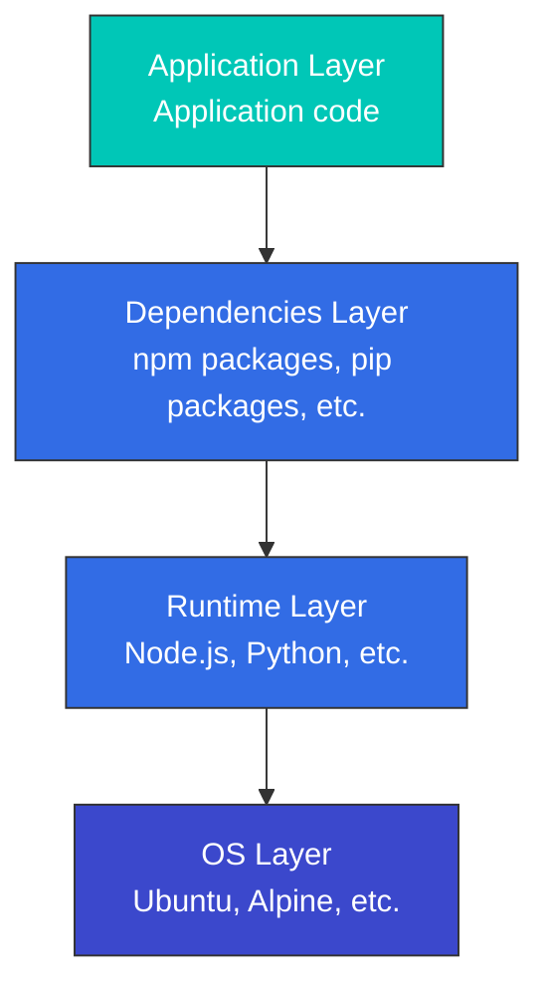

# Container Technology

> **Versiones compatibles**: Docker 20.10+, containerd 1.6+, CRI-O 1.24+ **Última actualización**: February 11, 2026

Los containers (contenedores) son una tecnología que empaqueta aplicaciones y sus dependencias juntas, lo que permite una ejecución coherente en varios entornos. Este documento explica los conceptos fundamentales de los containers, cómo funcionan y su relación con Kubernetes.

## Table of Contents

* [What is a Container?](03-container-technology.md#what-is-a-container)
* [Container vs Virtual Machine](03-container-technology.md#container-vs-virtual-machine)
* [Technical Foundation of Containers](03-container-technology.md#technical-foundation-of-containers)
* [Container Runtime](03-container-technology.md#container-runtime)
* [Container Images](03-container-technology.md#container-images)
* [Dockerfile](03-container-technology.md#dockerfile)
* [Container Networking](03-container-technology.md#container-networking)
* [Container Storage](03-container-technology.md#container-storage)
* [Container Security](03-container-technology.md#container-security)
* [Container Lifecycle Management](03-container-technology.md#container-lifecycle-management)
* [Container Orchestration](03-container-technology.md#container-orchestration)
* [Containers on AWS](03-container-technology.md#containers-on-aws)

## What is a Container?

Un container es una unidad estandarizada de software que incluye todo lo necesario para ejecutar una aplicación (código, runtime, herramientas del sistema, bibliotecas del sistema, configuración). Los containers se ejecutan en entornos aislados mientras comparten el kernel del sistema operativo del host.

### Key Characteristics of Containers

1. **Portabilidad**: Proporciona un entorno de ejecución coherente en desarrollo, pruebas y producción
2. **Ligereza**: Usa menos recursos que las máquinas virtuales
3. **Aislamiento**: Entorno de ejecución aislado de otros containers y del sistema host
4. **Inicio y detención rápidos**: Tiempo de arranque rápido en milisegundos
5. **Escalabilidad**: Fácil de replicar para escalado horizontal
6. **Control de versiones**: Gestión del ciclo de vida de la aplicación mediante versionado de imágenes

### History of Container Technology

* **Principios de la década de 2000**: Surgen tecnologías tempranas de containers como Linux VServer y OpenVZ
* **2007**: cgroups (Control Groups) se integra en el kernel de Linux
* **2008**: Comienza el proyecto LXC (Linux Containers)
* **2013**: El lanzamiento de Docker populariza la tecnología de containers
* **2015**: Se establece Open Container Initiative (OCI), que estandariza los containers
* **2017**: containerd se dona al proyecto CNCF

## Container vs Virtual Machine

### Virtual Machine Architecture vs Container Architecture

### Key Differences

| Characteristic      | Container                        | Virtual Machine                                           |
| ------------------- | -------------------------------- | --------------------------------------------------------- |
| Size                | Typically tens of MB             | Typically several GB                                      |
| Startup Time        | Seconds or less                  | Minutes                                                   |
| Isolation Level     | Process-level isolation          | Hardware-level isolation                                  |
| OS                  | Shares host OS kernel            | Each VM requires full OS                                  |
| Performance         | Nearly native                    | Some overhead                                             |
| Security            | Relatively lower (shared kernel) | Relatively higher (complete isolation)                    |
| Resource Efficiency | High                             | Medium                                                    |
| Use Cases           | Microservices, CI/CD, dev/test   | Legacy apps, diverse OS requirements, high security needs |

## Technical Foundation of Containers

Los containers se implementan usando varias características del kernel de Linux. Estas tecnologías se trataron en detalle en 01-linux-basics.md; aquí nos enfocamos en su relación con los containers.

### Isolation Through Namespaces

Los containers usan namespaces de Linux para aislar procesos. Cada container tiene su propio conjunto de namespaces, lo que proporciona un entorno de ejecución independiente.

```bash
# Check container namespaces
docker inspect <container-id> | grep -A 10 "Pid"
ls -la /proc/<pid>/ns/

# Check processes inside container (isolated PID namespace)
docker exec <container-id> ps aux

# Check same process from host (actual PID)
ps aux | grep <process-name>
```

**Namespaces usados por los containers**:

* **PID**: El container tiene su propio árbol de procesos (comenzando desde PID 1)
* **Network**: Stack de red independiente (dirección IP, tabla de enrutamiento, puertos)
* **Mount**: Vista independiente del sistema de archivos
* **UTS**: Nombre de host independiente
* **IPC**: Espacio independiente de comunicación entre procesos
* **User**: Mapeo independiente de ID de usuario (opcional)

### Resource Limiting Through cgroups

Los containers usan cgroups para limitar y monitorear el uso de recursos.

```bash
# Run container with CPU limit
docker run --cpus=0.5 --memory=512m nginx

# Check container resource usage
docker stats <container-id>

# Check container cgroup settings
docker inspect <container-id> | grep -A 20 "Cgroup"

# Check container cgroup from host
cat /sys/fs/cgroup/system.slice/docker-<container-id>.scope/cpu.max
cat /sys/fs/cgroup/system.slice/docker-<container-id>.scope/memory.max
```

**Controles de recursos de cgroup usados por los containers**:

* **CPU**: Limitación de tiempo de CPU y asignación de núcleos de CPU
* **Memory**: Limitación del uso de memoria y control del comportamiento OOM
* **Block I/O**: Limitación del ancho de banda de I/O de disco
* **Network**: Limitación del ancho de banda de red (combinada con tc)
* **PIDs**: Límite de cantidad de procesos dentro del container

### Layer Management Through OverlayFS

Las imágenes de container usan OverlayFS para gestionar eficientemente múltiples capas.

```bash
# Check image layers
docker history <image-name>

# Check container file system layers
docker inspect <container-id> | grep -A 10 "GraphDriver"

# Check OverlayFS mount information
mount | grep overlay
```

**Estructura de OverlayFS**:

* **LowerDir**: Capas de imagen de solo lectura (capa inferior → capa superior)
* **UpperDir**: Capa de lectura/escritura del container
* **WorkDir**: Directorio de trabajo de OverlayFS
* **MergedDir**: Vista unificada (sistema de archivos visto por el container)

### Lab: Understanding Container Technical Foundation

```bash
# 1. Run a simple container
docker run -d --name test-container nginx

# 2. Get container PID
CONTAINER_PID=$(docker inspect -f '{{.State.Pid}}' test-container)
echo "Container PID: $CONTAINER_PID"

# 3. Check container namespaces
ls -la /proc/$CONTAINER_PID/ns/

# 4. Check container cgroup
cat /proc/$CONTAINER_PID/cgroup

# 5. Check container file system layers
docker inspect test-container | jq '.[0].GraphDriver'

# 6. Cleanup
docker stop test-container
docker rm test-container
```

## Container Runtime

Un container runtime es software que gestiona el ciclo de vida de los containers. Ejecuta imágenes de container, limita el uso de recursos del container y configura redes y almacenamiento.

### Container Runtime Hierarchy

1. **Runtime de bajo nivel (compatible con OCI)**
   * **runc**: Runtime predeterminado de Docker, implementación del estándar OCI
   * **crun**: Runtime OCI ligero escrito en C
   * **kata-containers**: Runtime con seguridad mejorada que usa virtualización de hardware
   * **gVisor**: Runtime de seguridad que emula funciones del kernel en espacio de usuario
2. **Runtime de alto nivel**
   * **containerd**: Runtime de container estándar de la industria separado de Docker
   * **CRI-O**: Runtime ligero diseñado específicamente para Kubernetes
   * **Docker Engine**: Plataforma de containers más ampliamente usada

### Kubernetes Container Runtime Interface (CRI)

Kubernetes se integra con varios container runtimes mediante CRI (Container Runtime Interface). CRI proporciona una interfaz estandarizada entre Kubernetes y los container runtimes.

## Container Images

Las imágenes de container son plantillas inmutables que contienen aplicaciones y sus dependencias. Las imágenes constan de múltiples capas, cada una de las cuales representa cambios del sistema de archivos.

### Image Layers

Las imágenes de container están compuestas por una pila de múltiples capas. Cada capa representa cambios con respecto a la capa anterior. Este enfoque por capas hace que compartir imágenes y usar caché sea eficiente.



### Image Registries

Las imágenes de container se almacenan y comparten en registries. Los registries principales incluyen:

* **Docker Hub**: El registro público más grande
* **Amazon ECR**: Servicio de registro de containers de AWS
* **Google Container Registry**: Registro de Google Cloud
* **Azure Container Registry**: Registro de Microsoft Azure
* **GitHub Container Registry**: Registro de containers de GitHub
* **Harbor**: Registro open-source de nivel empresarial

### Image Tags and Digests

* **Tag**: Nombre legible por humanos que identifica una versión específica de una imagen (por ejemplo, `nginx:1.21.0`)
* **Digest**: Hash SHA256 del contenido de la imagen, identificador único de una imagen (por ejemplo, `nginx@sha256:2834dc507516af02784808c5f48b7cbe38b8ed5d0f4837f16e78d00deb7e7767`)

## Dockerfile

Un Dockerfile es un archivo de texto que contiene instrucciones para construir una imagen de container. Cada instrucción agrega una nueva capa a la imagen.

### Key Dockerfile Instructions

```dockerfile
# Specify base image
FROM node:14-alpine

# Set working directory
WORKDIR /app

# Set environment variables
ENV NODE_ENV=production

# Copy files
COPY package*.json ./
COPY . .

# Run commands
RUN npm install --production

# Expose port
EXPOSE 3000

# Define volume
VOLUME /app/data

# Command to run when container starts
CMD ["node", "server.js"]
```

### Multi-stage Builds

Las compilaciones multi-stage usan múltiples etapas de compilación para reducir el tamaño de la imagen final.

```dockerfile
# Build stage
FROM node:14 AS build
WORKDIR /app
COPY package*.json ./
COPY . .
RUN npm install
RUN npm run build

# Production stage
FROM nginx:alpine
COPY --from=build /app/dist /usr/share/nginx/html
EXPOSE 80
CMD ["nginx", "-g", "daemon off;"]
```

### Image Optimization Techniques

1. **Elegir una imagen base adecuada**: Usa imágenes ligeras como Alpine
2. **Usar compilaciones multi-stage**: Excluye herramientas de compilación y archivos intermedios
3. **Minimizar capas**: Combina RUN, COPY y otros comandos
4. **Excluir archivos innecesarios**: Usa el archivo .dockerignore
5. **Aprovechar la caché**: Coloca las capas que cambian con frecuencia más tarde

## Container Networking

El networking de containers permite la comunicación entre containers y entre containers y el mundo exterior.

### Network Drivers

Docker proporciona varios controladores de red:

1. **bridge**: Controlador de red predeterminado, comunicación entre containers en el mismo host
2. **host**: Usa directamente la red del host, sin aislamiento
3. **overlay**: Comunicación de containers a través de múltiples hosts
4. **macvlan**: Asigna una dirección MAC al container, aparece como dispositivo de red físico
5. **none**: Deshabilita todo el networking

### Port Mapping

Mapea puertos internos del container a puertos del host para acceso externo.

```bash
# Map host port 8080 to container port 80
docker run -p 8080:80 nginx
```

### Container-to-Container Communication

1. **Misma red**: Los containers en la misma red pueden comunicarse por nombre de container
2. **Links**: Método heredado, configuración de enlace directo entre containers
3. **Red externa**: Comunicación a través de puertos del host

## Container Storage

Los containers son stateless de forma predeterminada, pero existen varias opciones para el almacenamiento persistente de datos.

### Storage Types

1. **Almacenamiento efímero**: Sistema de archivos interno del container, los datos se pierden cuando se elimina el container
2. **Volumes**: Áreas del sistema de archivos del host gestionadas por Docker
3. **Bind mounts**: Monta rutas específicas del host en el container
4. **tmpfs mounts**: Almacena datos solo en memoria, usado cuando se necesita alto rendimiento de I/O

### Volume Usage Examples

```bash
# Create volume
docker volume create my-vol

# Run container using volume
docker run -v my-vol:/app/data nginx

# Use bind mount
docker run -v /host/path:/container/path nginx

# Read-only mount
docker run -v /host/path:/container/path:ro nginx
```

### Data Sharing Patterns

1. **Compartición de volume**: Varios containers usan el mismo volume
2. **Container de volume de datos**: Crea un container que contiene solo datos y luego compártelo
3. **Integración de almacenamiento externo**: Usa sistemas de almacenamiento externos como AWS EBS, NFS

## Container Security

La seguridad de containers debe considerarse en múltiples capas, incluidas las imágenes, el container runtime y los sistemas host.

### Image Security

1. **Escaneo de vulnerabilidades**: Escanea imágenes en busca de vulnerabilidades con herramientas como Trivy, Clair
2. **Imágenes base confiables**: Usa imágenes oficiales o verificadas
3. **Principio de privilegio mínimo**: Incluye solo los paquetes y permisos necesarios
4. **Firma de imágenes**: Firma y verifica imágenes con Docker Content Trust o Cosign

### Runtime Security

1. **Restricción de privilegios**: Ejecuta containers como usuario no root
2. **Restricción de capabilities**: Concede solo las capabilities de Linux necesarias
3. **Perfiles seccomp**: Restringe llamadas al sistema
4. **AppArmor/SELinux**: Aplica controles de acceso obligatorios
5. **Sistema de archivos de solo lectura**: Monta el sistema de archivos como solo lectura cuando sea posible

### Security Best Practices

1. **Actualizaciones regulares**: Actualiza regularmente las imágenes de container y los sistemas host
2. **Aislamiento de red**: Restringe la comunicación de containers con políticas de red adecuadas
3. **Gestión de secretos**: Usa Docker Secrets o herramientas externas de gestión de secretos en lugar de variables de entorno
4. **Límites de recursos**: Limita el uso de CPU, memoria y otros recursos
5. **Monitoreo y logging**: Monitorea la actividad de containers y centraliza los logs

## Container Lifecycle Management

Comprender el ciclo de vida completo de los containers es esencial para operaciones de containers eficaces.

### Container States

Los containers pueden tener varios estados:

* **Created**: Container creado pero aún no iniciado
* **Running**: El container está en ejecución
* **Paused**: Todos los procesos en el container están pausados
* **Restarting**: El container se está reiniciando
* **Exited**: El container ha terminado
* **Dead**: El daemon del container intentó eliminarlo pero falló

```bash
# Check container status
docker ps -a

# Detailed status of specific container
docker inspect <container-id> | jq '.[0].State'

# Container state transitions
docker create nginx  # Created state
docker start <container-id>  # Transition to Running state
docker pause <container-id>  # Transition to Paused state
docker unpause <container-id>  # Return to Running state
docker stop <container-id>  # Transition to Exited state
docker rm <container-id>  # Remove container
```

### Creating and Running Containers

```bash
# Create container only (don't start)
docker create --name my-nginx nginx

# Start container
docker start my-nginx

# Create and start container (all at once)
docker run --name my-nginx2 -d nginx

# Run in interactive mode
docker run -it ubuntu bash

# Run in background
docker run -d nginx

# Auto-remove when container exits
docker run --rm nginx

# Run with environment variables
docker run -e "DB_HOST=localhost" -e "DB_PORT=5432" myapp

# Run with port mapping
docker run -p 8080:80 nginx

# Run with volume mount
docker run -v /host/path:/container/path nginx
```

### Controlling Containers

```bash
# List running containers
docker ps

# List all containers (including stopped)
docker ps -a

# Stop container (SIGTERM then SIGKILL)
docker stop <container-id>

# Force kill container (SIGKILL)
docker kill <container-id>

# Restart container
docker restart <container-id>

# Pause container
docker pause <container-id>

# Resume container
docker unpause <container-id>

# Execute command in running container
docker exec -it <container-id> bash
docker exec <container-id> ls -la /app

# Copy files from/to container
docker cp <container-id>:/path/to/file /local/path
docker cp /local/path <container-id>:/path/to/file
```

### Container Logging and Monitoring

```bash
# View container logs
docker logs <container-id>

# Stream real-time logs
docker logs -f <container-id>

# Last N log lines
docker logs --tail 100 <container-id>

# Output logs with timestamps
docker logs -t <container-id>

# Logs since specific time
docker logs --since "2025-11-24T10:00:00" <container-id>

# Check container resource usage
docker stats <container-id>

# All container resource usage
docker stats

# Check container processes
docker top <container-id>

# Container detailed information
docker inspect <container-id>
```

### Cleaning Up Containers

```bash
# Remove all stopped containers
docker container prune

# Remove all unused resources (containers, images, networks, volumes)
docker system prune

# Remove all resources including volumes
docker system prune --volumes

# Check disk usage
docker system df

# Remove image
docker rmi <image-id>

# Remove unused images
docker image prune

# Remove volume
docker volume rm <volume-name>

# Remove unused volumes
docker volume prune

# Remove network
docker network rm <network-name>

# Remove unused networks
docker network prune
```

### Health Checks

Monitorea el estado de salud del container para la recuperación automática.

```dockerfile
FROM nginx:alpine

# Define health check in Dockerfile
HEALTHCHECK --interval=30s --timeout=3s --start-period=5s --retries=3 \
  CMD wget --quiet --tries=1 --spider http://localhost/ || exit 1
```

```bash
# Define health check at runtime
docker run -d \
  --health-cmd="curl -f http://localhost/ || exit 1" \
  --health-interval=30s \
  --health-timeout=3s \
  --health-retries=3 \
  nginx

# Check health check status
docker inspect <container-id> | jq '.[0].State.Health'
```

### Restart Policies

Configura containers para que se reinicien automáticamente cuando salgan.

```bash
# Restart policy options
# - no: Don't restart (default)
# - on-failure: Restart only on failure
# - always: Always restart
# - unless-stopped: Always restart unless explicitly stopped

# Restart on failure (max 3 times)
docker run -d --restart=on-failure:3 nginx

# Always restart
docker run -d --restart=always nginx

# Restart unless explicitly stopped
docker run -d --restart=unless-stopped nginx

# Change restart policy of existing container
docker update --restart=always <container-id>
```

### Debugging Containers

```bash
# Explore container internal file system
docker exec -it <container-id> bash

# Check container environment variables
docker exec <container-id> env

# Check container network information
docker exec <container-id> ip addr
docker exec <container-id> netstat -tuln

# Check container processes
docker exec <container-id> ps aux

# Monitor container events
docker events

# Filter specific container events
docker events --filter container=<container-id>

# Check container changes (compared to image)
docker diff <container-id>
```

## Container Orchestration

La orquestación de containers es el proceso de gestionar y coordinar múltiples containers. Las características clave incluyen gestión de despliegues, escalado, networking y descubrimiento de servicios.

### Major Orchestration Tools

1. **Kubernetes**: Plataforma de orquestación de containers más ampliamente usada
2. **Docker Swarm**: Herramienta de orquestación integrada de Docker, configuración sencilla
3. **Amazon ECS**: Servicio de orquestación de containers de AWS
4. **HashiCorp Nomad**: Admite workloads de container y no container

### Key Features of Orchestration

1. **Despliegue y rollback automatizados**: Gestión del despliegue de aplicaciones mediante configuración declarativa
2. **Descubrimiento de servicios y balanceo de carga**: Comunicación de containers y distribución de carga
3. **Auto-scaling**: Ajusta la cantidad de containers según la carga
4. **Self-healing**: Reinicia automáticamente containers fallidos
5. **Gestión de configuración**: Configuración de aplicaciones y gestión de secretos
6. **Orquestación de almacenamiento**: Gestión de almacenamiento persistente
7. **Ejecución batch**: Ejecución de trabajos únicos y cron jobs

## Containers on AWS

AWS proporciona varios servicios para workloads de containers.

### Amazon ECS (Elastic Container Service)

Servicio propio de orquestación de containers de AWS que puede ejecutar containers en instancias EC2 o AWS Fargate.

**Características clave**:

* Integración estrecha con servicios de AWS
* Ejecución serverless de containers (Fargate)
* Configuración y gestión sencillas
* Auto-scaling y balanceo de carga

### Amazon EKS (Elastic Kubernetes Service)

Servicio Kubernetes gestionado por AWS que permite ejecutar Kubernetes en infraestructura de AWS usando APIs estándar de Kubernetes.

**Características clave**:

* Plano de control de Kubernetes gestionado
* Alta disponibilidad en múltiples zonas de disponibilidad
* Integración con servicios de AWS
* Compatibilidad con EC2 y Fargate

### AWS Fargate

Entorno serverless de ejecución de containers que permite ejecutar containers sin gestionar servidores.

**Características clave**:

* No se necesita gestión de servidores
* Facturación por container
* Integración con ECS y EKS
* Aislamiento de seguridad

### Amazon ECR (Elastic Container Registry)

Servicio gestionado de registro de imágenes de container de AWS.

**Características clave**:

* Escaneo de vulnerabilidades de imágenes
* Integración con IAM
* Gestión del ciclo de vida de imágenes
* Alta disponibilidad y escalabilidad

## Glossary

| Term                  | Description                                                                                                                   |
| --------------------- | ----------------------------------------------------------------------------------------------------------------------------- |
| **Container**         | A standardized software unit that packages an application with its dependencies, enabling consistent execution anywhere.      |
| **Image**             | A read-only template used to create containers, containing application code, libraries, dependencies, tools, and other files. |
| **Dockerfile**        | A text file containing instructions for building a container image.                                                           |
| **Registry**          | A repository that stores and distributes container images. (e.g., Docker Hub, Amazon ECR)                                     |
| **Container Runtime** | Software that runs containers. (e.g., Docker, containerd, CRI-O)                                                              |
| **Namespace**         | A Linux kernel feature that isolates processes so they cannot see other parts of the system.                                  |
| **cgroups**           | A Linux kernel feature that limits and monitors resource usage (CPU, memory, etc.) of process groups.                         |
| **Layer**             | Container images consist of multiple layers, each corresponding to a Dockerfile instruction.                                  |
| **Volume**            | A mechanism for persistently storing container data.                                                                          |
| **Orchestration**     | The process of automating the deployment, management, scaling, and networking of multiple containers.                         |
| **ECS**               | Amazon Elastic Container Service, AWS's container orchestration service.                                                      |
| **ECR**               | Amazon Elastic Container Registry, AWS's container image registry service.                                                    |
| **Fargate**           | AWS's serverless container execution environment that runs containers without infrastructure management.                      |

## Conclusion

La tecnología de containers ha revolucionado la forma en que se desarrollan y despliegan las aplicaciones. Proporciona portabilidad, coherencia y eficiencia, lo que mejora la productividad de los desarrolladores y reduce la complejidad operativa. Combinada con herramientas de orquestación como Kubernetes, permite gestionar eficazmente aplicaciones distribuidas a gran escala.

Comprender los conceptos básicos y el funcionamiento de los containers es esencial para desarrollar y operar aplicaciones cloud-native modernas. Este conocimiento constituye la base para utilizar Kubernetes de manera eficaz.

## Quiz

Para comprobar lo que aprendiste en este capítulo, realiza el [cuestionario de Container Technology](../quizzes/basics/03-container-technology-quiz.md).

## References

* [Docker Official Documentation](https://docs.docker.com/)
* [OCI (Open Container Initiative)](https://opencontainers.org/)
* [containerd Project](https://containerd.io/)
* [CNCF Container Runtime Overview](https://www.cncf.io/blog/2019/06/27/an-introduction-to-container-runtimes/)
* [AWS Container Services](https://aws.amazon.com/containers/)
