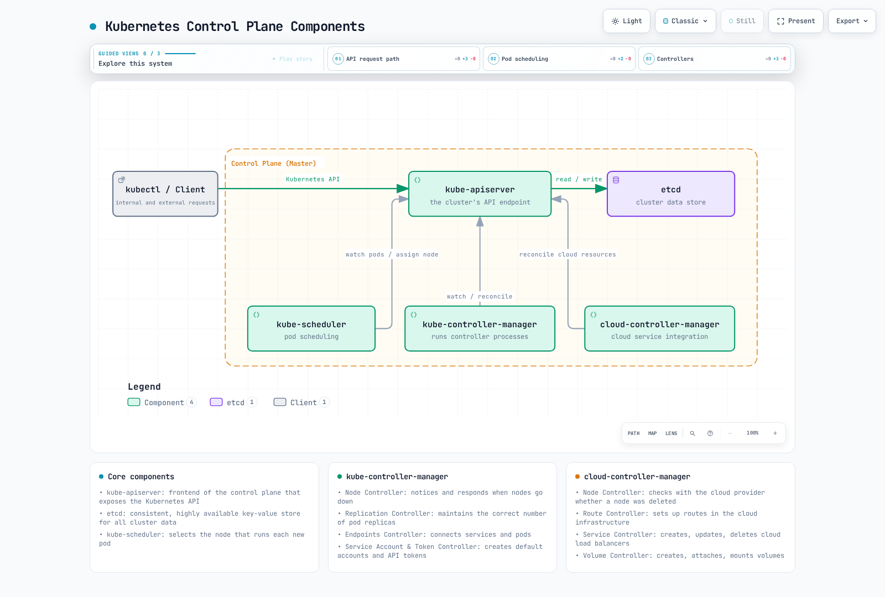
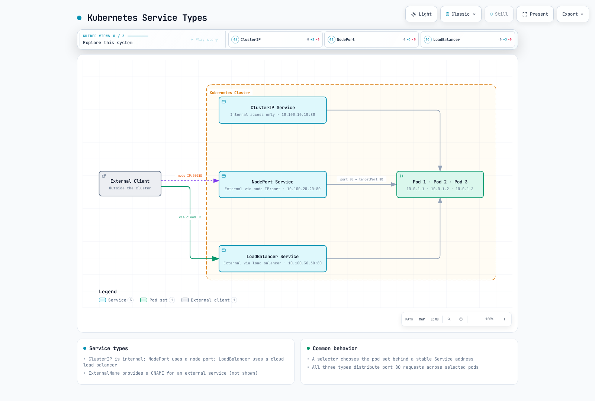

# Introducción a Kubernetes

> **Versiones compatibles**: Kubernetes 1.31, 1.32, 1.33 **Última actualización**: February 11, 2026

Kubernetes (K8s) es una plataforma de orquestación de contenedores de código abierto que automatiza la implementación, el escalado y la administración de aplicaciones en contenedores. Este documento explica los conceptos básicos, la arquitectura, los componentes principales y las características de Kubernetes.

## Configuración del entorno de laboratorio

Para seguir los ejemplos de este documento, necesitarás las siguientes herramientas y el siguiente entorno:

### Herramientas necesarias

* **kubectl**: Herramienta de línea de comandos para interactuar con clústeres de Kubernetes
* **Container Runtime**: Docker, containerd, CRI-O, etc.
* **minikube** o **kind**: Clúster local de Kubernetes (para desarrollo y aprendizaje)

### Métodos de instalación

**Instalación de kubectl**:

```bash
# macOS
brew install kubectl

# Linux
curl -LO "https://dl.k8s.io/release/$(curl -L -s https://dl.k8s.io/release/stable.txt)/bin/linux/amd64/kubectl"
chmod +x kubectl
sudo mv kubectl /usr/local/bin/

# Windows (PowerShell)
curl -LO "https://dl.k8s.io/release/v1.28.0/bin/windows/amd64/kubectl.exe"
```

**Instalación de minikube**:

```bash
# macOS
brew install minikube

# Linux
curl -LO https://storage.googleapis.com/minikube/releases/latest/minikube-linux-amd64
chmod +x minikube-linux-amd64
sudo mv minikube-linux-amd64 /usr/local/bin/minikube

# Windows (PowerShell)
New-Item -Path 'c:\' -Name 'minikube' -ItemType Directory
Invoke-WebRequest -OutFile 'c:\minikube\minikube.exe' -Uri 'https://github.com/kubernetes/minikube/releases/latest/download/minikube-windows-amd64.exe'
```

### Inicio de un clúster local

```bash
minikube start
```

## Tabla de contenidos

* [¿Qué es Kubernetes?](04-kubernetes-introduction.md#what-is-kubernetes)
* [Historia de Kubernetes](04-kubernetes-introduction.md#history-of-kubernetes)
* [Arquitectura de Kubernetes](04-kubernetes-introduction.md#kubernetes-architecture)
* [Componentes principales de Kubernetes](04-kubernetes-introduction.md#kubernetes-main-components)
* [Objetos básicos de Kubernetes](04-kubernetes-introduction.md#kubernetes-basic-objects)
* [Recursos de carga de trabajo de Kubernetes](04-kubernetes-introduction.md#kubernetes-workload-resources)
* [Servicios y redes de Kubernetes](04-kubernetes-introduction.md#kubernetes-services-and-networking)
* [Almacenamiento de Kubernetes](04-kubernetes-introduction.md#kubernetes-storage)
* [Configuración y seguridad de Kubernetes](04-kubernetes-introduction.md#kubernetes-configuration-and-security)
* [Kubernetes frente a Amazon EKS](04-kubernetes-introduction.md#kubernetes-vs-amazon-eks)
* [Primeros pasos con Kubernetes](04-kubernetes-introduction.md#getting-started-with-kubernetes)

## ¿Qué es Kubernetes?

Kubernetes significa «timonel» o «piloto» en griego y es un sistema de código abierto que automatiza la implementación, el escalado y la operación de aplicaciones en contenedores. Se inspiró en el sistema interno Borg de Google y se publicó como código abierto en 2014.

### Características clave de Kubernetes

1. **Service Discovery y Load Balancing**: Expone contenedores externamente y distribuye el tráfico
2. **Orquestación de almacenamiento**: Monta automáticamente sistemas de almacenamiento locales o en la nube
3. **Rollouts y Rollbacks automatizados**: Cambia gradualmente el estado de la aplicación y restaura el estado anterior ante problemas
4. **Bin Packing automático**: Coloca contenedores en nodos según los requisitos de recursos
5. **Autorreparación**: Reinicia los contenedores que fallan y reemplaza los que no responden
6. **Administración de Secret y configuración**: Almacena información confidencial y actualiza la configuración
7. **Escalado horizontal**: Escala aplicaciones mediante comandos sencillos o una UI
8. **Ejecución por lotes**: Administra cargas de trabajo por lotes y de CI

### Problemas que resuelve Kubernetes

* **Orquestación de contenedores**: Administra eficazmente cientos o miles de contenedores
* **Alta disponibilidad**: Garantiza el funcionamiento ininterrumpido de las aplicaciones
* **Escalabilidad**: Autoescalado basado en el aumento del tráfico
* **Recuperación ante desastres**: Recuperación automática ante fallos
* **Eficiencia de recursos**: Utiliza eficazmente los recursos de hardware
* **Configuración declarativa**: Administra la infraestructura como código
* **Multinube y nube híbrida**: Implementación y administración uniformes en diversos entornos

## Historia de Kubernetes

### Antecedentes

* **2003-2013**: Google utilizó internamente un sistema de orquestación de contenedores llamado Borg
* **Junio de 2014**: Google publicó Kubernetes como código abierto
* **Julio de 2015**: Se lanzó Kubernetes 1.0 y se donó a Cloud Native Computing Foundation (CNCF)
* **2016-2017**: Los principales proveedores de nube lanzaron servicios administrados de Kubernetes
* **2018 en adelante**: Se consolidó como el estándar de facto para la orquestación de contenedores

### Origen del nombre

Kubernetes (κυβερνήτης) significa «timonel» o «piloto» en griego. Esto simboliza su función de guiar las aplicaciones en contenedores. Se utiliza la abreviatura K8s porque hay 8 caracteres entre «K» y «s».

### Significado del logotipo

El logotipo de Kubernetes representa un timón (la rueda de dirección de un barco) con 7 radios, que simboliza el papel de Kubernetes al guiar el rumbo de las aplicaciones en contenedores.

## Arquitectura de Kubernetes

Kubernetes sigue una arquitectura master-node. Los nodos master (control plane) administran el clúster y los nodos worker ejecutan las cargas de trabajo reales de las aplicaciones.

### Componentes del Control Plane (Master)



[🔍 Ver diagrama interactivo](https://www.atomai.click/kubernetes-docs/archmaps/en-basics-04-kubernetes-introduction-0.html)

1. **kube-apiserver**: Frontend del control plane que expone la API de Kubernetes
2. **etcd**: Almacén de clave-valor coherente y de alta disponibilidad para todos los datos del clúster
3. **kube-scheduler**: Componente que asigna Pods a nodos
4. **kube-controller-manager**: Componente que ejecuta procesos de controller
   * Node Controller: Notificación y respuesta cuando los nodos dejan de funcionar
   * Replication Controller: Mantiene el número correcto de réplicas de Pod
   * Endpoints Controller: Conecta Services y Pods
   * Service Account & Token Controller: Crea cuentas predeterminadas y tokens de acceso a la API para nuevos namespaces
5. **cloud-controller-manager**: Componente que contiene lógica de control específica de la nube
   * Node Controller: Comprueba con el proveedor de nube si se eliminó el nodo
   * Route Controller: Configura rutas en la infraestructura en la nube
   * Service Controller: Crea, actualiza y elimina load balancers del proveedor de nube
   * Volume Controller: Crea, adjunta y monta volúmenes

### Componentes de nodo


[🔍 Ver diagrama interactivo](https://www.atomai.click/kubernetes-docs/archmaps/en-basics-04-kubernetes-introduction-1.html)

1. **kubelet**: Agente que se ejecuta en cada nodo y garantiza que los contenedores en Pods estén en ejecución
2. **kube-proxy**: Proxy de red que se ejecuta en cada nodo e implementa el concepto de Service de Kubernetes
3. **Container Runtime**: Software responsable de ejecutar contenedores (Docker, containerd, CRI-O, etc.)

### Arquitectura completa


[🔍 Ver diagrama interactivo](https://www.atomai.click/kubernetes-docs/archmaps/en-basics-04-kubernetes-introduction-2.html)

## Componentes principales de Kubernetes

### API Server (kube-apiserver)

El API Server es el frontend del control plane que expone la API de Kubernetes. Todas las solicitudes internas y externas se procesan a través del API Server.

**Funciones clave**:

* Proporciona una API REST
* Autenticación y autorización
* Validación de solicitudes
* Comunicación con etcd
* Escalable horizontalmente

### etcd

etcd es un almacén de clave-valor coherente y de alta disponibilidad que almacena todos los datos del clúster.

**Características clave**:

* Sistema distribuido
* Coherencia sólida
* Alta disponibilidad
* Almacenamiento seguro de datos
* Función Watch para supervisar cambios

### Scheduler (kube-scheduler)

El scheduler es un componente del control plane que selecciona nodos para ejecutar Pods recién creados.

**Proceso de programación**:

1. **Filtrado**: Identifica los nodos que pueden ejecutar el Pod
2. **Puntuación**: Asigna puntuaciones a los nodos adecuados
3. **Vinculación**: Asigna el Pod al nodo óptimo

**Consideraciones**:

* Requisitos de recursos (CPU, memoria)
* Restricciones de hardware/software/políticas
* Especificaciones de afinidad/antiafinidad
* Localidad de datos
* Interferencia de cargas de trabajo

### Controller Manager (kube-controller-manager)

El controller manager es un componente del control plane que ejecuta múltiples procesos de controller.

**Controllers principales**:

* **Node Controller**: Supervisa y responde al estado del nodo
* **Replication Controller**: Mantiene el número de réplicas de Pod
* **Endpoints Controller**: Conecta Services y Pods
* **Service Account & Token Controller**: Crea cuentas predeterminadas y tokens de API para namespaces
* **Job Controller**: Administra tareas de una sola ejecución
* **CronJob Controller**: Administra tareas programadas
* **DaemonSet Controller**: Garantiza que Pods específicos se ejecuten en todos los nodos
* **StatefulSet Controller**: Administra aplicaciones con estado
* **PV Controller**: Administra volúmenes persistentes

### Cloud Controller Manager (cloud-controller-manager)

El cloud controller manager es un componente del control plane que contiene lógica de control específica de la nube.

**Controllers principales**:

* **Node Controller**: Comprueba el estado del nodo mediante la API del proveedor de nube
* **Route Controller**: Configura rutas en el entorno de nube
* **Service Controller**: Crea, actualiza y elimina load balancers en la nube
* **Volume Controller**: Crea, adjunta y monta volúmenes de almacenamiento en la nube

### kubelet

kubelet es un agente que se ejecuta en cada nodo y garantiza que los contenedores en Pods estén en ejecución.

**Funciones clave**:

* Ejecuta contenedores según PodSpec
* Informa del estado de los contenedores
* Realiza comprobaciones de estado de los contenedores
* Administra el ciclo de vida de los contenedores
* Informa del estado del nodo

### kube-proxy

kube-proxy es un proxy de red que se ejecuta en cada nodo e implementa el concepto de Service de Kubernetes.

**Funciones clave**:

* Mantiene reglas de red para IP y puertos de Service
* Reenvía conexiones
* Implementa load balancing

**Modos de operación**:

* **modo userspace**: Ejecuta el proxy en el espacio de usuario (heredado)
* **modo iptables**: Implementación de NAT mediante iptables de Linux (predeterminado)
* **modo IPVS**: Utiliza IP Virtual Server del kernel de Linux (alto rendimiento)

## Objetos básicos de Kubernetes

Los objetos de Kubernetes son entidades persistentes que representan el estado del clúster. Estos objetos describen las aplicaciones en ejecución, los recursos disponibles, las políticas, etc. en el clúster.

### Pod

Un Pod es la unidad implementable más pequeña de Kubernetes y representa un grupo de uno o más contenedores. Los contenedores de un Pod comparten almacenamiento y red, y siempre se programan juntos en el mismo nodo.

**Características clave**:

* Tiene una dirección IP única
* Espacio de nombres de red compartido (mismo espacio de IP y puertos)
* Espacio de nombres IPC compartido
* Nombre de host compartido
* Es posible la comunicación mediante localhost entre contenedores

**Ejemplo de Pod**:

```yaml
apiVersion: v1
kind: Pod
metadata:
  name: nginx-pod
  labels:
    app: nginx
spec:
  containers:
  - name: nginx
    image: nginx:1.21
    ports:
    - containerPort: 80
  - name: log-sidecar
    image: busybox
    command: ["/bin/sh", "-c", "tail -f /var/log/nginx/access.log"]
    volumeMounts:
    - name: logs
      mountPath: /var/log/nginx
  volumes:
  - name: logs
    emptyDir: {}
```

### Namespace

Los namespaces proporcionan una forma de aislar grupos de recursos dentro de un único clúster. Esto es útil cuando varios equipos o proyectos comparten el mismo clúster.

**Namespaces predeterminados**:

* **default**: Namespace predeterminado
* **kube-system**: Namespace para objetos creados por el sistema Kubernetes
* **kube-public**: Namespace para objetos legibles por todos los usuarios
* **kube-node-lease**: Namespace para latidos de nodos

**Ejemplo de Namespace**:

```yaml
apiVersion: v1
kind: Namespace
metadata:
  name: development
```

### Labels y Selectors

Los labels son pares clave-valor adjuntos a objetos, que se usan para identificar y seleccionar objetos. Los selectors ofrecen una forma de filtrar objetos según labels.

**Ejemplo de labels**:

```yaml
metadata:
  labels:
    app: nginx
    environment: production
    tier: frontend
```

**Tipos de selector**:

* **Basado en igualdad**: `=`, `!=`
* **Basado en conjuntos**: `in`, `notin`, `exists`

**Ejemplo de selector**:

```yaml
selector:
  matchLabels:
    app: nginx
  matchExpressions:
    - {key: tier, operator: In, values: [frontend, middleware]}
    - {key: environment, operator: NotIn, values: [dev]}
```

### Annotations

Las annotations son pares clave-valor que almacenan metadatos no identificativos sobre objetos. Las annotations son útiles para almacenar información utilizada por herramientas o bibliotecas.

**Ejemplo de annotations**:

```yaml
metadata:
  annotations:
    kubernetes.io/created-by: "admin"
    example.com/last-modified: "2023-07-01T12:00:00Z"
    prometheus.io/scrape: "true"
    prometheus.io/port: "9090"
```

### Node

Un node es una máquina worker en un clúster de Kubernetes que ejecuta Pods. Un node puede ser una máquina física o virtual.

**Estado del nodo**:

* **Direcciones**: Hostname, IP interna, IP externa
* **Condiciones**: Ready, DiskPressure, MemoryPressure, PIDPressure, NetworkUnavailable
* **Capacidad**: CPU, memoria, máximo de Pods
* **Información**: Versión del kernel, versión de Container Runtime, versión de kubelet

**Ejemplo de Node**:

```yaml
apiVersion: v1
kind: Node
metadata:
  name: worker-1
  labels:
    kubernetes.io/hostname: worker-1
    node-role.kubernetes.io/worker: ""
    topology.kubernetes.io/zone: us-east-1a
spec:
  # ...
status:
  capacity:
    cpu: "4"
    memory: 8Gi
    pods: "110"
  conditions:
    - type: Ready
      status: "True"
  # ...
```

## Recursos de carga de trabajo de Kubernetes

Los recursos de carga de trabajo son objetos que se usan para administrar y ejecutar Pods. Estos recursos administran la creación, el escalado, las actualizaciones y la finalización de Pods.

### ReplicaSet

Un ReplicaSet garantiza que un número especificado de réplicas de Pod esté siempre en ejecución. Si los Pods fallan o se eliminan, el ReplicaSet crea automáticamente Pods de reemplazo.

**Funciones clave**:

* Mantiene el número especificado de réplicas de Pod
* Define una plantilla de Pod
* Identifica Pods mediante selectors

**Ejemplo de ReplicaSet**:

```yaml
apiVersion: apps/v1
kind: ReplicaSet
metadata:
  name: nginx-replicaset
  labels:
    app: nginx
spec:
  replicas: 3
  selector:
    matchLabels:
      app: nginx
  template:
    metadata:
      labels:
        app: nginx
    spec:
      containers:
      - name: nginx
        image: nginx:1.21
        ports:
        - containerPort: 80
```

### Deployment

Un Deployment abstrae los ReplicaSets un nivel más, proporcionando actualizaciones declarativas para aplicaciones. Los Deployments ofrecen características como rolling updates, rollbacks y escalado.

**Funciones clave**:

* Actualizaciones declarativas de aplicaciones
* Rolling updates y rollbacks
* Administración del historial de Deployment
* Escalado

**Ejemplo de Deployment**:

```yaml
apiVersion: apps/v1
kind: Deployment
metadata:
  name: nginx-deployment
  labels:
    app: nginx
spec:
  replicas: 3
  selector:
    matchLabels:
      app: nginx
  strategy:
    type: RollingUpdate
    rollingUpdate:
      maxSurge: 1
      maxUnavailable: 0
  template:
    metadata:
      labels:
        app: nginx
    spec:
      containers:
      - name: nginx
        image: nginx:1.21
        ports:
        - containerPort: 80
        resources:
          requests:
            cpu: 100m
            memory: 128Mi
          limits:
            cpu: 200m
            memory: 256Mi
        livenessProbe:
          httpGet:
            path: /
            port: 80
          initialDelaySeconds: 30
          periodSeconds: 10
```

### StatefulSet

Un StatefulSet es un recurso de carga de trabajo para aplicaciones que requieren mantenimiento de estado. Asigna identificadores únicos a cada Pod y proporciona identificadores de red estables y almacenamiento persistente.

**Funciones clave**:

* Identificadores de red estables y únicos
* Almacenamiento estable y persistente
* Implementación y escalado secuenciales
* Actualizaciones secuenciales

**Ejemplo de StatefulSet**:

```yaml
apiVersion: apps/v1
kind: StatefulSet
metadata:
  name: mysql
spec:
  selector:
    matchLabels:
      app: mysql
  serviceName: mysql
  replicas: 3
  template:
    metadata:
      labels:
        app: mysql
    spec:
      containers:
      - name: mysql
        image: mysql:8.0
        env:
        - name: MYSQL_ROOT_PASSWORD
          valueFrom:
            secretKeyRef:
              name: mysql-secret
              key: password
        ports:
        - containerPort: 3306
          name: mysql
        volumeMounts:
        - name: data
          mountPath: /var/lib/mysql
  volumeClaimTemplates:
  - metadata:
      name: data
    spec:
      accessModes: ["ReadWriteOnce"]
      storageClassName: "standard"
      resources:
        requests:
          storage: 10Gi
```

### DaemonSet

Un DaemonSet garantiza que una copia de un Pod se ejecute en todos los nodos (o en nodos específicos). Cuando se agregan nodos al clúster, los Pods se agregan automáticamente, y cuando se eliminan nodos, los Pods también se eliminan.

**Casos de uso clave**:

* Recopiladores de logs (Fluentd, Logstash)
* Agentes de monitoreo (Prometheus Node Exporter)
* Plugins de red (Calico, Cilium)
* Daemons de almacenamiento (Ceph)

**Ejemplo de DaemonSet**:

```yaml
apiVersion: apps/v1
kind: DaemonSet
metadata:
  name: fluentd
  namespace: kube-system
spec:
  selector:
    matchLabels:
      name: fluentd
  template:
    metadata:
      labels:
        name: fluentd
    spec:
      tolerations:
      - key: node-role.kubernetes.io/master
        effect: NoSchedule
      containers:
      - name: fluentd
        image: fluentd:v1.14
        resources:
          limits:
            memory: 200Mi
          requests:
            cpu: 100m
            memory: 100Mi
        volumeMounts:
        - name: varlog
          mountPath: /var/log
      volumes:
      - name: varlog
        hostPath:
          path: /var/log
```

### Job

Un Job crea uno o más Pods y continúa la ejecución hasta que un número especificado de Pods finaliza correctamente. Es adecuado para tareas de procesamiento por lotes.

**Funciones clave**:

* Ejecución de tareas de una sola vez
* Ejecución paralela de tareas
* Garantiza la finalización de tareas
* Reintenta ante fallos

**Ejemplo de Job**:

```yaml
apiVersion: batch/v1
kind: Job
metadata:
  name: pi-calculator
spec:
  completions: 5
  parallelism: 2
  backoffLimit: 3
  template:
    spec:
      containers:
      - name: pi
        image: perl
        command: ["perl", "-Mbignum=bpi", "-wle", "print bpi(2000)"]
      restartPolicy: Never
```

### CronJob

Un CronJob ejecuta Jobs periódicamente según una programación especificada. Funciona de forma similar a los trabajos cron de Linux.

**Funciones clave**:

* Ejecución de tareas según una programación
* Compatibilidad con expresiones cron
* Configuración de políticas de concurrencia
* Límites de historial

**Ejemplo de CronJob**:

```yaml
apiVersion: batch/v1
kind: CronJob
metadata:
  name: database-backup
spec:
  schedule: "0 2 * * *"  # Run at 02:00 daily
  concurrencyPolicy: Forbid
  successfulJobsHistoryLimit: 3
  failedJobsHistoryLimit: 1
  jobTemplate:
    spec:
      template:
        spec:
          containers:
          - name: backup
            image: database-backup:v1
            env:
            - name: DB_HOST
              value: "db.example.com"
          restartPolicy: OnFailure
```

## Servicios y redes de Kubernetes

El modelo de red de Kubernetes se basa en la premisa de que todos los Pods tienen direcciones IP únicas y pueden comunicarse entre sí sin configuración especial. Los Services proporcionan endpoints estables para conjuntos de Pods.

### Service

Un Service proporciona un único endpoint y load balancing para un conjunto de Pods. Dado que los Pods se crean y eliminan dinámicamente, los Services proporcionan direcciones de red estables a pesar de estos cambios.

**Tipos de Service**:

* **ClusterIP**: Service accesible solo dentro del clúster (predeterminado)
* **NodePort**: Accesible externamente mediante la IP y un puerto específico de cada nodo
* **LoadBalancer**: Accesible externamente mediante el load balancer del proveedor de nube
* **ExternalName**: Crea un registro CNAME para un servicio externo



[🔍 Ver diagrama interactivo](https://www.atomai.click/kubernetes-docs/archmaps/en-basics-04-kubernetes-introduction-3.html)

**Ejemplo de Service**:

```yaml
apiVersion: v1
kind: Service
metadata:
  name: nginx-service
spec:
  selector:
    app: nginx
  ports:
  - port: 80
    targetPort: 80
  type: ClusterIP
```

**Ejemplo de Service NodePort**:

```yaml
apiVersion: v1
kind: Service
metadata:
  name: nginx-nodeport
spec:
  selector:
    app: nginx
  ports:
  - port: 80
    targetPort: 80
    nodePort: 30080
  type: NodePort
```

**Ejemplo de Service LoadBalancer**:

```yaml
apiVersion: v1
kind: Service
metadata:
  name: nginx-lb
  annotations:
    service.beta.kubernetes.io/aws-load-balancer-type: "nlb"
spec:
  selector:
    app: nginx
  ports:
  - port: 80
    targetPort: 80
  type: LoadBalancer
```

### Ingress

Un Ingress es un objeto de API que administra el enrutamiento HTTP y HTTPS desde fuera del clúster hacia Services internos. Ingress proporciona load balancing, terminación SSL, hosting virtual basado en nombres, etc.

**Ingress Controllers**:

* **NGINX Ingress Controller**: Controller de ingress basado en NGINX
* **AWS ALB Ingress Controller**: Controller de ingress basado en AWS Application Load Balancer
* **Traefik**: Router de borde nativo de la nube
* **Istio Ingress**: Ingress basado en service mesh

**Ejemplo de Ingress**:

```yaml
apiVersion: networking.k8s.io/v1
kind: Ingress
metadata:
  name: example-ingress
  annotations:
    nginx.ingress.kubernetes.io/rewrite-target: /
spec:
  ingressClassName: nginx
  rules:
  - host: example.com
    http:
      paths:
      - path: /app1
        pathType: Prefix
        backend:
          service:
            name: app1-service
            port:
              number: 80
      - path: /app2
        pathType: Prefix
        backend:
          service:
            name: app2-service
            port:
              number: 80
  tls:
  - hosts:
    - example.com
    secretName: example-tls
```

### NetworkPolicy

NetworkPolicy proporciona una forma de controlar la comunicación entre Pods. De forma predeterminada, todos los Pods pueden comunicarse entre sí, pero puedes restringir esto mediante políticas de red.&#x20;


[🔍 Ver diagrama interactivo](https://www.atomai.click/kubernetes-docs/archmaps/en-basics-04-kubernetes-introduction-4.html)

**Funciones clave**:

* Controla la comunicación entre Pods
* Controla la comunicación entre namespaces
* Controla el tráfico ingress (entrante) y egress (saliente)
* Filtrado basado en puertos y protocolos

**Ejemplo de NetworkPolicy**:

```yaml
apiVersion: networking.k8s.io/v1
kind: NetworkPolicy
metadata:
  name: db-network-policy
  namespace: default
spec:
  podSelector:
    matchLabels:
      role: db
  policyTypes:
  - Ingress
  - Egress
  ingress:
  - from:
    - podSelector:
        matchLabels:
          role: frontend
    ports:
    - protocol: TCP
      port: 3306
  egress:
  - to:
    - podSelector:
        matchLabels:
          role: monitoring
    ports:
    - protocol: TCP
      port: 9090
```

### DNS

Kubernetes proporciona un servicio DNS dentro del clúster para admitir Service Discovery. CoreDNS se usa de forma predeterminada.

**Formato de nombre DNS**:

* **Service**: `<service-name>.<namespace>.svc.cluster.local`
* **Pod**: `<pod-IP-address-dots-replaced>.pod.cluster.local`

**Ejemplo de configuración DNS**:

```yaml
apiVersion: v1
kind: ConfigMap
metadata:
  name: coredns
  namespace: kube-system
data:
  Corefile: |
    .:53 {
        errors
        health
        kubernetes cluster.local in-addr.arpa ip6.arpa {
          pods insecure
          upstream
          fallthrough in-addr.arpa ip6.arpa
        }
        prometheus :9153
        forward . /etc/resolv.conf
        cache 30
        loop
        reload
        loadbalance
    }
```

### Service Mesh

Un service mesh es una capa de infraestructura que administra la comunicación entre microservicios. Los service meshes proporcionan administración de tráfico, seguridad y observabilidad.

**Principales Service Meshes**:

* **Istio**: El service mesh más utilizado
* **Linkerd**: Service mesh ligero
* **AWS App Mesh**: Service mesh administrado por AWS

**Ejemplo de Istio VirtualService**:

```yaml
apiVersion: networking.istio.io/v1alpha3
kind: VirtualService
metadata:
  name: reviews-route
spec:
  hosts:
  - reviews
  http:
  - match:
    - headers:
        end-user:
          exact: jason
    route:
    - destination:
        host: reviews
        subset: v2
  - route:
    - destination:
        host: reviews
        subset: v1
```

## Almacenamiento de Kubernetes

Kubernetes proporciona diversas opciones de almacenamiento para aplicaciones en contenedores. Ofrece formas de conservar datos incluso cuando los Pods se reinician o se reprograman.


[🔍 Ver diagrama interactivo](https://www.atomai.click/kubernetes-docs/archmaps/en-basics-04-kubernetes-introduction-5.html)

### Volume

Un volume es un directorio que puede montarse en contenedores de un Pod y conserva datos durante el ciclo de vida del Pod. Los volumes también se utilizan para compartir datos entre contenedores de un Pod.

**Principales tipos de Volume**:

* **emptyDir**: Comienza como un directorio vacío y se elimina cuando se elimina el Pod
* **hostPath**: Monta el sistema de archivos del nodo host en el Pod
* **configMap**: Monta ConfigMap como un volume
* **secret**: Monta Secret como un volume
* **persistentVolumeClaim**: Monta un volumen persistente en el Pod

**Ejemplo de volume emptyDir**:

```yaml
apiVersion: v1
kind: Pod
metadata:
  name: test-pd
spec:
  containers:
  - name: test-container
    image: nginx
    volumeMounts:
    - mountPath: /cache
      name: cache-volume
  volumes:
  - name: cache-volume
    emptyDir: {}
```

### PersistentVolume (PV)

Un PersistentVolume es un objeto de API que representa un recurso de almacenamiento en el clúster. Existe independientemente de los Pods y lo aprovisionan los administradores del clúster.

**Modos de acceso**:

* **ReadWriteOnce (RWO)**: Puede montarse con lectura/escritura por un único nodo
* **ReadOnlyMany (ROX)**: Puede montarse como solo lectura por varios nodos
* **ReadWriteMany (RWX)**: Puede montarse con lectura/escritura por varios nodos

**Ejemplo de PersistentVolume**:

```yaml
apiVersion: v1
kind: PersistentVolume
metadata:
  name: pv-example
spec:
  capacity:
    storage: 10Gi
  accessModes:
    - ReadWriteOnce
  persistentVolumeReclaimPolicy: Retain
  storageClassName: standard
  awsElasticBlockStore:
    volumeID: vol-0123456789abcdef0
    fsType: ext4
```

### PersistentVolumeClaim (PVC)

Un PersistentVolumeClaim es un objeto de API que representa una solicitud de almacenamiento de un usuario. Los Pods acceden a los PV mediante PVC.

**Ejemplo de PersistentVolumeClaim**:

```yaml
apiVersion: v1
kind: PersistentVolumeClaim
metadata:
  name: pvc-example
spec:
  accessModes:
    - ReadWriteOnce
  resources:
    requests:
      storage: 5Gi
  storageClassName: standard
```

**Ejemplo de Pod que usa PVC**:

```yaml
apiVersion: v1
kind: Pod
metadata:
  name: mypod
spec:
  containers:
    - name: myfrontend
      image: nginx
      volumeMounts:
      - mountPath: "/var/www/html"
        name: mypd
  volumes:
    - name: mypd
      persistentVolumeClaim:
        claimName: pvc-example
```

### StorageClass

Una StorageClass describe las «clases» de almacenamiento proporcionadas por los administradores. Se pueden proporcionar diferentes niveles de calidad de servicio, políticas de backup o políticas arbitrarias determinadas por los administradores del clúster.

**Ejemplo de StorageClass**:

```yaml
apiVersion: storage.k8s.io/v1
kind: StorageClass
metadata:
  name: standard
provisioner: kubernetes.io/aws-ebs
parameters:
  type: gp3
  fsType: ext4
reclaimPolicy: Delete
allowVolumeExpansion: true
```

### Aprovisionamiento dinámico

El aprovisionamiento dinámico es una característica que crea automáticamente PV cuando se solicitan PVC mediante clases de almacenamiento.

**Ejemplo de aprovisionamiento dinámico**:

```yaml
apiVersion: v1
kind: PersistentVolumeClaim
metadata:
  name: dynamic-pvc
spec:
  accessModes:
    - ReadWriteOnce
  resources:
    requests:
      storage: 10Gi
  storageClassName: standard  # Storage class for dynamic provisioning
```

### CSI (Container Storage Interface)

CSI proporciona una interfaz estándar entre Kubernetes y los sistemas de almacenamiento. Esto permite a los proveedores de almacenamiento desarrollar sus propios drivers de almacenamiento sin modificar el código de Kubernetes.

**Principales drivers CSI**:

* **AWS EBS CSI Driver**: Administración de volúmenes Amazon EBS
* **AWS EFS CSI Driver**: Administración de sistemas de archivos Amazon EFS
* **AWS FSx for Lustre CSI Driver**: Administración de sistemas de archivos FSx for Lustre
* **GCE PD CSI Driver**: Administración de discos persistentes de Google Compute Engine
* **Azure Disk CSI Driver**: Administración de discos Azure

**Ejemplo de implementación de CSI Driver**:

```yaml
apiVersion: storage.k8s.io/v1
kind: StorageClass
metadata:
  name: ebs-sc
provisioner: ebs.csi.aws.com
parameters:
  type: gp3
  fsType: ext4
  encrypted: "true"
volumeBindingMode: WaitForFirstConsumer
```

## Configuración y seguridad de Kubernetes

Kubernetes proporciona diversos objetos y mecanismos para administrar la configuración y la seguridad de las aplicaciones.

### ConfigMap

Un ConfigMap es un objeto de API que almacena datos de configuración como pares clave-valor. Los Pods pueden usar los datos de ConfigMap como variables de entorno, argumentos de línea de comandos o archivos de configuración.

**Ejemplo de ConfigMap**:

```yaml
apiVersion: v1
kind: ConfigMap
metadata:
  name: app-config
data:
  app.properties: |
    app.name=MyApp
    app.version=1.0.0
    app.environment=production
  log-level: INFO
  max-connections: "100"
```

**Ejemplo de Pod que usa ConfigMap**:

```yaml
apiVersion: v1
kind: Pod
metadata:
  name: config-pod
spec:
  containers:
  - name: app
    image: myapp:1.0
    env:
    - name: LOG_LEVEL
      valueFrom:
        configMapKeyRef:
          name: app-config
          key: log-level
    volumeMounts:
    - name: config-volume
      mountPath: /etc/config
  volumes:
  - name: config-volume
    configMap:
      name: app-config
```

### Secret

Un Secret es un objeto de API que almacena información confidencial, como contraseñas, tokens y claves. Es similar a ConfigMap, pero está diseñado para datos confidenciales.

**Tipos de Secret**:

* **Opaque**: Datos arbitrarios definidos por el usuario (predeterminado)
* **kubernetes.io/service-account-token**: Token de cuenta de servicio
* **kubernetes.io/dockercfg**: Archivo \~/.dockercfg serializado
* **kubernetes.io/dockerconfigjson**: Archivo \~/.docker/config.json serializado
* **kubernetes.io/basic-auth**: Credenciales para autenticación básica
* **kubernetes.io/ssh-auth**: Credenciales para autenticación SSH
* **kubernetes.io/tls**: Datos para cliente o servidor TLS

**Ejemplo de Secret**:

```yaml
apiVersion: v1
kind: Secret
metadata:
  name: db-credentials
type: Opaque
data:
  username: YWRtaW4=  # base64 encoded "admin"
  password: cGFzc3dvcmQxMjM=  # base64 encoded "password123"
```

**Ejemplo de Pod que usa Secret**:

```yaml
apiVersion: v1
kind: Pod
metadata:
  name: secret-pod
spec:
  containers:
  - name: db-client
    image: db-client:1.0
    env:
    - name: DB_USERNAME
      valueFrom:
        secretKeyRef:
          name: db-credentials
          key: username
    - name: DB_PASSWORD
      valueFrom:
        secretKeyRef:
          name: db-credentials
          key: password
```

### RBAC (Role-Based Access Control)

RBAC es un mecanismo para controlar el acceso a la API de Kubernetes. Otorga permisos específicos a usuarios o cuentas de servicio mediante Roles y RoleBindings.

**Objetos RBAC principales**:

* **Role**: Define un conjunto de permisos dentro de un namespace
* **ClusterRole**: Define un conjunto de permisos en todo el clúster
* **RoleBinding**: Vincula un rol a usuarios, grupos o cuentas de servicio
* **ClusterRoleBinding**: Vincula un rol de clúster a usuarios, grupos o cuentas de servicio

**Ejemplo de Role**:

```yaml
apiVersion: rbac.authorization.k8s.io/v1
kind: Role
metadata:
  namespace: default
  name: pod-reader
rules:
- apiGroups: [""]
  resources: ["pods"]
  verbs: ["get", "watch", "list"]
```

**Ejemplo de RoleBinding**:

```yaml
apiVersion: rbac.authorization.k8s.io/v1
kind: RoleBinding
metadata:
  name: read-pods
  namespace: default
subjects:
- kind: User
  name: jane
  apiGroup: rbac.authorization.k8s.io
roleRef:
  kind: Role
  name: pod-reader
  apiGroup: rbac.authorization.k8s.io
```

### ServiceAccount

Una ServiceAccount proporciona una identidad para los procesos que se ejecutan dentro de un Pod. Los Pods usan cuentas de servicio para comunicarse con la API de Kubernetes.

**Ejemplo de ServiceAccount**:

```yaml
apiVersion: v1
kind: ServiceAccount
metadata:
  name: app-sa
  namespace: default
```

**Ejemplo de Pod que usa ServiceAccount**:

```yaml
apiVersion: v1
kind: Pod
metadata:
  name: sa-pod
spec:
  serviceAccountName: app-sa
  containers:
  - name: app
    image: myapp:1.0
```

### NetworkPolicy

NetworkPolicy proporciona una forma de controlar la comunicación entre Pods. De forma predeterminada, todos los Pods pueden comunicarse entre sí, pero puedes restringir esto mediante políticas de red.

**Ejemplo de NetworkPolicy**:

```yaml
apiVersion: networking.k8s.io/v1
kind: NetworkPolicy
metadata:
  name: db-network-policy
  namespace: default
spec:
  podSelector:
    matchLabels:
      role: db
  policyTypes:
  - Ingress
  - Egress
  ingress:
  - from:
    - podSelector:
        matchLabels:
          role: frontend
    ports:
    - protocol: TCP
      port: 3306
  egress:
  - to:
    - podSelector:
        matchLabels:
          role: monitoring
    ports:
    - protocol: TCP
      port: 9090
```

### PodSecurityPolicy

PodSecurityPolicy define condiciones relacionadas con la seguridad para la creación y actualización de Pods. Ha quedado obsoleto desde Kubernetes 1.21 y fue reemplazado por Pod Security Standards.

**Ejemplo de Pod SecurityContext**:

```yaml
apiVersion: v1
kind: Pod
metadata:
  name: security-context-pod
spec:
  securityContext:
    runAsUser: 1000
    runAsGroup: 3000
    fsGroup: 2000
  containers:
  - name: app
    image: myapp:1.0
    securityContext:
      allowPrivilegeEscalation: false
      capabilities:
        drop:
        - ALL
```

### Pod Security Standards

Pod Security Standards proporciona tres niveles de políticas que definen requisitos de seguridad para Pods:

1. **Privileged**: Sin restricciones, se permiten todas las características
2. **Baseline**: Evita elevaciones de privilegios conocidas
3. **Restricted**: Restricciones estrictas que aplican prácticas recomendadas

**Ejemplo de aplicación de Pod Security Standards**:

```yaml
apiVersion: v1
kind: Namespace
metadata:
  name: my-namespace
  labels:
    pod-security.kubernetes.io/enforce: restricted
    pod-security.kubernetes.io/audit: restricted
    pod-security.kubernetes.io/warn: restricted
```

## Kubernetes frente a Amazon EKS

Amazon EKS (Elastic Kubernetes Service) es un servicio administrado de Kubernetes proporcionado por AWS. EKS ofrece todas las características básicas de Kubernetes y añade integración con servicios de AWS y facilidad de administración.

### Diferencias clave

| Característica           | Kubernetes autoadministrado                         | Amazon EKS                                                        |
| ------------------------ | ----------------------------------------------- | ----------------------------------------------------------------- |
| Administración del Control Plane | Administrado directamente por el usuario                           | Administrado por AWS                                                    |
| Alta disponibilidad        | El usuario debe configurarla                             | Se proporciona de forma predeterminada (implementado en varias zonas de disponibilidad) |
| Actualizaciones                 | El usuario las realiza directamente                          | Administradas por AWS (el usuario puede iniciarlas)                                |
| Parches de seguridad         | El usuario los aplica directamente                           | Aplicados automáticamente por AWS                                      |
| Autenticación           | Se deben configurar varias opciones              | Integrada con AWS IAM                                           |
| Redes               | Se requiere la selección y configuración del plugin CNI | Amazon VPC CNI se proporciona de forma predeterminada                                |
| Load Balancing           | Se requiere configuración manual                   | Integración de AWS Load Balancer Controller                          |
| Almacenamiento                  | Se requiere configuración del driver de almacenamiento           | Integración de drivers CSI de EBS, EFS y FSx                              |
| Monitoreo               | Se requiere configuración manual                           | Integración de CloudWatch Container Insights                         |
| Costo                     | Solo costos de infraestructura                       | Costo del control plane + costos de infraestructura                         |

### Características adicionales de EKS

1. **Integración de AWS IAM**: Integración de Kubernetes RBAC y AWS IAM
2. **AWS Load Balancer Controller**: Integración de ALB y NLB con Services e ingress de Kubernetes
3. **EKS Managed Node Groups**: Automatización de la administración del ciclo de vida de nodos
4. **Fargate Profiles**: Ejecución serverless de Pods de Kubernetes
5. **VPC CNI Plugin**: Integración con las redes de AWS VPC
6. **CloudWatch Container Insights**: Monitoreo y logging de contenedores
7. **AWS App Mesh**: Integración de service mesh
8. **AWS Distro for OpenTelemetry**: Trazado distribuido y monitoreo
9. **EKS Console y CLI**: Interfaces de administración
10. **EKS Blueprints**: Configuración de clústeres basada en prácticas recomendadas

### Componentes específicos de EKS

1. **EKS Control Plane**: Alta disponibilidad en varias zonas de disponibilidad
2. **EKS Node AMI**: Amazon Linux o Ubuntu AMI optimizado para Kubernetes
3. **EKS Managed Node Groups**: Compatibilidad con autoescalado y actualizaciones
4. **EKS Fargate**: Entorno de ejecución de contenedores serverless
5. **EKS Connector**: Conecta clústeres externos de Kubernetes a la consola de AWS
6. **EKS Anywhere**: Ejecuta clústeres compatibles con EKS en entornos on-premises
7. **EKS Distro**: Distribución de Kubernetes administrada por AWS

### Integración con servicios de AWS

EKS se integra con los siguientes servicios de AWS:

1. **Amazon VPC**: Infraestructura de red
2. **AWS IAM**: Autenticación y autorización
3. **Amazon ECR**: Repositorio de imágenes de contenedores
4. **AWS Load Balancer**: Distribución del tráfico de aplicaciones
5. **Amazon EBS/EFS/FSx**: Almacenamiento persistente
6. **AWS CloudWatch**: Monitoreo y logging
7. **AWS CloudTrail**: Auditoría y cumplimiento
8. **AWS KMS**: Administración de claves de cifrado
9. **AWS WAF**: Firewall de aplicaciones web
10. **AWS Shield**: Protección contra DDoS
11. **AWS X-Ray**: Trazado distribuido
12. **AWS App Mesh**: Service mesh
13. **AWS SageMaker**: Cargas de trabajo de machine learning
14. **AWS Bedrock**: Cargas de trabajo de IA generativa

## Primeros pasos con Kubernetes

Hay varias formas de empezar con Kubernetes. Aquí presentamos brevemente cómo iniciar Kubernetes en un entorno de desarrollo local y en AWS EKS.

### Entorno de desarrollo local

#### Minikube

Minikube es una herramienta que ejecuta un clúster de Kubernetes de un solo nodo en tu máquina local.

**Instalación e inicio**:

```bash
# Install
brew install minikube

# Start
minikube start

# Check status
minikube status

# Open dashboard
minikube dashboard
```

#### Kind (Kubernetes in Docker)

Kind es una herramienta que ejecuta clústeres de Kubernetes localmente utilizando contenedores Docker como nodos.

**Instalación e inicio**:

```bash
# Install
brew install kind

# Create cluster
kind create cluster --name my-cluster

# Check cluster
kind get clusters
kubectl cluster-info --context kind-my-cluster
```

#### Docker Desktop

Docker Desktop ofrece una función para ejecutar fácilmente Kubernetes en Mac y Windows.

**Configuración**:

1. Instala Docker Desktop
2. Settings > Kubernetes > Marca "Enable Kubernetes"
3. Haz clic en "Apply & Restart"

### AWS EKS

#### Creación de un clúster EKS con eksctl

eksctl es una herramienta CLI sencilla para crear y administrar clústeres EKS.

**Instalación y creación del clúster**:

```bash
# Install eksctl
brew tap weaveworks/tap
brew install weaveworks/tap/eksctl

# Configure AWS CLI
aws configure

# Create EKS cluster
eksctl create cluster \
  --name my-cluster \
  --region ap-northeast-2 \
  --nodegroup-name standard-workers \
  --node-type t3.medium \
  --nodes 3 \
  --nodes-min 1 \
  --nodes-max 4 \
  --managed

# Check cluster
kubectl get nodes
```

#### Creación de un clúster EKS con AWS Management Console

También puedes crear clústeres EKS mediante AWS Management Console.

**Pasos**:

1. Inicia sesión en AWS Management Console
2. Ve al servicio EKS
3. Haz clic en "Create cluster"
4. Configura el nombre del clúster, el rol IAM, la VPC y las subredes
5. Configura los security groups
6. Configura las opciones de logging
7. Crea el clúster
8. Agrega node groups

### Instalación y configuración de kubectl

kubectl es una herramienta de línea de comandos para interactuar con clústeres de Kubernetes.

**Instalación**:

```bash
# macOS
brew install kubectl

# Linux
curl -LO "https://dl.k8s.io/release/$(curl -L -s https://dl.k8s.io/release/stable.txt)/bin/linux/amd64/kubectl"
chmod +x kubectl
sudo mv kubectl /usr/local/bin/

# Windows (PowerShell)
curl -LO "https://dl.k8s.io/release/v1.28.0/bin/windows/amd64/kubectl.exe"
```

**Comandos básicos**:

```bash
# Check cluster info
kubectl cluster-info

# List nodes
kubectl get nodes

# Check pods in all namespaces
kubectl get pods --all-namespaces

# Create deployment
kubectl create deployment nginx --image=nginx

# Expose service
kubectl expose deployment nginx --port=80 --type=LoadBalancer

# Check logs
kubectl logs <pod-name>

# Execute command in pod container
kubectl exec -it <pod-name> -- /bin/bash
```

### Instalación de Kubernetes Dashboard

Kubernetes Dashboard proporciona una UI basada en web para administrar clústeres.

**Instalación y acceso**:

```bash
# Install dashboard
kubectl apply -f https://raw.githubusercontent.com/kubernetes/dashboard/v2.7.0/aio/deploy/recommended.yaml

# Create admin user
cat <<EOF | kubectl apply -f -
apiVersion: v1
kind: ServiceAccount
metadata:
  name: admin-user
  namespace: kubernetes-dashboard
---
apiVersion: rbac.authorization.k8s.io/v1
kind: ClusterRoleBinding
metadata:
  name: admin-user
roleRef:
  apiGroup: rbac.authorization.k8s.io
  kind: ClusterRole
  name: cluster-admin
subjects:
- kind: ServiceAccount
  name: admin-user
  namespace: kubernetes-dashboard
EOF

# Get token
kubectl -n kubernetes-dashboard create token admin-user

# Access dashboard
kubectl proxy
```

Se puede acceder al dashboard en `http://localhost:8001/api/v1/namespaces/kubernetes-dashboard/services/https:kubernetes-dashboard:/proxy/`.

## Conclusión

Kubernetes es una plataforma potente que automatiza la implementación, el escalado y la administración de aplicaciones en contenedores. Resumen del contenido clave cubierto en este documento:

### Arquitectura principal

* **Control Plane**: Cerebro del clúster (API Server, etcd, Scheduler, Controller Manager)
* **Worker Nodes**: Nodos que ejecutan las aplicaciones reales (kubelet, kube-proxy, Container Runtime)
* **Configuración declarativa**: Define el estado deseado y Kubernetes ajusta el estado actual al estado deseado

### Objetos y recursos principales

* **Objetos básicos**: Pod, Service, Volume, Namespace
* **Recursos de carga de trabajo**: Deployment, StatefulSet, DaemonSet, Job, CronJob
* **Configuración y seguridad**: ConfigMap, Secret, RBAC, ServiceAccount
* **Redes**: Service, Ingress, NetworkPolicy
* **Almacenamiento**: PersistentVolume, PersistentVolumeClaim, StorageClass

### Ruta de aprendizaje recomendada

**Paso 1: Crear un entorno local**

* Crea un clúster local con minikube o kind
* Aprende comandos de kubectl
* Practica con objetos básicos (Pod, Deployment, Service)

**Paso 2: Dominar los conceptos básicos**

* Comprende y practica recursos de carga de trabajo
* Administración de configuración con ConfigMap y Secret
* Configura redes con Service e Ingress
* Administra almacenamiento con PV y PVC

**Paso 3: Aprender características avanzadas**

* RBAC y políticas de seguridad
* Autoescalado (HPA, VPA, Cluster Autoscaler)
* Monitoreo y logging (Prometheus, Grafana)
* Service mesh (Istio, Linkerd)

**Paso 4: Operaciones de producción**

* Usa Amazon EKS u otro Kubernetes administrado
* Integración de pipelines de CI/CD
* Estrategias de recuperación ante desastres y backup
* Optimización de costos y administración de recursos

### Próximos pasos

* **EKS Deep Dive**: Características específicas de EKS (Fargate, VPC CNI, ALB Controller)
* **Redes avanzadas**: Plugins CNI (Calico, Cilium)
* **Observabilidad**: Métricas, logs, trazado
* **GitOps**: ArgoCD, Flux
* **Endurecimiento de seguridad**: Pod Security Standards, Network Policies, OPA/Gatekeeper

Kubernetes continúa evolucionando y se ha convertido en un elemento central del desarrollo y las operaciones de aplicaciones nativas de la nube. Esperamos que este documento te ayude a comenzar tu recorrido con Kubernetes.

### Recursos adicionales de aprendizaje

* **Documentación oficial**: [Documentación oficial de Kubernetes](https://kubernetes.io/docs/) proporciona la información más precisa y actualizada
* **Tutoriales interactivos**: Hay práctica práctica disponible en [Tutoriales de Kubernetes](https://kubernetes.io/docs/tutorials/)
* **Comunidad**: [Kubernetes Slack](https://slack.k8s.io/), [Reddit r/kubernetes](https://reddit.com/r/kubernetes)
* **Certificaciones**: CKA (Certified Kubernetes Administrator), CKAD (Certified Kubernetes Application Developer)
* **Comunidad coreana**: Kubernetes Korea User Group, AWS Korea User Group

## Cuestionario

Para comprobar lo que aprendiste en este capítulo, realiza el [Cuestionario de introducción a Kubernetes](../quizzes/basics/04-kubernetes-introduction-quiz.md).

## Referencias

* [Documentación oficial de Kubernetes](https://kubernetes.io/docs/)
* [Documentación de Amazon EKS](https://docs.aws.amazon.com/eks/)
* [Repositorio GitHub de Kubernetes](https://github.com/kubernetes/kubernetes)
* [CNCF (Cloud Native Computing Foundation)](https://www.cncf.io/)
* [Kubernetes The Hard Way](https://github.com/kelseyhightower/kubernetes-the-hard-way)
* [Kubernetes Patterns](https://www.oreilly.com/library/view/kubernetes-patterns/9781492050278/)
