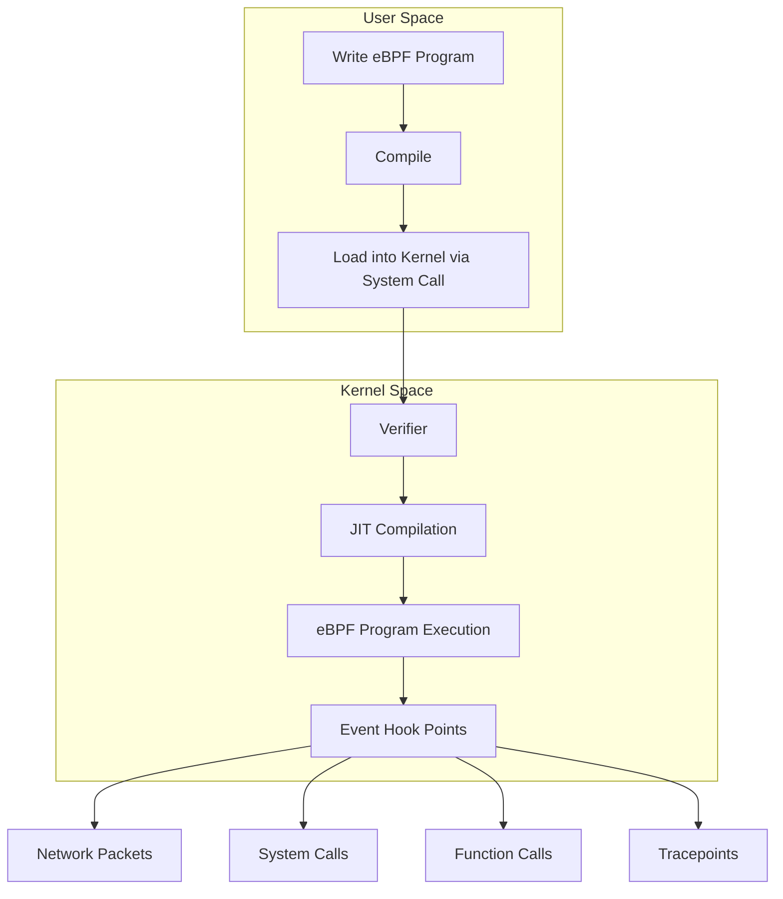
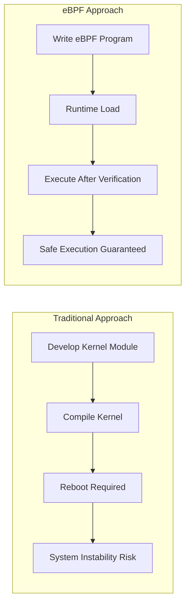
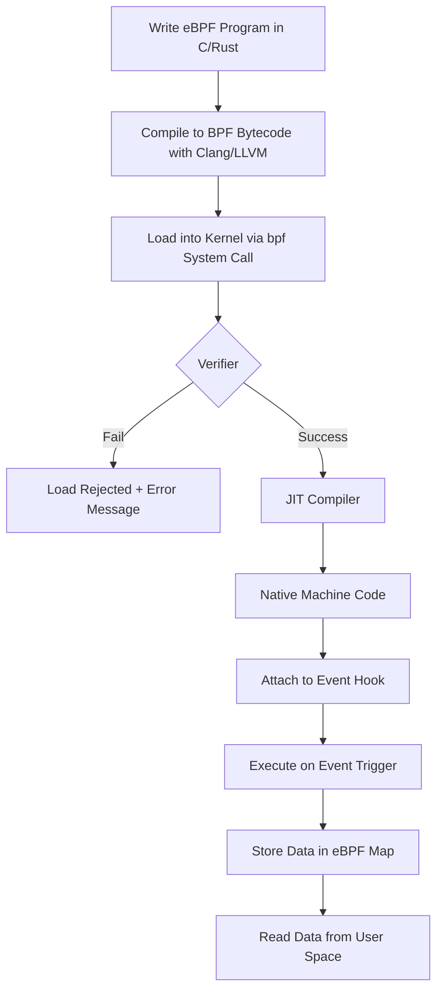
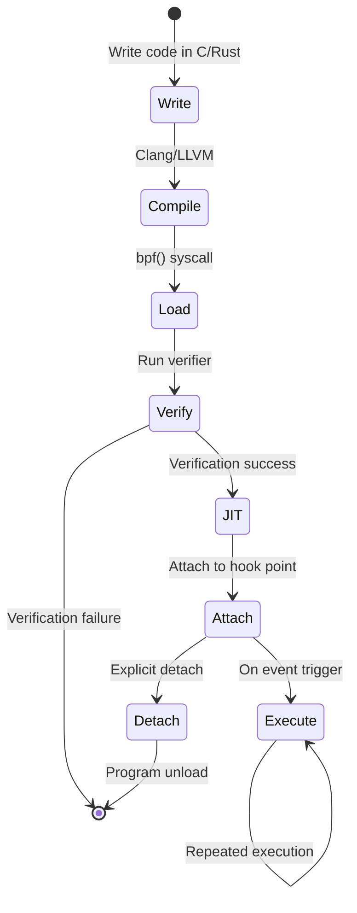
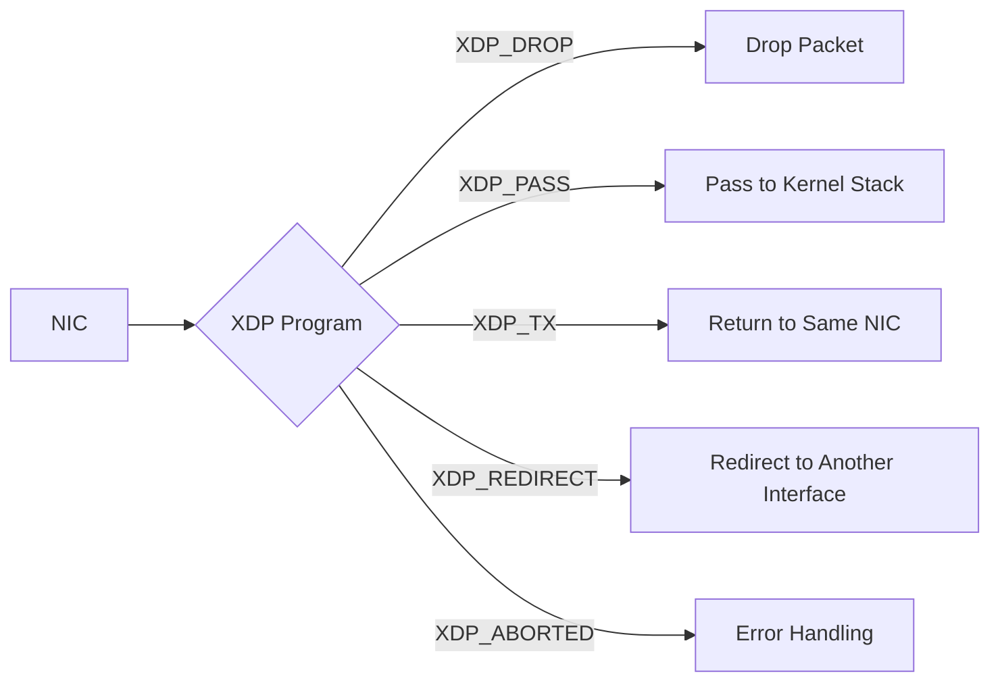
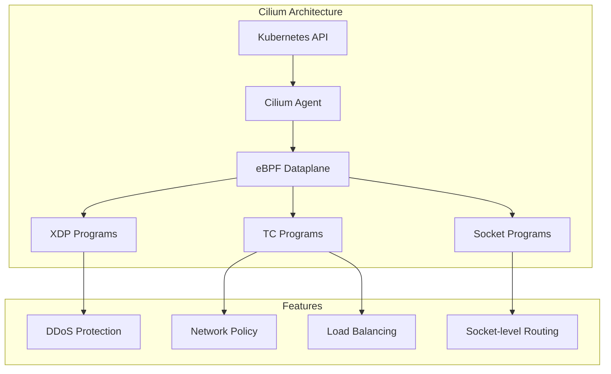
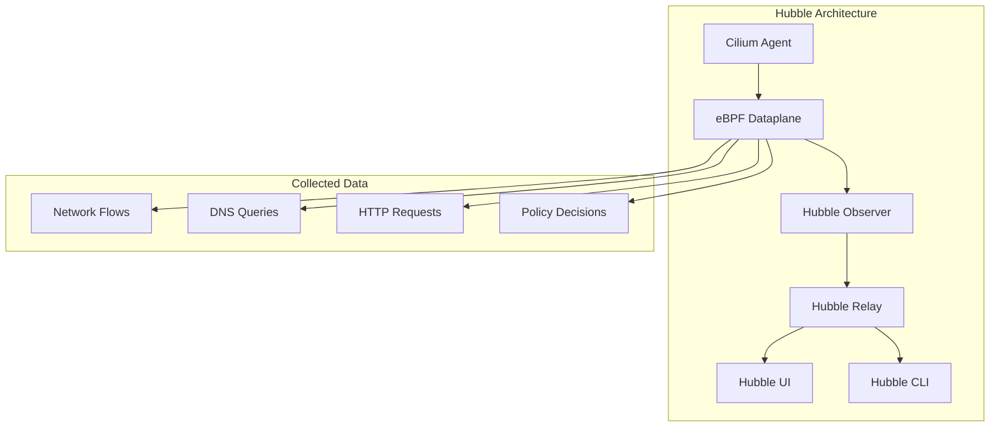
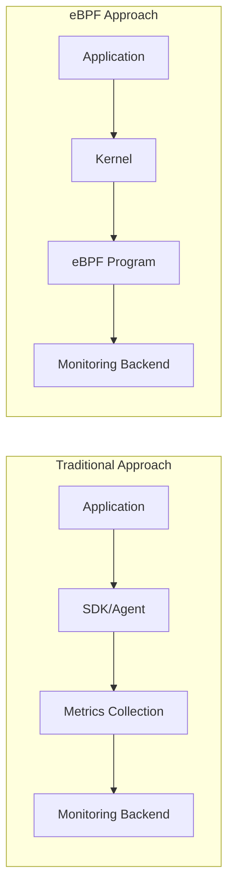
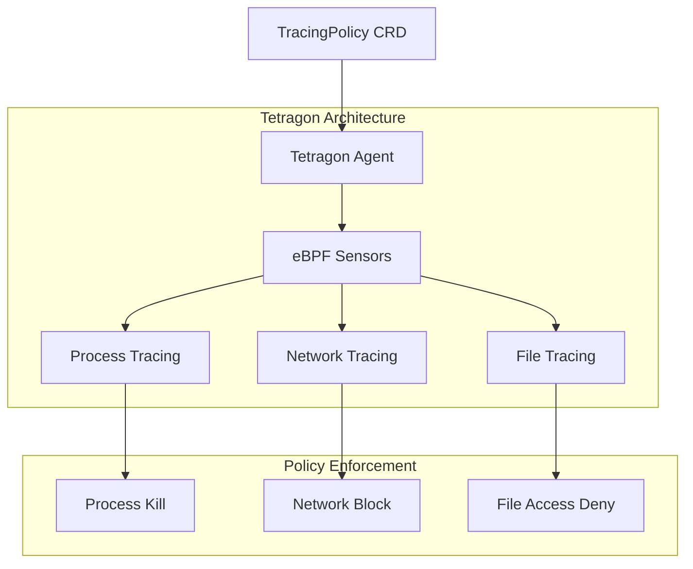

# Fundamentos de eBPF y aplicaciones en Kubernetes

> **Versiones compatibles**: Linux Kernel 4.18+, Kubernetes 1.25+
> **Última actualización**: February 2025

eBPF es una tecnología revolucionaria que permite ejecutar programas aislados dentro del kernel de Linux. Este documento cubre desde los conceptos básicos de eBPF hasta aplicaciones prácticas en entornos Kubernetes.

## Tabla de contenidos

* [1. Introducción a eBPF](#1-introduction-to-ebpf)
* [2. Arquitectura de eBPF](#2-ebpf-architecture)
* [3. Tipos de programas eBPF](#3-ebpf-program-types)
* [4. Herramientas de desarrollo de eBPF](#4-ebpf-development-tools)
* [5. eBPF y redes en Kubernetes](#5-ebpf-and-kubernetes-networking)
* [6. Observabilidad basada en eBPF](#6-ebpf-based-observability)
* [7. Seguridad basada en eBPF](#7-ebpf-based-security)
* [8. Ejemplos prácticos de eBPF](#8-practical-ebpf-examples)
* [9. Limitaciones y consideraciones de eBPF](#9-ebpf-limitations-and-considerations)
* [10. Próximos pasos](#10-next-steps)

## Configuración del entorno de laboratorio

Para seguir los ejemplos de este documento, necesitas el siguiente entorno.

### Prerrequisitos
- Kernel de Linux 4.18 o superior (se recomienda 5.10+)
- bpftool, bcc-tools
- Cluster de Kubernetes (opcional)

### Configuración del entorno

```bash
# Install required packages on Ubuntu/Debian
sudo apt-get update
sudo apt-get install -y linux-tools-common linux-tools-generic bpfcc-tools

# Check kernel version
uname -r

# Verify eBPF feature support
sudo bpftool feature
```

---

## 1. Introducción a eBPF

### 1.1 ¿Qué es eBPF?

**eBPF (extended Berkeley Packet Filter)** es una tecnología que permite que programas definidos por el usuario se ejecuten de forma segura dentro del kernel de Linux. Diseñado originalmente para el filtrado de paquetes de red como BPF, se ha ampliado y ahora se utiliza en diversas áreas, incluidas redes, seguridad, trazado y análisis de rendimiento.

> **Concepto clave**: eBPF permite extender y observar el comportamiento del kernel sin modificar el código fuente del kernel ni cargar módulos del kernel.



### 1.2 Evolución de BPF tradicional a eBPF

**BPF original (1992)**:
- Desarrollado en UC Berkeley
- Dedicado a la captura y el filtrado de paquetes de red
- 2 registros de 32 bits
- Límite máximo de 4,096 instrucciones

**eBPF (2014~)**:
- Soporte para arquitectura de 64 bits
- 11 registros
- Almacenamiento de estado mediante Maps
- Soporte para varios puntos de hook
- Rendimiento nativo mediante compilación JIT

| Característica | BPF tradicional | eBPF |
|---------|-----------------|------|
| Registros | 2 (32-bit) | 11 (64-bit) |
| Recuento de instrucciones | 4,096 | 1 millón+ |
| Soporte de Map | Ninguno | Varios tipos de map |
| Caso de uso | Filtrado de paquetes | Programación de kernel de propósito general |
| Capacidades de llamada | Ninguna | Helper functions, llamadas BPF-to-BPF |
| Almacenamiento de estado | No es posible | Posible mediante maps |

### 1.3 Por qué eBPF es revolucionario

eBPF es revolucionario por las siguientes razones:

1. **Extensión de funcionalidades sin modificar el kernel**: Extiende funcionalidades del kernel sin cambiar el código fuente del kernel
2. **Ejecución segura**: El verifier garantiza la seguridad del programa
3. **Alto rendimiento**: Rendimiento a nivel de código nativo mediante compilación JIT
4. **Carga dinámica**: Carga/descarga programas sin reiniciar
5. **Estabilidad en producción**: Ejecución segura sin bloqueos ni bucles infinitos



### 1.4 Comparación entre eBPF y Kernel Module

| Aspecto | eBPF | Kernel Module |
|--------|------|---------------|
| **Seguridad** | El verifier garantiza la seguridad | Puede bloquear el kernel |
| **Portabilidad** | Independiente de la versión del kernel con CO-RE | Requiere recompilación por versión del kernel |
| **Carga** | Carga/descarga dinámica | Requiere insmod/rmmod |
| **Privilegios** | CAP_BPF o CAP_SYS_ADMIN | Se requieren privilegios de root |
| **Depuración** | Limitada | Es posible la depuración completa del kernel |
| **Rendimiento** | Optimizado mediante compilación JIT | Rendimiento nativo |
| **Alcance de funcionalidades** | Solo puntos de hook designados | Ilimitado |
| **Dificultad de desarrollo** | Relativamente fácil | Requiere alta experiencia |

---

## 2. Arquitectura de eBPF

### 2.1 Flujo de ejecución de eBPF



### 2.2 Verifier

El verifier es un mecanismo de seguridad central de eBPF. Verifica lo siguiente antes de que un programa se ejecute en el kernel:

**Elementos de verificación**:
- Sin bucles infinitos (verificación de estructura DAG)
- Sin acceso a memoria fuera de límites
- Sin uso de variables no inicializadas
- Llamadas correctas a helper functions
- Terminación garantizada del programa

```c
// Example rejected by verifier
int bad_example(void *ctx) {
    int i;
    for (i = 0; i < 1000000; i++) {  // Potential infinite loop
        // ...
    }
    return 0;
}

// Example allowed by verifier
int good_example(void *ctx) {
    #pragma unroll
    for (int i = 0; i < 10; i++) {  // Unrolled at compile time
        // ...
    }
    return 0;
}
```

### 2.3 Compilador JIT

El compilador JIT (Just-In-Time) convierte el bytecode de eBPF en código de máquina nativo:

```bash
# Check JIT compiler status
cat /proc/sys/net/core/bpf_jit_enable

# Enable JIT compiler (0: disabled, 1: enabled, 2: debug mode)
echo 1 | sudo tee /proc/sys/net/core/bpf_jit_enable
```

**Beneficios de la compilación JIT**:
- Mejora de rendimiento de 4 a 5 veces frente al intérprete
- Ejecución directa como instrucciones nativas de CPU
- Aplicación de optimizaciones específicas de la arquitectura

### 2.4 eBPF Maps

eBPF maps son estructuras de datos para compartir datos entre el kernel y el user space, y para almacenar estado.

**Tipos principales de Map**:

| Tipo de Map | Descripción | Caso de uso |
|----------|-------------|----------|
| `BPF_MAP_TYPE_HASH` | Tabla hash | Almacenamiento clave-valor, seguimiento de conexiones |
| `BPF_MAP_TYPE_ARRAY` | Array de tamaño fijo | Acceso basado en índice, valores de configuración |
| `BPF_MAP_TYPE_PERF_EVENT_ARRAY` | Array de eventos | Enviar eventos al user space |
| `BPF_MAP_TYPE_RINGBUF` | Ring buffer | Streaming de eventos de alto rendimiento |
| `BPF_MAP_TYPE_LRU_HASH` | LRU hash | Caché, expulsión automática de entradas |
| `BPF_MAP_TYPE_PERCPU_ARRAY` | Array por CPU | Recopilación de estadísticas sin locks |
| `BPF_MAP_TYPE_LPM_TRIE` | LPM trie | Coincidencia de direcciones IP, enrutamiento |

```c
// Hash map definition example
struct {
    __uint(type, BPF_MAP_TYPE_HASH);
    __uint(max_entries, 1024);
    __type(key, __u32);      // Key: Process ID
    __type(value, __u64);    // Value: Counter
} packet_count SEC(".maps");
```

### 2.5 Helper Functions

Los programas eBPF acceden a funciones del kernel mediante helper functions proporcionadas por el kernel.

**Helper Functions clave**:

```c
// Map manipulation
void *bpf_map_lookup_elem(struct bpf_map *map, const void *key);
int bpf_map_update_elem(struct bpf_map *map, const void *key, const void *value, u64 flags);
int bpf_map_delete_elem(struct bpf_map *map, const void *key);

// Time-related
u64 bpf_ktime_get_ns(void);  // Current time in nanoseconds

// Packet manipulation
int bpf_skb_load_bytes(const struct sk_buff *skb, u32 offset, void *to, u32 len);
int bpf_xdp_adjust_head(struct xdp_md *xdp_md, int delta);

// Tracing
int bpf_probe_read(void *dst, u32 size, const void *src);
int bpf_trace_printk(const char *fmt, u32 fmt_size, ...);

// Process information
u64 bpf_get_current_pid_tgid(void);    // Get PID/TGID
u64 bpf_get_current_uid_gid(void);     // Get UID/GID
int bpf_get_current_comm(void *buf, u32 size);  // Process name
```

### 2.6 Ciclo de vida del programa



---

## 3. Tipos de programas eBPF

### 3.1 XDP (eXpress Data Path)

XDP es la forma más rápida de procesar paquetes a nivel del driver de red.



**Modos de operación de XDP**:
| Modo | Descripción | Rendimiento |
|------|-------------|-------------|
| Native XDP | Se ejecuta directamente en el driver de NIC | Máximo |
| Offloaded XDP | Se ejecuta en una smart NIC | Máximo+ |
| Generic XDP | Emulación por software | Para pruebas |

```c
// XDP program example: Drop traffic on specific port
SEC("xdp")
int xdp_drop_port(struct xdp_md *ctx) {
    void *data = (void *)(long)ctx->data;
    void *data_end = (void *)(long)ctx->data_end;

    struct ethhdr *eth = data;
    if ((void *)(eth + 1) > data_end)
        return XDP_PASS;

    if (eth->h_proto != htons(ETH_P_IP))
        return XDP_PASS;

    struct iphdr *ip = (void *)(eth + 1);
    if ((void *)(ip + 1) > data_end)
        return XDP_PASS;

    if (ip->protocol != IPPROTO_TCP)
        return XDP_PASS;

    struct tcphdr *tcp = (void *)ip + (ip->ihl * 4);
    if ((void *)(tcp + 1) > data_end)
        return XDP_PASS;

    // Drop port 8080 traffic
    if (tcp->dest == htons(8080))
        return XDP_DROP;

    return XDP_PASS;
}
```

### 3.2 TC (Traffic Control)

Los programas TC se ejecutan en la capa de control de tráfico del stack de red.

```bash
# TC program attachment example
tc qdisc add dev eth0 clsact
tc filter add dev eth0 ingress bpf da obj tc_prog.o sec classifier
tc filter add dev eth0 egress bpf da obj tc_prog.o sec classifier
```

**Comparación entre TC y XDP**:
| Característica | XDP | TC |
|---------|-----|-----|
| Ubicación de ejecución | Nivel de driver | Stack de red |
| Rendimiento | Máximo | Alto |
| Acceso a SKB | No es posible | Posible |
| Dirección | Solo ingress | Ingress y egress |
| Modificación de paquetes | Limitada | Flexible |

### 3.3 Kprobes/Uprobes

Kprobes y Uprobes trazan dinámicamente llamadas a funciones.

```c
// Kprobe example: Trace tcp_connect function
SEC("kprobe/tcp_connect")
int BPF_KPROBE(trace_tcp_connect, struct sock *sk) {
    u32 pid = bpf_get_current_pid_tgid() >> 32;

    // Get destination IP address
    u32 daddr = BPF_CORE_READ(sk, __sk_common.skc_daddr);
    u16 dport = BPF_CORE_READ(sk, __sk_common.skc_dport);

    bpf_printk("PID %d connecting to %pI4:%d\n", pid, &daddr, ntohs(dport));
    return 0;
}

// Uprobe example: Trace malloc function
SEC("uprobe/libc.so.6:malloc")
int BPF_UPROBE(trace_malloc, size_t size) {
    u32 pid = bpf_get_current_pid_tgid() >> 32;
    bpf_printk("PID %d malloc(%zu)\n", pid, size);
    return 0;
}
```

### 3.4 Tracepoints

Los tracepoints son puntos de trazado estáticos predefinidos en el kernel.

```bash
# Check available tracepoints
sudo ls /sys/kernel/debug/tracing/events/

# Tracepoints in specific categories
sudo ls /sys/kernel/debug/tracing/events/sched/
sudo ls /sys/kernel/debug/tracing/events/syscalls/
```

```c
// Tracepoint example: Trace process execution
SEC("tracepoint/sched/sched_process_exec")
int handle_exec(struct trace_event_raw_sched_process_exec *ctx) {
    char comm[16];
    bpf_get_current_comm(&comm, sizeof(comm));

    u32 pid = bpf_get_current_pid_tgid() >> 32;
    bpf_printk("Process started: %s (PID: %d)\n", comm, pid);

    return 0;
}
```

### 3.5 LSM (Linux Security Module) BPF

LSM BPF aplica políticas de seguridad dinámicamente.

```c
// LSM BPF example: Restrict file opening
SEC("lsm/file_open")
int BPF_PROG(restrict_file_open, struct file *file, int ret) {
    if (ret != 0)
        return ret;

    char path[256];
    bpf_d_path(&file->f_path, path, sizeof(path));

    // Block access to /etc/shadow
    if (bpf_strncmp(path, 11, "/etc/shadow") == 0)
        return -EACCES;

    return 0;
}
```

### 3.6 Socket Filter

Filtra paquetes a nivel de socket.

```c
// Socket Filter example
SEC("socket")
int socket_filter(struct __sk_buff *skb) {
    // Allow only IPv4 packets
    if (skb->protocol != htons(ETH_P_IP))
        return 0;  // Drop

    return skb->len;  // Return packet length (allow)
}
```

### 3.7 Programas Cgroup

Controla recursos y redes de contenedores.

```c
// Cgroup socket program example: Block external connections
SEC("cgroup/connect4")
int restrict_connect(struct bpf_sock_addr *ctx) {
    // Block connections that are not to local network
    __u32 dst = ctx->user_ip4;

    // Allow only 10.0.0.0/8 range
    if ((dst & 0xFF) != 10)
        return 0;  // Deny connection

    return 1;  // Allow connection
}
```

---

## 4. Herramientas de desarrollo de eBPF

### 4.1 bpftool

bpftool es la herramienta oficial para gestionar programas y maps de eBPF.

```bash
# List loaded eBPF programs
sudo bpftool prog list

# Program details
sudo bpftool prog show id <ID>

# Program dump (bytecode)
sudo bpftool prog dump xlated id <ID>

# JIT compiled code dump
sudo bpftool prog dump jited id <ID>

# Map list
sudo bpftool map list

# Query map contents
sudo bpftool map dump id <MAP_ID>

# Add value to map
sudo bpftool map update id <MAP_ID> key 0x01 0x00 0x00 0x00 value 0xFF 0x00 0x00 0x00

# Check kernel eBPF features
sudo bpftool feature

# BTF (BPF Type Format) information
sudo bpftool btf list
```

### 4.2 bpftrace

bpftrace es un lenguaje de trazado de alto nivel al estilo DTrace.

```bash
# Installation
sudo apt-get install -y bpftrace

# System call count
sudo bpftrace -e 'tracepoint:raw_syscalls:sys_enter { @[comm] = count(); }'

# Read bytes per process
sudo bpftrace -e 'tracepoint:syscalls:sys_exit_read /args->ret > 0/ { @bytes[comm] = sum(args->ret); }'

# File open tracing
sudo bpftrace -e 'tracepoint:syscalls:sys_enter_openat { printf("%s opened %s\n", comm, str(args->filename)); }'

# TCP connection tracing
sudo bpftrace -e 'kprobe:tcp_connect { printf("%s -> %s\n", ntop(((struct sock *)arg0)->__sk_common.skc_rcv_saddr), ntop(((struct sock *)arg0)->__sk_common.skc_daddr)); }'

# Latency histogram
sudo bpftrace -e 'kprobe:vfs_read { @start[tid] = nsecs; } kretprobe:vfs_read /@start[tid]/ { @ns = hist(nsecs - @start[tid]); delete(@start[tid]); }'
```

**One-liners útiles de bpftrace**:

```bash
# Top CPU-consuming processes
sudo bpftrace -e 'profile:hz:99 { @[comm] = count(); }'

# Block I/O latency
sudo bpftrace -e 'tracepoint:block:block_rq_issue { @start[args->dev, args->sector] = nsecs; } tracepoint:block:block_rq_complete /@start[args->dev, args->sector]/ { @usecs = hist((nsecs - @start[args->dev, args->sector]) / 1000); delete(@start[args->dev, args->sector]); }'

# New process tracing
sudo bpftrace -e 'tracepoint:sched:sched_process_exec { printf("%-10d %-16s\n", pid, comm); }'

# Memory allocation tracing
sudo bpftrace -e 'tracepoint:kmem:kmalloc { @bytes = hist(args->bytes_alloc); }'
```

### 4.3 BCC (BPF Compiler Collection)

BCC es un toolkit que permite escribir programas eBPF mediante Python y Lua.

```bash
# Installation
sudo apt-get install -y bpfcc-tools python3-bpfcc

# Included tools
ls /usr/share/bcc/tools/
```

**Herramientas BCC clave**:

| Herramienta | Descripción |
|------|-------------|
| `execsnoop` | Traza nuevas ejecuciones de procesos |
| `opensnoop` | Traza aperturas de archivos |
| `biolatency` | Latencia de Block I/O |
| `tcpconnect` | Traza conexiones TCP |
| `tcpaccept` | Traza conexiones TCP entrantes |
| `tcpretrans` | Traza retransmisiones TCP |
| `runqlat` | Latencia de la cola de ejecución de CPU |
| `profile` | Perfilado de CPU |
| `funccount` | Recuento de llamadas a funciones |
| `trace` | Trazado general de funciones |

```bash
# Usage examples
sudo /usr/share/bcc/tools/execsnoop    # Trace process execution
sudo /usr/share/bcc/tools/tcpconnect   # Trace TCP connections
sudo /usr/share/bcc/tools/biolatency   # Disk I/O latency
sudo /usr/share/bcc/tools/profile -F 99 10  # CPU profiling for 10 seconds
```

### 4.4 libbpf y CO-RE

libbpf es una biblioteca en C para cargar programas eBPF y soporta CO-RE (Compile Once, Run Everywhere).

**Beneficios de CO-RE**:
- Ejecutar programas eBPF compilados en diversas versiones del kernel
- Reubicación de structs usando BTF (BPF Type Format)
- Menores dependencias de headers del kernel

```c
// Example using CO-RE
#include "vmlinux.h"
#include <bpf/bpf_helpers.h>
#include <bpf/bpf_core_read.h>

SEC("kprobe/do_sys_open")
int BPF_KPROBE(do_sys_open, int dfd, const char *filename) {
    u32 pid = bpf_get_current_pid_tgid() >> 32;

    char fname[256];
    bpf_probe_read_user_str(fname, sizeof(fname), filename);

    bpf_printk("PID %d opened: %s\n", pid, fname);
    return 0;
}

char LICENSE[] SEC("license") = "GPL";
```

**Generación y verificación de BTF**:

```bash
# Check BTF support
ls /sys/kernel/btf/vmlinux

# Generate vmlinux.h (for CO-RE development)
bpftool btf dump file /sys/kernel/btf/vmlinux format c > vmlinux.h

# Check program BTF information
bpftool prog show id <ID> --pretty
```

---

## 5. eBPF y redes en Kubernetes

### 5.1 Cilium: CNI basado en eBPF

Cilium es el CNI (Container Network Interface) de Kubernetes más representativo que utiliza eBPF.



#### Reemplazo de kube-proxy

Cilium puede reemplazar completamente kube-proxy usando eBPF.

**kube-proxy tradicional (modo iptables)**:
```
Packet → Netfilter → iptables rule evaluation → DNAT → Routing
```

**Modo eBPF de Cilium**:
```
Packet → eBPF map lookup → Direct routing
```

```bash
# Install Cilium (kube-proxy replacement mode)
helm install cilium cilium/cilium --version 1.14.0 \
  --namespace kube-system \
  --set kubeProxyReplacement=strict \
  --set k8sServiceHost=${API_SERVER_IP} \
  --set k8sServicePort=${API_SERVER_PORT}

# Remove kube-proxy
kubectl -n kube-system delete ds kube-proxy
kubectl -n kube-system delete cm kube-proxy
```

#### Network Policy

Cilium aplica políticas de red L3/L4/L7 usando eBPF.

```yaml
# Cilium network policy example
apiVersion: cilium.io/v2
kind: CiliumNetworkPolicy
metadata:
  name: allow-http-only
spec:
  endpointSelector:
    matchLabels:
      app: web
  ingress:
    - fromEndpoints:
        - matchLabels:
            app: frontend
      toPorts:
        - ports:
            - port: "80"
              protocol: TCP
          rules:
            http:
              - method: GET
                path: "/api/.*"
```

#### Load Balancing

```yaml
# Cilium LoadBalancer service example
apiVersion: v1
kind: Service
metadata:
  name: my-service
  annotations:
    io.cilium/lb-ipam-ips: "192.168.1.100"
spec:
  type: LoadBalancer
  selector:
    app: my-app
  ports:
    - port: 80
      targetPort: 8080
```

### 5.2 Modo eBPF de Calico

Calico también soporta dataplane eBPF.

```bash
# Enable Calico eBPF mode
kubectl patch installation.operator.tigera.io default --type merge -p '{"spec":{"calicoNetwork":{"linuxDataplane":"BPF"}}}'
```

**Características del modo eBPF de Calico**:
- Preservación de IP de origen
- Soporte de Direct Server Return (DSR)
- Políticas de host endpoint
- Comunicación cifrada entre nodos

### 5.3 Comparación de rendimiento: iptables vs eBPF

| Aspecto | iptables | eBPF |
|--------|----------|------|
| **Escalabilidad** | O(n) - proporcional al número de Services | O(1) - búsqueda en map |
| **Latencia** | Aumenta con el número de reglas | Constante |
| **Uso de CPU** | Alto | Bajo |
| **Actualizaciones** | Reescritura completa de la tabla | Actualización de entrada de map |
| **Observabilidad** | Limitada | Integración con Hubble |
| **Memoria** | Memoria por regla | Estructura de map optimizada |

**Resultados de benchmark** (basados en 1000 Services):

```
| Metric                  | iptables    | eBPF      | Improvement |
|------------------------|-------------|-----------|-------------|
| Connection setup time  | 2.5ms       | 0.3ms     | 8.3x        |
| CPU usage              | 15%         | 3%        | 5x          |
| Memory usage           | 256MB       | 32MB      | 8x          |
| Connections per second | 50,000      | 250,000   | 5x          |
```

```bash
# Check Cilium status
cilium status

# Check eBPF maps
cilium bpf lb list
cilium bpf ct list global

# Network policy status
cilium policy get
```

---

## 6. Observabilidad basada en eBPF

eBPF permite una observación profunda del comportamiento del sistema y de las aplicaciones. A diferencia del monitoreo tradicional basado en agentes, eBPF recopila datos a nivel del kernel, proporcionando información más rica con menor overhead.

### 6.1 Hubble: observabilidad de red de Cilium

Hubble es una plataforma de observabilidad de red integrada en Cilium.



```bash
# Install Hubble
helm upgrade cilium cilium/cilium --version 1.14.0 \
  --namespace kube-system \
  --reuse-values \
  --set hubble.relay.enabled=true \
  --set hubble.ui.enabled=true

# Use Hubble CLI
hubble observe --pod my-pod
hubble observe --namespace default
hubble observe --protocol http
hubble observe --verdict DROPPED

# Observe traffic between specific services
hubble observe --from-pod default/frontend --to-pod default/backend

# Real-time network flow monitoring
hubble observe -f --type trace

# Generate service map
hubble observe --namespace default -o jsonpb | hubble relay --serviceMap
```

**Acceso a Hubble UI**:

```bash
# Port forwarding
kubectl port-forward -n kube-system svc/hubble-ui 12000:80

# Access http://localhost:12000 in browser
```

### 6.2 Pixie: observabilidad con autoinstrumentación

Pixie usa eBPF para recopilar telemetría automáticamente sin modificar el código de la aplicación.

**Características de Pixie**:
- Parsing automático de protocolos (HTTP, gRPC, MySQL, PostgreSQL, Kafka, etc.)
- Generación automática de service map
- Trazado distribuido
- Perfilado de CPU
- Logging dinámico

```bash
# Install Pixie
px deploy

# Pixie CLI query examples
# HTTP request latency
px script run px/http_data

# Traffic between services
px script run px/service_stats

# Slow request analysis
px script run px/slow_requests -- start_time=-5m latency_ns=100000000

# Pod resource usage
px script run px/pod_stats
```

**Ejemplo de PxL (Pixie Query Language)**:

```python
# Find slow HTTP requests
import px

df = px.DataFrame(table='http_events', start_time='-5m')
df = df[df.latency > 100000000]  # Over 100ms
df = df.groupby(['service', 'req_path']).agg(
    count=('latency', px.count),
    avg_latency=('latency', px.mean),
    p99_latency=('latency', px.quantiles, 0.99)
)
px.display(df)
```

### 6.3 Coroot: monitoreo "No-Code"

Coroot usa eBPF para monitorear sistemas automáticamente sin configuración adicional.

```bash
# Install Coroot with Helm
helm repo add coroot https://coroot.github.io/helm-charts
helm install coroot coroot/coroot -n coroot --create-namespace
```

**Características de Coroot**:
- Descubrimiento automático de Services
- Generación automática de mapa de dependencias
- Monitoreo de SLO
- Detección de anomalías
- Análisis de causa raíz

### 6.4 Kepler: monitoreo de consumo de energía

Kepler (Kubernetes-based Efficient Power Level Exporter) usa eBPF para monitorear el consumo de energía de contenedores.

```bash
# Install Kepler
kubectl apply -f https://raw.githubusercontent.com/sustainable-computing-io/kepler/main/manifests/kubernetes/deployment.yaml

# Check Prometheus metrics
curl localhost:9103/metrics | grep kepler
```

**Métricas de Kepler**:
- `kepler_container_joules_total`: Consumo de energía por contenedor
- `kepler_container_gpu_joules_total`: Consumo de energía de GPU
- `kepler_node_core_joules_total`: Energía de CPU del nodo

### 6.5 Comparación entre agentes tradicionales e instrumentación eBPF

| Aspecto | Agentes tradicionales | Instrumentación eBPF |
|--------|-------------------|---------------------|
| **Overhead** | Alto (5-15%) | Bajo (<1%) |
| **Modificación de código** | Requerida (SDK/biblioteca) | No requerida |
| **Cobertura** | Solo partes instrumentadas | Todo el sistema |
| **Despliegue** | Por aplicación | Por nodo |
| **Privilegios** | Privilegios normales | Requiere CAP_BPF |
| **Profundidad de datos** | Nivel de aplicación | Nivel de kernel |
| **Soporte de protocolos** | Se necesita soporte explícito | Parsing automático |



---

## 7. Seguridad basada en eBPF

### 7.1 Tetragon: seguridad en runtime

Tetragon es una solución de seguridad en runtime basada en eBPF proporcionada por el proyecto Cilium.



```bash
# Install Tetragon
helm repo add cilium https://helm.cilium.io
helm install tetragon cilium/tetragon -n kube-system

# Observe events
kubectl logs -n kube-system -l app.kubernetes.io/name=tetragon -c export-stdout -f | tetra getevents -o compact
```

**Ejemplos de TracingPolicy**:

```yaml
# Monitor sensitive file access
apiVersion: cilium.io/v1alpha1
kind: TracingPolicy
metadata:
  name: sensitive-file-access
spec:
  kprobes:
    - call: security_file_open
      syscall: false
      args:
        - index: 0
          type: file
      selectors:
        - matchArgs:
            - index: 0
              operator: Prefix
              values:
                - /etc/shadow
                - /etc/passwd
                - /etc/sudoers
          matchActions:
            - action: Sigkill  # Terminate process
```

```yaml
# Network connection control
apiVersion: cilium.io/v1alpha1
kind: TracingPolicy
metadata:
  name: restrict-outbound
spec:
  kprobes:
    - call: tcp_connect
      syscall: false
      args:
        - index: 0
          type: sock
      selectors:
        - matchArgs:
            - index: 0
              operator: NotEqual
              values:
                - "10.0.0.0/8"  # Internal network
          matchActions:
            - action: Sigkill
```

### 7.2 Falco: detección de anomalías basada en eBPF

Falco es un proyecto CNCF que usa eBPF para detectar comportamiento anómalo en runtime.

```bash
# Install Falco (eBPF driver)
helm repo add falcosecurity https://falcosecurity.github.io/charts
helm install falco falcosecurity/falco \
  --namespace falco --create-namespace \
  --set driver.kind=modern_ebpf
```

**Ejemplos de reglas de Falco**:

```yaml
# Detect reading of /etc/shadow
- rule: Read sensitive file
  desc: Detect reading of sensitive files
  condition: >
    open_read and
    fd.name in (/etc/shadow, /etc/sudoers) and
    not proc.name in (systemd, sudo, login)
  output: >
    Sensitive file opened (file=%fd.name user=%user.name
    process=%proc.name container=%container.name)
  priority: WARNING

# Detect shell execution in container
- rule: Shell in container
  desc: Detect shell execution in container
  condition: >
    spawned_process and
    container and
    proc.name in (bash, sh, zsh, dash) and
    proc.pname != containerd-shim
  output: >
    Shell spawned in container (container=%container.name
    shell=%proc.name parent=%proc.pname)
  priority: NOTICE

# Detect privilege escalation
- rule: Privilege escalation
  desc: Detect privilege escalation attempts
  condition: >
    spawned_process and
    proc.name in (sudo, su, doas) and
    container
  output: >
    Privilege escalation attempt (user=%user.name
    command=%proc.cmdline container=%container.name)
  priority: WARNING
```

### 7.3 seccomp-bpf: filtrado de System Calls

seccomp-bpf usa BPF para restringir qué system calls puede realizar un proceso.

```yaml
# Apply seccomp profile in Kubernetes Pod
apiVersion: v1
kind: Pod
metadata:
  name: secure-pod
spec:
  securityContext:
    seccompProfile:
      type: RuntimeDefault  # or Localhost
  containers:
    - name: app
      image: nginx
```

**Perfil seccomp personalizado**:

```json
{
  "defaultAction": "SCMP_ACT_ERRNO",
  "architectures": ["SCMP_ARCH_X86_64"],
  "syscalls": [
    {
      "names": ["read", "write", "open", "close", "stat", "fstat", "mmap", "mprotect", "munmap", "brk", "rt_sigaction", "rt_sigprocmask", "ioctl", "access", "pipe", "select", "sched_yield", "mremap", "msync", "mincore", "madvise", "shmget", "shmat", "shmctl", "dup", "dup2", "pause", "nanosleep", "getitimer", "alarm", "setitimer", "getpid", "socket", "connect", "accept", "sendto", "recvfrom", "bind", "listen", "getsockname", "getpeername", "socketpair", "setsockopt", "getsockopt", "clone", "fork", "vfork", "execve", "exit", "wait4", "kill", "uname", "fcntl", "flock", "fsync", "fdatasync", "truncate", "ftruncate", "getdents", "getcwd", "chdir", "rename", "mkdir", "rmdir", "creat", "link", "unlink", "symlink", "readlink", "chmod", "fchmod", "chown", "fchown", "lchown", "umask", "gettimeofday", "getrlimit", "getrusage", "sysinfo", "times", "ptrace", "getuid", "syslog", "getgid", "setuid", "setgid", "geteuid", "getegid", "setpgid", "getppid", "getpgrp", "setsid", "setreuid", "setregid", "getgroups", "setgroups", "setresuid", "getresuid", "setresgid", "getresgid", "getpgid", "setfsuid", "setfsgid", "getsid", "capget", "capset", "rt_sigpending", "rt_sigtimedwait", "rt_sigqueueinfo", "rt_sigsuspend", "sigaltstack", "utime", "mknod", "personality", "ustat", "statfs", "fstatfs", "sysfs", "getpriority", "setpriority", "sched_setparam", "sched_getparam", "sched_setscheduler", "sched_getscheduler", "sched_get_priority_max", "sched_get_priority_min", "sched_rr_get_interval", "mlock", "munlock", "mlockall", "munlockall", "vhangup", "pivot_root", "prctl", "arch_prctl", "adjtimex", "setrlimit", "chroot", "sync", "acct", "settimeofday", "mount", "umount2", "swapon", "swapoff", "reboot", "sethostname", "setdomainname", "ioperm", "iopl", "create_module", "init_module", "delete_module", "get_kernel_syms", "query_module", "quotactl", "nfsservctl", "getpmsg", "putpmsg", "afs_syscall", "tuxcall", "security", "gettid", "readahead", "setxattr", "lsetxattr", "fsetxattr", "getxattr", "lgetxattr", "fgetxattr", "listxattr", "llistxattr", "flistxattr", "removexattr", "lremovexattr", "fremovexattr", "tkill", "time", "futex", "sched_setaffinity", "sched_getaffinity", "set_thread_area", "io_setup", "io_destroy", "io_getevents", "io_submit", "io_cancel", "get_thread_area", "lookup_dcookie", "epoll_create", "epoll_ctl_old", "epoll_wait_old", "remap_file_pages", "getdents64", "set_tid_address", "restart_syscall", "semtimedop", "fadvise64", "timer_create", "timer_settime", "timer_gettime", "timer_getoverrun", "timer_delete", "clock_settime", "clock_gettime", "clock_getres", "clock_nanosleep", "exit_group", "epoll_wait", "epoll_ctl", "tgkill", "utimes", "vserver", "mbind", "set_mempolicy", "get_mempolicy", "mq_open", "mq_unlink", "mq_timedsend", "mq_timedreceive", "mq_notify", "mq_getsetattr", "kexec_load", "waitid", "add_key", "request_key", "keyctl", "ioprio_set", "ioprio_get", "inotify_init", "inotify_add_watch", "inotify_rm_watch", "migrate_pages", "openat", "mkdirat", "mknodat", "fchownat", "futimesat", "newfstatat", "unlinkat", "renameat", "linkat", "symlinkat", "readlinkat", "fchmodat", "faccessat", "pselect6", "ppoll", "unshare", "set_robust_list", "get_robust_list", "splice", "tee", "sync_file_range", "vmsplice", "move_pages", "utimensat", "epoll_pwait", "signalfd", "timerfd_create", "eventfd", "fallocate", "timerfd_settime", "timerfd_gettime", "accept4", "signalfd4", "eventfd2", "epoll_create1", "dup3", "pipe2", "inotify_init1", "preadv", "pwritev", "rt_tgsigqueueinfo", "perf_event_open", "recvmmsg", "fanotify_init", "fanotify_mark", "prlimit64", "name_to_handle_at", "open_by_handle_at", "clock_adjtime", "syncfs", "sendmmsg", "setns", "getcpu", "process_vm_readv", "process_vm_writev", "kcmp", "finit_module", "sched_setattr", "sched_getattr", "renameat2", "seccomp", "getrandom", "memfd_create", "kexec_file_load", "bpf"],
      "action": "SCMP_ACT_ALLOW"
    }
  ]
}
```

### 7.4 LSM BPF: políticas de seguridad dinámicas

LSM BPF combina Linux Security Module con eBPF para aplicar políticas de seguridad dinámicamente.

```c
// LSM BPF example: Restrict executable files
SEC("lsm/bprm_check_security")
int BPF_PROG(restrict_exec, struct linux_binprm *bprm, int ret) {
    char filename[256];
    bpf_probe_read_kernel_str(filename, sizeof(filename), bprm->filename);

    // Block execution from /tmp
    if (bpf_strncmp(filename, 5, "/tmp/") == 0)
        return -EPERM;

    return 0;
}

// LSM BPF example: Restrict network sockets
SEC("lsm/socket_connect")
int BPF_PROG(restrict_connect, struct socket *sock, struct sockaddr *address, int addrlen, int ret) {
    if (ret != 0)
        return ret;

    struct sockaddr_in *addr = (struct sockaddr_in *)address;

    // Block connection to specific port
    if (ntohs(addr->sin_port) == 6666)
        return -EACCES;

    return 0;
}
```

---

## 8. Ejemplos prácticos de eBPF

### 8.1 Análisis de rendimiento del sistema con bpftrace

**Trazado de conexiones TCP**:

```bash
# TCP connection tracing
sudo bpftrace -e '
tracepoint:tcp:tcp_connect {
    printf("%s -> %s:%d\n",
        ntop(args->saddr),
        ntop(args->daddr),
        args->dport);
}'
```

**Análisis de latencia de System Calls**:

```bash
# Read system call latency histogram
sudo bpftrace -e '
tracepoint:syscalls:sys_enter_read { @start[tid] = nsecs; }
tracepoint:syscalls:sys_exit_read /@start[tid]/ {
    @latency = hist((nsecs - @start[tid]) / 1000);
    delete(@start[tid]);
}'
```

**Análisis de Disk I/O**:

```bash
# Block I/O request tracing
sudo bpftrace -e '
tracepoint:block:block_rq_issue {
    printf("%s %s %d\n",
        comm,
        args->rwbs,
        args->bytes / 1024);
}'

# I/O latency histogram
sudo bpftrace -e '
tracepoint:block:block_rq_issue { @start[args->dev, args->sector] = nsecs; }
tracepoint:block:block_rq_complete /@start[args->dev, args->sector]/ {
    @us = hist((nsecs - @start[args->dev, args->sector]) / 1000);
    delete(@start[args->dev, args->sector]);
}'
```

### 8.2 Observación de flujos de red con Cilium Hubble

```bash
# Real-time network flow observation
hubble observe -f

# Specific namespace traffic
hubble observe --namespace production

# Filter HTTP traffic only
hubble observe --protocol http

# Analyze dropped packets
hubble observe --verdict DROPPED

# DNS query tracing
hubble observe --protocol dns

# Traffic between specific Pods
hubble observe --from-pod default/frontend --to-pod default/backend

# Detailed analysis with JSON output
hubble observe --namespace default -o json | jq '.flow.destination.pod_name'

# Flow statistics
hubble observe --namespace default -o jsonpb | \
  jq -r '.flow | "\(.source.pod_name // .source.identity) -> \(.destination.pod_name // .destination.identity)"' | \
  sort | uniq -c | sort -rn | head -20
```

### 8.3 Monitoreo de seguridad de procesos con Tetragon

```bash
# Real-time Tetragon event monitoring
kubectl logs -n kube-system -l app.kubernetes.io/name=tetragon -c export-stdout -f | \
  tetra getevents -o compact

# Filter process execution events only
kubectl logs -n kube-system -l app.kubernetes.io/name=tetragon -c export-stdout -f | \
  tetra getevents -o compact --process-filter

# Events from specific namespace
kubectl logs -n kube-system -l app.kubernetes.io/name=tetragon -c export-stdout -f | \
  tetra getevents -o json | jq 'select(.process_exec.process.pod.namespace == "default")'
```

**Política de monitoreo de acceso a archivos**:

```yaml
apiVersion: cilium.io/v1alpha1
kind: TracingPolicy
metadata:
  name: file-access-monitor
spec:
  kprobes:
    - call: security_file_open
      syscall: false
      return: false
      args:
        - index: 0
          type: file
      selectors:
        - matchArgs:
            - index: 0
              operator: Prefix
              values:
                - /etc/
                - /var/run/secrets/
          matchActions:
            - action: Post
```

### 8.4 Análisis de latencia con eBPF

**Medición del tiempo de respuesta de Services**:

```bash
# HTTP request latency tracing (BCC)
sudo /usr/share/bcc/tools/funclatency 'c:read' -i 1

# TCP handshake latency
sudo bpftrace -e '
kprobe:tcp_v4_connect { @start[tid] = nsecs; }
kretprobe:tcp_v4_connect /@start[tid]/ {
    @connect_latency_us = hist((nsecs - @start[tid]) / 1000);
    delete(@start[tid]);
}'

# DNS lookup latency
sudo bpftrace -e '
tracepoint:net:net_dev_xmit /args->protocol == 0x0800/ {
    @dns_start[args->skbaddr] = nsecs;
}
tracepoint:net:netif_receive_skb /args->protocol == 0x0800 && @dns_start[args->skbaddr]/ {
    @dns_latency = hist((nsecs - @dns_start[args->skbaddr]) / 1000);
    delete(@dns_start[args->skbaddr]);
}'
```

**Script de análisis de rendimiento de aplicaciones**:

```bash
#!/bin/bash
# app-latency-analysis.bt

sudo bpftrace -e '
BEGIN {
    printf("Tracing application latency... Hit Ctrl-C to end.\n");
}

uprobe:/usr/lib/x86_64-linux-gnu/libc.so.6:malloc {
    @malloc_start[tid] = nsecs;
}

uretprobe:/usr/lib/x86_64-linux-gnu/libc.so.6:malloc /@malloc_start[tid]/ {
    @malloc_ns = hist(nsecs - @malloc_start[tid]);
    delete(@malloc_start[tid]);
}

kprobe:tcp_sendmsg {
    @send_start[tid] = nsecs;
}

kretprobe:tcp_sendmsg /@send_start[tid]/ {
    @tcp_send_ns = hist(nsecs - @send_start[tid]);
    delete(@send_start[tid]);
}

END {
    printf("\n=== Malloc Latency ===\n");
    print(@malloc_ns);
    printf("\n=== TCP Send Latency ===\n");
    print(@tcp_send_ns);
}
'
```

---

## 9. Limitaciones y consideraciones de eBPF

### 9.1 Limitaciones técnicas

| Limitación | Valor | Descripción |
|------------|-------|-------------|
| **Tamaño de stack** | 512 bytes | Límite del espacio de almacenamiento de variables locales |
| **Máx. instrucciones** | 1 millón | Límite de complejidad del programa |
| **Máx. llamadas anidadas** | 8 niveles | Profundidad de llamadas a funciones BPF-to-BPF |
| **Cantidad de entradas de map** | Varía por tipo de map | Depende de los límites de memoria |
| **Tamaño del programa** | Varía por tipo de map | Limitado después de la compilación JIT |

**Solución alternativa al límite de tamaño de stack**:

```c
// Bad example: Exceeds stack size
int bad_function(void *ctx) {
    char buffer[1024];  // Exceeds stack size!
    return 0;
}

// Good example: Use map
struct {
    __uint(type, BPF_MAP_TYPE_PERCPU_ARRAY);
    __uint(max_entries, 1);
    __type(key, __u32);
    __type(value, char[1024]);
} buffer_map SEC(".maps");

int good_function(void *ctx) {
    __u32 key = 0;
    char *buffer = bpf_map_lookup_elem(&buffer_map, &key);
    if (!buffer)
        return 0;
    // Use buffer
    return 0;
}
```

### 9.2 Limitaciones de bucles

El verifier de eBPF limita los bucles para garantizar la terminación del programa.

```c
// Rejected by verifier: Unbounded loop
for (int i = 0; i < n; i++) {  // n is determined at runtime
    // ...
}

// Allowed by verifier: Bounded loop (kernel 5.3+)
#pragma clang loop unroll(disable)
for (int i = 0; i < 100 && i < n; i++) {  // Upper bound specified
    // ...
}

// Allowed by verifier: Compile-time unrolling
#pragma unroll
for (int i = 0; i < 10; i++) {
    // ...
}

// Using bpf_loop helper (kernel 5.17+)
static int callback(u32 index, void *ctx) {
    // Iteration work
    return 0;
}

int main_prog(void *ctx) {
    bpf_loop(1000, callback, NULL, 0);
    return 0;
}
```

### 9.3 Compatibilidad de versiones del kernel

| Característica | Versión mínima del kernel |
|---------|----------------------|
| eBPF básico | 3.18 |
| XDP | 4.8 |
| BTF | 4.18 |
| CO-RE | 5.2 |
| BPF ring buffer | 5.8 |
| Bucles BPF | 5.3 |
| LSM BPF | 5.7 |
| bpf_loop helper | 5.17 |

```bash
# Check kernel version
uname -r

# Check eBPF feature support
sudo bpftool feature probe kernel

# Check BTF support
ls /sys/kernel/btf/vmlinux
```

### 9.4 Desafíos de depuración

Depurar programas eBPF difiere de los métodos tradicionales:

**Métodos de depuración**:

```c
// bpf_printk (for debugging, impacts performance)
bpf_printk("value = %d\n", value);

// Check debug messages
sudo cat /sys/kernel/debug/tracing/trace_pipe
```

```bash
# Check verifier log (on load failure)
sudo bpftool prog load my_prog.o /sys/fs/bpf/my_prog -d

# Check program statistics
sudo bpftool prog show id <ID> --json | jq '.run_time_ns, .run_cnt'

# Dump map contents
sudo bpftool map dump id <MAP_ID>
```

### 9.5 Requisitos de privilegios

| Privilegio | Propósito |
|-----------|---------|
| `CAP_BPF` | Cargar programas eBPF (kernel 5.8+) |
| `CAP_SYS_ADMIN` | Privilegios tradicionales de eBPF |
| `CAP_PERFMON` | Adjuntar a eventos de monitoreo de rendimiento |
| `CAP_NET_ADMIN` | Adjuntar programas XDP/TC |

```bash
# Check privileges
capsh --print

# Run program with specific privileges
sudo setcap cap_bpf,cap_perfmon+ep ./my_bpf_loader
```

**Configuración de privilegios en Kubernetes**:

```yaml
apiVersion: v1
kind: Pod
metadata:
  name: ebpf-pod
spec:
  containers:
    - name: ebpf-container
      image: my-ebpf-app
      securityContext:
        capabilities:
          add:
            - BPF
            - PERFMON
            - NET_ADMIN
        privileged: false
      volumeMounts:
        - name: bpf-maps
          mountPath: /sys/fs/bpf
        - name: debug
          mountPath: /sys/kernel/debug
  volumes:
    - name: bpf-maps
      hostPath:
        path: /sys/fs/bpf
    - name: debug
      hostPath:
        path: /sys/kernel/debug
```

### 9.6 Consideraciones de seguridad

Aunque eBPF es una herramienta poderosa, existen riesgos de seguridad:

- **Fuga de información**: Puede acceder a datos sensibles
- **Ataques DoS**: Puede causar degradación del rendimiento
- **Escalada de privilegios**: Pueden existir vulnerabilidades con una configuración incorrecta

**Mejores prácticas de seguridad**:

```bash
# Disable unprivileged eBPF
echo 0 | sudo tee /proc/sys/kernel/unprivileged_bpf_disabled

# BPF security lockdown
echo 1 | sudo tee /proc/sys/kernel/bpf_spec_v1
echo 2 | sudo tee /proc/sys/kernel/bpf_spec_v4
```

---

## 10. Próximos pasos

### 10.1 Quiz relacionado

Para verificar tu comprensión de este documento, prueba el siguiente quiz:

- [Quiz de fundamentos de eBPF](../quizzes/basics/05-ebpf-fundamentals-quiz.md)

### 10.2 Recursos de aprendizaje avanzado

**Documentación y recursos oficiales**:
- [eBPF.io](https://ebpf.io) - Documentación oficial de eBPF
- [Cilium Documentation](https://docs.cilium.io) - Documentación oficial de Cilium
- [BPF Performance Tools](https://www.brendangregg.com/bpf-performance-tools-book.html) - Libro de Brendan Gregg sobre herramientas de rendimiento BPF

**Entornos prácticos**:
- [eBPF Tutorial](https://github.com/lizrice/learning-ebpf) - Tutorial de eBPF de Liz Rice
- [BCC Tutorial](https://github.com/iovisor/bcc/blob/master/docs/tutorial.md) - Tutorial oficial de BCC
- [bpftrace Tutorial](https://github.com/iovisor/bpftrace/blob/master/docs/tutorial_one_liners.md) - Tutorial de one-liners de bpftrace

**Comunidad**:
- [eBPF Summit](https://ebpf.io/summit/) - Conferencia anual de eBPF
- [Cilium Slack](https://cilium.io/slack) - Comunidad de Cilium

### 10.3 Documentos relacionados

Para contenido avanzado relacionado con este documento, consulta lo siguiente:

| Tema | Enlace del documento | Descripción |
|-------|---------------|-------------|
| Introducción a Cilium | [Cilium Overview](../networking/cilium/01-introduction.md) | Introducción al CNI basado en eBPF |
| Profundización en eBPF | [eBPF Technical Deep Dive](../networking/cilium/02-ebpf.md) | Técnicas avanzadas de eBPF |
| Redes | [Cilium Networking](../networking/cilium/03-networking.md) | Implementación de redes con eBPF |
| Seguridad | [Cilium Security](../networking/cilium/06-security-visibility.md) | Seguridad basada en eBPF |
| Redes en Kubernetes | [Services and Networking](../core/03-services-networking.md) | Conceptos básicos de redes |

### 10.4 Checklist práctico

Checklist práctico para aprender eBPF:

```
[ ] Use bpftool to check loaded eBPF programs
[ ] Run system call tracing with bpftrace
[ ] Analyze network traffic with BCC tools
[ ] Install Cilium and observe network with Hubble
[ ] Monitor security events with Tetragon
[ ] Write and load a simple XDP program
```

---

## Resumen

eBPF es una tecnología revolucionaria que permite extender y observar de forma segura el comportamiento del kernel de Linux. A continuación se resume el contenido clave cubierto en este documento:

1. **Conceptos básicos de eBPF**: Programas aislados que se ejecutan de forma segura dentro del kernel
2. **Arquitectura**: Compuesta por verifier, compilador JIT, maps y helper functions
3. **Tipos de programas**: XDP, TC, Kprobes, Tracepoints, LSM BPF, etc.
4. **Herramientas de desarrollo**: bpftool, bpftrace, BCC, libbpf
5. **Aplicaciones en Kubernetes**: Redes de alto rendimiento con Cilium, modo eBPF de Calico
6. **Observabilidad**: Observación profunda del sistema mediante Hubble, Pixie, Coroot
7. **Seguridad**: Seguridad en runtime mediante Tetragon, Falco, seccomp-bpf
8. **Limitaciones**: Considerar tamaño de stack, bucles y compatibilidad de versiones del kernel

eBPF es una tecnología central que lidera el futuro de las redes, la seguridad y la observabilidad en entornos cloud-native.
