# Arquitectura del clúster

> **Versiones compatibles**: Kubernetes 1.32, 1.33, 1.34
> **Última actualización**: August 10, 2026

## Configuración del entorno de laboratorio

Para practicar los conceptos de este documento, necesita las siguientes herramientas y entorno:

### Herramientas necesarias
- kubectl v1.34 o superior
- Un clúster de Kubernetes funcional (EKS, minikube, kind, etc.)

### Configuración del entorno de desarrollo local

```bash
# Install minikube (for local development)
curl -LO https://storage.googleapis.com/minikube/releases/latest/minikube-linux-amd64
sudo install minikube-linux-amd64 /usr/local/bin/minikube

# Start cluster
minikube start

# Check cluster status
kubectl cluster-info

# Check control plane components
kubectl get pods -n kube-system
```

## Descripción general de la arquitectura del clúster

> **Concepto central**: Un clúster de Kubernetes consta del control plane y worker nodes, cada uno compuesto por varios componentes que desempeñan funciones específicas.

Un clúster de Kubernetes consta de un conjunto de nodes (máquinas virtuales o físicas) para ejecutar aplicaciones en contenedores. El clúster se divide principalmente en el control plane y los worker nodes.

### Diagrama de arquitectura del clúster

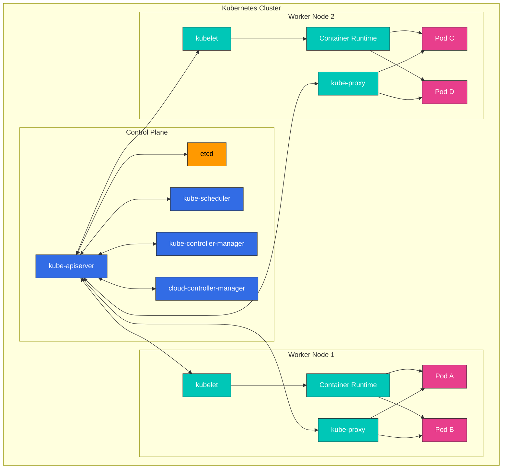

**Componentes del control plane**:
- **kube-apiserver**: Frontend que expone la API de Kubernetes
- **etcd**: Almacén clave-valor que guarda todos los datos del clúster
- **kube-scheduler**: Selecciona nodes para ejecutar pods recién creados
- **kube-controller-manager**: Ejecuta controllers que administran el estado del clúster
- **cloud-controller-manager**: Interactúa con las API del proveedor de nube

**Componentes de worker node**:
- **kubelet**: Agente que se ejecuta en cada node y administra la ejecución de contenedores
- **kube-proxy**: Mantiene reglas de red y realiza el reenvío de conexiones
- **Container Runtime**: Ejecuta contenedores (containerd, CRI-O, etc.)

## Componentes del control plane

El control plane actúa como el «cerebro» del clúster de Kubernetes, administrando y controlando el estado global del clúster. Los componentes del control plane normalmente se ejecutan en máquinas dedicadas y pueden replicarse en varias instancias para alta disponibilidad.

### Detalles de los componentes del control plane

| Componente | Funciones principales | Destinos de comunicación | Configuración de alta disponibilidad |
|-----------|---------------|----------------------|--------------------------------|
| **kube-apiserver** | - Proporciona la API de Kubernetes<br>- Autenticación y autorización<br>- Procesamiento de solicitudes de API | - Todos los componentes<br>- etcd | Escalado horizontal con varias instancias |
| **etcd** | - Almacena datos del clúster<br>- Almacén clave-valor distribuido<br>- Garantiza la consistencia | - kube-apiserver | Clúster multinodo |
| **kube-scheduler** | - Decisiones de ubicación de Pod<br>- Evalúa recursos de node<br>- Aplica afinidad/anti-afinidad | - kube-apiserver | Configuración activo-en-espera |
| **kube-controller-manager** | - Node controller<br>- Replication controller<br>- Endpoint controller<br>- Service account controller | - kube-apiserver | Configuración activo-en-espera |
| **cloud-controller-manager** | - Integración con proveedor de nube<br>- Ciclo de vida de node<br>- Enrutamiento y balanceo de carga | - kube-apiserver<br>- Cloud API | Configuración activo-en-espera |

### Flujo de comunicación del control plane

1. El usuario o controller envía una solicitud a kube-apiserver
2. kube-apiserver realiza autenticación, autorización y admisión
3. kube-apiserver lee/escribe datos desde/hacia etcd
4. Los controllers y el scheduler observan el estado del clúster mediante kube-apiserver
5. kubelet informa el estado de node a kube-apiserver

### kube-apiserver

kube-apiserver es el frontend del control plane que expone la API de Kubernetes. Todas las solicitudes internas y externas se procesan a través de este servidor de API.

**Funciones principales**:
- Proporciona API REST
- Autenticación y autorización
- Validación y procesamiento de solicitudes
- Comunicación con etcd
- Escalable horizontalmente (puede escalar a varias instancias)

**Indicadores y opciones de configuración principales**:
```bash
# Basic configuration example
kube-apiserver \
  --advertise-address=192.168.1.10 \
  --allow-privileged=true \
  --authorization-mode=Node,RBAC \
  --enable-admission-plugins=NodeRestriction \
  --enable-bootstrap-token-auth=true \
  --etcd-servers=https://127.0.0.1:2379 \
  --kubelet-client-certificate=/etc/kubernetes/pki/apiserver-kubelet-client.crt \
  --kubelet-client-key=/etc/kubernetes/pki/apiserver-kubelet-client.key \
  --service-account-key-file=/etc/kubernetes/pki/sa.pub \
  --service-cluster-ip-range=10.96.0.0/12 \
  --tls-cert-file=/etc/kubernetes/pki/apiserver.crt \
  --tls-private-key-file=/etc/kubernetes/pki/apiserver.key
```

**Seguridad del servidor de API**:
- Comunicación segura mediante certificados TLS
- Admite varios métodos de autenticación (certificados X.509, tokens de service account, OIDC, webhooks, etc.)
- Administración de permisos mediante RBAC (Role-Based Access Control)
- Validación y modificación de solicitudes mediante admission controllers

### etcd

etcd es un almacén clave-valor consistente y de alta disponibilidad que guarda todos los datos del clúster. Actúa como la «fuente de verdad» de Kubernetes.

**Características principales**:
- Sistema distribuido
- Consistencia fuerte (utiliza el algoritmo de consenso Raft)
- Alta disponibilidad (puede configurarse con varios nodes)
- Almacenamiento seguro de datos
- Funcionalidad watch para supervisar cambios

**Configuración del clúster etcd**:
```bash
# etcd cluster configuration example (3 nodes)
etcd \
  --name etcd-1 \
  --initial-advertise-peer-urls https://192.168.1.11:2380 \
  --listen-peer-urls https://192.168.1.11:2380 \
  --listen-client-urls https://192.168.1.11:2379,https://127.0.0.1:2379 \
  --advertise-client-urls https://192.168.1.11:2379 \
  --initial-cluster-token etcd-cluster \
  --initial-cluster etcd-1=https://192.168.1.11:2380,etcd-2=https://192.168.1.12:2380,etcd-3=https://192.168.1.13:2380 \
  --initial-cluster-state new \
  --data-dir=/var/lib/etcd
```

**Copia de seguridad y recuperación de etcd**:
```bash
# etcd backup
ETCDCTL_API=3 etcdctl snapshot save snapshot.db \
  --endpoints=https://127.0.0.1:2379 \
  --cacert=/etc/kubernetes/pki/etcd/ca.crt \
  --cert=/etc/kubernetes/pki/etcd/server.crt \
  --key=/etc/kubernetes/pki/etcd/server.key

# etcd recovery
ETCDCTL_API=3 etcdctl snapshot restore snapshot.db \
  --data-dir=/var/lib/etcd-restore \
  --name=etcd-1 \
  --initial-cluster=etcd-1=https://192.168.1.11:2380 \
  --initial-cluster-token=etcd-cluster \
  --initial-advertise-peer-urls=https://192.168.1.11:2380
```

**Optimización del rendimiento de etcd**:
- Optimización de E/S de disco (se recomienda SSD)
- Asignación de memoria adecuada
- Compactación y desfragmentación regulares
- Número apropiado de nodes de etcd según el tamaño del clúster (normalmente 3 o 5)

#### Actualización de julio de 2026: se lanzó etcd v3.7.0

El 8 de julio de 2026, SIG etcd lanzó etcd v3.7.0. Aspectos destacados:

- **RangeStream**: transmite resultados de rangos grandes en fragmentos en vez de almacenar toda la respuesta en memoria (una función solicitada durante mucho tiempo)
- **Mejoras de rendimiento**: solicitudes de rango solo de claves optimizadas y leases más rápidos y confiables
- Elimina los últimos restos del v2store heredado y completa una importante renovación de protobuf
- Se entrega con dependencias principales actualizadas: bbolt v1.5.0 y raft v3.7.0

Consulte el [anuncio oficial](https://kubernetes.io/blog/2026/07/08/announcing-etcd-3.7/) y el [registro de cambios de etcd v3.7](https://github.com/etcd-io/etcd/blob/main/CHANGELOG/CHANGELOG-3.7.md) para obtener detalles.

### kube-scheduler

kube-scheduler es el componente del control plane que selecciona nodes para ejecutar pods recién creados.

**Proceso de scheduling**:
1. **Filtrado**: identificación de nodes que pueden ejecutar el Pod
   - Requisitos de recursos (CPU, memoria)
   - Selectores de node, afinidad de node
   - Taints y tolerations
   - Restricciones de volumen

2. **Puntuación**: asignación de puntuaciones a nodes adecuados
   - Utilización de recursos
   - Interafinidad/anti-afinidad de Pod
   - Localidad de datos
   - Balanceo de carga entre nodes

3. **Binding**: asignación del Pod al node óptimo

**Configuración del scheduler**:
```bash
# Basic configuration example
kube-scheduler \
  --kubeconfig=/etc/kubernetes/scheduler.conf \
  --leader-elect=true \
  --v=2
```

**Perfiles y plugins del scheduler**:
- Perfiles de scheduler predeterminados
- Perfiles de scheduler personalizados
- Puntos de extensión del scheduler (filter, score, bind, etc.)
- Compatibilidad con varios schedulers

**Política de scheduling**:
```yaml
# Scheduling policy example
apiVersion: kubescheduler.config.k8s.io/v1
kind: KubeSchedulerConfiguration
profiles:
- schedulerName: default-scheduler
  plugins:
    score:
      disabled:
      - name: NodeResourcesLeastAllocated
      enabled:
      - name: NodeResourcesMostAllocated
        weight: 1
```

### kube-controller-manager

kube-controller-manager es el componente del control plane que ejecuta varios procesos de controller. Cada controller administra un aspecto específico del clúster.

**Controllers principales**:
- **Node Controller**: Supervisa y responde al estado de node
- **Replication Controller**: Mantiene el número de réplicas de Pod
- **Endpoint Controller**: Conecta services y pods
- **Service Account & Token Controller**: Crea cuentas y tokens de API predeterminados para namespaces
- **Job Controller**: Administra tareas únicas
- **CronJob Controller**: Administra tareas programadas
- **DaemonSet Controller**: Garantiza que pods específicos se ejecuten en todos los nodes
- **StatefulSet Controller**: Administra aplicaciones con estado
- **PV Controller**: Administra volúmenes persistentes
- **Namespace Controller**: Administra el ciclo de vida de namespace
- **Garbage Collector**: Limpia objetos huérfanos

**Configuración de Controller Manager**:
```bash
# Basic configuration example
kube-controller-manager \
  --kubeconfig=/etc/kubernetes/controller-manager.conf \
  --leader-elect=true \
  --use-service-account-credentials=true \
  --root-ca-file=/etc/kubernetes/pki/ca.crt \
  --service-account-private-key-file=/etc/kubernetes/pki/sa.key \
  --cluster-signing-cert-file=/etc/kubernetes/pki/ca.crt \
  --cluster-signing-key-file=/etc/kubernetes/pki/ca.key \
  --controllers=*,bootstrapsigner,tokencleaner
```

**Operación de controllers**:
1. Los controllers observan continuamente el estado del clúster mediante el servidor de API
2. Detectan diferencias entre el estado actual y el deseado
3. Realizan operaciones para reconciliar la diferencia
4. Informan cambios de estado al servidor de API

### cloud-controller-manager

cloud-controller-manager es el componente del control plane que contiene lógica de control específica de la nube. Esto permite separar el núcleo de Kubernetes de las API del proveedor de nube.

**Controllers principales**:
- **Node Controller**: Comprueba el estado de node mediante la API del proveedor de nube
- **Route Controller**: Configura rutas en entornos de nube
- **Service Controller**: Crea, actualiza y elimina balanceadores de carga en la nube
- **Volume Controller**: Crea, adjunta y monta volúmenes de almacenamiento en la nube

**Implementaciones de proveedores de nube**:
- AWS Cloud Controller Manager
- Azure Cloud Controller Manager
- GCP Cloud Controller Manager
- OpenStack Cloud Controller Manager
- vSphere Cloud Controller Manager

**Configuración de Cloud Controller Manager**:
```bash
# AWS Cloud Controller Manager example
cloud-controller-manager \
  --cloud-provider=aws \
  --cloud-config=/etc/kubernetes/cloud-config \
  --kubeconfig=/etc/kubernetes/cloud-controller-manager.conf \
  --leader-elect=true
```

**Beneficios de Cloud Controller Manager**:
- Separación del código específico del proveedor de nube del núcleo de Kubernetes
- Los proveedores de nube pueden desarrollar sus propias características de forma independiente
- Añade características de nube sin cambiar el núcleo de Kubernetes

## Componentes de node

Los nodes son máquinas de trabajo del clúster de Kubernetes que ejecutan aplicaciones en contenedores. Cada node es administrado por el control plane y consta de varios componentes.

### kubelet

kubelet es un agente que se ejecuta en cada node y administra contenedores dentro de pods. kubelet recibe PodSpecs mediante varios mecanismos y garantiza que los contenedores se ejecuten correctamente de acuerdo con esas especificaciones.

**Funciones principales**:
- Ejecuta contenedores de acuerdo con PodSpec
- Supervisa e informa el estado de los contenedores
- Administra el ciclo de vida de los contenedores
- Administra montajes de volumen
- Informa el estado de node
- Realiza comprobaciones de salud de contenedores

**Configuración de kubelet**:
```bash
# Basic configuration example
kubelet \
  --kubeconfig=/etc/kubernetes/kubelet.conf \
  --config=/var/lib/kubelet/config.yaml \
  --container-runtime=remote \
  --container-runtime-endpoint=unix:///var/run/containerd/containerd.sock \
  --pod-infra-container-image=k8s.gcr.io/pause:3.6
```

**Ejemplo de archivo de configuración de kubelet**:
```yaml
# /var/lib/kubelet/config.yaml
apiVersion: kubelet.config.k8s.io/v1beta1
kind: KubeletConfiguration
address: 0.0.0.0
authentication:
  anonymous:
    enabled: false
  webhook:
    cacheTTL: 2m0s
    enabled: true
  x509:
    clientCAFile: /etc/kubernetes/pki/ca.crt
authorization:
  mode: Webhook
  webhook:
    cacheAuthorizedTTL: 5m0s
    cacheUnauthorizedTTL: 30s
cgroupDriver: systemd
clusterDomain: cluster.local
cpuManagerPolicy: none
evictionHard:
  memory.available: 100Mi
  nodefs.available: 10%
  nodefs.inodesFree: 5%
failSwapOn: true
healthzBindAddress: 127.0.0.1
healthzPort: 10248
```

**Static Pods**:
kubelet puede ejecutar static pods que administra directamente sin pasar por el servidor de API. Esto se utiliza principalmente para ejecutar componentes del control plane.

```yaml
# /etc/kubernetes/manifests/kube-apiserver.yaml
apiVersion: v1
kind: Pod
metadata:
  name: kube-apiserver
  namespace: kube-system
spec:
  containers:
  - name: kube-apiserver
    image: k8s.gcr.io/kube-apiserver:v1.24.0
    command:
    - kube-apiserver
    - --advertise-address=192.168.1.10
    # ... additional flags
```

### kube-proxy

kube-proxy es un proxy de red que se ejecuta en cada node e implementa el concepto de Service de Kubernetes. Mantiene reglas de red en los nodes y realiza el reenvío de conexiones.

**Funciones principales**:
- Mantiene reglas de red para IP y puertos de service
- Reenvío de conexiones
- Implementa balanceo de carga
- Admite descubrimiento de services

**Modos de operación**:
1. **userspace mode**: ejecuta el proxy en el espacio de usuario (heredado)
2. **iptables mode**: implementación NAT mediante Linux iptables (predeterminado)
3. **IPVS mode**: utiliza IP Virtual Server del kernel de Linux (alto rendimiento)

**Configuración de kube-proxy**:
```bash
# Basic configuration example
kube-proxy \
  --config=/var/lib/kube-proxy/config.conf \
  --hostname-override=node1
```

**Ejemplo de archivo de configuración de kube-proxy**:
```yaml
# /var/lib/kube-proxy/config.conf
apiVersion: kubeproxy.config.k8s.io/v1alpha1
kind: KubeProxyConfiguration
bindAddress: 0.0.0.0
clientConnection:
  acceptContentTypes: ""
  burst: 10
  contentType: application/vnd.kubernetes.protobuf
  kubeconfig: /var/lib/kube-proxy/kubeconfig.conf
  qps: 5
clusterCIDR: 10.244.0.0/16
configSyncPeriod: 15m0s
conntrack:
  maxPerCore: 32768
  min: 131072
  tcpCloseWaitTimeout: 1h0m0s
  tcpEstablishedTimeout: 24h0m0s
enableProfiling: false
healthzBindAddress: 0.0.0.0:10256
hostnameOverride: node1
iptables:
  masqueradeAll: false
  masqueradeBit: 14
  minSyncPeriod: 0s
  syncPeriod: 30s
ipvs:
  excludeCIDRs: null
  minSyncPeriod: 0s
  scheduler: ""
  syncPeriod: 30s
mode: "iptables"
```

**Comparación entre los modos IPVS e iptables**:

| Característica | Modo iptables | Modo IPVS |
|----------------|---------------|-----------|
| Rendimiento | Degradación del rendimiento con muchos services | Mejor rendimiento en clústeres grandes |
| Algoritmos de balanceo de carga | Solo admite round robin | Admite varios algoritmos (rr, lc, dh, sh, sed, nq) |
| Implementación | Cadenas de filtrado de paquetes de red | Basada en tabla hash |
| Requisitos del kernel | Módulos del kernel predeterminados | Requiere módulo del kernel IPVS |

### Container Runtime

Container runtime es el software que ejecuta contenedores. Kubernetes admite varios container runtimes mediante Container Runtime Interface (CRI).

**Principales container runtimes**:
1. **containerd**: Container runtime ligero (actualmente el más utilizado)
2. **CRI-O**: Runtime ligero diseñado específicamente para Kubernetes
3. **Docker Engine**: Compatible mediante Docker shim (obsoleto desde Kubernetes 1.24)

**Estructura de capas de Container Runtime**:

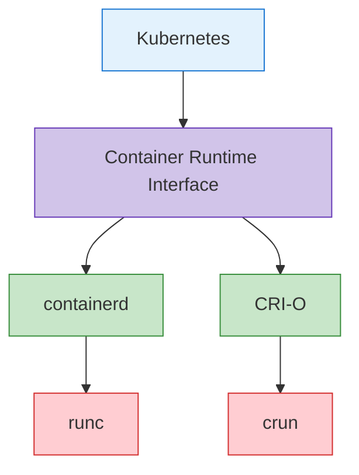

**Ejemplo de configuración de containerd**:
```toml
# /etc/containerd/config.toml
version = 2

[plugins]
  [plugins."io.containerd.grpc.v1.cri"]
    sandbox_image = "k8s.gcr.io/pause:3.6"
    [plugins."io.containerd.grpc.v1.cri".containerd]
      default_runtime_name = "runc"
      [plugins."io.containerd.grpc.v1.cri".containerd.runtimes]
        [plugins."io.containerd.grpc.v1.cri".containerd.runtimes.runc]
          runtime_type = "io.containerd.runc.v2"
          [plugins."io.containerd.grpc.v1.cri".containerd.runtimes.runc.options]
            SystemdCgroup = true
```

**Ejemplo de configuración de CRI-O**:
```toml
# /etc/crio/crio.conf
[crio]
root = "/var/lib/containers/storage"
runroot = "/var/run/containers/storage"
storage_driver = "overlay"
storage_option = ["overlay.mountopt=nodev"]

[crio.runtime]
default_runtime = "runc"
conmon = "/usr/bin/conmon"
conmon_cgroup = "pod"
cgroup_manager = "systemd"

[crio.image]
pause_image = "k8s.gcr.io/pause:3.6"
```

### Componentes add-on

Los add-ons son componentes adicionales que amplían la funcionalidad de los clústeres de Kubernetes. Algunos add-ons importantes incluyen:

1. **CNI Network Plugins**: implementan las redes de Pod
   - Calico, Cilium, Flannel, Weave Net, etc.

2. **DNS**: proporciona servicio DNS dentro del clúster
   - CoreDNS (predeterminado)

3. **Dashboard**: proporciona una UI basada en web
   - Kubernetes Dashboard

4. **Ingress Controller**: administra el enrutamiento HTTP/HTTPS
   - NGINX Ingress Controller, Traefik, HAProxy, etc.

5. **Metrics Server**: recopila métricas de uso de recursos
   - Metrics Server

6. **Logging and Monitoring**: recopilación de logs y monitorización
   - Prometheus, Grafana, Elasticsearch, Fluentd, Kibana, etc.

**Ejemplo de configuración de CoreDNS**:
```yaml
apiVersion: v1
kind: ConfigMap
metadata:
  name: coredns
  namespace: kube-system
data:
  Corefile: |
    .:53 {
        errors
        health {
            lameduck 5s
        }
        ready
        kubernetes cluster.local in-addr.arpa ip6.arpa {
            pods insecure
            fallthrough in-addr.arpa ip6.arpa
            ttl 30
        }
        prometheus :9153
        forward . /etc/resolv.conf {
            max_concurrent 1000
        }
        cache 30
        loop
        reload
        loadbalance
    }
```

**Ejemplo de configuración de Calico CNI**:
```yaml
apiVersion: v1
kind: ConfigMap
metadata:
  name: calico-config
  namespace: kube-system
data:
  calico_backend: "bird"
  cni_network_config: |-
    {
      "name": "k8s-pod-network",
      "cniVersion": "0.3.1",
      "plugins": [
        {
          "type": "calico",
          "log_level": "info",
          "datastore_type": "kubernetes",
          "nodename": "__KUBERNETES_NODE_NAME__",
          "mtu": __CNI_MTU__,
          "ipam": {
            "type": "calico-ipam"
          },
          "policy": {
            "type": "k8s"
          },
          "kubernetes": {
            "kubeconfig": "__KUBECONFIG_FILEPATH__"
          }
        },
        {
          "type": "portmap",
          "snat": true,
          "capabilities": {"portMappings": true}
        }
      ]
    }
```

## Rutas de comunicación del clúster

La comunicación entre varios componentes se produce dentro de un clúster de Kubernetes. Comprender estas rutas de comunicación es importante para el diseño, la seguridad y la solución de problemas del clúster.

### Comunicación interna del control plane

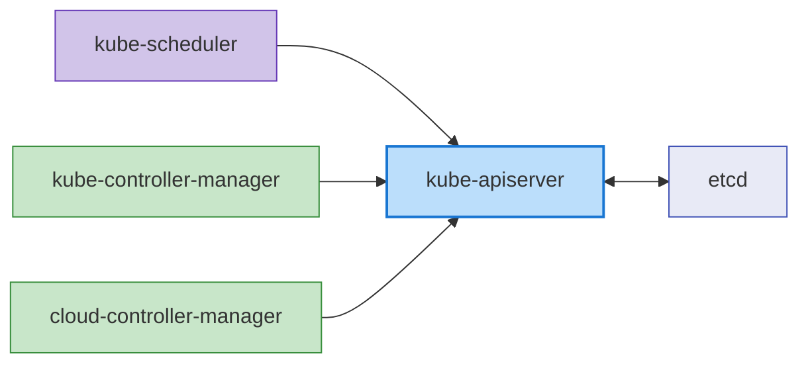

La comunicación entre componentes del control plane es la siguiente:

1. **kube-apiserver y etcd**: kube-apiserver se comunica con etcd para almacenar y recuperar el estado del clúster.
   - Protocolo: gRPC
   - Puerto: 2379/TCP
   - Seguridad: autenticación basada en certificados TLS

2. **kube-scheduler y kube-apiserver**: kube-scheduler se comunica con kube-apiserver para el scheduling de Pod.
   - Protocolo: HTTPS
   - Puerto: 6443/TCP (kube-apiserver)
   - Seguridad: autenticación basada en certificados TLS

3. **kube-controller-manager y kube-apiserver**: Los controllers se comunican con kube-apiserver para observar y modificar el estado del clúster.
   - Protocolo: HTTPS
   - Puerto: 6443/TCP (kube-apiserver)
   - Seguridad: autenticación basada en certificados TLS

4. **cloud-controller-manager y kube-apiserver**: Cloud controller se comunica con kube-apiserver para observar el estado del clúster y administrar recursos de nube.
   - Protocolo: HTTPS
   - Puerto: 6443/TCP (kube-apiserver)
   - Seguridad: autenticación basada en certificados TLS

### Comunicación entre control plane y node

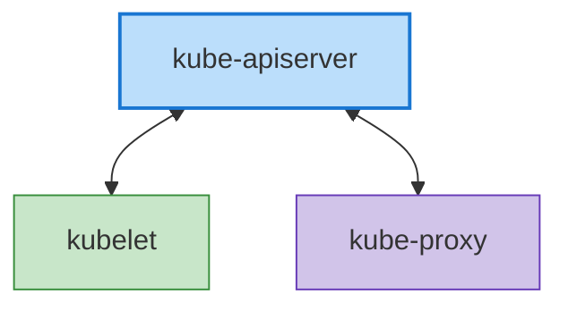

La comunicación entre el control plane y los nodes es la siguiente:

1. **kube-apiserver y kubelet**: kube-apiserver se comunica con kubelet para entregar especificaciones de Pod y recopilar el estado de node.
   - Protocolo: HTTPS
   - Puerto: 10250/TCP (kubelet)
   - Seguridad: autenticación basada en certificados TLS

2. **kubelet y kube-apiserver**: kubelet se comunica con kube-apiserver para el registro de node, la notificación de estado de Pod y la transmisión de eventos.
   - Protocolo: HTTPS
   - Puerto: 6443/TCP (kube-apiserver)
   - Seguridad: autenticación basada en certificados TLS

3. **kube-proxy y kube-apiserver**: kube-proxy se comunica con kube-apiserver para recuperar información de service.
   - Protocolo: HTTPS
   - Puerto: 6443/TCP (kube-apiserver)
   - Seguridad: autenticación basada en certificados TLS

### Comunicación entre nodes

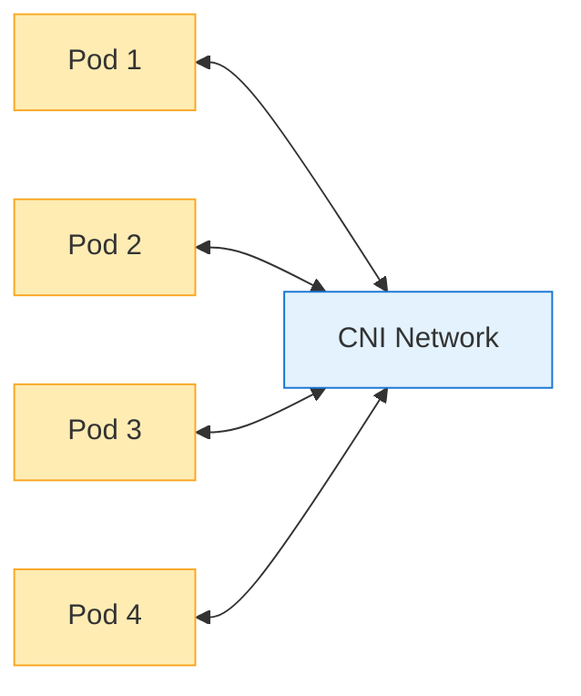

La comunicación entre nodes es la siguiente:

1. **Comunicación de Pod a Pod**: Los Pods se comunican entre sí mediante la red proporcionada por los plugins CNI.
   - Protocolo: depende de la aplicación (TCP, UDP, etc.)
   - Puerto: depende de la aplicación
   - Seguridad: se puede controlar mediante network policies

2. **Comunicación de Pod entre nodes**: La comunicación entre pods en distintos nodes la gestiona el plugin CNI.
   - Protocolo: depende de la aplicación (TCP, UDP, etc.)
   - Puerto: depende de la aplicación
   - Seguridad: se puede controlar mediante network policies

### Comunicación externa

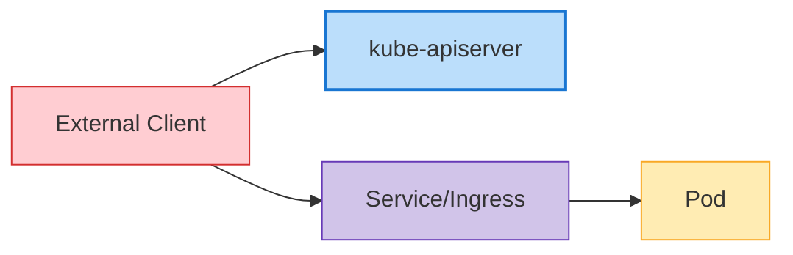

La comunicación con entidades externas es la siguiente:

1. **Cliente y kube-apiserver**: Los usuarios y sistemas externos interactúan con el clúster mediante kube-apiserver.
   - Protocolo: HTTPS
   - Puerto: 6443/TCP (kube-apiserver)
   - Seguridad: certificados TLS, tokens, autenticación de usuario, etc.

2. **Tráfico externo y Services**: El tráfico externo accede a las aplicaciones del clúster mediante services NodePort, LoadBalancer o Ingress.
   - Protocolo: HTTP, HTTPS, TCP, UDP, etc.
   - Puerto: depende de la configuración de service
   - Seguridad: depende de la configuración de ingress controller y service

### Seguridad de las comunicaciones

La seguridad para la comunicación dentro de un clúster de Kubernetes se implementa mediante los siguientes métodos:

1. **Certificados TLS**: Toda la comunicación entre los componentes del control plane se cifra con certificados TLS.
2. **Autenticación y autorización**: Todas las solicitudes al servidor de API pasan por procesos de autenticación y autorización.
3. **Network Policies**: La comunicación de Pod a Pod puede restringirse mediante network policies.
4. **Secrets cifrados**: Los Secrets almacenados en etcd pueden cifrarse.

**Ejemplo de configuración de seguridad de comunicación del servidor de API**:
```yaml
apiVersion: apiserver.config.k8s.io/v1
kind: EncryptionConfiguration
resources:
  - resources:
    - secrets
    providers:
    - aescbc:
        keys:
        - name: key1
          secret: <base64-encoded-key>
    - identity: {}
```

### Configuración de clúster de alta disponibilidad

Los clústeres de Kubernetes de alta disponibilidad (HA) están diseñados para eliminar puntos únicos de fallo y continuar funcionando sin interrupciones de servicio.

### Alta disponibilidad del control plane

La alta disponibilidad del control plane se implementa mediante los siguientes métodos:

1. **Varios control plane nodes**: normalmente se implementan 3 o 5 control plane nodes para redundancia
2. **Clúster etcd**: se implementa un clúster compuesto por varias instancias etcd (normalmente 3 o 5)
3. **Load Balancer**: se coloca un load balancer delante de los servidores de API para distribuir el tráfico

**Arquitectura de control plane de alta disponibilidad**:

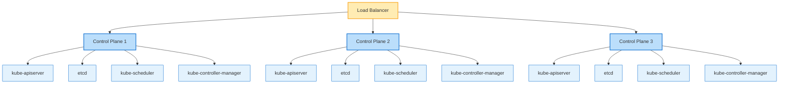

**Configuración del clúster etcd**:

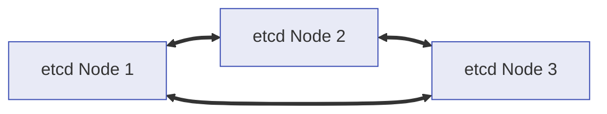

### Alta disponibilidad de worker node

La alta disponibilidad de worker nodes se implementa mediante los siguientes métodos:

1. **Varios worker nodes**: distribuir workloads entre varios worker nodes
2. **Recuperación automática de node**: utilizar las funciones de recuperación automática del proveedor de nube
3. **Auto Scaling**: escalado automático de nodes mediante cluster autoscaler
4. **Varias Availability Zones**: implementar nodes en varias availability zones

**Implementación distribuida de worker node**:

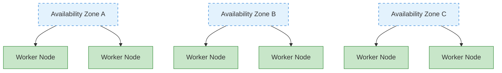

### Alta disponibilidad de aplicaciones

La alta disponibilidad de las aplicaciones se implementa mediante los siguientes métodos:

1. **ReplicaSet/Deployment**: ejecutar varias réplicas de Pod
2. **Reglas de distribución de Pod**: distribuir pods entre varios nodes mediante anti-afinidad de Pod
3. **PodDisruptionBudget**: garantizar una disponibilidad mínima durante interrupciones planificadas
4. **Service y balanceo de carga**: distribuir el tráfico entre varios pods

**Ejemplo de anti-afinidad de Pod**:
```yaml
apiVersion: apps/v1
kind: Deployment
metadata:
  name: web-server
spec:
  replicas: 3
  template:
    metadata:
      labels:
        app: web-server
    spec:
      affinity:
        podAntiAffinity:
          requiredDuringSchedulingIgnoredDuringExecution:
          - labelSelector:
              matchExpressions:
              - key: app
                operator: In
                values:
                - web-server
            topologyKey: "kubernetes.io/hostname"
      containers:
      - name: web-server
        image: nginx:1.21
```

**Ejemplo de PodDisruptionBudget**:
```yaml
apiVersion: policy/v1
kind: PodDisruptionBudget
metadata:
  name: web-server-pdb
spec:
  minAvailable: 2
  selector:
    matchLabels:
      app: web-server
```

### Estrategia de recuperación ante desastres

Las estrategias de recuperación ante desastres para clústeres de Kubernetes se implementan mediante los siguientes métodos:

1. **Copia de seguridad y recuperación de etcd**: establecer procedimientos regulares de copia de seguridad y recuperación de datos etcd
2. **Implementación multirregión**: implementar clústeres en varias regiones
3. **Federación de clústeres**: administrar varios clústeres en una federación
4. **Copia de seguridad continua**: copia de seguridad continua de datos de aplicaciones

**Ejemplo de script de copia de seguridad de etcd**:
```bash
#!/bin/bash
ETCDCTL_API=3 etcdctl snapshot save /backup/etcd-snapshot-$(date +%Y%m%d-%H%M%S).db \
  --endpoints=https://127.0.0.1:2379 \
  --cacert=/etc/kubernetes/pki/etcd/ca.crt \
  --cert=/etc/kubernetes/pki/etcd/server.crt \
  --key=/etc/kubernetes/pki/etcd/server.key
```

**Ejemplo de script de recuperación de etcd**:
```bash
#!/bin/bash
# Stop cluster
systemctl stop kubelet
docker stop $(docker ps -q)

# Recover etcd data
ETCDCTL_API=3 etcdctl snapshot restore /backup/etcd-snapshot.db \
  --data-dir=/var/lib/etcd-restore \
  --name=master \
  --initial-cluster=master=https://127.0.0.1:2380 \
  --initial-cluster-token=etcd-cluster \
  --initial-advertise-peer-urls=https://127.0.0.1:2380

# Replace etcd directory with recovered data
mv /var/lib/etcd /var/lib/etcd.old
mv /var/lib/etcd-restore /var/lib/etcd

# Restart cluster
systemctl start kubelet
```

## Redes del clúster

Las redes de Kubernetes permiten la comunicación entre pods, services y el mundo exterior. El modelo de red de Kubernetes asume que cada Pod tiene una dirección IP única y puede comunicarse entre sí sin NAT.

### Modelo de red

El modelo de red de Kubernetes tiene los siguientes requisitos:

1. **Comunicación de Pod a Pod**: todos los pods deben poder comunicarse con todos los demás pods sin NAT
2. **Comunicación de node a Pod**: los nodes deben poder comunicarse con todos los pods sin NAT
3. **Comunicación de Pod a exterior**: los pods deben poder comunicarse con el mundo exterior (normalmente utilizando NAT)

### CNI (Container Network Interface)

CNI es una interfaz estándar para implementar redes en Kubernetes. Hay varios plugins CNI, cada uno con diferentes características y rendimiento.

**Plugins CNI principales**:

1. **Calico**: redes basadas en BGP, compatibilidad con network policies
   - Características: alto rendimiento, network policies, cifrado, compatibilidad con eBPF
   - Casos de uso: clústeres grandes, entornos centrados en la seguridad

2. **Cilium**: redes y seguridad basadas en eBPF
   - Características: políticas de seguridad L3-L7, alto rendimiento, observabilidad
   - Casos de uso: microservices, entornos centrados en la seguridad

3. **Flannel**: red superpuesta simple
   - Características: configuración sencilla, ligero
   - Casos de uso: clústeres pequeños, entornos de desarrollo

4. **Weave Net**: redes de contenedores multi-host
   - Características: cifrado, network policies, multicloud
   - Casos de uso: nube híbrida, multicloud

**Ejemplo de configuración de CNI (Calico)**:
```yaml
apiVersion: v1
kind: ConfigMap
metadata:
  name: calico-config
  namespace: kube-system
data:
  calico_backend: "bird"
  cni_network_config: |-
    {
      "name": "k8s-pod-network",
      "cniVersion": "0.3.1",
      "plugins": [
        {
          "type": "calico",
          "log_level": "info",
          "datastore_type": "kubernetes",
          "nodename": "__KUBERNETES_NODE_NAME__",
          "mtu": __CNI_MTU__,
          "ipam": {
            "type": "calico-ipam"
          },
          "policy": {
            "type": "k8s"
          },
          "kubernetes": {
            "kubeconfig": "__KUBECONFIG_FILEPATH__"
          }
        },
        {
          "type": "portmap",
          "snat": true,
          "capabilities": {"portMappings": true}
        }
      ]
    }
```

### Redes de Service

Los Services de Kubernetes proporcionan endpoints estables para un conjunto de pods. Los Services tienen varios tipos, incluidos ClusterIP, NodePort, LoadBalancer y ExternalName.

**Componentes de redes de Service**:

1. **ClusterIP**: IP virtual accesible solo dentro del clúster
2. **kube-proxy**: enruta el tráfico a IP de service hacia pods
3. **CoreDNS**: servicio DNS para descubrimiento de services

**Flujo de redes de Service**:
```
Client -> Service (ClusterIP) -> kube-proxy -> Pod
```

**Ejemplo de Service**:
```yaml
apiVersion: v1
kind: Service
metadata:
  name: my-service
spec:
  selector:
    app: my-app
  ports:
  - port: 80
    targetPort: 8080
  type: ClusterIP
```

### Redes de Ingress

Ingress administra el enrutamiento HTTP y HTTPS desde fuera del clúster hacia services dentro del clúster. Los ingress controllers implementan recursos de ingress.

**Ingress Controllers principales**:
1. **NGINX Ingress Controller**: ingress controller basado en NGINX
2. **AWS ALB Ingress Controller**: basado en AWS Application Load Balancer
3. **Traefik**: router perimetral nativo de nube
4. **HAProxy Ingress**: ingress controller basado en HAProxy

**Flujo de redes de Ingress**:
```
Client -> Ingress Controller -> Service -> Pod
```

**Ejemplo de Ingress**:
```yaml
apiVersion: networking.k8s.io/v1
kind: Ingress
metadata:
  name: my-ingress
  annotations:
    nginx.ingress.kubernetes.io/rewrite-target: /
spec:
  ingressClassName: nginx
  rules:
  - host: example.com
    http:
      paths:
      - path: /app
        pathType: Prefix
        backend:
          service:
            name: my-service
            port:
              number: 80
```

### Network Policies

Las network policies proporcionan una forma de controlar la comunicación entre pods. De forma predeterminada, todos los pods pueden comunicarse entre sí, pero las network policies pueden restringirla.

**Ejemplo de Network Policy**:
```yaml
apiVersion: networking.k8s.io/v1
kind: NetworkPolicy
metadata:
  name: db-network-policy
spec:
  podSelector:
    matchLabels:
      role: db
  policyTypes:
  - Ingress
  - Egress
  ingress:
  - from:
    - podSelector:
        matchLabels:
          role: frontend
    ports:
    - protocol: TCP
      port: 3306
  egress:
  - to:
    - podSelector:
        matchLabels:
          role: monitoring
    ports:
    - protocol: TCP
      port: 9090
```

### Solución de problemas de red

Herramientas y comandos comunes para solucionar problemas de red de Kubernetes:

1. **ping, traceroute**: pruebas básicas de conectividad de red
2. **tcpdump**: captura y análisis de paquetes de red
3. **netstat, ss**: comprobar el estado de conexiones de red
4. **nslookup, dig**: pruebas de búsqueda DNS
5. **kubectl exec**: ejecutar comandos de red dentro de pods

**Ejemplo de depuración de red**:
```bash
# Test network connectivity within a pod
kubectl exec -it <pod-name> -- ping <target-ip>

# Test DNS lookup within a pod
kubectl exec -it <pod-name> -- nslookup <service-name>

# Capture network packets within a pod
kubectl exec -it <pod-name> -- tcpdump -i eth0 -n

# Check service endpoints
kubectl get endpoints <service-name>
```

## Almacenamiento del clúster

El almacenamiento de Kubernetes proporciona persistencia de datos para aplicaciones en contenedores. Kubernetes ofrece varias opciones y abstracciones de almacenamiento para ayudar a las aplicaciones a utilizarlo eficientemente.

### Arquitectura de almacenamiento

La arquitectura de almacenamiento de Kubernetes consta de los siguientes componentes:

1. **Volumes**: directorios que pueden montarse en contenedores dentro de pods
2. **Persistent Volumes (PV)**: recursos de almacenamiento en el clúster
3. **Persistent Volume Claims (PVC)**: solicitudes de almacenamiento de usuarios
4. **Storage Classes**: definen «clases» o tipos de almacenamiento
5. **CSI (Container Storage Interface)**: interfaz estándar con sistemas de almacenamiento

**Flujo de arquitectura de almacenamiento**:

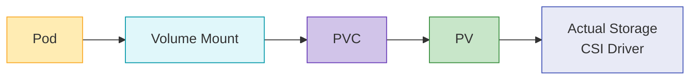

### Tipos de volumen

Kubernetes admite varios tipos de volúmenes:

1. **Ephemeral Volumes**:
   - **emptyDir**: comienza como un directorio vacío y se elimina cuando se elimina el Pod
   - **configMap**: monta ConfigMap como un volumen
   - **secret**: monta Secret como un volumen
   - **downwardAPI**: expone información de Pod y contenedor como archivos

2. **Persistent Volumes**:
   - **awsElasticBlockStore**: volúmenes AWS EBS
   - **azureDisk**: Azure Disk
   - **gcePersistentDisk**: GCE Persistent Disk
   - **nfs**: volúmenes NFS
   - **csi**: volúmenes mediante drivers CSI

**Ejemplo de volumen**:
```yaml
apiVersion: v1
kind: Pod
metadata:
  name: test-pd
spec:
  containers:
  - name: test-container
    image: nginx
    volumeMounts:
    - mountPath: /test-pd
      name: test-volume
  volumes:
  - name: test-volume
    persistentVolumeClaim:
      claimName: test-pvc
```

### Persistent Volumes y Claims

Los Persistent Volumes (PV) son recursos de almacenamiento del clúster aprovisionados por administradores o dinámicamente mediante storage classes. Las Persistent Volume Claims (PVC) son solicitudes de almacenamiento de usuarios.

**Ejemplo de Persistent Volume**:
```yaml
apiVersion: v1
kind: PersistentVolume
metadata:
  name: pv-example
spec:
  capacity:
    storage: 10Gi
  accessModes:
    - ReadWriteOnce
  persistentVolumeReclaimPolicy: Retain
  storageClassName: standard
  awsElasticBlockStore:
    volumeID: vol-0123456789abcdef0
    fsType: ext4
```

**Ejemplo de Persistent Volume Claim**:
```yaml
apiVersion: v1
kind: PersistentVolumeClaim
metadata:
  name: pvc-example
spec:
  accessModes:
    - ReadWriteOnce
  resources:
    requests:
      storage: 5Gi
  storageClassName: standard
```

### Storage Classes

Las storage classes describen las «clases» de almacenamiento que proporcionan los administradores. Las storage classes permiten el aprovisionamiento dinámico de PV cuando se solicitan PVC.

**Ejemplo de Storage Class**:
```yaml
apiVersion: storage.k8s.io/v1
kind: StorageClass
metadata:
  name: standard
provisioner: kubernetes.io/aws-ebs
parameters:
  type: gp3
  fsType: ext4
reclaimPolicy: Delete
allowVolumeExpansion: true
```

### CSI (Container Storage Interface)

CSI proporciona una interfaz estándar entre Kubernetes y sistemas de almacenamiento. Mediante CSI, los proveedores de almacenamiento pueden desarrollar sus propios drivers de almacenamiento sin modificar el código de Kubernetes.

**Arquitectura CSI**:

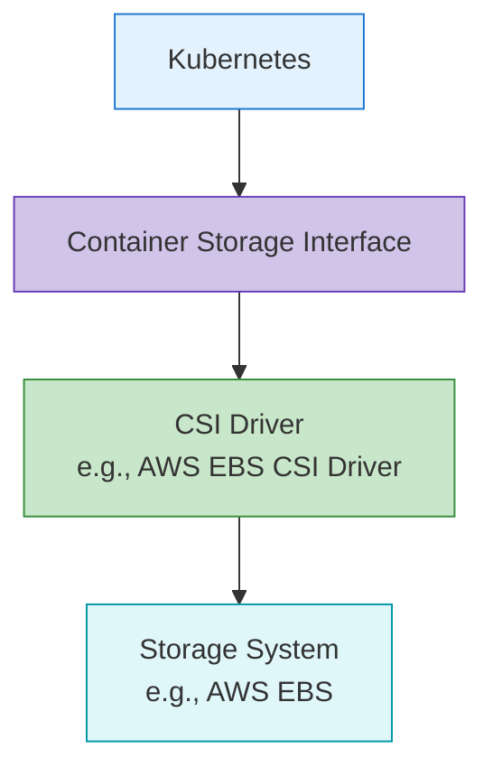

**Ejemplo de implementación de CSI Driver**:
```yaml
apiVersion: storage.k8s.io/v1
kind: StorageClass
metadata:
  name: ebs-sc
provisioner: ebs.csi.aws.com
parameters:
  type: gp3
  fsType: ext4
  encrypted: "true"
volumeBindingMode: WaitForFirstConsumer
```

### Prácticas recomendadas de almacenamiento

Prácticas recomendadas para utilizar almacenamiento de Kubernetes:

1. **Elegir el tipo de almacenamiento adecuado**: seleccione el tipo de almacenamiento que coincida con las características del workload
2. **Usar aprovisionamiento dinámico**: utilice aprovisionamiento dinámico mediante storage classes
3. **Elegir los modos de acceso adecuados**: seleccione modos de acceso que coincidan con los requisitos del workload
4. **Establecer solicitudes y límites de recursos**: solicite la capacidad de almacenamiento adecuada
5. **Establecer estrategia de copia de seguridad y recuperación**: prepare estrategias de copia de seguridad y recuperación para datos críticos
6. **Supervisar el almacenamiento**: supervise el uso y rendimiento del almacenamiento

## Escalabilidad del clúster

La escalabilidad del clúster de Kubernetes se refiere a la capacidad del clúster de gestionar cargas y requisitos crecientes. La escalabilidad puede implementarse mediante escalado horizontal (scale out) y vertical (scale up).

### Límites de escala del clúster

Los clústeres de Kubernetes tienen los siguientes límites de escala:

1. **Número de nodes**: máximo de 5.000 nodes
2. **Número de pods**: máximo de 150.000 pods por clúster
3. **Pods por node**: máximo de 110 pods por node (predeterminado)
4. **Número de Services**: máximo de 10.000 services por clúster
5. **Contenedores por Pod**: máximo de 20 contenedores por Pod

Estos límites pueden variar según la versión de Kubernetes y la configuración del clúster.

### Escalado horizontal

El escalado horizontal aumenta la capacidad del clúster añadiendo más nodes.

**Auto Scaling de nodes**:
Kubernetes Cluster Autoscaler ajusta automáticamente el número de nodes según los requisitos del workload.

```yaml
# AWS Auto Scaling Group tags example
tags:
  k8s.io/cluster-autoscaler/enabled: "true"
  k8s.io/cluster-autoscaler/my-cluster: "owned"
```

**Ejemplo de implementación de Cluster Autoscaler**:
```yaml
apiVersion: apps/v1
kind: Deployment
metadata:
  name: cluster-autoscaler
  namespace: kube-system
spec:
  replicas: 1
  selector:
    matchLabels:
      app: cluster-autoscaler
  template:
    metadata:
      labels:
        app: cluster-autoscaler
    spec:
      containers:
      - name: cluster-autoscaler
        image: k8s.gcr.io/autoscaling/cluster-autoscaler:v1.24.0
        command:
        - ./cluster-autoscaler
        - --cloud-provider=aws
        - --nodes=2:10:my-asg-group
        - --scale-down-unneeded-time=10m
```

**Karpenter**:
Karpenter es una nueva herramienta de autoescalado de nodes desarrollada por AWS que proporciona aprovisionamiento de nodes más rápido y eficiente.

```yaml
apiVersion: karpenter.sh/v1
kind: NodePool
metadata:
  name: default
spec:
  template:
    spec:
      requirements:
        - key: karpenter.sh/capacity-type
          operator: In
          values: ["spot", "on-demand"]
      nodeClassRef:
        name: default-class
  limits:
    cpu: 1000
    memory: 1000Gi
---
apiVersion: karpenter.k8s.aws/v1
kind: EC2NodeClass
metadata:
  name: default-class
spec:
  subnetSelector:
    karpenter.sh/discovery: my-cluster
  securityGroupSelector:
    karpenter.sh/discovery: my-cluster
```

### Escalado vertical

El escalado vertical aumenta los recursos (CPU, memoria) de los nodes existentes.

**Vertical Pod Autoscaler (VPA)**:
VPA ajusta automáticamente las solicitudes de CPU y memoria de los pods.

```yaml
apiVersion: autoscaling.k8s.io/v1
kind: VerticalPodAutoscaler
metadata:
  name: my-app-vpa
spec:
  targetRef:
    apiVersion: "apps/v1"
    kind: Deployment
    name: my-app
  updatePolicy:
    updateMode: "Auto"
  resourcePolicy:
    containerPolicies:
    - containerName: '*'
      minAllowed:
        cpu: 100m
        memory: 50Mi
      maxAllowed:
        cpu: 1
        memory: 500Mi
```

### Escalado de aplicaciones

El escalado a nivel de aplicación se implementa ajustando el número de réplicas de Pod.

**Horizontal Pod Autoscaler (HPA)**:
HPA ajusta automáticamente el número de réplicas de Pod según la utilización de CPU o métricas personalizadas.

```yaml
apiVersion: autoscaling/v2
kind: HorizontalPodAutoscaler
metadata:
  name: my-app-hpa
spec:
  scaleTargetRef:
    apiVersion: apps/v1
    kind: Deployment
    name: my-app
  minReplicas: 2
  maxReplicas: 10
  metrics:
  - type: Resource
    resource:
      name: cpu
      target:
        type: Utilization
        averageUtilization: 80
```

**KEDA (Kubernetes Event-driven Autoscaling)**:
KEDA proporciona autoescalado basado en eventos, lo que permite escalar según varias fuentes de eventos.

```yaml
apiVersion: keda.sh/v1alpha1
kind: ScaledObject
metadata:
  name: my-app-scaledobject
spec:
  scaleTargetRef:
    name: my-app
  minReplicaCount: 0
  maxReplicaCount: 10
  triggers:
  - type: kafka
    metadata:
      bootstrapServers: kafka.svc:9092
      consumerGroup: my-group
      topic: my-topic
      lagThreshold: "10"
```

### Prácticas recomendadas de escalabilidad

Prácticas recomendadas para la escalabilidad del clúster de Kubernetes:

1. **Establecer solicitudes y límites de recursos**: establezca solicitudes y límites de recursos adecuados para todos los pods
2. **Estrategia de Node Pool**: configure varios node pools para distintas características de workload
3. **Configurar Auto Scaling**: configure correctamente Cluster Autoscaler, HPA y VPA
4. **Ubicación eficiente de Pod**: utilice afinidad de node y afinidad/anti-afinidad de Pod
5. **Monitorización del clúster**: supervise continuamente el uso de recursos y el rendimiento
6. **Pruebas de carga**: realice pruebas de carga periódicas para validar las estrategias de escalado

## Seguridad del clúster

La seguridad del clúster de Kubernetes debe implementarse en varias capas. Esto incluye autenticación, autorización, network policies, seguridad de Pod y más.

### Autenticación

Métodos para autenticar el acceso al servidor de API de Kubernetes:

1. **Certificados X.509**: autenticación mediante certificados de cliente TLS
2. **Tokens de Service Account**: tokens para acceder al servidor de API dentro de pods
3. **OpenID Connect (OIDC)**: autenticación mediante proveedores de identidad externos
4. **Autenticación mediante Webhook Token**: autenticación mediante servicios de autenticación externos
5. **Authentication Proxy**: autenticación mediante proxies de autenticación

**Ejemplo de kubeconfig**:
```yaml
apiVersion: v1
kind: Config
clusters:
- name: my-cluster
  cluster:
    certificate-authority-data: <CA-DATA>
    server: https://api.my-cluster.example.com
users:
- name: admin
  user:
    client-certificate-data: <CERT-DATA>
    client-key-data: <KEY-DATA>
contexts:
- name: my-context
  context:
    cluster: my-cluster
    user: admin
current-context: my-context
```

### Autorización

Métodos para controlar acciones de usuarios autenticados:

1. **RBAC (Role-Based Access Control)**: control de acceso basado en roles
2. **ABAC (Attribute-Based Access Control)**: control de acceso basado en atributos
3. **Node Authorization**: autorización especial para nodes
4. **Webhook Authorization**: autorización mediante servicios externos

**Ejemplo de RBAC**:
```yaml
# Role definition
apiVersion: rbac.authorization.k8s.io/v1
kind: Role
metadata:
  namespace: default
  name: pod-reader
rules:
- apiGroups: [""]
  resources: ["pods"]
  verbs: ["get", "watch", "list"]

# Role binding
apiVersion: rbac.authorization.k8s.io/v1
kind: RoleBinding
metadata:
  name: read-pods
  namespace: default
subjects:
- kind: User
  name: jane
  apiGroup: rbac.authorization.k8s.io
roleRef:
  kind: Role
  name: pod-reader
  apiGroup: rbac.authorization.k8s.io
```

### Seguridad de red

Métodos para proteger el tráfico de red dentro del clúster:

1. **Network Policies**: controlar la comunicación de Pod a Pod
2. **Comunicación cifrada**: cifrado de comunicaciones mediante TLS
3. **Service Mesh**: seguridad de red avanzada mediante Istio, Linkerd, etc.

**Ejemplo de Network Policy**:
```yaml
apiVersion: networking.k8s.io/v1
kind: NetworkPolicy
metadata:
  name: default-deny-all
spec:
  podSelector: {}
  policyTypes:
  - Ingress
  - Egress
```

### Seguridad de Pod

Implementación de seguridad a nivel de Pod:

1. **Pod Security Context**: configuración de seguridad a nivel de Pod y contenedor
2. **Pod Security Standards**: define requisitos de seguridad de Pod
3. **Perfiles seccomp**: restricciones de llamadas al sistema
4. **AppArmor/SELinux**: control de acceso obligatorio

**Ejemplo de Pod Security Context**:
```yaml
apiVersion: v1
kind: Pod
metadata:
  name: security-context-pod
spec:
  securityContext:
    runAsUser: 1000
    runAsGroup: 3000
    fsGroup: 2000
  containers:
  - name: app
    image: myapp:1.0
    securityContext:
      allowPrivilegeEscalation: false
      capabilities:
        drop:
        - ALL
```

### Administración de Secrets

Métodos para administrar información confidencial de forma segura:

1. **Kubernetes Secrets**: utilizar recursos secret básicos
2. **etcd cifrado**: cifrar Secrets almacenados en etcd
3. **Administración de Secrets externa**: utilizar HashiCorp Vault, AWS Secrets Manager, etc.

**Ejemplo de configuración de etcd cifrado**:
```yaml
apiVersion: apiserver.config.k8s.io/v1
kind: EncryptionConfiguration
resources:
  - resources:
    - secrets
    providers:
    - aescbc:
        keys:
        - name: key1
          secret: <base64-encoded-key>
    - identity: {}
```

### Prácticas recomendadas de seguridad

Prácticas recomendadas para la seguridad del clúster de Kubernetes:

1. **Principio de mínimo privilegio**: conceda únicamente los privilegios mínimos necesarios
2. **Actualizaciones regulares**: actualice regularmente el clúster y los componentes
3. **Aislamiento de red**: restrinja la comunicación de Pod a Pod mediante network policies
4. **Seguridad de imágenes**: utilice solo imágenes de confianza e implemente análisis de vulnerabilidades
5. **Audit Logging**: habilite audit logs para la actividad del clúster
6. **Security Benchmarks**: cumpla estándares de seguridad como los benchmarks CIS

## Actualizaciones del clúster

Las actualizaciones de clústeres de Kubernetes son necesarias para aplicar nuevas características, parches de seguridad y correcciones de errores. Las actualizaciones deben planificarse y ejecutarse cuidadosamente.

### Actualización de julio de 2026: Kubernetes v1.37 en beta

v1.37.0-beta.0 se publicó el 20 de julio de 2026, llevando la siguiente versión menor, v1.37, a la fase final de su ciclo de lanzamiento. Code Freeze entró en vigor según lo programado el 22-23 de julio de 2026, y la versión final v1.37.0 está prevista para el 26 de agosto de 2026. Consulte la [información de lanzamiento de v1.37](https://www.kubernetes.dev/resources/release/) para ver el calendario completo.

En la misma semana (22-23 de julio de 2026), se publicaron versiones de parche para todas las líneas mantenidas: [v1.36.3](https://github.com/kubernetes/kubernetes/releases/tag/v1.36.3), [v1.35.7](https://github.com/kubernetes/kubernetes/releases/tag/v1.35.7) y [v1.34.10](https://github.com/kubernetes/kubernetes/releases/tag/v1.34.10). Como es habitual, se recomienda aplicar el último parche para su versión menor.

### Actualización de agosto de 2026: adelanto de v1.37

El 31 de julio de 2026, el equipo de lanzamiento publicó el [adelanto de Kubernetes v1.37](https://kubernetes.io/blog/2026/07/31/kubernetes-v1-37-sneak-peek/), que describe las deprecaciones, eliminaciones y cambios de características previstos antes de la versión final v1.37.0, todavía programada para el 26 de agosto de 2026. Docs Freeze entró en vigor el 5-6 de agosto de 2026. Mientras tanto, la primera etiqueta del ciclo siguiente, v1.38.0-alpha.0, se creó el 6 de agosto de 2026.

### Estrategias de actualización

Estrategias para actualizaciones de clústeres de Kubernetes:

1. **Actualización Blue/Green**: crear por separado un clúster de nueva versión y migrar workloads
2. **Actualización in-place**: actualizar directamente el clúster existente
3. **Actualización canary**: actualizar primero solo algunos nodes para validación

### Orden de actualización

Orden típico para actualizaciones de clústeres de Kubernetes:

1. **Actualización de control plane**: kube-apiserver, kube-controller-manager, kube-scheduler, etcd
2. **Actualización de DNS y CNI**: CoreDNS, plugins CNI y otros add-ons importantes
3. **Actualización de worker node**: actualización secuencial de worker nodes

**Ejemplo de actualización con kubeadm**:
```bash
# Control plane upgrade
kubeadm upgrade plan
kubeadm upgrade apply v1.24.0

# Worker node upgrade
kubectl drain <node-name> --ignore-daemonsets
# Upgrade kubelet and kubeadm on the node
apt-get update && apt-get install -y kubelet=1.24.0-00 kubeadm=1.24.0-00
kubeadm upgrade node
systemctl restart kubelet
kubectl uncordon <node-name>
```

### Consideraciones de actualización

Consideraciones al actualizar clústeres de Kubernetes:

1. **Cambios de API**: compruebe los cambios de API en las nuevas versiones
2. **Feature Gates**: compruebe los nuevos feature gates y los cambios de valores predeterminados
3. **Dependencias**: compruebe la compatibilidad de componentes dependientes como CNI y CSI
4. **Tiempo de inactividad**: planifique el tiempo de inactividad esperado durante las actualizaciones
5. **Plan de rollback**: establezca un plan de rollback en caso de problemas

### Prácticas recomendadas de actualización

Prácticas recomendadas para actualizaciones de clústeres de Kubernetes:

1. **Probar primero en el entorno de pruebas**: valide en un entorno de pruebas antes de actualizar producción
2. **Actualización gradual**: actualice una versión menor cada vez
3. **Copia de seguridad**: realice una copia de seguridad de datos etcd antes de actualizar
4. **Documentación**: documente los procedimientos y resultados de actualización
5. **Monitorización**: supervise el estado del clúster durante y después de la actualización
6. **Ventana de actualización**: realice actualizaciones durante períodos de poco tráfico

## Arquitectura del clúster Amazon EKS

Amazon EKS (Elastic Kubernetes Service) es un servicio administrado de Kubernetes proporcionado por AWS. EKS proporciona todas las características básicas de Kubernetes y añade integración con servicios de AWS y facilidad de administración.

### Descripción general de la arquitectura de EKS

Los clústeres de EKS constan de los siguientes componentes:

1. **EKS Control Plane**: control plane de Kubernetes administrado por AWS
2. **EKS Nodes**: worker nodes administrados por usuarios (instancias EC2)
3. **EKS Managed Node Groups**: node groups administrados por AWS
4. **EKS Fargate Profiles**: entorno de ejecución de contenedores sin servidor
5. **VPC and Subnets**: VPC y subnets para redes del clúster

**Diagrama de arquitectura de EKS**:

```mermaid
graph TD
    classDef aws fill:#e8f5e9,stroke:#2e7d32,stroke-width:1px;
    classDef eks fill:#fce4ec,stroke:#c2185b,stroke-width:1px;
    classDef controlplane fill:#bbdefb,stroke:#1976d2,stroke-width:2px;
    classDef nodes fill:#c8e6c9,stroke:#388e3c,stroke-width:1px;
    classDef services fill:#d1c4e9,stroke:#673ab7,stroke-width:1px;
    classDef network fill:#f3e5f5,stroke:#7b1fa2,stroke-width:1px;

    AWS[AWS Cloud] --> CP[EKS Control Plane<br>AWS Managed]
    AWS --> WN[Worker Nodes]
    AWS --> AWSS[AWS Services]
    AWS --> VPC[VPC & Networking]

    CP --> API[kube-apiserver]
    CP --> ETCD[etcd]
    CP --> SCHED[kube-scheduler]
    CP --> CTRL[kube-controller-manager]

    WN --> NG1[Node Group 1<br>EC2 instances]
    WN --> NG2[Node Group 2<br>EC2 instances]
    WN --> FG[Fargate Profile<br>Serverless]

    AWSS --> IAM[IAM]
    AWSS --> ECR[ECR]
    AWSS --> ELB[ELB/ALB/NLB]
    AWSS --> EBS[EBS/EFS/FSx]
    AWSS --> CW[CloudWatch]

    VPC --> VPCM[VPC]
    VPC --> SN[Subnets]
    VPC --> SG[Security Groups]
    VPC --> RT[Route Tables]
    VPC --> CNI[VPC CNI]

    class AWS aws;
    class CP controlplane;
    class WN nodes;
    class AWSS,IAM,ECR,ELB,EBS,CW services;
    class VPC,VPCM,SN,SG,RT,CNI network;
    class API,ETCD,SCHED,CTRL,NG1,NG2,FG eks;
```

### EKS Control Plane

El control plane de EKS es administrado por AWS y proporciona alta disponibilidad en varias availability zones.

**Características principales**:
1. **Managed Service**: AWS administra el mantenimiento y las actualizaciones del control plane
2. **Alta disponibilidad**: implementado en varias availability zones
3. **Auto Scaling**: escala automáticamente según la carga
4. **Seguridad**: integrado con servicios de seguridad de AWS

### Tipos de node de EKS

EKS admite varios tipos de nodes:

1. **Self-Managed Nodes**: los usuarios administran directamente las instancias EC2
2. **Managed Node Groups**: AWS administra el ciclo de vida de node
3. **Fargate**: entorno de ejecución de contenedores sin servidor
4. **Bottlerocket Nodes**: sistema operativo optimizado para workloads de contenedor

**Ejemplo de Managed Node Group**:
```yaml
apiVersion: eksctl.io/v1alpha5
kind: ClusterConfig
metadata:
  name: my-cluster
  region: ap-northeast-2
managedNodeGroups:
  - name: ng-1
    instanceType: m5.large
    desiredCapacity: 3
    minSize: 2
    maxSize: 5
    volumeSize: 80
    privateNetworking: true
    labels:
      role: worker
    tags:
      nodegroup-role: worker
    iam:
      withAddonPolicies:
        autoScaler: true
        albIngress: true
```

### Redes de EKS

Las redes de EKS se basan en Amazon VPC e incluyen los siguientes componentes:

1. **VPC CNI Plugin**: integración con redes AWS VPC
2. **Security Groups**: seguridad de red en el nivel de node y Pod
3. **Integración de Load Balancer**: integración con ELB, ALB, NLB
4. **VPC Endpoints**: comunicación privada con servicios de AWS

**Ejemplo de configuración de VPC CNI**:
```yaml
apiVersion: v1
kind: ConfigMap
metadata:
  name: amazon-vpc-cni
  namespace: kube-system
data:
  enable-network-policy: "true"
  enable-pod-eni: "true"
  warm-ip-target: "5"
  minimum-ip-target: "10"
```

### Almacenamiento de EKS

EKS se integra con varios servicios de almacenamiento de AWS:

1. **EBS CSI Driver**: administración de volúmenes Amazon EBS
2. **EFS CSI Driver**: administración de sistemas de archivos Amazon EFS
3. **FSx for Lustre CSI Driver**: administración de sistemas de archivos FSx for Lustre
4. **S3**: almacenamiento de objetos

**Ejemplo de EBS CSI Driver**:
```yaml
apiVersion: storage.k8s.io/v1
kind: StorageClass
metadata:
  name: ebs-sc
provisioner: ebs.csi.aws.com
parameters:
  type: gp3
  encrypted: "true"
volumeBindingMode: WaitForFirstConsumer
```

### Seguridad de EKS

EKS se integra con servicios de seguridad de AWS para proporcionar una seguridad sólida:

1. **IAM Integration**: integración de AWS IAM y Kubernetes RBAC
2. **VPC Security**: VPC security groups y network ACLs
3. **AWS KMS**: integración de KMS para cifrado de secrets
4. **AWS WAF**: integración de firewall de aplicaciones web
5. **AWS Shield**: protección DDoS

**Ejemplo de IAM Role Service Account**:
```yaml
apiVersion: v1
kind: ServiceAccount
metadata:
  name: s3-reader
  namespace: default
  annotations:
    eks.amazonaws.com/role-arn: arn:aws:iam::123456789012:role/s3-reader-role
```

### Monitorización y logging de EKS

EKS se integra con servicios de monitorización y logging de AWS:

1. **CloudWatch Container Insights**: monitorización de contenedores
2. **CloudWatch Logs**: recopilación y análisis de logs
3. **X-Ray**: trazado distribuido
4. **Prometheus and Grafana**: integración de herramientas de monitorización de código abierto

**Ejemplo de CloudWatch Container Insights**:
```yaml
apiVersion: v1
kind: Namespace
metadata:
  name: amazon-cloudwatch
---
apiVersion: apps/v1
kind: DaemonSet
metadata:
  name: cloudwatch-agent
  namespace: amazon-cloudwatch
spec:
  selector:
    matchLabels:
      name: cloudwatch-agent
  template:
    metadata:
      labels:
        name: cloudwatch-agent
    spec:
      containers:
      - name: cloudwatch-agent
        image: amazon/cloudwatch-agent:1.247347.6b250880
        # ... additional configuration
```

### Optimización de costos de EKS

Métodos para optimizar los costos de clústeres EKS:

1. **Spot Instances**: utilizar instancias Spot rentables
2. **Fargate**: reducir costos de recursos inactivos con ejecución de contenedores sin servidor
3. **Auto Scaling**: optimización de recursos mediante cluster autoscaler
4. **Graviton Processors**: utilizar instancias Graviton basadas en ARM
5. **Optimización de solicitudes de recursos**: establecer solicitudes y límites de recursos adecuados

**Ejemplo de node group de Spot Instance**:
```yaml
apiVersion: eksctl.io/v1alpha5
kind: ClusterConfig
metadata:
  name: my-cluster
  region: ap-northeast-2
managedNodeGroups:
  - name: spot-ng
    instanceTypes: ["m5.large", "m5a.large", "m5d.large", "m5ad.large"]
    spot: true
    desiredCapacity: 3
    minSize: 2
    maxSize: 10
```

## Más información

Para profundizar su comprensión de la arquitectura de clúster tratada en este documento, consulte los siguientes temas:

- [Introducción a Kubernetes](../basics/04-kubernetes-introduction.md) - Conceptos básicos e historia de Kubernetes
- [Pods y workloads](./02-pods-and-workloads.md) - Administración de workloads que se ejecutan en el clúster
- [Services y redes](./03-services-networking.md) - Configuración de redes dentro del clúster
- [Scheduling, preemption y eviction](./08-scheduling-preemption-eviction.md) - Cómo se ubican los pods en nodes
- [Administración del clúster](./09-cluster-administration.md) - Operación y administración del clúster
- [Introducción a EKS](../eks/01-eks-introduction.md) - Descripción general del servicio Amazon EKS
- [Creación de clúster EKS](../eks/02-eks-cluster-creation-part1.md) - Cómo crear clústeres EKS

### Aprendizaje práctico y avanzado

- [Tutoriales oficiales de Kubernetes](https://kubernetes.io/docs/tutorials/) - Aprendizaje mediante práctica directa
- [Kubernetes The Hard Way](https://github.com/kelseyhightower/kubernetes-the-hard-way) - Construcción manual de un clúster de Kubernetes
- [Redes de Cilium](../networking/cilium/01-introduction.md) - Características avanzadas de redes y seguridad

## Conclusión

En este documento, hemos examinado la arquitectura de los clústeres de Kubernetes, los componentes principales y cómo trabajan juntos. También cubrimos aspectos importantes como las redes, el almacenamiento, la escalabilidad, la seguridad y las actualizaciones del clúster, así como la arquitectura de los clústeres Amazon EKS.

Comprender la arquitectura del clúster de Kubernetes es la base para un diseño, implementación y operación eficaces del clúster. Con este conocimiento, puede crear entornos de Kubernetes estables, escalables y con seguridad mejorada.

## Cuestionario

Para comprobar lo aprendido en este capítulo, pruebe el [Cuestionario de arquitectura de clúster](../quizzes/core/01-cluster-architecture-quiz.md).

## Referencias

- [Documentación oficial de Kubernetes](https://kubernetes.io/docs/)
- [Documentación de Amazon EKS](https://docs.aws.amazon.com/eks/)
- [Kubernetes The Hard Way](https://github.com/kelseyhightower/kubernetes-the-hard-way)
- [Kubernetes Patterns](https://www.oreilly.com/library/view/kubernetes-patterns/9781492050278/)
- [Kubernetes Up & Running](https://www.oreilly.com/library/view/kubernetes-up-and/9781492046523/)
- [Kubernetes Best Practices](https://www.oreilly.com/library/view/kubernetes-best-practices/9781492056461/)
