# Cluster Architecture

> **Versiones compatibles**: Kubernetes 1.32, 1.33, 1.34
> **Última actualización**: July 11, 2026

## Lab Environment Setup

Para practicar los conceptos de este documento, necesitas las siguientes herramientas y entorno:

### Required Tools
- kubectl v1.34 o superior
- Un cluster Kubernetes funcional (EKS, minikube, kind, etc.)

### Local Development Environment Setup

```bash
# Install minikube (for local development)
curl -LO https://storage.googleapis.com/minikube/releases/latest/minikube-linux-amd64
sudo install minikube-linux-amd64 /usr/local/bin/minikube

# Start cluster
minikube start

# Check cluster status
kubectl cluster-info

# Check control plane components
kubectl get pods -n kube-system
```

## Cluster Architecture Overview

> **Concepto clave**: Un cluster Kubernetes consta del control plane (plano de control) y worker nodes (nodos de trabajo), cada uno compuesto por múltiples componentes que cumplen roles específicos.

Un cluster Kubernetes consta de un conjunto de nodes (máquinas virtuales o físicas) para ejecutar aplicaciones en contenedores. El cluster se divide, en términos generales, en el control plane y los worker nodes.

### Cluster Architecture Diagram

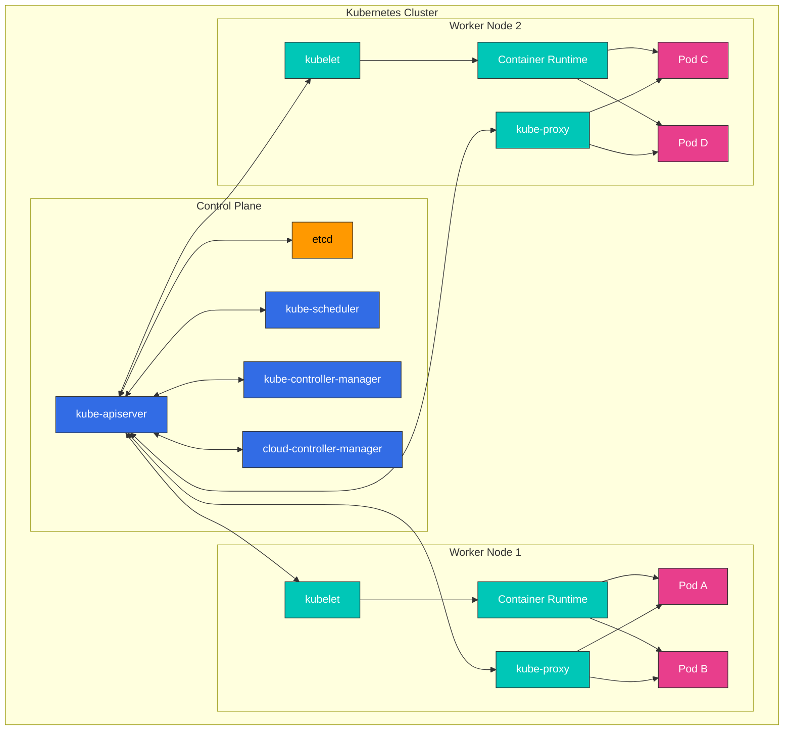

**Componentes del Control Plane**:
- **kube-apiserver**: Frontend que expone la Kubernetes API
- **etcd**: Almacén clave-valor que guarda todos los datos del cluster
- **kube-scheduler**: Selecciona nodes para ejecutar los pods recién creados
- **kube-controller-manager**: Ejecuta controllers que gestionan el estado del cluster
- **cloud-controller-manager**: Interactúa con las APIs del cloud provider

**Componentes del Worker Node**:
- **kubelet**: Agente que se ejecuta en cada node y gestiona la ejecución de contenedores
- **kube-proxy**: Mantiene reglas de red y realiza el reenvío de conexiones
- **Container Runtime**: Ejecuta contenedores (containerd, CRI-O, etc.)

## Control Plane Components

El control plane actúa como el "cerebro" del cluster Kubernetes, gestionando y controlando el estado general del cluster. Los componentes del control plane normalmente se ejecutan en máquinas dedicadas y pueden replicarse en múltiples instancias para alta disponibilidad.

### Control Plane Component Details

| Component | Main Functions | Communication Targets | High Availability Configuration |
|-----------|---------------|----------------------|--------------------------------|
| **kube-apiserver** | - Provides Kubernetes API<br>- Authentication and authorization<br>- API request processing | - All components<br>- etcd | Horizontal scaling with multiple instances |
| **etcd** | - Stores cluster data<br>- Distributed key-value store<br>- Ensures consistency | - kube-apiserver | Multi-node cluster |
| **kube-scheduler** | - Pod placement decisions<br>- Evaluates node resources<br>- Applies affinity/anti-affinity | - kube-apiserver | Active-standby configuration |
| **kube-controller-manager** | - Node controller<br>- Replication controller<br>- Endpoint controller<br>- Service account controller | - kube-apiserver | Active-standby configuration |
| **cloud-controller-manager** | - Cloud provider integration<br>- Node lifecycle<br>- Routing and load balancing | - kube-apiserver<br>- Cloud API | Active-standby configuration |

### Control Plane Communication Flow

1. El usuario o controller envía una solicitud a kube-apiserver
2. kube-apiserver realiza authentication, authorization y admission
3. kube-apiserver lee/escribe datos desde/hacia etcd
4. Controllers y scheduler observan el estado del cluster a través de kube-apiserver
5. kubelet informa el estado del node a kube-apiserver

### kube-apiserver

kube-apiserver es el frontend del control plane que expone la Kubernetes API. Todas las solicitudes internas y externas se procesan a través de este API server.

**Funciones principales**:
- Proporciona REST API
- Authentication y authorization
- Validación y procesamiento de solicitudes
- Comunicación con etcd
- Escalable horizontalmente (puede escalar a múltiples instancias)

**Flags y opciones de configuración principales**:
```bash
# Basic configuration example
kube-apiserver \
  --advertise-address=192.168.1.10 \
  --allow-privileged=true \
  --authorization-mode=Node,RBAC \
  --enable-admission-plugins=NodeRestriction \
  --enable-bootstrap-token-auth=true \
  --etcd-servers=https://127.0.0.1:2379 \
  --kubelet-client-certificate=/etc/kubernetes/pki/apiserver-kubelet-client.crt \
  --kubelet-client-key=/etc/kubernetes/pki/apiserver-kubelet-client.key \
  --service-account-key-file=/etc/kubernetes/pki/sa.pub \
  --service-cluster-ip-range=10.96.0.0/12 \
  --tls-cert-file=/etc/kubernetes/pki/apiserver.crt \
  --tls-private-key-file=/etc/kubernetes/pki/apiserver.key
```

**Seguridad del API Server**:
- Comunicación segura mediante certificados TLS
- Admite varios métodos de authentication (certificados X.509, service account tokens, OIDC, webhooks, etc.)
- Gestión de permisos mediante RBAC (Role-Based Access Control)
- Validación y modificación de solicitudes mediante admission controllers

### etcd

etcd es un almacén clave-valor consistente y altamente disponible que guarda todos los datos del cluster. Actúa como la "source of truth" de Kubernetes.

**Características clave**:
- Sistema distribuido
- Consistencia fuerte (usa el algoritmo de consenso Raft)
- Alta disponibilidad (puede configurarse con múltiples nodes)
- Almacenamiento seguro de datos
- Funcionalidad Watch para monitorear cambios

**Configuración de cluster etcd**:
```bash
# etcd cluster configuration example (3 nodes)
etcd \
  --name etcd-1 \
  --initial-advertise-peer-urls https://192.168.1.11:2380 \
  --listen-peer-urls https://192.168.1.11:2380 \
  --listen-client-urls https://192.168.1.11:2379,https://127.0.0.1:2379 \
  --advertise-client-urls https://192.168.1.11:2379 \
  --initial-cluster-token etcd-cluster \
  --initial-cluster etcd-1=https://192.168.1.11:2380,etcd-2=https://192.168.1.12:2380,etcd-3=https://192.168.1.13:2380 \
  --initial-cluster-state new \
  --data-dir=/var/lib/etcd
```

**Backup y recuperación de etcd**:
```bash
# etcd backup
ETCDCTL_API=3 etcdctl snapshot save snapshot.db \
  --endpoints=https://127.0.0.1:2379 \
  --cacert=/etc/kubernetes/pki/etcd/ca.crt \
  --cert=/etc/kubernetes/pki/etcd/server.crt \
  --key=/etc/kubernetes/pki/etcd/server.key

# etcd recovery
ETCDCTL_API=3 etcdctl snapshot restore snapshot.db \
  --data-dir=/var/lib/etcd-restore \
  --name=etcd-1 \
  --initial-cluster=etcd-1=https://192.168.1.11:2380 \
  --initial-cluster-token=etcd-cluster \
  --initial-advertise-peer-urls=https://192.168.1.11:2380
```

**Optimización de rendimiento de etcd**:
- Optimización de I/O de disco (se recomienda SSD)
- Asignación adecuada de memoria
- Compaction y defragmentation regulares
- Número adecuado de nodes etcd según el tamaño del cluster (normalmente 3 o 5)

#### July 2026 Update: etcd v3.7.0 Released

El 8 de julio de 2026, SIG etcd publicó etcd v3.7.0. Aspectos destacados:

- **RangeStream**: transmite resultados de rangos grandes en fragmentos en lugar de almacenar toda la respuesta en memoria (una funcionalidad muy solicitada)
- **Mejoras de rendimiento**: solicitudes de rango solo de claves optimizadas, leases más rápidos y fiables
- Elimina los últimos restos del v2store heredado y completa una importante renovación de protobuf
- Incluye dependencias core actualizadas: bbolt v1.5.0 y raft v3.7.0

Consulta el [anuncio oficial](https://kubernetes.io/blog/2026/07/08/announcing-etcd-3.7/) y el [changelog de etcd v3.7](https://github.com/etcd-io/etcd/blob/main/CHANGELOG/CHANGELOG-3.7.md) para más detalles.

### kube-scheduler

kube-scheduler es el componente del control plane que selecciona nodes para ejecutar los pods recién creados.

**Proceso de scheduling**:
1. **Filtering**: Identificar nodes que pueden ejecutar el pod
   - Requisitos de recursos (CPU, memoria)
   - Node selectors, node affinity
   - Taints y tolerations
   - Restricciones de Volume

2. **Scoring**: Asignar puntuaciones a los nodes adecuados
   - Utilización de recursos
   - Pod inter-affinity/anti-affinity
   - Localidad de datos
   - Load balancing entre nodes

3. **Binding**: Asignar el pod al node óptimo

**Configuración del scheduler**:
```bash
# Basic configuration example
kube-scheduler \
  --kubeconfig=/etc/kubernetes/scheduler.conf \
  --leader-elect=true \
  --v=2
```

**Scheduler profiles y plugins**:
- Scheduler profiles predeterminados
- Scheduler profiles personalizados
- Puntos de extensión del scheduler (filter, score, bind, etc.)
- Soporte para múltiples schedulers

**Scheduling Policy**:
```yaml
# Scheduling policy example
apiVersion: kubescheduler.config.k8s.io/v1
kind: KubeSchedulerConfiguration
profiles:
- schedulerName: default-scheduler
  plugins:
    score:
      disabled:
      - name: NodeResourcesLeastAllocated
      enabled:
      - name: NodeResourcesMostAllocated
        weight: 1
```

### kube-controller-manager

kube-controller-manager es el componente del control plane que ejecuta múltiples procesos controller. Cada controller gestiona un aspecto específico del cluster.

**Controllers principales**:
- **Node Controller**: Monitorea y responde al estado del node
- **Replication Controller**: Mantiene el número de réplicas de pod
- **Endpoint Controller**: Conecta services y pods
- **Service Account & Token Controller**: Crea cuentas predeterminadas y API tokens para namespaces
- **Job Controller**: Gestiona tareas de una sola ejecución
- **CronJob Controller**: Gestiona tareas programadas
- **DaemonSet Controller**: Asegura que pods específicos se ejecuten en todos los nodes
- **StatefulSet Controller**: Gestiona aplicaciones con estado
- **PV Controller**: Gestiona persistent volumes
- **Namespace Controller**: Gestiona el ciclo de vida de namespaces
- **Garbage Collector**: Limpia objetos huérfanos

**Configuración del Controller Manager**:
```bash
# Basic configuration example
kube-controller-manager \
  --kubeconfig=/etc/kubernetes/controller-manager.conf \
  --leader-elect=true \
  --use-service-account-credentials=true \
  --root-ca-file=/etc/kubernetes/pki/ca.crt \
  --service-account-private-key-file=/etc/kubernetes/pki/sa.key \
  --cluster-signing-cert-file=/etc/kubernetes/pki/ca.crt \
  --cluster-signing-key-file=/etc/kubernetes/pki/ca.key \
  --controllers=*,bootstrapsigner,tokencleaner
```

**Operación de controllers**:
1. Los controllers observan continuamente el estado del cluster a través del API server
2. Detectan diferencias entre el estado actual y el estado deseado
3. Realizan operaciones para reconciliar la diferencia
4. Informan cambios de estado al API server

### cloud-controller-manager

cloud-controller-manager es el componente del control plane que contiene lógica de control específica de la nube. Esto permite separar el core de Kubernetes de las APIs del cloud provider.

**Controllers principales**:
- **Node Controller**: Verifica el estado del node a través de la API del cloud provider
- **Route Controller**: Configura rutas en entornos cloud
- **Service Controller**: Crea, actualiza y elimina cloud load balancers
- **Volume Controller**: Crea, adjunta y monta volumes de cloud storage

**Implementaciones de Cloud Provider**:
- AWS Cloud Controller Manager
- Azure Cloud Controller Manager
- GCP Cloud Controller Manager
- OpenStack Cloud Controller Manager
- vSphere Cloud Controller Manager

**Configuración del Cloud Controller Manager**:
```bash
# AWS Cloud Controller Manager example
cloud-controller-manager \
  --cloud-provider=aws \
  --cloud-config=/etc/kubernetes/cloud-config \
  --kubeconfig=/etc/kubernetes/cloud-controller-manager.conf \
  --leader-elect=true
```

**Beneficios de Cloud Controller Manager**:
- Separación del código específico del cloud provider respecto del core de Kubernetes
- Los cloud providers pueden desarrollar sus propias funciones de forma independiente
- Añade funcionalidades cloud sin cambiar el core de Kubernetes

## Node Components

Los nodes son máquinas worker en el cluster Kubernetes que ejecutan aplicaciones en contenedores. Cada node es gestionado por el control plane y consta de múltiples componentes.

### kubelet

kubelet es un agente que se ejecuta en cada node y gestiona contenedores dentro de pods. kubelet recibe PodSpecs mediante diversos mecanismos y asegura que los contenedores se ejecuten correctamente según esas especificaciones.

**Funciones principales**:
- Ejecuta contenedores según el PodSpec
- Monitorea e informa el estado de los contenedores
- Gestiona el ciclo de vida de los contenedores
- Gestiona montajes de volumes
- Informa el estado del node
- Realiza health checks de contenedores

**Configuración de kubelet**:
```bash
# Basic configuration example
kubelet \
  --kubeconfig=/etc/kubernetes/kubelet.conf \
  --config=/var/lib/kubelet/config.yaml \
  --container-runtime=remote \
  --container-runtime-endpoint=unix:///var/run/containerd/containerd.sock \
  --pod-infra-container-image=k8s.gcr.io/pause:3.6
```

**Ejemplo de archivo de configuración de kubelet**:
```yaml
# /var/lib/kubelet/config.yaml
apiVersion: kubelet.config.k8s.io/v1beta1
kind: KubeletConfiguration
address: 0.0.0.0
authentication:
  anonymous:
    enabled: false
  webhook:
    cacheTTL: 2m0s
    enabled: true
  x509:
    clientCAFile: /etc/kubernetes/pki/ca.crt
authorization:
  mode: Webhook
  webhook:
    cacheAuthorizedTTL: 5m0s
    cacheUnauthorizedTTL: 30s
cgroupDriver: systemd
clusterDomain: cluster.local
cpuManagerPolicy: none
evictionHard:
  memory.available: 100Mi
  nodefs.available: 10%
  nodefs.inodesFree: 5%
failSwapOn: true
healthzBindAddress: 127.0.0.1
healthzPort: 10248
```

**Static Pods**:
kubelet puede ejecutar static pods que gestiona directamente sin pasar por el API server. Esto se usa principalmente para ejecutar componentes del control plane.

```yaml
# /etc/kubernetes/manifests/kube-apiserver.yaml
apiVersion: v1
kind: Pod
metadata:
  name: kube-apiserver
  namespace: kube-system
spec:
  containers:
  - name: kube-apiserver
    image: k8s.gcr.io/kube-apiserver:v1.24.0
    command:
    - kube-apiserver
    - --advertise-address=192.168.1.10
    # ... additional flags
```

### kube-proxy

kube-proxy es un network proxy que se ejecuta en cada node e implementa el concepto de Kubernetes Service. Mantiene reglas de red en los nodes y realiza el reenvío de conexiones.

**Funciones principales**:
- Mantiene reglas de red para IPs y puertos de service
- Reenvío de conexiones
- Implementa load balancing
- Soporta service discovery

**Modos de operación**:
1. **userspace mode**: Ejecuta proxy en espacio de usuario (heredado)
2. **iptables mode**: Implementación de NAT usando Linux iptables (predeterminado)
3. **IPVS mode**: Usa IP Virtual Server del kernel de Linux (alto rendimiento)

**Configuración de kube-proxy**:
```bash
# Basic configuration example
kube-proxy \
  --config=/var/lib/kube-proxy/config.conf \
  --hostname-override=node1
```

**Ejemplo de archivo de configuración de kube-proxy**:
```yaml
# /var/lib/kube-proxy/config.conf
apiVersion: kubeproxy.config.k8s.io/v1alpha1
kind: KubeProxyConfiguration
bindAddress: 0.0.0.0
clientConnection:
  acceptContentTypes: ""
  burst: 10
  contentType: application/vnd.kubernetes.protobuf
  kubeconfig: /var/lib/kube-proxy/kubeconfig.conf
  qps: 5
clusterCIDR: 10.244.0.0/16
configSyncPeriod: 15m0s
conntrack:
  maxPerCore: 32768
  min: 131072
  tcpCloseWaitTimeout: 1h0m0s
  tcpEstablishedTimeout: 24h0m0s
enableProfiling: false
healthzBindAddress: 0.0.0.0:10256
hostnameOverride: node1
iptables:
  masqueradeAll: false
  masqueradeBit: 14
  minSyncPeriod: 0s
  syncPeriod: 30s
ipvs:
  excludeCIDRs: null
  minSyncPeriod: 0s
  scheduler: ""
  syncPeriod: 30s
mode: "iptables"
```

**Comparación de IPVS vs iptables mode**:

| Characteristic | iptables Mode | IPVS Mode |
|----------------|---------------|-----------|
| Performance | Performance degradation with many services | Better performance in large clusters |
| Load Balancing Algorithms | Only round robin supported | Various algorithms supported (rr, lc, dh, sh, sed, nq) |
| Implementation | Network packet filtering chains | Hash table based |
| Kernel Requirements | Default kernel modules | IPVS kernel module required |

### Container Runtime

Container runtime es el software que ejecuta contenedores. Kubernetes admite varios container runtimes mediante Container Runtime Interface (CRI).

**Container runtimes principales**:
1. **containerd**: Container runtime ligero (actualmente el más utilizado)
2. **CRI-O**: Runtime ligero diseñado específicamente para Kubernetes
3. **Docker Engine**: Compatible mediante Docker shim (obsoleto desde Kubernetes 1.24)

**Estructura de capas de Container Runtime**:

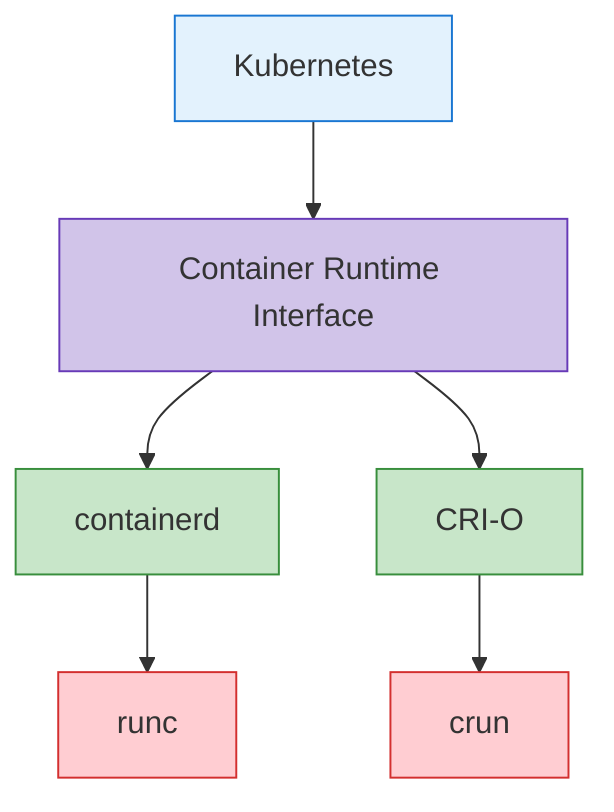

**Ejemplo de configuración de containerd**:
```toml
# /etc/containerd/config.toml
version = 2

[plugins]
  [plugins."io.containerd.grpc.v1.cri"]
    sandbox_image = "k8s.gcr.io/pause:3.6"
    [plugins."io.containerd.grpc.v1.cri".containerd]
      default_runtime_name = "runc"
      [plugins."io.containerd.grpc.v1.cri".containerd.runtimes]
        [plugins."io.containerd.grpc.v1.cri".containerd.runtimes.runc]
          runtime_type = "io.containerd.runc.v2"
          [plugins."io.containerd.grpc.v1.cri".containerd.runtimes.runc.options]
            SystemdCgroup = true
```

**Ejemplo de configuración de CRI-O**:
```toml
# /etc/crio/crio.conf
[crio]
root = "/var/lib/containers/storage"
runroot = "/var/run/containers/storage"
storage_driver = "overlay"
storage_option = ["overlay.mountopt=nodev"]

[crio.runtime]
default_runtime = "runc"
conmon = "/usr/bin/conmon"
conmon_cgroup = "pod"
cgroup_manager = "systemd"

[crio.image]
pause_image = "k8s.gcr.io/pause:3.6"
```

### Add-on Components

Los add-ons son componentes adicionales que amplían la funcionalidad de los clusters Kubernetes. Algunos add-ons importantes incluyen:

1. **CNI Network Plugins**: Implementan pod networking
   - Calico, Cilium, Flannel, Weave Net, etc.

2. **DNS**: Proporciona servicio DNS dentro del cluster
   - CoreDNS (predeterminado)

3. **Dashboard**: Proporciona una UI basada en web
   - Kubernetes Dashboard

4. **Ingress Controller**: Gestiona routing HTTP/HTTPS
   - NGINX Ingress Controller, Traefik, HAProxy, etc.

5. **Metrics Server**: Recopila métricas de uso de recursos
   - Metrics Server

6. **Logging and Monitoring**: Recopilación de logs y monitoring
   - Prometheus, Grafana, Elasticsearch, Fluentd, Kibana, etc.

**Ejemplo de configuración de CoreDNS**:
```yaml
apiVersion: v1
kind: ConfigMap
metadata:
  name: coredns
  namespace: kube-system
data:
  Corefile: |
    .:53 {
        errors
        health {
            lameduck 5s
        }
        ready
        kubernetes cluster.local in-addr.arpa ip6.arpa {
            pods insecure
            fallthrough in-addr.arpa ip6.arpa
            ttl 30
        }
        prometheus :9153
        forward . /etc/resolv.conf {
            max_concurrent 1000
        }
        cache 30
        loop
        reload
        loadbalance
    }
```

**Ejemplo de configuración de Calico CNI**:
```yaml
apiVersion: v1
kind: ConfigMap
metadata:
  name: calico-config
  namespace: kube-system
data:
  calico_backend: "bird"
  cni_network_config: |-
    {
      "name": "k8s-pod-network",
      "cniVersion": "0.3.1",
      "plugins": [
        {
          "type": "calico",
          "log_level": "info",
          "datastore_type": "kubernetes",
          "nodename": "__KUBERNETES_NODE_NAME__",
          "mtu": __CNI_MTU__,
          "ipam": {
            "type": "calico-ipam"
          },
          "policy": {
            "type": "k8s"
          },
          "kubernetes": {
            "kubeconfig": "__KUBECONFIG_FILEPATH__"
          }
        },
        {
          "type": "portmap",
          "snat": true,
          "capabilities": {"portMappings": true}
        }
      ]
    }
```

## Cluster Communication Paths

La comunicación entre diversos componentes ocurre dentro de un cluster Kubernetes. Comprender estas rutas de comunicación es importante para el diseño, la seguridad y la solución de problemas del cluster.

### Control Plane Internal Communication

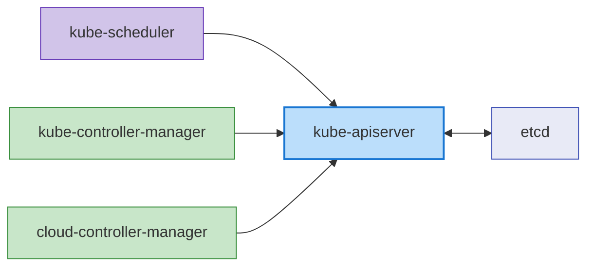

La comunicación entre componentes del control plane es la siguiente:

1. **kube-apiserver y etcd**: kube-apiserver se comunica con etcd para almacenar y recuperar el estado del cluster.
   - Protocolo: gRPC
   - Puerto: 2379/TCP
   - Seguridad: Authentication basada en certificados TLS

2. **kube-scheduler y kube-apiserver**: kube-scheduler se comunica con kube-apiserver para el pod scheduling.
   - Protocolo: HTTPS
   - Puerto: 6443/TCP (kube-apiserver)
   - Seguridad: Authentication basada en certificados TLS

3. **kube-controller-manager y kube-apiserver**: Los controllers se comunican con kube-apiserver para observar y modificar el estado del cluster.
   - Protocolo: HTTPS
   - Puerto: 6443/TCP (kube-apiserver)
   - Seguridad: Authentication basada en certificados TLS

4. **cloud-controller-manager y kube-apiserver**: El cloud controller se comunica con kube-apiserver para observar el estado del cluster y gestionar recursos cloud.
   - Protocolo: HTTPS
   - Puerto: 6443/TCP (kube-apiserver)
   - Seguridad: Authentication basada en certificados TLS

### Control Plane and Node Communication

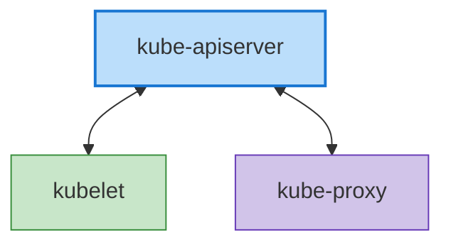

La comunicación entre el control plane y los nodes es la siguiente:

1. **kube-apiserver y kubelet**: kube-apiserver se comunica con kubelet para entregar pod specs y recopilar el estado del node.
   - Protocolo: HTTPS
   - Puerto: 10250/TCP (kubelet)
   - Seguridad: Authentication basada en certificados TLS

2. **kubelet y kube-apiserver**: kubelet se comunica con kube-apiserver para el registro de nodes, informes de estado de pods y transmisión de eventos.
   - Protocolo: HTTPS
   - Puerto: 6443/TCP (kube-apiserver)
   - Seguridad: Authentication basada en certificados TLS

3. **kube-proxy y kube-apiserver**: kube-proxy se comunica con kube-apiserver para recuperar información de services.
   - Protocolo: HTTPS
   - Puerto: 6443/TCP (kube-apiserver)
   - Seguridad: Authentication basada en certificados TLS

### Inter-Node Communication

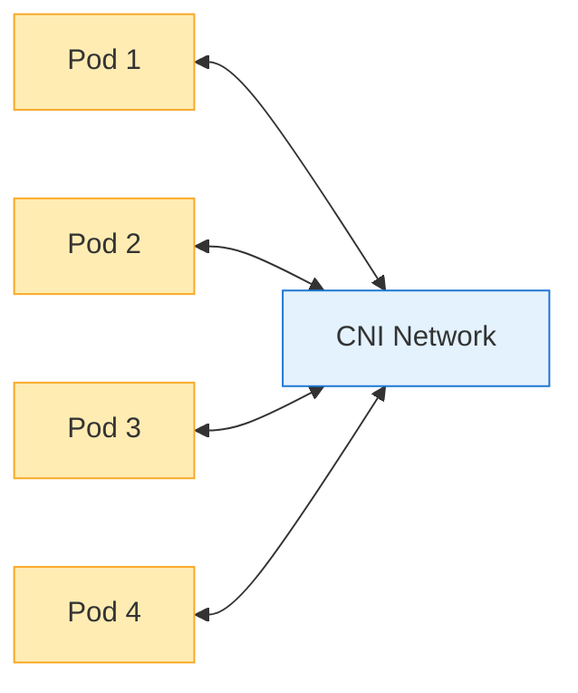

La comunicación entre nodes es la siguiente:

1. **Comunicación Pod-to-Pod**: Los pods se comunican entre sí a través de la red proporcionada por CNI plugins.
   - Protocolo: Depende de la aplicación (TCP, UDP, etc.)
   - Puerto: Depende de la aplicación
   - Seguridad: Puede controlarse mediante network policies

2. **Comunicación Cross-Node Pod**: La comunicación entre pods en distintos nodes es manejada por el CNI plugin.
   - Protocolo: Depende de la aplicación (TCP, UDP, etc.)
   - Puerto: Depende de la aplicación
   - Seguridad: Puede controlarse mediante network policies

### External Communication

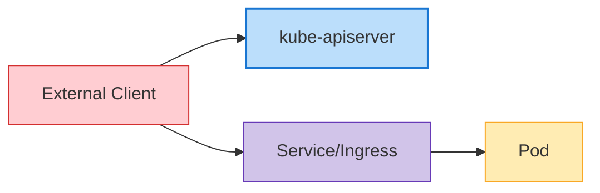

La comunicación con entidades externas es la siguiente:

1. **Cliente y kube-apiserver**: Los usuarios y sistemas externos interactúan con el cluster a través de kube-apiserver.
   - Protocolo: HTTPS
   - Puerto: 6443/TCP (kube-apiserver)
   - Seguridad: Certificados TLS, tokens, user authentication, etc.

2. **Tráfico externo y Services**: El tráfico externo accede a aplicaciones dentro del cluster a través de NodePort, LoadBalancer services o Ingress.
   - Protocolo: HTTP, HTTPS, TCP, UDP, etc.
   - Puerto: Depende de la configuración del service
   - Seguridad: Depende del ingress controller y de la configuración del service

### Communication Security

La seguridad de la comunicación dentro de un cluster Kubernetes se implementa mediante los siguientes métodos:

1. **Certificados TLS**: Toda comunicación entre componentes del control plane se cifra con certificados TLS.
2. **Authentication y Authorization**: Todas las solicitudes al API server pasan por procesos de authentication y authorization.
3. **Network Policies**: La comunicación pod-to-pod puede restringirse mediante network policies.
4. **Secrets cifrados**: Los Secrets almacenados en etcd pueden cifrarse.

**Ejemplo de configuración de seguridad de comunicación del API Server**:
```yaml
apiVersion: apiserver.config.k8s.io/v1
kind: EncryptionConfiguration
resources:
  - resources:
    - secrets
    providers:
    - aescbc:
        keys:
        - name: key1
          secret: <base64-encoded-key>
    - identity: {}
```

### High Availability Cluster Configuration

Los clusters Kubernetes de alta disponibilidad (HA) están diseñados para eliminar puntos únicos de fallo y continuar operando sin interrupción del servicio.

### Control Plane High Availability

La alta disponibilidad del control plane se implementa mediante los siguientes métodos:

1. **Múltiples Control Plane Nodes**: Normalmente se despliegan 3 o 5 control plane nodes para redundancia
2. **Cluster etcd**: Desplegar un cluster compuesto por múltiples instancias etcd (normalmente 3 o 5)
3. **Load Balancer**: Colocar un load balancer delante de los API servers para distribuir el tráfico

**Arquitectura de Control Plane de alta disponibilidad**:

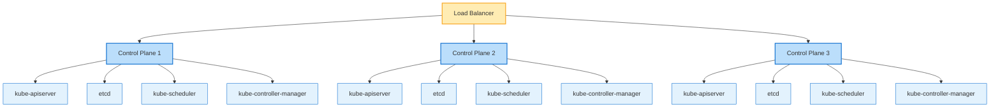

**Configuración de cluster etcd**:

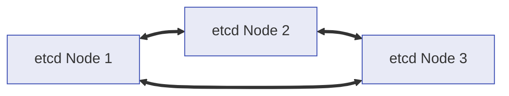

### Worker Node High Availability

La alta disponibilidad de worker nodes se implementa mediante los siguientes métodos:

1. **Múltiples Worker Nodes**: Distribuir workloads entre múltiples worker nodes
2. **Recuperación automática de nodes**: Utilizar funcionalidades de recuperación automática del cloud provider
3. **Auto Scaling**: Escalado automático de nodes mediante cluster autoscaler
4. **Múltiples Availability Zones**: Desplegar nodes en múltiples availability zones

**Despliegue distribuido de Worker Nodes**:

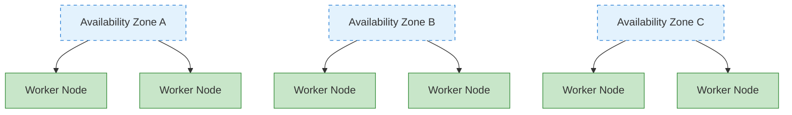

### Application High Availability

La alta disponibilidad de aplicaciones se implementa mediante los siguientes métodos:

1. **ReplicaSet/Deployment**: Ejecutar múltiples réplicas de pod
2. **Reglas de distribución de pods**: Distribuir pods entre múltiples nodes mediante pod anti-affinity
3. **PodDisruptionBudget**: Asegurar disponibilidad mínima durante interrupciones planificadas
4. **Service y Load Balancing**: Distribuir tráfico entre múltiples pods

**Ejemplo de Pod Anti-Affinity**:
```yaml
apiVersion: apps/v1
kind: Deployment
metadata:
  name: web-server
spec:
  replicas: 3
  template:
    metadata:
      labels:
        app: web-server
    spec:
      affinity:
        podAntiAffinity:
          requiredDuringSchedulingIgnoredDuringExecution:
          - labelSelector:
              matchExpressions:
              - key: app
                operator: In
                values:
                - web-server
            topologyKey: "kubernetes.io/hostname"
      containers:
      - name: web-server
        image: nginx:1.21
```

**Ejemplo de PodDisruptionBudget**:
```yaml
apiVersion: policy/v1
kind: PodDisruptionBudget
metadata:
  name: web-server-pdb
spec:
  minAvailable: 2
  selector:
    matchLabels:
      app: web-server
```

### Disaster Recovery Strategy

Las estrategias de disaster recovery para clusters Kubernetes se implementan mediante los siguientes métodos:

1. **Backup y recuperación de etcd**: Establecer procedimientos regulares de backup y recuperación de datos de etcd
2. **Despliegue Multi-Region**: Desplegar clusters en múltiples regiones
3. **Cluster Federation**: Gestionar múltiples clusters en federación
4. **Backup continuo**: Backup continuo de datos de aplicaciones

**Ejemplo de script de backup de etcd**:
```bash
#!/bin/bash
ETCDCTL_API=3 etcdctl snapshot save /backup/etcd-snapshot-$(date +%Y%m%d-%H%M%S).db \
  --endpoints=https://127.0.0.1:2379 \
  --cacert=/etc/kubernetes/pki/etcd/ca.crt \
  --cert=/etc/kubernetes/pki/etcd/server.crt \
  --key=/etc/kubernetes/pki/etcd/server.key
```

**Ejemplo de script de recuperación de etcd**:
```bash
#!/bin/bash
# Stop cluster
systemctl stop kubelet
docker stop $(docker ps -q)

# Recover etcd data
ETCDCTL_API=3 etcdctl snapshot restore /backup/etcd-snapshot.db \
  --data-dir=/var/lib/etcd-restore \
  --name=master \
  --initial-cluster=master=https://127.0.0.1:2380 \
  --initial-cluster-token=etcd-cluster \
  --initial-advertise-peer-urls=https://127.0.0.1:2380

# Replace etcd directory with recovered data
mv /var/lib/etcd /var/lib/etcd.old
mv /var/lib/etcd-restore /var/lib/etcd

# Restart cluster
systemctl start kubelet
```

## Cluster Networking

Kubernetes networking permite la comunicación entre pods, services y el mundo exterior. El modelo de networking de Kubernetes asume que cada pod tiene una dirección IP única y puede comunicarse con otros pods sin NAT.

### Networking Model

El modelo de networking de Kubernetes tiene los siguientes requisitos:

1. **Comunicación Pod-to-Pod**: Todos los pods deben poder comunicarse con todos los demás pods sin NAT
2. **Comunicación Node-to-Pod**: Los nodes deben poder comunicarse con todos los pods sin NAT
3. **Comunicación Pod-to-External**: Los pods deben poder comunicarse con el mundo exterior (normalmente usando NAT)

### CNI (Container Network Interface)

CNI es una interfaz estándar para implementar networking en Kubernetes. Existen varios CNI plugins, cada uno con distintas funcionalidades y características de rendimiento.

**CNI plugins principales**:

1. **Calico**: Networking basado en BGP, soporte para network policies
   - Funcionalidades: Alto rendimiento, network policies, cifrado, soporte eBPF
   - Casos de uso: Clusters grandes, entornos centrados en seguridad

2. **Cilium**: Networking y seguridad basados en eBPF
   - Funcionalidades: Políticas de seguridad L3-L7, alto rendimiento, observabilidad
   - Casos de uso: Microservices, entornos centrados en seguridad

3. **Flannel**: Red overlay simple
   - Funcionalidades: Configuración simple, ligero
   - Casos de uso: Clusters pequeños, entornos de desarrollo

4. **Weave Net**: Networking de contenedores multi-host
   - Funcionalidades: Cifrado, network policies, multi-cloud
   - Casos de uso: Hybrid cloud, multi-cloud

**Ejemplo de configuración de CNI (Calico)**:
```yaml
apiVersion: v1
kind: ConfigMap
metadata:
  name: calico-config
  namespace: kube-system
data:
  calico_backend: "bird"
  cni_network_config: |-
    {
      "name": "k8s-pod-network",
      "cniVersion": "0.3.1",
      "plugins": [
        {
          "type": "calico",
          "log_level": "info",
          "datastore_type": "kubernetes",
          "nodename": "__KUBERNETES_NODE_NAME__",
          "mtu": __CNI_MTU__,
          "ipam": {
            "type": "calico-ipam"
          },
          "policy": {
            "type": "k8s"
          },
          "kubernetes": {
            "kubeconfig": "__KUBECONFIG_FILEPATH__"
          }
        },
        {
          "type": "portmap",
          "snat": true,
          "capabilities": {"portMappings": true}
        }
      ]
    }
```

### Service Networking

Kubernetes Services proporcionan endpoints estables para un conjunto de pods. Los Services tienen varios tipos, incluidos ClusterIP, NodePort, LoadBalancer y ExternalName.

**Componentes de Service Networking**:

1. **ClusterIP**: IP virtual accesible solo dentro del cluster
2. **kube-proxy**: Enruta tráfico hacia service IPs a pods
3. **CoreDNS**: Servicio DNS para service discovery

**Flujo de Service Networking**:
```
Client -> Service (ClusterIP) -> kube-proxy -> Pod
```

**Ejemplo de Service**:
```yaml
apiVersion: v1
kind: Service
metadata:
  name: my-service
spec:
  selector:
    app: my-app
  ports:
  - port: 80
    targetPort: 8080
  type: ClusterIP
```

### Ingress Networking

Ingress gestiona el routing HTTP y HTTPS desde fuera del cluster hacia services dentro del cluster. Los ingress controllers implementan ingress resources.

**Ingress Controllers principales**:
1. **NGINX Ingress Controller**: Ingress controller basado en NGINX
2. **AWS ALB Ingress Controller**: Basado en AWS Application Load Balancer
3. **Traefik**: Edge router cloud-native
4. **HAProxy Ingress**: Ingress controller basado en HAProxy

**Flujo de Ingress Networking**:
```
Client -> Ingress Controller -> Service -> Pod
```

**Ejemplo de Ingress**:
```yaml
apiVersion: networking.k8s.io/v1
kind: Ingress
metadata:
  name: my-ingress
  annotations:
    nginx.ingress.kubernetes.io/rewrite-target: /
spec:
  ingressClassName: nginx
  rules:
  - host: example.com
    http:
      paths:
      - path: /app
        pathType: Prefix
        backend:
          service:
            name: my-service
            port:
              number: 80
```

### Network Policies

Las network policies proporcionan una forma de controlar la comunicación entre pods. De forma predeterminada, todos los pods pueden comunicarse entre sí, pero las network policies pueden restringir esto.

**Ejemplo de Network Policy**:
```yaml
apiVersion: networking.k8s.io/v1
kind: NetworkPolicy
metadata:
  name: db-network-policy
spec:
  podSelector:
    matchLabels:
      role: db
  policyTypes:
  - Ingress
  - Egress
  ingress:
  - from:
    - podSelector:
        matchLabels:
          role: frontend
    ports:
    - protocol: TCP
      port: 3306
  egress:
  - to:
    - podSelector:
        matchLabels:
          role: monitoring
    ports:
    - protocol: TCP
      port: 9090
```

### Network Troubleshooting

Herramientas y comandos comunes para solucionar problemas de Kubernetes networking:

1. **ping, traceroute**: Pruebas básicas de conectividad de red
2. **tcpdump**: Captura y análisis de paquetes de red
3. **netstat, ss**: Verificar el estado de conexiones de red
4. **nslookup, dig**: Pruebas de lookup DNS
5. **kubectl exec**: Ejecutar comandos de red dentro de pods

**Ejemplo de depuración de red**:
```bash
# Test network connectivity within a pod
kubectl exec -it <pod-name> -- ping <target-ip>

# Test DNS lookup within a pod
kubectl exec -it <pod-name> -- nslookup <service-name>

# Capture network packets within a pod
kubectl exec -it <pod-name> -- tcpdump -i eth0 -n

# Check service endpoints
kubectl get endpoints <service-name>
```

## Cluster Storage

Kubernetes storage proporciona persistencia de datos para aplicaciones en contenedores. Kubernetes ofrece varias opciones y abstracciones de storage para ayudar a las aplicaciones a usar almacenamiento de manera eficiente.

### Storage Architecture

La arquitectura de Kubernetes storage consta de los siguientes componentes:

1. **Volumes**: Directorios que pueden montarse en contenedores dentro de pods
2. **Persistent Volumes (PV)**: Recursos de storage en el cluster
3. **Persistent Volume Claims (PVC)**: Solicitudes de storage de usuarios
4. **Storage Classes**: Define "classes" o tipos de storage
5. **CSI (Container Storage Interface)**: Interfaz estándar con sistemas de storage

**Flujo de Storage Architecture**:

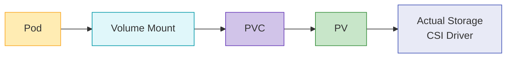

### Volume Types

Kubernetes admite varios tipos de volumes:

1. **Ephemeral Volumes**:
   - **emptyDir**: Comienza como un directorio vacío y se elimina cuando el pod se elimina
   - **configMap**: Monta ConfigMap como volume
   - **secret**: Monta Secret como volume
   - **downwardAPI**: Expone información del pod y del contenedor como archivos

2. **Persistent Volumes**:
   - **awsElasticBlockStore**: AWS EBS volumes
   - **azureDisk**: Azure Disk
   - **gcePersistentDisk**: GCE Persistent Disk
   - **nfs**: NFS volumes
   - **csi**: Volumes mediante CSI drivers

**Ejemplo de Volume**:
```yaml
apiVersion: v1
kind: Pod
metadata:
  name: test-pd
spec:
  containers:
  - name: test-container
    image: nginx
    volumeMounts:
    - mountPath: /test-pd
      name: test-volume
  volumes:
  - name: test-volume
    persistentVolumeClaim:
      claimName: test-pvc
```

### Persistent Volumes and Claims

Persistent Volumes (PV) son recursos de storage en el cluster que son provisionados por administradores o provisionados dinámicamente mediante storage classes. Persistent Volume Claims (PVC) son solicitudes de storage de usuarios.

**Ejemplo de Persistent Volume**:
```yaml
apiVersion: v1
kind: PersistentVolume
metadata:
  name: pv-example
spec:
  capacity:
    storage: 10Gi
  accessModes:
    - ReadWriteOnce
  persistentVolumeReclaimPolicy: Retain
  storageClassName: standard
  awsElasticBlockStore:
    volumeID: vol-0123456789abcdef0
    fsType: ext4
```

**Ejemplo de Persistent Volume Claim**:
```yaml
apiVersion: v1
kind: PersistentVolumeClaim
metadata:
  name: pvc-example
spec:
  accessModes:
    - ReadWriteOnce
  resources:
    requests:
      storage: 5Gi
  storageClassName: standard
```

### Storage Classes

Las storage classes describen las "classes" de storage que proporcionan los administradores. Las storage classes permiten el provisionamiento dinámico de PVs cuando se solicitan PVCs.

**Ejemplo de Storage Class**:
```yaml
apiVersion: storage.k8s.io/v1
kind: StorageClass
metadata:
  name: standard
provisioner: kubernetes.io/aws-ebs
parameters:
  type: gp3
  fsType: ext4
reclaimPolicy: Delete
allowVolumeExpansion: true
```

### CSI (Container Storage Interface)

CSI proporciona una interfaz estándar entre Kubernetes y los sistemas de storage. Mediante CSI, los storage providers pueden desarrollar sus propios storage drivers sin modificar el código de Kubernetes.

**Arquitectura CSI**:

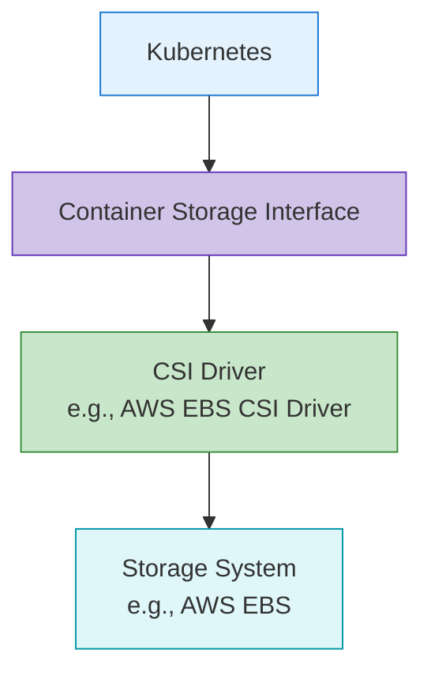

**Ejemplo de despliegue de CSI Driver**:
```yaml
apiVersion: storage.k8s.io/v1
kind: StorageClass
metadata:
  name: ebs-sc
provisioner: ebs.csi.aws.com
parameters:
  type: gp3
  fsType: ext4
  encrypted: "true"
volumeBindingMode: WaitForFirstConsumer
```

### Storage Best Practices

Buenas prácticas para usar Kubernetes storage:

1. **Elegir el tipo de storage adecuado**: Selecciona el tipo de storage que coincida con las características del workload
2. **Usar Dynamic Provisioning**: Utiliza dynamic provisioning mediante storage classes
3. **Elegir Access Modes adecuados**: Selecciona access modes que coincidan con los requisitos del workload
4. **Definir Resource Requests y Limits**: Solicita capacidad de storage adecuada
5. **Establecer estrategia de Backup y Recovery**: Preparar estrategias de backup y recovery para datos críticos
6. **Monitorear Storage**: Monitorear el uso y el rendimiento de storage

## Cluster Scalability

La escalabilidad de un cluster Kubernetes se refiere a la capacidad del cluster para manejar cargas y requisitos crecientes. La escalabilidad puede implementarse mediante escalado horizontal (scale out) y escalado vertical (scale up).

### Cluster Scale Limits

Los clusters Kubernetes tienen los siguientes límites de escala:

1. **Número de Nodes**: Máximo 5,000 nodes
2. **Número de Pods**: Máximo 150,000 pods por cluster
3. **Pods por Node**: Máximo 110 pods por node (predeterminado)
4. **Número de Services**: Máximo 10,000 services por cluster
5. **Containers por Pod**: Máximo 20 containers por pod

Estos límites pueden variar según la versión de Kubernetes y la configuración del cluster.

### Horizontal Scaling

El escalado horizontal aumenta la capacidad del cluster agregando más nodes.

**Node Auto Scaling**:
Kubernetes Cluster Autoscaler ajusta automáticamente el número de nodes según los requisitos del workload.

```yaml
# AWS Auto Scaling Group tags example
tags:
  k8s.io/cluster-autoscaler/enabled: "true"
  k8s.io/cluster-autoscaler/my-cluster: "owned"
```

**Ejemplo de despliegue de Cluster Autoscaler**:
```yaml
apiVersion: apps/v1
kind: Deployment
metadata:
  name: cluster-autoscaler
  namespace: kube-system
spec:
  replicas: 1
  selector:
    matchLabels:
      app: cluster-autoscaler
  template:
    metadata:
      labels:
        app: cluster-autoscaler
    spec:
      containers:
      - name: cluster-autoscaler
        image: k8s.gcr.io/autoscaling/cluster-autoscaler:v1.24.0
        command:
        - ./cluster-autoscaler
        - --cloud-provider=aws
        - --nodes=2:10:my-asg-group
        - --scale-down-unneeded-time=10m
```

**Karpenter**:
Karpenter es una nueva herramienta de node auto-scaling desarrollada por AWS que proporciona node provisioning más rápido y eficiente.

```yaml
apiVersion: karpenter.sh/v1
kind: NodePool
metadata:
  name: default
spec:
  template:
    spec:
      requirements:
        - key: karpenter.sh/capacity-type
          operator: In
          values: ["spot", "on-demand"]
      nodeClassRef:
        name: default-class
  limits:
    cpu: 1000
    memory: 1000Gi
---
apiVersion: karpenter.k8s.aws/v1
kind: EC2NodeClass
metadata:
  name: default-class
spec:
  subnetSelector:
    karpenter.sh/discovery: my-cluster
  securityGroupSelector:
    karpenter.sh/discovery: my-cluster
```

### Vertical Scaling

El escalado vertical aumenta los recursos (CPU, memoria) de los nodes existentes.

**Vertical Pod Autoscaler (VPA)**:
VPA ajusta automáticamente las solicitudes de CPU y memoria para pods.

```yaml
apiVersion: autoscaling.k8s.io/v1
kind: VerticalPodAutoscaler
metadata:
  name: my-app-vpa
spec:
  targetRef:
    apiVersion: "apps/v1"
    kind: Deployment
    name: my-app
  updatePolicy:
    updateMode: "Auto"
  resourcePolicy:
    containerPolicies:
    - containerName: '*'
      minAllowed:
        cpu: 100m
        memory: 50Mi
      maxAllowed:
        cpu: 1
        memory: 500Mi
```

### Application Scaling

El escalado a nivel de aplicación se implementa ajustando el número de réplicas de pod.

**Horizontal Pod Autoscaler (HPA)**:
HPA ajusta automáticamente el número de réplicas de pod según la utilización de CPU o métricas personalizadas.

```yaml
apiVersion: autoscaling/v2
kind: HorizontalPodAutoscaler
metadata:
  name: my-app-hpa
spec:
  scaleTargetRef:
    apiVersion: apps/v1
    kind: Deployment
    name: my-app
  minReplicas: 2
  maxReplicas: 10
  metrics:
  - type: Resource
    resource:
      name: cpu
      target:
        type: Utilization
        averageUtilization: 80
```

**KEDA (Kubernetes Event-driven Autoscaling)**:
KEDA proporciona autoscaling basado en eventos, lo que permite escalar según diversas fuentes de eventos.

```yaml
apiVersion: keda.sh/v1alpha1
kind: ScaledObject
metadata:
  name: my-app-scaledobject
spec:
  scaleTargetRef:
    name: my-app
  minReplicaCount: 0
  maxReplicaCount: 10
  triggers:
  - type: kafka
    metadata:
      bootstrapServers: kafka.svc:9092
      consumerGroup: my-group
      topic: my-topic
      lagThreshold: "10"
```

### Scalability Best Practices

Buenas prácticas para la escalabilidad de clusters Kubernetes:

1. **Definir Resource Requests y Limits**: Define resource requests y limits adecuados para todos los pods
2. **Estrategia de Node Pool**: Configura múltiples node pools para diferentes características de workload
3. **Configurar Auto Scaling**: Configura adecuadamente Cluster Autoscaler, HPA y VPA
4. **Ubicación eficiente de Pods**: Utiliza node affinity, pod affinity/anti-affinity
5. **Monitoreo del cluster**: Monitorea continuamente el uso de recursos y el rendimiento
6. **Load Testing**: Realiza load testing regular para validar estrategias de escalado

## Cluster Security

La seguridad de un cluster Kubernetes debe implementarse en múltiples capas. Esto incluye authentication, authorization, network policies, pod security y más.

### Authentication

Métodos para autenticar el acceso al Kubernetes API server:

1. **Certificados X.509**: Authentication mediante certificados cliente TLS
2. **Service Account Tokens**: Tokens para acceso al API server dentro de pods
3. **OpenID Connect (OIDC)**: Authentication mediante identity providers externos
4. **Webhook Token Authentication**: Authentication mediante servicios de authentication externos
5. **Authentication Proxy**: Authentication mediante proxies de authentication

**Ejemplo de kubeconfig**:
```yaml
apiVersion: v1
kind: Config
clusters:
- name: my-cluster
  cluster:
    certificate-authority-data: <CA-DATA>
    server: https://api.my-cluster.example.com
users:
- name: admin
  user:
    client-certificate-data: <CERT-DATA>
    client-key-data: <KEY-DATA>
contexts:
- name: my-context
  context:
    cluster: my-cluster
    user: admin
current-context: my-context
```

### Authorization

Métodos para controlar acciones de usuarios autenticados:

1. **RBAC (Role-Based Access Control)**: Control de acceso basado en roles
2. **ABAC (Attribute-Based Access Control)**: Control de acceso basado en atributos
3. **Node Authorization**: Authorization especial para nodes
4. **Webhook Authorization**: Authorization mediante servicios externos

**Ejemplo de RBAC**:
```yaml
# Role definition
apiVersion: rbac.authorization.k8s.io/v1
kind: Role
metadata:
  namespace: default
  name: pod-reader
rules:
- apiGroups: [""]
  resources: ["pods"]
  verbs: ["get", "watch", "list"]

# Role binding
apiVersion: rbac.authorization.k8s.io/v1
kind: RoleBinding
metadata:
  name: read-pods
  namespace: default
subjects:
- kind: User
  name: jane
  apiGroup: rbac.authorization.k8s.io
roleRef:
  kind: Role
  name: pod-reader
  apiGroup: rbac.authorization.k8s.io
```

### Network Security

Métodos para proteger el tráfico de red dentro del cluster:

1. **Network Policies**: Controlar la comunicación pod-to-pod
2. **Comunicación cifrada**: Cifrado de comunicaciones mediante TLS
3. **Service Mesh**: Seguridad de red avanzada mediante Istio, Linkerd, etc.

**Ejemplo de Network Policy**:
```yaml
apiVersion: networking.k8s.io/v1
kind: NetworkPolicy
metadata:
  name: default-deny-all
spec:
  podSelector: {}
  policyTypes:
  - Ingress
  - Egress
```

### Pod Security

Implementación de seguridad a nivel de pod:

1. **Pod Security Context**: Configuraciones de seguridad a nivel de pod y container
2. **Pod Security Standards**: Define requisitos de pod security
3. **seccomp Profiles**: Restricciones de llamadas al sistema
4. **AppArmor/SELinux**: Mandatory access control

**Ejemplo de Pod Security Context**:
```yaml
apiVersion: v1
kind: Pod
metadata:
  name: security-context-pod
spec:
  securityContext:
    runAsUser: 1000
    runAsGroup: 3000
    fsGroup: 2000
  containers:
  - name: app
    image: myapp:1.0
    securityContext:
      allowPrivilegeEscalation: false
      capabilities:
        drop:
        - ALL
```

### Secret Management

Métodos para gestionar información sensible de forma segura:

1. **Kubernetes Secrets**: Usar recursos secret básicos
2. **etcd cifrado**: Cifrar secrets almacenados en etcd
3. **External Secret Management**: Utilizar HashiCorp Vault, AWS Secrets Manager, etc.

**Ejemplo de configuración de etcd cifrado**:
```yaml
apiVersion: apiserver.config.k8s.io/v1
kind: EncryptionConfiguration
resources:
  - resources:
    - secrets
    providers:
    - aescbc:
        keys:
        - name: key1
          secret: <base64-encoded-key>
    - identity: {}
```

### Security Best Practices

Buenas prácticas para la seguridad de clusters Kubernetes:

1. **Principio de menor privilegio**: Otorga solo los privilegios mínimos necesarios
2. **Actualizaciones regulares**: Actualiza regularmente el cluster y sus componentes
3. **Aislamiento de red**: Restringe la comunicación pod-to-pod mediante network policies
4. **Seguridad de imágenes**: Usa solo imágenes confiables, implementa escaneo de vulnerabilidades
5. **Audit Logging**: Habilita audit logs para la actividad del cluster
6. **Security Benchmarks**: Cumple estándares de seguridad como CIS benchmarks

## Cluster Upgrades

Las actualizaciones de clusters Kubernetes son necesarias para aplicar nuevas funcionalidades, parches de seguridad y correcciones de errores. Las actualizaciones deben planificarse y ejecutarse cuidadosamente.

### Upgrade Strategies

Estrategias para actualizaciones de clusters Kubernetes:

1. **Blue/Green Upgrade**: Crear un cluster de nueva versión por separado y migrar workloads
2. **In-Place Upgrade**: Actualizar directamente el cluster existente
3. **Canary Upgrade**: Actualizar primero solo algunos nodes para validación

### Upgrade Order

Orden típico para actualizaciones de clusters Kubernetes:

1. **Control Plane Upgrade**: kube-apiserver, kube-controller-manager, kube-scheduler, etcd
2. **DNS and CNI Upgrade**: CoreDNS, CNI plugins y otros add-ons principales
3. **Worker Node Upgrade**: Actualización secuencial de worker nodes

**Ejemplo de actualización con kubeadm**:
```bash
# Control plane upgrade
kubeadm upgrade plan
kubeadm upgrade apply v1.24.0

# Worker node upgrade
kubectl drain <node-name> --ignore-daemonsets
# Upgrade kubelet and kubeadm on the node
apt-get update && apt-get install -y kubelet=1.24.0-00 kubeadm=1.24.0-00
kubeadm upgrade node
systemctl restart kubelet
kubectl uncordon <node-name>
```

### Upgrade Considerations

Consideraciones al actualizar clusters Kubernetes:

1. **Cambios de API**: Verificar cambios de API en nuevas versiones
2. **Feature Gates**: Verificar nuevos feature gates y cambios de valores predeterminados
3. **Dependencias**: Verificar compatibilidad de componentes dependientes como CNI y CSI
4. **Downtime**: Planificar el downtime esperado durante las actualizaciones
5. **Plan de Rollback**: Establecer un plan de rollback en caso de problemas

### Upgrade Best Practices

Buenas prácticas para actualizaciones de clusters Kubernetes:

1. **Probar primero en entorno de prueba**: Validar en un entorno de prueba antes de la actualización de producción
2. **Actualización gradual**: Actualizar una versión menor a la vez
3. **Backup**: Hacer backup de los datos de etcd antes de actualizar
4. **Documentación**: Documentar procedimientos y resultados de actualización
5. **Monitoring**: Monitorear el estado del cluster durante y después de la actualización
6. **Upgrade Window**: Realizar actualizaciones durante períodos de bajo tráfico

## Amazon EKS Cluster Architecture

Amazon EKS (Elastic Kubernetes Service) es un servicio Kubernetes gestionado proporcionado por AWS. EKS proporciona todas las funcionalidades básicas de Kubernetes y añade integración con servicios AWS y comodidad de gestión.

### EKS Architecture Overview

Los clusters EKS constan de los siguientes componentes:

1. **EKS Control Plane**: Kubernetes control plane gestionado por AWS
2. **EKS Nodes**: Worker nodes gestionados por usuarios (instancias EC2)
3. **EKS Managed Node Groups**: Node groups gestionados por AWS
4. **EKS Fargate Profiles**: Entorno serverless de ejecución de contenedores
5. **VPC and Subnets**: VPC y subnets para cluster networking

**Diagrama de arquitectura EKS**:

```mermaid
graph TD
    classDef aws fill:#e8f5e9,stroke:#2e7d32,stroke-width:1px;
    classDef eks fill:#fce4ec,stroke:#c2185b,stroke-width:1px;
    classDef controlplane fill:#bbdefb,stroke:#1976d2,stroke-width:2px;
    classDef nodes fill:#c8e6c9,stroke:#388e3c,stroke-width:1px;
    classDef services fill:#d1c4e9,stroke:#673ab7,stroke-width:1px;
    classDef network fill:#f3e5f5,stroke:#7b1fa2,stroke-width:1px;

    AWS[AWS Cloud] --> CP[EKS Control Plane<br>AWS Managed]
    AWS --> WN[Worker Nodes]
    AWS --> AWSS[AWS Services]
    AWS --> VPC[VPC & Networking]

    CP --> API[kube-apiserver]
    CP --> ETCD[etcd]
    CP --> SCHED[kube-scheduler]
    CP --> CTRL[kube-controller-manager]

    WN --> NG1[Node Group 1<br>EC2 instances]
    WN --> NG2[Node Group 2<br>EC2 instances]
    WN --> FG[Fargate Profile<br>Serverless]

    AWSS --> IAM[IAM]
    AWSS --> ECR[ECR]
    AWSS --> ELB[ELB/ALB/NLB]
    AWSS --> EBS[EBS/EFS/FSx]
    AWSS --> CW[CloudWatch]

    VPC --> VPCM[VPC]
    VPC --> SN[Subnets]
    VPC --> SG[Security Groups]
    VPC --> RT[Route Tables]
    VPC --> CNI[VPC CNI]

    class AWS aws;
    class CP controlplane;
    class WN nodes;
    class AWSS,IAM,ECR,ELB,EBS,CW services;
    class VPC,VPCM,SN,SG,RT,CNI network;
    class API,ETCD,SCHED,CTRL,NG1,NG2,FG eks;
```

### EKS Control Plane

El EKS control plane es gestionado por AWS y proporciona alta disponibilidad en múltiples availability zones.

**Características clave**:
1. **Managed Service**: AWS gestiona el mantenimiento y las actualizaciones del control plane
2. **High Availability**: Desplegado en múltiples availability zones
3. **Auto Scaling**: Escala automáticamente según la carga
4. **Security**: Integrado con servicios de seguridad de AWS

### EKS Node Types

EKS admite varios tipos de nodes:

1. **Self-Managed Nodes**: Los usuarios gestionan directamente instancias EC2
2. **Managed Node Groups**: AWS gestiona el ciclo de vida de los nodes
3. **Fargate**: Entorno serverless de ejecución de contenedores
4. **Bottlerocket Nodes**: OS optimizado para workloads de contenedores

**Ejemplo de Managed Node Group**:
```yaml
apiVersion: eksctl.io/v1alpha5
kind: ClusterConfig
metadata:
  name: my-cluster
  region: ap-northeast-2
managedNodeGroups:
  - name: ng-1
    instanceType: m5.large
    desiredCapacity: 3
    minSize: 2
    maxSize: 5
    volumeSize: 80
    privateNetworking: true
    labels:
      role: worker
    tags:
      nodegroup-role: worker
    iam:
      withAddonPolicies:
        autoScaler: true
        albIngress: true
```

### EKS Networking

EKS networking se basa en Amazon VPC e incluye los siguientes componentes:

1. **VPC CNI Plugin**: Integración con AWS VPC networking
2. **Security Groups**: Seguridad de red a nivel de node y pod
3. **Load Balancer Integration**: Integración con ELB, ALB, NLB
4. **VPC Endpoints**: Comunicación privada con servicios AWS

**Ejemplo de configuración de VPC CNI**:
```yaml
apiVersion: v1
kind: ConfigMap
metadata:
  name: amazon-vpc-cni
  namespace: kube-system
data:
  enable-network-policy: "true"
  enable-pod-eni: "true"
  warm-ip-target: "5"
  minimum-ip-target: "10"
```

### EKS Storage

EKS se integra con varios servicios de storage de AWS:

1. **EBS CSI Driver**: Gestión de volumes Amazon EBS
2. **EFS CSI Driver**: Gestión de file systems Amazon EFS
3. **FSx for Lustre CSI Driver**: Gestión de file systems FSx for Lustre
4. **S3**: Object storage

**Ejemplo de EBS CSI Driver**:
```yaml
apiVersion: storage.k8s.io/v1
kind: StorageClass
metadata:
  name: ebs-sc
provisioner: ebs.csi.aws.com
parameters:
  type: gp3
  encrypted: "true"
volumeBindingMode: WaitForFirstConsumer
```

### EKS Security

EKS se integra con servicios de seguridad de AWS para proporcionar seguridad sólida:

1. **IAM Integration**: Integración de AWS IAM y Kubernetes RBAC
2. **VPC Security**: VPC security groups y network ACLs
3. **AWS KMS**: Integración con KMS para cifrado de secrets
4. **AWS WAF**: Integración con web application firewall
5. **AWS Shield**: Protección DDoS

**Ejemplo de IAM Role Service Account**:
```yaml
apiVersion: v1
kind: ServiceAccount
metadata:
  name: s3-reader
  namespace: default
  annotations:
    eks.amazonaws.com/role-arn: arn:aws:iam::123456789012:role/s3-reader-role
```

### EKS Monitoring and Logging

EKS se integra con servicios de monitoring y logging de AWS:

1. **CloudWatch Container Insights**: Monitoring de contenedores
2. **CloudWatch Logs**: Recopilación y análisis de logs
3. **X-Ray**: Distributed tracing
4. **Prometheus and Grafana**: Integración con herramientas de monitoring open source

**Ejemplo de CloudWatch Container Insights**:
```yaml
apiVersion: v1
kind: Namespace
metadata:
  name: amazon-cloudwatch
---
apiVersion: apps/v1
kind: DaemonSet
metadata:
  name: cloudwatch-agent
  namespace: amazon-cloudwatch
spec:
  selector:
    matchLabels:
      name: cloudwatch-agent
  template:
    metadata:
      labels:
        name: cloudwatch-agent
    spec:
      containers:
      - name: cloudwatch-agent
        image: amazon/cloudwatch-agent:1.247347.6b250880
        # ... additional configuration
```

### EKS Cost Optimization

Métodos para optimizar costos de clusters EKS:

1. **Spot Instances**: Utilizar Spot instances rentables
2. **Fargate**: Reducir costos de recursos inactivos con ejecución serverless de contenedores
3. **Auto Scaling**: Optimización de recursos mediante cluster autoscaler
4. **Graviton Processors**: Utilizar instancias Graviton basadas en ARM
5. **Resource Request Optimization**: Definir resource requests y limits adecuados

**Ejemplo de Spot Instance Node Group**:
```yaml
apiVersion: eksctl.io/v1alpha5
kind: ClusterConfig
metadata:
  name: my-cluster
  region: ap-northeast-2
managedNodeGroups:
  - name: spot-ng
    instanceTypes: ["m5.large", "m5a.large", "m5d.large", "m5ad.large"]
    spot: true
    desiredCapacity: 3
    minSize: 2
    maxSize: 10
```

## Learn More

Para profundizar tu comprensión de la arquitectura de cluster cubierta en este documento, consulta los siguientes temas:

- [Introducción a Kubernetes](../basics/04-kubernetes-introduction.md) - Conceptos básicos e historia de Kubernetes
- [Pods y Workloads](./02-pods-and-workloads.md) - Gestión de workloads que se ejecutan en el cluster
- [Services y Networking](./03-services-networking.md) - Configuración de networking dentro del cluster
- [Scheduling, Preemption y Eviction](./08-scheduling-preemption-eviction.md) - Cómo se colocan los pods en nodes
- [Administración de Clusters](./09-cluster-administration.md) - Operación y gestión de clusters
- [Introducción a EKS](../eks/01-eks-introduction.md) - Descripción general del servicio Amazon EKS
- [Creación de clusters EKS](../eks/02-eks-cluster-creation-part1.md) - Cómo crear clusters EKS

### Hands-on and Advanced Learning

- [Tutoriales oficiales de Kubernetes](https://kubernetes.io/docs/tutorials/) - Aprendizaje mediante práctica hands-on
- [Kubernetes The Hard Way](https://github.com/kelseyhightower/kubernetes-the-hard-way) - Construcción manual de un cluster Kubernetes
- [Cilium Networking](../networking/cilium/01-introduction.md) - Funcionalidades avanzadas de networking y seguridad

## Conclusion

En este documento, examinamos la arquitectura de clusters Kubernetes, los componentes principales y cómo trabajan juntos. También cubrimos aspectos importantes como cluster networking, storage, scalability, security y upgrades, así como la arquitectura de clusters Amazon EKS.

Comprender la arquitectura de clusters Kubernetes es la base para un diseño, despliegue y operación eficaces de clusters. Con este conocimiento, puedes construir entornos Kubernetes estables, escalables y con seguridad reforzada.

## Quiz

Para comprobar lo aprendido en este capítulo, intenta el [Quiz de Cluster Architecture](../quizzes/core/01-cluster-architecture-quiz.md).

## References

- [Documentación oficial de Kubernetes](https://kubernetes.io/docs/)
- [Documentación de Amazon EKS](https://docs.aws.amazon.com/eks/)
- [Kubernetes The Hard Way](https://github.com/kelseyhightower/kubernetes-the-hard-way)
- [Kubernetes Patterns](https://www.oreilly.com/library/view/kubernetes-patterns/9781492050278/)
- [Kubernetes Up & Running](https://www.oreilly.com/library/view/kubernetes-up-and/9781492046523/)
- [Kubernetes Best Practices](https://www.oreilly.com/library/view/kubernetes-best-practices/9781492056461/)
