# Arquitectura del clúster

> **Versiones compatibles**: Kubernetes 1.32, 1.33, 1.34
> **Última actualización**: August 31, 2026

## Configuración del entorno de laboratorio

Para practicar los conceptos de este documento, necesita las siguientes herramientas y entorno:

### Herramientas necesarias
- kubectl v1.34 o superior
- Un clúster de Kubernetes operativo (EKS, minikube, kind, etc.)

### Configuración del entorno de desarrollo local

```bash
# Install minikube (for local development)
curl -LO https://storage.googleapis.com/minikube/releases/latest/minikube-linux-amd64
sudo install minikube-linux-amd64 /usr/local/bin/minikube

# Start cluster
minikube start

# Check cluster status
kubectl cluster-info

# Check control plane components
kubectl get pods -n kube-system
```

## Descripción general de la arquitectura del clúster

> **Concepto fundamental**: Un clúster de Kubernetes consta del plano de control y nodos de trabajo, cada uno compuesto por varios componentes que desempeñan funciones específicas.

Un clúster de Kubernetes consta de un conjunto de nodos (máquinas virtuales o físicas) para ejecutar aplicaciones en contenedores. El clúster se divide en términos generales en el plano de control y los nodos de trabajo.

### Diagrama de arquitectura del clúster


[🔍 Ver diagrama interactivo](https://www.atomai.click/kubernetes-docs/archmaps/en-core-01-cluster-architecture-0.html)

**Componentes del plano de control**:
- **kube-apiserver**: Frontend que expone la API de Kubernetes
- **etcd**: Almacén de clave-valor que guarda todos los datos del clúster
- **kube-scheduler**: Selecciona nodos para ejecutar pods recién creados
- **kube-controller-manager**: Ejecuta controladores que administran el estado del clúster
- **cloud-controller-manager**: Interactúa con las API de proveedores de nube

**Componentes del nodo de trabajo**:
- **kubelet**: Agente que se ejecuta en cada nodo y administra la ejecución de contenedores
- **kube-proxy**: Mantiene reglas de red y realiza el reenvío de conexiones
- **Container Runtime**: Ejecuta contenedores (containerd, CRI-O, etc.)

## Componentes del plano de control

El plano de control actúa como el "cerebro" del clúster de Kubernetes, administrando y controlando el estado general del clúster. Los componentes del plano de control suelen ejecutarse en máquinas dedicadas y pueden replicarse en varias instancias para lograr alta disponibilidad.

### Detalles de los componentes del plano de control

| Componente | Funciones principales | Destinos de comunicación | Configuración de alta disponibilidad |
|-----------|---------------|----------------------|--------------------------------|
| **kube-apiserver** | - Proporciona la API de Kubernetes<br>- Autenticación y autorización<br>- Procesamiento de solicitudes de API | - Todos los componentes<br>- etcd | Escalado horizontal con varias instancias |
| **etcd** | - Almacena datos del clúster<br>- Almacén distribuido de clave-valor<br>- Garantiza la consistencia | - kube-apiserver | Clúster de varios nodos |
| **kube-scheduler** | - Decisiones de ubicación de Pod<br>- Evalúa recursos de los nodos<br>- Aplica afinidad/anti-afinidad | - kube-apiserver | Configuración activo-en espera |
| **kube-controller-manager** | - Controlador de nodos<br>- Controlador de replicación<br>- Controlador de endpoints<br>- Controlador de cuentas de servicio | - kube-apiserver | Configuración activo-en espera |
| **cloud-controller-manager** | - Integración con proveedores de nube<br>- Ciclo de vida de nodos<br>- Enrutamiento y balanceo de carga | - kube-apiserver<br>- API de nube | Configuración activo-en espera |

### Flujo de comunicación del plano de control

1. El usuario o controlador envía una solicitud a kube-apiserver
2. kube-apiserver realiza autenticación, autorización y admisión
3. kube-apiserver lee/escribe datos de/en etcd
4. Los controladores y el scheduler observan el estado del clúster a través de kube-apiserver
5. kubelet informa el estado del nodo a kube-apiserver

### kube-apiserver

kube-apiserver es el frontend del plano de control que expone la API de Kubernetes. Todas las solicitudes internas y externas se procesan a través de este servidor de API.

**Funciones principales**:
- Proporciona API REST
- Autenticación y autorización
- Validación y procesamiento de solicitudes
- Comunicación con etcd
- Escalabilidad horizontal (puede escalar a varias instancias)

**Indicadores principales y opciones de configuración**:
```bash
# Basic configuration example
kube-apiserver \
  --advertise-address=192.168.1.10 \
  --allow-privileged=true \
  --authorization-mode=Node,RBAC \
  --enable-admission-plugins=NodeRestriction \
  --enable-bootstrap-token-auth=true \
  --etcd-servers=https://127.0.0.1:2379 \
  --kubelet-client-certificate=/etc/kubernetes/pki/apiserver-kubelet-client.crt \
  --kubelet-client-key=/etc/kubernetes/pki/apiserver-kubelet-client.key \
  --service-account-key-file=/etc/kubernetes/pki/sa.pub \
  --service-cluster-ip-range=10.96.0.0/12 \
  --tls-cert-file=/etc/kubernetes/pki/apiserver.crt \
  --tls-private-key-file=/etc/kubernetes/pki/apiserver.key
```

**Seguridad del servidor de API**:
- Comunicación segura mediante certificados TLS
- Admite varios métodos de autenticación (certificados X.509, tokens de cuenta de servicio, OIDC, webhooks, etc.)
- Administración de permisos mediante RBAC (Role-Based Access Control)
- Validación y modificación de solicitudes mediante controladores de admisión

### etcd

etcd es un almacén de clave-valor coherente y de alta disponibilidad que guarda todos los datos del clúster. Actúa como la "fuente de verdad" de Kubernetes.

**Características principales**:
- Sistema distribuido
- Consistencia fuerte (utiliza el algoritmo de consenso Raft)
- Alta disponibilidad (puede configurarse con varios nodos)
- Almacenamiento seguro de datos
- Funcionalidad de observación para supervisar cambios

**Configuración del clúster etcd**:
```bash
# etcd cluster configuration example (3 nodes)
etcd \
  --name etcd-1 \
  --initial-advertise-peer-urls https://192.168.1.11:2380 \
  --listen-peer-urls https://192.168.1.11:2380 \
  --listen-client-urls https://192.168.1.11:2379,https://127.0.0.1:2379 \
  --advertise-client-urls https://192.168.1.11:2379 \
  --initial-cluster-token etcd-cluster \
  --initial-cluster etcd-1=https://192.168.1.11:2380,etcd-2=https://192.168.1.12:2380,etcd-3=https://192.168.1.13:2380 \
  --initial-cluster-state new \
  --data-dir=/var/lib/etcd
```

**Copia de seguridad y recuperación de etcd**:
```bash
# etcd backup
ETCDCTL_API=3 etcdctl snapshot save snapshot.db \
  --endpoints=https://127.0.0.1:2379 \
  --cacert=/etc/kubernetes/pki/etcd/ca.crt \
  --cert=/etc/kubernetes/pki/etcd/server.crt \
  --key=/etc/kubernetes/pki/etcd/server.key

# etcd recovery
ETCDCTL_API=3 etcdctl snapshot restore snapshot.db \
  --data-dir=/var/lib/etcd-restore \
  --name=etcd-1 \
  --initial-cluster=etcd-1=https://192.168.1.11:2380 \
  --initial-cluster-token=etcd-cluster \
  --initial-advertise-peer-urls=https://192.168.1.11:2380
```

**Optimización del rendimiento de etcd**:
- Optimización de E/S de disco (se recomienda SSD)
- Asignación de memoria adecuada
- Compactación y desfragmentación periódicas
- Número adecuado de nodos etcd según el tamaño del clúster (normalmente 3 o 5)

#### Actualización de julio de 2026: lanzamiento de etcd v3.7.0

El 8 de julio de 2026, SIG etcd lanzó etcd v3.7.0. Aspectos destacados:

- **RangeStream**: transmite resultados de rango grandes en fragmentos en lugar de almacenar toda la respuesta en memoria (una función solicitada desde hace mucho tiempo)
- **Mejoras de rendimiento**: solicitudes de rango solo de claves optimizadas, leases más rápidos y fiables
- Elimina los últimos restos del v2store heredado y completa una importante revisión de protobuf
- Incluye dependencias principales actualizadas: bbolt v1.5.0 y raft v3.7.0

Consulte el [anuncio oficial](https://kubernetes.io/blog/2026/07/08/announcing-etcd-3.7/) y el [registro de cambios de etcd v3.7](https://github.com/etcd-io/etcd/blob/main/CHANGELOG/CHANGELOG-3.7.md) para obtener más detalles.

### kube-scheduler

kube-scheduler es el componente del plano de control que selecciona nodos para ejecutar pods recién creados.

**Proceso de programación**:
1. **Filtrado**: identificación de nodos que pueden ejecutar el pod
   - Requisitos de recursos (CPU, memoria)
   - Selectores de nodo, afinidad de nodo
   - Taints y tolerations
   - Restricciones de volumen

2. **Puntuación**: asignación de puntuaciones a nodos adecuados
   - Utilización de recursos
   - Interafinidad/anti-afinidad de Pod
   - Localidad de datos
   - Balanceo de carga entre nodos

3. **Vinculación**: asignación del pod al nodo óptimo

**Configuración del scheduler**:
```bash
# Basic configuration example
kube-scheduler \
  --kubeconfig=/etc/kubernetes/scheduler.conf \
  --leader-elect=true \
  --v=2
```

**Perfiles y plugins del scheduler**:
- Perfiles predeterminados del scheduler
- Perfiles personalizados del scheduler
- Puntos de extensión del scheduler (filter, score, bind, etc.)
- Compatibilidad con varios schedulers

**Política de programación**:
```yaml
# Scheduling policy example
apiVersion: kubescheduler.config.k8s.io/v1
kind: KubeSchedulerConfiguration
profiles:
- schedulerName: default-scheduler
  plugins:
    score:
      disabled:
      - name: NodeResourcesLeastAllocated
      enabled:
      - name: NodeResourcesMostAllocated
        weight: 1
```

### kube-controller-manager

kube-controller-manager es el componente del plano de control que ejecuta varios procesos de controlador. Cada controlador administra un aspecto específico del clúster.

**Controladores principales**:
- **Node Controller**: Supervisa y responde al estado de los nodos
- **Replication Controller**: Mantiene el número de réplicas de Pod
- **Endpoint Controller**: Conecta servicios y pods
- **Service Account & Token Controller**: Crea cuentas predeterminadas y tokens de API para namespaces
- **Job Controller**: Administra tareas de una sola vez
- **CronJob Controller**: Administra tareas programadas
- **DaemonSet Controller**: Garantiza que pods específicos se ejecuten en todos los nodos
- **StatefulSet Controller**: Administra aplicaciones con estado
- **PV Controller**: Administra volúmenes persistentes
- **Namespace Controller**: Administra el ciclo de vida de namespaces
- **Garbage Collector**: Limpia objetos huérfanos

**Configuración de Controller Manager**:
```bash
# Basic configuration example
kube-controller-manager \
  --kubeconfig=/etc/kubernetes/controller-manager.conf \
  --leader-elect=true \
  --use-service-account-credentials=true \
  --root-ca-file=/etc/kubernetes/pki/ca.crt \
  --service-account-private-key-file=/etc/kubernetes/pki/sa.key \
  --cluster-signing-cert-file=/etc/kubernetes/pki/ca.crt \
  --cluster-signing-key-file=/etc/kubernetes/pki/ca.key \
  --controllers=*,bootstrapsigner,tokencleaner
```

**Funcionamiento del controlador**:
1. Los controladores observan continuamente el estado del clúster a través del servidor de API
2. Detectan diferencias entre el estado actual y el deseado
3. Realizan operaciones para reconciliar la diferencia
4. Informan cambios de estado al servidor de API

### cloud-controller-manager

cloud-controller-manager es el componente del plano de control que contiene lógica de control específica de la nube. Esto permite separar el núcleo de Kubernetes de las API de proveedores de nube.

**Controladores principales**:
- **Node Controller**: Comprueba el estado de nodos mediante la API del proveedor de nube
- **Route Controller**: Configura rutas en entornos de nube
- **Service Controller**: Crea, actualiza y elimina balanceadores de carga en la nube
- **Volume Controller**: Crea, conecta y monta volúmenes de almacenamiento en la nube

**Implementaciones de proveedores de nube**:
- AWS Cloud Controller Manager
- Azure Cloud Controller Manager
- GCP Cloud Controller Manager
- OpenStack Cloud Controller Manager
- vSphere Cloud Controller Manager

**Configuración de Cloud Controller Manager**:
```bash
# AWS Cloud Controller Manager example
cloud-controller-manager \
  --cloud-provider=aws \
  --cloud-config=/etc/kubernetes/cloud-config \
  --kubeconfig=/etc/kubernetes/cloud-controller-manager.conf \
  --leader-elect=true
```

**Ventajas de Cloud Controller Manager**:
- Separación del código específico de proveedores de nube del núcleo de Kubernetes
- Los proveedores de nube pueden desarrollar sus propias funciones de forma independiente
- Añada funciones de nube sin cambiar el núcleo de Kubernetes

## Componentes de nodo

Los nodos son máquinas de trabajo del clúster de Kubernetes que ejecutan aplicaciones en contenedores. Cada nodo es administrado por el plano de control y consta de varios componentes.

### kubelet

kubelet es un agente que se ejecuta en cada nodo y administra los contenedores dentro de los pods. kubelet recibe PodSpecs mediante varios mecanismos y garantiza que los contenedores se ejecuten correctamente según dichas especificaciones.

**Funciones principales**:
- Ejecuta contenedores según PodSpec
- Supervisa e informa el estado de los contenedores
- Administra el ciclo de vida de los contenedores
- Administra montajes de volúmenes
- Informa el estado de los nodos
- Realiza comprobaciones de estado de los contenedores

**Configuración de kubelet**:
```bash
# Basic configuration example
kubelet \
  --kubeconfig=/etc/kubernetes/kubelet.conf \
  --config=/var/lib/kubelet/config.yaml \
  --container-runtime=remote \
  --container-runtime-endpoint=unix:///var/run/containerd/containerd.sock \
  --pod-infra-container-image=k8s.gcr.io/pause:3.6
```

**Ejemplo de archivo de configuración de kubelet**:
```yaml
# /var/lib/kubelet/config.yaml
apiVersion: kubelet.config.k8s.io/v1beta1
kind: KubeletConfiguration
address: 0.0.0.0
authentication:
  anonymous:
    enabled: false
  webhook:
    cacheTTL: 2m0s
    enabled: true
  x509:
    clientCAFile: /etc/kubernetes/pki/ca.crt
authorization:
  mode: Webhook
  webhook:
    cacheAuthorizedTTL: 5m0s
    cacheUnauthorizedTTL: 30s
cgroupDriver: systemd
clusterDomain: cluster.local
cpuManagerPolicy: none
evictionHard:
  memory.available: 100Mi
  nodefs.available: 10%
  nodefs.inodesFree: 5%
failSwapOn: true
healthzBindAddress: 127.0.0.1
healthzPort: 10248
```

**Static Pods**:
kubelet puede ejecutar static pods que administra directamente sin pasar por el servidor de API. Esto se utiliza principalmente para ejecutar componentes del plano de control.

```yaml
# /etc/kubernetes/manifests/kube-apiserver.yaml
apiVersion: v1
kind: Pod
metadata:
  name: kube-apiserver
  namespace: kube-system
spec:
  containers:
  - name: kube-apiserver
    image: k8s.gcr.io/kube-apiserver:v1.24.0
    command:
    - kube-apiserver
    - --advertise-address=192.168.1.10
    # ... additional flags
```

### kube-proxy

kube-proxy es un proxy de red que se ejecuta en cada nodo e implementa el concepto de Service de Kubernetes. Mantiene reglas de red en los nodos y realiza el reenvío de conexiones.

**Funciones principales**:
- Mantiene reglas de red para IP y puertos de servicio
- Reenvío de conexiones
- Implementa balanceo de carga
- Admite descubrimiento de servicios

**Modos de funcionamiento**:
1. **Modo userspace**: Ejecuta el proxy en espacio de usuario (heredado)
2. **Modo iptables**: Implementación NAT mediante iptables de Linux (predeterminado)
3. **Modo IPVS**: Utiliza IP Virtual Server del kernel de Linux (alto rendimiento)

**Configuración de kube-proxy**:
```bash
# Basic configuration example
kube-proxy \
  --config=/var/lib/kube-proxy/config.conf \
  --hostname-override=node1
```

**Ejemplo de archivo de configuración de kube-proxy**:
```yaml
# /var/lib/kube-proxy/config.conf
apiVersion: kubeproxy.config.k8s.io/v1alpha1
kind: KubeProxyConfiguration
bindAddress: 0.0.0.0
clientConnection:
  acceptContentTypes: ""
  burst: 10
  contentType: application/vnd.kubernetes.protobuf
  kubeconfig: /var/lib/kube-proxy/kubeconfig.conf
  qps: 5
clusterCIDR: 10.244.0.0/16
configSyncPeriod: 15m0s
conntrack:
  maxPerCore: 32768
  min: 131072
  tcpCloseWaitTimeout: 1h0m0s
  tcpEstablishedTimeout: 24h0m0s
enableProfiling: false
healthzBindAddress: 0.0.0.0:10256
hostnameOverride: node1
iptables:
  masqueradeAll: false
  masqueradeBit: 14
  minSyncPeriod: 0s
  syncPeriod: 30s
ipvs:
  excludeCIDRs: null
  minSyncPeriod: 0s
  scheduler: ""
  syncPeriod: 30s
mode: "iptables"
```

**Comparación entre los modos IPVS e iptables**:

| Característica | Modo iptables | Modo IPVS |
|----------------|---------------|-----------|
| Rendimiento | Degradación del rendimiento con muchos servicios | Mejor rendimiento en clústeres grandes |
| Algoritmos de balanceo de carga | Solo admite round robin | Admite varios algoritmos (rr, lc, dh, sh, sed, nq) |
| Implementación | Cadenas de filtrado de paquetes de red | Basada en tabla hash |
| Requisitos del kernel | Módulos del kernel predeterminados | Requiere el módulo IPVS del kernel |

### Container Runtime

Container runtime es el software que ejecuta contenedores. Kubernetes admite varios runtimes de contenedores mediante Container Runtime Interface (CRI).

**Principales runtimes de contenedores**:
1. **containerd**: Runtime de contenedores ligero (actualmente el más utilizado)
2. **CRI-O**: Runtime ligero diseñado específicamente para Kubernetes
3. **Docker Engine**: Compatible mediante Docker shim (obsoleto desde Kubernetes 1.24)

**Estructura de capas del runtime de contenedores**:

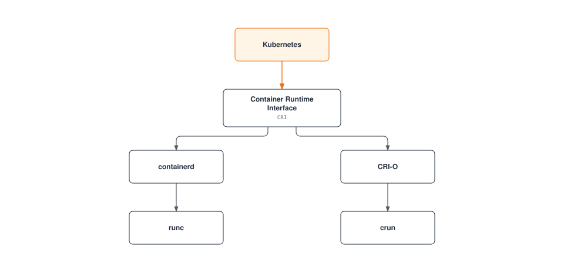

**Ejemplo de configuración de containerd**:
```toml
# /etc/containerd/config.toml
version = 2

[plugins]
  [plugins."io.containerd.grpc.v1.cri"]
    sandbox_image = "k8s.gcr.io/pause:3.6"
    [plugins."io.containerd.grpc.v1.cri".containerd]
      default_runtime_name = "runc"
      [plugins."io.containerd.grpc.v1.cri".containerd.runtimes]
        [plugins."io.containerd.grpc.v1.cri".containerd.runtimes.runc]
          runtime_type = "io.containerd.runc.v2"
          [plugins."io.containerd.grpc.v1.cri".containerd.runtimes.runc.options]
            SystemdCgroup = true
```

**Ejemplo de configuración de CRI-O**:
```toml
# /etc/crio/crio.conf
[crio]
root = "/var/lib/containers/storage"
runroot = "/var/run/containers/storage"
storage_driver = "overlay"
storage_option = ["overlay.mountopt=nodev"]

[crio.runtime]
default_runtime = "runc"
conmon = "/usr/bin/conmon"
conmon_cgroup = "pod"
cgroup_manager = "systemd"

[crio.image]
pause_image = "k8s.gcr.io/pause:3.6"
```

### Componentes add-on

Los add-ons son componentes adicionales que amplían la funcionalidad de los clústeres de Kubernetes. Algunos add-ons importantes incluyen:

1. **Plugins de red CNI**: Implementan la red de pods
   - Calico, Cilium, Flannel, Weave Net, etc.

2. **DNS**: Proporciona servicio DNS dentro del clúster
   - CoreDNS (predeterminado)

3. **Dashboard**: Proporciona interfaz de usuario basada en web
   - Kubernetes Dashboard

4. **Ingress Controller**: Administra el enrutamiento HTTP/HTTPS
   - NGINX Ingress Controller, Traefik, HAProxy, etc.

5. **Metrics Server**: Recopila métricas de uso de recursos
   - Metrics Server

6. **Registro y monitorización**: Recopilación y monitorización de logs
   - Prometheus, Grafana, Elasticsearch, Fluentd, Kibana, etc.

**Ejemplo de configuración de CoreDNS**:
```yaml
apiVersion: v1
kind: ConfigMap
metadata:
  name: coredns
  namespace: kube-system
data:
  Corefile: |
    .:53 {
        errors
        health {
            lameduck 5s
        }
        ready
        kubernetes cluster.local in-addr.arpa ip6.arpa {
            pods insecure
            fallthrough in-addr.arpa ip6.arpa
            ttl 30
        }
        prometheus :9153
        forward . /etc/resolv.conf {
            max_concurrent 1000
        }
        cache 30
        loop
        reload
        loadbalance
    }
```

**Ejemplo de configuración de Calico CNI**:
```yaml
apiVersion: v1
kind: ConfigMap
metadata:
  name: calico-config
  namespace: kube-system
data:
  calico_backend: "bird"
  cni_network_config: |-
    {
      "name": "k8s-pod-network",
      "cniVersion": "0.3.1",
      "plugins": [
        {
          "type": "calico",
          "log_level": "info",
          "datastore_type": "kubernetes",
          "nodename": "__KUBERNETES_NODE_NAME__",
          "mtu": __CNI_MTU__,
          "ipam": {
            "type": "calico-ipam"
          },
          "policy": {
            "type": "k8s"
          },
          "kubernetes": {
            "kubeconfig": "__KUBECONFIG_FILEPATH__"
          }
        },
        {
          "type": "portmap",
          "snat": true,
          "capabilities": {"portMappings": true}
        }
      ]
    }
```

## Rutas de comunicación del clúster

La comunicación entre diversos componentes tiene lugar dentro de un clúster de Kubernetes. Comprender estas rutas de comunicación es importante para el diseño, la seguridad y la resolución de problemas del clúster.

### Comunicación interna del plano de control

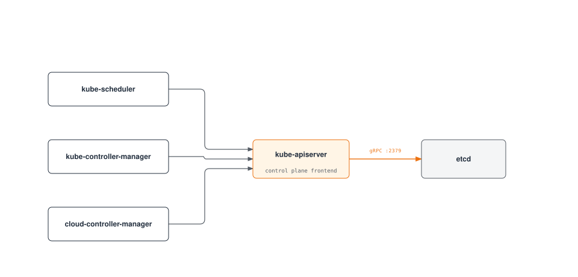

La comunicación entre los componentes del plano de control es la siguiente:

1. **kube-apiserver y etcd**: kube-apiserver se comunica con etcd para almacenar y recuperar el estado del clúster.
   - Protocolo: gRPC
   - Puerto: 2379/TCP
   - Seguridad: Autenticación basada en certificados TLS

2. **kube-scheduler y kube-apiserver**: kube-scheduler se comunica con kube-apiserver para la programación de pods.
   - Protocolo: HTTPS
   - Puerto: 6443/TCP (kube-apiserver)
   - Seguridad: Autenticación basada en certificados TLS

3. **kube-controller-manager y kube-apiserver**: Los controladores se comunican con kube-apiserver para observar y modificar el estado del clúster.
   - Protocolo: HTTPS
   - Puerto: 6443/TCP (kube-apiserver)
   - Seguridad: Autenticación basada en certificados TLS

4. **cloud-controller-manager y kube-apiserver**: El controlador de nube se comunica con kube-apiserver para observar el estado del clúster y administrar recursos de nube.
   - Protocolo: HTTPS
   - Puerto: 6443/TCP (kube-apiserver)
   - Seguridad: Autenticación basada en certificados TLS

### Comunicación entre plano de control y nodo

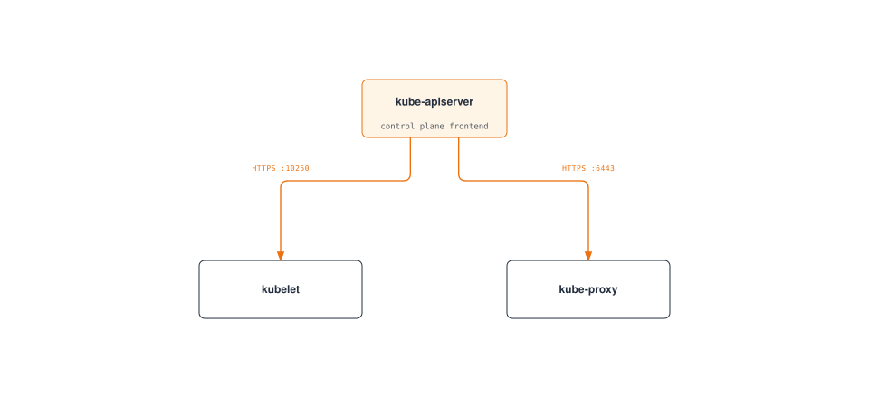

La comunicación entre el plano de control y los nodos es la siguiente:

1. **kube-apiserver y kubelet**: kube-apiserver se comunica con kubelet para entregar especificaciones de pods y recopilar el estado de los nodos.
   - Protocolo: HTTPS
   - Puerto: 10250/TCP (kubelet)
   - Seguridad: Autenticación basada en certificados TLS

2. **kubelet y kube-apiserver**: kubelet se comunica con kube-apiserver para el registro de nodos, el informe de estado de pods y la transmisión de eventos.
   - Protocolo: HTTPS
   - Puerto: 6443/TCP (kube-apiserver)
   - Seguridad: Autenticación basada en certificados TLS

3. **kube-proxy y kube-apiserver**: kube-proxy se comunica con kube-apiserver para recuperar información de servicios.
   - Protocolo: HTTPS
   - Puerto: 6443/TCP (kube-apiserver)
   - Seguridad: Autenticación basada en certificados TLS

### Comunicación entre nodos

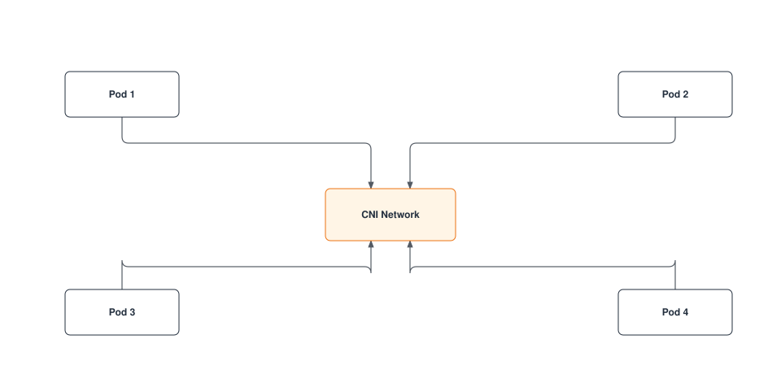

La comunicación entre nodos es la siguiente:

1. **Comunicación Pod a Pod**: Los pods se comunican entre sí a través de la red proporcionada por los plugins CNI.
   - Protocolo: Depende de la aplicación (TCP, UDP, etc.)
   - Puerto: Depende de la aplicación
   - Seguridad: Se puede controlar mediante políticas de red

2. **Comunicación de Pod entre nodos**: El plugin CNI gestiona la comunicación entre pods en nodos diferentes.
   - Protocolo: Depende de la aplicación (TCP, UDP, etc.)
   - Puerto: Depende de la aplicación
   - Seguridad: Se puede controlar mediante políticas de red

### Comunicación externa

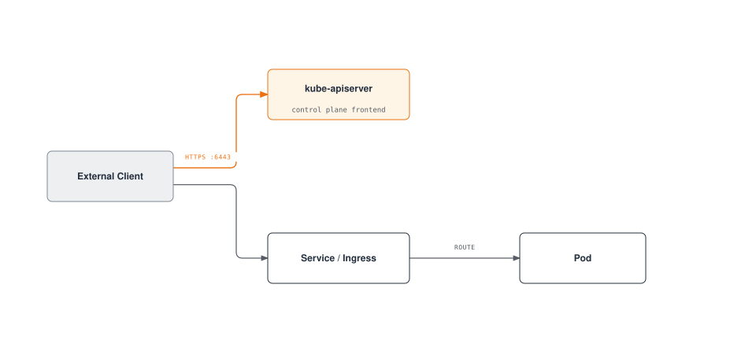

La comunicación con entidades externas es la siguiente:

1. **Cliente y kube-apiserver**: Los usuarios y sistemas externos interactúan con el clúster a través de kube-apiserver.
   - Protocolo: HTTPS
   - Puerto: 6443/TCP (kube-apiserver)
   - Seguridad: Certificados TLS, tokens, autenticación de usuario, etc.

2. **Tráfico externo y Services**: El tráfico externo accede a las aplicaciones dentro del clúster mediante servicios NodePort, LoadBalancer o Ingress.
   - Protocolo: HTTP, HTTPS, TCP, UDP, etc.
   - Puerto: Depende de la configuración del servicio
   - Seguridad: Depende de la configuración del controlador de ingress y del servicio

### Seguridad de la comunicación

La seguridad de la comunicación dentro de un clúster de Kubernetes se implementa mediante los siguientes métodos:

1. **Certificados TLS**: Toda la comunicación entre componentes del plano de control se cifra con certificados TLS.
2. **Autenticación y autorización**: Todas las solicitudes al servidor de API pasan por procesos de autenticación y autorización.
3. **Políticas de red**: La comunicación de Pod a Pod puede restringirse mediante políticas de red.
4. **Secrets cifrados**: Los Secrets almacenados en etcd se pueden cifrar.

**Ejemplo de configuración de seguridad de comunicación del servidor de API**:
```yaml
apiVersion: apiserver.config.k8s.io/v1
kind: EncryptionConfiguration
resources:
  - resources:
    - secrets
    providers:
    - aescbc:
        keys:
        - name: key1
          secret: <base64-encoded-key>
    - identity: {}
```

### Configuración de clúster de alta disponibilidad

Los clústeres de Kubernetes de alta disponibilidad (HA) están diseñados para eliminar puntos únicos de fallo y continuar funcionando sin interrupción del servicio.

### Alta disponibilidad del plano de control

La alta disponibilidad del plano de control se implementa mediante los siguientes métodos:

1. **Varios nodos de plano de control**: Normalmente se implementan 3 o 5 nodos de plano de control para redundancia
2. **Clúster etcd**: Se implementa un clúster compuesto por varias instancias de etcd (normalmente 3 o 5)
3. **Load Balancer**: Se coloca un balanceador de carga delante de los servidores de API para distribuir el tráfico

**Arquitectura de plano de control de alta disponibilidad**:

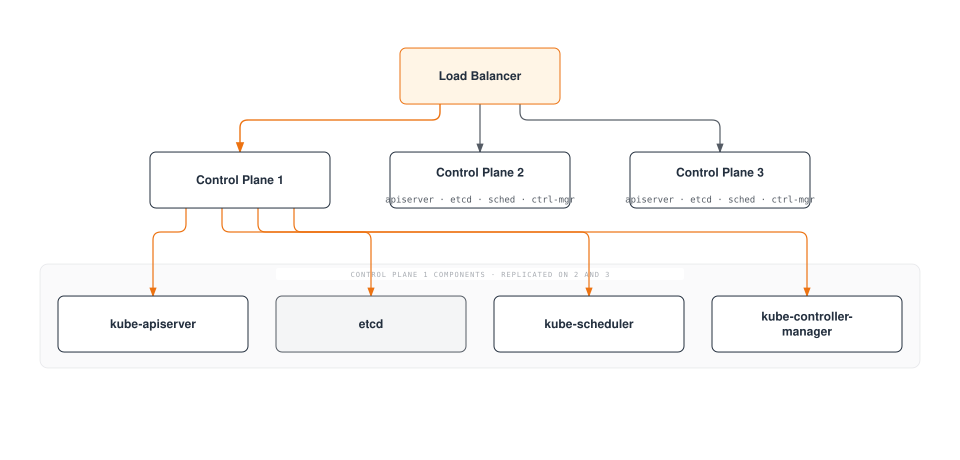

**Configuración de clúster etcd**:

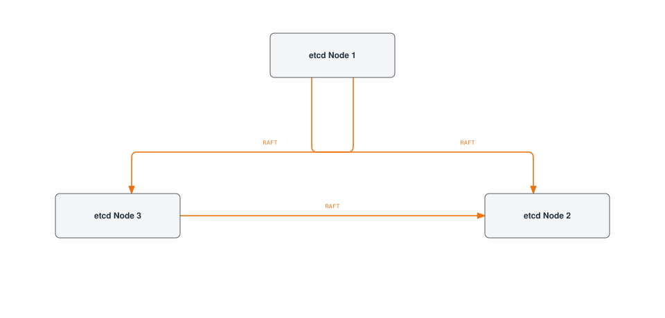

### Alta disponibilidad de nodos de trabajo

La alta disponibilidad de los nodos de trabajo se implementa mediante los siguientes métodos:

1. **Varios nodos de trabajo**: Distribuya cargas de trabajo entre varios nodos de trabajo
2. **Recuperación automática de nodos**: Utilice las funciones de recuperación automática del proveedor de nube
3. **Auto Scaling**: Escalado automático de nodos mediante cluster autoscaler
4. **Varias zonas de disponibilidad**: Implemente nodos en varias zonas de disponibilidad

**Implementación distribuida de nodos de trabajo**:

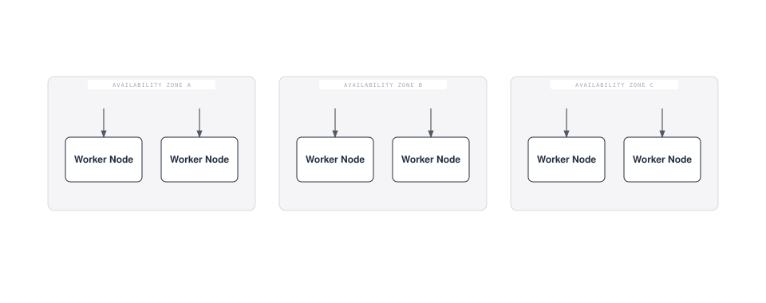

### Alta disponibilidad de aplicaciones

La alta disponibilidad de las aplicaciones se implementa mediante los siguientes métodos:

1. **ReplicaSet/Deployment**: Ejecute varias réplicas de pod
2. **Reglas de distribución de Pod**: Distribuya pods en varios nodos mediante anti-afinidad de pod
3. **PodDisruptionBudget**: Garantice disponibilidad mínima durante interrupciones planificadas
4. **Service y balanceo de carga**: Distribuya tráfico entre varios pods

**Ejemplo de anti-afinidad de Pod**:
```yaml
apiVersion: apps/v1
kind: Deployment
metadata:
  name: web-server
spec:
  replicas: 3
  template:
    metadata:
      labels:
        app: web-server
    spec:
      affinity:
        podAntiAffinity:
          requiredDuringSchedulingIgnoredDuringExecution:
          - labelSelector:
              matchExpressions:
              - key: app
                operator: In
                values:
                - web-server
            topologyKey: "kubernetes.io/hostname"
      containers:
      - name: web-server
        image: nginx:1.21
```

**Ejemplo de PodDisruptionBudget**:
```yaml
apiVersion: policy/v1
kind: PodDisruptionBudget
metadata:
  name: web-server-pdb
spec:
  minAvailable: 2
  selector:
    matchLabels:
      app: web-server
```

### Estrategia de recuperación ante desastres

Las estrategias de recuperación ante desastres para clústeres de Kubernetes se implementan mediante los siguientes métodos:

1. **Copia de seguridad y recuperación de etcd**: Establezca procedimientos periódicos de copia de seguridad y recuperación de datos de etcd
2. **Implementación multirregional**: Implemente clústeres en varias regiones
3. **Federación de clústeres**: Administre varios clústeres en federación
4. **Copia de seguridad continua**: Realice copias de seguridad continuas de los datos de aplicaciones

**Ejemplo de script de copia de seguridad de etcd**:
```bash
#!/bin/bash
ETCDCTL_API=3 etcdctl snapshot save /backup/etcd-snapshot-$(date +%Y%m%d-%H%M%S).db \
  --endpoints=https://127.0.0.1:2379 \
  --cacert=/etc/kubernetes/pki/etcd/ca.crt \
  --cert=/etc/kubernetes/pki/etcd/server.crt \
  --key=/etc/kubernetes/pki/etcd/server.key
```

**Ejemplo de script de recuperación de etcd**:
```bash
#!/bin/bash
# Stop cluster
systemctl stop kubelet
docker stop $(docker ps -q)

# Recover etcd data
ETCDCTL_API=3 etcdctl snapshot restore /backup/etcd-snapshot.db \
  --data-dir=/var/lib/etcd-restore \
  --name=master \
  --initial-cluster=master=https://127.0.0.1:2380 \
  --initial-cluster-token=etcd-cluster \
  --initial-advertise-peer-urls=https://127.0.0.1:2380

# Replace etcd directory with recovered data
mv /var/lib/etcd /var/lib/etcd.old
mv /var/lib/etcd-restore /var/lib/etcd

# Restart cluster
systemctl start kubelet
```

## Redes del clúster

Las redes de Kubernetes permiten la comunicación entre pods, servicios y el mundo exterior. El modelo de red de Kubernetes presupone que cada pod tiene una dirección IP única y puede comunicarse entre sí sin NAT.

### Modelo de red

El modelo de red de Kubernetes tiene los siguientes requisitos:

1. **Comunicación Pod a Pod**: Todos los pods deben poder comunicarse con todos los demás pods sin NAT
2. **Comunicación nodo a Pod**: Los nodos deben poder comunicarse con todos los pods sin NAT
3. **Comunicación de Pod a externo**: Los pods deben poder comunicarse con el mundo exterior (normalmente mediante NAT)

### CNI (Container Network Interface)

CNI es una interfaz estándar para implementar redes en Kubernetes. Hay varios plugins CNI, cada uno con diferentes características y rendimiento.

**Plugins CNI principales**:

1. **Calico**: Redes basadas en BGP, compatibilidad con políticas de red
   - Características: Alto rendimiento, políticas de red, cifrado, compatibilidad con eBPF
   - Casos de uso: Clústeres grandes, entornos centrados en seguridad

2. **Cilium**: Redes y seguridad basadas en eBPF
   - Características: Políticas de seguridad L3-L7, alto rendimiento, observabilidad
   - Casos de uso: Microservicios, entornos centrados en seguridad

3. **Flannel**: Red overlay sencilla
   - Características: Configuración sencilla, ligero
   - Casos de uso: Clústeres pequeños, entornos de desarrollo

4. **Weave Net**: Redes de contenedores en varios hosts
   - Características: Cifrado, políticas de red, multinube
   - Casos de uso: Nube híbrida, multinube

**Ejemplo de configuración de CNI (Calico)**:
```yaml
apiVersion: v1
kind: ConfigMap
metadata:
  name: calico-config
  namespace: kube-system
data:
  calico_backend: "bird"
  cni_network_config: |-
    {
      "name": "k8s-pod-network",
      "cniVersion": "0.3.1",
      "plugins": [
        {
          "type": "calico",
          "log_level": "info",
          "datastore_type": "kubernetes",
          "nodename": "__KUBERNETES_NODE_NAME__",
          "mtu": __CNI_MTU__,
          "ipam": {
            "type": "calico-ipam"
          },
          "policy": {
            "type": "k8s"
          },
          "kubernetes": {
            "kubeconfig": "__KUBECONFIG_FILEPATH__"
          }
        },
        {
          "type": "portmap",
          "snat": true,
          "capabilities": {"portMappings": true}
        }
      ]
    }
```

### Redes de Service

Los Services de Kubernetes proporcionan endpoints estables para un conjunto de pods. Los Services tienen varios tipos, incluidos ClusterIP, NodePort, LoadBalancer y ExternalName.

**Componentes de redes de Service**:

1. **ClusterIP**: IP virtual accesible solo dentro del clúster
2. **kube-proxy**: Enruta el tráfico a las IP de servicio hacia los pods
3. **CoreDNS**: Servicio DNS para descubrimiento de servicios

**Flujo de redes de Service**:
```
Client -> Service (ClusterIP) -> kube-proxy -> Pod
```

**Ejemplo de Service**:
```yaml
apiVersion: v1
kind: Service
metadata:
  name: my-service
spec:
  selector:
    app: my-app
  ports:
  - port: 80
    targetPort: 8080
  type: ClusterIP
```

### Redes de Ingress

Ingress administra el enrutamiento HTTP y HTTPS desde fuera del clúster hacia los servicios dentro del clúster. Los controladores de Ingress implementan recursos ingress.

**Controladores de Ingress principales**:
1. **NGINX Ingress Controller**: Controlador ingress basado en NGINX
2. **AWS ALB Ingress Controller**: Basado en AWS Application Load Balancer
3. **Traefik**: Router de borde nativo de la nube
4. **HAProxy Ingress**: Controlador ingress basado en HAProxy

**Flujo de redes de Ingress**:
```
Client -> Ingress Controller -> Service -> Pod
```

**Ejemplo de Ingress**:
```yaml
apiVersion: networking.k8s.io/v1
kind: Ingress
metadata:
  name: my-ingress
  annotations:
    nginx.ingress.kubernetes.io/rewrite-target: /
spec:
  ingressClassName: nginx
  rules:
  - host: example.com
    http:
      paths:
      - path: /app
        pathType: Prefix
        backend:
          service:
            name: my-service
            port:
              number: 80
```

### Políticas de red

Las políticas de red proporcionan una forma de controlar la comunicación entre pods. De forma predeterminada, todos los pods pueden comunicarse entre sí, pero las políticas de red pueden restringirlo.

**Ejemplo de política de red**:
```yaml
apiVersion: networking.k8s.io/v1
kind: NetworkPolicy
metadata:
  name: db-network-policy
spec:
  podSelector:
    matchLabels:
      role: db
  policyTypes:
  - Ingress
  - Egress
  ingress:
  - from:
    - podSelector:
        matchLabels:
          role: frontend
    ports:
    - protocol: TCP
      port: 3306
  egress:
  - to:
    - podSelector:
        matchLabels:
          role: monitoring
    ports:
    - protocol: TCP
      port: 9090
```

### Resolución de problemas de red

Herramientas y comandos comunes para resolver problemas de redes de Kubernetes:

1. **ping, traceroute**: Pruebas básicas de conectividad de red
2. **tcpdump**: Captura y análisis de paquetes de red
3. **netstat, ss**: Comprobación del estado de conexiones de red
4. **nslookup, dig**: Pruebas de búsqueda DNS
5. **kubectl exec**: Ejecución de comandos de red dentro de pods

**Ejemplo de depuración de red**:
```bash
# Test network connectivity within a pod
kubectl exec -it <pod-name> -- ping <target-ip>

# Test DNS lookup within a pod
kubectl exec -it <pod-name> -- nslookup <service-name>

# Capture network packets within a pod
kubectl exec -it <pod-name> -- tcpdump -i eth0 -n

# Check service endpoints
kubectl get endpoints <service-name>
```

## Almacenamiento del clúster

El almacenamiento de Kubernetes proporciona persistencia de datos para aplicaciones en contenedores. Kubernetes ofrece varias opciones y abstracciones de almacenamiento para ayudar a las aplicaciones a utilizar el almacenamiento eficientemente.

### Arquitectura de almacenamiento

La arquitectura de almacenamiento de Kubernetes consta de los siguientes componentes:

1. **Volumes**: Directorios que se pueden montar en contenedores dentro de pods
2. **Persistent Volumes (PV)**: Recursos de almacenamiento en el clúster
3. **Persistent Volume Claims (PVC)**: Solicitudes de almacenamiento de usuarios
4. **Storage Classes**: Define "clases" o tipos de almacenamiento
5. **CSI (Container Storage Interface)**: Interfaz estándar con sistemas de almacenamiento

**Flujo de arquitectura de almacenamiento**:

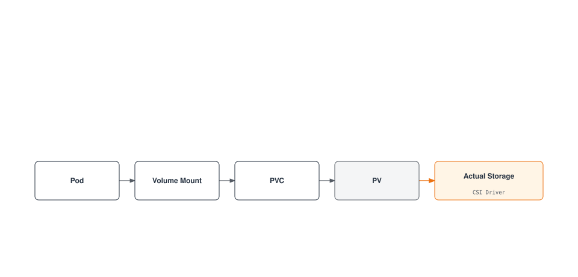

### Tipos de volumen

Kubernetes admite diversos tipos de volúmenes:

1. **Volúmenes efímeros**:
   - **emptyDir**: Comienza como un directorio vacío y se elimina cuando se elimina el pod
   - **configMap**: Monta ConfigMap como volumen
   - **secret**: Monta Secret como volumen
   - **downwardAPI**: Expone información de pod y contenedor como archivos

2. **Volúmenes persistentes**:
   - **awsElasticBlockStore**: Volúmenes AWS EBS
   - **azureDisk**: Azure Disk
   - **gcePersistentDisk**: GCE Persistent Disk
   - **nfs**: Volúmenes NFS
   - **csi**: Volúmenes mediante drivers CSI

**Ejemplo de volumen**:
```yaml
apiVersion: v1
kind: Pod
metadata:
  name: test-pd
spec:
  containers:
  - name: test-container
    image: nginx
    volumeMounts:
    - mountPath: /test-pd
      name: test-volume
  volumes:
  - name: test-volume
    persistentVolumeClaim:
      claimName: test-pvc
```

### Persistent Volumes y Claims

Los Persistent Volumes (PV) son recursos de almacenamiento del clúster aprovisionados por administradores o dinámicamente mediante clases de almacenamiento. Los Persistent Volume Claims (PVC) son solicitudes de almacenamiento de los usuarios.

**Ejemplo de Persistent Volume**:
```yaml
apiVersion: v1
kind: PersistentVolume
metadata:
  name: pv-example
spec:
  capacity:
    storage: 10Gi
  accessModes:
    - ReadWriteOnce
  persistentVolumeReclaimPolicy: Retain
  storageClassName: standard
  awsElasticBlockStore:
    volumeID: vol-0123456789abcdef0
    fsType: ext4
```

**Ejemplo de Persistent Volume Claim**:
```yaml
apiVersion: v1
kind: PersistentVolumeClaim
metadata:
  name: pvc-example
spec:
  accessModes:
    - ReadWriteOnce
  resources:
    requests:
      storage: 5Gi
  storageClassName: standard
```

### Storage Classes

Las clases de almacenamiento describen las "clases" de almacenamiento que proporcionan los administradores. Las clases de almacenamiento permiten el aprovisionamiento dinámico de PV cuando se solicitan PVC.

**Ejemplo de Storage Class**:
```yaml
apiVersion: storage.k8s.io/v1
kind: StorageClass
metadata:
  name: standard
provisioner: kubernetes.io/aws-ebs
parameters:
  type: gp3
  fsType: ext4
reclaimPolicy: Delete
allowVolumeExpansion: true
```

### CSI (Container Storage Interface)

CSI proporciona una interfaz estándar entre Kubernetes y los sistemas de almacenamiento. Mediante CSI, los proveedores de almacenamiento pueden desarrollar sus propios drivers de almacenamiento sin modificar el código de Kubernetes.

**Arquitectura de CSI**:

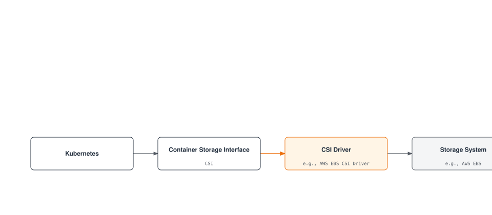

**Ejemplo de implementación de driver CSI**:
```yaml
apiVersion: storage.k8s.io/v1
kind: StorageClass
metadata:
  name: ebs-sc
provisioner: ebs.csi.aws.com
parameters:
  type: gp3
  fsType: ext4
  encrypted: "true"
volumeBindingMode: WaitForFirstConsumer
```

### Prácticas recomendadas de almacenamiento

Prácticas recomendadas para usar almacenamiento de Kubernetes:

1. **Elegir el tipo de almacenamiento adecuado**: Seleccione el tipo de almacenamiento que coincida con las características de la carga de trabajo
2. **Usar aprovisionamiento dinámico**: Utilice aprovisionamiento dinámico mediante clases de almacenamiento
3. **Elegir modos de acceso adecuados**: Seleccione modos de acceso que coincidan con los requisitos de la carga de trabajo
4. **Establecer solicitudes y límites de recursos**: Solicite una capacidad de almacenamiento adecuada
5. **Establecer una estrategia de copia de seguridad y recuperación**: Prepare estrategias de copia de seguridad y recuperación para datos críticos
6. **Supervisar el almacenamiento**: Supervise el uso y el rendimiento del almacenamiento

## Escalabilidad del clúster

La escalabilidad de un clúster de Kubernetes se refiere a la capacidad del clúster para gestionar cargas y requisitos crecientes. La escalabilidad se puede implementar mediante escalado horizontal (scale out) y vertical (scale up).

### Límites de escala del clúster

Los clústeres de Kubernetes tienen los siguientes límites de escala:

1. **Número de nodos**: Máximo de 5.000 nodos
2. **Número de Pods**: Máximo de 150.000 pods por clúster
3. **Pods por nodo**: Máximo de 110 pods por nodo (predeterminado)
4. **Número de Services**: Máximo de 10.000 servicios por clúster
5. **Contenedores por Pod**: Máximo de 20 contenedores por pod

Estos límites pueden variar según la versión de Kubernetes y la configuración del clúster.

### Escalado horizontal

El escalado horizontal aumenta la capacidad del clúster añadiendo más nodos.

**Auto Scaling de nodos**:
Kubernetes Cluster Autoscaler ajusta automáticamente el número de nodos según los requisitos de la carga de trabajo.

```yaml
# AWS Auto Scaling Group tags example
tags:
  k8s.io/cluster-autoscaler/enabled: "true"
  k8s.io/cluster-autoscaler/my-cluster: "owned"
```

**Ejemplo de implementación de Cluster Autoscaler**:
```yaml
apiVersion: apps/v1
kind: Deployment
metadata:
  name: cluster-autoscaler
  namespace: kube-system
spec:
  replicas: 1
  selector:
    matchLabels:
      app: cluster-autoscaler
  template:
    metadata:
      labels:
        app: cluster-autoscaler
    spec:
      containers:
      - name: cluster-autoscaler
        image: k8s.gcr.io/autoscaling/cluster-autoscaler:v1.24.0
        command:
        - ./cluster-autoscaler
        - --cloud-provider=aws
        - --nodes=2:10:my-asg-group
        - --scale-down-unneeded-time=10m
```

**Karpenter**:
Karpenter es una nueva herramienta de autoescalado de nodos desarrollada por AWS que ofrece aprovisionamiento de nodos más rápido y eficiente.

```yaml
apiVersion: karpenter.sh/v1
kind: NodePool
metadata:
  name: default
spec:
  template:
    spec:
      requirements:
        - key: karpenter.sh/capacity-type
          operator: In
          values: ["spot", "on-demand"]
      nodeClassRef:
        name: default-class
  limits:
    cpu: 1000
    memory: 1000Gi
---
apiVersion: karpenter.k8s.aws/v1
kind: EC2NodeClass
metadata:
  name: default-class
spec:
  subnetSelector:
    karpenter.sh/discovery: my-cluster
  securityGroupSelector:
    karpenter.sh/discovery: my-cluster
```

### Escalado vertical

El escalado vertical aumenta los recursos (CPU, memoria) de los nodos existentes.

**Vertical Pod Autoscaler (VPA)**:
VPA ajusta automáticamente las solicitudes de CPU y memoria para los pods.

```yaml
apiVersion: autoscaling.k8s.io/v1
kind: VerticalPodAutoscaler
metadata:
  name: my-app-vpa
spec:
  targetRef:
    apiVersion: "apps/v1"
    kind: Deployment
    name: my-app
  updatePolicy:
    updateMode: "Auto"
  resourcePolicy:
    containerPolicies:
    - containerName: '*'
      minAllowed:
        cpu: 100m
        memory: 50Mi
      maxAllowed:
        cpu: 1
        memory: 500Mi
```

### Escalado de aplicaciones

El escalado a nivel de aplicación se implementa ajustando el número de réplicas de pod.

**Horizontal Pod Autoscaler (HPA)**:
HPA ajusta automáticamente el número de réplicas de pod según la utilización de CPU o métricas personalizadas.

```yaml
apiVersion: autoscaling/v2
kind: HorizontalPodAutoscaler
metadata:
  name: my-app-hpa
spec:
  scaleTargetRef:
    apiVersion: apps/v1
    kind: Deployment
    name: my-app
  minReplicas: 2
  maxReplicas: 10
  metrics:
  - type: Resource
    resource:
      name: cpu
      target:
        type: Utilization
        averageUtilization: 80
```

**KEDA (Kubernetes Event-driven Autoscaling)**:
KEDA proporciona autoescalado basado en eventos, lo que permite escalar según diversas fuentes de eventos.

```yaml
apiVersion: keda.sh/v1alpha1
kind: ScaledObject
metadata:
  name: my-app-scaledobject
spec:
  scaleTargetRef:
    name: my-app
  minReplicaCount: 0
  maxReplicaCount: 10
  triggers:
  - type: kafka
    metadata:
      bootstrapServers: kafka.svc:9092
      consumerGroup: my-group
      topic: my-topic
      lagThreshold: "10"
```

### Prácticas recomendadas de escalabilidad

Prácticas recomendadas para la escalabilidad de clústeres de Kubernetes:

1. **Establecer solicitudes y límites de recursos**: Establezca solicitudes y límites de recursos adecuados para todos los pods
2. **Estrategia de Node Pool**: Configure varios node pools para distintas características de carga de trabajo
3. **Configurar Auto Scaling**: Configure correctamente Cluster Autoscaler, HPA y VPA
4. **Ubicación eficiente de Pod**: Utilice afinidad de nodo, afinidad/anti-afinidad de pod
5. **Monitorización del clúster**: Supervise continuamente el uso de recursos y el rendimiento
6. **Pruebas de carga**: Realice pruebas de carga periódicas para validar las estrategias de escalado

## Seguridad del clúster

La seguridad de clústeres de Kubernetes debe implementarse en varias capas. Esto incluye autenticación, autorización, políticas de red, seguridad de pod y más.

### Autenticación

Métodos para autenticar el acceso al servidor de API de Kubernetes:

1. **Certificados X.509**: Autenticación mediante certificados de cliente TLS
2. **Tokens de cuenta de servicio**: Tokens para acceso al servidor de API dentro de pods
3. **OpenID Connect (OIDC)**: Autenticación mediante proveedores de identidad externos
4. **Autenticación de token de webhook**: Autenticación mediante servicios de autenticación externos
5. **Proxy de autenticación**: Autenticación mediante proxies de autenticación

**Ejemplo de kubeconfig**:
```yaml
apiVersion: v1
kind: Config
clusters:
- name: my-cluster
  cluster:
    certificate-authority-data: <CA-DATA>
    server: https://api.my-cluster.example.com
users:
- name: admin
  user:
    client-certificate-data: <CERT-DATA>
    client-key-data: <KEY-DATA>
contexts:
- name: my-context
  context:
    cluster: my-cluster
    user: admin
current-context: my-context
```

### Autorización

Métodos para controlar acciones de usuarios autenticados:

1. **RBAC (Role-Based Access Control)**: Control de acceso basado en roles
2. **ABAC (Attribute-Based Access Control)**: Control de acceso basado en atributos
3. **Autorización de nodo**: Autorización especial para nodos
4. **Autorización de webhook**: Autorización mediante servicios externos

**Ejemplo de RBAC**:
```yaml
# Role definition
apiVersion: rbac.authorization.k8s.io/v1
kind: Role
metadata:
  namespace: default
  name: pod-reader
rules:
- apiGroups: [""]
  resources: ["pods"]
  verbs: ["get", "watch", "list"]

# Role binding
apiVersion: rbac.authorization.k8s.io/v1
kind: RoleBinding
metadata:
  name: read-pods
  namespace: default
subjects:
- kind: User
  name: jane
  apiGroup: rbac.authorization.k8s.io
roleRef:
  kind: Role
  name: pod-reader
  apiGroup: rbac.authorization.k8s.io
```

### Seguridad de red

Métodos para proteger el tráfico de red dentro del clúster:

1. **Políticas de red**: Controlan la comunicación de Pod a Pod
2. **Comunicación cifrada**: Cifrado de comunicaciones mediante TLS
3. **Service Mesh**: Seguridad de red avanzada mediante Istio, Linkerd, etc.

**Ejemplo de política de red**:
```yaml
apiVersion: networking.k8s.io/v1
kind: NetworkPolicy
metadata:
  name: default-deny-all
spec:
  podSelector: {}
  policyTypes:
  - Ingress
  - Egress
```

### Seguridad de Pod

Implementación de seguridad a nivel de pod:

1. **Pod Security Context**: Configuración de seguridad a nivel de pod y contenedor
2. **Pod Security Standards**: Define requisitos de seguridad de pod
3. **Perfiles seccomp**: Restricciones de llamadas al sistema
4. **AppArmor/SELinux**: Control de acceso obligatorio

**Ejemplo de Pod Security Context**:
```yaml
apiVersion: v1
kind: Pod
metadata:
  name: security-context-pod
spec:
  securityContext:
    runAsUser: 1000
    runAsGroup: 3000
    fsGroup: 2000
  containers:
  - name: app
    image: myapp:1.0
    securityContext:
      allowPrivilegeEscalation: false
      capabilities:
        drop:
        - ALL
```

### Gestión de Secrets

Métodos para administrar de forma segura información confidencial:

1. **Kubernetes Secrets**: Use recursos básicos de secret
2. **etcd cifrado**: Cifre Secrets almacenados en etcd
3. **Gestión de Secrets externa**: Utilice HashiCorp Vault, AWS Secrets Manager, etc.

**Ejemplo de configuración de etcd cifrado**:
```yaml
apiVersion: apiserver.config.k8s.io/v1
kind: EncryptionConfiguration
resources:
  - resources:
    - secrets
    providers:
    - aescbc:
        keys:
        - name: key1
          secret: <base64-encoded-key>
    - identity: {}
```

### Prácticas recomendadas de seguridad

Prácticas recomendadas para la seguridad de clústeres de Kubernetes:

1. **Principio de mínimo privilegio**: Conceda solo los privilegios mínimos necesarios
2. **Actualizaciones periódicas**: Actualice periódicamente el clúster y los componentes
3. **Aislamiento de red**: Restrinja la comunicación de Pod a Pod mediante políticas de red
4. **Seguridad de imágenes**: Use únicamente imágenes de confianza e implemente análisis de vulnerabilidades
5. **Registro de auditoría**: Habilite logs de auditoría para la actividad del clúster
6. **Benchmarks de seguridad**: Cumpla estándares de seguridad como los benchmarks CIS

## Actualizaciones del clúster

Las actualizaciones de clústeres de Kubernetes son necesarias para aplicar nuevas funciones, parches de seguridad y correcciones de errores. Las actualizaciones deben planificarse y ejecutarse cuidadosamente.

### Actualización de julio de 2026: Kubernetes v1.37 en Beta

v1.37.0-beta.0 se publicó el 20 de julio de 2026, llevando la próxima versión menor, v1.37, a la etapa final de su ciclo de lanzamiento. Code Freeze entró en vigor según lo previsto los días 22 y 23 de julio de 2026, y el lanzamiento final de v1.37.0 está previsto para el 26 de agosto de 2026. Consulte la [información de lanzamiento de v1.37](https://www.kubernetes.dev/resources/release/) para conocer el calendario completo.

Durante la misma semana (22 y 23 de julio de 2026), se publicaron versiones de parche para todas las líneas mantenidas: [v1.36.3](https://github.com/kubernetes/kubernetes/releases/tag/v1.36.3), [v1.35.7](https://github.com/kubernetes/kubernetes/releases/tag/v1.35.7) y [v1.34.10](https://github.com/kubernetes/kubernetes/releases/tag/v1.34.10). Como de costumbre, se recomienda aplicar el último parche para su versión menor.

### Actualización de agosto de 2026: adelanto de v1.37

El 31 de julio de 2026, el equipo de lanzamiento publicó el [adelanto de Kubernetes v1.37](https://kubernetes.io/blog/2026/07/31/kubernetes-v1-37-sneak-peek/), que describe las deprecaciones, eliminaciones y cambios de funciones planificados antes del lanzamiento final de v1.37.0, aún previsto para el 26 de agosto de 2026. Docs Freeze entró en vigor los días 5 y 6 de agosto de 2026. Mientras tanto, la primera etiqueta del siguiente ciclo, v1.38.0-alpha.0, se creó el 6 de agosto de 2026.

### Actualización de agosto de 2026: versiones de parche y v1.37.0-rc.1

El 20 de agosto de 2026, se publicaron versiones de parche para todas las líneas mantenidas: [v1.36.4](https://github.com/kubernetes/kubernetes/releases/tag/v1.36.4), [v1.35.8](https://github.com/kubernetes/kubernetes/releases/tag/v1.35.8) y [v1.34.11](https://github.com/kubernetes/kubernetes/releases/tag/v1.34.11). Como de costumbre, se recomienda aplicar el último parche para su versión menor.

Ese mismo día también se etiquetó el segundo candidato a lanzamiento para v1.37, [v1.37.0-rc.1](https://github.com/kubernetes/kubernetes/releases/tag/v1.37.0-rc.1) (rc.0 se creó el 6 de agosto), lo que mantiene el lanzamiento final de v1.37.0 previsto para el 26 de agosto de 2026.

### Actualización de agosto de 2026: lanzamiento de Kubernetes v1.37 "Garhwal"

[Kubernetes v1.37 "Garhwal"](https://kubernetes.io/blog/2026/08/26/kubernetes-v1-37-release/) se lanzó según lo previsto el 26 de agosto de 2026. La versión consta de 67 mejoras: 16 pasaron a Stable, 23 pasaron a Beta y el resto se incorporó como Alpha. Aspectos destacados:

- **Los certificados de Pod y ClusterTrustBundles pasan a Stable**: la función PodCertificate, que emite y rota automáticamente certificados X.509 para cargas de trabajo como alternativa a los tokens de cuenta de servicio, y el recurso ClusterTrustBundle para distribuir anclas de confianza son ahora funciones estándar ([publicación detallada](https://kubernetes.io/blog/2026/08/28/kubernetes-v1-37-pod-certificates-and-cluster-trust-bundles/))
- **Metrics API (metrics.k8s.io) pasa a GA**: la API de métricas de recursos utilizada por `kubectl top` y HPA ha pasado a estable ([publicación detallada](https://kubernetes.io/blog/2026/08/27/kubernetes-v1-37-metrics-api-ga/))
- También **Stable**: varias funciones DRA (Dynamic Resource Allocation), inicialización resiliente de watchcache y más / **Beta**: HPA scale-to-zero, configuración de control de admisión basada en manifiestos y más / **Alpha**: checkpoint y restauración a nivel de pod y más
- **Deprecaciones**: kube-dns, el modo `ipvs` de kube-proxy y `kubectl run --filename/-f` están obsoletos, y los static Pods ya no pueden hacer referencia a Secrets ni ConfigMaps. La eliminación de la compatibilidad con cgroup v1 también sigue avanzando.

Antes de actualizar, asegúrese de revisar las deprecaciones y eliminaciones en las [notas de lanzamiento oficiales](https://github.com/kubernetes/kubernetes/blob/master/CHANGELOG/CHANGELOG-1.37.md).

### Estrategias de actualización

Estrategias para actualizaciones de clústeres de Kubernetes:

1. **Actualización Blue/Green**: Cree un clúster de nueva versión por separado y migre las cargas de trabajo
2. **Actualización in situ**: Actualice directamente el clúster existente
3. **Actualización Canary**: Actualice primero solo algunos nodos para validar

### Orden de actualización

Orden habitual para actualizaciones de clústeres de Kubernetes:

1. **Actualización del plano de control**: kube-apiserver, kube-controller-manager, kube-scheduler, etcd
2. **Actualización de DNS y CNI**: CoreDNS, plugins CNI y otros add-ons principales
3. **Actualización de nodos de trabajo**: Actualización secuencial de nodos de trabajo

**Ejemplo de actualización de kubeadm**:
```bash
# Control plane upgrade
kubeadm upgrade plan
kubeadm upgrade apply v1.24.0

# Worker node upgrade
kubectl drain <node-name> --ignore-daemonsets
# Upgrade kubelet and kubeadm on the node
apt-get update && apt-get install -y kubelet=1.24.0-00 kubeadm=1.24.0-00
kubeadm upgrade node
systemctl restart kubelet
kubectl uncordon <node-name>
```

### Consideraciones de actualización

Consideraciones al actualizar clústeres de Kubernetes:

1. **Cambios de API**: Compruebe los cambios de API en las nuevas versiones
2. **Feature Gates**: Compruebe las nuevas feature gates y los cambios de valores predeterminados
3. **Dependencias**: Compruebe la compatibilidad de componentes dependientes como CNI y CSI
4. **Tiempo de inactividad**: Planifique el tiempo de inactividad previsto durante las actualizaciones
5. **Plan de reversión**: Establezca un plan de reversión en caso de problemas

### Prácticas recomendadas de actualización

Prácticas recomendadas para actualizaciones de clústeres de Kubernetes:

1. **Probar primero en un entorno de pruebas**: Valide en un entorno de pruebas antes de la actualización de producción
2. **Actualización gradual**: Actualice una versión menor cada vez
3. **Copia de seguridad**: Realice una copia de seguridad de datos etcd antes de actualizar
4. **Documentación**: Documente los procedimientos y resultados de actualización
5. **Monitorización**: Supervise el estado del clúster durante y después de la actualización
6. **Ventana de actualización**: Realice las actualizaciones durante periodos de poco tráfico

## Arquitectura de clúster Amazon EKS

Amazon EKS (Elastic Kubernetes Service) es un servicio de Kubernetes administrado proporcionado por AWS. EKS proporciona todas las funciones básicas de Kubernetes y agrega integración con servicios de AWS y comodidad de administración.

### Descripción general de la arquitectura de EKS

Los clústeres EKS constan de los siguientes componentes:

1. **Plano de control de EKS**: Plano de control de Kubernetes administrado por AWS
2. **Nodos de EKS**: Nodos de trabajo administrados por usuarios (instancias EC2)
3. **EKS Managed Node Groups**: Grupos de nodos administrados por AWS
4. **EKS Fargate Profiles**: Entorno de ejecución de contenedores sin servidor
5. **VPC y subredes**: VPC y subredes para las redes del clúster

**Diagrama de arquitectura de EKS**:

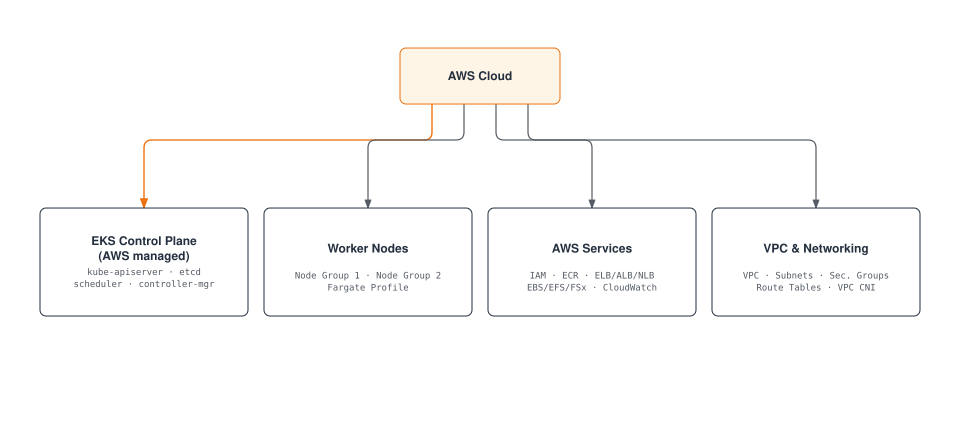

### Plano de control de EKS

El plano de control de EKS es administrado por AWS y proporciona alta disponibilidad en varias zonas de disponibilidad.

**Características principales**:
1. **Servicio administrado**: AWS administra el mantenimiento y las actualizaciones del plano de control
2. **Alta disponibilidad**: Implementado en varias zonas de disponibilidad
3. **Auto Scaling**: Escala automáticamente según la carga
4. **Seguridad**: Integrado con servicios de seguridad de AWS

### Tipos de nodo de EKS

EKS admite varios tipos de nodos:

1. **Nodos autoadministrados**: Los usuarios administran directamente las instancias EC2
2. **Managed Node Groups**: AWS administra el ciclo de vida de los nodos
3. **Fargate**: Entorno de ejecución de contenedores sin servidor
4. **Bottlerocket Nodes**: SO optimizado para cargas de trabajo de contenedores

**Ejemplo de Managed Node Group**:
```yaml
apiVersion: eksctl.io/v1alpha5
kind: ClusterConfig
metadata:
  name: my-cluster
  region: ap-northeast-2
managedNodeGroups:
  - name: ng-1
    instanceType: m5.large
    desiredCapacity: 3
    minSize: 2
    maxSize: 5
    volumeSize: 80
    privateNetworking: true
    labels:
      role: worker
    tags:
      nodegroup-role: worker
    iam:
      withAddonPolicies:
        autoScaler: true
        albIngress: true
```

### Redes de EKS

Las redes de EKS se basan en Amazon VPC e incluyen los siguientes componentes:

1. **Plugin VPC CNI**: Integración con las redes VPC de AWS
2. **Security Groups**: Seguridad de red a nivel de nodo y pod
3. **Integración de Load Balancer**: Integración con ELB, ALB, NLB
4. **VPC Endpoints**: Comunicación privada con servicios de AWS

**Ejemplo de configuración de VPC CNI**:
```yaml
apiVersion: v1
kind: ConfigMap
metadata:
  name: amazon-vpc-cni
  namespace: kube-system
data:
  enable-network-policy: "true"
  enable-pod-eni: "true"
  warm-ip-target: "5"
  minimum-ip-target: "10"
```

### Almacenamiento de EKS

EKS se integra con diversos servicios de almacenamiento de AWS:

1. **EBS CSI Driver**: Administración de volúmenes Amazon EBS
2. **EFS CSI Driver**: Administración de sistemas de archivos Amazon EFS
3. **FSx for Lustre CSI Driver**: Administración de sistemas de archivos FSx for Lustre
4. **S3**: Almacenamiento de objetos

**Ejemplo de EBS CSI Driver**:
```yaml
apiVersion: storage.k8s.io/v1
kind: StorageClass
metadata:
  name: ebs-sc
provisioner: ebs.csi.aws.com
parameters:
  type: gp3
  encrypted: "true"
volumeBindingMode: WaitForFirstConsumer
```

### Seguridad de EKS

EKS se integra con servicios de seguridad de AWS para proporcionar seguridad robusta:

1. **Integración IAM**: Integración de AWS IAM y Kubernetes RBAC
2. **Seguridad de VPC**: Security groups de VPC y ACL de red
3. **AWS KMS**: Integración de KMS para cifrado de Secrets
4. **AWS WAF**: Integración de firewall de aplicaciones web
5. **AWS Shield**: Protección contra DDoS

**Ejemplo de IAM Role Service Account**:
```yaml
apiVersion: v1
kind: ServiceAccount
metadata:
  name: s3-reader
  namespace: default
  annotations:
    eks.amazonaws.com/role-arn: arn:aws:iam::123456789012:role/s3-reader-role
```

### Monitorización y registro de EKS

EKS se integra con servicios de monitorización y registro de AWS:

1. **CloudWatch Container Insights**: Monitorización de contenedores
2. **CloudWatch Logs**: Recopilación y análisis de logs
3. **X-Ray**: Trazado distribuido
4. **Prometheus y Grafana**: Integración de herramientas de monitorización de código abierto

**Ejemplo de CloudWatch Container Insights**:
```yaml
apiVersion: v1
kind: Namespace
metadata:
  name: amazon-cloudwatch
---
apiVersion: apps/v1
kind: DaemonSet
metadata:
  name: cloudwatch-agent
  namespace: amazon-cloudwatch
spec:
  selector:
    matchLabels:
      name: cloudwatch-agent
  template:
    metadata:
      labels:
        name: cloudwatch-agent
    spec:
      containers:
      - name: cloudwatch-agent
        image: amazon/cloudwatch-agent:1.247347.6b250880
        # ... additional configuration
```

### Optimización de costos de EKS

Métodos para optimizar los costos del clúster EKS:

1. **Spot Instances**: Utilice instancias Spot rentables
2. **Fargate**: Reduzca costos de recursos inactivos mediante ejecución de contenedores sin servidor
3. **Auto Scaling**: Optimización de recursos mediante cluster autoscaler
4. **Procesadores Graviton**: Utilice instancias Graviton basadas en ARM
5. **Optimización de solicitudes de recursos**: Establezca solicitudes y límites de recursos adecuados

**Ejemplo de grupo de nodos Spot Instance**:
```yaml
apiVersion: eksctl.io/v1alpha5
kind: ClusterConfig
metadata:
  name: my-cluster
  region: ap-northeast-2
managedNodeGroups:
  - name: spot-ng
    instanceTypes: ["m5.large", "m5a.large", "m5d.large", "m5ad.large"]
    spot: true
    desiredCapacity: 3
    minSize: 2
    maxSize: 10
```

## Más información

Para profundizar en su comprensión de la arquitectura de clúster tratada en este documento, consulte los siguientes temas:

- [Introducción a Kubernetes](../basics/04-kubernetes-introduction.md) - Conceptos básicos e historia de Kubernetes
- [Pods y cargas de trabajo](./02-pods-and-workloads.md) - Administración de cargas de trabajo que se ejecutan en el clúster
- [Services y redes](./03-services-networking.md) - Configuración de redes dentro del clúster
- [Programación, preempción y expulsión](./08-scheduling-preemption-eviction.md) - Cómo se colocan los pods en los nodos
- [Administración de clústeres](./09-cluster-administration.md) - Operación y administración de clústeres
- [Introducción a EKS](../eks/01-eks-introduction.md) - Descripción general del servicio Amazon EKS
- [Creación de clústeres EKS](../eks/02-eks-cluster-creation-part1.md) - Cómo crear clústeres EKS

### Aprendizaje práctico y avanzado

- [Tutoriales oficiales de Kubernetes](https://kubernetes.io/docs/tutorials/) - Aprendizaje mediante práctica
- [Kubernetes The Hard Way](https://github.com/kelseyhightower/kubernetes-the-hard-way) - Construcción manual de un clúster de Kubernetes
- [Redes Cilium](../networking/cilium/01-introduction.md) - Funciones avanzadas de redes y seguridad

## Conclusión

En este documento, hemos examinado la arquitectura de los clústeres de Kubernetes, los componentes principales y cómo funcionan juntos. También cubrimos aspectos importantes como las redes, el almacenamiento, la escalabilidad, la seguridad y las actualizaciones del clúster, así como la arquitectura de clústeres Amazon EKS.

Comprender la arquitectura de clúster de Kubernetes es la base para el diseño, la implementación y la operación efectivos de clústeres. Con este conocimiento, puede crear entornos de Kubernetes estables, escalables y con seguridad mejorada.

## Cuestionario

Para probar lo que aprendió en este capítulo, pruebe el [Cuestionario de arquitectura del clúster](../quizzes/core/01-cluster-architecture-quiz.md).

## Referencias

- [Documentación oficial de Kubernetes](https://kubernetes.io/docs/)
- [Documentación de Amazon EKS](https://docs.aws.amazon.com/eks/)
- [Kubernetes The Hard Way](https://github.com/kelseyhightower/kubernetes-the-hard-way)
- [Kubernetes Patterns](https://www.oreilly.com/library/view/kubernetes-patterns/9781492050278/)
- [Kubernetes Up & Running](https://www.oreilly.com/library/view/kubernetes-up-and/9781492046523/)
- [Kubernetes Best Practices](https://www.oreilly.com/library/view/kubernetes-best-practices/9781492056461/)
