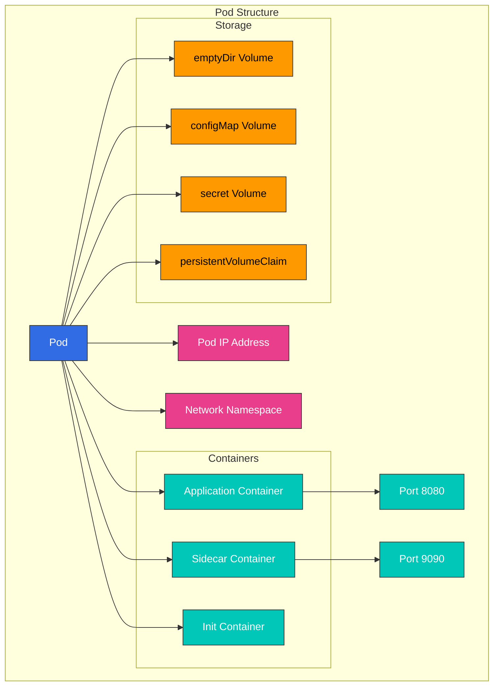

# Kubernetes Pods and Workloads

> **Versiones compatibles**: Kubernetes 1.32, 1.33, 1.34
> **Última actualización**: February 23, 2026

Este documento proporciona una explicación detallada de los Pods, la unidad básica de ejecución en Kubernetes, y de los distintos recursos de workload que los gestionan. A partir del concepto de Pods, cubriremos las características y casos de uso de diversos recursos de workload, incluidos Deployments, StatefulSets, DaemonSets y más.

## Lab Environment Setup

Para seguir los ejemplos de este documento, necesitarás las siguientes herramientas y entorno:

### Required Tools
- kubectl v1.34 o superior
- Un cluster de Kubernetes en funcionamiento (EKS, minikube, kind, etc.)

### Deploy Example Application

```bash
# Create namespace
kubectl create namespace workloads-demo

# Create a simple deployment
kubectl -n workloads-demo apply -f - <<EOF
apiVersion: apps/v1
kind: Deployment
metadata:
  name: nginx-deployment
  labels:
    app: nginx
spec:
  replicas: 3
  selector:
    matchLabels:
      app: nginx
  template:
    metadata:
      labels:
        app: nginx
    spec:
      containers:
      - name: nginx
        image: nginx:1.21
        ports:
        - containerPort: 80
        resources:
          requests:
            memory: "64Mi"
            cpu: "100m"
          limits:
            memory: "128Mi"
            cpu: "200m"
EOF

# Check deployment status
kubectl -n workloads-demo get deployments,pods
```

## Table of Contents
- [Pod Concepts](#pod-concepts)
- [Pod Lifecycle](#pod-lifecycle)
- [Pod Design Patterns](#pod-design-patterns)
- [Workload Resources Overview](#workload-resources-overview)
- [ReplicaSet](#replicaset)
- [Deployment](#deployment)
- [StatefulSet](#statefulset)
- [DaemonSet](#daemonset)
- [Jobs and CronJobs](#jobs-and-cronjobs)
- [Resource Management](#resource-management)
- [Pod Disruption Budget](#pod-disruption-budget)
- [Horizontal Pod Autoscaling](#horizontal-pod-autoscaling)
- [Vertical Pod Autoscaling](#vertical-pod-autoscaling)
- [Workload Best Practices](#workload-best-practices)
- [Amazon EKS Workload Considerations](#amazon-eks-workload-considerations)

## Pod Concepts

> **Concepto clave**: Un Pod es la unidad de cómputo desplegable más pequeña en Kubernetes, compuesta por uno o más grupos de contenedores que comparten almacenamiento y red.

Un Pod es la unidad de cómputo desplegable más pequeña en Kubernetes. Un Pod es un grupo de uno o más contenedores que comparten almacenamiento y red y se programan juntos.

### Pod Characteristics

1. **Contexto compartido**: Todos los contenedores dentro de un Pod comparten el mismo namespace de red, namespace IPC y namespace UTS.
2. **Mismo Node**: Todos los contenedores en un Pod siempre se ejecutan en el mismo node.
3. **Dirección IP única**: Cada Pod tiene una dirección IP única dentro del cluster.
4. **Efímero**: Los Pods son fundamentalmente efímeros y pueden ser reemplazados por nuevos Pods en caso de falla.
5. **Unidad atómica**: Los Pods son la unidad atómica de deployment, scheduling y replicación.

### Pod Structure

Un Pod consta de los siguientes componentes:

1. **Containers**: Uno o más contenedores ejecutándose dentro del Pod
2. **Volumes**: Almacenamiento compartido por los contenedores dentro del Pod
3. **Network**: Dirección IP y puertos asignados al Pod
4. **Container Spec**: Imagen del contenedor, variables de entorno, requisitos de recursos, etc.



### Pod Example

```yaml
apiVersion: v1
kind: Pod
metadata:
  name: multi-container-pod
  labels:
    app: web
spec:
  containers:
  - name: web
    image: nginx:1.21
    ports:
    - containerPort: 80
    volumeMounts:
    - name: shared-data
      mountPath: /usr/share/nginx/html
  - name: content-updater
    image: alpine
    command: ["/bin/sh", "-c"]
    args:
    - while true; do
        echo "Current time: $(date)" > /content/index.html;
        sleep 10;
      done
    volumeMounts:
    - name: shared-data
      mountPath: /content
  volumes:
  - name: shared-data
    emptyDir: {}
```

### Practical Example: Web Application Pod

El siguiente es un ejemplo de un Pod que contiene una aplicación web y un contenedor sidecar:

```yaml
apiVersion: v1
kind: Pod
metadata:
  name: web-app
  labels:
    app: web
    environment: production
spec:
  containers:
  - name: web-application
    image: nginx:1.21
    ports:
    - containerPort: 80
    resources:
      requests:
        memory: "128Mi"
        cpu: "100m"
      limits:
        memory: "256Mi"
        cpu: "500m"
  - name: log-collector
    image: fluentd:v1.14
    volumeMounts:
    - name: log-volume
      mountPath: /var/log/nginx
    resources:
      requests:
        memory: "64Mi"
        cpu: "50m"
      limits:
        memory: "128Mi"
        cpu: "100m"
  volumes:
  - name: log-volume
    emptyDir: {}
```

Este ejemplo demuestra el siguiente escenario del mundo real:
- Ejecutar el servidor web Nginx como el contenedor principal
- Ejecutar el recopilador de logs Fluentd como un contenedor sidecar
- Compartir un volumen de logs entre dos contenedores
- Configurar requests y limits de recursos para cada contenedor

Esta configuración es adecuada para ejecutar contenedores estrechamente conectados mientras se separa funcionalidad como logging, monitoring y proxying en arquitecturas de microservices.
    classDef k8sComponent fill:#326CE5,stroke:#333,stroke-width:1px,color:white;
    classDef userApp fill:#00C7B7,stroke:#333,stroke-width:1px,color:white;
    classDef dataStore fill:#3B48CC,stroke:#333,stroke-width:1px,color:white;
    classDef default fill:#f9f9f9,stroke:#333,stroke-width:1px,color:black;

    %% Apply classes
    class Pod default;
    class Container1,Container2 userApp;
    class Volume dataStore;
    class IP default;
```

### Pod Definition

Los Pods se definen usando archivos manifest en formato YAML o JSON. Este es un ejemplo básico de definición de Pod:

```yaml
apiVersion: v1
kind: Pod
metadata:
  name: nginx-pod
  labels:
    app: nginx
spec:
  containers:
  - name: nginx
    image: nginx:1.21
    ports:
    - containerPort: 80
    resources:
      requests:
        memory: "64Mi"
        cpu: "250m"
      limits:
        memory: "128Mi"
        cpu: "500m"
```

### Single Container vs Multi-Container Pods

**Single Container Pods**:
- Caso de uso más común
- Contiene solo un contenedor de aplicación
- Estructura simple e intuitiva

**Multi-Container Pods**:
- Contiene múltiples contenedores estrechamente acoplados
- Es posible la comunicación local entre contenedores (localhost)
- Compartición de datos mediante volúmenes compartidos
- Se escalan y se ubican juntos

### Multi-Container Pod Patterns

1. **Sidecar Pattern**: Contenedor auxiliar que amplía la funcionalidad del contenedor principal
   - Ejemplos: recopilador de logs, sincronización de archivos, proxy

```yaml
apiVersion: v1
kind: Pod
metadata:
  name: web-with-sidecar
spec:
  containers:
  - name: web
    image: nginx:1.21
  - name: log-collector
    image: fluentd:v1.14
    volumeMounts:
    - name: logs
      mountPath: /var/log/nginx
  volumes:
  - name: logs
    emptyDir: {}
```

2. **Ambassador Pattern**: Contenedor que actúa como proxy hacia servicios externos
   - Ejemplos: proxy de base de datos, service mesh sidecar

```yaml
apiVersion: v1
kind: Pod
metadata:
  name: app-with-ambassador
spec:
  containers:
  - name: app
    image: myapp:1.0
  - name: ambassador
    image: envoy:v1.20
    ports:
    - containerPort: 9901
```

3. **Adapter Pattern**: Contenedor que estandariza la salida del contenedor principal
   - Ejemplos: conversión de formato de logs, conversión de métricas

```yaml
apiVersion: v1
kind: Pod
metadata:
  name: app-with-adapter
spec:
  containers:
  - name: app
    image: myapp:1.0
  - name: adapter
    image: adapter:1.0
    volumeMounts:
    - name: app-logs
      mountPath: /var/log/app
  volumes:
  - name: app-logs
    emptyDir: {}
```

4. **Init Container Pattern**: Contenedor que se ejecuta antes de que inicie el contenedor principal
   - Ejemplos: creación de archivos de configuración, migración de base de datos, configuración de permisos

```yaml
apiVersion: v1
kind: Pod
metadata:
  name: app-with-init
spec:
  initContainers:
  - name: init-db
    image: busybox:1.34
    command: ['sh', '-c', 'until nslookup db; do echo waiting for db; sleep 2; done;']
  containers:
  - name: app
    image: myapp:1.0
```

### Pod Networking

Los contenedores dentro de un Pod tienen las siguientes características de networking:

1. **Misma dirección IP**: Todos los contenedores dentro de un Pod comparten la misma dirección IP.
2. **Compartición de puertos**: Los contenedores dentro de un Pod comparten el espacio de puertos, por lo que no pueden usar el mismo puerto.
3. **Comunicación localhost**: Los contenedores dentro de un Pod pueden comunicarse entre sí mediante localhost.
4. **Comunicación entre Pods**: Cada Pod tiene una dirección IP única y puede comunicarse directamente con otros Pods.

### Pod Storage

Los Pods pueden usar varios tipos de volúmenes para almacenar y compartir datos:

1. **emptyDir**: Volumen temporal creado cuando se crea el Pod y eliminado cuando se elimina el Pod
2. **hostPath**: Volumen montado desde el sistema de archivos del node host hacia el Pod
3. **persistentVolumeClaim**: Volumen que solicita almacenamiento persistente
4. **configMap**: ConfigMap montado como volumen
5. **secret**: Secret montado como volumen
6. **projected**: Varias fuentes de volumen asignadas al mismo directorio

```yaml
apiVersion: v1
kind: Pod
metadata:
  name: pod-with-volumes
spec:
  containers:
  - name: app
    image: myapp:1.0
    volumeMounts:
    - name: data
      mountPath: /data
    - name: config
      mountPath: /etc/config
  volumes:
  - name: data
    emptyDir: {}
  - name: config
    configMap:
      name: app-config
```

## Pod Lifecycle

Los Pods atraviesan varias etapas de lifecycle desde su creación hasta su terminación. Comprender este lifecycle es importante para garantizar la estabilidad y disponibilidad de la aplicación.

### Pod Phases

Los Pods atraviesan las siguientes phases:

1. **Pending**: El Pod ha sido aceptado por el cluster, pero uno o más contenedores aún no se han configurado
2. **Running**: El Pod ha sido vinculado a un node, todos los contenedores han sido creados, y al menos un contenedor se está ejecutando o iniciando/reiniciando
3. **Succeeded**: Todos los contenedores en el Pod han terminado correctamente y no se reiniciarán
4. **Failed**: Todos los contenedores en el Pod han terminado, y al menos un contenedor ha terminado con falla
5. **Unknown**: El estado del Pod no pudo obtenerse por alguna razón

### Container States

Cada contenedor dentro de un Pod puede tener los siguientes estados:

1. **Waiting**: Estado antes de que el contenedor se ejecute (descargando imagen, esperando dependencias, etc.)
2. **Running**: El contenedor se ejecuta sin problemas
3. **Terminated**: El contenedor ha completado su ejecución o falló por alguna razón

### Pod Conditions

Los Pods indican su estado de forma más específica mediante las siguientes conditions:

1. **PodScheduled**: Si el Pod ha sido programado en un node
2. **ContainersReady**: Si todos los contenedores en el Pod están listos
3. **Initialized**: Si todos los init containers se han completado correctamente
4. **Ready**: Si el Pod puede manejar requests y puede agregarse al pool de load balancing de los services

### Container Probes

Kubernetes proporciona las siguientes probes para comprobar el estado del contenedor:

1. **livenessProbe**: Comprueba si el contenedor está vivo; reinicia el contenedor en caso de falla
2. **readinessProbe**: Comprueba si el contenedor está listo para manejar requests; lo excluye del tráfico del service en caso de falla
3. **startupProbe**: Comprueba si la aplicación dentro del contenedor ha iniciado; deshabilita otras probes hasta que tenga éxito

```yaml
apiVersion: v1
kind: Pod
metadata:
  name: pod-with-probes
spec:
  containers:
  - name: app
    image: myapp:1.0
    ports:
    - containerPort: 8080
    livenessProbe:
      httpGet:
        path: /healthz
        port: 8080
      initialDelaySeconds: 30
      periodSeconds: 10
      timeoutSeconds: 5
      failureThreshold: 3
    readinessProbe:
      httpGet:
        path: /ready
        port: 8080
      initialDelaySeconds: 5
      periodSeconds: 5
    startupProbe:
      httpGet:
        path: /startup
        port: 8080
      failureThreshold: 30
      periodSeconds: 10
```

### Pod Termination Process

Cuando un Pod se termina, ocurre el siguiente proceso:

1. **Solicitud de eliminación al API Server**: El usuario o controller solicita la eliminación del Pod
2. **Inicio del período de terminación**: Se establece el período de terminación predeterminado (30 segundos)
3. **Actualización de API**: El API server actualiza el timestamp de eliminación del Pod
4. **Eliminación del Service**: El endpoint controller elimina el Pod de los endpoints del service
5. **Señal SIGTERM**: kubelet envía la señal SIGTERM a los contenedores
6. **Espera de apagado ordenado**: Se proporciona tiempo para que las aplicaciones se apaguen de forma ordenada
7. **Señal SIGKILL**: Si los contenedores no terminan después del período de terminación, se envía la señal SIGKILL
8. **Limpieza de recursos**: kubelet limpia los recursos del Pod

### Init Containers

Los init containers son contenedores especiales que se ejecutan antes de que inicien los app containers en un Pod:

1. **Ejecución secuencial**: Los init containers se ejecutan uno a la vez en el orden en que están definidos
2. **Prerequisito**: Cada init container inicia solo después de que el contenedor anterior se haya completado correctamente
3. **Reinicio en caso de falla**: Si un init container falla, se reinicia de acuerdo con la restart policy del Pod
4. **Propósito**: Configuración antes de que inicie el app container, verificación de dependencias, configuración de permisos, etc.

```yaml
apiVersion: v1
kind: Pod
metadata:
  name: init-pod
spec:
  initContainers:
  - name: init-myservice
    image: busybox:1.34
    command: ['sh', '-c', 'until nslookup myservice; do echo waiting for myservice; sleep 2; done;']
  - name: init-mydb
    image: busybox:1.34
    command: ['sh', '-c', 'until nslookup mydb; do echo waiting for mydb; sleep 2; done;']
  containers:
  - name: app
    image: myapp:1.0
```

### Pod Disruption

Las interrupciones de Pod pueden dividirse en interrupciones voluntarias o involuntarias:

1. **Interrupciones voluntarias**: Interrupciones realizadas por administradores del cluster o herramientas de automatización
   - Node draining
   - Actualizaciones de Deployment
   - Eliminación de Pod

2. **Interrupciones involuntarias**: Interrupciones debidas a fallas de hardware, kernel panics, particiones de red, etc.

PodDisruptionBudget puede garantizar disponibilidad mínima durante interrupciones voluntarias.

## Pod Design Patterns

Hay varios patrones y mejores prácticas que considerar al diseñar Pods. Comprender y aplicar estos patrones puede mejorar la estabilidad, escalabilidad y mantenibilidad de las aplicaciones.

### Single Responsibility Principle

Los Pods deben seguir el Single Responsibility Principle:

1. **Una función principal**: Cada Pod debe ser responsable de una función o proceso principal
2. **Escalado independiente**: Diseñar para que cada función pueda escalar de forma independiente
3. **Lifecycle separado**: Diseñar para que cada función pueda tener su propio lifecycle

### Pod Templates

Las plantillas de Pod son especificaciones usadas para crear Pods en recursos de workload (Deployments, StatefulSets, etc.):

```yaml
apiVersion: apps/v1
kind: Deployment
metadata:
  name: nginx-deployment
spec:
  replicas: 3
  selector:
    matchLabels:
      app: nginx
  template:  # Pod template starts
    metadata:
      labels:
        app: nginx
    spec:
      containers:
      - name: nginx
        image: nginx:1.21
        ports:
        - containerPort: 80
  # Pod template ends
```

### Pod Affinity and Anti-Affinity

Pod affinity y anti-affinity son reglas que controlan en qué nodes se programan los Pods:

1. **Pod Affinity**: Programar en el mismo node o dominio de topología que Pods específicos
2. **Pod Anti-Affinity**: Programar en un node o dominio de topología distinto al de Pods específicos

```yaml
apiVersion: v1
kind: Pod
metadata:
  name: web-pod
spec:
  affinity:
    podAffinity:
      requiredDuringSchedulingIgnoredDuringExecution:
      - labelSelector:
          matchExpressions:
          - key: app
            operator: In
            values:
            - cache
        topologyKey: "kubernetes.io/hostname"
    podAntiAffinity:
      preferredDuringSchedulingIgnoredDuringExecution:
      - weight: 100
        podAffinityTerm:
          labelSelector:
            matchExpressions:
            - key: app
              operator: In
              values:
              - web
          topologyKey: "kubernetes.io/hostname"
  containers:
  - name: web
    image: nginx:1.21
```

### Node Affinity

Node affinity es una regla que restringe que los Pods se programen en nodes específicos:

```yaml
apiVersion: v1
kind: Pod
metadata:
  name: gpu-pod
spec:
  affinity:
    nodeAffinity:
      requiredDuringSchedulingIgnoredDuringExecution:
        nodeSelectorTerms:
        - matchExpressions:
          - key: gpu
            operator: In
            values:
            - "true"
  containers:
  - name: gpu-container
    image: gpu-app:1.0
```

### Taints and Tolerations

Los taints se aplican a los nodes para impedir que ciertos Pods sean programados, y las tolerations se aplican a Pods para permitir la programación en nodes con taints:

```yaml
# Apply taint to node
kubectl taint nodes node1 key=value:NoSchedule

# Apply toleration to Pod
apiVersion: v1
kind: Pod
metadata:
  name: tolerant-pod
spec:
  tolerations:
  - key: "key"
    operator: "Equal"
    value: "value"
    effect: "NoSchedule"
  containers:
  - name: app
    image: myapp:1.0
```

### Resource Requests and Limits

Configurar requests y limits de recursos para contenedores en Pods es importante para un uso eficiente de los recursos del cluster y para garantizar estabilidad:

```yaml
apiVersion: v1
kind: Pod
metadata:
  name: resource-pod
spec:
  containers:
  - name: app
    image: myapp:1.0
    resources:
      requests:
        memory: "64Mi"
        cpu: "250m"
      limits:
        memory: "128Mi"
        cpu: "500m"
```

### Pod Security Context

Security context define la configuración de seguridad a nivel de Pod o contenedor:

```yaml
apiVersion: v1
kind: Pod
metadata:
  name: security-pod
spec:
  securityContext:
    runAsUser: 1000
    runAsGroup: 3000
    fsGroup: 2000
  containers:
  - name: app
    image: myapp:1.0
    securityContext:
      allowPrivilegeEscalation: false
      capabilities:
        drop:
        - ALL
```

### Pod Priority and Preemption

Pod priority y preemption determinan qué Pods se programan y cuáles son expulsados preventivamente cuando los recursos del cluster son insuficientes:

```yaml
# Priority class definition
apiVersion: scheduling.k8s.io/v1
kind: PriorityClass
metadata:
  name: high-priority
value: 1000000
globalDefault: false
description: "This priority class should be used for critical pods only."

# Pod using priority class
apiVersion: v1
kind: Pod
metadata:
  name: high-priority-pod
spec:
  priorityClassName: high-priority
  containers:
  - name: app
    image: myapp:1.0
```

## Workload Resources Overview

Kubernetes proporciona varios recursos de workload para gestionar Pods. Cada recurso de workload está diseñado para casos de uso y requisitos específicos.

### Workload Resource Types

Los principales recursos de workload en Kubernetes son:

1. **ReplicaSet**: Mantiene un número especificado de réplicas de Pod
2. **Deployment**: Gestiona ReplicaSets para proporcionar actualizaciones declarativas
3. **StatefulSet**: Recurso para aplicaciones que requieren persistencia de estado
4. **DaemonSet**: Ejecuta una copia de un Pod en todos los nodes
5. **Job**: Tareas de una sola ejecución que terminan después de completarse
6. **CronJob**: Ejecuta Jobs periódicamente según una programación

### Workload Resource Selection Criteria

Criterios para seleccionar el recurso de workload adecuado:

1. **Persistencia de estado**: Si la aplicación necesita mantener estado
2. **Patrón de ejecución**: Si se ejecuta continuamente, una sola vez o periódicamente
3. **Requisitos de Deployment**: Requisitos para rolling updates, blue/green deployments, etc.
4. **Cobertura de nodes**: Si necesita ejecutarse en todos los nodes
5. **Requisitos de escalabilidad**: Si se necesita escalado horizontal

## ReplicaSet

Un ReplicaSet garantiza que siempre se esté ejecutando un número especificado de réplicas de Pod. Si los Pods fallan o se eliminan, el ReplicaSet crea automáticamente Pods de reemplazo.

### Main Features of ReplicaSet

1. **Mantener réplicas de Pod**: Mantiene el número especificado de réplicas de Pod
2. **Selección de Pods**: Identifica los Pods que gestiona mediante label selectors
3. **Creación de Pods**: Crea nuevos Pods cuando es necesario
4. **Eliminación de Pods**: Elimina Pods excedentes

### ReplicaSet Definition

```yaml
apiVersion: apps/v1
kind: ReplicaSet
metadata:
  name: frontend
  labels:
    app: guestbook
    tier: frontend
spec:
  replicas: 3
  selector:
    matchLabels:
      tier: frontend
  template:
    metadata:
      labels:
        tier: frontend
    spec:
      containers:
      - name: php-redis
        image: gcr.io/google_samples/gb-frontend:v3
        resources:
          requests:
            cpu: 100m
            memory: 100Mi
        ports:
        - containerPort: 80
```

### ReplicaSet Operation

1. **Coincidencia de label selector**: ReplicaSet identifica Pods que coinciden con el label selector
2. **Comprobar estado actual**: Verifica el número de Pods actualmente en ejecución
3. **Comparar con el estado deseado**: Compara el recuento actual de Pods con el recuento deseado de réplicas
4. **Acciones de ajuste**: Crea o elimina Pods según sea necesario

### ReplicaSet vs Replication Controller

ReplicaSet es el sucesor de Replication Controller y proporciona label selectors más potentes:

1. **Replication Controller**: Solo admite selectors basados en igualdad (por ejemplo, app=nginx)
2. **ReplicaSet**: Admite selectors basados en conjuntos (por ejemplo, app in (nginx, apache))

### ReplicaSet Use Cases

Los ReplicaSets generalmente se usan indirectamente mediante Deployments en lugar de directamente. Sin embargo, pueden usarse directamente en los siguientes casos:

1. **Replicación simple**: Cuando simplemente se mantienen réplicas de Pod
2. **Actualizaciones personalizadas**: Cuando se necesitan mecanismos de actualización personalizados
3. **Compatibilidad heredada**: Compatibilidad con aplicaciones heredadas

## Deployment

Un Deployment gestiona ReplicaSets para proporcionar actualizaciones declarativas para Pods. Los Deployments gestionan rolling updates, rollbacks, scaling y más para las aplicaciones.

### Main Features of Deployment

1. **Actualizaciones declarativas**: Declara el estado deseado y Deployment cambia el estado actual al estado deseado
2. **Rolling Updates**: Actualiza aplicaciones sin downtime
3. **Rollback**: Rollback sencillo a versiones anteriores
4. **Scaling**: Ajusta el número de réplicas de la aplicación
5. **Historial de Deployment**: Mantiene registros de versiones anteriores de deployment

### Deployment Definition

```yaml
apiVersion: apps/v1
kind: Deployment
metadata:
  name: nginx-deployment
  labels:
    app: nginx
spec:
  replicas: 3
  selector:
    matchLabels:
      app: nginx
  strategy:
    type: RollingUpdate
    rollingUpdate:
      maxSurge: 1
      maxUnavailable: 0
  template:
    metadata:
      labels:
        app: nginx
    spec:
      containers:
      - name: nginx
        image: nginx:1.21
        ports:
        - containerPort: 80
        resources:
          requests:
            cpu: 100m
            memory: 100Mi
          limits:
            cpu: 200m
            memory: 200Mi
        livenessProbe:
          httpGet:
            path: /
            port: 80
          initialDelaySeconds: 30
          periodSeconds: 10
        readinessProbe:
          httpGet:
            path: /
            port: 80
          initialDelaySeconds: 5
          periodSeconds: 5
```

### Deployment Update Strategies

Deployments proporciona dos estrategias de actualización:

1. **RollingUpdate**: Actualiza gradualmente Pods para deployment sin downtime (predeterminado)
   - **maxSurge**: Número máximo de Pods que pueden crearse por encima del recuento deseado de Pods
   - **maxUnavailable**: Número máximo de Pods no disponibles durante la actualización

2. **Recreate**: Elimina todos los Pods existentes antes de crear nuevos Pods (causa downtime temporal)

### Deployment Rollback

Deployments admite rollback a versiones anteriores:

```bash
# Check deployment history
kubectl rollout history deployment/nginx-deployment

# Check details of specific version
kubectl rollout history deployment/nginx-deployment --revision=2

# Rollback to previous version
kubectl rollout undo deployment/nginx-deployment

# Rollback to specific version
kubectl rollout undo deployment/nginx-deployment --to-revision=2
```

### Deployment Scaling

Los Deployments pueden escalarse fácilmente:

```bash
# Imperative scaling
kubectl scale deployment/nginx-deployment --replicas=5

# Declarative scaling (after modifying YAML file)
kubectl apply -f deployment.yaml
```

### Deployment Pause and Resume

Los rollouts de Deployment pueden pausarse y reanudarse:

```bash
# Pause rollout
kubectl rollout pause deployment/nginx-deployment

# Apply multiple changes
kubectl set image deployment/nginx-deployment nginx=nginx:1.22
kubectl set resources deployment/nginx-deployment -c=nginx --limits=cpu=200m,memory=256Mi

# Resume rollout
kubectl rollout resume deployment/nginx-deployment
```

### Deployment Status

Los Deployments pueden tener los siguientes estados:

1. **Progressing**: Se está creando un nuevo ReplicaSet o se está escalando hacia arriba/abajo
2. **Complete**: Todas las réplicas se han actualizado y están disponibles
3. **Failed**: Ocurrió un error durante el deployment (por ejemplo, falla al descargar la imagen, recursos insuficientes)

## StatefulSet

StatefulSet es un recurso de workload para aplicaciones que requieren persistencia de estado. Asigna identificadores únicos a cada Pod y proporciona identificadores de red estables y almacenamiento persistente.

### Main Features of StatefulSet

1. **Identificadores de red estables y únicos**: Los nombres de Pod y hostnames se mantienen incluso después de reinicios
2. **Almacenamiento estable y persistente**: Acceso al mismo almacenamiento incluso cuando los Pods se reprograman
3. **Deployment y scaling secuenciales**: Los Pods se crean, actualizan y eliminan en orden
4. **Rolling updates automáticos secuenciales**: Los Pods se actualizan en orden

### StatefulSet Definition

```yaml
apiVersion: apps/v1
kind: StatefulSet
metadata:
  name: web
spec:
  selector:
    matchLabels:
      app: nginx
  serviceName: "nginx"
  replicas: 3
  updateStrategy:
    type: RollingUpdate
  podManagementPolicy: OrderedReady
  template:
    metadata:
      labels:
        app: nginx
    spec:
      containers:
      - name: nginx
        image: nginx:1.21
        ports:
        - containerPort: 80
          name: web
        volumeMounts:
        - name: www
          mountPath: /usr/share/nginx/html
  volumeClaimTemplates:
  - metadata:
      name: www
    spec:
      accessModes: [ "ReadWriteOnce" ]
      storageClassName: "standard"
      resources:
        requests:
          storage: 1Gi
```

### StatefulSet Pod Identifiers

StatefulSet asigna identificadores únicos a Pods con el siguiente formato:
```
<StatefulSet name>-<ordinal index>
```

Por ejemplo, un StatefulSet `web` crea Pods como `web-0`, `web-1`, `web-2`.

### StatefulSet Headless Service

StatefulSets se usan normalmente con un headless service (clusterIP: None). Esto crea registros DNS para cada Pod:

```yaml
apiVersion: v1
kind: Service
metadata:
  name: nginx
  labels:
    app: nginx
spec:
  ports:
  - port: 80
    name: web
  clusterIP: None
  selector:
    app: nginx
```

Con esto, cada Pod tiene un nombre DNS con el siguiente formato:
```
<Pod name>.<service name>.<namespace>.svc.cluster.local
```

Ejemplo: `web-0.nginx.default.svc.cluster.local`

### StatefulSet Storage

StatefulSets usa `volumeClaimTemplates` para crear automáticamente Persistent Volume Claims (PVCs) para cada Pod. Estos PVCs se mantienen incluso cuando los Pods se reprograman.

### StatefulSet Update Strategies

StatefulSets proporciona dos estrategias de actualización:

1. **RollingUpdate**: Actualiza Pods en orden (predeterminado)
2. **OnDelete**: Actualiza solo cuando los Pods se eliminan

### Pod Management Policy

StatefulSets proporciona dos políticas de gestión de Pods:

1. **OrderedReady**: Crea y termina Pods en orden (predeterminado)
2. **Parallel**: Crea y termina Pods en paralelo

### StatefulSet Use Cases

StatefulSets es adecuado para las siguientes aplicaciones:

1. **Databases**: MySQL, PostgreSQL, MongoDB, etc.
2. **Distributed Systems**: Kafka, ZooKeeper, Elasticsearch, etc.
3. **Message Queues**: RabbitMQ, etc.
4. **Other Stateful Applications**: File servers, session stores, etc.

### StatefulSet Example: MySQL Replication

```yaml
apiVersion: v1
kind: Service
metadata:
  name: mysql
  labels:
    app: mysql
spec:
  ports:
  - port: 3306
    name: mysql
  clusterIP: None
  selector:
    app: mysql
---
apiVersion: apps/v1
kind: StatefulSet
metadata:
  name: mysql
spec:
  selector:
    matchLabels:
      app: mysql
  serviceName: mysql
  replicas: 3
  template:
    metadata:
      labels:
        app: mysql
    spec:
      initContainers:
      - name: init-mysql
        image: mysql:5.7
        command:
        - bash
        - "-c"
        - |
          set -ex
          # Generate server ID based on Pod index
          [[ `hostname` =~ -([0-9]+)$ ]] || exit 1
          ordinal=${BASH_REMATCH[1]}
          echo [mysqld] > /mnt/conf.d/server-id.cnf
          echo server-id=$((100 + $ordinal)) >> /mnt/conf.d/server-id.cnf
          # Master or slave configuration
          if [[ $ordinal -eq 0 ]]; then
            echo [mysqld] > /mnt/conf.d/master.cnf
            echo log-bin=mysql-bin >> /mnt/conf.d/master.cnf
          else
            echo [mysqld] > /mnt/conf.d/slave.cnf
            echo super-read-only >> /mnt/conf.d/slave.cnf
          fi
        volumeMounts:
        - name: conf
          mountPath: /mnt/conf.d
      - name: clone-mysql
        image: gcr.io/google-samples/xtrabackup:1.0
        command:
        - bash
        - "-c"
        - |
          set -ex
          # Only perform replication if not the first Pod
          [[ `hostname` =~ -([0-9]+)$ ]] || exit 1
          ordinal=${BASH_REMATCH[1]}
          if [[ $ordinal -eq 0 ]]; then
            exit 0
          fi
          # Replicate data from previous Pod
          ncat --recv-only mysql-$(($ordinal-1)).mysql 3307 | xbstream -x -C /var/lib/mysql
          # Prepare backup
          xtrabackup --prepare --target-dir=/var/lib/mysql
        volumeMounts:
        - name: data
          mountPath: /var/lib/mysql
          subPath: mysql
        - name: conf
          mountPath: /etc/mysql/conf.d
      containers:
      - name: mysql
        image: mysql:5.7
        env:
        - name: MYSQL_ROOT_PASSWORD
          valueFrom:
            secretKeyRef:
              name: mysql-secret
              key: password
        ports:
        - name: mysql
          containerPort: 3306
        volumeMounts:
        - name: data
          mountPath: /var/lib/mysql
          subPath: mysql
        - name: conf
          mountPath: /etc/mysql/conf.d
        resources:
          requests:
            cpu: 500m
            memory: 1Gi
        livenessProbe:
          exec:
            command: ["mysqladmin", "ping"]
          initialDelaySeconds: 30
          periodSeconds: 10
          timeoutSeconds: 5
        readinessProbe:
          exec:
            command: ["mysql", "-h", "127.0.0.1", "-e", "SELECT 1"]
          initialDelaySeconds: 5
          periodSeconds: 2
          timeoutSeconds: 1
      - name: xtrabackup
        image: gcr.io/google-samples/xtrabackup:1.0
        ports:
        - name: xtrabackup
          containerPort: 3307
        command:
        - bash
        - "-c"
        - |
          set -ex
          cd /var/lib/mysql
          # Start slave
          if [[ -f xtrabackup_slave_info ]]; then
            cat xtrabackup_slave_info | sed -E 's/;$//g' > change_master_to.sql
            mysql -h 127.0.0.1 -e "$(cat change_master_to.sql); RESET SLAVE; START SLAVE;"
          # If replicated from master
          elif [[ -f xtrabackup_binlog_info ]]; then
            [[ `hostname` =~ -([0-9]+)$ ]] || exit 1
            ordinal=${BASH_REMATCH[1]}
            [[ $ordinal -eq 0 ]] && exit 0
            master_host=mysql-0.mysql
            master_log_file=$(cat xtrabackup_binlog_info | awk '{print $1}')
            master_log_pos=$(cat xtrabackup_binlog_info | awk '{print $2}')
            mysql -h 127.0.0.1 -e "CHANGE MASTER TO MASTER_HOST='$master_host', MASTER_USER='root', MASTER_PASSWORD='$MYSQL_ROOT_PASSWORD', MASTER_LOG_FILE='$master_log_file', MASTER_LOG_POS=$master_log_pos; RESET SLAVE; START SLAVE;"
          fi
          # Start backup server
          exec ncat --listen --keep-open --send-only --max-conns=1 3307 -c "xtrabackup --backup --slave-info --stream=xbstream --host=127.0.0.1"
        volumeMounts:
        - name: data
          mountPath: /var/lib/mysql
          subPath: mysql
        - name: conf
          mountPath: /etc/mysql/conf.d
        resources:
          requests:
            cpu: 100m
            memory: 100Mi
      volumes:
      - name: conf
        emptyDir: {}
  volumeClaimTemplates:
  - metadata:
      name: data
    spec:
      accessModes: ["ReadWriteOnce"]
      storageClassName: standard
      resources:
        requests:
          storage: 10Gi
```

## DaemonSet

Un DaemonSet garantiza que una copia de un Pod se ejecute en todos los nodes (o en nodes específicos). Cuando se agrega un node al cluster, los Pods se agregan automáticamente, y cuando se elimina un node, los Pods también se eliminan.

### Main Features of DaemonSet

1. **Ejecutar en todos los nodes**: Ejecuta Pods en todos los nodes del cluster
2. **Selección de nodes**: Puede ejecutarse solo en nodes específicos mediante node selectors
3. **Deployment automático**: Despliega Pods automáticamente cuando se agregan nuevos nodes
4. **Limpieza automática**: Limpia Pods automáticamente cuando se eliminan nodes

### DaemonSet Definition

```yaml
apiVersion: apps/v1
kind: DaemonSet
metadata:
  name: fluentd-elasticsearch
  namespace: kube-system
  labels:
    k8s-app: fluentd-logging
spec:
  selector:
    matchLabels:
      name: fluentd-elasticsearch
  updateStrategy:
    type: RollingUpdate
    rollingUpdate:
      maxUnavailable: 1
  template:
    metadata:
      labels:
        name: fluentd-elasticsearch
    spec:
      tolerations:
      - key: node-role.kubernetes.io/master
        effect: NoSchedule
      containers:
      - name: fluentd-elasticsearch
        image: quay.io/fluentd_elasticsearch/fluentd:v2.5.2
        resources:
          limits:
            memory: 200Mi
          requests:
            cpu: 100m
            memory: 200Mi
        volumeMounts:
        - name: varlog
          mountPath: /var/log
        - name: varlibdockercontainers
          mountPath: /var/lib/docker/containers
          readOnly: true
      terminationGracePeriodSeconds: 30
      volumes:
      - name: varlog
        hostPath:
          path: /var/log
      - name: varlibdockercontainers
        hostPath:
          path: /var/lib/docker/containers
```

### DaemonSet Update Strategies

DaemonSets proporciona dos estrategias de actualización:

1. **RollingUpdate**: Actualiza Pods secuencialmente (predeterminado)
   - **maxUnavailable**: Número máximo de Pods no disponibles durante la actualización

2. **OnDelete**: Actualiza solo cuando los Pods se eliminan

### DaemonSet Node Selection

DaemonSets puede configurarse para ejecutarse solo en nodes específicos:

```yaml
spec:
  template:
    spec:
      nodeSelector:
        disk: ssd
```

### DaemonSet Taint Tolerations

DaemonSets puede configurar tolerations para ejecutarse en nodes con taints:

```yaml
spec:
  template:
    spec:
      tolerations:
      - key: node-role.kubernetes.io/master
        effect: NoSchedule
```

### DaemonSet Use Cases

DaemonSets se usa para los siguientes propósitos:

1. **Log Collectors**: Fluentd, Logstash, etc.
2. **Monitoring Agents**: Prometheus Node Exporter, Datadog Agent, etc.
3. **Network Plugins**: Calico, Cilium, Weave Net, etc.
4. **Storage Daemons**: Ceph, GlusterFS, etc.
5. **Security Agents**: Falco, Sysdig, etc.

### DaemonSet Example: Prometheus Node Exporter

```yaml
apiVersion: apps/v1
kind: DaemonSet
metadata:
  name: node-exporter
  namespace: monitoring
  labels:
    app: node-exporter
spec:
  selector:
    matchLabels:
      app: node-exporter
  template:
    metadata:
      labels:
        app: node-exporter
    spec:
      hostNetwork: true
      hostPID: true
      containers:
      - name: node-exporter
        image: prom/node-exporter:v1.3.1
        args:
        - --path.procfs=/host/proc
        - --path.sysfs=/host/sys
        - --path.rootfs=/host/root
        - --web.listen-address=:9100
        ports:
        - containerPort: 9100
          protocol: TCP
          name: http
        resources:
          limits:
            cpu: 250m
            memory: 180Mi
          requests:
            cpu: 102m
            memory: 180Mi
        volumeMounts:
        - name: proc
          mountPath: /host/proc
          readOnly: true
        - name: sys
          mountPath: /host/sys
          readOnly: true
        - name: root
          mountPath: /host/root
          readOnly: true
      tolerations:
      - operator: "Exists"
      volumes:
      - name: proc
        hostPath:
          path: /proc
      - name: sys
        hostPath:
          path: /sys
      - name: root
        hostPath:
          path: /
```

## Jobs and CronJobs

Jobs y CronJobs son recursos de workload para ejecutar tareas de una sola vez o periódicas.

### Job

Un Job crea uno o más Pods y continúa la ejecución hasta que un número especificado de Pods termine correctamente.

#### Main Features of Job

1. **Garantía de finalización**: Se ejecuta hasta que el número especificado de Pods se complete correctamente
2. **Ejecución paralela**: Puede ejecutar varios Pods en paralelo
3. **Reintento**: Reintento automático de Pods fallidos
4. **Limpieza después de la finalización**: Limpieza opcional de Pods después de que se complete el job

#### Job Definition

```yaml
apiVersion: batch/v1
kind: Job
metadata:
  name: pi
spec:
  completions: 5      # Number of Pods that must successfully complete
  parallelism: 2      # Number of Pods to run in parallel
  backoffLimit: 4     # Number of retries on failure
  activeDeadlineSeconds: 100  # Job time limit (seconds)
  ttlSecondsAfterFinished: 100  # Deletion time after completion (seconds)
  template:
    spec:
      containers:
      - name: pi
        image: perl:5.34
        command: ["perl", "-Mbignum=bpi", "-wle", "print bpi(2000)"]
        resources:
          requests:
            cpu: 100m
            memory: 50Mi
          limits:
            cpu: 100m
            memory: 100Mi
      restartPolicy: Never  # or OnFailure
```

#### Job Completion Modes

Jobs proporciona dos modos de finalización:

1. **NonIndexed**: Modo de job estándar donde el job se completa cuando el número especificado de Pods se completa correctamente
2. **Indexed**: A cada Pod se le asigna un índice a partir de 0, realizando tareas para rangos de índices específicos

```yaml
apiVersion: batch/v1
kind: Job
metadata:
  name: indexed-job
spec:
  completions: 5
  parallelism: 3
  completionMode: Indexed  # Enable Indexed mode
  template:
    spec:
      containers:
      - name: worker
        image: busybox:1.34
        command: ["sh", "-c", "echo Processing item ${JOB_COMPLETION_INDEX}"]
      restartPolicy: Never
```

#### Job Use Cases

Jobs se usa para los siguientes propósitos:

1. **Batch Processing**: Procesamiento de datos, tareas ETL
2. **Computation Tasks**: Cálculos científicos, rendering
3. **Database Migrations**: Actualizaciones de esquema
4. **One-time Administrative Tasks**: Backups, tareas de limpieza

### CronJob

CronJobs ejecuta Jobs periódicamente de acuerdo con una programación especificada. Funcionan de forma similar a los cron jobs de Linux.

#### Main Features of CronJob

1. **Ejecución programada**: Especifica el schedule de ejecución usando expresiones cron
2. **Gestión de Jobs**: Crea Jobs de acuerdo con el schedule
3. **Política de concurrencia**: Define el comportamiento cuando el job anterior sigue ejecutándose
4. **Límite de historial**: Limita el historial de jobs completados

#### CronJob Definition

```yaml
apiVersion: batch/v1
kind: CronJob
metadata:
  name: hello
spec:
  schedule: "*/1 * * * *"  # Run every minute
  timeZone: "America/New_York"  # Timezone (Kubernetes 1.24+)
  concurrencyPolicy: Forbid  # Allow, Forbid, Replace
  successfulJobsHistoryLimit: 3
  failedJobsHistoryLimit: 1
  startingDeadlineSeconds: 60
  jobTemplate:
    spec:
      template:
        spec:
          containers:
          - name: hello
            image: busybox:1.34
            command:
            - /bin/sh
            - -c
            - date; echo Hello from the Kubernetes cluster
          restartPolicy: OnFailure
```

#### Cron Expression

Las expresiones cron tienen el siguiente formato:
```
+------------------- minute (0 - 59)
| +----------------- hour (0 - 23)
| | +--------------- day of month (1 - 31)
| | | +------------- month (1 - 12)
| | | | +----------- day of week (0 - 6) (Sunday to Saturday; 7 is also Sunday)
| | | | |
| | | | |
* * * * *
```

Ejemplos comunes de expresiones cron:
- `*/5 * * * *`: Cada 5 minutos
- `0 * * * *`: Cada hora al inicio de la hora
- `0 0 * * *`: Todos los días a medianoche
- `0 0 * * 0`: Todos los domingos a medianoche
- `0 0 1 * *`: Día 1 de cada mes a medianoche
- `0 0 1 1 *`: 1 de enero a medianoche todos los años

#### Concurrency Policy

CronJobs proporciona tres políticas de concurrencia:

1. **Allow**: Varios Jobs pueden ejecutarse simultáneamente (predeterminado)
2. **Forbid**: Omite el nuevo Job si el Job anterior sigue ejecutándose
3. **Replace**: Reemplaza el Job anterior con el nuevo Job si sigue ejecutándose

#### CronJob Use Cases

CronJobs se usa para los siguientes propósitos:

1. **Regular Backups**: Backups de bases de datos, creación de snapshots
2. **Data Synchronization**: Sincronización periódica de datos
3. **Report Generation**: Generación de reportes diarios/semanales/mensuales
4. **Cleanup Tasks**: Limpieza de archivos temporales, rotación de logs
5. **Notifications and Monitoring**: Comprobaciones de estado, envío de alertas

#### CronJob Example: Database Backup

```yaml
apiVersion: batch/v1
kind: CronJob
metadata:
  name: database-backup
spec:
  schedule: "0 2 * * *"  # Run daily at 02:00
  concurrencyPolicy: Forbid
  successfulJobsHistoryLimit: 3
  failedJobsHistoryLimit: 1
  jobTemplate:
    spec:
      template:
        spec:
          containers:
          - name: backup
            image: postgres:14
            env:
            - name: PGHOST
              value: postgres-service
            - name: PGUSER
              valueFrom:
                secretKeyRef:
                  name: postgres-secret
                  key: username
            - name: PGPASSWORD
              valueFrom:
                secretKeyRef:
                  name: postgres-secret
                  key: password
            command:
            - /bin/sh
            - -c
            - |
              pg_dump -Fc > /backup/db-$(date +%Y%m%d-%H%M%S).dump
              find /backup -type f -mtime +7 -delete  # Delete backups older than 7 days
            volumeMounts:
            - name: backup-volume
              mountPath: /backup
          restartPolicy: OnFailure
          volumes:
          - name: backup-volume
            persistentVolumeClaim:
              claimName: backup-pvc
```

## Conclusion

Este documento cubrió Pods, el bloque de construcción básico de Kubernetes, y varios recursos de workload. A partir del concepto de Pods, exploramos las características y casos de uso de diversos recursos de workload, incluidos Deployments, StatefulSets, DaemonSets, Jobs y CronJobs. Cada uno de estos recursos tiene propósitos y características únicas, y usarlos adecuadamente permite un deployment y una gestión eficientes de aplicaciones.

## Quiz

Para comprobar lo que aprendiste en este capítulo, intenta el [Pods and Workloads Quiz](../quizzes/core/02-pods-and-workloads-quiz.md).
