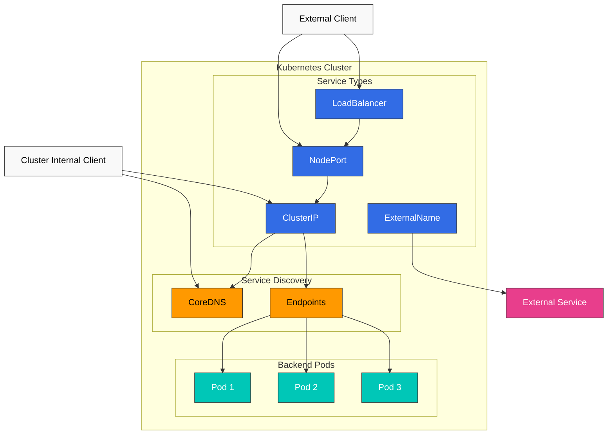
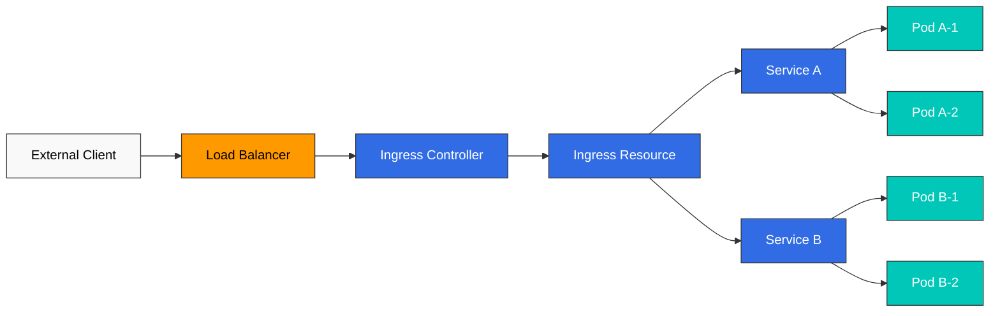
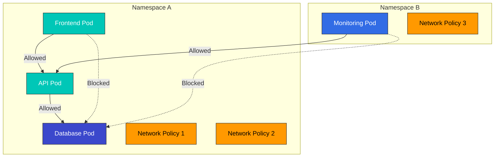
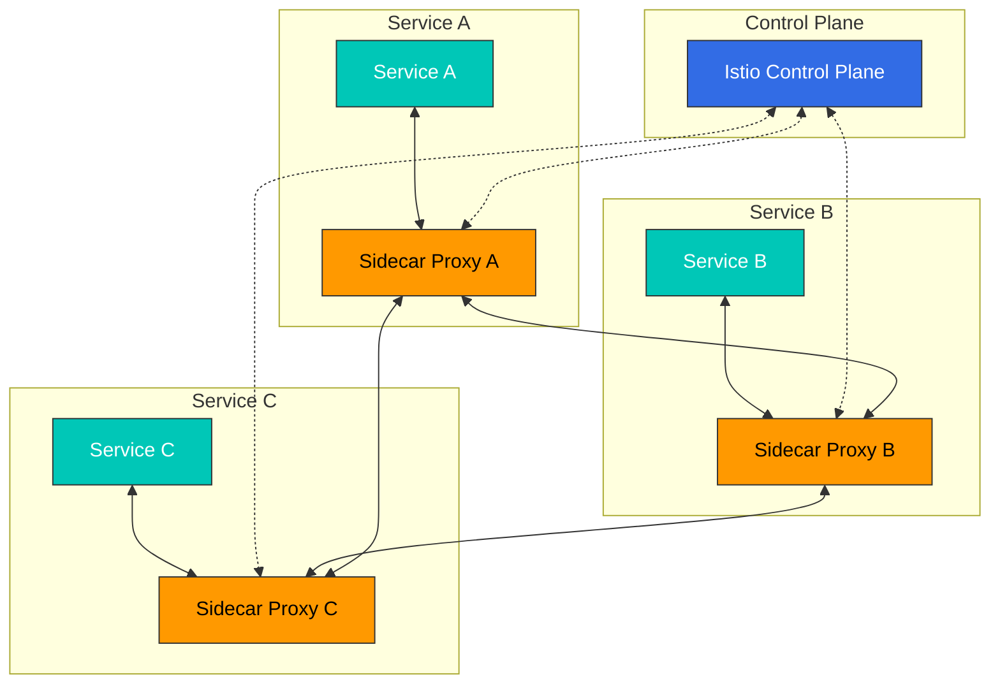
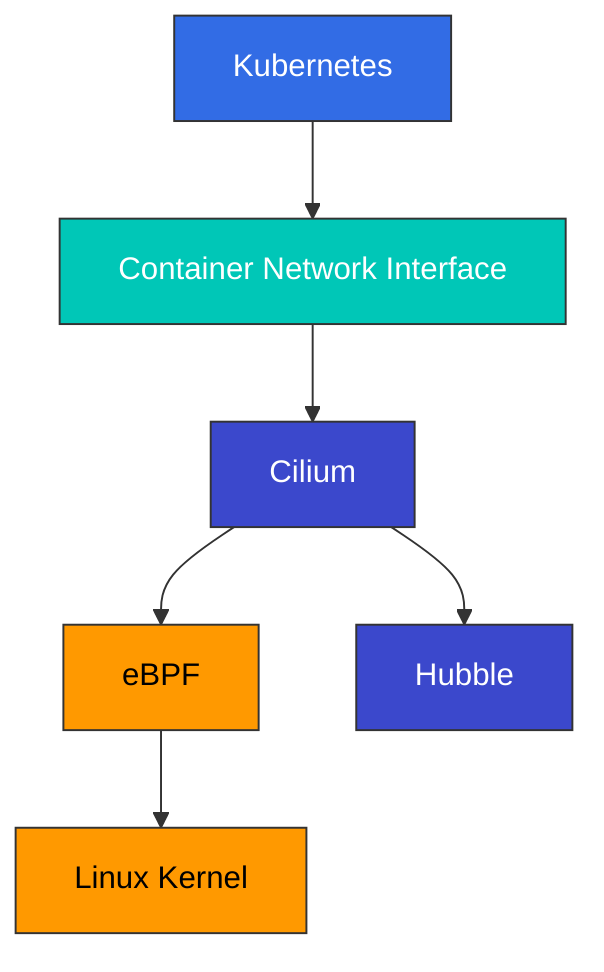

# Services and Networking

> **Versiones compatibles**: Kubernetes 1.32, 1.33, 1.34
> **Última actualización**: February 23, 2026

En Kubernetes, un Service (servicio) es una capa de abstracción que proporciona un único punto de acceso para un conjunto de Pods. En este capítulo, exploraremos en detalle los conceptos de networking de Kubernetes, incluidos los distintos tipos de Service, Ingress, network policies y más.

## Lab Environment Setup

Para seguir los ejemplos de este documento, necesitarás las siguientes herramientas y entorno:

### Required Tools
- kubectl v1.34 o superior
- Un cluster Kubernetes funcional (EKS, minikube, kind, etc.)

### Deploy Example Application

```bash
# Create namespace
kubectl create namespace networking-demo

# Deploy a simple application
kubectl -n networking-demo apply -f - <<EOF
apiVersion: apps/v1
kind: Deployment
metadata:
  name: web-app
  labels:
    app: web
spec:
  replicas: 3
  selector:
    matchLabels:
      app: web
  template:
    metadata:
      labels:
        app: web
    spec:
      containers:
      - name: nginx
        image: nginx:1.21
        ports:
        - containerPort: 80
---
apiVersion: v1
kind: Service
metadata:
  name: web-service
spec:
  selector:
    app: web
  ports:
  - port: 80
    targetPort: 80
  type: ClusterIP
EOF

# Verify services
kubectl -n networking-demo get svc,pods
```

## Table of Contents

1. [Service Types](#service-types)
2. [Ingress](#ingress)
3. [Endpoints](#endpoints)
4. [Service Discovery](#service-discovery)
5. [CoreDNS](#coredns)
6. [Network Policies](#network-policies)
7. [Service Mesh](#service-mesh)
8. [CNI (Container Network Interface)](#cnicontainer-network-interface)
9. [Cilium](#cilium)
   - [Introduction to Cilium](#introduction-to-cilium)
   - [eBPF Technology](#ebpf-technology)
   - [Cilium Networking Model](#cilium-networking-model)
   - [Cilium Network Policies](#cilium-network-policies)
   - [Network Visibility with Hubble](#network-visibility-with-hubble)
   - [Configuring Cilium on Amazon EKS](#configuring-cilium-on-amazon-eks)

## Service Types

> **Concepto clave**: Los Kubernetes Services proporcionan endpoints de red estables para un conjunto de Pods y controlan el acceso interno y externo mediante diversos tipos.

Kubernetes proporciona diversos tipos de Service para admitir múltiples formas de exponer aplicaciones.

### Service Architecture



### Service Type Comparison

| Service Type | Access Scope | External IP | Use Case | Features |
|-------------|-------------|-------------|----------|----------|
| **ClusterIP** | Cluster Internal | No | Internal microservice communication | Default service type, accessible only within cluster |
| **NodePort** | Cluster External | No | Development and test environments | Access through specific port (30000-32767) on all nodes |
| **LoadBalancer** | Cluster External | Yes | Production external services | Provisions cloud provider load balancer |
| **ExternalName** | Cluster Internal | No | Internal alias for external services | Redirection via DNS CNAME record |
| **Headless** | Cluster Internal | No | When direct Pod IP access is needed | Special service without ClusterIP |

### ClusterIP

ClusterIP es el tipo de Service más básico y proporciona una dirección IP fija accesible solo dentro del cluster.

```yaml
apiVersion: v1
kind: Service
metadata:
  name: my-service
spec:
  selector:
    app: MyApp
  ports:
  - protocol: TCP
    port: 80
    targetPort: 9376
  type: ClusterIP  # Default, can be omitted
```

### NodePort

Los Services NodePort permiten acceder al Service a través de un puerto específico en todos los nodes.

```yaml
apiVersion: v1
kind: Service
metadata:
  name: my-service
spec:
  selector:
    app: MyApp
  ports:
  - protocol: TCP
    port: 80        # Port used within cluster
    targetPort: 9376 # Pod's port
    nodePort: 30007  # Port exposed on nodes (30000-32767)
  type: NodePort
```

ClusterIP es el tipo de Service predeterminado y proporciona una dirección IP accesible solo dentro del cluster.

```yaml
apiVersion: v1
kind: Service
metadata:
  name: my-service
spec:
  selector:
    app: MyApp
  ports:
  - port: 80
    targetPort: 9376
  type: ClusterIP
```

Se puede acceder a este Service como `my-service:80` dentro del cluster.

### NodePort

Los Services NodePort permiten acceder al Service a través de un puerto específico en todos los nodes.

```yaml
apiVersion: v1
kind: Service
metadata:
  name: my-service
spec:
  selector:
    app: MyApp
  ports:
  - port: 80
    targetPort: 9376
    nodePort: 30007  # Optional, auto-assigned from 30000-32767 if not specified
  type: NodePort
```

Se puede acceder a este Service como `<Node IP>:30007` en todos los nodes del cluster.

### LoadBalancer

Los Services LoadBalancer aprovisionan un load balancer desde el cloud provider para exponer el Service externamente.

```yaml
apiVersion: v1
kind: Service
metadata:
  name: my-service
  annotations:
    service.beta.kubernetes.io/aws-load-balancer-type: nlb  # Use NLB on AWS
spec:
  selector:
    app: MyApp
  ports:
  - port: 80
    targetPort: 9376
  type: LoadBalancer
```

Se puede acceder a este Service externamente mediante el load balancer del cloud provider.

### ExternalName

Los Services ExternalName proporcionan un alias para servicios externos.

```yaml
apiVersion: v1
kind: Service
metadata:
  name: my-service
spec:
  type: ExternalName
  externalName: my.database.example.com
```

Este Service mapea el nombre DNS `my-service` a `my.database.example.com`.

### Headless Service

Un Headless Service es un Service sin IP de cluster que crea registros DNS para cada Pod.

```yaml
apiVersion: v1
kind: Service
metadata:
  name: my-service
spec:
  clusterIP: None  # Headless service
  selector:
    app: MyApp
  ports:
  - port: 80
    targetPort: 9376
```

Este Service no asigna una IP de cluster y crea registros DNS para cada Pod.

### External IP

Los Services pueden especificar IPs externas para exponer recursos externos como Services de Kubernetes.

```yaml
apiVersion: v1
kind: Service
metadata:
  name: my-service
spec:
  selector:
    app: MyApp
  ports:
  - port: 80
    targetPort: 9376
  externalIPs:
  - 80.11.12.10
```

## Ingress

Ingress es un objeto de API que expone rutas HTTP y HTTPS desde fuera del cluster hacia Services dentro del cluster. Ingress proporciona load balancing, terminación SSL y hosting virtual basado en nombres.



### Ingress Controller

Para usar recursos Ingress, debe ejecutarse un Ingress controller en el cluster. Existen varios Ingress controllers:

- NGINX Ingress Controller
- AWS ALB Ingress Controller
- GCE Ingress Controller
- Traefik
- HAProxy
- Istio Ingress

### Basic Ingress

```yaml
apiVersion: networking.k8s.io/v1
kind: Ingress
metadata:
  name: minimal-ingress
spec:
  ingressClassName: nginx  # Ingress controller class to use
  rules:
  - host: example.com
    http:
      paths:
      - path: /
        pathType: Prefix
        backend:
          service:
            name: example-service
            port:
              number: 80
```

Este Ingress enruta todas las solicitudes al host `example.com` hacia `example-service:80`.

### Path-Based Routing

```yaml
apiVersion: networking.k8s.io/v1
kind: Ingress
metadata:
  name: path-based-ingress
spec:
  ingressClassName: nginx
  rules:
  - host: example.com
    http:
      paths:
      - path: /api
        pathType: Prefix
        backend:
          service:
            name: api-service
            port:
              number: 80
      - path: /web
        pathType: Prefix
        backend:
          service:
            name: web-service
            port:
              number: 80
```

Este Ingress enruta las solicitudes que comienzan con `example.com/api` hacia `api-service` y las solicitudes que comienzan con `example.com/web` hacia `web-service`.

### Name-Based Virtual Hosting

```yaml
apiVersion: networking.k8s.io/v1
kind: Ingress
metadata:
  name: name-based-ingress
spec:
  ingressClassName: nginx
  rules:
  - host: foo.example.com
    http:
      paths:
      - path: /
        pathType: Prefix
        backend:
          service:
            name: foo-service
            port:
              number: 80
  - host: bar.example.com
    http:
      paths:
      - path: /
        pathType: Prefix
        backend:
          service:
            name: bar-service
            port:
              number: 80
```

Este Ingress enruta las solicitudes a `foo.example.com` hacia `foo-service` y las solicitudes a `bar.example.com` hacia `bar-service`.

### TLS Configuration

```yaml
apiVersion: networking.k8s.io/v1
kind: Ingress
metadata:
  name: tls-ingress
spec:
  ingressClassName: nginx
  tls:
  - hosts:
    - example.com
    secretName: example-tls
  rules:
  - host: example.com
    http:
      paths:
      - path: /
        pathType: Prefix
        backend:
          service:
            name: example-service
            port:
              number: 80
```

Este Ingress termina las conexiones HTTPS a `example.com` usando el certificado TLS almacenado en el secret `example-tls`.

Creación del secret TLS:

```bash
kubectl create secret tls example-tls --cert=path/to/cert.crt --key=path/to/key.key
```

### AWS ALB Ingress Controller

En AWS EKS, puedes usar AWS ALB Ingress Controller para aprovisionar Application Load Balancers.

```yaml
apiVersion: networking.k8s.io/v1
kind: Ingress
metadata:
  name: alb-ingress
  annotations:
    kubernetes.io/ingress.class: alb
    alb.ingress.kubernetes.io/scheme: internet-facing
    alb.ingress.kubernetes.io/target-type: ip
    alb.ingress.kubernetes.io/listen-ports: '[{"HTTP": 80}, {"HTTPS": 443}]'
    alb.ingress.kubernetes.io/certificate-arn: arn:aws:acm:region:account-id:certificate/certificate-id
spec:
  rules:
  - host: example.com
    http:
      paths:
      - path: /
        pathType: Prefix
        backend:
          service:
            name: example-service
            port:
              number: 80
```

Este Ingress usa AWS ALB para manejar solicitudes a `example.com`.

## Endpoints

Endpoints son recursos que almacenan las direcciones IP y los puertos de los Pods a los que apunta un Service. Cuando hay Pods que coinciden con el selector del Service, Kubernetes crea y gestiona automáticamente el objeto Endpoints.

```yaml
apiVersion: v1
kind: Endpoints
metadata:
  name: my-service
subsets:
- addresses:
  - ip: 192.168.1.1
  ports:
  - port: 9376
```

Este Endpoints hace que `my-service` apunte a `192.168.1.1:9376`.

### EndpointSlice

EndpointSlice es una alternativa escalable a Endpoints que proporciona mejor rendimiento en clusters grandes.

```yaml
apiVersion: discovery.k8s.io/v1
kind: EndpointSlice
metadata:
  name: my-service-abc
  labels:
    kubernetes.io/service-name: my-service
addressType: IPv4
ports:
- name: http
  protocol: TCP
  port: 80
endpoints:
- addresses:
  - "10.1.2.3"
  conditions:
    ready: true
  hostname: pod-1
  topology:
    kubernetes.io/hostname: node-1
    topology.kubernetes.io/zone: us-west-2a
```

## Service Discovery

Kubernetes proporciona dos métodos principales de service discovery:

1. **Variables de entorno**: Kubernetes inyecta variables de entorno para los Services activos en los Pods cuando se crean.
2. **DNS**: Kubernetes proporciona registros DNS para Services mediante el servidor DNS del cluster.

### Environment Variables

Cuando se crea un Pod, Kubernetes inyecta en el Pod variables de entorno para todos los Services que existen en ese momento. Por ejemplo, si hay un Service llamado `my-service`, se crean las siguientes variables de entorno:

```
MY_SERVICE_SERVICE_HOST=10.0.0.11
MY_SERVICE_SERVICE_PORT=80
```

### DNS

El DNS de Kubernetes crea registros DNS para Services. Los Pods pueden acceder a los Services usando el nombre del Service.

- Service regular: `my-service.my-namespace.svc.cluster.local`
- Pod de Headless Service: `pod-name.my-service.my-namespace.svc.cluster.local`

## CoreDNS

CoreDNS es un servidor DNS flexible y extensible que se usa como servidor DNS para clusters Kubernetes.

### CoreDNS Configuration

CoreDNS se configura mediante un ConfigMap:

```yaml
apiVersion: v1
kind: ConfigMap
metadata:
  name: coredns
  namespace: kube-system
data:
  Corefile: |
    .:53 {
        errors
        health {
            lameduck 5s
        }
        ready
        kubernetes cluster.local in-addr.arpa ip6.arpa {
            pods insecure
            fallthrough in-addr.arpa ip6.arpa
            ttl 30
        }
        prometheus :9153
        forward . /etc/resolv.conf
        cache 30
        loop
        reload
        loadbalance
    }
```

Esta configuración proporciona las siguientes funcionalidades:

- `errors`: Registro de errores
- `health`: Endpoint de health check
- `ready`: Endpoint de readiness check
- `kubernetes`: Registros DNS para Services y Pods de Kubernetes
- `prometheus`: Exposición de métricas de Prometheus
- `forward`: Reenvío de consultas DNS externas
- `cache`: Caché de respuestas DNS
- `loop`: Detección de bucles
- `reload`: Recarga automática ante cambios en el archivo de configuración
- `loadbalance`: Load balancing

### DNS Policy

La DNS policy de un Pod puede configurarse mediante el campo `dnsPolicy`:

- `ClusterFirst`: Predeterminado, usa primero el servidor DNS de Kubernetes y reenvía a nameservers upstream si no se encuentra ninguna coincidencia.
- `Default`: Hereda la configuración DNS del node donde se ejecuta el Pod.
- `ClusterFirstWithHostNet`: Policy recomendada para Pods con `hostNetwork: true`.
- `None`: Toda la configuración DNS debe proporcionarse mediante el campo `dnsConfig`.

```yaml
apiVersion: v1
kind: Pod
metadata:
  name: custom-dns
spec:
  containers:
  - name: nginx
    image: nginx
  dnsPolicy: "None"
  dnsConfig:
    nameservers:
    - 1.1.1.1
    - 8.8.8.8
    searches:
    - ns1.svc.cluster.local
    - my.dns.search.suffix
    options:
    - name: ndots
      value: "2"
    - name: edns0
```

## Network Policies

Las network policies (políticas de red) proporcionan una forma de controlar la comunicación entre Pods. Para usar network policies, el network plugin debe soportarlas (por ejemplo, Calico, Cilium, Weave Net).



### Basic Network Policy

```yaml
apiVersion: networking.k8s.io/v1
kind: NetworkPolicy
metadata:
  name: default-deny-ingress
spec:
  podSelector: {}  # Applies to all Pods
  policyTypes:
  - Ingress
```

Esta network policy bloquea el tráfico de ingress hacia todos los Pods.

### Allow Ingress to Specific Pods

```yaml
apiVersion: networking.k8s.io/v1
kind: NetworkPolicy
metadata:
  name: allow-nginx-ingress
spec:
  podSelector:
    matchLabels:
      app: nginx
  policyTypes:
  - Ingress
  ingress:
  - from:
    - podSelector:
        matchLabels:
          access: allowed
    ports:
    - protocol: TCP
      port: 80
```

Esta network policy permite tráfico de ingress en el puerto TCP 80 desde Pods con la label `access: allowed` hacia Pods con la label `app: nginx`.

### Namespace-Based Policy

```yaml
apiVersion: networking.k8s.io/v1
kind: NetworkPolicy
metadata:
  name: allow-from-prod-namespace
spec:
  podSelector:
    matchLabels:
      app: db
  policyTypes:
  - Ingress
  ingress:
  - from:
    - namespaceSelector:
        matchLabels:
          purpose: production
```

Esta network policy permite tráfico de ingress desde todos los Pods en namespaces con la label `purpose: production` hacia Pods con la label `app: db`.

### Egress Policy

```yaml
apiVersion: networking.k8s.io/v1
kind: NetworkPolicy
metadata:
  name: limit-egress
spec:
  podSelector:
    matchLabels:
      app: frontend
  policyTypes:
  - Egress
  egress:
  - to:
    - podSelector:
        matchLabels:
          app: api
    ports:
    - protocol: TCP
      port: 8080
  - to:
    - namespaceSelector:
        matchLabels:
          purpose: monitoring
```

Esta network policy permite tráfico de egress desde Pods con la label `app: frontend` hacia el puerto TCP 8080 en Pods con la label `app: api` y hacia todos los Pods en namespaces con la label `purpose: monitoring`.

### CIDR-Based Policy

```yaml
apiVersion: networking.k8s.io/v1
kind: NetworkPolicy
metadata:
  name: allow-external-traffic
spec:
  podSelector:
    matchLabels:
      app: web
  policyTypes:
  - Ingress
  ingress:
  - from:
    - ipBlock:
        cidr: 192.168.1.0/24
        except:
        - 192.168.1.1/32
```

Esta network policy permite tráfico de ingress desde el bloque CIDR `192.168.1.0/24` (excluyendo 192.168.1.1) hacia Pods con la label `app: web`.

## Service Mesh

Un service mesh (malla de servicios) es una capa de infraestructura que gestiona la comunicación entre microservices. Los service meshes proporcionan funcionalidades como service discovery, load balancing, cifrado, autenticación, autorización y observabilidad.



### Istio

Istio es una de las implementaciones populares de service mesh. Istio usa el patrón sidecar para inyectar proxies Envoy en cada Pod.

#### Istio Virtual Service

```yaml
apiVersion: networking.istio.io/v1alpha3
kind: VirtualService
metadata:
  name: reviews
spec:
  hosts:
  - reviews
  http:
  - match:
    - headers:
        end-user:
          exact: jason
    route:
    - destination:
        host: reviews
        subset: v2
  - route:
    - destination:
        host: reviews
        subset: v1
```

Este VirtualService enruta las solicitudes con el header `end-user: jason` hacia el subset `v2` del Service `reviews`, y todas las demás solicitudes hacia el subset `v1`.

#### Istio Destination Rule

```yaml
apiVersion: networking.istio.io/v1alpha3
kind: DestinationRule
metadata:
  name: reviews
spec:
  host: reviews
  trafficPolicy:
    loadBalancer:
      simple: RANDOM
  subsets:
  - name: v1
    labels:
      version: v1
  - name: v2
    labels:
      version: v2
    trafficPolicy:
      loadBalancer:
        simple: ROUND_ROBIN
```

Este DestinationRule define dos subsets (`v1` y `v2`) para el Service `reviews` y establece policies de load balancing para cada subset.

### Linkerd

Linkerd es un service mesh ligero caracterizado por su instalación y uso sencillos.

#### Linkerd Service Profile

```yaml
apiVersion: linkerd.io/v1alpha2
kind: ServiceProfile
metadata:
  name: nginx.default.svc.cluster.local
  namespace: default
spec:
  routes:
  - name: GET /
    condition:
      method: GET
      pathRegex: /
    responseClasses:
    - condition:
        status:
          min: 500
          max: 599
      isFailure: true
  retryBudget:
    retryRatio: 0.2
    minRetriesPerSecond: 10
    ttl: 10s
```

Este ServiceProfile define rutas y policies de reintento para el Service `nginx`.

## Cilium



[Detalles de Cilium](../networking/cilium/README.md)

### Introduction to Cilium

Cilium es software open-source que aprovecha la potente tecnología eBPF del kernel Linux para proporcionar conectividad de red, seguridad y observabilidad para aplicaciones en contenedores. Está diseñado para proporcionar networking, seguridad y observabilidad para plataformas de orquestación de contenedores como Kubernetes, Docker y Mesos.

#### Key Features

- **Basado en eBPF**: Proporciona funcionalidades de networking y seguridad de alto rendimiento mediante un data path programable dentro del kernel
- **Networking consciente de API**: Soporta network security policies conscientes de API en las capas L3-L7
- **Integración con Kubernetes**: Proporciona una implementación de Kubernetes CNI (Container Network Interface)
- **Load Balancing distribuido**: Load balancing distribuido para una comunicación eficiente entre Services
- **Visibilidad de red**: Monitoreo de flujos de red y solución de problemas mediante Hubble
- **Soporte multi-cluster**: Soporte para networking y security policies entre clusters

#### Cilium's Differentiating Points

Cilium proporciona varias ventajas únicas en comparación con otras soluciones CNI.

**Diferenciación técnica**:
- **Uso de eBPF**: Alto rendimiento y flexibilidad mediante un data path programable dentro del kernel
- **Networking consciente de API**: Soporte de network policies hasta la capa L7
- **XDP (eXpress Data Path)**: Optimización del rendimiento de procesamiento de paquetes
- **Reemplazo de kube-proxy**: Load balancing de Services más eficiente
- **Integración con Hubble**: Potente herramienta de observabilidad de red

**Beneficios por caso de uso**:
- **Arquitectura de microservices**: Network policies y observabilidad de grano fino
- **Despliegue multi-cluster**: Networking fluido entre clusters
- **Entorno enfocado en seguridad**: Network security policies robustas
- **Requisitos de alto rendimiento**: Data path optimizado
- **Integración con Service Mesh**: Integración con service meshes como Istio

### eBPF Technology

eBPF (extended Berkeley Packet Filter) es una tecnología que permite ejecutar programas de forma segura dentro del kernel Linux. Cilium usa eBPF para implementar funcionalidades de networking, seguridad y observabilidad.

#### Key Features of eBPF

1. **Ejecución dentro del kernel**: Los programas eBPF se ejecutan directamente dentro del kernel y proporcionan alto rendimiento.
2. **Seguridad**: El verificador de eBPF garantiza que los programas no dañen el kernel.
3. **Carga dinámica**: Los programas eBPF pueden cargarse y descargarse sin reiniciar el kernel.
4. **Maps**: Los maps de eBPF se usan para almacenar datos y compartir datos entre el espacio de usuario y el espacio del kernel.

#### eBPF Usage in Cilium

Cilium usa eBPF de las siguientes formas:

1. **Network Data Path**: Los programas eBPF procesan y enrutan paquetes de red.
2. **Policy Enforcement**: Los programas eBPF aplican network policies.
3. **Load Balancing**: Los programas eBPF realizan load balancing para Services.
4. **Observability**: Los programas eBPF recopilan métricas de flujos de red.

#### eBPF vs Traditional Networking Approaches

| Feature | eBPF | Traditional Approach (iptables) |
|---------|------|--------------------------------|
| Performance | Very High | Medium |
| Scalability | Very High | Limited |
| Programmability | High | Limited |
| Observability | High | Limited |
| Implementation Complexity | High | Medium |

### Cilium Networking Model

Cilium soporta diversos modelos de networking que pueden configurarse para ajustarse a distintos entornos y requisitos.

#### Overlay Networking

Cilium implementa overlay networking de forma predeterminada usando VXLAN, pero también soporta otros protocolos de encapsulación como Geneve.

**Cómo funciona**:
1. Los paquetes se crean en el node de origen.
2. Cilium encapsula el paquete envolviendo el paquete original con headers de encapsulación.
3. El paquete encapsulado se transmite al node de destino a través de la red física.
4. En el node de destino, Cilium desencapsula el paquete para extraer el paquete original.
5. El paquete extraído se entrega al contenedor de destino.

**Ventajas**:
- Compatibilidad con la infraestructura de red existente
- Independencia de la topología de red
- Prevención de conflictos de IP en entornos multi-cluster

**Desventajas**:
- Impacto en el rendimiento debido al overhead de encapsulación
- Tamaño de MTU reducido
- Uso adicional de CPU

#### Native Routing

Native routing usa enrutamiento directo sin encapsulación. En este modo, la infraestructura de red subyacente debe poder enrutar direcciones IP de Pods.

**Cómo funciona**:
1. Cada node anuncia el bloque CIDR de los Pods que se ejecutan en ese node.
2. Las tablas de enrutamiento se configuran para enrutar cada bloque CIDR de Pod hacia el node correspondiente.
3. Los paquetes se enrutan directamente al node de destino sin encapsulación.

**Ventajas**:
- Sin overhead de encapsulación
- Rendimiento de red mejorado
- Menor uso de CPU

**Desventajas**:
- Dependencia de la infraestructura de red subyacente
- Restricciones de topología de red
- Complejidad de la gestión de direcciones IP

#### Hybrid Mode

Cilium también soporta un modo híbrido que combina overlay networking y native routing.

**Cómo funciona**:
1. Usa native routing cuando es posible.
2. Recurre a overlay networking cuando native routing no es posible.

**Ventajas**:
- Equilibrio entre flexibilidad y rendimiento
- Soporte para diversas topologías de red
- Posibilidad de migración gradual

#### AWS ENI Mode

En AWS EKS, Cilium puede aprovechar AWS Elastic Network Interfaces (ENIs) para asignar direcciones IP nativas de VPC a Pods.

**Funcionalidades clave**:
- Asigna direcciones IP nativas de VPC a Pods
- Networking nativo de VPC sin overlay network
- Integración con AWS security groups y network policies
- Rendimiento de red mejorado

### Cilium Network Policies

Cilium extiende las network policies de Kubernetes para proporcionar network security policies de grano fino en las capas L3-L7.

#### L3/L4 Policies

Cilium soporta network policies estándar de Kubernetes para definir policies basadas en direcciones IP, puertos y protocolos.

```yaml
apiVersion: "cilium.io/v2"
kind: CiliumNetworkPolicy
metadata:
  name: "l3-l4-policy"
spec:
  endpointSelector:
    matchLabels:
      app: myapp
  ingress:
  - fromEndpoints:
    - matchLabels:
        app: frontend
    toPorts:
    - ports:
      - port: "80"
        protocol: TCP
```

Esta policy permite tráfico de ingress en el puerto TCP 80 desde Pods con la label `app: frontend` hacia Pods con la label `app: myapp`.

#### L7 Policies

Cilium soporta policies L7 (capa de aplicación) para definir policies de grano fino para protocolos como HTTP, gRPC y Kafka.

```yaml
apiVersion: "cilium.io/v2"
kind: CiliumNetworkPolicy
metadata:
  name: "l7-policy"
spec:
  endpointSelector:
    matchLabels:
      app: myapp
  ingress:
  - fromEndpoints:
    - matchLabels:
        app: frontend
    toPorts:
    - ports:
      - port: "80"
        protocol: TCP
      rules:
        http:
        - method: "GET"
          path: "/api/v1/products"
```

Esta policy permite únicamente solicitudes HTTP GET a la ruta `/api/v1/products` desde Pods con la label `app: frontend` hacia Pods con la label `app: myapp`.

#### Cluster-wide Policies

Cilium soporta network policies a nivel de cluster para definir policies que se aplican a todos los Pods.

```yaml
apiVersion: "cilium.io/v2"
kind: CiliumClusterwideNetworkPolicy
metadata:
  name: "cluster-wide-policy"
spec:
  endpointSelector:
    matchLabels: {}  # Applies to all Pods
  ingress:
  - fromEndpoints:
    - matchLabels:
        io.kubernetes.pod.namespace: kube-system
```

Esta policy permite tráfico de ingress desde Pods en el namespace `kube-system` hacia todos los Pods.

### Network Visibility with Hubble

Hubble es la capa de observabilidad de Cilium que usa eBPF para monitorear flujos de red y solucionar problemas.

#### Key Features of Hubble

1. **Monitoreo de flujos de red**: Monitorea la comunicación Pod-a-Pod en tiempo real.
2. **Mapeo de dependencias de Services**: Visualiza dependencias entre Services.
3. **Observación de seguridad**: Detecta violaciones de network policies.
4. **Análisis de rendimiento**: Analiza latencia y throughput de red.
5. **Solución de problemas**: Diagnostica problemas de conectividad de red.

#### Hubble Architecture

Hubble consta de los siguientes componentes:

1. **Hubble Server**: Server integrado en el agente de Cilium que recopila datos de flujos de red.
2. **Hubble Relay**: Agrega datos de múltiples Hubble Servers.
3. **Hubble UI**: Interfaz web para visualizar flujos de red.
4. **Hubble CLI**: Herramienta de línea de comandos para consultar flujos de red.

#### Hubble Usage Examples

```bash
# Install Hubble CLI
curl -L --remote-name-all https://github.com/cilium/hubble/releases/latest/download/hubble-linux-amd64.tar.gz
sudo tar xzvfC hubble-linux-amd64.tar.gz /usr/local/bin
rm hubble-linux-amd64.tar.gz

# Enable Hubble
cilium hubble enable

# Observe network flows
hubble observe

# Observe HTTP requests
hubble observe --protocol http

# Observe network flows for specific Pod
hubble observe --pod app=myapp

# Observe network policy violations
hubble observe --verdict DROPPED
```

### Configuring Cilium on Amazon EKS

Hay varias formas de configurar Cilium en Amazon EKS. Aquí veremos algunos métodos de configuración comunes.

#### Basic Installation

```bash
# Install Cilium CLI
curl -L --remote-name-all https://github.com/cilium/cilium-cli/releases/latest/download/cilium-linux-amd64.tar.gz
sudo tar xzvfC cilium-linux-amd64.tar.gz /usr/local/bin
rm cilium-linux-amd64.tar.gz

# Install Cilium
cilium install

# Check installation status
cilium status

# Test connectivity
cilium connectivity test
```

#### AWS ENI Mode Configuration

```bash
# Install Cilium with AWS ENI mode
cilium install --config aws-eni-mode=true

# Or install using Helm
helm install cilium cilium/cilium \
  --namespace kube-system \
  --set eni.enabled=true \
  --set ipam.mode=eni \
  --set egressMasqueradeInterfaces=eth0 \
  --set tunnel=disabled
```

#### Enable Hubble

```bash
# Enable Hubble
cilium hubble enable --ui

# Access Hubble UI
kubectl port-forward -n kube-system svc/hubble-ui 12000:80
```

#### Cilium Network Policy Example

```yaml
apiVersion: "cilium.io/v2"
kind: CiliumNetworkPolicy
metadata:
  name: "eks-app-policy"
spec:
  endpointSelector:
    matchLabels:
      app: api
  ingress:
  - fromEndpoints:
    - matchLabels:
        app: frontend
    toPorts:
    - ports:
      - port: "8080"
        protocol: TCP
      rules:
        http:
        - method: "GET"
          path: "/api/v1/.*"
  egress:
  - toEndpoints:
    - matchLabels:
        app: database
    toPorts:
    - ports:
      - port: "3306"
        protocol: TCP
```

Esta policy permite únicamente solicitudes HTTP GET a la ruta `/api/v1/` desde Pods con la label `app: frontend` hacia Pods con la label `app: api`, y permite tráfico de egress en el puerto TCP 3306 desde Pods con la label `app: api` hacia Pods con la label `app: database`.

#### Cilium Optimization on EKS

1. **Configuración de Node Group**:
   - Selecciona tipos de instancia que proporcionen suficientes ENIs y direcciones IP
   - Configura un recuento máximo de Pods adecuado

2. **Optimización de rendimiento**:
   - Usa el modo de direct routing
   - Habilita la aceleración XDP
   - Habilita el algoritmo de control de congestión BBR

3. **Monitoreo y logging**:
   - Habilita Hubble
   - Recopilación de métricas de Prometheus
   - Integración con CloudWatch

## Conclusion

En este capítulo, aprendimos sobre Kubernetes Services y networking. Los Services proporcionan endpoints estables para un conjunto de Pods, e Ingress enruta el tráfico externo hacia Services dentro del cluster. Las network policies controlan la comunicación entre Pods, y los service meshes gestionan la comunicación Service-a-Service en arquitecturas de microservices. También exploramos cómo implementar funcionalidades avanzadas de networking mediante CNI y Cilium.

Comprender y utilizar las funcionalidades de networking de Kubernetes te permite construir aplicaciones seguras y escalables.

En el próximo capítulo, aprenderemos sobre las opciones de storage de Kubernetes.

## References

- [Documentación oficial de Kubernetes - Services](https://kubernetes.io/docs/concepts/services-networking/service/)
- [Documentación oficial de Kubernetes - Ingress](https://kubernetes.io/docs/concepts/services-networking/ingress/)
- [Documentación oficial de Kubernetes - Network Policies](https://kubernetes.io/docs/concepts/services-networking/network-policies/)
- [Documentación oficial de Kubernetes - DNS para Services y Pods](https://kubernetes.io/docs/concepts/services-networking/dns-pod-service/)
- [Documentación oficial de Istio](https://istio.io/latest/docs/)
- [Documentación oficial de Linkerd](https://linkerd.io/2.11/overview/)
- [Documentación oficial de Cilium](https://docs.cilium.io/)
- [Documentación oficial de CNI](https://github.com/containernetworking/cni)

## Quiz

Para comprobar lo que aprendiste en este capítulo, intenta el [Services and Networking Quiz](../quizzes/core/03-services-networking-quiz.md).
