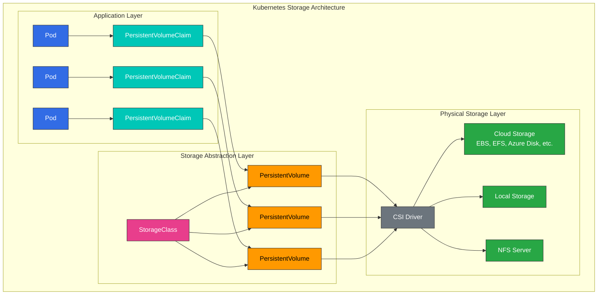
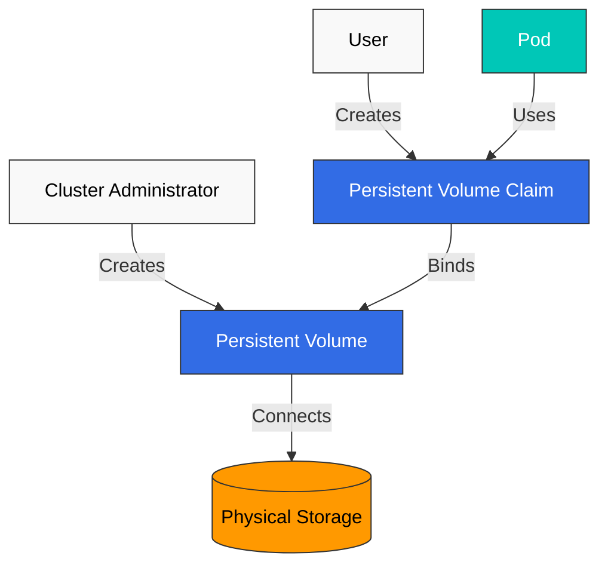
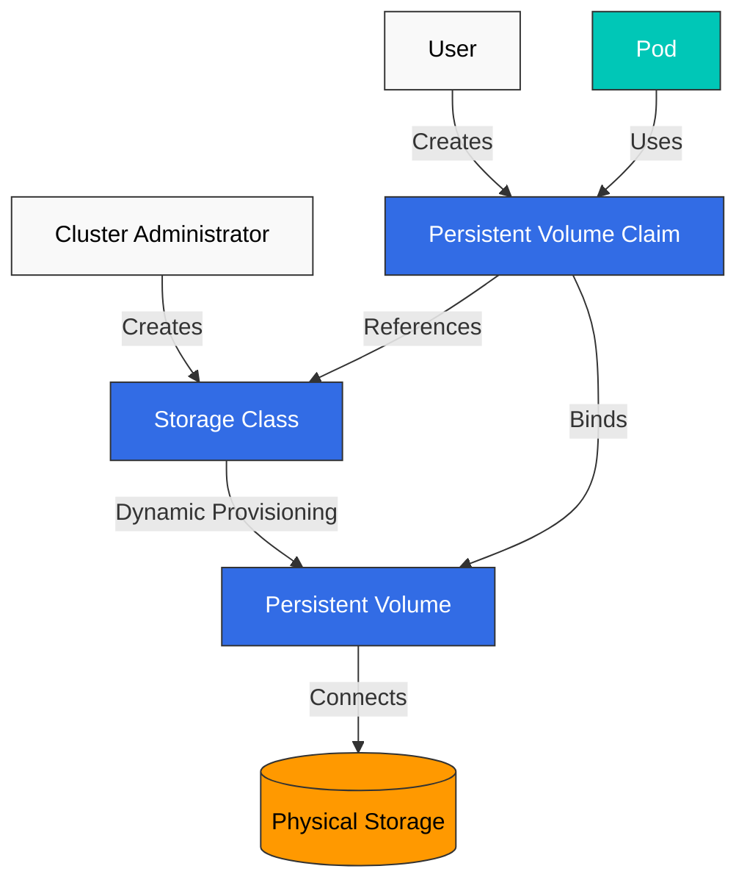
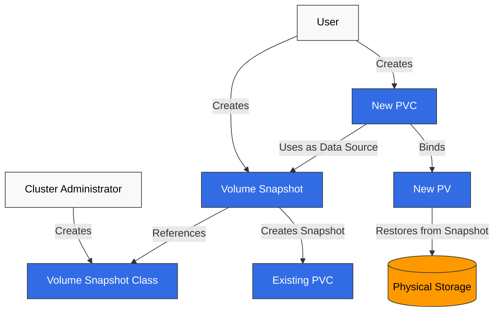
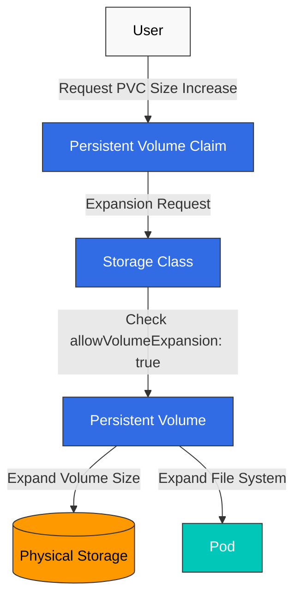
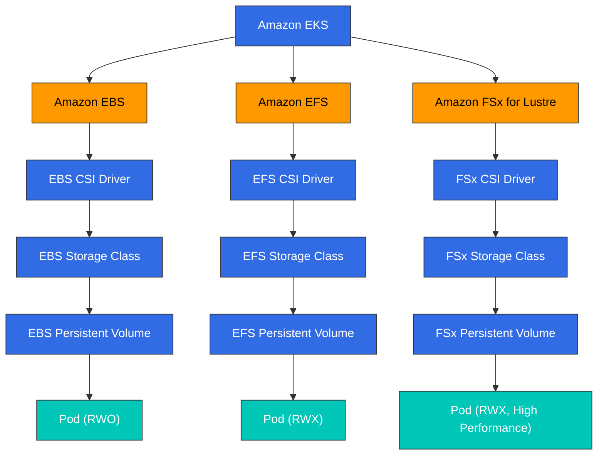

# Storage

> **Versiones compatibles**: Kubernetes 1.32, 1.33, 1.34
> **Última actualización**: February 19, 2026

En Kubernetes, el storage es una parte importante para almacenar y gestionar datos de aplicaciones en contenedores. En este capítulo, exploraremos en detalle los conceptos de storage de Kubernetes, incluidos Volumes, Persistent Volumes, Persistent Volume Claims y Storage Classes.

## Lab Environment Setup

Para seguir los ejemplos de este documento, necesitarás las siguientes herramientas y entorno:

### Required Tools
- kubectl v1.34 o superior
- Un cluster de Kubernetes en funcionamiento (EKS, minikube, kind, etc.)
- Storage provisioner (EBS CSI driver para EKS)

### Storage Example Setup

```bash
# Create namespace
kubectl create namespace storage-demo

# Create a simple PVC and Pod
kubectl -n storage-demo apply -f - <<EOF
apiVersion: v1
kind: PersistentVolumeClaim
metadata:
  name: data-pvc
spec:
  accessModes:
    - ReadWriteOnce
  resources:
    requests:
      storage: 1Gi
---
apiVersion: v1
kind: Pod
metadata:
  name: data-pod
spec:
  containers:
  - name: data-container
    image: busybox
    command: ["sh", "-c", "while true; do echo \$(date) >> /data/output.txt; sleep 5; done"]
    volumeMounts:
    - name: data-volume
      mountPath: /data
  volumes:
  - name: data-volume
    persistentVolumeClaim:
      claimName: data-pvc
EOF

# Check storage resources
kubectl -n storage-demo get pvc,pod
```

## Table of Contents

1. [Volumes](#volumes)
2. [Persistent Volumes](#persistent-volumes)
3. [Persistent Volume Claims](#persistent-volume-claims)
4. [Storage Classes](#storage-classes)
5. [Dynamic Provisioning](#dynamic-provisioning)
6. [Volume Snapshots](#volume-snapshots)
7. [Volume Expansion](#volume-expansion)
8. [Projected Volumes](#projected-volumes)
9. [Generic Ephemeral Volumes](#generic-ephemeral-volumes)
10. [Block Volume Mode](#block-volume-mode)
11. [Volume Cloning](#volume-cloning)
12. [Storage ResourceQuota](#storage-resourcequota)
13. [Storage Options in EKS](#storage-options-in-eks)

## Volumes

> **Concepto clave**: Los Kubernetes Volumes son directorios donde los containers dentro de un Pod pueden almacenar y compartir datos, manteniendo los datos independientemente de los reinicios del container.

Los Kubernetes Volumes son directorios donde los containers dentro de un Pod pueden almacenar y compartir datos. Los Volumes están vinculados al ciclo de vida del Pod, y cuando se elimina el Pod, el volume también se elimina (excepto para algunos tipos de volume).

### Kubernetes Storage Architecture



### Why Volumes Are Needed

1. **Persistencia de datos al reiniciar el container**: Cuando un container se reinicia, su filesystem se restablece, pero el uso de volumes permite que los datos persistan.
2. **Uso compartido de datos entre containers**: Varios containers en el mismo Pod pueden compartir datos mediante volumes.

### Main Volume Type Comparison

| Tipo de Volume | Ciclo de vida | Persistencia de datos | Caso de uso | Características |
|------------|----------|-----------------|----------|----------|
| **emptyDir** | Pod | Temporal | Datos temporales, cache, checkpoints | Los datos se eliminan cuando se elimina el Pod |
| **hostPath** | Node | Nivel de Node | Acceso al filesystem del Node, monitoreo | Riesgo de seguridad: usar con precaución |
| **configMap** | Configuración | Datos de configuración | Configuración de la aplicación | Monta datos de configuración como volume |
| **secret** | Configuración | Datos sensibles | Certificados, contraseñas | Monta datos sensibles como volume |
| **persistentVolumeClaim** | Cluster | Permanente | Bases de datos, almacenamiento de archivos | Los datos persisten después del reinicio y la reprogramación del Pod |

### emptyDir

Un volume `emptyDir` se crea cuando un Pod se asigna a un node y persiste mientras el Pod se ejecuta en ese node. Cuando el Pod se elimina del node, los datos en `emptyDir` se eliminan permanentemente.

```yaml
apiVersion: v1
kind: Pod
metadata:
  name: test-pd
spec:
  containers:
  - image: nginx
    name: test-container
    volumeMounts:
    - mountPath: /cache
      name: cache-volume
  volumes:
  - name: cache-volume
    emptyDir: {}
```

### hostPath

Un volume `hostPath` monta un archivo o directorio desde el filesystem del node al Pod. Esto es útil para Pods que necesitan acceso al filesystem del node, pero debe usarse con precaución debido a los riesgos de seguridad.

```yaml
apiVersion: v1
kind: Pod
metadata:
  name: test-hostpath
spec:
  containers:
  - image: nginx
    name: test-container
    volumeMounts:
    - mountPath: /test-pd
      name: test-volume
  volumes:
  - name: test-volume
    hostPath:
      path: /data
      type: Directory  # DirectoryOrCreate, Directory, FileOrCreate, File, Socket, CharDevice, BlockDevice
```

```yaml
apiVersion: v1
kind: Pod
metadata:
  name: test-pd
spec:
  containers:
  - image: nginx
    name: test-container
    volumeMounts:
    - mountPath: /test-pd
      name: test-volume
  volumes:
  - name: test-volume
    hostPath:
      path: /data
      type: Directory
```

#### configMap

Un volume `configMap` monta datos de ConfigMap en un Pod. Los ConfigMaps se usan para almacenar datos de configuración en pares clave-valor.

```yaml
apiVersion: v1
kind: Pod
metadata:
  name: configmap-pod
spec:
  containers:
  - name: test
    image: busybox
    volumeMounts:
    - name: config-vol
      mountPath: /etc/config
  volumes:
  - name: config-vol
    configMap:
      name: log-config
      items:
      - key: log_level
        path: log_level
```

#### secret

Un volume `secret` monta datos de Secret en un Pod. Los Secrets se usan para almacenar información sensible, como contraseñas, tokens y keys.

```yaml
apiVersion: v1
kind: Pod
metadata:
  name: secret-pod
spec:
  containers:
  - name: test
    image: busybox
    volumeMounts:
    - name: secret-vol
      mountPath: /etc/secret
      readOnly: true
  volumes:
  - name: secret-vol
    secret:
      secretName: mysecret
      items:
      - key: username
        path: my-username
```

#### nfs

Un volume `nfs` monta un recurso compartido NFS (Network File System) existente en un Pod.

```yaml
apiVersion: v1
kind: Pod
metadata:
  name: nfs-pod
spec:
  containers:
  - name: test
    image: busybox
    volumeMounts:
    - name: nfs-vol
      mountPath: /mnt/nfs
  volumes:
  - name: nfs-vol
    nfs:
      server: nfs-server.example.com
      path: /share
```

#### persistentVolumeClaim

Un volume `persistentVolumeClaim` monta un PersistentVolumeClaim en un Pod. Este es uno de los tipos de volume más usados.

```yaml
apiVersion: v1
kind: Pod
metadata:
  name: pvc-pod
spec:
  containers:
  - name: test
    image: busybox
    volumeMounts:
    - name: pvc-vol
      mountPath: /mnt/pvc
  volumes:
  - name: pvc-vol
    persistentVolumeClaim:
      claimName: my-pvc
```

#### CSI (Container Storage Interface)

Los CSI volumes proporcionan una interfaz estándar entre Kubernetes y sistemas de storage externos. Usando CSI, los proveedores de storage pueden desarrollar sus propios storage drivers sin modificar el código de Kubernetes.

```yaml
apiVersion: v1
kind: Pod
metadata:
  name: csi-pod
spec:
  containers:
  - name: test
    image: busybox
    volumeMounts:
    - name: csi-vol
      mountPath: /mnt/csi
  volumes:
  - name: csi-vol
    csi:
      driver: csi-driver.example.com
      volumeAttributes:
        foo: bar
      nodePublishSecretRef:
        name: csi-secret
```

## Persistent Volumes

Un Persistent Volume (PV) es storage del cluster aprovisionado por un administrador o aprovisionado dinámicamente mediante una Storage Class. Los PVs tienen un ciclo de vida independiente de los Pods, y los PVs se conservan incluso cuando se eliminan los Pods.



### PV Creation

```yaml
apiVersion: v1
kind: PersistentVolume
metadata:
  name: pv0001
spec:
  capacity:
    storage: 5Gi
  volumeMode: Filesystem
  accessModes:
    - ReadWriteOnce
  persistentVolumeReclaimPolicy: Recycle
  storageClassName: slow
  mountOptions:
    - hard
    - nfsvers=4.1
  nfs:
    path: /tmp
    server: 172.17.0.2
```

### PV Access Modes

Los PVs soportan los siguientes access modes:

- **ReadWriteOnce (RWO)**: El volume puede montarse como lectura-escritura por un solo node.
- **ReadOnlyMany (ROX)**: El volume puede montarse como solo lectura por varios nodes.
- **ReadWriteMany (RWX)**: El volume puede montarse como lectura-escritura por varios nodes.
- **ReadWriteOncePod (RWOP)**: El volume puede montarse como lectura-escritura por un solo Pod (Kubernetes 1.22+).

### PV Reclaim Policies

Los PVs pueden tener las siguientes reclaim policies:

- **Retain**: Cuando se elimina el PVC, el PV y los datos se conservan. El administrador debe limpiarlos manualmente.
- **Delete**: Cuando se elimina el PVC, el PV y los recursos de storage externos se eliminan automáticamente.
- **Recycle**: Cuando se elimina el PVC, los datos del PV se eliminan y el PV vuelve a estar disponible (obsoleto).

### PV Status

Los PVs pueden tener los siguientes estados:

- **Available**: Recurso disponible que aún no está vinculado a un claim.
- **Bound**: Vinculado a un claim.
- **Released**: El claim se eliminó, pero el recurso aún no fue reclamado por el cluster.
- **Failed**: Falló la reclamación automática.

## Persistent Volume Claims

Un Persistent Volume Claim (PVC) es una solicitud de storage de un usuario. Los PVCs son similares a los PVs, pero los PVCs son la forma en que los usuarios solicitan storage, mientras que los PVs son la forma en que los administradores proporcionan storage.

### PVC Creation

```yaml
apiVersion: v1
kind: PersistentVolumeClaim
metadata:
  name: myclaim
spec:
  accessModes:
    - ReadWriteOnce
  volumeMode: Filesystem
  resources:
    requests:
      storage: 8Gi
  storageClassName: slow
  selector:
    matchLabels:
      release: "stable"
    matchExpressions:
      - {key: environment, operator: In, values: [dev]}
```

### PVC and PV Binding

Cuando se crea un PVC, Kubernetes encuentra y vincula un PV que cumple los requisitos del PVC (tamaño de storage, access modes, storage class, selector, etc.). Si no existe un PV apropiado, el PVC permanece en estado Pending.

### Using PVC

Los PVCs pueden usarse como volumes en Pods:

```yaml
apiVersion: v1
kind: Pod
metadata:
  name: mypod
spec:
  containers:
    - name: myfrontend
      image: nginx
      volumeMounts:
      - mountPath: "/var/www/html"
        name: mypd
  volumes:
    - name: mypd
      persistentVolumeClaim:
        claimName: myclaim
```

## Storage Classes

Las Storage Classes describen las "classes" de storage proporcionadas por los administradores. Las Storage Classes se usan para aprovisionar PVs dinámicamente.



### Storage Class Creation

```yaml
apiVersion: storage.k8s.io/v1
kind: StorageClass
metadata:
  name: standard
provisioner: kubernetes.io/aws-ebs
parameters:
  type: gp3
  fsType: ext4
reclaimPolicy: Delete
allowVolumeExpansion: true
volumeBindingMode: WaitForFirstConsumer
```

Este ejemplo crea una storage class que aprovisiona volúmenes AWS EBS gp3.

### Provisioners

Las storage classes especifican un provisioner usado para aprovisionar volumes. Los provisioners comunes incluyen:

- `kubernetes.io/aws-ebs`: Volúmenes AWS EBS
- `kubernetes.io/gce-pd`: GCE Persistent Disks
- `kubernetes.io/azure-disk`: Azure Disks
- `kubernetes.io/azure-file`: Azure File
- `kubernetes.io/cinder`: Volúmenes OpenStack Cinder
- `kubernetes.io/glusterfs`: Volúmenes GlusterFS
- `kubernetes.io/rbd`: Volúmenes Ceph RBD
- `kubernetes.io/nfs`: Volúmenes NFS

### Volume Binding Modes

Las storage classes soportan los siguientes volume binding modes:

- **Immediate**: Predeterminado; los volumes se aprovisionan inmediatamente cuando se crea el PVC.
- **WaitForFirstConsumer**: Retrasa el aprovisionamiento del volume hasta que un Pod intenta usar el PVC. Esto es útil para garantizar que los volumes se aprovisionen en la misma zona que los Pods.

### Default Storage Class

Se puede establecer una storage class predeterminada para el cluster. Si no se especifica una storage class en un PVC, se usa la storage class predeterminada.

```yaml
apiVersion: storage.k8s.io/v1
kind: StorageClass
metadata:
  name: standard
  annotations:
    storageclass.kubernetes.io/is-default-class: "true"
provisioner: kubernetes.io/aws-ebs
parameters:
  type: gp3
```

## Dynamic Provisioning

El aprovisionamiento dinámico es una funcionalidad que crea PVs automáticamente cuando se crean PVCs. Esto permite a los usuarios solicitar storage cuando lo necesitan sin que los administradores tengan que crear PVs previamente.

### Dynamic Provisioning Example

1. Crear Storage Class:

```yaml
apiVersion: storage.k8s.io/v1
kind: StorageClass
metadata:
  name: fast
provisioner: kubernetes.io/aws-ebs
parameters:
  type: gp3
  iopsPerGB: "10"
```

2. Crear PVC:

```yaml
apiVersion: v1
kind: PersistentVolumeClaim
metadata:
  name: myclaim
spec:
  accessModes:
    - ReadWriteOnce
  resources:
    requests:
      storage: 100Gi
  storageClassName: fast
```

3. Usar PVC en Pod:

```yaml
apiVersion: v1
kind: Pod
metadata:
  name: mypod
spec:
  containers:
    - name: myfrontend
      image: nginx
      volumeMounts:
      - mountPath: "/var/www/html"
        name: mypd
  volumes:
    - name: mypd
      persistentVolumeClaim:
        claimName: myclaim
```

## Volume Snapshots

Kubernetes soporta volume snapshots para crear copias puntuales de PVs. Esto es útil para escenarios de backup y restauración.



### Volume Snapshot Class

```yaml
apiVersion: snapshot.storage.k8s.io/v1
kind: VolumeSnapshotClass
metadata:
  name: csi-hostpath-snapclass
driver: hostpath.csi.k8s.io
deletionPolicy: Delete
```

### Create Volume Snapshot

```yaml
apiVersion: snapshot.storage.k8s.io/v1
kind: VolumeSnapshot
metadata:
  name: new-snapshot
spec:
  volumeSnapshotClassName: csi-hostpath-snapclass
  source:
    persistentVolumeClaimName: myclaim
```

### Create PVC from Snapshot

```yaml
apiVersion: v1
kind: PersistentVolumeClaim
metadata:
  name: restore-pvc
spec:
  storageClassName: csi-hostpath-sc
  dataSource:
    name: new-snapshot
    kind: VolumeSnapshot
    apiGroup: snapshot.storage.k8s.io
  accessModes:
    - ReadWriteOnce
  resources:
    requests:
      storage: 10Gi
```

## Volume Expansion

Kubernetes soporta la capacidad de expandir el tamaño de los PVCs. Para esto, debe configurarse `allowVolumeExpansion: true` en la storage class.



### PVC Expansion

```yaml
apiVersion: v1
kind: PersistentVolumeClaim
metadata:
  name: myclaim
spec:
  accessModes:
    - ReadWriteOnce
  resources:
    requests:
      storage: 16Gi  # Expanded from original 8Gi to 16Gi
  storageClassName: standard
```

## Projected Volumes

Los projected volumes permiten combinar múltiples fuentes de volume en un único volume mount. Esto es útil cuando necesitas exponer secrets, configMaps, downwardAPI y serviceAccountToken juntos en un solo directorio.

### Supported Sources

- **secret**: Monta datos de secret
- **configMap**: Monta datos de configuración
- **downwardAPI**: Expone metadatos de pod y container
- **serviceAccountToken**: Monta tokens de service account con expiración configurable

### Projected Volume Example

```yaml
apiVersion: v1
kind: Pod
metadata:
  name: projected-volume-pod
spec:
  containers:
  - name: app
    image: busybox
    command: ["sh", "-c", "ls -la /etc/projected && sleep 3600"]
    volumeMounts:
    - name: all-in-one
      mountPath: /etc/projected
      readOnly: true
  volumes:
  - name: all-in-one
    projected:
      sources:
      - secret:
          name: db-credentials
          items:
          - key: username
            path: db/username
          - key: password
            path: db/password
      - configMap:
          name: app-config
          items:
          - key: config.yaml
            path: config/app.yaml
      - downwardAPI:
          items:
          - path: labels
            fieldRef:
              fieldPath: metadata.labels
          - path: cpu-request
            resourceFieldRef:
              containerName: app
              resource: requests.cpu
      - serviceAccountToken:
          path: token
          expirationSeconds: 3600
          audience: api
```

Esta configuración crea un único volume en `/etc/projected` que contiene:
- `/etc/projected/db/username` y `/etc/projected/db/password` desde el secret
- `/etc/projected/config/app.yaml` desde el configMap
- `/etc/projected/labels` y `/etc/projected/cpu-request` desde downwardAPI
- `/etc/projected/token` con un service account token que rota automáticamente

### Service Account Token Projection

La proyección de service account token proporciona tokens con vida útil limitada y audience:

```yaml
apiVersion: v1
kind: Pod
metadata:
  name: token-projected-pod
spec:
  serviceAccountName: my-service-account
  containers:
  - name: app
    image: myapp:latest
    volumeMounts:
    - name: token
      mountPath: /var/run/secrets/tokens
  volumes:
  - name: token
    projected:
      sources:
      - serviceAccountToken:
          path: api-token
          expirationSeconds: 7200  # 2 hours
          audience: my-api-service
```

## Generic Ephemeral Volumes

Los generic ephemeral volumes proporcionan storage similar a PVC que está vinculado al ciclo de vida del pod. A diferencia de emptyDir, usan toda la potencia de PVCs y StorageClasses, incluido el aprovisionamiento dinámico.

### Differences from emptyDir

| Característica | emptyDir | Generic Ephemeral Volume |
|---------|----------|--------------------------|
| **Storage backend** | Storage local del node o memoria | Cualquier CSI driver |
| **Provisioning** | Automático, simple | Usa StorageClass, aprovisionamiento dinámico |
| **Size limits** | sizeLimit (suave) | Gestión completa de capacidad de PVC |
| **Snapshots** | No soportado | Soportado (si el CSI driver lo soporta) |
| **Storage features** | Básicas | Funcionalidades CSI completas (cifrado, IOPS, etc.) |
| **Persistence** | Se pierde cuando se elimina el pod | Se pierde cuando se elimina el pod |

### Generic Ephemeral Volume Example

```yaml
apiVersion: v1
kind: Pod
metadata:
  name: ephemeral-volume-pod
spec:
  containers:
  - name: app
    image: busybox
    command: ["sh", "-c", "dd if=/dev/zero of=/scratch/data bs=1M count=100 && sleep 3600"]
    volumeMounts:
    - name: scratch
      mountPath: /scratch
  volumes:
  - name: scratch
    ephemeral:
      volumeClaimTemplate:
        metadata:
          labels:
            type: scratch-storage
        spec:
          accessModes:
          - ReadWriteOnce
          storageClassName: fast-ssd
          resources:
            requests:
              storage: 10Gi
```

### Use Cases

1. **CI/CD pipelines**: Artefactos temporales de build con capacidad de storage garantizada
2. **Procesamiento de datos**: Espacio scratch con requisitos de rendimiento específicos
3. **Testing**: Bases de datos temporales o caches con funcionalidades CSI
4. **Machine learning**: Checkpoints temporales de modelos con storage de alto rendimiento

### Deployment with Generic Ephemeral Volumes

```yaml
apiVersion: apps/v1
kind: Deployment
metadata:
  name: ml-training
spec:
  replicas: 3
  selector:
    matchLabels:
      app: ml-training
  template:
    metadata:
      labels:
        app: ml-training
    spec:
      containers:
      - name: trainer
        image: ml-trainer:latest
        volumeMounts:
        - name: checkpoint-storage
          mountPath: /checkpoints
      volumes:
      - name: checkpoint-storage
        ephemeral:
          volumeClaimTemplate:
            spec:
              accessModes:
              - ReadWriteOnce
              storageClassName: high-iops
              resources:
                requests:
                  storage: 50Gi
```

## Block Volume Mode

Kubernetes soporta raw block volumes además de filesystem volumes. Los block volumes presentan el storage como un dispositivo de bloque sin procesar, sin filesystem, lo que es útil para aplicaciones que gestionan su propio layout de datos.

### Filesystem vs Block Mode

| Aspecto | Filesystem (predeterminado) | Block |
|--------|---------------------|-------|
| **volumeMode** | `Filesystem` | `Block` |
| **Mount type** | Montado como directorio | Expuesto como archivo de dispositivo |
| **Filesystem** | ext4, xfs, etc. | Ninguno (raw) |
| **Access in pod** | `/mnt/data/` | `/dev/xvda` |
| **Use case** | Aplicaciones generales | Bases de datos, apps especializadas |

### Block Volume PV and PVC

```yaml
# PersistentVolume with Block mode
apiVersion: v1
kind: PersistentVolume
metadata:
  name: block-pv
spec:
  capacity:
    storage: 100Gi
  volumeMode: Block
  accessModes:
  - ReadWriteOnce
  persistentVolumeReclaimPolicy: Retain
  storageClassName: block-storage
  csi:
    driver: ebs.csi.aws.com
    volumeHandle: vol-0123456789abcdef0
---
# PersistentVolumeClaim for Block volume
apiVersion: v1
kind: PersistentVolumeClaim
metadata:
  name: block-pvc
spec:
  volumeMode: Block
  accessModes:
  - ReadWriteOnce
  storageClassName: block-storage
  resources:
    requests:
      storage: 100Gi
```

### Using Block Volumes in Pods

```yaml
apiVersion: v1
kind: Pod
metadata:
  name: block-volume-pod
spec:
  containers:
  - name: database
    image: custom-database:latest
    volumeDevices:
    - name: data
      devicePath: /dev/xvda
  volumes:
  - name: data
    persistentVolumeClaim:
      claimName: block-pvc
```

Nota: Los block volumes usan `volumeDevices` y `devicePath` en lugar de `volumeMounts` y `mountPath`.

### Use Cases for Block Volumes

1. **Bases de datos**: MySQL, PostgreSQL o MongoDB que se benefician del acceso directo al disco
2. **Filesystems personalizados**: Aplicaciones que usan filesystems especializados como ZFS o LVM
3. **Storage de alto rendimiento**: Aplicaciones que requieren I/O directo sin sobrecarga del filesystem
4. **Virtualización de storage**: Soluciones de storage definido por software

## Volume Cloning

Volume cloning crea un nuevo PVC con el contenido de un PVC existente. Esto es útil para crear entornos de prueba, duplicar datos o migrar workloads.

### Prerequisites

- El CSI driver debe soportar volume cloning
- Los PVCs de origen y destino deben estar en el mismo namespace
- El origen y el destino deben usar la misma StorageClass
- El origen y el destino deben tener el mismo volumeMode

### PVC Cloning Example

```yaml
# Source PVC (existing)
apiVersion: v1
kind: PersistentVolumeClaim
metadata:
  name: source-pvc
  namespace: production
spec:
  accessModes:
  - ReadWriteOnce
  storageClassName: ebs-sc
  resources:
    requests:
      storage: 100Gi
---
# Clone PVC using dataSource
apiVersion: v1
kind: PersistentVolumeClaim
metadata:
  name: cloned-pvc
  namespace: production
spec:
  accessModes:
  - ReadWriteOnce
  storageClassName: ebs-sc
  resources:
    requests:
      storage: 100Gi  # Must be >= source size
  dataSource:
    kind: PersistentVolumeClaim
    name: source-pvc
```

### Cloning vs Snapshots

| Característica | Volume Cloning | Volume Snapshots |
|---------|---------------|------------------|
| **Result** | Nuevo PVC con datos | Objeto snapshot |
| **Use case** | Duplicar volume en vivo | Backup puntual |
| **Performance** | Puede ser más lento (copia completa) | Normalmente más rápido (copy-on-write) |
| **Cross-namespace** | No | No |
| **Storage overhead** | Copia completa | Incremental |

### Clone for Testing

```yaml
apiVersion: v1
kind: PersistentVolumeClaim
metadata:
  name: test-db-clone
  namespace: staging
spec:
  accessModes:
  - ReadWriteOnce
  storageClassName: ebs-sc
  resources:
    requests:
      storage: 100Gi
  dataSource:
    kind: PersistentVolumeClaim
    name: production-db-pvc
---
apiVersion: v1
kind: Pod
metadata:
  name: test-database
  namespace: staging
spec:
  containers:
  - name: postgres
    image: postgres:15
    volumeMounts:
    - name: data
      mountPath: /var/lib/postgresql/data
  volumes:
  - name: data
    persistentVolumeClaim:
      claimName: test-db-clone
```

## Storage ResourceQuota

ResourceQuota puede limitar el consumo de storage dentro de un namespace, incluido el número de PVCs y la capacidad total de storage.

### Storage-Related Quota Fields

| Campo | Descripción |
|-------|-------------|
| **persistentvolumeclaims** | Número total de PVCs permitidos |
| **requests.storage** | Capacidad total de storage en todos los PVCs |
| **\<storage-class\>.storageclass.storage.k8s.io/requests.storage** | Capacidad de storage para una StorageClass específica |
| **\<storage-class\>.storageclass.storage.k8s.io/persistentvolumeclaims** | Conteo de PVCs para una StorageClass específica |

### ResourceQuota Example

```yaml
apiVersion: v1
kind: ResourceQuota
metadata:
  name: storage-quota
  namespace: team-a
spec:
  hard:
    # Total limits
    persistentvolumeclaims: "10"
    requests.storage: "500Gi"

    # Per-StorageClass limits
    ebs-sc.storageclass.storage.k8s.io/requests.storage: "200Gi"
    ebs-sc.storageclass.storage.k8s.io/persistentvolumeclaims: "5"

    efs-sc.storageclass.storage.k8s.io/requests.storage: "300Gi"
    efs-sc.storageclass.storage.k8s.io/persistentvolumeclaims: "5"
```

### Checking ResourceQuota Status

```bash
# View quota status
kubectl get resourcequota storage-quota -n team-a -o yaml

# Example output
status:
  hard:
    persistentvolumeclaims: "10"
    requests.storage: "500Gi"
  used:
    persistentvolumeclaims: "3"
    requests.storage: "150Gi"
```

### LimitRange for Storage

LimitRange puede establecer valores predeterminados y límites para las solicitudes de storage de PVC:

```yaml
apiVersion: v1
kind: LimitRange
metadata:
  name: storage-limits
  namespace: team-a
spec:
  limits:
  - type: PersistentVolumeClaim
    min:
      storage: 1Gi
    max:
      storage: 100Gi
    default:
      storage: 10Gi
```

Esto garantiza:
- El tamaño mínimo de PVC es 1Gi
- El tamaño máximo de PVC es 100Gi
- El tamaño predeterminado (si no se especifica) es 10Gi

## Storage Options in EKS

Hay varias opciones de storage disponibles en Amazon EKS. Cada opción tiene diferentes casos de uso y características de rendimiento, por lo que es importante elegir el storage adecuado para los requisitos de tu aplicación.



### Amazon EBS

Amazon EBS (Elastic Block Store) proporciona volúmenes de block storage que pueden adjuntarse a instancias EC2. En EKS, puedes usar el EBS CSI driver para montar volúmenes EBS en Kubernetes Pods.

#### EBS CSI Driver Installation

```bash
kubectl apply -k "github.com/kubernetes-sigs/aws-ebs-csi-driver/deploy/kubernetes/overlays/stable/?ref=master"
```

#### EBS Storage Class

```yaml
apiVersion: storage.k8s.io/v1
kind: StorageClass
metadata:
  name: ebs-sc
provisioner: ebs.csi.aws.com
parameters:
  type: gp3
  fsType: ext4
  encrypted: "true"
volumeBindingMode: WaitForFirstConsumer
```

#### EBS Volume Types

Amazon EBS ofrece varios tipos de volume:

1. **gp3**: Volúmenes SSD de propósito general adecuados para la mayoría de workloads. Proporciona una base de 3,000 IOPS y 125MB/s de throughput, ampliable hasta 16,000 IOPS y 1,000MB/s por costo adicional.

2. **io2**: Volúmenes SSD de alto rendimiento adecuados para workloads que requieren IOPS altos. Proporciona hasta 500 IOPS por GiB, ampliable hasta 64,000 IOPS.

3. **st1**: Volúmenes HDD optimizados para throughput, adecuados para workloads intensivos en throughput como big data, data warehouses y procesamiento de logs.

4. **sc1**: Volúmenes HDD fríos adecuados para datos a los que se accede con poca frecuencia.

#### EBS Storage Class Example (gp3)

```yaml
apiVersion: storage.k8s.io/v1
kind: StorageClass
metadata:
  name: ebs-gp3
provisioner: ebs.csi.aws.com
parameters:
  type: gp3
  iops: "3000"
  throughput: "125"
  encrypted: "true"
  kmsKeyId: "arn:aws:kms:us-west-2:111122223333:key/1234abcd-12ab-34cd-56ef-1234567890ab"
volumeBindingMode: WaitForFirstConsumer
```

#### EBS Storage Class Example (io2)

```yaml
apiVersion: storage.k8s.io/v1
kind: StorageClass
metadata:
  name: ebs-io2
provisioner: ebs.csi.aws.com
parameters:
  type: io2
  iops: "10000"
  encrypted: "true"
volumeBindingMode: WaitForFirstConsumer
```

### Amazon EFS

Amazon EFS (Elastic File System) proporciona storage de archivos escalable al que pueden acceder simultáneamente varias instancias EC2. EFS soporta el access mode ReadWriteMany, lo que lo hace útil cuando varios Pods necesitan compartir el mismo volume.

#### EFS CSI Driver Installation

```bash
kubectl apply -k "github.com/kubernetes-sigs/aws-efs-csi-driver/deploy/kubernetes/overlays/stable/?ref=master"
```

#### Create EFS File System

Para crear un EFS file system, puedes usar AWS Management Console, AWS CLI o AWS CloudFormation.

Ejemplo de AWS CLI:

```bash
# Create EFS file system
aws efs create-file-system \
  --creation-token eks-efs \
  --performance-mode generalPurpose \
  --throughput-mode bursting \
  --tags Key=Name,Value=EKS-EFS

# Store file system ID
FS_ID=$(aws efs describe-file-systems \
  --creation-token eks-efs \
  --query "FileSystems[0].FileSystemId" \
  --output text)

# Create mount target (for each subnet)
aws efs create-mount-target \
  --file-system-id $FS_ID \
  --subnet-id subnet-0eabfaa81fb22bcaf \
  --security-groups sg-068000ccf82dfba88
```

#### EFS Storage Class

```yaml
apiVersion: storage.k8s.io/v1
kind: StorageClass
metadata:
  name: efs-sc
provisioner: efs.csi.aws.com
parameters:
  provisioningMode: efs-ap
  fileSystemId: fs-1234abcd
  directoryPerms: "700"
```

#### EFS Access Point with PV and PVC

```yaml
# Persistent Volume
apiVersion: v1
kind: PersistentVolume
metadata:
  name: efs-pv
spec:
  capacity:
    storage: 5Gi
  volumeMode: Filesystem
  accessModes:
    - ReadWriteMany
  persistentVolumeReclaimPolicy: Retain
  storageClassName: efs-sc
  csi:
    driver: efs.csi.aws.com
    volumeHandle: fs-1234abcd::fsap-0123456789abcdef

# Persistent Volume Claim
apiVersion: v1
kind: PersistentVolumeClaim
metadata:
  name: efs-pvc
spec:
  accessModes:
    - ReadWriteMany
  storageClassName: efs-sc
  resources:
    requests:
      storage: 5Gi
```

#### EFS Performance Modes

EFS ofrece dos modos de rendimiento:

1. **General Purpose**: Modo predeterminado recomendado para la mayoría de workloads de file system. Proporciona baja latencia.

2. **Max I/O**: Adecuado para workloads que requieren alto throughput y procesamiento paralelo. Tiene una latencia ligeramente mayor, pero proporciona mayor throughput.

#### EFS Throughput Modes

EFS ofrece tres modos de throughput:

1. **Bursting**: El throughput base se asigna según el tamaño del file system, con créditos de ráfaga que proporcionan throughput temporalmente mayor.

2. **Provisioned**: Proporciona el throughput especificado independientemente del tamaño del file system.

3. **Elastic**: Escala automáticamente el throughput hacia arriba y hacia abajo según el workload.

### Amazon FSx for Lustre

Amazon FSx for Lustre proporciona file systems de alto rendimiento para workloads de high-performance computing. FSx for Lustre es adecuado para procesamiento de datos a gran escala, machine learning y workloads de analytics.

#### FSx for Lustre CSI Driver Installation

```bash
kubectl apply -k "github.com/kubernetes-sigs/aws-fsx-csi-driver/deploy/kubernetes/overlays/stable/?ref=master"
```

#### Create FSx for Lustre File System

Ejemplo de AWS CLI:

```bash
aws fsx create-file-system \
  --file-system-type LUSTRE \
  --storage-capacity 1200 \
  --subnet-ids subnet-0eabfaa81fb22bcaf \
  --lustre-configuration DeploymentType=SCRATCH_2,PerUnitStorageThroughput=200
```

#### FSx for Lustre Storage Class

```yaml
apiVersion: storage.k8s.io/v1
kind: StorageClass
metadata:
  name: fsx-sc
provisioner: fsx.csi.aws.com
parameters:
  subnetId: subnet-0eabfaa81fb22bcaf
  securityGroupIds: sg-068000ccf82dfba88
  deploymentType: SCRATCH_2
  automaticBackupRetentionDays: "0"
  dailyAutomaticBackupStartTime: "00:00"
  copyTagsToBackups: "false"
  perUnitStorageThroughput: "200"
  dataCompressionType: "NONE"
  weeklyMaintenanceStartTime: "7:09:00"
```

#### FSx for Lustre Deployment Types

FSx for Lustre ofrece tres tipos de deployment:

1. **SCRATCH_1**: Opción más económica para storage temporal y procesamiento a corto plazo. No hay replicación de datos, por lo que la durabilidad es baja.

2. **SCRATCH_2**: Proporciona mayor throughput de ráfaga que SCRATCH_1 y recupera datos automáticamente ante fallas de servidor.

3. **PERSISTENT**: Adecuado para workloads que requieren storage y throughput a largo plazo. Proporciona replicación de datos y recuperación automática.

#### FSx for Lustre Storage Capacity and Throughput

La capacidad de storage y el throughput de FSx for Lustre se configuran de la siguiente manera:

- **Storage Capacity**: Comienza en un mínimo de 1.2 TiB y aumenta en incrementos de 2.4 TiB.
- **Throughput**: Determinado por el tipo de deployment y la capacidad de storage.
  - SCRATCH_2: 200 MB/s o 1,000 MB/s por TiB de storage
  - PERSISTENT: 50 MB/s, 100 MB/s o 200 MB/s por TiB de storage

### FSx for Lustre Configuration for vLLM Workloads

Los workloads de modelos de AI a gran escala como vLLM (Vector Language Model) requieren storage con alto throughput y baja latencia. FSx for Lustre es una solución ideal que cumple estos requisitos.

#### FSx for Lustre Storage Class for vLLM

```yaml
apiVersion: storage.k8s.io/v1
kind: StorageClass
metadata:
  name: fsx-lustre-vllm
provisioner: fsx.csi.aws.com
parameters:
  subnetId: subnet-0eabfaa81fb22bcaf
  securityGroupIds: sg-068000ccf82dfba88
  deploymentType: PERSISTENT_1
  perUnitStorageThroughput: "200"
  dataCompressionType: "NONE"
  storageCapacity: "4800"  # 4.8 TiB
reclaimPolicy: Retain
volumeBindingMode: Immediate
```

#### PVC for vLLM Workloads

```yaml
apiVersion: v1
kind: PersistentVolumeClaim
metadata:
  name: vllm-model-storage
spec:
  accessModes:
    - ReadWriteMany
  resources:
    requests:
      storage: 4800Gi
  storageClassName: fsx-lustre-vllm
```

#### vLLM Deployment Example

```yaml
apiVersion: apps/v1
kind: Deployment
metadata:
  name: vllm-inference
spec:
  replicas: 1
  selector:
    matchLabels:
      app: vllm-inference
  template:
    metadata:
      labels:
        app: vllm-inference
    spec:
      nodeSelector:
        node.kubernetes.io/instance-type: g5.12xlarge
      containers:
      - name: vllm
        image: vllm-inference:latest
        resources:
          limits:
            nvidia.com/gpu: 4
          requests:
            nvidia.com/gpu: 4
            memory: "64Gi"
            cpu: "32"
        volumeMounts:
        - name: model-storage
          mountPath: /models
      volumes:
      - name: model-storage
        persistentVolumeClaim:
          claimName: vllm-model-storage
```

#### vLLM Performance Optimization Tips

1. **Seleccionar el throughput adecuado**: Para workloads vLLM, se recomienda elegir al menos 200 MB/s por TiB de throughput.

2. **Optimizar la capacidad de storage**: Asignar capacidad de storage suficiente considerando el tamaño del modelo y del dataset.

3. **Optimización de red**: Asegurar que el file system FSx for Lustre y los nodes de EKS estén en la misma availability zone.

4. **Selección del tipo de instancia**: Usar instancias GPU (por ejemplo, g5.12xlarge) para optimizar el rendimiento de workloads vLLM.

5. **Configuración de memoria**: Asignar memoria suficiente según el tamaño del modelo.

6. **Opciones de montaje del file system**: Usar opciones de montaje adecuadas para un rendimiento óptimo.

   ```bash
   mount -t lustre -o noatime,flock fs-1234abcd.fsx.us-west-2.amazonaws.com@tcp:/fsx /mnt/fsx
   ```

### Storage Option Comparison

| Opción de storage | Access Mode | Caso de uso | Rendimiento | Costo | Escalabilidad |
|---------------|-------------|----------|-------------|------|-------------|
| Amazon EBS | ReadWriteOnce | Block storage para un solo Pod | Medio-Alto | Medio | Limitada (un solo Node) |
| Amazon EFS | ReadWriteMany | File storage compartido por varios Pods | Medio | Medio-Alto | Alta (varios Nodes) |
| Amazon FSx for Lustre | ReadWriteMany | HPC, ML, Analytics | Muy alto | Alto | Muy alta (acceso paralelo) |

### EKS Storage Selection Guide

1. **Cuando se necesita block storage para un solo Pod**: Amazon EBS
   - Bases de datos
   - Aplicaciones stateful
   - Workloads que se ejecutan en un solo node

2. **Cuando se necesita file storage compartido por varios Pods**: Amazon EFS
   - Contenido de servidor web
   - Archivos de configuración compartidos
   - Procesamiento de datos a mediana escala

3. **Cuando se necesita file storage de alto rendimiento**: Amazon FSx for Lustre
   - Procesamiento de datos a gran escala
   - Workloads de machine learning e AI (vLLM, etc.)
   - High-performance computing (HPC)
   - Big data analytics

## Conclusion

En este capítulo, aprendimos sobre los conceptos de storage de Kubernetes. Los Volumes proporcionan una forma para que los containers dentro de un Pod almacenen y compartan datos, y Persistent Volumes y Persistent Volume Claims proporcionan storage con un ciclo de vida independiente de los Pods. Las Storage Classes permiten a los usuarios solicitar storage cuando lo necesitan mediante aprovisionamiento dinámico.

En EKS, hay varias opciones de storage disponibles, incluidas Amazon EBS, Amazon EFS y Amazon FSx for Lustre, cada una con diferentes casos de uso y características de rendimiento. Para workloads de modelos de AI a gran escala como vLLM, FSx for Lustre, con su alto throughput y baja latencia, es una opción ideal. FSx for Lustre es un file system paralelo que permite el acceso a datos desde varios nodes simultáneamente, lo que lo hace adecuado para tareas de entrenamiento e inferencia de modelos a gran escala.

Es importante elegir la opción de storage adecuada para los requisitos de tu aplicación. Elige Amazon EBS cuando se necesite block storage para un solo Pod, Amazon EFS cuando se necesite file storage compartido por varios Pods y Amazon FSx for Lustre cuando se necesite file storage de alto rendimiento.

En el próximo capítulo, aprenderemos sobre configuración y secrets de Kubernetes.

## Quiz

Para comprobar lo que aprendiste en este capítulo, intenta el [quiz de Storage](../quizzes/core/04-storage-quiz.md).

## References

- [Documentación oficial de Kubernetes - Volumes](https://kubernetes.io/docs/concepts/storage/volumes/)
- [Documentación oficial de Kubernetes - Persistent Volumes](https://kubernetes.io/docs/concepts/storage/persistent-volumes/)
- [Documentación oficial de Kubernetes - Storage Classes](https://kubernetes.io/docs/concepts/storage/storage-classes/)
- [Documentación oficial de Kubernetes - Volume Snapshots](https://kubernetes.io/docs/concepts/storage/volume-snapshots/)
- [AWS EBS CSI Driver](https://github.com/kubernetes-sigs/aws-ebs-csi-driver)
- [AWS EFS CSI Driver](https://github.com/kubernetes-sigs/aws-efs-csi-driver)
- [AWS FSx for Lustre CSI Driver](https://github.com/kubernetes-sigs/aws-fsx-csi-driver)
- [AWS Blog - Scaling your LLM inference workloads: Multi-node deployment with TensorRT-LLM and Triton on Amazon EKS](https://aws.amazon.com/ko/blogs/hpc/scaling-your-llm-inference-workloads-multi-node-deployment-with-tensorrt-llm-and-triton-on-amazon-eks/)
- [AWS Workshop - GenAI FSx EKS](https://catalog.workshops.aws/genaifsxeks/en-US/200-module2-genai/210-deploy)
